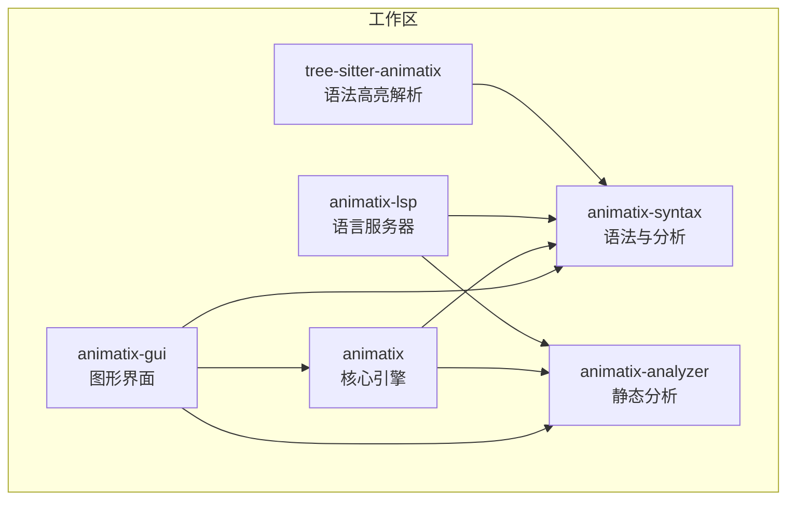
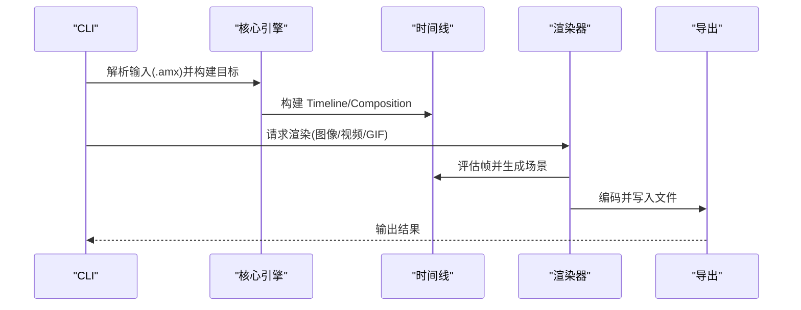
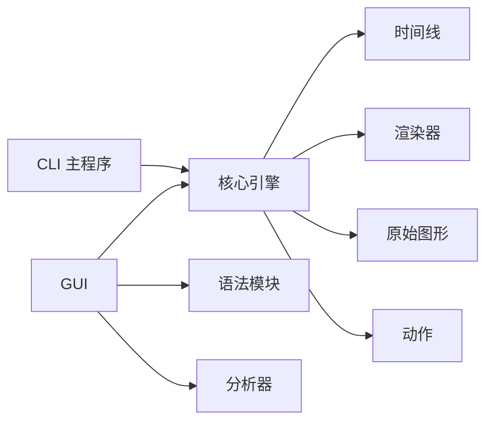

# API 参考

<cite>
**本文引用的文件**
- [lib.rs](file://crates/animatix/src/lib.rs)
- [Cargo.toml（核心引擎）](file://crates/animatix/Cargo.toml)
- [main.rs（CLI）](file://crates/animatix/src/main.rs)
- [Cargo.toml（GUI）](file://crates/animatix-gui/Cargo.toml)
- [lib.rs（GUI）](file://crates/animatix-gui/src/lib.rs)
- [main.rs（GUI 启动）](file://crates/animatix-gui/src/main.rs)
- [mod.rs（时间线模块）](file://crates/animatix/src/timeline/mod.rs)
- [mod.rs（渲染模块）](file://crates/animatix/src/renderer/mod.rs)
- [mod.rs（原始图形模块）](file://crates/animatix/src/primitives/mod.rs)
- [mod.rs（动作模块）](file://crates/animatix/src/timeline/actions/mod.rs)
- [track.rs（轨道与类型）](file://crates/animatix/src/timeline/track.rs)
- [types.rs（渲染类型）](file://crates/animatix/src/renderer/types.rs)
- [Cargo.toml（工作区）](file://Cargo.toml)
</cite>

## 目录
1. [简介](#简介)
2. [项目结构](#项目结构)
3. [核心组件](#核心组件)
4. [架构总览](#架构总览)
5. [详细组件分析](#详细组件分析)
6. [依赖关系分析](#依赖关系分析)
7. [性能考量](#性能考量)
8. [故障排查指南](#故障排查指南)
9. [结论](#结论)
10. [附录](#附录)

## 简介
本参考文档面向开发者，系统梳理 Animatix 的核心 API：时间线 API、渲染器 API、原始图形 API、动作 API，以及 GUI API（编辑器、预览系统、属性面板、工具栏）与 CLI API。文档覆盖各模块的公共接口、参数与返回值、使用示例、错误处理策略、版本兼容性与迁移建议，并通过图示帮助理解数据流与调用链。

## 项目结构
Animatix 采用多 crate 工作区组织，核心模块包括：
- 核心引擎（animatix）：时间线、渲染、原始图形、动作、语法与诊断等
- 图形界面（animatix-gui）：基于 egui 的编辑器、预览、面板与服务
- 语法与分析（animatix-syntax、animatix-analyzer）
- LSP（animatix-lsp）、树解析（tree-sitter-animatix）

图表来源
- [Cargo.toml（工作区）:1-11](file://Cargo.toml#L1-L11)

章节来源
- [Cargo.toml（工作区）:1-11](file://Cargo.toml#L1-L11)

## 核心组件
- 时间线（Timeline）：编译后的动画包，包含场景图、关键帧轨道、布局、颜色方案、文本编译器、缓存与运行时诊断
- 渲染器（Renderer）：离屏渲染、窗口预览、转场合成、导出（视频/GIF/图片）
- 原始图形（Primitives）：统一的原始图形系统，定义构建、渲染、评估与元数据
- 动作（Actions）：内置动作（入场、运动、退出、效果、重排、揭示）及其注册表
- GUI：编辑器、预览、属性面板、工具栏、命令总线、持久化与热重载

章节来源
- [lib.rs:1-24](file://crates/animatix/src/lib.rs#L1-L24)
- [mod.rs（时间线模块）:1-100](file://crates/animatix/src/timeline/mod.rs#L1-L100)
- [mod.rs（渲染模块）:1-57](file://crates/animatix/src/renderer/mod.rs#L1-L57)
- [mod.rs（原始图形模块）:1-120](file://crates/animatix/src/primitives/mod.rs#L1-L120)
- [mod.rs（动作模块）:1-80](file://crates/animatix/src/timeline/actions/mod.rs#L1-L80)

## 架构总览
下图展示从源码到渲染管线与导出的关键流程：

图表来源
- [main.rs（CLI）:316-715](file://crates/animatix/src/main.rs#L316-L715)
- [mod.rs（时间线模块）:554-720](file://crates/animatix/src/timeline/mod.rs#L554-L720)
- [mod.rs（渲染模块）:36-57](file://crates/animatix/src/renderer/mod.rs#L36-L57)

## 详细组件分析

### 时间线 API（Timeline）
- 职责与边界
  - 构建期：从 AST 降级为 Timeline，解析导入、展开组件、创建轨道、应用布局、编译文本/数学/代码路径、加载资源
  - 运行期：逐帧采样轨道、执行 always 修饰符、解析锚点/百分比位置、组装渲染场景
- 关键类型与接口
  - Timeline 结构体：包含轨道映射、背景色轨道、根节点、环境、修饰符程序、颜色方案、容器元数据、布局引擎、字体上下文、构建质量、变量轨道、音频片段、动作事件、绘图路径缓存、运行时诊断、修饰符哈希等
  - 场景维度与调试选项：SceneDimensions、DebugRenderOptions
  - 容器元数据：ContainerMetadata、ContainerLayoutChild、LayoutEngine
  - 变量轨道：VariableTrack
  - 音频片段：AudioSegment
  - 持续时间与关键帧：HasDuration、keyframe_times_s、duration_seconds
  - 布局类型：LayoutType（Row/Col/Grid/Stack）
- 公共方法要点
  - 新建：new/new_with_font_context
  - 查询：has_actor、actor_labels、find_common_parent、get_child_order、layout_children_for、compute_animated_layout
  - 评估：duration_seconds、keyframe_times_s
  - 缓存：帧缓存、变换缓存、静态子树缓存、场景缓冲、命中区域
- 使用示例
  - 获取时间线关键帧时间序列用于 GUI 时间轴标记
  - 计算容器在某时刻的子项布局位置
  - 在 GUI 中根据 DebugRenderOptions 绘制边界框或布局调试信息
- 错误处理
  - 未知动作、不支持的目标、容器无子节点但要求矢量揭示等会生成诊断
- 版本与兼容性
  - 构建质量（BuildQuality）影响绘图采样精度；Draft/Preview/Production 分别用于实时编辑、暂停/拖拽预览、导出

章节来源
- [mod.rs（时间线模块）:431-502](file://crates/animatix/src/timeline/mod.rs#L431-L502)
- [mod.rs（时间线模块）:554-625](file://crates/animatix/src/timeline/mod.rs#L554-L625)
- [mod.rs（时间线模块）:627-720](file://crates/animatix/src/timeline/mod.rs#L627-L720)
- [mod.rs（时间线模块）:777-800](file://crates/animatix/src/timeline/mod.rs#L777-L800)
- [mod.rs（时间线模块）:150-190](file://crates/animatix/src/timeline/mod.rs#L150-L190)
- [mod.rs（动作模块）:31-100](file://crates/animatix/src/timeline/actions/mod.rs#L31-L100)

### 渲染器 API（Renderer）
- 功能范围
  - 离屏渲染（OffscreenRenderer）、过渡合成（TransitionCompositor）
  - 导出：图像、视频、GIF；支持设置最大渲染线程、视频编码器、H264 预设
  - 文本渲染（可选）、滤镜后端（可选）、全屏贴纹（可选）
- 公共导出函数（按 CLI 命令）
  - Image：render_image_* 系列（单帧图像）
  - Video：render_video_* 系列（视频导出）
  - Gif：render_gif_* 系列（GIF 导出）
  - Composition：render_*_composition（多场景组合）
- 参数与返回
  - 输入：Timeline 或 Composition、尺寸、帧率、持续时间、输出路径、调试选项、导出设置
  - 返回：Result<(), String>，错误通过日志与进程退出码体现
- 使用示例
  - CLI 视频导出：指定宽度、高度、帧率、持续时间、保持末帧秒数、线程数、编码器与预设
  - CLI GIF 导出：指定宽度、高度、帧率、持续时间、保持末帧秒数、线程数
  - CLI 单帧图像：指定时间点与输出文件名
- 错误处理
  - 渲染失败、找不到场景、组件无场景等错误以诊断形式报告

章节来源
- [mod.rs（渲染模块）:36-57](file://crates/animatix/src/renderer/mod.rs#L36-L57)
- [main.rs（CLI）:336-446](file://crates/animatix/src/main.rs#L336-L446)
- [main.rs（CLI）:346-382](file://crates/animatix/src/main.rs#L346-L382)
- [main.rs（CLI）:401-445](file://crates/animatix/src/main.rs#L401-L445)
- [main.rs（CLI）:472-509](file://crates/animatix/src/main.rs#L472-L509)
- [main.rs（CLI）:556-564](file://crates/animatix/src/main.rs#L556-L564)

### 原始图形 API（Primitives）
- 统一原始图形系统
  - PRIMITIVES 注册表：集中管理所有原始图形（形状、文本、媒体、绘图、容器）
  - ActorKindMeta：自动生成的元数据注册表
  - Primitive trait：构建、渲染、评估、默认属性、分配阶段处理、GUI 默认属性、尺寸调整模式等
- 上下文与命令
  - BuildCtx、AssignmentCtx、RenderCtx、EvaluateCtx、TextCompileCtx
  - RenderCommand：Paths、Text、Image，支持执行到 Vello 场景、计算本地边界
- 公共接口
  - find_primitive、actor_kind_registry、actor_kind_meta、actor_kind_meta_by_name
  - evaluate_text_paths、sample_shape_style、evaluate_shape_render
- 使用示例
  - 通过 EvaluateCtx 在帧评估时生成渲染命令
  - 使用 RenderCommand::execute 将命令绘制到 Vello 场景
- 错误处理
  - 渲染错误通过 RenderError 抛出

章节来源
- [mod.rs（原始图形模块）:570-587](file://crates/animatix/src/primitives/mod.rs#L570-L587)
- [mod.rs（原始图形模块）:590-641](file://crates/animatix/src/primitives/mod.rs#L590-L641)
- [mod.rs（原始图形模块）:197-266](file://crates/animatix/src/primitives/mod.rs#L197-L266)
- [mod.rs（原始图形模块）:268-414](file://crates/animatix/src/primitives/mod.rs#L268-L414)
- [mod.rs（原始图形模块）:416-568](file://crates/animatix/src/primitives/mod.rs#L416-L568)

### 动作 API（Actions）
- 内置动作类别
  - 效果：Bounce、Pulse、Shake
  - 入场：FadeIn、WipeIn
  - 运动：Move、Shift、Rotate、Scale
  - 退出：FadeOut
  - 重排：Swap、Reorder
  - 揭示：DrawIn、DrawOut、RevealIn、RevealOut、WipeOut
- 关键流程
  - process_action：按动作动词查找并执行，自动展开组目标，记录 ActionEvent 供 GUI 可视化
  - expand_group_targets：将组目标递归展开为叶子节点（容器动作除外）
  - ensure_target_exists、ensure_vector_reveal_target：校验目标存在与适用性
  - get_action_signatures：暴露所有动作签名供 LSP/UI 使用
- 参数与返回
  - 输入：Action（动词、目标、参数、修饰符）、时间（毫秒）、Timeline、诊断收集器
  - 输出：副作用（修改 Timeline 的轨道与元数据），并产生诊断
- 使用示例
  - 执行“交换”两个容器子项的顺序
  - 执行“移动”目标到新位置
  - 执行“绘制”显示矢量路径
- 错误处理
  - 未知动作、目标不存在、容器节点不支持矢量揭示等生成诊断

章节来源
- [mod.rs（动作模块）:224-283](file://crates/animatix/src/timeline/actions/mod.rs#L224-L283)
- [mod.rs（动作模块）:102-160](file://crates/animatix/src/timeline/actions/mod.rs#L102-L160)
- [mod.rs（动作模块）:162-222](file://crates/animatix/src/timeline/actions/mod.rs#L162-L222)
- [mod.rs（动作模块）:247-275](file://crates/animatix/src/timeline/actions/mod.rs#L247-L275)

### GUI API（编辑器、预览、属性面板、工具栏）
- 启动与入口
  - GUI 二进制入口：读取命令行参数，初始化日志，调用 run_gui
  - GUI 库导出：lib.rs 暴露 app、editor、preview_surface 等模块
- 核心概念
  - 播放控制：PlaybackController（当前时间、时长、播放状态、速度、循环区域、往返播放、帧码）
  - 文档会话：DocumentSession、默认文件路径、重建工作线程
  - 预览表面：PreviewSurface（窗口化预览）
  - 命令总线：ActionQueue、Command、Effect、ShellAction
  - 存储层：UI Store、历史 Store、预览 Store、导出 Store、工作区 Store、源码 Store
  - 面板与组件：侧边栏、编辑器、预览面板、检查器（属性组、关键帧表格、图编辑器、电子表格）、时间轴面板、工具栏、插入调色板、导出对话框、设置等
- 使用示例
  - 初始化 GUI 并打开指定文件
  - 通过播放控制器进行拖拽预览、帧步进、循环区域设置
  - 在属性面板中修改属性并触发重建
  - 使用插入调色板添加原始图形或容器
- 错误处理
  - 诊断汇总与可视化（设计令牌、诊断弹窗、吐司提示）

章节来源
- [main.rs（GUI 启动）:1-12](file://crates/animatix-gui/src/main.rs#L1-L12)
- [lib.rs（GUI）:1-18](file://crates/animatix-gui/src/lib.rs#L1-L18)
- [mod.rs（GUI 模块）:58-92](file://crates/animatix-gui/src/app/mod.rs#L58-L92)
- [mod.rs（GUI 模块）:94-200](file://crates/animatix-gui/src/app/mod.rs#L94-L200)

### CLI API
- 命令与参数
  - 全局
    - -v, --verbose：增加详细程度（info/debug/trace）
    - --no-color：禁用 ANSI 彩色输出
  - ast：解析并打印 AST（支持紧凑/非紧凑输出）
  - image：渲染单帧图像（width、height、time、output、--debug-bounds）
  - video：渲染视频（width、height、fps、duration、hold、output、--debug-bounds、-j/--threads、--codec、--preset）
  - gif：渲染 GIF（width、height、fps、duration、hold、output、--debug-bounds、-j/--threads）
  - check：检查（file、--render-smoke、--format=text/json）
  - fmt：格式化（paths、--check、--indent）
  - lint：静态检查（paths、--format=text/json、--deny-warnings、--config）
- 输出与行为
  - 文本/JSON 诊断输出
  - 默认输出文件名（时间戳）
  - 渲染烟雾测试（单帧渲染以捕获渲染器问题）
- 使用示例
  - animatix video input.amx --width 1920 --height 1080 --fps 30 --duration 10 --hold 1 --threads auto --codec auto --preset medium --output out.mp4
  - animatix gif input.amx --width 640 --height 360 --fps 15 --threads auto --output out.gif
  - animatix image input.amx --width 1280 --height 720 --time 0 --output frame.png
  - animatix check input.amx --format json
  - animatix fmt . --check --indent 2
  - animatix lint . --format json --deny-warnings --config .amx.toml
- 错误处理
  - 解析/读取失败、渲染失败、诊断中含错误时退出码 1

章节来源
- [main.rs（CLI）:12-204](file://crates/animatix/src/main.rs#L12-L204)
- [main.rs（CLI）:336-715](file://crates/animatix/src/main.rs#L336-L715)

## 依赖关系分析

图表来源
- [Cargo.toml（核心引擎）:14-37](file://crates/animatix/Cargo.toml#L14-L37)
- [Cargo.toml（GUI）:13-38](file://crates/animatix-gui/Cargo.toml#L13-L38)
- [lib.rs（GUI）:1-17](file://crates/animatix-gui/src/lib.rs#L1-L17)

章节来源
- [Cargo.toml（核心引擎）:14-37](file://crates/animatix/Cargo.toml#L14-L37)
- [Cargo.toml（GUI）:13-38](file://crates/animatix-gui/Cargo.toml#L13-L38)
- [lib.rs（GUI）:1-17](file://crates/animatix-gui/src/lib.rs#L1-L17)

## 性能考量
- 构建质量（BuildQuality）
  - Draft：实时编辑最快
  - Preview：暂停/拖拽预览平衡
  - Production：导出最高保真
- 缓存策略
  - 帧缓存、变换缓存、静态子树缓存、场景缓冲、命中区域缓存
- 多线程导出
  - 最大渲染线程（auto/数字）与视频编码器选择
- 文本与绘图采样
  - 构建质量缩放绘图采样容差、深度与分辨率
- 布局缓存
  - LayoutEngine 对容器布局结果进行缓存，避免重复计算

章节来源
- [mod.rs（时间线模块）:150-190](file://crates/animatix/src/timeline/mod.rs#L150-L190)
- [mod.rs（时间线模块）:320-324](file://crates/animatix/src/timeline/mod.rs#L320-L324)
- [mod.rs（渲染模块）:36-57](file://crates/animatix/src/renderer/mod.rs#L36-L57)

## 故障排查指南
- 常见诊断
  - 未知动作：UnknownAction
  - 不支持的动作目标：UnsupportedActionTarget（如容器节点、图像/文本目标限制）
  - 修改器冲突：ConflictingModifierKey（如重叠的交换/重排）
  - 渲染失败：RenderFailure（可通过 --render-smoke 捕获）
- 诊断输出
  - 文本/JSON 格式可选；JSON 包含行列、严重级别、代码、消息与阶段
- 日志与颜色
  - 通过 -v 控制详细度；--no-color 禁用彩色输出
- GUI 诊断
  - 设计令牌、诊断弹窗、吐司提示与检查器中的诊断列表

章节来源
- [main.rs（CLI）:511-597](file://crates/animatix/src/main.rs#L511-L597)
- [mod.rs（动作模块）:31-100](file://crates/animatix/src/timeline/actions/mod.rs#L31-L100)

## 结论
本文档提供了 Animatix 的核心 API 参考，涵盖时间线、渲染、原始图形、动作、GUI 与 CLI 的接口规范、参数与返回值、使用示例与错误处理策略。结合构建质量、缓存与多线程导出等性能特性，开发者可高效地进行动画创作、编辑与批量导出。

## 附录

### 数据模型与类型摘要
- 渲染类型
  - TextPath：字形路径、颜色与不透明度
  - VelloPath：贝塞尔路径、可选填充与描边、线帽与连接方式

章节来源
- [types.rs（渲染类型）:1-41](file://crates/animatix/src/renderer/types.rs#L1-L41)

### 版本兼容性与迁移指南
- 版本与特性
  - 核心引擎与 GUI 均声明 Rust 1.85+，启用 features 控制渲染、视频、文本、SVG 功能
  - 渲染器导出 API 通过可选特性开关启用（render/video/text/svg）
- 迁移建议
  - 若从旧版本升级，优先检查渲染特性开关与导出 API 变更
  - 使用 check 命令配合 --render-smoke 进行渲染回归验证
  - 利用 fmt/lint 命令规范化与静态检查，减少构建期错误

章节来源
- [Cargo.toml（核心引擎）:7-12](file://crates/animatix/Cargo.toml#L7-L12)
- [Cargo.toml（核心引擎）:32-33](file://crates/animatix/Cargo.toml#L32-L33)
- [Cargo.toml（GUI）:8-11](file://crates/animatix-gui/Cargo.toml#L8-L11)
- [main.rs（CLI）:556-564](file://crates/animatix/src/main.rs#L556-L564)