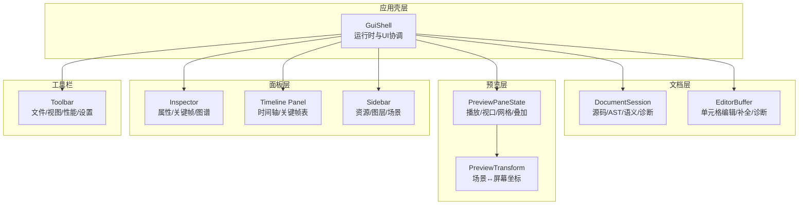
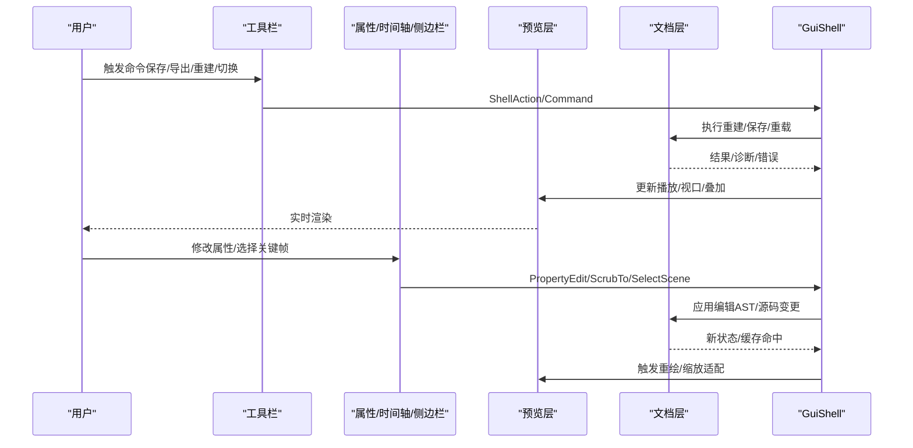
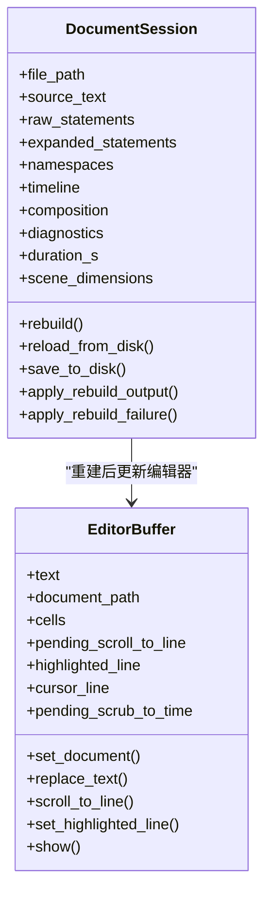
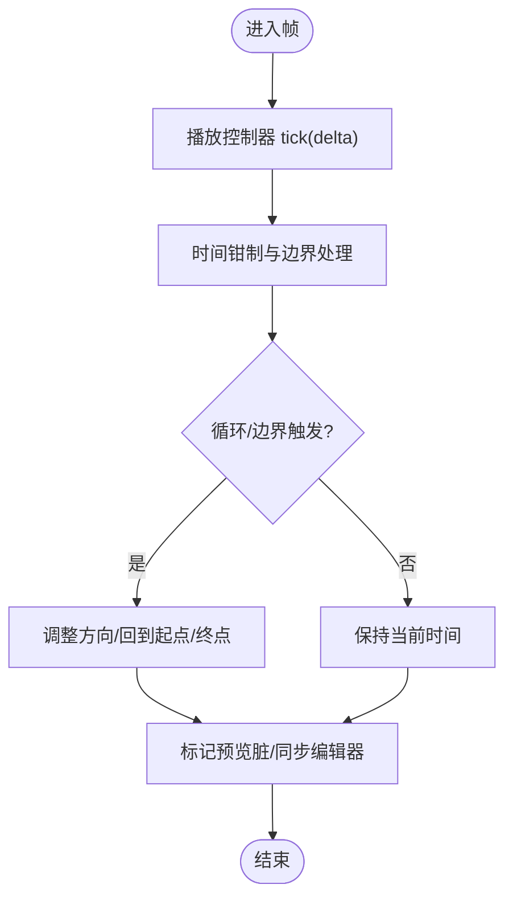
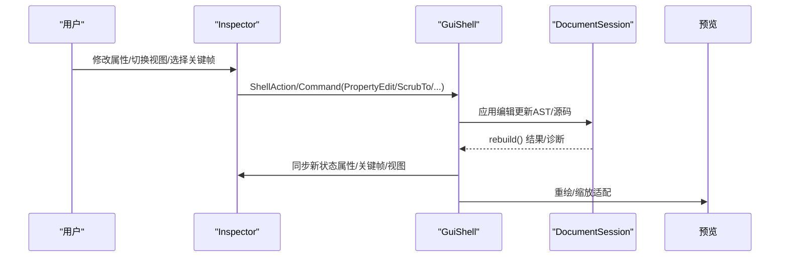
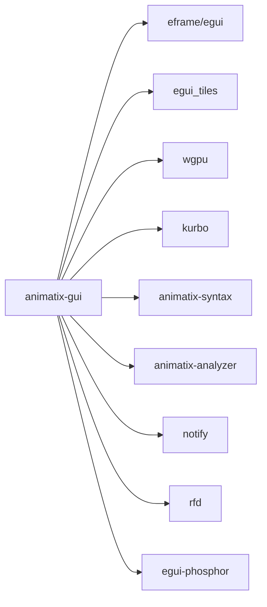

# GUI 应用 API

<cite>
**本文引用的文件**
- [lib.rs](file://crates/animatix-gui/src/lib.rs)
- [main.rs](file://crates/animatix-gui/src/main.rs)
- [Cargo.toml](file://crates/animatix-gui/Cargo.toml)
- [app/mod.rs](file://crates/animatix-gui/src/app/mod.rs)
- [document.rs](file://crates/animatix-gui/src/document.rs)
- [editor.rs](file://crates/animatix-gui/src/editor.rs)
- [panels/mod.rs](file://crates/animatix-gui/src/app/panels/mod.rs)
- [preview/mod.rs](file://crates/animatix-gui/src/app/preview/mod.rs)
- [shell/toolbar.rs](file://crates/animatix-gui/src/app/shell/toolbar.rs)
- [panels/inspector/mod.rs](file://crates/animatix-gui/src/app/panels/inspector/mod.rs)
</cite>

## 目录
1. [简介](#简介)
2. [项目结构](#项目结构)
3. [核心组件](#核心组件)
4. [架构总览](#架构总览)
5. [详细组件分析](#详细组件分析)
6. [依赖关系分析](#依赖关系分析)
7. [性能考量](#性能考量)
8. [故障排查指南](#故障排查指南)
9. [结论](#结论)
10. [附录](#附录)

## 简介
本文件为 Animatix GUI 应用的完整 API 文档，聚焦于编辑器 API、预览系统 API、属性面板 API、工具栏 API 与面板系统 API。文档面向开发者与集成者，提供接口定义、数据流、交互序列、状态模型与最佳实践，帮助快速理解与扩展 GUI 功能。

## 项目结构
Animatix GUI 基于 eframe/egui 构建，采用模块化组织：应用壳层（GuiShell）负责窗口生命周期与面板布局；文档层（DocumentSession）负责源码解析、类型检查与重建；预览层（PreviewPaneState）负责播放控制、视口变换与绘制叠加；面板层（Inspector/Timeline/Sidebar）提供属性编辑、时间轴与资源浏览；工具栏（Toolbar）提供全局控制与快捷入口。

图表来源
- [app/mod.rs:345-705](file://crates/animatix-gui/src/app/mod.rs#L345-L705)
- [document.rs:24-58](file://crates/animatix-gui/src/document.rs#L24-L58)
- [editor.rs:14-39](file://crates/animatix-gui/src/editor.rs#L14-L39)
- [preview/mod.rs:18-107](file://crates/animatix-gui/src/app/preview/mod.rs#L18-L107)
- [panels/mod.rs:1-160](file://crates/animatix-gui/src/app/panels/mod.rs#L1-L160)
- [shell/toolbar.rs:10-370](file://crates/animatix-gui/src/app/shell/toolbar.rs#L10-L370)

章节来源
- [lib.rs:1-18](file://crates/animatix-gui/src/lib.rs#L1-L18)
- [main.rs:1-12](file://crates/animatix-gui/src/main.rs#L1-L12)
- [Cargo.toml:1-49](file://crates/animatix-gui/Cargo.toml#L1-L49)

## 核心组件
- 应用壳层（GuiShell）
  - 负责窗口初始化、命令总线、热重载、预览帧循环与 UI 组合。
  - 关键职责：键盘快捷键分发、欢迎页/工作区切换、诊断面板、导出对话框、插入调色板等。
- 文档层（DocumentSession）
  - 负责加载/解析/重建动画脚本，维护 AST、命名空间、组件注册、诊断与时间索引。
  - 支持增量缓存（组件注册哈希、模块图缓存）以提升重建性能。
- 预览层（PreviewPaneState）
  - 统一播放控制（播放/暂停/步进/循环）、视口缩放/平移、网格/引导线/对齐吸附、性能 HUD、时间镜头与覆盖层。
- 面板层（Inspector/Timeline/Sidebar）
  - 属性面板：支持语义分组、强度流式、电子表格三种视图模式；关键帧曲线/表格；场景级属性。
  - 时间轴面板：关键帧列表/曲线图谱；与播放头联动。
  - 侧边栏：资源树/图层/场景/组件/资产。
- 工具栏（Toolbar）
  - 文件菜单（保存/导出/重载/重建/切换工作区）、多场景面包屑、视图切换（网格/引导线/标签/边界/布局/间距/性能）、缩放循环、诊断/检查器/设置/快捷键面板入口。

章节来源
- [app/mod.rs:345-705](file://crates/animatix-gui/src/app/mod.rs#L345-L705)
- [document.rs:24-58](file://crates/animatix-gui/src/document.rs#L24-L58)
- [preview/mod.rs:18-107](file://crates/animatix-gui/src/app/preview/mod.rs#L18-L107)
- [panels/mod.rs:22-62](file://crates/animatix-gui/src/app/panels/mod.rs#L22-L62)
- [shell/toolbar.rs:10-370](file://crates/animatix-gui/src/app/shell/toolbar.rs#L10-L370)

## 架构总览
GUI 采用“壳层-文档-预览-面板-工具栏”的分层设计，通过命令总线与状态存储实现解耦。编辑器缓冲区与文档会话双向同步，预览状态驱动渲染与交互反馈。

图表来源
- [app/mod.rs:544-705](file://crates/animatix-gui/src/app/mod.rs#L544-L705)
- [document.rs:206-337](file://crates/animatix-gui/src/document.rs#L206-L337)
- [preview/mod.rs:18-107](file://crates/animatix-gui/src/app/preview/mod.rs#L18-L107)
- [panels/inspector/mod.rs:53-79](file://crates/animatix-gui/src/app/panels/inspector/mod.rs#L53-L79)

## 详细组件分析

### 编辑器 API（DocumentSession 与 EditorBuffer）
- 文档管理
  - 加载与重建：从磁盘读取源码，构建模块图与命名空间，执行类型检查与构建目标生成，更新诊断与时间索引。
  - 源码变更：支持外部热重载与内部编辑变更，增量缓存避免重复编译。
  - 导出目标：单场景或组合场景的导出范围解析。
- 单元格编辑器（EditorBuffer）
  - 单元格解析与渲染，支持代码/关键帧单元格；自动完成、诊断提示、播放头跳转。
  - 行号映射、高亮行、光标定位、结构化增删改（复制/粘贴/插入/移动）。
  - 与文档层双向同步：文本变更触发重建，重建结果回填到编辑器。

图表来源
- [document.rs:24-58](file://crates/animatix-gui/src/document.rs#L24-L58)
- [document.rs:206-337](file://crates/animatix-gui/src/document.rs#L206-L337)
- [editor.rs:14-39](file://crates/animatix-gui/src/editor.rs#L14-L39)
- [editor.rs:246-457](file://crates/animatix-gui/src/editor.rs#L246-L457)

章节来源
- [document.rs:60-337](file://crates/animatix-gui/src/document.rs#L60-L337)
- [editor.rs:41-457](file://crates/animatix-gui/src/editor.rs#L41-L457)

### 预览系统 API（PlaybackController、ViewportState、PreviewTransform）
- 播放控制
  - 当前时间、时长、播放速度、循环区域（可选 ping-pong）、逐帧步进、时间码格式化。
- 视口与坐标
  - 缩放、平移、显示矩形计算、场景↔屏幕坐标转换、统一缩放策略（含最小缩放限制）。
- 叠加与交互
  - 网格/引导线/对齐吸附、性能 HUD、时间镜头、覆盖层开关、旋转/缩放/移动手柄绘制。
- 选择与拖拽
  - 多选包围盒、8 个缩放手柄、旋转环、枢轴标记；支持布局管理子项重排与顶点编辑。

图表来源
- [app/mod.rs:94-219](file://crates/animatix-gui/src/app/mod.rs#L94-L219)

章节来源
- [app/mod.rs:81-287](file://crates/animatix-gui/src/app/mod.rs#L81-L287)
- [preview/mod.rs:18-107](file://crates/animatix-gui/src/app/preview/mod.rs#L18-L107)
- [preview/mod.rs:423-641](file://crates/animatix-gui/src/app/preview/mod.rs#L423-L641)

### 属性面板 API（Inspector）
- 视图模式
  - 语义分组（分组渲染属性）、强度流式（按重要性排序）、电子表格（全量属性表）。
- 场景级属性
  - 组合场景下可编辑场景持续时间、起始时间、背景色、过渡目标/类型/时长/缓动。
- 关键帧视图
  - 列表/曲线两种模式，支持在时间轴上跳转与编辑。
- Pivot 与容器子项
  - 单选时显示枢轴偏移，支持重置；容器显示子项顺序与重排。
- 与命令总线交互
  - 所有编辑最终转化为 PropertyEdit/ScrubTo/SetSceneDuration 等命令，由壳层派发至文档层。

图表来源
- [panels/inspector/mod.rs:53-79](file://crates/animatix-gui/src/app/panels/inspector/mod.rs#L53-L79)
- [panels/inspector/mod.rs:429-789](file://crates/animatix-gui/src/app/panels/inspector/mod.rs#L429-L789)

章节来源
- [panels/inspector/mod.rs:26-51](file://crates/animatix-gui/src/app/panels/inspector/mod.rs#L26-L51)
- [panels/inspector/mod.rs:429-789](file://crates/animatix-gui/src/app/panels/inspector/mod.rs#L429-L789)

### 工具栏 API（Toolbar）
- 文件与工作区
  - 保存、导出、从磁盘重载、重建时间线、切换工作区目录。
- 多场景导航
  - 面包屑展示场景链路，点击切换场景。
- 视图与调试
  - 网格/引导线/标签/边界/布局/间距/性能 HUD 开关。
- 缩放循环
  - Fit/100%/150%/200% 循环切换，Fit 请求由预览层处理。
- 入口面板
  - 快捷键参考、设置、诊断面板、检查器、命令调色板、查找替换。

章节来源
- [shell/toolbar.rs:10-370](file://crates/animatix-gui/src/app/shell/toolbar.rs#L10-L370)

### 面板系统 API（Sidebar/Timeline/Inspector）
- Sidebar
  - 资源树/图层/场景/组件/资产等标签页，提供浏览与快速定位。
- Timeline Panel
  - 时间轴条带、关键帧列表/曲线图谱、播放头联动、时间跳转。
- Inspector
  - 如上所述，支持多种视图与关键帧编辑。
- 协作与同步
  - 面板状态与预览状态（播放/视口/叠加）通过 GuiShell 统一调度。

章节来源
- [panels/mod.rs:1-160](file://crates/animatix-gui/src/app/panels/mod.rs#L1-L160)
- [panels/mod.rs:22-62](file://crates/animatix-gui/src/app/panels/mod.rs#L22-L62)

## 依赖关系分析
- 运行时与 UI
  - eframe/egui：窗口框架与 UI 渲染。
  - egui_tiles：面板停靠与布局。
- 渲染与图形
  - wgpu：GPU 渲染后端。
  - kurbo：几何与路径运算。
- 语法与分析
  - animatix-syntax：解析/类型检查/补全/诊断。
  - animatix-analyzer：语言分析器。
- 文件与系统
  - notify：文件系统监控（热重载）。
  - rfd：跨平台对话框（打开/保存/导出）。
- 图标与主题
  - egui-phosphor：图标字体。
  - 自定义 design_tokens：颜色/尺寸/字体规范。

图表来源
- [Cargo.toml:13-41](file://crates/animatix-gui/Cargo.toml#L13-L41)

章节来源
- [Cargo.toml:1-49](file://crates/animatix-gui/Cargo.toml#L1-L49)

## 性能考量
- 增量重建
  - 使用源码与组件注册哈希判断是否需要重建；缓存模块图与展开结果，避免重复解析与编译。
- 预览帧循环
  - 按帧 tick 控制播放，仅在播放中或状态变化时标记预览脏，减少不必要重绘。
- 视口适配
  - 缩放循环与 Fit 请求在下一帧统一计算，避免频繁布局抖动。
- 诊断与 HUD
  - 诊断面板可折叠，性能 HUD 可关闭，降低渲染开销。

## 故障排查指南
- 热重载失败
  - 若编辑器存在未保存更改，外部文件变更会被阻止以免覆盖；先保存再重载。
- 构建失败
  - 文档层返回错误时，预览显示“最后成功构建”状态；修复语法/类型错误后自动恢复。
- 预览卡顿
  - 关闭性能 HUD/调试叠加；降低缩放倍数；减少复杂图层数量。
- 键盘快捷键冲突
  - 工具栏快捷键在非文本输入模式下生效；文本输入时优先交由编辑器处理。

章节来源
- [app/mod.rs:357-386](file://crates/animatix-gui/src/app/mod.rs#L357-L386)
- [document.rs:206-237](file://crates/animatix-gui/src/document.rs#L206-L237)

## 结论
本 API 文档梳理了 Animatix GUI 的编辑器、预览、属性面板、工具栏与面板系统的接口与协作方式。通过命令总线与状态存储，系统实现了清晰的职责分离与高效的增量更新。建议在扩展时遵循现有模式：以命令为中心、以状态为驱动、以增量重建为性能保障。

## 附录
- 快速集成步骤
  - 初始化应用：调用运行函数，传入可选初始文件路径。
  - 监听命令：在壳层中收集 ActionQueue 并派发到文档/预览/面板。
  - 编辑器接入：将 EditorBuffer 的文本变更回调映射为源码编辑命令。
  - 预览接入：订阅播放/视口/叠加状态变化，触发重绘与适配。
  - 面板接入：将面板的属性编辑与关键帧操作转化为命令，交由文档层应用。
- 常用命令与状态字段
  - 播放控制：播放/暂停/步进/循环区域/ping-pong/速度。
  - 视口控制：缩放/平移/Fit 请求/时间轴缩放与滚动。
  - 属性编辑：PropertyEdit/PropertyValue/ScrubTo/SelectScene/SetSceneDuration。
  - 视图切换：网格/引导线/标签/边界/布局/间距/性能 HUD。