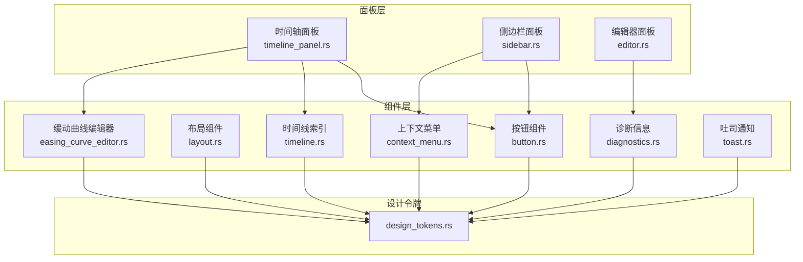
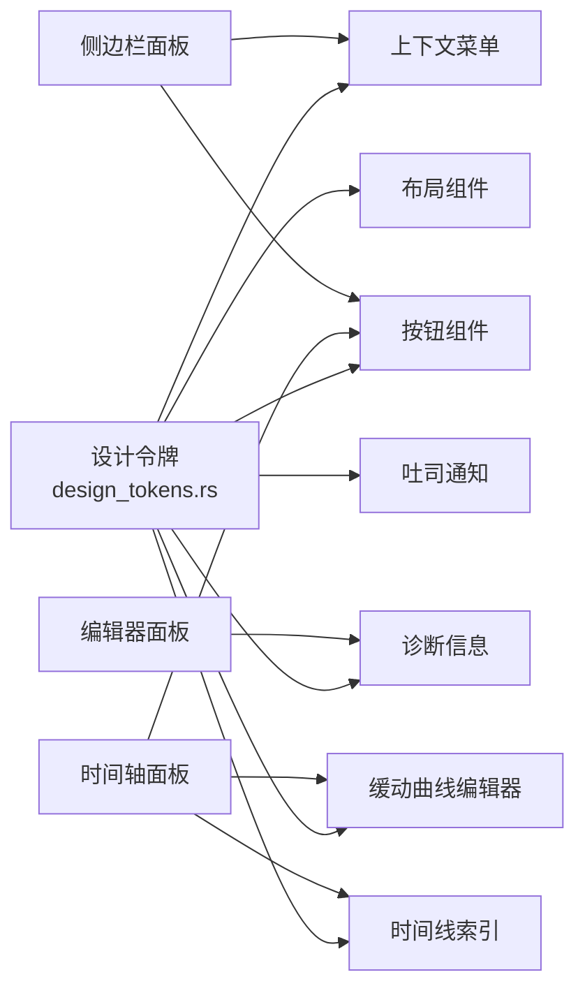
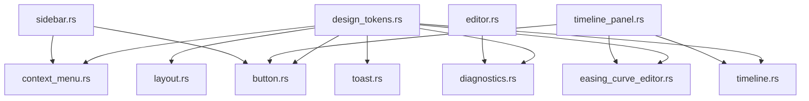

# UI 组件 API

<cite>
**本文引用的文件**
- [button.rs](file://crates/animatix-gui/src/app/components/button.rs)
- [context_menu.rs](file://crates/animatix-gui/src/app/components/context_menu.rs)
- [diagnostics.rs](file://crates/animatix-gui/src/app/components/diagnostics.rs)
- [easing_curve_editor.rs](file://crates/animatix-gui/src/app/components/easing_curve_editor.rs)
- [layout.rs](file://crates/animatix-gui/src/app/components/layout.rs)
- [timeline.rs](file://crates/animatix-gui/src/app/components/timeline.rs)
- [toast.rs](file://crates/animatix-gui/src/app/components/toast.rs)
- [design_tokens.rs](file://crates/animatix-gui/src/app/design_tokens.rs)
- [timeline_panel.rs](file://crates/animatix-gui/src/app/panels/timeline_panel.rs)
- [sidebar.rs](file://crates/animatix-gui/src/app/panels/sidebar.rs)
- [editor.rs](file://crates/animatix-gui/src/app/panels/editor.rs)
</cite>

## 目录
1. [简介](#简介)
2. [项目结构](#项目结构)
3. [核心组件](#核心组件)
4. [架构总览](#架构总览)
5. [组件详解](#组件详解)
6. [依赖关系分析](#依赖关系分析)
7. [性能考量](#性能考量)
8. [故障排查指南](#故障排查指南)
9. [结论](#结论)
10. [附录](#附录)

## 简介
本文件系统性梳理 Animatix GUI 中的 UI 组件 API，覆盖按钮、布局容器、缓动曲线编辑器、上下文菜单、诊断信息、时间线索引与吐司通知等模块。文档以“可读性优先”为目标，既给出清晰的接口定义与行为说明，也提供流程图与时序图帮助理解交互逻辑，并附带常见问题与最佳实践建议。

## 项目结构
UI 组件主要位于 crates/animatix-gui/src/app/components 下，配合统一的设计令牌 crates/animatix-gui/src/app/design_tokens.rs 提供颜色、间距、字号、半径等视觉规范；面板层（如时间轴面板、侧边栏）在 crates/animatix-gui/src/app/panels 下调用组件完成具体界面。

图表来源
- [button.rs:1-258](file://crates/animatix-gui/src/app/components/button.rs#L1-L258)
- [layout.rs:1-256](file://crates/animatix-gui/src/app/components/layout.rs#L1-L256)
- [context_menu.rs:1-375](file://crates/animatix-gui/src/app/components/context_menu.rs#L1-L375)
- [diagnostics.rs:1-221](file://crates/animatix-gui/src/app/components/diagnostics.rs#L1-L221)
- [easing_curve_editor.rs:1-173](file://crates/animatix-gui/src/app/components/easing_curve_editor.rs#L1-L173)
- [timeline.rs:1-85](file://crates/animatix-gui/src/app/components/timeline.rs#L1-L85)
- [toast.rs:1-174](file://crates/animatix-gui/src/app/components/toast.rs#L1-L174)
- [design_tokens.rs:1-291](file://crates/animatix-gui/src/app/design_tokens.rs#L1-L291)
- [timeline_panel.rs:1-200](file://crates/animatix-gui/src/app/panels/timeline_panel.rs#L1-L200)
- [sidebar.rs:1-200](file://crates/animatix-gui/src/app/panels/sidebar.rs#L1-L200)
- [editor.rs:1-31](file://crates/animatix-gui/src/app/panels/editor.rs#L1-L31)

章节来源
- [design_tokens.rs:1-291](file://crates/animatix-gui/src/app/design_tokens.rs#L1-L291)

## 核心组件
- 按钮组件：提供图标按钮、播放/暂停切换、工具栏动作/切换按钮、分隔线等，支持悬停、按下、焦点态与激活态视觉反馈。
- 布局组件：卡片容器、粘性标题、空状态占位、输入框框架、标签-输入行、胶囊式分段标签等。
- 上下文菜单：统一的菜单条目类型、渲染流程、浮动菜单与内部菜单两种模式。
- 诊断信息：滚动列表展示诊断消息，支持关闭、点击跳转源码位置。
- 缓动曲线编辑器：交互式三次贝塞尔曲线编辑，拖拽控制点并返回新状态。
- 时间线索引：关键帧标记、播放头、时间条带（可点击/拖拽获取时间）。
- 吐司通知：轻量级通知队列，支持多种严重级别，自动淡入淡出与过期清理。

章节来源
- [button.rs:1-258](file://crates/animatix-gui/src/app/components/button.rs#L1-L258)
- [layout.rs:1-256](file://crates/animatix-gui/src/app/components/layout.rs#L1-L256)
- [context_menu.rs:1-375](file://crates/animatix-gui/src/app/components/context_menu.rs#L1-L375)
- [diagnostics.rs:1-221](file://crates/animatix-gui/src/app/components/diagnostics.rs#L1-L221)
- [easing_curve_editor.rs:1-173](file://crates/animatix-gui/src/app/components/easing_curve_editor.rs#L1-L173)
- [timeline.rs:1-85](file://crates/animatix-gui/src/app/components/timeline.rs#L1-L85)
- [toast.rs:1-174](file://crates/animatix-gui/src/app/components/toast.rs#L1-L174)

## 架构总览
组件层通过设计令牌集中管理视觉变量，面板层按需组合组件实现复杂界面。组件之间低耦合，通过输入参数与返回值进行交互，避免直接共享状态。

图表来源
- [design_tokens.rs:1-291](file://crates/animatix-gui/src/app/design_tokens.rs#L1-L291)
- [button.rs:1-258](file://crates/animatix-gui/src/app/components/button.rs#L1-L258)
- [layout.rs:1-256](file://crates/animatix-gui/src/app/components/layout.rs#L1-L256)
- [context_menu.rs:1-375](file://crates/animatix-gui/src/app/components/context_menu.rs#L1-L375)
- [diagnostics.rs:1-221](file://crates/animatix-gui/src/app/components/diagnostics.rs#L1-L221)
- [easing_curve_editor.rs:1-173](file://crates/animatix-gui/src/app/components/easing_curve_editor.rs#L1-L173)
- [timeline.rs:1-85](file://crates/animatix-gui/src/app/components/timeline.rs#L1-L85)
- [toast.rs:1-174](file://crates/animatix-gui/src/app/components/toast.rs#L1-L174)
- [timeline_panel.rs:1-200](file://crates/animatix-gui/src/app/panels/timeline_panel.rs#L1-L200)
- [sidebar.rs:1-200](file://crates/animatix-gui/src/app/panels/sidebar.rs#L1-L200)
- [editor.rs:1-31](file://crates/animatix-gui/src/app/panels/editor.rs#L1-L31)

## 组件详解

### 按钮组件 API
- 功能概览
  - 图标按钮：小方块尺寸，悬停高亮，支持提示文本。
  - 彩色图标按钮：自定义图标颜色与悬停色。
  - 播放/暂停：根据播放状态动态选择图标。
  - 工具栏切换按钮：支持图标+可选标签、激活态强调、焦点描边。
  - 工具栏动作按钮：非切换型命令按钮，按下态高亮。
  - 工具栏分隔线：垂直分隔符。
- 关键接口
  - icon_button(ui, icon, tooltip) -> Response
  - icon_button_colored(ui, icon, tooltip, color, hover_color) -> Response
  - play_pause_icon(is_playing) -> &'static str
  - play_pause_button(ui, is_playing) -> Response
  - toolbar_toggle_button(ui, icon, label_opt, tooltip, is_active, show_label) -> Response
  - toolbar_action_button(ui, icon, label_opt, tooltip, show_label) -> Response
  - toolbar_separator(ui)
- 交互与状态
  - 鼠标悬停、按下、焦点态均触发不同视觉反馈。
  - 切换按钮支持 active 强调条与底部 accent。
  - 返回 egui::Response，便于上层处理点击/悬停事件。
- 使用示例（路径）
  - 时间轴工具栏中使用播放/暂停与动作按钮：[timeline_panel.rs:23-24](file://crates/animatix-gui/src/app/panels/timeline_panel.rs#L23-L24)
  - 侧边栏中使用图标按钮与上下文菜单：[sidebar.rs:10-12](file://crates/animatix-gui/src/app/panels/sidebar.rs#L10-L12)

章节来源
- [button.rs:1-258](file://crates/animatix-gui/src/app/components/button.rs#L1-L258)
- [timeline_panel.rs:23-24](file://crates/animatix-gui/src/app/panels/timeline_panel.rs#L23-L24)
- [sidebar.rs:10-12](file://crates/animatix-gui/src/app/panels/sidebar.rs#L10-L12)

### 布局组件 API
- 功能概览
  - 卡片容器：表面背景、圆角、阴影，内边距统一。
  - 粘性标题：随滚动吸附顶部，带强调线与计数徽标。
  - 空状态：居中图标+标题+副标题。
  - 输入框框架：主题化输入容器，悬停高亮边框。
  - 标签-输入行：左对齐标签与右对齐输入，宽度一致。
  - 胶囊式分段标签：等宽或自适应显示，支持仅图标或图标+文字。
- 关键接口
  - card(ui, add_contents)
  - section_header(ui, icon, title, count_opt)
  - empty_state(ui, icon, title, subtitle)
  - field(ui, add_contents) -> Response
  - field_sized(ui, desired_width_opt, add_contents) -> Response
  - labeled_row(ui, label, input_width, add_input)
  - pill_tab_bar(ui, active_tab, tabs) -> Option<T>
- 使用示例（路径）
  - 诊断列表使用 card 容器：[diagnostics.rs:30-31](file://crates/animatix-gui/src/app/components/diagnostics.rs#L30-L31)
  - 侧边栏标签页使用 pill_tab_bar：[sidebar.rs:196-255](file://crates/animatix-gui/src/app/panels/sidebar.rs#L196-L255)

章节来源
- [layout.rs:1-256](file://crates/animatix-gui/src/app/components/layout.rs#L1-L256)
- [diagnostics.rs:30-31](file://crates/animatix-gui/src/app/components/diagnostics.rs#L30-L31)
- [sidebar.rs:196-255](file://crates/animatix-gui/src/app/panels/sidebar.rs#L196-L255)

### 上下文菜单 API
- 数据模型
  - MenuEntry：条目（含图标、标签、快捷键、勾选、启用）、分隔线、头部。
  - MenuItemResponse：单个条目点击结果。
- 渲染模式
  - 内嵌渲染：在 egui 上下文中使用 egui::Response.context_menu(...) 包裹渲染。
  - 浮动渲染：在指定屏幕坐标渲染，返回点击索引与菜单矩形，由调用方管理开闭与外部点击检测。
- 关键接口
  - MenuEntry::item_with_icon(icon, label) -> MenuEntry
  - MenuEntry::header(label) -> MenuEntry
  - MenuEntry::separator() -> MenuEntry
  - render_menu(ui, entries) -> Option<usize>
  - render_floating_menu(ctx, id, pos, entries) -> (Option<usize>, Rect)
- 交互与布局
  - 自适应列宽：勾选列、图标列、文本列根据内容决定左侧留白。
  - 禁用项不可点击但保留布局。
  - 支持快捷键文本右对齐显示。
- 使用示例（路径）
  - 在 egui 右键菜单中渲染：[context_menu.rs:7-25](file://crates/animatix-gui/src/app/components/context_menu.rs#L7-L25)
  - 侧边栏预览画布浮动菜单：[sidebar.rs:10-12](file://crates/animatix-gui/src/app/panels/sidebar.rs#L10-L12)

章节来源
- [context_menu.rs:1-375](file://crates/animatix-gui/src/app/components/context_menu.rs#L1-L375)
- [sidebar.rs:10-12](file://crates/animatix-gui/src/app/panels/sidebar.rs#L10-L12)

### 诊断信息组件 API
- 功能概览
  - 滚动卡片：展示错误与警告数量，支持关闭。
  - 行项：每行包含图标、消息首行、阶段徽标，点击可跳转到源码位置。
- 关键接口
  - diagnostics_list(ui, diagnostics, visible) -> Option<DiagnosticTarget>
  - DiagnosticTarget：包含 line/column，用于定位。
- 交互与状态
  - 错误红色、警告琥珀色区分。
  - 点击行项返回目标位置，便于编辑器跳转。
- 使用示例（路径）
  - 编辑器面板中展示诊断：[editor.rs:16-31](file://crates/animatix-gui/src/app/panels/editor.rs#L16-L31)

章节来源
- [diagnostics.rs:1-221](file://crates/animatix-gui/src/app/components/diagnostics.rs#L1-L221)
- [editor.rs:16-31](file://crates/animatix-gui/src/app/panels/editor.rs#L16-L31)

### 缓动曲线编辑器 API
- 数据模型
  - EasingCurveState：包含两个控制点 p1x/p1y/p2x/p2y，默认值为标准默认曲线。
- 渲染与交互
  - 绘制网格、参考对角线、曲线路径、端点与控制线。
  - 可拖拽 P1/P2 控制点，返回新的状态；悬停时鼠标指针切换为十字准星。
  - 提供 cubic_bezier_x/y 计算辅助函数。
- 关键接口
  - easing_curve_editor(ui, state) -> Option<EasingCurveState>
  - EasingCurveState::from_array([f32; 4]) -> Self
  - EasingCurveState::to_array() -> [f32; 4]
- 使用示例（路径）
  - 时间轴面板中使用缓动编辑器：[timeline_panel.rs:1-31](file://crates/animatix-gui/src/app/panels/timeline_panel.rs#L1-L31)

章节来源
- [easing_curve_editor.rs:1-173](file://crates/animatix-gui/src/app/components/easing_curve_editor.rs#L1-L173)
- [timeline_panel.rs:1-31](file://crates/animatix-gui/src/app/panels/timeline_panel.rs#L1-L31)

### 时间线索引组件 API
- 功能概览
  - 关键帧标记：菱形标记，活动状态颜色不同。
  - 播放头：垂直线，琥珀色贯穿轨道。
  - 时间条带：可点击/拖拽，返回当前时间（秒）。
- 关键接口
  - keyframe_dot(painter, center, size, is_active)
  - playhead(painter, x, y_range)
  - TimelineStrip::show(ui) -> Option<f64>
- 使用示例（路径）
  - 时间轴面板中使用时间条带：[timeline_panel.rs:40-85](file://crates/animatix-gui/src/app/panels/timeline_panel.rs#L40-L85)

章节来源
- [timeline.rs:1-85](file://crates/animatix-gui/src/app/components/timeline.rs#L1-L85)
- [timeline_panel.rs:40-85](file://crates/animatix-gui/src/app/panels/timeline_panel.rs#L40-L85)

### 吐司通知组件 API
- 数据模型
  - ToastLevel：Info/Success/Warning/Error
  - Toast：消息、级别、创建时间、持续时间、计算透明度与过期判断、图标与颜色。
  - ToastQueue：通知队列，支持入队与批量渲染。
- 渲染与动画
  - 从右下角堆叠显示，逐条计算 alpha 实现淡入淡出。
  - 过期自动移除；仍有可见条目时请求定时重绘。
- 关键接口
  - Toast::new(message, level) -> Self
  - Toast::info/success/warning/error(...)
  - Toast::alpha(now) -> f32
  - Toast::is_expired(now) -> bool
  - ToastQueue::push(toast)
  - ToastQueue::show(ui, now)
- 使用示例（路径）
  - 面板中使用 ToastQueue 展示通知：[toast.rs:88-174](file://crates/animatix-gui/src/app/components/toast.rs#L88-L174)

章节来源
- [toast.rs:1-174](file://crates/animatix-gui/src/app/components/toast.rs#L1-L174)

## 依赖关系分析

图表来源
- [design_tokens.rs:1-291](file://crates/animatix-gui/src/app/design_tokens.rs#L1-L291)
- [button.rs:1-258](file://crates/animatix-gui/src/app/components/button.rs#L1-L258)
- [layout.rs:1-256](file://crates/animatix-gui/src/app/components/layout.rs#L1-L256)
- [context_menu.rs:1-375](file://crates/animatix-gui/src/app/components/context_menu.rs#L1-L375)
- [diagnostics.rs:1-221](file://crates/animatix-gui/src/app/components/diagnostics.rs#L1-L221)
- [easing_curve_editor.rs:1-173](file://crates/animatix-gui/src/app/components/easing_curve_editor.rs#L1-L173)
- [timeline.rs:1-85](file://crates/animatix-gui/src/app/components/timeline.rs#L1-L85)
- [toast.rs:1-174](file://crates/animatix-gui/src/app/components/toast.rs#L1-L174)
- [timeline_panel.rs:1-200](file://crates/animatix-gui/src/app/panels/timeline_panel.rs#L1-L200)
- [sidebar.rs:1-200](file://crates/animatix-gui/src/app/panels/sidebar.rs#L1-L200)
- [editor.rs:1-31](file://crates/animatix-gui/src/app/panels/editor.rs#L1-L31)

## 性能考量
- 统一使用 Painter 绘制而非复杂控件：按钮、菜单、曲线编辑器均采用直接绘制，减少布局与样式计算开销。
- 最小化重绘：吐司通知在有可见条目时请求定时重绘，避免无意义循环；时间条带仅在点击/拖拽时返回时间。
- 布局测量两阶段：上下文菜单先测量内容宽度再渲染，避免重复布局。
- 设计令牌集中管理：减少颜色/尺寸硬编码，提升渲染一致性与维护效率。

## 故障排查指南
- 按钮无点击响应
  - 检查是否正确使用返回的 Response 并处理 clicked()/drag_started() 等事件。
  - 确认 Sense 参数与交互需求匹配（click vs click_and_drag）。
- 上下文菜单不显示或点击无效
  - 内嵌模式需在 egui::Response.context_menu 回调中调用 render_menu。
  - 浮动模式需自行管理 open/close 与外部点击检测，确保 Area 的 id 与 pos 正确。
- 诊断列表未显示
  - 确保传入 diagnostics 非空且 visible 初始化为 true。
  - 点击行项后检查返回的 DiagnosticTarget 是否为空。
- 曲线编辑器不更新
  - 拖拽后需接收并应用返回的新 EasingCurveState。
  - 注意 clamp 边界与默认值。
- 吐司不消失
  - 确保 ToastQueue::show 每帧调用并传入当前时间。
  - 检查 is_expired 条件与 duration 设置。

章节来源
- [button.rs:1-258](file://crates/animatix-gui/src/app/components/button.rs#L1-L258)
- [context_menu.rs:1-375](file://crates/animatix-gui/src/app/components/context_menu.rs#L1-L375)
- [diagnostics.rs:1-221](file://crates/animatix-gui/src/app/components/diagnostics.rs#L1-L221)
- [easing_curve_editor.rs:1-173](file://crates/animatix-gui/src/app/components/easing_curve_editor.rs#L1-L173)
- [toast.rs:1-174](file://crates/animatix-gui/src/app/components/toast.rs#L1-L174)

## 结论
Animatix UI 组件以“统一设计令牌 + 轻量绘制”的方式实现高一致性与高性能的界面。各组件职责清晰、接口简洁，面板层通过组合即可快速搭建复杂功能。建议在扩展新组件时遵循现有命名与布局约定，保持视觉与交互的一致性。

## 附录

### 使用示例与最佳实践

- 按钮
  - 在工具栏中组合播放/暂停与动作按钮，利用 active/focus 状态增强可发现性。
  - 对于重要操作使用 toolbar_action_button，次要操作使用图标按钮。
  - 示例路径：[timeline_panel.rs:23-24](file://crates/animatix-gui/src/app/panels/timeline_panel.rs#L23-L24)

- 布局
  - 使用 card 包裹诊断列表与设置面板，统一圆角与阴影。
  - labeled_row 保证属性面板对齐与可读性。
  - 示例路径：[diagnostics.rs:30-31](file://crates/animatix-gui/src/app/components/diagnostics.rs#L30-L31)

- 上下文菜单
  - 内嵌菜单用于右键场景，浮动菜单用于画布右键。
  - 为常用操作提供快捷键文本，提高效率。
  - 示例路径：[context_menu.rs:7-25](file://crates/animatix-gui/src/app/components/context_menu.rs#L7-L25)

- 诊断信息
  - 将诊断列表置于编辑器面板顶部，点击行项跳转至源码。
  - 分类统计错误/警告数量，便于快速定位。
  - 示例路径：[editor.rs:16-31](file://crates/animatix-gui/src/app/panels/editor.rs#L16-L31)

- 缓动曲线编辑器
  - 默认曲线作为初始值，允许用户微调。
  - 将返回的状态持久化到属性系统。
  - 示例路径：[timeline_panel.rs:1-31](file://crates/animatix-gui/src/app/panels/timeline_panel.rs#L1-L31)

- 时间线索引
  - 使用 TimelineStrip 获取精确时间，结合播放头实现同步。
  - 关键帧标记用于可视化时间点。
  - 示例路径：[timeline_panel.rs:40-85](file://crates/animatix-gui/src/app/panels/timeline_panel.rs#L40-L85)

- 吐司通知
  - 信息类使用 Info，成功使用 Success，警告使用 Warning，错误使用 Error。
  - 控制持续时间与堆叠间距，避免遮挡主界面。
  - 示例路径：[toast.rs:88-174](file://crates/animatix-gui/src/app/components/toast.rs#L88-L174)