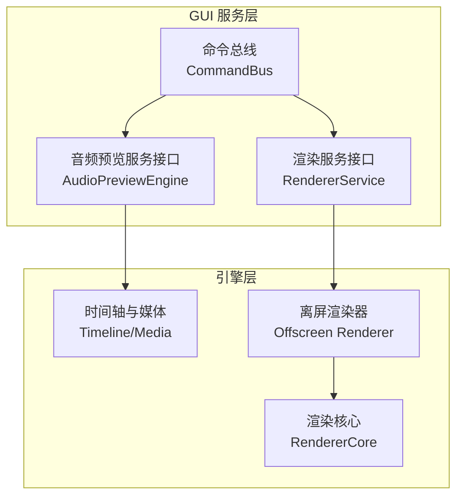
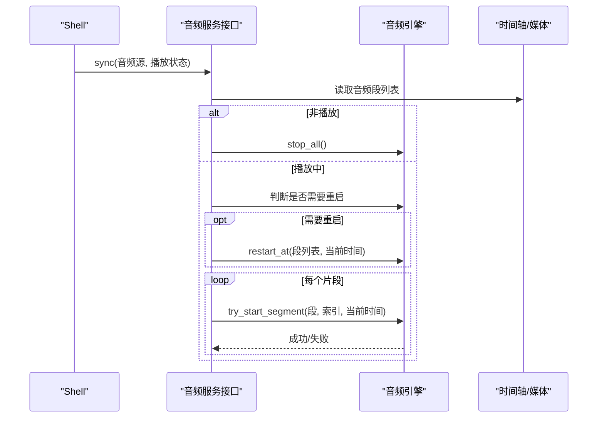
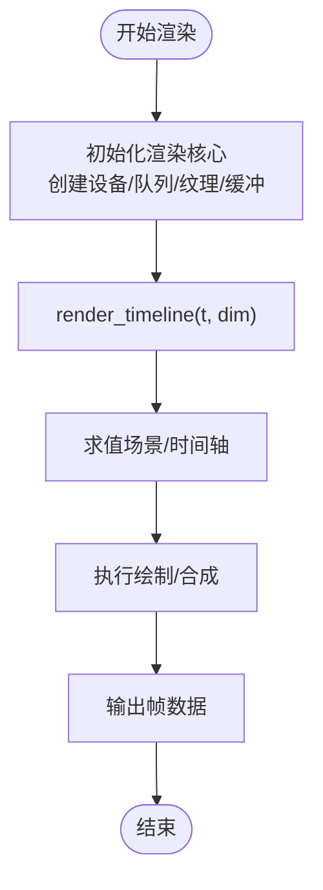
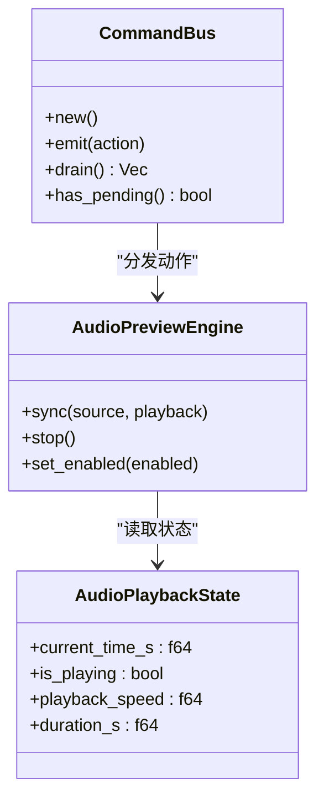
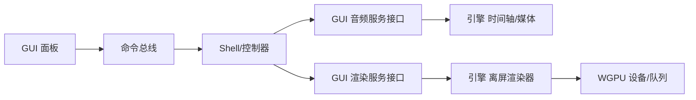

# 服务层 API

<cite>
**本文引用的文件**
- [audio.rs](file://crates/animatix/src/primitives/audio.rs)
- [media.rs](file://crates/animatix/src/timeline/media.rs)
- [audio.rs](file://crates/animatix-gui/src/app/audio.rs)
- [audio.rs](file://crates/animatix-gui/src/app/services/audio.rs)
- [renderer.rs](file://crates/animatix-gui/src/app/services/renderer.rs)
- [offscreen.rs](file://crates/animatix/src/renderer/offscreen.rs)
- [mod.rs](file://crates/animatix/src/renderer/mod.rs)
- [command_bus.rs](file://crates/animatix-gui/src/app/command_bus.rs)
- [env.rs](file://crates/animatix/src/timeline/env.rs)
- [config_edits.rs](file://crates/animatix-gui/src/source_edit/config_edits.rs)
</cite>

## 目录
1. [简介](#简介)
2. [项目结构](#项目结构)
3. [核心组件](#核心组件)
4. [架构总览](#架构总览)
5. [详细组件分析](#详细组件分析)
6. [依赖关系分析](#依赖关系分析)
7. [性能考量](#性能考量)
8. [故障排除指南](#故障排除指南)
9. [结论](#结论)
10. [附录](#附录)

## 简介
本文件系统性梳理 Animatix 服务层 API，重点覆盖以下方面：
- 音频服务 API：音频播放控制、音量调节与时间轴同步机制
- 渲染服务 API：帧渲染调度、性能监控与资源管理
- 服务间通信机制：事件传递、状态共享与错误处理
- 服务初始化与配置接口：参数设置与生命周期管理
- 最佳实践与性能优化建议
- 使用示例与故障排除指南

## 项目结构
Animatix 将“服务”抽象为 GUI 层与引擎层的协作模块：
- GUI 服务层（animatix-gui）：提供音频预览服务接口、渲染服务接口、命令总线与状态桥接
- 引擎层（animatix）：提供音频段落解析、时间轴媒体处理、离屏渲染与渲染核心



图表来源
- [command_bus.rs:1-37](file://crates/animatix-gui/src/app/command_bus.rs#L1-L37)
- [audio.rs:36-49](file://crates/animatix-gui/src/app/services/audio.rs#L36-L49)
- [renderer.rs](file://crates/animatix-gui/src/app/services/renderer.rs)
- [media.rs](file://crates/animatix/src/timeline/media.rs)
- [offscreen.rs:94-102](file://crates/animatix/src/renderer/offscreen.rs#L94-L102)
- [mod.rs](file://crates/animatix/src/renderer/mod.rs)

章节来源
- [command_bus.rs:1-37](file://crates/animatix-gui/src/app/command_bus.rs#L1-L37)
- [audio.rs:36-49](file://crates/animatix-gui/src/app/services/audio.rs#L36-L49)
- [renderer.rs](file://crates/animatix-gui/src/app/services/renderer.rs)
- [media.rs](file://crates/animatix/src/timeline/media.rs)
- [offscreen.rs:94-102](file://crates/animatix/src/renderer/offscreen.rs#L94-L102)
- [mod.rs](file://crates/animatix/src/renderer/mod.rs)

## 核心组件
- 音频服务接口（AudioPreviewEngine）
  - 同步接口：接收时间轴或合成源与播放状态，驱动音频引擎进行播放/暂停/跳转
  - 控制接口：停止播放、启用/禁用音频输出
- 离屏渲染服务（RendererService）
  - 帧渲染接口：按时间戳与尺寸渲染单帧
  - 资源管理：设备、队列、纹理、缓冲区与滤镜后端的生命周期管理
- 时间轴媒体处理（Timeline/Media）
  - 解析音频声明，生成音频段列表（含起始时间、时长、音量）
  - 提供环境变量与绑定能力，支持配置项与运行时覆盖
- 命令总线（CommandBus）
  - 面向面板的事件/动作收集与帧级分发，解耦 UI 与业务逻辑

章节来源
- [audio.rs:36-49](file://crates/animatix-gui/src/app/services/audio.rs#L36-L49)
- [offscreen.rs:94-102](file://crates/animatix/src/renderer/offscreen.rs#L94-L102)
- [media.rs](file://crates/animatix/src/timeline/media.rs)
- [env.rs:216-354](file://crates/animatix/src/timeline/env.rs#L216-L354)
- [command_bus.rs:1-37](file://crates/animatix-gui/src/app/command_bus.rs#L1-L37)

## 架构总览
服务层通过接口与数据流实现松耦合协作：
- GUI 面板通过命令总线提交动作
- Shell 在每帧从总线取出动作并调用服务接口
- 音频服务根据播放状态与时间轴同步音频引擎
- 渲染服务根据时间戳与尺寸请求离屏渲染

```mermaid
sequenceDiagram
participant UI as "GUI 面板"
participant Bus as "命令总线"
participant Shell as "Shell/控制器"
participant AudSvc as "音频服务接口"
participant RenSvc as "渲染服务接口"
participant TL as "时间轴/媒体"
participant Off as "离屏渲染器"
UI->>Bus : 发出动作/事件
Bus-->>Shell : 每帧分发动作
Shell->>AudSvc : sync(音频源, 播放状态)
AudSvc->>TL : 获取音频段列表
Shell->>RenSvc : render_timeline(t, dim)
RenSvc->>Off : 渲染单帧
Off-->>RenSvc : 返回帧数据
RenSvc-->>Shell : 帧结果
```

图表来源
- [command_bus.rs:18-36](file://crates/animatix-gui/src/app/command_bus.rs#L18-L36)
- [audio.rs:36-49](file://crates/animatix-gui/src/app/services/audio.rs#L36-L49)
- [offscreen.rs:94-102](file://crates/animatix/src/renderer/offscreen.rs#L94-L102)

## 详细组件分析

### 音频服务 API
- 接口定义
  - 同步方法：接收音频源（时间轴或合成）、播放状态（当前时间、是否播放、速度、总时长），驱动引擎对齐播放
  - 控制方法：停止播放、启用/禁用音频输出
- 实现要点
  - GUI 预览音频引擎负责解码、缓存、按片段起止时间与剩余时长切片播放，并在跳转或状态变化时重置
  - 音频段由时间轴解析生成，包含起始秒、可选时长与音量范围约束
- 关键流程（同步与重启）
  - 若播放状态变为非播放，清空所有活动片段
  - 若检测到跳转（时间差超过阈值）或首次播放，执行“全量重启”，重新计算各片段的可播放区间并启动新片段



图表来源
- [audio.rs:36-49](file://crates/animatix-gui/src/app/services/audio.rs#L36-L49)
- [audio.rs:95-158](file://crates/animatix-gui/src/app/audio.rs#L95-L158)
- [media.rs](file://crates/animatix/src/timeline/media.rs)

章节来源
- [audio.rs:36-49](file://crates/animatix-gui/src/app/services/audio.rs#L36-L49)
- [audio.rs:95-227](file://crates/animatix-gui/src/app/audio.rs#L95-L227)
- [media.rs](file://crates/animatix/src/timeline/media.rs)

### 渲染服务 API
- 接口职责
  - 渲染单帧：给定时间戳与场景尺寸，返回一帧图像数据
  - 资源管理：持有设备、队列、纹理视图、输出缓冲等，确保生命周期与尺寸变更安全
- 关键流程
  - 初始化渲染核心，建立离屏目标与中间缓冲
  - 每帧根据时间戳与尺寸调用渲染函数，内部完成场景求值与绘制



图表来源
- [offscreen.rs:70-102](file://crates/animatix/src/renderer/offscreen.rs#L70-L102)
- [mod.rs](file://crates/animatix/src/renderer/mod.rs)

章节来源
- [offscreen.rs:70-102](file://crates/animatix/src/renderer/offscreen.rs#L70-L102)
- [mod.rs](file://crates/animatix/src/renderer/mod.rs)

### 服务间通信机制
- 命令总线（CommandBus）
  - 面板通过总线发出类型化的动作，Shell 每帧统一取出并派发
  - 优点：解耦面板与控制器；集中处理副作用
- 状态共享
  - 音频服务通过播放状态结构体共享当前时间、播放状态、速度与总时长
  - 渲染服务通过尺寸与时间戳共享渲染上下文
- 错误处理
  - GUI 音频引擎在启动片段失败时记录警告日志，避免中断主循环
  - 时间轴媒体解析在缺少必要属性时产生诊断信息



图表来源
- [command_bus.rs:13-36](file://crates/animatix-gui/src/app/command_bus.rs#L13-L36)
- [audio.rs:18-34](file://crates/animatix-gui/src/app/services/audio.rs#L18-L34)
- [audio.rs:36-49](file://crates/animatix-gui/src/app/services/audio.rs#L36-L49)

章节来源
- [command_bus.rs:1-37](file://crates/animatix-gui/src/app/command_bus.rs#L1-L37)
- [audio.rs:18-34](file://crates/animatix-gui/src/app/services/audio.rs#L18-L34)
- [audio.rs:36-49](file://crates/animatix-gui/src/app/services/audio.rs#L36-L49)

### 服务初始化与配置接口
- 音频服务初始化
  - 创建音频输出流句柄，打开默认音频设备
  - 初始化缓存与活动片段列表，保存上次播放状态与同步时间
- 渲染服务初始化
  - 初始化渲染核心，分配设备、队列与离屏资源
- 配置接口
  - 通过时间轴环境变量与绑定支持配置项设置与运行时覆盖
  - 支持在源码编辑层更新配置属性，保持引号风格一致性

章节来源
- [audio.rs:48-61](file://crates/animatix-gui/src/app/audio.rs#L48-L61)
- [offscreen.rs:70-92](file://crates/animatix/src/renderer/offscreen.rs#L70-L92)
- [env.rs:216-354](file://crates/animatix/src/timeline/env.rs#L216-L354)
- [config_edits.rs:13-31](file://crates/animatix-gui/src/source_edit/config_edits.rs#L13-L31)

## 依赖关系分析
- 组件耦合
  - GUI 服务接口与引擎层通过抽象接口解耦
  - 命令总线作为事件通道，降低面板与控制器之间的直接依赖
- 外部依赖
  - 音频：rodio（解码与播放）
  - 渲染：WGPU（设备/队列/纹理）
- 可能的循环依赖
  - 通过接口与枚举（如音频源）避免直接循环引用



图表来源
- [audio.rs:36-49](file://crates/animatix-gui/src/app/services/audio.rs#L36-L49)
- [offscreen.rs:70-102](file://crates/animatix/src/renderer/offscreen.rs#L70-L102)
- [command_bus.rs:18-36](file://crates/animatix-gui/src/app/command_bus.rs#L18-L36)

章节来源
- [audio.rs:36-49](file://crates/animatix-gui/src/app/services/audio.rs#L36-L49)
- [offscreen.rs:70-102](file://crates/animatix/src/renderer/offscreen.rs#L70-L102)
- [command_bus.rs:18-36](file://crates/animatix-gui/src/app/command_bus.rs#L18-L36)

## 性能考量
- 音频
  - 缓存已解码音频，避免重复解码
  - 跳转或播放状态切换时全量重启，减少片段边界抖动
  - 仅在剩余时长足够时启动片段，避免无效播放
- 渲染
  - 离屏渲染器复用设备与队列，避免频繁重建
  - 按需分配纹理与缓冲，注意字节对齐与尺寸变更
- 通用
  - 命令总线每帧批量处理，减少锁竞争
  - 环境变量与绑定采用哈希表，查找与扩展成本可控

## 故障排除指南
- 音频无声
  - 检查音频源路径是否存在与可解码
  - 确认音量未被设为 0，且当前时间处于片段有效区间
  - 观察日志中关于“未能创建音频 sink”的警告
- 播放卡顿或跳播
  - 检查播放状态是否频繁切换导致“重启”
  - 确认时间戳平滑推进，避免大跨度跳转
- 渲染黑屏或尺寸异常
  - 确认渲染尺寸与设备格式匹配
  - 检查输出纹理与视图是否正确创建与更新
- 配置不生效
  - 确认配置块存在且属性名正确
  - 使用源码编辑接口更新配置，避免覆盖其他属性

章节来源
- [audio.rs:64-93](file://crates/animatix-gui/src/app/audio.rs#L64-L93)
- [audio.rs:161-214](file://crates/animatix-gui/src/app/audio.rs#L161-L214)
- [offscreen.rs:70-102](file://crates/animatix/src/renderer/offscreen.rs#L70-L102)
- [config_edits.rs:13-31](file://crates/animatix-gui/src/source_edit/config_edits.rs#L13-L31)

## 结论
本文件系统化梳理了 Animatix 服务层 API，明确了音频与渲染两大服务的接口、流程与依赖关系，并提供了通信机制、初始化配置、性能优化与故障排除建议。通过接口抽象与命令总线，GUI 与引擎层实现了高内聚、低耦合的协作模式。

## 附录
- 使用示例（步骤说明）
  - 音频预览
    - 初始化音频服务接口与音频引擎
    - 每帧调用同步接口，传入时间轴与播放状态
    - 需要时调用停止或启用接口
  - 渲染预览
    - 初始化渲染服务接口与离屏渲染器
    - 每帧调用渲染接口，传入时间戳与尺寸
    - 处理输出帧数据以供显示
- 最佳实践
  - 将面板交互通过命令总线集中处理，避免直接修改状态
  - 对音频与渲染的关键路径进行最小化重算，优先复用缓存
  - 在配置更新时保持语义一致与引号风格稳定