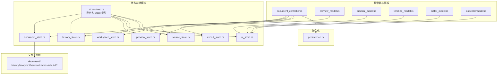
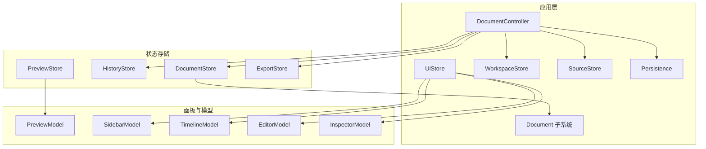
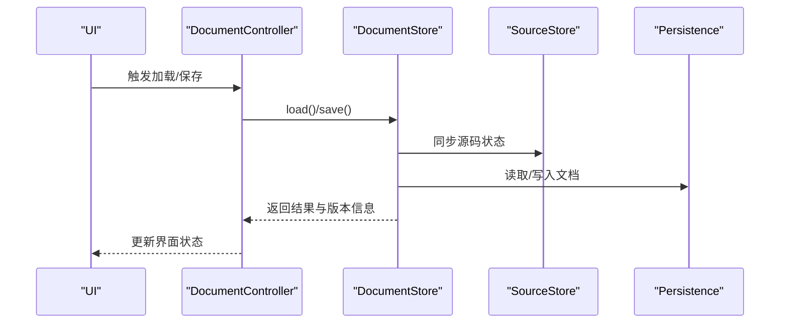
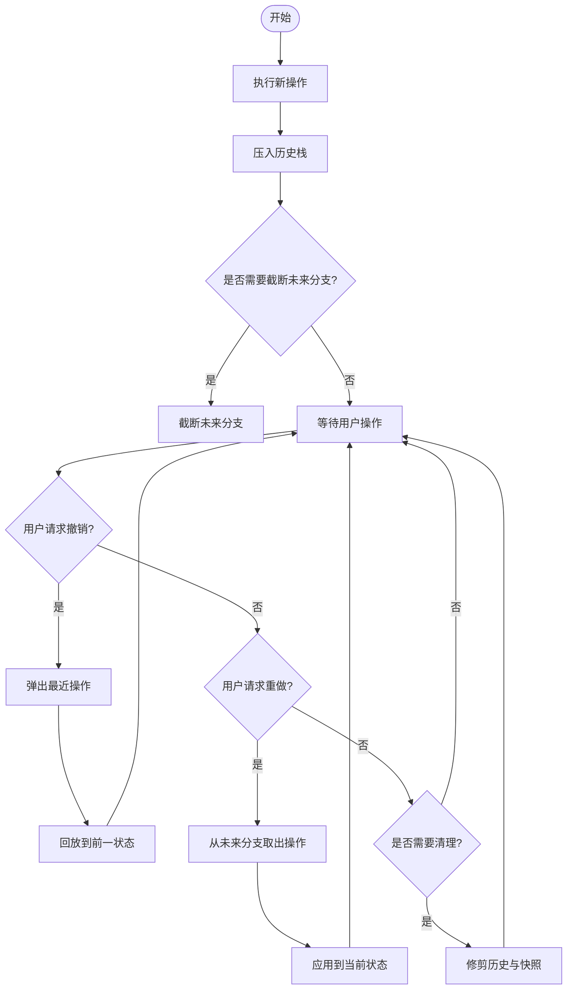
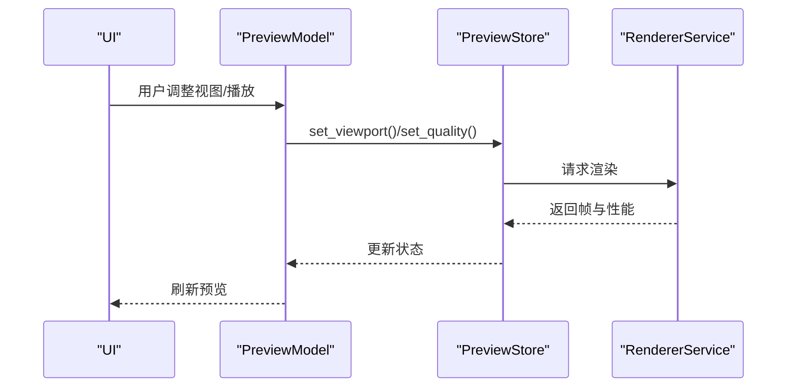
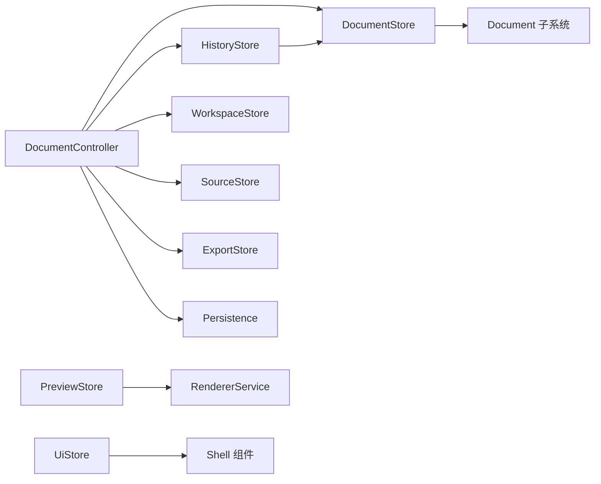

# 状态管理 API

<cite>
**本文引用的文件**
- [mod.rs](file://crates/animatix-gui/src/app/stores/mod.rs)
- [document_store.rs](file://crates/animatix-gui/src/app/stores/document_store.rs)
- [history_store.rs](file://crates/animatix-gui/src/app/stores/history_store.rs)
- [preview_store.rs](file://crates/animatix-gui/src/app/stores/preview_store.rs)
- [ui_store.rs](file://crates/animatix-gui/src/app/stores/ui_store.rs)
- [workspace_store.rs](file://crates/animatix-gui/src/app/stores/workspace_store.rs)
- [source_store.rs](file://crates/animatix-gui/src/app/stores/source_store.rs)
- [export_store.rs](file://crates/animatix-gui/src/app/stores/export_store.rs)
- [document_controller.rs](file://crates/animatix-gui/src/app/document_controller.rs)
- [persistence.rs](file://crates/animatix-gui/src/app/persistence.rs)
- [history.rs](file://crates/animatix-gui/src/app/document/history.rs)
- [snapshot.rs](file://crates/animatix-gui/src/app/document/snapshot.rs)
- [version.rs](file://crates/animatix-gui/src/app/document/version.rs)
- [caches.rs](file://crates/animatix-gui/src/app/document/caches.rs)
- [rebuild.rs](file://crates/animatix-gui/src/app/document/rebuild.rs)
- [rebuild_output.rs](file://crates/animatix-gui/src/app/document/rebuild_output.rs)
- [scheduler.rs](file://crates/animatix-gui/src/app/document/scheduler.rs)
- [source_change.rs](file://crates/animatix-gui/src/app/document/source_change.rs)
- [preview_model.rs](file://crates/animatix-gui/src/app/panels/preview_model.rs)
- [preview_panel.rs](file://crates/animatix-gui/src/app/panels/preview_panel.rs)
- [preview_performance.rs](file://crates/animatix-gui/src/app/preview/performance.rs)
- [preview_context.rs](file://crates/animatix-gui/src/app/preview/context.rs)
- [preview_selection.rs](file://crates/animatix-gui/src/app/preview/selection.rs)
- [preview_grid.rs](file://crates/animatix-gui/src/app/preview/grid.rs)
- [preview_overlay.rs](file://crates/animatix-gui/src/app/preview/overlay.rs)
- [preview_time_lens.rs](file://crates/animatix-gui/src/app/preview/time_lens.rs)
- [preview_drag_handler.rs](file://crates/animatix-gui/src/app/preview/drag_handler.rs)
- [preview_property_popup.rs](file://crates/animatix-gui/src/app/preview/property_popup.rs)
- [sidebar_model.rs](file://crates/animatix-gui/src/app/panels/sidebar_model.rs)
- [timeline_model.rs](file://crates/animatix-gui/src/app/panels/timeline_model.rs)
- [editor_model.rs](file://crates/animatix-gui/src/app/panels/editor_model.rs)
- [inspector_model.rs](file://crates/animatix-gui/src/app/panels/inspector/model.rs)
- [keyframe_table.rs](file://crates/animatix-gui/src/app/panels/inspector/keyframe_table.rs)
- [graph_editor.rs](file://crates/animatix-gui/src/app/panels/inspector/graph_editor.rs)
- [spreadsheet.rs](file://crates/animatix-gui/src/app/panels/inspector/spreadsheet.rs)
- [behavior_panel.rs](file://crates/animatix-gui/src/app/panels/behavior.rs)
- [editor_panel.rs](file://crates/animatix-gui/src/app/panels/editor.rs)
- [timeline_panel.rs](file://crates/animatix-gui/src/app/panels/timeline_panel.rs)
- [settings.rs](file://crates/animatix-gui/src/app/shell/settings.rs)
- [command_palette.rs](file://crates/animatix-gui/src/app/shell/command_palette.rs)
- [toolbar.rs](file://crates/animatix-gui/src/app/shell/toolbar.rs)
- [export_dialog.rs](file://crates/animatix-gui/src/app/shell/export_dialog.rs)
- [find_replace.rs](file://crates/animatix-gui/src/app/shell/find_replace.rs)
- [insertion_palette.rs](file://crates/animatix-gui/src/app/shell/insertion_palette.rs)
- [shortcut_cheat_sheet.rs](file://crates/animatix-gui/src/app/shell/shortcut_cheat_sheet.rs)
- [renderer_service.rs](file://crates/animatix-gui/src/app/services/renderer.rs)
- [audio_service.rs](file://crates/animatix-gui/src/app/services/audio.rs)
- [runtime.rs](file://crates/animatix-gui/src/app/runtime.rs)
- [command_bus.rs](file://crates/animatix-gui/src/app/command_bus.rs)
- [commands.rs](file://crates/animatix-gui/src/app/commands.rs)
- [handlers_file.rs](file://crates/animatix-gui/src/app/handlers/file.rs)
- [handlers_playback.rs](file://crates/animatix-gui/src/app/handlers/playback.rs)
- [handlers_ui.rs](file://crates/animatix-gui/src/app/handlers/ui.rs)
- [handlers_actor.rs](file://crates/animatix-gui/src/app/handlers/actor.rs)
- [handlers_keyframe.rs](file://crates/animatix-gui/src/app/handlers/keyframe.rs)
- [handlers_property.rs](file://crates/animatix-gui/src/app/handlers/property.rs)
- [handlers_scene.rs](file://crates/animatix-gui/src/app/handlers/scene.rs)
</cite>

## 目录
1. [简介](#简介)
2. [项目结构](#项目结构)
3. [核心组件](#核心组件)
4. [架构总览](#架构总览)
5. [详细组件分析](#详细组件分析)
6. [依赖分析](#依赖分析)
7. [性能考虑](#性能考虑)
8. [故障排除指南](#故障排除指南)
9. [结论](#结论)
10. [附录](#附录)

## 简介
本文件系统性梳理 Animatix GUI 中的状态管理 API，覆盖以下存储域与能力：
- 文档状态存储：文档加载、保存与版本控制接口
- 历史状态存储：撤销/重做机制、状态快照与内存管理
- 预览状态存储：预览配置、渲染状态与性能数据
- UI 状态存储：界面布局、用户偏好与临时状态
- 工作区状态存储：文件管理、项目配置与会话持久化
- 订阅与更新机制：状态变更通知与响应流程

目标是帮助开发者快速理解各状态域的职责边界、交互关系与最佳实践。

## 项目结构
Animatix GUI 的状态管理集中在 app/stores 模块中，通过统一导出入口对外暴露，并由控制器与面板层在运行时进行订阅与更新。

图示来源
- [mod.rs:1-15](file://crates/animatix-gui/src/app/stores/mod.rs#L1-L15)
- [document_store.rs](file://crates/animatix-gui/src/app/stores/document_store.rs)
- [history_store.rs](file://crates/animatix-gui/src/app/stores/history_store.rs)
- [preview_store.rs](file://crates/animatix-gui/src/app/stores/preview_store.rs)
- [ui_store.rs](file://crates/animatix-gui/src/app/stores/ui_store.rs)
- [workspace_store.rs](file://crates/animatix-gui/src/app/stores/workspace_store.rs)
- [source_store.rs](file://crates/animatix-gui/src/app/stores/source_store.rs)
- [export_store.rs](file://crates/animatix-gui/src/app/stores/export_store.rs)
- [document_controller.rs](file://crates/animatix-gui/src/app/document_controller.rs)
- [persistence.rs](file://crates/animatix-gui/src/app/persistence.rs)
- [history.rs](file://crates/animatix-gui/src/app/document/history.rs)
- [snapshot.rs](file://crates/animatix-gui/src/app/document/snapshot.rs)
- [version.rs](file://crates/animatix-gui/src/app/document/version.rs)
- [caches.rs](file://crates/animatix-gui/src/app/document/caches.rs)
- [rebuild.rs](file://crates/animatix-gui/src/app/document/rebuild.rs)
- [rebuild_output.rs](file://crates/animatix-gui/src/app/document/rebuild_output.rs)
- [scheduler.rs](file://crates/animatix-gui/src/app/document/scheduler.rs)
- [source_change.rs](file://crates/animatix-gui/src/app/document/source_change.rs)

章节来源
- [mod.rs:1-15](file://crates/animatix-gui/src/app/stores/mod.rs#L1-L15)

## 核心组件
- 文档状态存储（DocumentStore）：负责场景与源码的加载、重建、缓存与版本管理；提供与持久化的集成点。
- 历史状态存储（HistoryStore）：维护撤销/重做栈、快照与内存占用控制。
- 预览状态存储（PreviewStore）：承载预览视口、渲染参数、性能指标与选择状态。
- UI 状态存储（UiStore）：管理界面布局、面板可见性、用户偏好与临时状态。
- 工作区状态存储（WorkspaceStore）：管理打开的文件、项目配置与会话持久化。
- 源码状态存储（SourceStore）：跟踪源码变更、增量重建与错误诊断。
- 导出状态存储（ExportStore）：管理导出目标、参数与进度。

章节来源
- [mod.rs:1-15](file://crates/animatix-gui/src/app/stores/mod.rs#L1-L15)

## 架构总览
下图展示状态域与控制器、面板及文档子系统的交互关系，以及持久化层的接入点。

图示来源
- [document_controller.rs](file://crates/animatix-gui/src/app/document_controller.rs)
- [ui_store.rs](file://crates/animatix-gui/src/app/stores/ui_store.rs)
- [workspace_store.rs](file://crates/animatix-gui/src/app/stores/workspace_store.rs)
- [source_store.rs](file://crates/animatix-gui/src/app/stores/source_store.rs)
- [document_store.rs](file://crates/animatix-gui/src/app/stores/document_store.rs)
- [history_store.rs](file://crates/animatix-gui/src/app/stores/history_store.rs)
- [preview_store.rs](file://crates/animatix-gui/src/app/stores/preview_store.rs)
- [export_store.rs](file://crates/animatix-gui/src/app/stores/export_store.rs)
- [persistence.rs](file://crates/animatix-gui/src/app/persistence.rs)
- [preview_model.rs](file://crates/animatix-gui/src/app/panels/preview_model.rs)
- [sidebar_model.rs](file://crates/animatix-gui/src/app/panels/sidebar_model.rs)
- [timeline_model.rs](file://crates/animatix-gui/src/app/panels/timeline_model.rs)
- [editor_model.rs](file://crates/animatix-gui/src/app/panels/editor_model.rs)
- [inspector_model.rs](file://crates/animatix-gui/src/app/panels/inspector/model.rs)

## 详细组件分析

### 文档状态存储 API（DocumentStore）
职责与能力
- 加载与保存：从持久化层读取文档，写回磁盘或云端；与 SourceStore 协同处理源码变更。
- 版本控制：基于版本号与快照实现文档版本管理，支持回溯与合并。
- 缓存与重建：通过缓存与增量重建减少计算开销，提升编辑与播放性能。
- 事件调度：通过调度器对文档变更进行批处理与去抖。

关键接口与流程
- 加载文档：初始化 DocumentStore 并触发加载流程，读取源码与元数据。
- 保存文档：触发保存流程，序列化当前状态到持久化介质。
- 版本切换：根据版本号获取对应快照，恢复文档状态。
- 变更重建：监听 SourceStore 的变更，触发增量重建与缓存更新。

图示来源
- [document_controller.rs](file://crates/animatix-gui/src/app/document_controller.rs)
- [document_store.rs](file://crates/animatix-gui/src/app/stores/document_store.rs)
- [source_store.rs](file://crates/animatix-gui/src/app/stores/source_store.rs)
- [persistence.rs](file://crates/animatix-gui/src/app/persistence.rs)

章节来源
- [document_store.rs](file://crates/animatix-gui/src/app/stores/document_store.rs)
- [version.rs](file://crates/animatix-gui/src/app/document/version.rs)
- [snapshot.rs](file://crates/animatix-gui/src/app/document/snapshot.rs)
- [caches.rs](file://crates/animatix-gui/src/app/document/caches.rs)
- [rebuild.rs](file://crates/animatix-gui/src/app/document/rebuild.rs)
- [rebuild_output.rs](file://crates/animatix-gui/src/app/document/rebuild_output.rs)
- [scheduler.rs](file://crates/animatix-gui/src/app/document/scheduler.rs)
- [source_change.rs](file://crates/animatix-gui/src/app/document/source_change.rs)

### 历史状态存储 API（HistoryStore）
职责与能力
- 撤销/重做：维护操作历史栈，支持按步撤销与重做。
- 快照管理：在关键节点生成快照，降低回溯成本。
- 内存管理：限制历史深度与快照大小，避免内存膨胀。

关键接口与流程
- 执行动作：执行新操作后压入历史栈，并截断未来分支。
- 撤销：弹出最近操作并回放至前一状态。
- 重做：从未来分支恢复被撤销的操作。
- 清理：定期清理过期快照与冗余历史条目。

图示来源
- [history_store.rs](file://crates/animatix-gui/src/app/stores/history_store.rs)
- [history.rs](file://crates/animatix-gui/src/app/document/history.rs)
- [snapshot.rs](file://crates/animatix-gui/src/app/document/snapshot.rs)

章节来源
- [history_store.rs](file://crates/animatix-gui/src/app/stores/history_store.rs)
- [history.rs](file://crates/animatix-gui/src/app/document/history.rs)

### 预览状态存储 API（PreviewStore）
职责与能力
- 预览配置：缩放、平移、网格显示与时间刻度等视图参数。
- 渲染状态：当前帧、播放位置、渲染质量与抗锯齿设置。
- 性能数据：渲染耗时、帧率、GPU/CPU 使用率等指标。
- 选择与覆盖：选中的元素、高亮覆盖与属性弹窗状态。

关键接口与流程
- 更新视图参数：响应用户交互，更新缩放与平移。
- 刷新渲染：根据当前帧与质量设置触发渲染。
- 收集性能：周期性收集并上报性能指标。
- 处理选择：同步选择状态到预览与检查器。

图示来源
- [preview_model.rs](file://crates/animatix-gui/src/app/panels/preview_model.rs)
- [preview_store.rs](file://crates/animatix-gui/src/app/stores/preview_store.rs)
- [renderer_service.rs](file://crates/animatix-gui/src/app/services/renderer.rs)
- [preview_performance.rs](file://crates/animatix-gui/src/app/preview/performance.rs)
- [preview_context.rs](file://crates/animatix-gui/src/app/preview/context.rs)
- [preview_selection.rs](file://crates/animatix-gui/src/app/preview/selection.rs)
- [preview_grid.rs](file://crates/animatix-gui/src/app/preview/grid.rs)
- [preview_overlay.rs](file://crates/animatix-gui/src/app/preview/overlay.rs)
- [preview_time_lens.rs](file://crates/animatix-gui/src/app/preview/time_lens.rs)
- [preview_drag_handler.rs](file://crates/animatix-gui/src/app/preview/drag_handler.rs)
- [preview_property_popup.rs](file://crates/animatix-gui/src/app/preview/property_popup.rs)

章节来源
- [preview_store.rs](file://crates/animatix-gui/src/app/stores/preview_store.rs)
- [preview_model.rs](file://crates/animatix-gui/src/app/panels/preview_model.rs)
- [preview_performance.rs](file://crates/animatix-gui/src/app/preview/performance.rs)
- [preview_selection.rs](file://crates/animatix-gui/src/app/preview/selection.rs)

### UI 状态存储 API（UiStore）
职责与能力
- 界面布局：面板尺寸、分栏宽度、折叠状态。
- 用户偏好：主题、字体大小、快捷键映射。
- 临时状态：当前选中项、搜索/替换输入、命令调色板状态。

关键接口与流程
- 更新布局：响应窗口变化与用户拖拽，持久化面板尺寸。
- 应用偏好：加载用户设置，驱动主题与字体渲染。
- 管理临时状态：在操作过程中暂存中间态，避免频繁持久化。

章节来源
- [ui_store.rs](file://crates/animatix-gui/src/app/stores/ui_store.rs)
- [settings.rs](file://crates/animatix-gui/src/app/shell/settings.rs)
- [command_palette.rs](file://crates/animatix-gui/src/app/shell/command_palette.rs)
- [toolbar.rs](file://crates/animatix-gui/src/app/shell/toolbar.rs)
- [find_replace.rs](file://crates/animatix-gui/src/app/shell/find_replace.rs)
- [insertion_palette.rs](file://crates/animatix-gui/src/app/shell/insertion_palette.rs)
- [shortcut_cheat_sheet.rs](file://crates/animatix-gui/src/app/shell/shortcut_cheat_sheet.rs)

### 工作区状态存储 API（WorkspaceStore）
职责与能力
- 文件管理：打开文件列表、最近文件、工作目录。
- 项目配置：项目根、模块路径、构建参数。
- 会话持久化：窗口布局、面板状态、上次打开的文件集合。

关键接口与流程
- 新建/打开项目：解析项目配置，加载文件树。
- 保存会话：序列化当前工作区状态，以便下次启动恢复。
- 文件切换：在多文件间切换时保持各自状态。

章节来源
- [workspace_store.rs](file://crates/animatix-gui/src/app/stores/workspace_store.rs)
- [file_tree.rs](file://crates/animatix-gui/src/app/file_tree.rs)

### 源码状态存储 API（SourceStore）
职责与能力
- 源码变更追踪：监听文件系统变化，识别增删改。
- 增量重建：仅对受影响区域进行重建，加速编辑体验。
- 错误与诊断：收集语法与类型错误，驱动检查器面板。

章节来源
- [source_store.rs](file://crates/animatix-gui/src/app/stores/source_store.rs)
- [source_change.rs](file://crates/animatix-gui/src/app/document/source_change.rs)

### 导出状态存储 API（ExportStore）
职责与能力
- 导出目标：输出格式、分辨率、帧率、范围。
- 参数校验：验证导出参数的有效性。
- 进度与回调：导出过程中的进度上报与完成回调。

章节来源
- [export_store.rs](file://crates/animatix-gui/src/app/stores/export_store.rs)
- [export_dialog.rs](file://crates/animatix-gui/src/app/shell/export_dialog.rs)

## 依赖分析
- 组件耦合
  - DocumentController 是状态域的协调者，向上对接面板与服务，向下连接各 Store 与文档子系统。
  - PreviewStore 依赖 RendererService 提供渲染能力；UiStore 与 Shell 组件紧密耦合以反映用户偏好。
  - HistoryStore 与 DocumentStore 协同，确保撤销/重做时的快照一致性。
- 外部依赖
  - Persistence 提供文件系统与配置读写。
  - Services（如 Renderer、Audio）提供底层能力抽象。

图示来源
- [document_controller.rs](file://crates/animatix-gui/src/app/document_controller.rs)
- [document_store.rs](file://crates/animatix-gui/src/app/stores/document_store.rs)
- [history_store.rs](file://crates/animatix-gui/src/app/stores/history_store.rs)
- [workspace_store.rs](file://crates/animatix-gui/src/app/stores/workspace_store.rs)
- [source_store.rs](file://crates/animatix-gui/src/app/stores/source_store.rs)
- [export_store.rs](file://crates/animatix-gui/src/app/stores/export_store.rs)
- [preview_store.rs](file://crates/animatix-gui/src/app/stores/preview_store.rs)
- [renderer_service.rs](file://crates/animatix-gui/src/app/services/renderer.rs)
- [persistence.rs](file://crates/animatix-gui/src/app/persistence.rs)

章节来源
- [document_controller.rs](file://crates/animatix-gui/src/app/document_controller.rs)
- [persistence.rs](file://crates/animatix-gui/src/app/persistence.rs)

## 性能考虑
- 文档重建与缓存
  - 使用增量重建与缓存避免全量重算，结合调度器进行批处理。
  - 控制重建频率，防止 UI 卡顿。
- 历史与快照
  - 限制历史深度与快照大小，定期清理过期数据。
- 预览渲染
  - 动态调节渲染质量与帧率，平衡流畅度与资源占用。
  - 将重计算任务交给后台线程，主线程只负责 UI 刷新。
- 源码与导出
  - 对大文件采用懒加载与流式处理；导出阶段使用进度回调与取消机制。

## 故障排除指南
- 文档无法保存/加载
  - 检查持久化权限与路径有效性；确认 DocumentController 的加载/保存流程未被中断。
- 撤销/重做异常
  - 确认历史栈一致性与快照完整性；排查截断未来分支逻辑。
- 预览卡顿
  - 降低渲染质量或帧率；检查是否有过多重计算；查看性能面板指标。
- UI 偏好未生效
  - 确认 UiStore 的偏好加载顺序；检查 Shell 设置组件是否正确绑定。
- 导出失败
  - 校验导出参数；查看导出对话框的错误提示；确认目标路径可写。

章节来源
- [persistence.rs](file://crates/animatix-gui/src/app/persistence.rs)
- [history_store.rs](file://crates/animatix-gui/src/app/stores/history_store.rs)
- [preview_performance.rs](file://crates/animatix-gui/src/app/preview/performance.rs)
- [settings.rs](file://crates/animatix-gui/src/app/shell/settings.rs)
- [export_dialog.rs](file://crates/animatix-gui/src/app/shell/export_dialog.rs)

## 结论
Animatix 的状态管理通过清晰的 Store 分层与控制器协调，实现了文档、历史、预览、UI 与工作区的解耦与协同。建议在扩展新功能时遵循现有模式：将状态封装在 Store 中，通过控制器统一调度，利用面板与服务层进行渲染与交互，同时重视性能与内存管理策略。

## 附录
- 状态订阅与更新示例（通用流程）
  - 订阅：在面板或模型中注册状态变更回调，监听对应 Store 的变化。
  - 更新：通过控制器或处理器触发状态变更，Store 发布事件，订阅方响应并刷新 UI。
  - 示例参考路径：
    - [command_bus.rs](file://crates/animatix-gui/src/app/command_bus.rs)
    - [commands.rs](file://crates/animatix-gui/src/app/commands.rs)
    - [handlers_file.rs](file://crates/animatix-gui/src/app/handlers/file.rs)
    - [handlers_playback.rs](file://crates/animatix-gui/src/app/handlers/playback.rs)
    - [handlers_ui.rs](file://crates/animatix-gui/src/app/handlers/ui.rs)
    - [handlers_actor.rs](file://crates/animatix-gui/src/app/handlers/actor.rs)
    - [handlers_keyframe.rs](file://crates/animatix-gui/src/app/handlers/keyframe.rs)
    - [handlers_property.rs](file://crates/animatix-gui/src/app/handlers/property.rs)
    - [handlers_scene.rs](file://crates/animatix-gui/src/app/handlers/scene.rs)