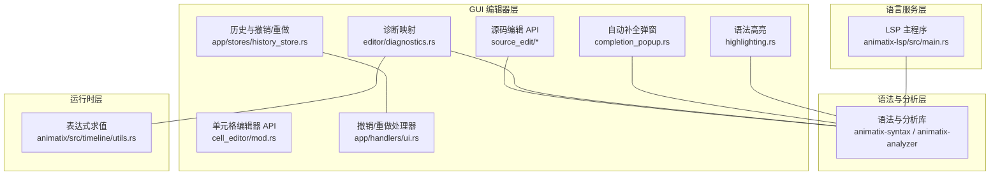
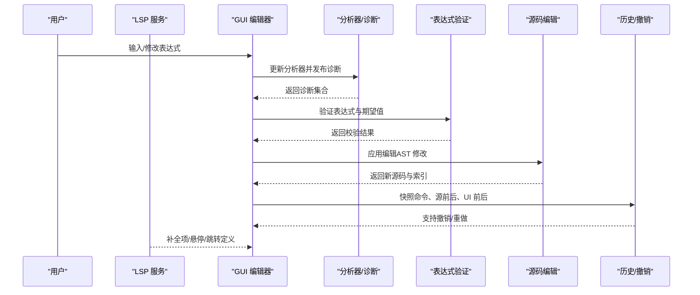
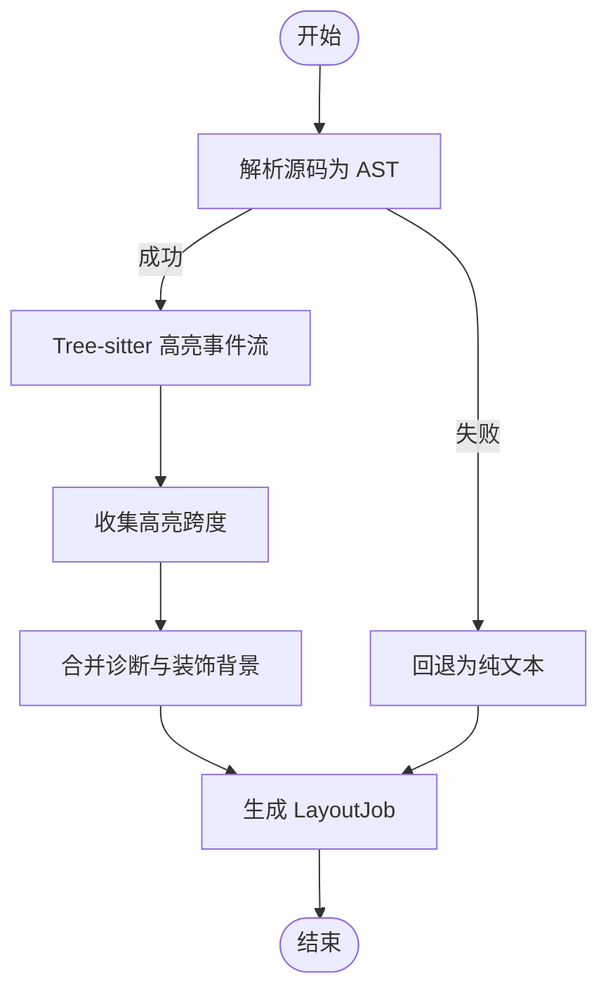
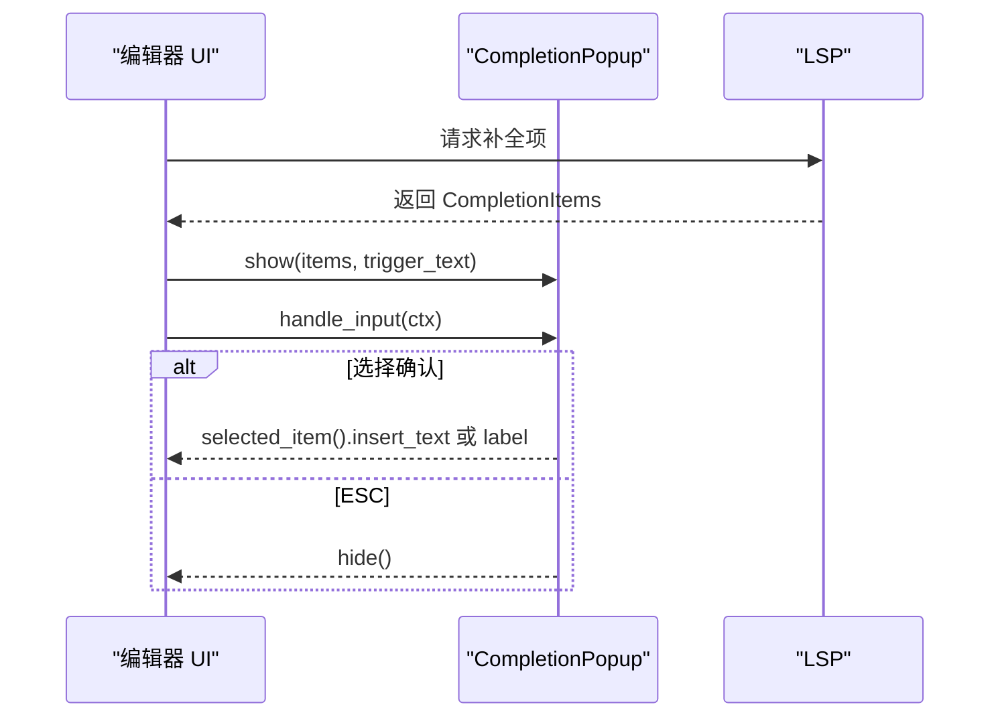
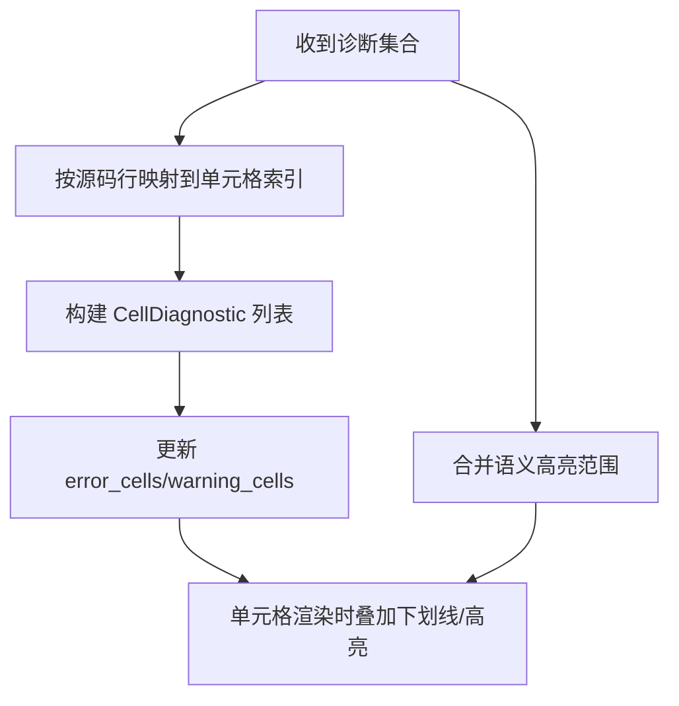
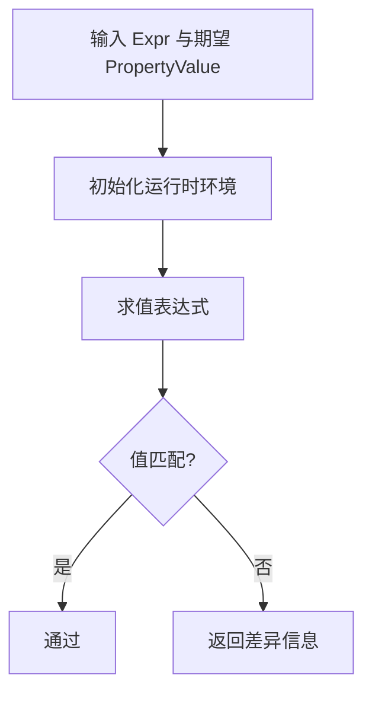
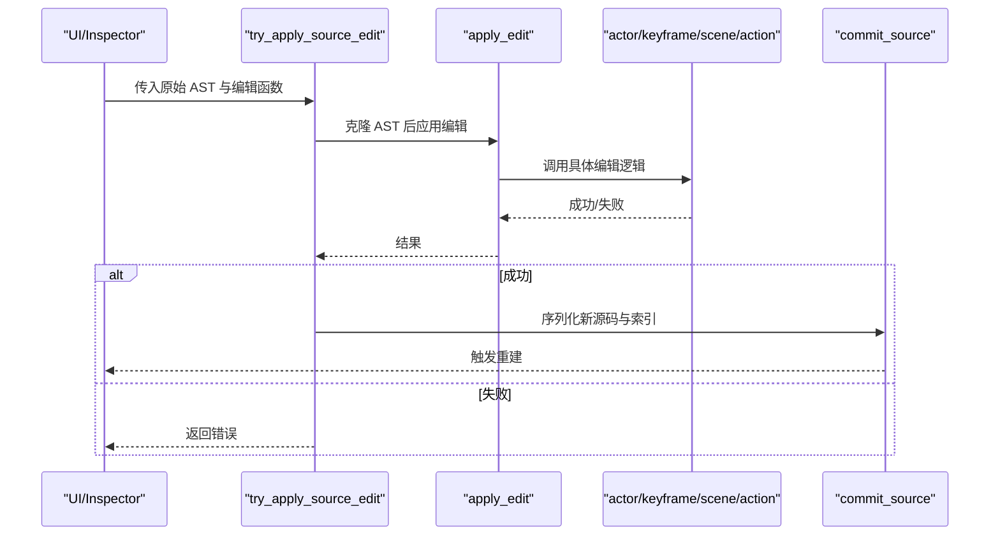
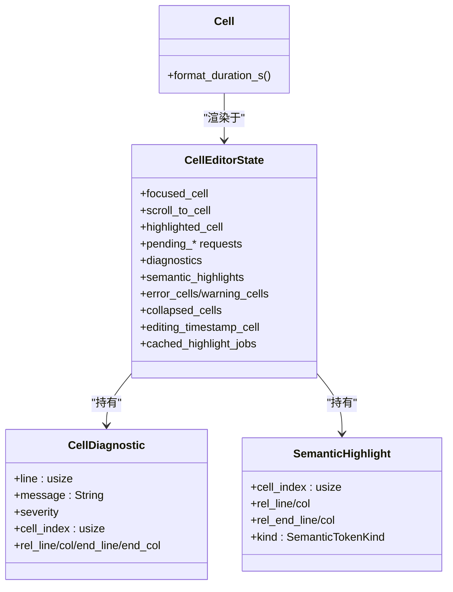
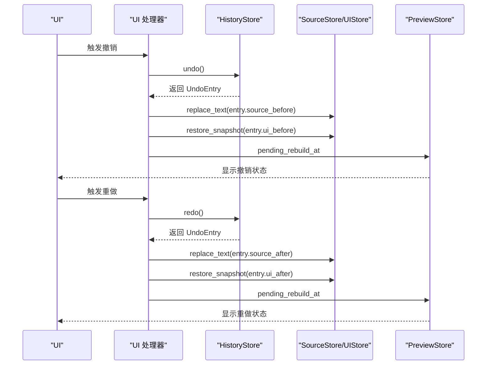
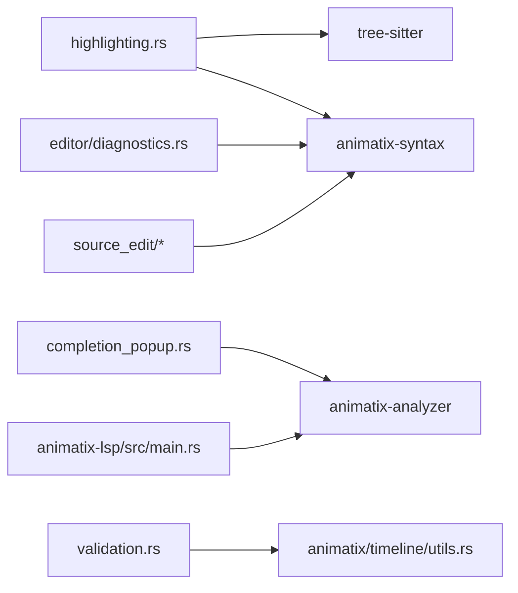

# 编辑器 API

<cite>
**本文引用的文件**
- [crates/animatix-gui/src/highlighting.rs](file://crates/animatix-gui/src/highlighting.rs)
- [crates/animatix-gui/src/completion_popup.rs](file://crates/animatix-gui/src/completion_popup.rs)
- [crates/animatix-gui/src/editor/diagnostics.rs](file://crates/animatix-gui/src/editor/diagnostics.rs)
- [crates/animatix-gui/src/validation.rs](file://crates/animatix-gui/src/validation.rs)
- [crates/animatix-gui/src/cell_editor/mod.rs](file://crates/animatix-gui/src/cell_editor/mod.rs)
- [crates/animatix-gui/src/cell_editor/render.rs](file://crates/animatix-gui/src/cell_editor/render.rs)
- [crates/animatix-gui/src/source_edit/mod.rs](file://crates/animatix-gui/src/source_edit/mod.rs)
- [crates/animatix-gui/src/source_edit/apply.rs](file://crates/animatix-gui/src/source_edit/apply.rs)
- [crates/animatix-gui/src/source_edit/action_edits.rs](file://crates/animatix-gui/src/source_edit/action_edits.rs)
- [crates/animatix-gui/src/source_edit/scene_edits.rs](file://crates/animatix-gui/src/source_edit/scene_edits.rs)
- [crates/animatix-gui/src/app/stores/history_store.rs](file://crates/animatix-gui/src/app/stores/history_store.rs)
- [crates/animatix-gui/src/app/handlers/ui.rs](file://crates/animatix-gui/src/app/handlers/ui.rs)
- [crates/animatix-gui/src/app/actions/mod.rs](file://crates/animatix-gui/src/app/actions/mod.rs)
- [crates/animatix-lsp/src/main.rs](file://crates/animatix-lsp/src/main.rs)
- [crates/animatix/src/timeline/utils.rs](file://crates/animatix/src/timeline/utils.rs)
</cite>

## 目录
1. [简介](#简介)
2. [项目结构](#项目结构)
3. [核心组件](#核心组件)
4. [架构总览](#架构总览)
5. [详细组件分析](#详细组件分析)
6. [依赖关系分析](#依赖关系分析)
7. [性能考量](#性能考量)
8. [故障排查指南](#故障排查指南)
9. [结论](#结论)
10. [附录：使用示例与最佳实践](#附录使用示例与最佳实践)

## 简介
本文件系统性梳理 Animatix 编辑器的 API 设计与实现，覆盖以下方面：
- 代码编辑器：语法高亮、自动补全、诊断映射与错误显示、代码验证与类型检查
- 源码编辑 API：基于 AST 的修改、编辑操作与变更应用接口
- 单元格编辑器 API：数值输入、表达式解析与实时验证
- 编辑器状态管理与撤销/重做机制
- 具体使用示例与扩展建议

## 项目结构
Animatix 的编辑器能力由多个子模块协同实现：
- GUI 层（animatix-gui）：编辑器 UI、语法高亮、自动补全弹窗、单元格编辑器、源码编辑、历史与撤销/重做
- LSP 层（animatix-lsp）：语言服务，提供诊断、补全等能力
- 语法与分析（animatix-syntax、animatix-analyzer）：语法树、诊断、类型检查、查询与语义分析
- 运行时求值（animatix）：表达式求值、时间线环境与值类型

图示来源
- [crates/animatix-gui/src/highlighting.rs:1-697](file://crates/animatix-gui/src/highlighting.rs#L1-L697)
- [crates/animatix-gui/src/completion_popup.rs:1-351](file://crates/animatix-gui/src/completion_popup.rs#L1-L351)
- [crates/animatix-gui/src/editor/diagnostics.rs:1-22](file://crates/animatix-gui/src/editor/diagnostics.rs#L1-L22)
- [crates/animatix-gui/src/source_edit/mod.rs:1-33](file://crates/animatix-gui/src/source_edit/mod.rs#L1-L33)
- [crates/animatix-gui/src/app/stores/history_store.rs:1-61](file://crates/animatix-gui/src/app/stores/history_store.rs#L1-L61)
- [crates/animatix-gui/src/app/handlers/ui.rs:36-99](file://crates/animatix-gui/src/app/handlers/ui.rs#L36-L99)
- [crates/animatix-lsp/src/main.rs:181-215](file://crates/animatix-lsp/src/main.rs#L181-L215)
- [crates/animatix/src/timeline/utils.rs:170-181](file://crates/animatix/src/timeline/utils.rs#L170-L181)

章节来源
- [crates/animatix-gui/src/highlighting.rs:1-697](file://crates/animatix-gui/src/highlighting.rs#L1-L697)
- [crates/animatix-gui/src/completion_popup.rs:1-351](file://crates/animatix-gui/src/completion_popup.rs#L1-L351)
- [crates/animatix-gui/src/editor/diagnostics.rs:1-22](file://crates/animatix-gui/src/editor/diagnostics.rs#L1-L22)
- [crates/animatix-gui/src/source_edit/mod.rs:1-33](file://crates/animatix-gui/src/source_edit/mod.rs#L1-L33)
- [crates/animatix-gui/src/app/stores/history_store.rs:1-61](file://crates/animatix-gui/src/app/stores/history_store.rs#L1-L61)
- [crates/animatix-gui/src/app/handlers/ui.rs:36-99](file://crates/animatix-gui/src/app/handlers/ui.rs#L36-L99)
- [crates/animatix-lsp/src/main.rs:181-215](file://crates/animatix-lsp/src/main.rs#L181-L215)
- [crates/animatix/src/timeline/utils.rs:170-181](file://crates/animatix/src/timeline/utils.rs#L170-L181)

## 核心组件
- 语法高亮：基于 tree-sitter 的 DSL 高亮，支持主题色、诊断背景与语义高亮叠加
- 自动补全：弹窗式补全列表，支持键盘导航与图标分类
- 诊断映射：将 AST/分析器诊断映射到单元格级装饰与错误指示
- 表达式验证：对属性值进行求值与比对，确保输入可被正确解释
- 源码编辑：以 AST 为中心的编辑操作，统一序列化回源码
- 单元格编辑器：按单元格组织的代码块，支持键帧、时间戳、错误下划线与语义高亮
- 历史与撤销/重做：UI 快照与源文本快照的栈式管理

章节来源
- [crates/animatix-gui/src/highlighting.rs:130-255](file://crates/animatix-gui/src/highlighting.rs#L130-L255)
- [crates/animatix-gui/src/completion_popup.rs:30-120](file://crates/animatix-gui/src/completion_popup.rs#L30-L120)
- [crates/animatix-gui/src/editor/diagnostics.rs:7-22](file://crates/animatix-gui/src/editor/diagnostics.rs#L7-L22)
- [crates/animatix-gui/src/validation.rs:7-42](file://crates/animatix-gui/src/validation.rs#L7-L42)
- [crates/animatix-gui/src/source_edit/mod.rs:1-33](file://crates/animatix-gui/src/source_edit/mod.rs#L1-L33)
- [crates/animatix-gui/src/cell_editor/mod.rs:9-143](file://crates/animatix-gui/src/cell_editor/mod.rs#L9-L143)
- [crates/animatix-gui/src/app/stores/history_store.rs:7-61](file://crates/animatix-gui/src/app/stores/history_store.rs#L7-L61)

## 架构总览
编辑器 API 的调用链路如下：
- LSP 提供诊断与补全数据
- GUI 将诊断映射到单元格，并渲染语法高亮与语义高亮
- 用户在单元格中输入或修改表达式，触发验证与求值
- 源码编辑 API 对 AST 进行修改，应用后序列化回源码
- 历史与撤销/重做保存前后状态，支持 UI 快照恢复

图示来源
- [crates/animatix-lsp/src/main.rs:181-215](file://crates/animatix-lsp/src/main.rs#L181-L215)
- [crates/animatix-gui/src/editor/diagnostics.rs:7-22](file://crates/animatix-gui/src/editor/diagnostics.rs#L7-L22)
- [crates/animatix-gui/src/validation.rs:7-42](file://crates/animatix-gui/src/validation.rs#L7-L42)
- [crates/animatix-gui/src/source_edit/apply.rs:195-228](file://crates/animatix-gui/src/source_edit/apply.rs#L195-L228)
- [crates/animatix-gui/src/app/stores/history_store.rs:27-61](file://crates/animatix-gui/src/app/stores/history_store.rs#L27-L61)

## 详细组件分析

### 语法高亮 API
- 功能要点
  - 使用 tree-sitter 语言与高亮查询生成着色范围
  - 支持主题色（深浅）、诊断背景（错误/警告/信息/提示）、语义高亮（演员名、场景名、属性名、组件名）
  - 将诊断与装饰层合并为最终 LayoutJob
- 关键接口
  - highlight_source：入口函数，返回 egui 可绘制的 LayoutJob
  - apply_background_layers：合并诊断与装饰背景
  - line_byte_range / line_col_to_byte：行列到字节偏移转换
- 性能与容错
  - 解析失败或配置缺失时回退为纯文本
  - 通过边界点排序与去重减少段数

图示来源
- [crates/animatix-gui/src/highlighting.rs:130-255](file://crates/animatix-gui/src/highlighting.rs#L130-L255)
- [crates/animatix-gui/src/highlighting.rs:279-398](file://crates/animatix-gui/src/highlighting.rs#L279-L398)

章节来源
- [crates/animatix-gui/src/highlighting.rs:130-255](file://crates/animatix-gui/src/highlighting.rs#L130-L255)
- [crates/animatix-gui/src/highlighting.rs:279-398](file://crates/animatix-gui/src/highlighting.rs#L279-L398)

### 自动补全 API
- 功能要点
  - CompletionPopup 维护可见状态、选中项、滚动与过滤
  - 键盘上下移动、Tab/Enter 确认、Esc 隐藏
  - 图标与颜色与语法高亮风格一致
- 关键接口
  - show/hide/is_visible：控制弹窗生命周期
  - handle_input：处理键盘事件
  - ui：渲染并返回确认插入文本

图示来源
- [crates/animatix-gui/src/completion_popup.rs:30-120](file://crates/animatix-gui/src/completion_popup.rs#L30-L120)
- [crates/animatix-lsp/src/main.rs:205-215](file://crates/animatix-lsp/src/main.rs#L205-L215)

章节来源
- [crates/animatix-gui/src/completion_popup.rs:30-120](file://crates/animatix-gui/src/completion_popup.rs#L30-L120)
- [crates/animatix-lsp/src/main.rs:181-215](file://crates/animatix-lsp/src/main.rs#L181-L215)

### 诊断映射与单元格装饰 API
- 功能要点
  - 将 AST/分析器诊断映射到单元格位置，更新单元格级错误/警告集合
  - 支持单元格内相对行列定位的诊断与语义高亮
- 关键接口
  - EditorBuffer.set_diagnostics：设置诊断并映射到单元格
  - CellDiagnostic/SemanticHighlight：单元格级诊断与语义高亮描述
  - CellEditorState：聚焦、滚动、折叠、缓存等状态

图示来源
- [crates/animatix-gui/src/editor/diagnostics.rs:7-22](file://crates/animatix-gui/src/editor/diagnostics.rs#L7-L22)
- [crates/animatix-gui/src/cell_editor/mod.rs:15-105](file://crates/animatix-gui/src/cell_editor/mod.rs#L15-L105)

章节来源
- [crates/animatix-gui/src/editor/diagnostics.rs:7-22](file://crates/animatix-gui/src/editor/diagnostics.rs#L7-L22)
- [crates/animatix-gui/src/cell_editor/mod.rs:15-105](file://crates/animatix-gui/src/cell_editor/mod.rs#L15-L105)

### 表达式验证 API
- 功能要点
  - 将属性值转换为运行时值，结合标准库环境对表达式求值
  - 比对求值结果与期望值，输出错误信息
- 关键接口
  - validate_roundtrip：验证表达式与期望值是否一致
  - property_value_to_runtime：属性值到运行时值的映射

图示来源
- [crates/animatix-gui/src/validation.rs:7-42](file://crates/animatix-gui/src/validation.rs#L7-L42)
- [crates/animatix/src/timeline/utils.rs:170-181](file://crates/animatix/src/timeline/utils.rs#L170-L181)

章节来源
- [crates/animatix-gui/src/validation.rs:7-42](file://crates/animatix-gui/src/validation.rs#L7-L42)
- [crates/animatix/src/timeline/utils.rs:170-181](file://crates/animatix/src/timeline/utils.rs#L170-L181)

### 源码编辑 API（AST 修改与变更应用）
- 设计理念
  - 以 SourceEdit 枚举描述语义编辑，apply_edit 分发到具体子模块
  - 修改后整体序列化回源码，重建索引与缓存
- 关键模块
  - apply：SourceEdit 枚举、apply_edit 分发、遍历辅助
  - actor_edits：属性设置/插入、演员/容器重排、重命名引用
  - keyframe_edits：键帧插入/合并/删除/缓动
  - action_edits：动作在精确时间点插入与调整持续时间
  - scene_edits：场景重排、播放目标、过渡、重命名/增删/复制/重构
- 关键流程
  - try_apply_source_edit：试运行编辑，成功则提交新源码与索引
  - commit_source：写入 SourceStore，触发重建与缓存失效

图示来源
- [crates/animatix-gui/src/app/actions/mod.rs:317-333](file://crates/animatix-gui/src/app/actions/mod.rs#L317-L333)
- [crates/animatix-gui/src/source_edit/apply.rs:195-228](file://crates/animatix-gui/src/source_edit/apply.rs#L195-L228)
- [crates/animatix-gui/src/source_edit/action_edits.rs:15-95](file://crates/animatix-gui/src/source_edit/action_edits.rs#L15-L95)
- [crates/animatix-gui/src/source_edit/scene_edits.rs:54-91](file://crates/animatix-gui/src/source_edit/scene_edits.rs#L54-L91)

章节来源
- [crates/animatix-gui/src/source_edit/mod.rs:1-33](file://crates/animatix-gui/src/source_edit/mod.rs#L1-L33)
- [crates/animatix-gui/src/source_edit/apply.rs:195-228](file://crates/animatix-gui/src/source_edit/apply.rs#L195-L228)
- [crates/animatix-gui/src/source_edit/action_edits.rs:15-95](file://crates/animatix-gui/src/source_edit/action_edits.rs#L15-L95)
- [crates/animatix-gui/src/source_edit/scene_edits.rs:54-91](file://crates/animatix-gui/src/source_edit/scene_edits.rs#L54-L91)
- [crates/animatix-gui/src/app/actions/mod.rs:227-254](file://crates/animatix-gui/src/app/actions/mod.rs#L227-L254)

### 单元格编辑器 API（数值输入、表达式解析与实时验证）
- 数据模型
  - Cell/CellType：键帧与代码单元格
  - CellDiagnostic/SemanticHighlight：单元格级诊断与语义高亮
  - CellEditorState：焦点、滚动、折叠、缓存、光标请求等
- 渲染与交互
  - render_cell_editor：渲染单元格布局、分割线、错误指示与语义高亮
  - 时间戳内联编辑、插入/复制/删除/移动等操作通过状态请求传递给调用方
- 表达式解析与验证
  - 通过验证模块对输入表达式进行求值与比对，失败时在单元格内显示诊断

图示来源
- [crates/animatix-gui/src/cell_editor/mod.rs:9-143](file://crates/animatix-gui/src/cell_editor/mod.rs#L9-L143)
- [crates/animatix-gui/src/cell_editor/render.rs:728-737](file://crates/animatix-gui/src/cell_editor/render.rs#L728-L737)

章节来源
- [crates/animatix-gui/src/cell_editor/mod.rs:9-143](file://crates/animatix-gui/src/cell_editor/mod.rs#L9-L143)
- [crates/animatix-gui/src/cell_editor/render.rs:708-737](file://crates/animatix-gui/src/cell_editor/render.rs#L708-L737)

### 编辑器状态管理与撤销/重做机制
- 历史存储
  - HistoryStore：维护撤销/重做栈，限制大小；记录命令、源前后文本、UI 前后快照
- 撤销/重做处理器
  - handle_undo/handle_redo：从栈顶取出条目，恢复源文本与 UI 快照，触发重建与状态提示

图示来源
- [crates/animatix-gui/src/app/stores/history_store.rs:16-61](file://crates/animatix-gui/src/app/stores/history_store.rs#L16-L61)
- [crates/animatix-gui/src/app/handlers/ui.rs:41-99](file://crates/animatix-gui/src/app/handlers/ui.rs#L41-L99)

章节来源
- [crates/animatix-gui/src/app/stores/history_store.rs:16-61](file://crates/animatix-gui/src/app/stores/history_store.rs#L16-L61)
- [crates/animatix-gui/src/app/handlers/ui.rs:41-99](file://crates/animatix-gui/src/app/handlers/ui.rs#L41-L99)

## 依赖关系分析
- 低耦合高内聚
  - highlighting、completion_popup、editor/diagnostics、validation 等模块各自职责清晰
  - source_edit 将不同编辑类型解耦到子模块，通过 apply 统一分发
- 外部依赖
  - tree-sitter 语言与查询用于高亮
  - animatix-analyzer 提供诊断与补全项
  - animatix-syntax 提供 AST、遍历与序列化
  - animatix 提供表达式求值与运行时环境

图示来源
- [crates/animatix-gui/src/highlighting.rs:9-26](file://crates/animatix-gui/src/highlighting.rs#L9-L26)
- [crates/animatix-gui/src/completion_popup.rs](file://crates/animatix-gui/src/completion_popup.rs#L6)
- [crates/animatix-gui/src/editor/diagnostics.rs](file://crates/animatix-gui/src/editor/diagnostics.rs#L4)
- [crates/animatix-gui/src/validation.rs:1-6](file://crates/animatix-gui/src/validation.rs#L1-L6)
- [crates/animatix-gui/src/source_edit/mod.rs:1-25](file://crates/animatix-gui/src/source_edit/mod.rs#L1-L25)
- [crates/animatix-lsp/src/main.rs:181-215](file://crates/animatix-lsp/src/main.rs#L181-L215)

章节来源
- [crates/animatix-gui/src/highlighting.rs:9-26](file://crates/animatix-gui/src/highlighting.rs#L9-L26)
- [crates/animatix-gui/src/completion_popup.rs](file://crates/animatix-gui/src/completion_popup.rs#L6)
- [crates/animatix-gui/src/editor/diagnostics.rs](file://crates/animatix-gui/src/editor/diagnostics.rs#L4)
- [crates/animatix-gui/src/validation.rs:1-6](file://crates/animatix-gui/src/validation.rs#L1-L6)
- [crates/animatix-gui/src/source_edit/mod.rs:1-25](file://crates/animatix-gui/src/source_edit/mod.rs#L1-L25)
- [crates/animatix-lsp/src/main.rs:181-215](file://crates/animatix-lsp/src/main.rs#L181-L215)

## 性能考量
- 语法高亮
  - 使用边界点合并策略减少段数；在解析失败或配置异常时快速回退
  - 语义高亮与诊断背景分层叠加，避免重复计算
- 源码编辑
  - 采用“试运行克隆 + 成功提交”的模式，避免中间态污染
  - 关键帧时间与相对时间的微扰阈值（如 50ms）减少碎片化
- 单元格渲染
  - 缓存每个单元格的高亮 LayoutJob，仅在内容变化时重新计算
- 历史与撤销/重做
  - 限制撤销栈长度，及时清理过期快照

## 故障排查指南
- 语法高亮异常
  - 现象：高亮回退为纯文本
  - 排查：检查 tree-sitter 语言与查询配置是否加载成功；确认源码可被解析
- 诊断不显示
  - 现象：单元格无错误/警告指示
  - 排查：确认诊断已映射到单元格行；检查单元格索引与行列范围
- 自动补全不出现
  - 现象：触发补全无弹窗
  - 排查：确认 LSP 返回项非空；检查触发文本与过滤逻辑
- 源码编辑失败
  - 现象：apply_edit 返回错误
  - 排查：先在克隆 AST 上验证编辑（如属性类型、键帧时间），再提交
- 撤销/重做无效
  - 现象：无任何反应或状态未恢复
  - 排查：确认历史栈非空；检查快照字段完整性与 SourceStore 文本替换

章节来源
- [crates/animatix-gui/src/highlighting.rs:145-176](file://crates/animatix-gui/src/highlighting.rs#L145-L176)
- [crates/animatix-gui/src/editor/diagnostics.rs:10-22](file://crates/animatix-gui/src/editor/diagnostics.rs#L10-L22)
- [crates/animatix-gui/src/completion_popup.rs:42-56](file://crates/animatix-gui/src/completion_popup.rs#L42-L56)
- [crates/animatix-gui/src/app/actions/mod.rs:317-333](file://crates/animatix-gui/src/app/actions/mod.rs#L317-L333)
- [crates/animatix-gui/src/app/handlers/ui.rs:41-99](file://crates/animatix-gui/src/app/handlers/ui.rs#L41-L99)

## 结论
Animatix 编辑器以 tree-sitter 高亮为基础，结合 LSP 的诊断与补全，配合单元格化的表达式输入与实时验证，形成完整的编辑体验。源码编辑以 AST 为中心，保证语义正确性与一致性；历史与撤销/重做提供安全的回溯能力。整体设计强调模块化、可扩展与性能优化。

## 附录：使用示例与最佳实践
- 集成语法高亮
  - 调用 highlight_source 并传入当前诊断与语义高亮，得到 LayoutJob 后交由 egui 渲染
  - 参考路径：[highlight_source:135-141](file://crates/animatix-gui/src/highlighting.rs#L135-L141)
- 集成自动补全
  - 在光标位置触发 LSP 补全请求，使用 CompletionPopup.show 展示并处理键盘事件
  - 参考路径：[show/handle_input/ui:42-120](file://crates/animatix-gui/src/completion_popup.rs#L42-L120)
- 映射诊断到单元格
  - 在编辑缓冲区更新诊断后，调用 set_diagnostics 并刷新单元格渲染
  - 参考路径：[set_diagnostics:10-22](file://crates/animatix-gui/src/editor/diagnostics.rs#L10-L22)
- 实时表达式验证
  - 在属性变更时调用 validate_roundtrip，若失败则在单元格内显示诊断
  - 参考路径：[validate_roundtrip:7-22](file://crates/animatix-gui/src/validation.rs#L7-L22)
- 应用源码编辑
  - 使用 try_apply_source_edit 包裹编辑逻辑，成功后 commit_source 写入新源码
  - 参考路径：[try_apply_source_edit:317-333](file://crates/animatix-gui/src/app/actions/mod.rs#L317-L333)
- 扩展键帧/动作编辑
  - 在 action_edits 中新增分支或调整时间推导逻辑，保持与 keyframe_edits 的时间一致性
  - 参考路径：[insert_action/resize_action:15-95](file://crates/animatix-gui/src/source_edit/action_edits.rs#L15-L95)
- 场景重构与重命名
  - 使用 scene_edits 的重命名/复制/提取/移动等操作，注意标签冲突与跨场景引用更新
  - 参考路径：[rename_scene/duplicate_scene/extract_scene/move_to_scene:222-441](file://crates/animatix-gui/src/source_edit/scene_edits.rs#L222-L441)
- 撤销/重做集成
  - 在执行命令前调用 HistoryStore.snapshot，撤销/重做时恢复源文本与 UI 快照
  - 参考路径：[snapshot/undo/redo:27-61](file://crates/animatix-gui/src/app/stores/history_store.rs#L27-L61)