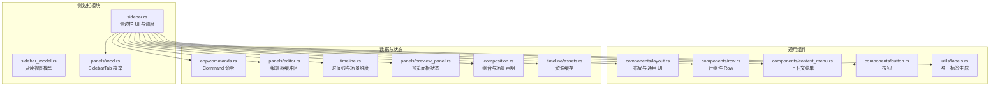
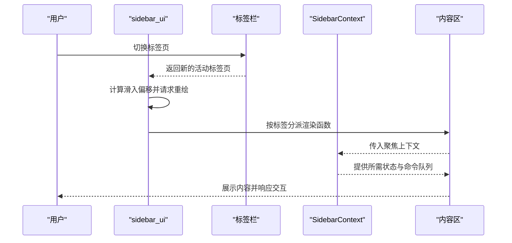
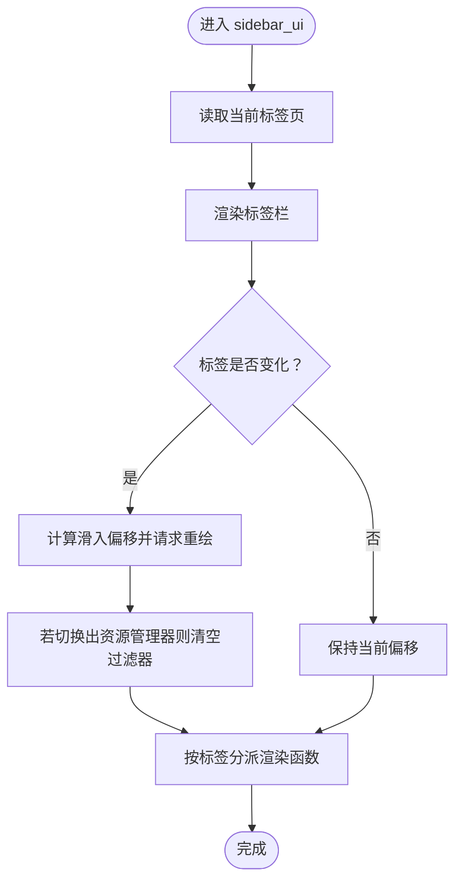
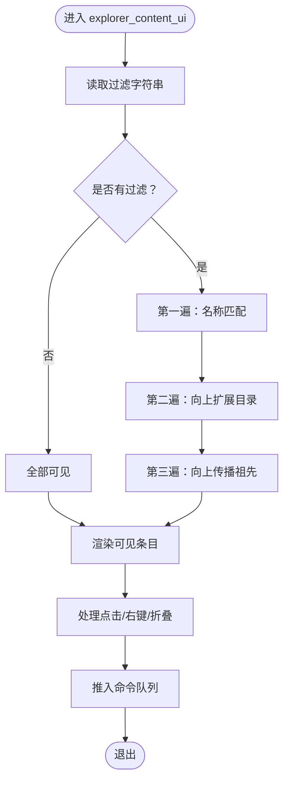
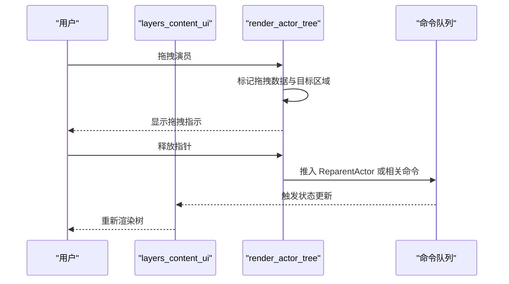
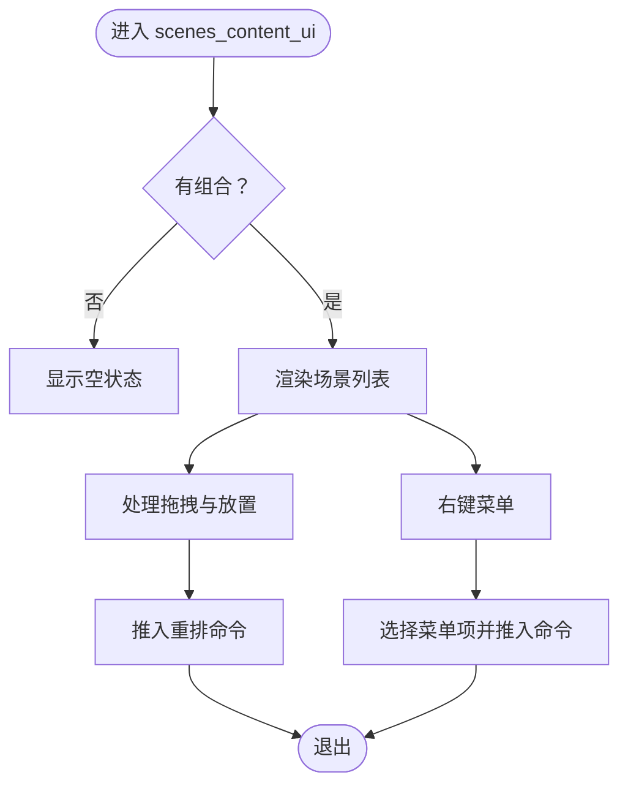
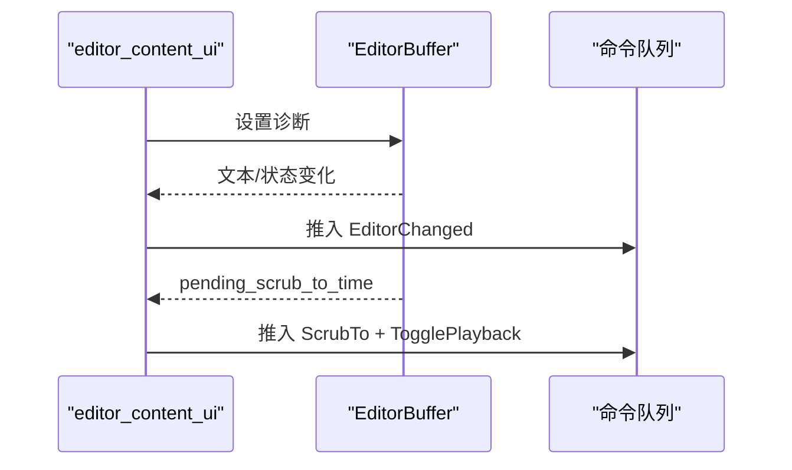
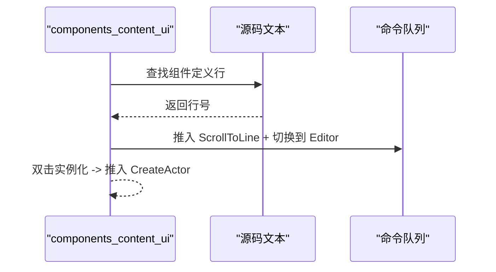
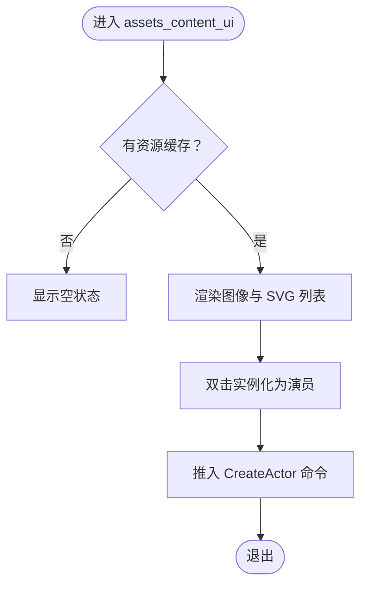
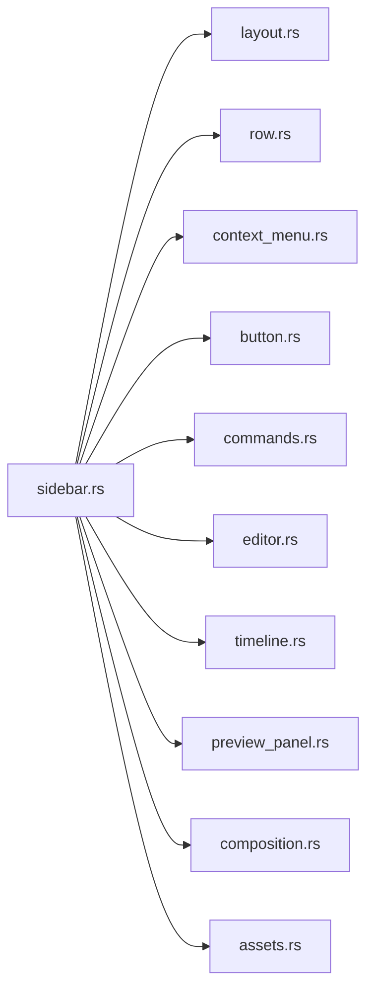

# 侧边栏面板 API

<cite>
**本文引用的文件**
- [sidebar.rs](file://crates/animatix-gui/src/app/panels/sidebar.rs)
- [sidebar_model.rs](file://crates/animatix-gui/src/app/panels/sidebar_model.rs)
- [mod.rs（面板枚举）](file://crates/animatix-gui/src/app/panels/mod.rs)
- [commands.rs（命令定义）](file://crates/animatix-gui/src/app/commands.rs)
- [layout.rs（布局与通用组件）](file://crates/animatix-gui/src/app/components/layout.rs)
- [row.rs（行组件）](file://crates/animatix-gui/src/app/components/row.rs)
- [context_menu.rs（上下文菜单）](file://crates/animatix-gui/src/app/components/context_menu.rs)
- [button.rs（按钮组件）](file://crates/animatix-gui/src/app/components/button.rs)
- [labels.rs（标签生成工具）](file://crates/animatix-gui/src/app/utils/labels.rs)
- [editor.rs（编辑器缓冲区）](file://crates/animatix-gui/src/app/panels/editor.rs)
- [timeline.rs（时间线与场景维度）](file://crates/animatix-gui/src/app/timeline.rs)
- [preview_panel.rs（预览面板状态）](file://crates/animatix-gui/src/app/panels/preview_panel.rs)
- [composition.rs（组合与场景声明）](file://crates/animatix/src/composition.rs)
- [assets.rs（资源缓存）](file://crates/animatix/src/timeline/assets.rs)
</cite>

## 目录
1. [简介](#简介)
2. [项目结构](#项目结构)
3. [核心组件](#核心组件)
4. [架构总览](#架构总览)
5. [详细组件分析](#详细组件分析)
6. [依赖关系分析](#依赖关系分析)
7. [性能考量](#性能考量)
8. [故障排查指南](#故障排查指南)
9. [结论](#结论)
10. [附录：API 参考与示例](#附录api-参考与示例)

## 简介
本文件系统性记录 Animatix 侧边栏面板 API，覆盖以下方面：
- 标签页管理 API：资源管理器、图层、场景、编辑器、组件、资产等标签页的切换与内容展示接口
- 侧边栏模型 API：面板状态管理、布局控制与用户交互响应
- 事件处理 API：标签页切换事件、面板展开收起、内容更新通知
- 集成与自定义指南：如何通过命令队列驱动 UI 更新，如何扩展新标签页或增强现有标签页

## 项目结构
侧边栏位于 GUI 子工程中，采用“标签页 + 内容区”的组织方式，标签页由统一的 tab bar 控制，内容区按需渲染对应标签页视图。

**图表来源**
- [sidebar.rs:102-194](file://crates/animatix-gui/src/app/panels/sidebar.rs#L102-L194)
- [sidebar_model.rs:14-33](file://crates/animatix-gui/src/app/panels/sidebar_model.rs#L14-L33)
- [mod.rs（面板枚举）:22-27](file://crates/animatix-gui/src/app/panels/mod.rs#L22-L27)

**章节来源**
- [sidebar.rs:102-194](file://crates/animatix-gui/src/app/panels/sidebar.rs#L102-L194)
- [sidebar_model.rs:14-33](file://crates/animatix-gui/src/app/panels/sidebar_model.rs#L14-L33)
- [mod.rs（面板枚举）:22-27](file://crates/animatix-gui/src/app/panels/mod.rs#L22-L27)

## 核心组件
- 侧边栏上下文与聚焦上下文
  - 全局上下文：包含当前激活场景、是否为组合模式、组合对象、当前文件路径、已展开目录集合、文件树、预览状态、命令队列、时间线、选中/折叠的演员集合、当前标签页、编辑器缓冲区、诊断信息、源码脏标记、播放状态、组件表、资源缓存、场景尺寸等
  - 聚焦上下文：针对每个标签页的子上下文（如资源管理器、图层、场景、编辑器、组件、资产），仅携带该标签页所需字段
- 标签页枚举：SidebarTab，包含 Explorer、Layers、Scenes、Editor、Components、Assets
- 视图模型：SidebarModel（不可变），用于将状态注入到 UI 渲染流程

**章节来源**
- [sidebar.rs:30-50](file://crates/animatix-gui/src/app/panels/sidebar.rs#L30-L50)
- [sidebar.rs:54-100](file://crates/animatix-gui/src/app/panels/sidebar.rs#L54-L100)
- [sidebar_model.rs:14-33](file://crates/animatix-gui/src/app/panels/sidebar_model.rs#L14-L33)
- [mod.rs（面板枚举）:22-27](file://crates/animatix-gui/src/app/panels/mod.rs#L22-L27)

## 架构总览
侧边栏 UI 以“标签栏 + 内容区”为核心，标签栏使用 pill 形式，内容区随标签切换进行滑入动画；每个标签页通过对应的聚焦上下文渲染其专属内容。

**图表来源**
- [sidebar.rs:102-194](file://crates/animatix-gui/src/app/panels/sidebar.rs#L102-L194)
- [sidebar.rs:196-208](file://crates/animatix-gui/src/app/panels/sidebar.rs#L196-L208)

## 详细组件分析

### 标签页管理 API
- 标签栏渲染与切换
  - 使用 pill 形式的标签栏，支持点击切换；切换时触发滑入动画并清空资源管理器过滤器
  - 动画通过 egui 的动画值实现，避免闪烁并保证流畅
- 内容分发
  - 根据当前标签页调用对应渲染函数：资源管理器、图层、场景、编辑器、组件、资产
  - 每个标签页接收独立的聚焦上下文，确保职责单一

**图表来源**
- [sidebar.rs:102-194](file://crates/animatix-gui/src/app/panels/sidebar.rs#L102-L194)
- [sidebar.rs:196-208](file://crates/animatix-gui/src/app/panels/sidebar.rs#L196-L208)

**章节来源**
- [sidebar.rs:102-194](file://crates/animatix-gui/src/app/panels/sidebar.rs#L102-L194)
- [sidebar.rs:196-208](file://crates/animatix-gui/src/app/panels/sidebar.rs#L196-L208)

### 资源管理器（Explorer）
- 过滤输入
  - 使用 egui 的临时数据存储过滤字符串，支持大小写不敏感匹配
  - 当输入为空且失去焦点时，显式持久空串以同步状态
- 可见性计算
  - 三遍扫描：直接名称匹配、向上扩展目录可见性、向下传播祖先可见性
  - 过滤关闭时默认全部可见
- 行渲染与交互
  - 支持文件与目录图标、选中态、展开/折叠指示
  - 右键菜单：打开文件、展开/折叠目录
  - 左键点击：切换展开或打开文件；点击 Chevron：切换展开
- 命令驱动
  - 打开文件、切换目录展开、清空过滤器

**图表来源**
- [sidebar.rs:225-384](file://crates/animatix-gui/src/app/panels/sidebar.rs#L225-L384)

**章节来源**
- [sidebar.rs:225-384](file://crates/animatix-gui/src/app/panels/sidebar.rs#L225-L384)

### 图层（Layers）
- 场景提示
  - 组合模式下显示当前场景名，便于确认当前操作范围
- 根节点渲染
  - 递归渲染演员树，支持选择、展开/折叠、可见性与锁定切换
  - 右侧按钮：眼睛图标切换可见性，锁图标切换锁定
- 拖拽重排
  - 支持拖拽到任意节点作为子项，或拖拽到根节点区域进行顶层重排
  - 拖拽过程中绘制高亮指示线
- 上下文菜单
  - 单选：复制、删除
  - 多选：对齐、分布、删除
- 命令驱动
  - 切换可见性、切换锁定、重排演员、复制/删除、对齐/分布

**图表来源**
- [sidebar.rs:542-629](file://crates/animatix-gui/src/app/panels/sidebar.rs#L542-L629)
- [sidebar.rs:633-864](file://crates/animatix-gui/src/app/panels/sidebar.rs#L633-L864)

**章节来源**
- [sidebar.rs:542-629](file://crates/animatix-gui/src/app/panels/sidebar.rs#L542-L629)
- [sidebar.rs:633-864](file://crates/animatix-gui/src/app/panels/sidebar.rs#L633-L864)

### 场景（Scenes）
- 空状态提示
  - 无组合或无场景时显示占位提示
- 场景列表
  - 显示场景名称、持续时间区间、转场提示
  - 支持拖拽重排：计算插入位置并在释放时应用顺序变更
- 上下文菜单
  - 设置为活动场景、复制场景、删除场景
- 命令驱动
  - 选择场景、复制/删除场景、重排场景

**图表来源**
- [sidebar.rs:386-540](file://crates/animatix-gui/src/app/panels/sidebar.rs#L386-L540)

**章节来源**
- [sidebar.rs:386-540](file://crates/animatix-gui/src/app/panels/sidebar.rs#L386-L540)

### 编辑器（Editor）
- 诊断与脏标记
  - 将诊断信息注入编辑器；检测文本变化并更新脏标记
  - 脏标记变化时推送“编辑器内容变更”命令
- 时间轴跳转
  - 若编辑器有待执行的时间跳转请求，则推入“跳转到时间”命令；若不在播放则自动开始播放
- 命令驱动
  - 编辑器内容变更、跳转到时间、播放控制

**图表来源**
- [sidebar.rs:210-223](file://crates/animatix-gui/src/app/panels/sidebar.rs#L210-L223)

**章节来源**
- [sidebar.rs:210-223](file://crates/animatix-gui/src/app/panels/sidebar.rs#L210-L223)

### 组件（Components）
- 空状态提示
  - 无组件时显示占位提示
- 组件列表
  - 名称排序展示；双击实例化为演员；右上角“跳转到定义”按钮
  - 显示插槽与参数签名（含默认值）
- 上下文菜单
  - 实例化组件
- 命令驱动
  - 创建演员、滚动到定义、切换到编辑器标签页

**图表来源**
- [sidebar.rs:868-1004](file://crates/animatix-gui/src/app/panels/sidebar.rs#L868-L1004)
- [labels.rs](file://crates/animatix-gui/src/app/utils/labels.rs)

**章节来源**
- [sidebar.rs:868-1004](file://crates/animatix-gui/src/app/panels/sidebar.rs#L868-L1004)

### 资产（Assets）
- 空状态提示
  - 无资源缓存或无图像/SVG 时显示占位提示
- 资产列表
  - 分组显示图像与 SVG；双击将资产实例化为对应类型的演员
- 命令驱动
  - 创建图像演员、创建 SVG 演员

**图表来源**
- [sidebar.rs:1008-1098](file://crates/animatix-gui/src/app/panels/sidebar.rs#L1008-L1098)

**章节来源**
- [sidebar.rs:1008-1098](file://crates/animatix-gui/src/app/panels/sidebar.rs#L1008-L1098)

## 依赖关系分析
- 组件耦合
  - sidebar.rs 依赖各通用组件（layout、row、context_menu、button）、命令系统、编辑器缓冲区、时间线与组合、资源缓存、预览状态等
  - 每个标签页渲染函数仅依赖其聚焦上下文，降低耦合度
- 数据流
  - UI 通过命令队列与应用外壳通信，实现“纯 UI + 命令驱动”的解耦
- 外部依赖
  - egui 用于 UI 渲染与动画
  - animatix_syntax 与 animatix 提供语法与运行时能力

**图表来源**
- [sidebar.rs:102-194](file://crates/animatix-gui/src/app/panels/sidebar.rs#L102-L194)

**章节来源**
- [sidebar.rs:102-194](file://crates/animatix-gui/src/app/panels/sidebar.rs#L102-L194)

## 性能考量
- 过滤算法
  - 资源管理器过滤采用三遍扫描，时间复杂度 O(n)，空间 O(n)，适合中大型文件树
- 滑入动画
  - 使用 egui 动画值，仅在标签切换时启动，避免持续重绘
- 拖拽指示
  - 仅在拖拽阶段绘制指示线，释放后清理数据，避免额外开销
- 可见性掩码
  - 在过滤启用时一次性构建可见掩码，减少重复判断

[本节为通用指导，无需具体文件分析]

## 故障排查指南
- 切换标签页无响应
  - 检查标签栏是否正确返回新标签页；确认内容区分派逻辑未被提前返回
  - 关注滑入动画 ID 是否一致
- 资源管理器过滤无效
  - 确认过滤字符串已写入 egui 临时数据；检查三遍扫描逻辑是否覆盖到目标条目
- 图层拖拽未生效
  - 检查拖拽数据是否正确写入与读取；确认目标节点非匿名；核对释放时机与插入位置计算
- 编辑器跳转异常
  - 确认 pending_scrub_to_time 是否存在；检查播放状态与跳转命令顺序
- 组件跳转到定义失败
  - 检查源码文本中组件定义行是否可匹配；确认命令队列中切换标签页的顺序

**章节来源**
- [sidebar.rs:102-194](file://crates/animatix-gui/src/app/panels/sidebar.rs#L102-L194)
- [sidebar.rs:225-384](file://crates/animatix-gui/src/app/panels/sidebar.rs#L225-L384)
- [sidebar.rs:633-864](file://crates/animatix-gui/src/app/panels/sidebar.rs#L633-L864)
- [sidebar.rs:210-223](file://crates/animatix-gui/src/app/panels/sidebar.rs#L210-L223)
- [sidebar.rs:868-1004](file://crates/animatix-gui/src/app/panels/sidebar.rs#L868-L1004)

## 结论
Animatix 侧边栏通过“标签栏 + 聚焦上下文 + 命令驱动”的设计，实现了清晰的职责分离与良好的扩展性。各标签页以独立渲染函数实现，配合通用组件与命令系统，既能满足日常创作需求，也为后续新增标签页或增强现有功能提供了稳定基础。

[本节为总结性内容，无需具体文件分析]

## 附录：API 参考与示例

### 标签页枚举（SidebarTab）
- 枚举项：Explorer、Layers、Scenes、Editor、Components、Assets
- 用途：驱动标签栏渲染与内容分派

**章节来源**
- [mod.rs（面板枚举）:22-27](file://crates/animatix-gui/src/app/panels/mod.rs#L22-L27)

### 侧边栏上下文与聚焦上下文
- SidebarContext：全局上下文，包含所有标签页可能需要的状态
- ExplorerContext/LayersContext/ScenesContext/EditorContext/ComponentsContext/AssetsContext：各标签页聚焦上下文
- 作用：将必要状态注入到对应渲染函数，避免全局依赖

**章节来源**
- [sidebar.rs:30-50](file://crates/animatix-gui/src/app/panels/sidebar.rs#L30-L50)
- [sidebar.rs:54-100](file://crates/animatix-gui/src/app/panels/sidebar.rs#L54-L100)

### 事件与命令
- 命令类型（示例）：打开文件、切换目录展开、选择场景、复制/删除场景、重排场景、切换可见性/锁定、重排演员、复制/删除演员、对齐/分布、创建演员、滚动到定义、编辑器内容变更、跳转到时间、播放控制
- 推送方式：渲染函数在处理交互后将命令推入 ActionQueue，由外壳统一执行

**章节来源**
- [commands.rs](file://crates/animatix-gui/src/app/commands.rs)

### 自定义指南
- 新增标签页步骤
  - 在 SidebarTab 中添加新枚举项
  - 在 sidebar_ui 的分派中增加新分支并调用对应渲染函数
  - 定义聚焦上下文结构体，仅包含该标签页所需字段
  - 在渲染函数中使用通用组件（Row、ContextMenu、Button 等）构建 UI
  - 在交互处理中推入相应命令
- 增强现有标签页
  - 资源管理器：可扩展过滤规则或引入更多元信息
  - 图层：可增加更多属性开关或快捷操作
  - 场景：可扩展转场可视化或批量操作
  - 编辑器：可接入更多语言特性或调试工具
  - 组件：可扩展参数校验或模板化实例化
  - 资产：可扩展预览与导入流程

**章节来源**
- [sidebar.rs:102-194](file://crates/animatix-gui/src/app/panels/sidebar.rs#L102-L194)
- [sidebar.rs:225-384](file://crates/animatix-gui/src/app/panels/sidebar.rs#L225-L384)
- [sidebar.rs:542-629](file://crates/animatix-gui/src/app/panels/sidebar.rs#L542-L629)
- [sidebar.rs:386-540](file://crates/animatix-gui/src/app/panels/sidebar.rs#L386-L540)
- [sidebar.rs:210-223](file://crates/animatix-gui/src/app/panels/sidebar.rs#L210-L223)
- [sidebar.rs:868-1004](file://crates/animatix-gui/src/app/panels/sidebar.rs#L868-L1004)
- [sidebar.rs:1008-1098](file://crates/animatix-gui/src/app/panels/sidebar.rs#L1008-L1098)