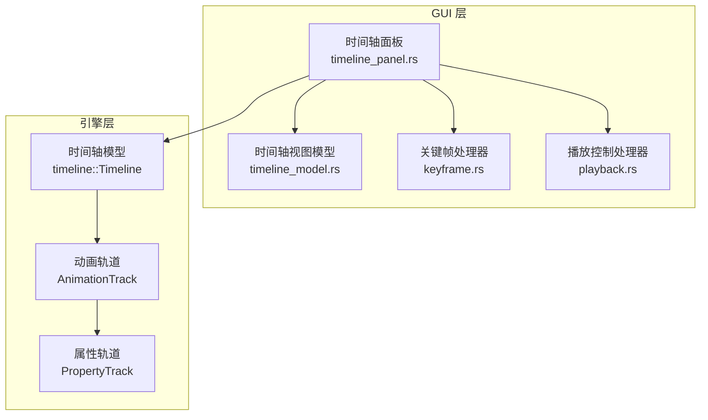
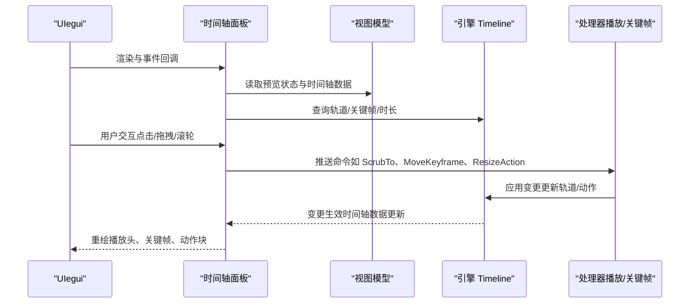
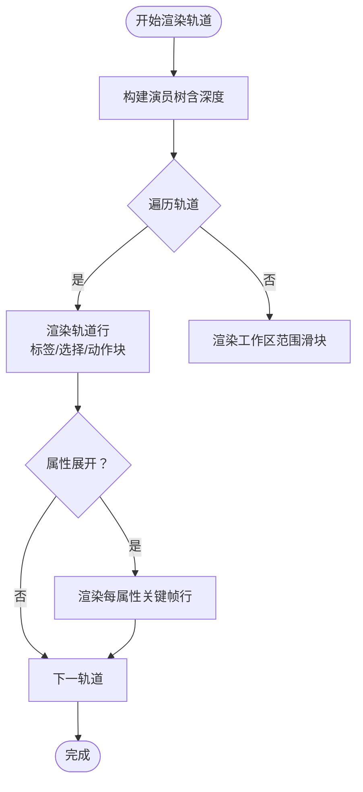
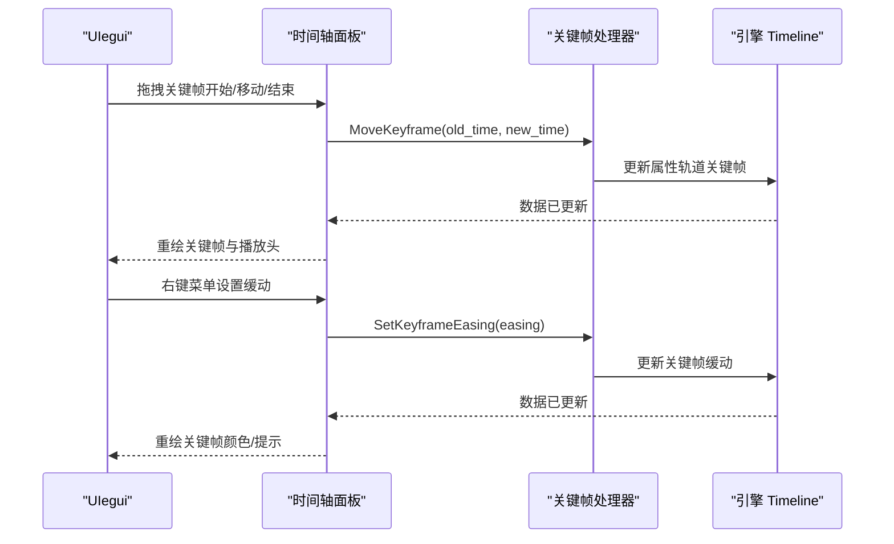
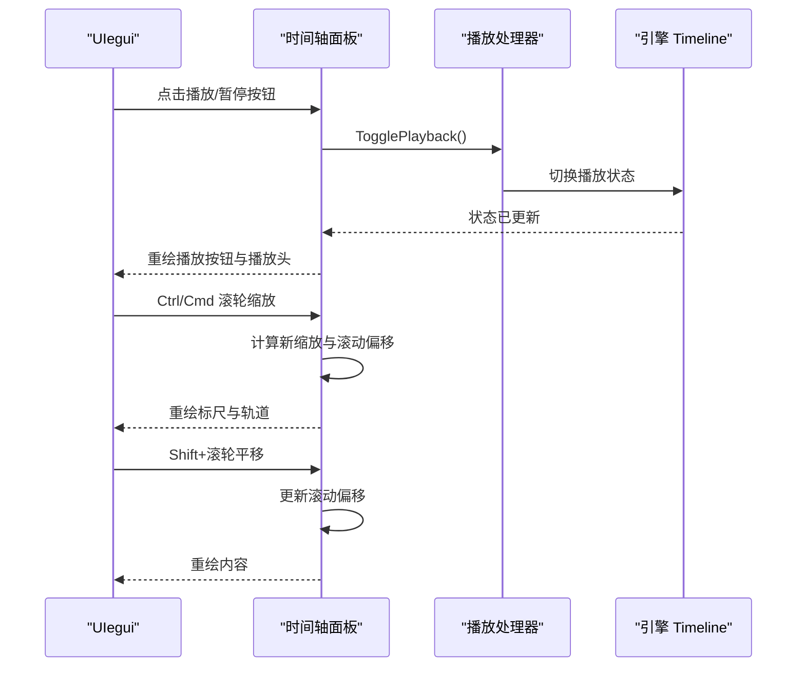
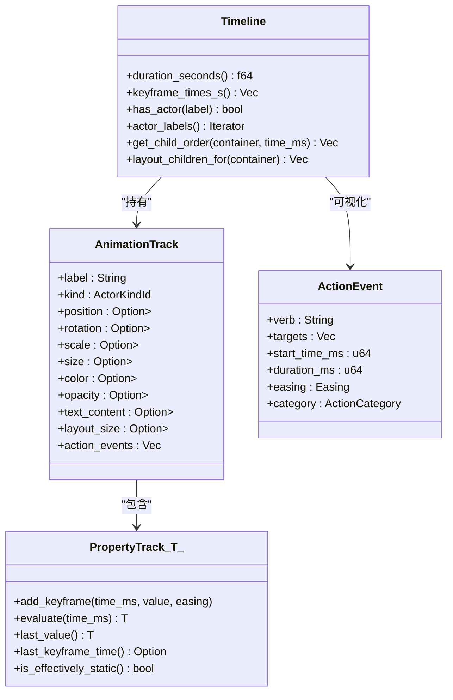
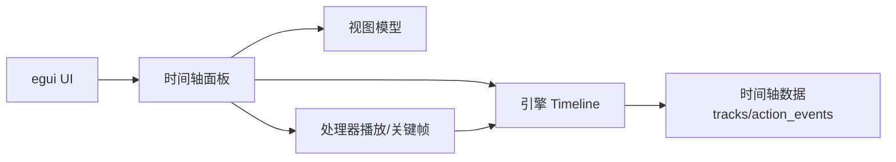

# 时间轴面板 API

<cite>
**本文引用的文件**
- [timeline_panel.rs](file://crates/animatix-gui/src/app/panels/timeline_panel.rs)
- [timeline_model.rs](file://crates/animatix-gui/src/app/panels/timeline_model.rs)
- [track.rs](file://crates/animatix/src/timeline/track.rs)
- [mod.rs（timeline 模块）](file://crates/animatix/src/timeline/mod.rs)
- [keyframe.rs](file://crates/animatix-gui/src/app/handlers/keyframe.rs)
- [playback.rs](file://crates/animatix-gui/src/app/handlers/playback.rs)
</cite>

## 目录
1. [简介](#简介)
2. [项目结构](#项目结构)
3. [核心组件](#核心组件)
4. [架构总览](#架构总览)
5. [详细组件分析](#详细组件分析)
6. [依赖关系分析](#依赖关系分析)
7. [性能考量](#性能考量)
8. [故障排查指南](#故障排查指南)
9. [结论](#结论)
10. [附录：实现示例与最佳实践](#附录实现示例与最佳实践)

## 简介
本文件系统性梳理 Animatix 时间轴面板的 API 设计与实现，覆盖以下方面：
- 轨道管理：轨道创建、删除、重排与属性编辑接口的来源与调用链
- 关键帧编辑：添加、移动、删除与插值设置的交互与命令流
- 播放控制：播放/暂停、拖拽播放头、缩放与平移操作
- 时间轴模型：时间范围管理、帧率控制与渲染优化策略
- 集成示例与性能优化建议：如何在 GUI 中安全地组合使用上述 API

## 项目结构
时间轴面板位于 GUI 子工程中，核心渲染逻辑由 egui 驱动；时间轴数据模型位于引擎子工程，二者通过命令与状态进行解耦。

**图表来源**
- [timeline_panel.rs:103-105](file://crates/animatix-gui/src/app/panels/timeline_panel.rs#L103-L105)
- [timeline_model.rs:7-19](file://crates/animatix-gui/src/app/panels/timeline_model.rs#L7-L19)
- [mod.rs（timeline 模块）:431-502](file://crates/animatix/src/timeline/mod.rs#L431-L502)
- [track.rs:549-665](file://crates/animatix/src/timeline/track.rs#L549-L665)

**章节来源**
- [timeline_panel.rs:1-120](file://crates/animatix-gui/src/app/panels/timeline_panel.rs#L1-L120)
- [timeline_model.rs:1-20](file://crates/animatix-gui/src/app/panels/timeline_model.rs#L1-L20)
- [mod.rs（timeline 模块）:1-120](file://crates/animatix/src/timeline/mod.rs#L1-L120)

## 核心组件
- 时间轴面板渲染器：负责绘制标尺、轨道、关键帧、动作块、播放头与工作区范围滑块，并处理交互事件（点击、拖拽、滚轮等）
- 时间轴视图模型：封装预览状态、时间轴数据、合成信息与 UI 缓存
- 引擎时间轴模型：包含场景图、动画轨道与属性轨道，提供时长、关键帧收集与评估能力
- 关键帧处理器：将用户操作转换为命令并应用到文档控制器
- 播放控制处理器：驱动播放状态、同步编辑器与场景切换

**章节来源**
- [timeline_panel.rs:424-578](file://crates/animatix-gui/src/app/panels/timeline_panel.rs#L424-L578)
- [timeline_model.rs:7-19](file://crates/animatix-gui/src/app/panels/timeline_model.rs#L7-L19)
- [mod.rs（timeline 模块）:431-502](file://crates/animatix/src/timeline/mod.rs#L431-L502)
- [track.rs:442-541](file://crates/animatix/src/timeline/track.rs#L442-L541)
- [keyframe.rs:1-100](file://crates/animatix-gui/src/app/handlers/keyframe.rs#L1-L100)
- [playback.rs:1-184](file://crates/animatix-gui/src/app/handlers/playback.rs#L1-L184)

## 架构总览
时间轴面板采用“视图/模型/引擎”分层：
- 视图层：egui UI 绘制与事件捕获
- 模型层：预览状态与时间轴数据的视图模型
- 引擎层：编译后的 Timeline，包含 tracks、action_events、缓存与评估入口

**图表来源**
- [timeline_panel.rs:260-276](file://crates/animatix-gui/src/app/panels/timeline_panel.rs#L260-L276)
- [playback.rs:7-30](file://crates/animatix-gui/src/app/handlers/playback.rs#L7-L30)
- [keyframe.rs:51-73](file://crates/animatix-gui/src/app/handlers/keyframe.rs#L51-L73)
- [mod.rs（timeline 模块）:627-677](file://crates/animatix/src/timeline/mod.rs#L627-L677)

## 详细组件分析

### 轨道管理 API
- 轨道树构建与展开/折叠
  - 基于时间轴场景图构建演员树，支持深度优先遍历与子节点展开
  - 折叠状态由集合维护，影响渲染行数与布局
- 轨道标签与选择
  - 左侧标签列支持单选/多选（Shift/Ctrl/Cmd），并自动滚动至可视区域
- 动作块（Action Blocks）
  - 基于 ActionEvent 渲染彩色块段，支持边缘拖拽调整起始/持续时间
  - 拖拽过程中显示临时指示线与持续时间提示
- 场景轨道（Composition 专用）
  - 渲染场景块、边箭头与转场徽章，支持拖拽重排场景顺序

**图表来源**
- [timeline_panel.rs:131-154](file://crates/animatix-gui/src/app/panels/timeline_panel.rs#L131-L154)
- [timeline_panel.rs:933-1020](file://crates/animatix-gui/src/app/panels/timeline_panel.rs#L933-L1020)
- [timeline_panel.rs:1069-1180](file://crates/animatix-gui/src/app/panels/timeline_panel.rs#L1069-L1180)
- [timeline_panel.rs:1336-1442](file://crates/animatix-gui/src/app/panels/timeline_panel.rs#L1336-L1442)

**章节来源**
- [timeline_panel.rs:131-154](file://crates/animatix-gui/src/app/panels/timeline_panel.rs#L131-L154)
- [timeline_panel.rs:933-1020](file://crates/animatix-gui/src/app/panels/timeline_panel.rs#L933-L1020)
- [timeline_panel.rs:1069-1180](file://crates/animatix-gui/src/app/panels/timeline_panel.rs#L1069-L1180)
- [timeline_panel.rs:1336-1442](file://crates/animatix-gui/src/app/panels/timeline_panel.rs#L1336-L1442)

### 关键帧编辑 API
- 关键帧采集与可视化
  - 支持按演员聚合所有属性的关键帧时间，或按属性拆分展示
  - 关键帧以菱形绘制，支持悬停、右键菜单与拖拽
- 拖拽移动
  - 支持单个/多个关键帧拖拽，拖拽时显示引导线与时间提示
  - 默认按帧率对齐，Shift 可自由拖拽
- 插值设置
  - 右键菜单提供缓动曲线选择，应用后生成命令
- 批量操作
  - 在轨道条右键可批量删除所选关键帧

**图表来源**
- [timeline_panel.rs:1182-1284](file://crates/animatix-gui/src/app/panels/timeline_panel.rs#L1182-L1284)
- [timeline_panel.rs:1288-1323](file://crates/animatix-gui/src/app/panels/timeline_panel.rs#L1288-L1323)
- [keyframe.rs:51-73](file://crates/animatix-gui/src/app/handlers/keyframe.rs#L51-L73)
- [keyframe.rs:1-27](file://crates/animatix-gui/src/app/handlers/keyframe.rs#L1-L27)

**章节来源**
- [timeline_panel.rs:1182-1284](file://crates/animatix-gui/src/app/panels/timeline_panel.rs#L1182-L1284)
- [timeline_panel.rs:1288-1323](file://crates/animatix-gui/src/app/panels/timeline_panel.rs#L1288-L1323)
- [keyframe.rs:1-100](file://crates/animatix-gui/src/app/handlers/keyframe.rs#L1-L100)

### 播放控制 API
- 播放/暂停/逐帧步进/跳转至上一/下一关键帧
- 滚轮缩放与水平平移（支持 Ctrl/Cmd 与 Shift）
- 循环区域与 Ping-Pong 播放开关
- 时间码显示与帧率控制

**图表来源**
- [timeline_panel.rs:280-422](file://crates/animatix-gui/src/app/panels/timeline_panel.rs#L280-L422)
- [timeline_panel.rs:608-663](file://crates/animatix-gui/src/app/panels/timeline_panel.rs#L608-L663)
- [playback.rs:32-36](file://crates/animatix-gui/src/app/handlers/playback.rs#L32-L36)

**章节来源**
- [timeline_panel.rs:280-422](file://crates/animatix-gui/src/app/panels/timeline_panel.rs#L280-L422)
- [timeline_panel.rs:608-663](file://crates/animatix-gui/src/app/panels/timeline_panel.rs#L608-L663)
- [playback.rs:1-184](file://crates/animatix-gui/src/app/handlers/playback.rs#L1-L184)

### 时间轴模型 API
- 时间范围与关键帧
  - 提供全局时长计算与关键帧时间收集（按轨道字段枚举）
- 属性轨道与插值
  - PropertyTrack<T> 支持默认值、键值对与缓动曲线，提供评估与最近值查询
  - 支持静态判定与缓存优化
- 动画轨道
  - AnimationTrack 包含几何、样式、滤镜、形状、文本/媒体、布局、过程式绘图等属性轨道
- 行为事件
  - ActionEvent 与 ActionCategory 用于 GUI 可视化（彩色块段）

**图表来源**
- [mod.rs（timeline 模块）:431-502](file://crates/animatix/src/timeline/mod.rs#L431-L502)
- [mod.rs（timeline 模块）:600-677](file://crates/animatix/src/timeline/mod.rs#L600-L677)
- [track.rs:442-541](file://crates/animatix/src/timeline/track.rs#L442-L541)
- [track.rs:19-54](file://crates/animatix/src/timeline/track.rs#L19-L54)

**章节来源**
- [mod.rs（timeline 模块）:600-677](file://crates/animatix/src/timeline/mod.rs#L600-L677)
- [track.rs:442-541](file://crates/animatix/src/timeline/track.rs#L442-L541)
- [track.rs:19-54](file://crates/animatix/src/timeline/track.rs#L19-L54)

## 依赖关系分析
- 视图层依赖模型层提供的预览状态与时间轴数据
- 视图层通过处理器将用户意图转化为命令，再由引擎执行
- 引擎提供稳定的 API（时长、关键帧、轨道访问），便于 UI 无状态更新

**图表来源**
- [timeline_panel.rs:424-578](file://crates/animatix-gui/src/app/panels/timeline_panel.rs#L424-L578)
- [playback.rs:7-30](file://crates/animatix-gui/src/app/handlers/playback.rs#L7-L30)
- [keyframe.rs:51-73](file://crates/animatix-gui/src/app/handlers/keyframe.rs#L51-L73)
- [mod.rs（timeline 模块）:627-677](file://crates/animatix/src/timeline/mod.rs#L627-L677)

**章节来源**
- [timeline_panel.rs:424-578](file://crates/animatix-gui/src/app/panels/timeline_panel.rs#L424-L578)
- [playback.rs:1-184](file://crates/animatix-gui/src/app/handlers/playback.rs#L1-L184)
- [keyframe.rs:1-100](file://crates/animatix-gui/src/app/handlers/keyframe.rs#L1-L100)
- [mod.rs（timeline 模块）:627-677](file://crates/animatix/src/timeline/mod.rs#L627-L677)

## 性能考量
- 渲染优化
  - 使用 ScrollArea 内部坐标系与平滑滚动增量，避免重复计算
  - 标尺与关键帧密度条仅在可见范围内绘制
  - 播放头与循环区域采用半透明填充与细线描边，降低视觉噪声
- 评估优化
  - PropertyTrack 内置最近查询缓存，减少重复插值开销
  - Timeline 具备帧缓存、变换缓存与静态子树缓存，避免重复评估
- 交互优化
  - 拖拽时仅绘制必要元素（引导线、提示框），其余延迟到下一帧
  - 滚轮缩放采用光标稳定算法，保持指针指向同一时间点

**章节来源**
- [timeline_panel.rs:608-663](file://crates/animatix-gui/src/app/panels/timeline_panel.rs#L608-L663)
- [track.rs:453-518](file://crates/animatix/src/timeline/track.rs#L453-L518)
- [mod.rs（timeline 模块）:466-479](file://crates/animatix/src/timeline/mod.rs#L466-L479)

## 故障排查指南
- 播放头不随鼠标移动
  - 确认仅在标尺区域进行点击与拖拽；轨道条交互已改为仅标尺拖拽
- 拖拽关键帧无效
  - 检查是否处于 Shift 自由拖拽模式；否则会按帧率对齐
- 缓动设置未生效
  - 确认右键菜单中的 easing 是否正确解析；若解析失败回退为线性
- 缩放/平移异常
  - 确认 Ctrl/Cmd 与 Shift 的组合是否符合预期；滚轮缩放在光标处稳定缩放

**章节来源**
- [timeline_panel.rs:746-748](file://crates/animatix-gui/src/app/panels/timeline_panel.rs#L746-L748)
- [timeline_panel.rs:1254-1267](file://crates/animatix-gui/src/app/panels/timeline_panel.rs#L1254-L1267)
- [keyframe.rs:1-27](file://crates/animatix-gui/src/app/handlers/keyframe.rs#L1-L27)
- [timeline_panel.rs:620-662](file://crates/animatix-gui/src/app/panels/timeline_panel.rs#L620-L662)

## 结论
时间轴面板通过清晰的分层设计与稳健的引擎 API，实现了高可用的轨道管理、关键帧编辑与播放控制功能。其渲染与交互均围绕时间轴数据模型展开，既保证了实时性，也兼顾了可扩展性与可维护性。

## 附录：实现示例与最佳实践
- 示例：在面板中添加一个关键帧
  - 步骤：在目标轨道的关键帧区域点击，触发右键菜单选择属性与时间，随后通过处理器生成“添加关键帧”命令
  - 参考路径：[timeline_panel.rs:1182-1205](file://crates/animatix-gui/src/app/panels/timeline_panel.rs#L1182-L1205)，[keyframe.rs:1-27](file://crates/animatix-gui/src/app/handlers/keyframe.rs#L1-L27)
- 示例：拖拽调整动作块时长
  - 步骤：在动作块边缘拖拽，面板计算时间差并生成“调整动作时长”命令
  - 参考路径：[timeline_panel.rs:1105-1165](file://crates/animatix-gui/src/app/panels/timeline_panel.rs#L1105-L1165)，[keyframe.rs:75-99](file://crates/animatix-gui/src/app/handlers/keyframe.rs#L75-L99)
- 示例：设置关键帧缓动
  - 步骤：右键关键帧打开菜单，选择缓动类型，处理器应用并刷新
  - 参考路径：[timeline_panel.rs:1206-1233](file://crates/animatix-gui/src/app/panels/timeline_panel.rs#L1206-L1233)，[keyframe.rs:5-27](file://crates/animatix-gui/src/app/handlers/keyframe.rs#L5-L27)
- 最佳实践
  - 使用帧率对齐进行关键帧移动，提升编辑一致性
  - 合理使用 Shift 进行自由拖拽，适合微调
  - 在循环播放时启用工作区范围滑块，聚焦导出片段
  - 利用属性展开查看每属性关键帧，便于定位问题

**章节来源**
- [timeline_panel.rs:1182-1284](file://crates/animatix-gui/src/app/panels/timeline_panel.rs#L1182-L1284)
- [timeline_panel.rs:1105-1165](file://crates/animatix-gui/src/app/panels/timeline_panel.rs#L1105-L1165)
- [keyframe.rs:1-100](file://crates/animatix-gui/src/app/handlers/keyframe.rs#L1-L100)