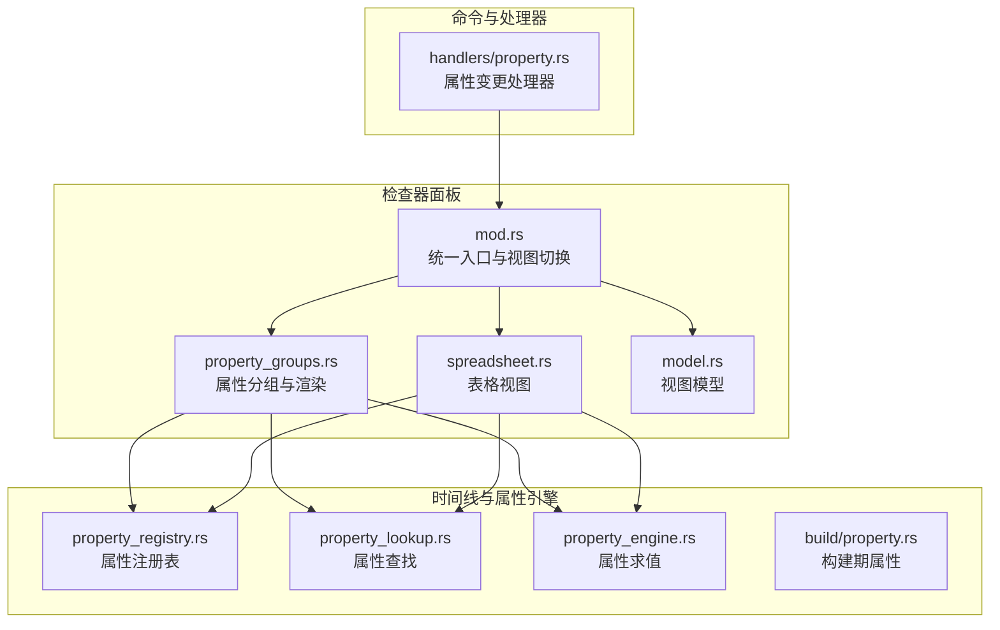
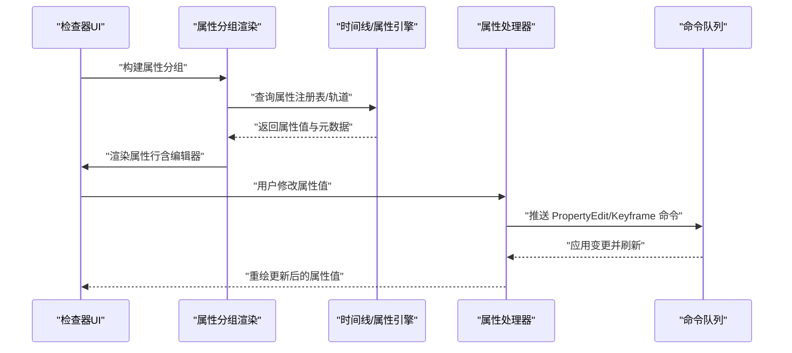
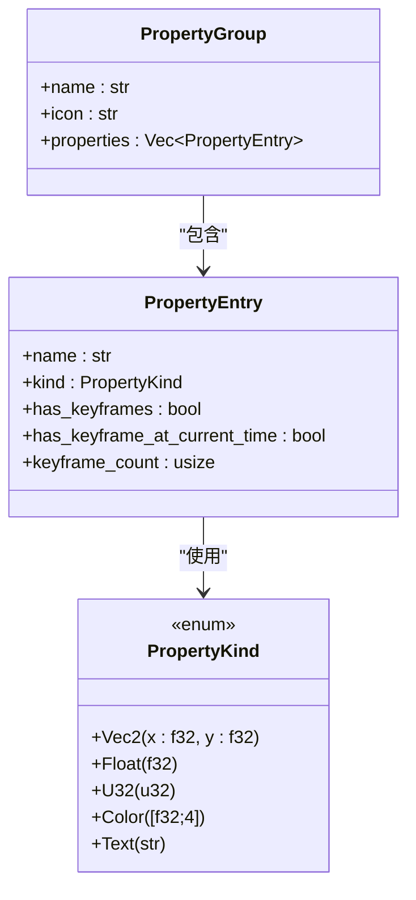
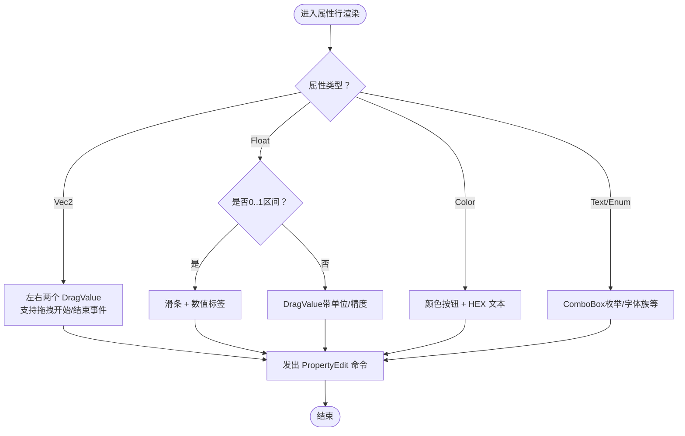
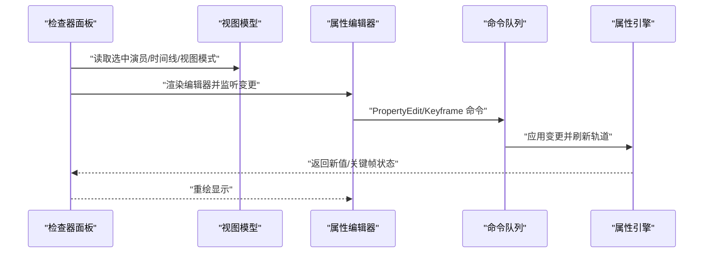
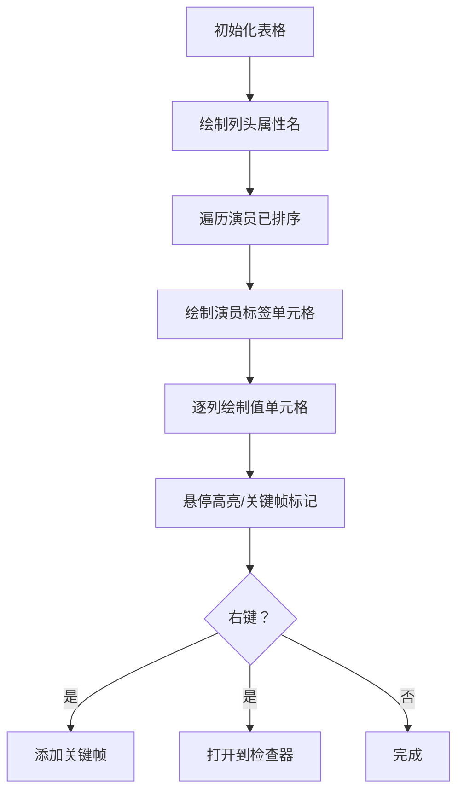
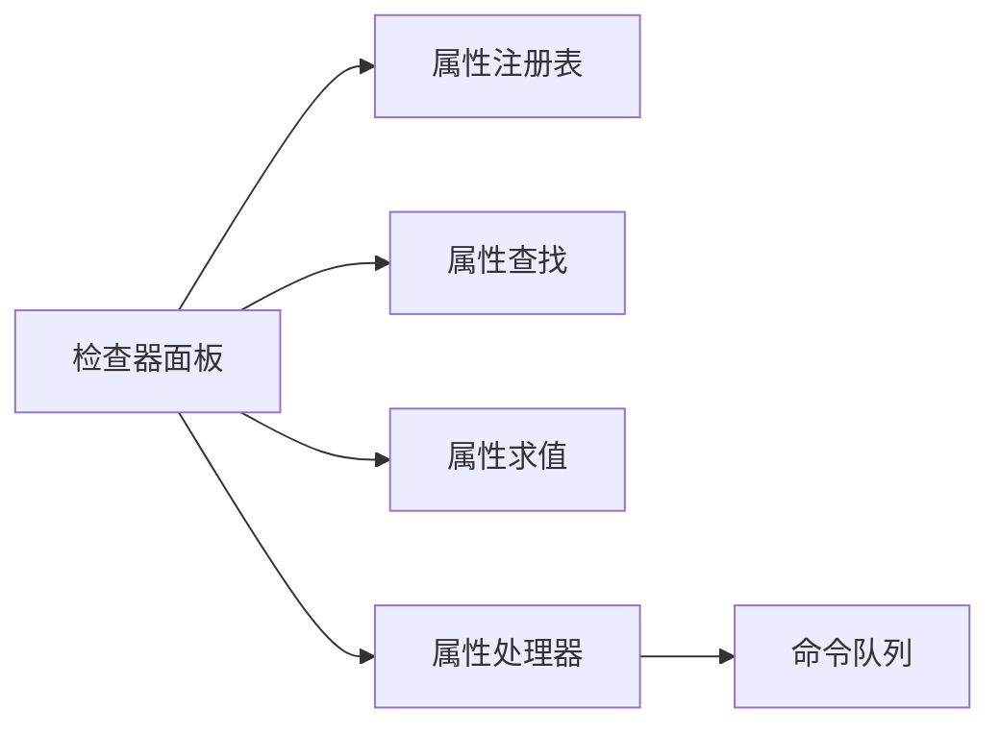

# 检查器面板 API

<cite>
**本文引用的文件**
- [mod.rs](file://crates/animatix-gui/src/app/panels/inspector/mod.rs)
- [model.rs](file://crates/animatix-gui/src/app/panels/inspector/model.rs)
- [property_groups.rs](file://crates/animatix-gui/src/app/panels/inspector/property_groups.rs)
- [spreadsheet.rs](file://crates/animatix-gui/src/app/panels/inspector/spreadsheet.rs)
- [property.rs](file://crates/animatix/src/timeline/build/property.rs)
- [property_engine.rs](file://crates/animatix/src/timeline/property_engine.rs)
- [property_registry.rs](file://crates/animatix/src/timeline/property_registry.rs)
- [property_lookup.rs](file://crates/animatix/src/timeline/property_lookup.rs)
- [property.rs](file://crates/animatix-gui/src/app/handlers/property.rs)
</cite>

## 目录
1. [简介](#简介)
2. [项目结构](#项目结构)
3. [核心组件](#核心组件)
4. [架构总览](#架构总览)
5. [详细组件分析](#详细组件分析)
6. [依赖关系分析](#依赖关系分析)
7. [性能考量](#性能考量)
8. [故障排查指南](#故障排查指南)
9. [结论](#结论)
10. [附录：实现示例与自定义编辑器开发指南](#附录实现示例与自定义编辑器开发指南)

## 简介
本文件系统性梳理 Animatix 检查器（Inspector）面板的 API 设计与实现，覆盖以下主题：
- 属性显示 API：属性分组管理、动态属性绑定与类型化显示接口
- 属性编辑器 API：数值编辑器、颜色选择器、下拉菜单等控件集成
- 检查器模型 API：选中对象管理、属性变更监听与数据验证
- 表格视图 API：属性表格渲染、排序与过滤能力
- 面向集成的实践指南：如何在现有框架内扩展自定义属性编辑器

## 项目结构
检查器面板位于 GUI 子系统中，采用“模块化 + 视图模型”的组织方式：
- 入口与布局：inspector/mod.rs 提供统一入口与多视图模式切换
- 视图模型：inspector/model.rs 定义不可变视图模型
- 属性分组与渲染：inspector/property_groups.rs 负责属性分组、类型转换与行级渲染
- 表格视图：inspector/spreadsheet.rs 实现全量演员属性表格
- 时间线与属性引擎：animatix/timeline 下的多个模块提供属性注册、查询与求值
- 属性变更处理：GUI 层的属性处理器负责将用户输入转化为命令流

图表来源
- [mod.rs:1-1218](file://crates/animatix-gui/src/app/panels/inspector/mod.rs#L1-L1218)
- [property_groups.rs:1-885](file://crates/animatix-gui/src/app/panels/inspector/property_groups.rs#L1-L885)
- [spreadsheet.rs:1-500](file://crates/animatix-gui/src/app/panels/inspector/spreadsheet.rs#L1-L500)
- [model.rs:1-24](file://crates/animatix-gui/src/app/panels/inspector/model.rs#L1-L24)
- [property_registry.rs](file://crates/animatix/src/timeline/property_registry.rs)
- [property_lookup.rs](file://crates/animatix/src/timeline/property_lookup.rs)
- [property_engine.rs](file://crates/animatix/src/timeline/property_engine.rs)
- [property.rs](file://crates/animatix/src/timeline/build/property.rs)
- [property.rs](file://crates/animatix-gui/src/app/handlers/property.rs)

章节来源
- [mod.rs:1-1218](file://crates/animatix-gui/src/app/panels/inspector/mod.rs#L1-L1218)
- [property_groups.rs:1-885](file://crates/animatix-gui/src/app/panels/inspector/property_groups.rs#L1-L885)
- [spreadsheet.rs:1-500](file://crates/animatix-gui/src/app/panels/inspector/spreadsheet.rs#L1-L500)
- [model.rs:1-24](file://crates/animatix-gui/src/app/panels/inspector/model.rs#L1-L24)

## 核心组件
- 统一入口与视图模式
  - 支持语义视图（按功能分组）、强度视图（按活跃度扁平列表）、表格视图三种模式
  - 在无选中演员时展示场景级属性（如时长、背景色、转场）
- 属性分组与类型化显示
  - 基于属性注册表与时间线轨道，动态生成属性条目，并进行显示归一化（如半 extents → 全尺寸、角度单位换算）
  - 将不同类型的属性值映射到统一的显示枚举，驱动对应编辑器
- 表格视图
  - 以演员为行、常用属性为列，实时显示当前时间点的属性值，支持右键添加关键帧
- 视图模型
  - 不可变视图模型封装预览状态、时间线、组合信息、选中集合、视图模式等上下文

章节来源
- [mod.rs:26-80](file://crates/animatix-gui/src/app/panels/inspector/mod.rs#L26-L80)
- [property_groups.rs:15-36](file://crates/animatix-gui/src/app/panels/inspector/property_groups.rs#L15-L36)
- [spreadsheet.rs:24-40](file://crates/animatix-gui/src/app/panels/inspector/spreadsheet.rs#L24-L40)
- [model.rs:9-24](file://crates/animatix-gui/src/app/panels/inspector/model.rs#L9-L24)

## 架构总览
检查器面板通过“视图层 + 数据层 + 命令层”协作完成属性的读取、显示与编辑：
- 视图层：egui 渲染器，负责布局、交互与绘制
- 数据层：时间线轨道与属性注册表，提供属性值求值与元数据
- 命令层：将用户操作转化为命令（如 PropertyEdit、SetKeyframe），交由应用调度执行

图表来源
- [mod.rs:429-789](file://crates/animatix-gui/src/app/panels/inspector/mod.rs#L429-L789)
- [property_groups.rs:258-321](file://crates/animatix-gui/src/app/panels/inspector/property_groups.rs#L258-L321)
- [property_engine.rs](file://crates/animatix/src/timeline/property_engine.rs)
- [property_registry.rs](file://crates/animatix/src/timeline/property_registry.rs)
- [property.rs](file://crates/animatix-gui/src/app/handlers/property.rs)

## 详细组件分析

### 属性显示 API
- 属性分组管理
  - 依据属性字段类别自动分组（变换、样式、形状、文本、媒体、效果、音频）
  - 分组支持展开/折叠，显示属性数量与关键帧状态
- 动态属性绑定
  - 从时间线轨道读取当前时间点的属性值，支持默认值回退
  - 对存储格式与显示格式的差异进行归一化（如半 extents、角度单位）
- 类型化显示接口
  - 将底层属性值映射为统一的显示类型（Vec2、Float、U32、Color、Text）
  - 为每种类型选择合适的编辑器（拖拽、滑条、颜色选择器、下拉框）

图表来源
- [property_groups.rs:15-36](file://crates/animatix-gui/src/app/panels/inspector/property_groups.rs#L15-L36)

章节来源
- [property_groups.rs:39-172](file://crates/animatix-gui/src/app/panels/inspector/property_groups.rs#L39-L172)
- [property_groups.rs:179-254](file://crates/animatix-gui/src/app/panels/inspector/property_groups.rs#L179-L254)

### 属性编辑器 API
- 数值编辑器
  - 浮点数：拖拽输入或滑条；对透明度、进度类属性采用 0..1 区间滑条
  - 整数：拖拽输入，用于离散值（如层级）
  - 角度：内部以弧度存储，显示为度数；拖动时自动换算
- 颜色选择器
  - 使用颜色按钮选择 RGBA；同步 HEX 文本显示
  - 变更后转换为内部颜色表示并提交命令
- 下拉菜单
  - 形状类型、字体族等枚举值使用 ComboBox
  - 选项来自注册表或运行时可用集合（如字体族）

图表来源
- [property_groups.rs:497-800](file://crates/animatix-gui/src/app/panels/inspector/property_groups.rs#L497-L800)

章节来源
- [property_groups.rs:497-800](file://crates/animatix-gui/src/app/panels/inspector/property_groups.rs#L497-L800)

### 检查器模型 API
- 选中对象管理
  - 支持单选与多选；多选时提供批量提示与拖拽应用
  - 当选中演员不存在于时间线时自动清空选中集合
- 属性变更监听
  - 通过命令队列推送 PropertyEdit、SetKeyframe、DeleteKeyframe 等命令
  - 编辑器在拖拽开始/结束时发出 DragEvent 以控制预览行为
- 数据验证
  - 输入范围约束（如 0..1、角度范围、像素偏移）
  - 关键帧存在性与当前时间点状态联动显示

图表来源
- [mod.rs:429-789](file://crates/animatix-gui/src/app/panels/inspector/mod.rs#L429-L789)
- [model.rs:9-24](file://crates/animatix-gui/src/app/panels/inspector/model.rs#L9-L24)
- [property_groups.rs:452-494](file://crates/animatix-gui/src/app/panels/inspector/property_groups.rs#L452-L494)

章节来源
- [mod.rs:441-502](file://crates/animatix-gui/src/app/panels/inspector/mod.rs#L441-L502)
- [property_groups.rs:452-494](file://crates/animatix-gui/src/app/panels/inspector/property_groups.rs#L452-L494)

### 表格视图 API
- 渲染策略
  - 使用 egui Grid，行列均支持滚动；左上角固定为标签区域
  - 行：按字母序排列的演员标签；列：常用属性名（位置、尺寸、旋转、不透明度、颜色等）
- 排序与过滤
  - 演员按标签排序；属性列固定为常量集
  - 过滤：仅展示有轨道或有动画的关键帧属性
- 交互
  - 左键点击演员标签选中；右键弹出菜单可添加关键帧或跳转到检查器
  - 单击/双击行为由具体单元格逻辑决定

图表来源
- [spreadsheet.rs:47-324](file://crates/animatix-gui/src/app/panels/inspector/spreadsheet.rs#L47-L324)

章节来源
- [spreadsheet.rs:24-40](file://crates/animatix-gui/src/app/panels/inspector/spreadsheet.rs#L24-L40)
- [spreadsheet.rs:328-486](file://crates/animatix-gui/src/app/panels/inspector/spreadsheet.rs#L328-L486)

## 依赖关系分析
- 检查器面板依赖时间线与属性系统提供的：
  - 属性注册表：确定属性名称、类型、可见性与分组
  - 属性查找：根据名称定位字段
  - 属性求值：在指定时间点计算属性值
- 命令层依赖 GUI 层的属性处理器，将用户输入转化为可撤销/可追踪的命令序列

图表来源
- [property_groups.rs:39-172](file://crates/animatix-gui/src/app/panels/inspector/property_groups.rs#L39-L172)
- [spreadsheet.rs:15-23](file://crates/animatix-gui/src/app/panels/inspector/spreadsheet.rs#L15-L23)
- [property_engine.rs](file://crates/animatix/src/timeline/property_engine.rs)
- [property_registry.rs](file://crates/animatix/src/timeline/property_registry.rs)
- [property_lookup.rs](file://crates/animatix/src/timeline/property_lookup.rs)
- [property.rs](file://crates/animatix-gui/src/app/handlers/property.rs)

章节来源
- [property_groups.rs:1-50](file://crates/animatix-gui/src/app/panels/inspector/property_groups.rs#L1-L50)
- [spreadsheet.rs:1-23](file://crates/animatix-gui/src/app/panels/inspector/spreadsheet.rs#L1-L23)

## 性能考量
- 渲染优化
  - 属性分组渲染缓存行样式，减少重复样式计算
  - 表格视图使用固定列宽与条纹背景，提升可读性与滚动性能
- 计算优化
  - 显示归一化在构建分组时完成，避免每次重绘重复计算
  - 表格视图仅在当前时间点求值，避免全量动画重演
- 交互优化
  - 拖拽开始/结束事件用于暂停预览更新，降低频繁重绘开销

## 故障排查指南
- 选中演员丢失
  - 现象：检查器显示“Actor not found”
  - 处理：面板会自动清空选中集合；重新在预览或层级面板中选择演员
- 无可用属性
  - 现象：显示“无可编辑属性”
  - 处理：确认演员类型与当前时间点是否存在有效轨道
- 关键帧按钮不可用
  - 现象：关键帧按钮为灰色或无填充
  - 处理：开启关键帧模式；若该时间点已有关键帧，则显示实心菱形，可右键调整缓动或删除
- 表格视图空白
  - 现象：无演员或无属性
  - 处理：确保场景中有演员且至少一个属性有轨道

章节来源
- [mod.rs:518-527](file://crates/animatix-gui/src/app/panels/inspector/mod.rs#L518-L527)
- [property_groups.rs:415-426](file://crates/animatix-gui/src/app/panels/inspector/property_groups.rs#L415-L426)
- [spreadsheet.rs:118-138](file://crates/animatix-gui/src/app/panels/inspector/spreadsheet.rs#L118-L138)

## 结论
检查器面板通过清晰的分层设计与强类型化的属性显示/编辑流程，实现了高效、直观的属性编辑体验。其核心优势在于：
- 以属性注册表与时间线轨道为中心的数据驱动渲染
- 面向不同属性类型的专用编辑器，兼顾易用性与精确性
- 多视图模式满足不同工作流需求（语义、强度、表格）
- 命令化变更便于撤销、重做与调试

## 附录：实现示例与自定义编辑器开发指南

### 示例：在现有框架中新增一个属性编辑器
- 步骤概要
  - 在属性注册表中声明新属性（名称、类型、可见性）
  - 在属性分组构建逻辑中识别该属性并映射到显示类型
  - 在属性行渲染中为该类型添加新的编辑器分支
  - 将用户输入转换为命令并推送到命令队列
- 参考路径
  - 属性注册与查找：[property_registry.rs](file://crates/animatix/src/timeline/property_registry.rs)，[property_lookup.rs](file://crates/animatix/src/timeline/property_lookup.rs)
  - 属性分组与类型映射：[property_groups.rs:39-172](file://crates/animatix-gui/src/app/panels/inspector/property_groups.rs#L39-L172)
  - 行渲染与命令推送：[property_groups.rs:497-800](file://crates/animatix-gui/src/app/panels/inspector/property_groups.rs#L497-L800)
  - 属性处理器与命令定义：[property.rs](file://crates/animatix-gui/src/app/handlers/property.rs)

### 自定义属性编辑器开发要点
- 输入校验
  - 为数值设置合理范围与步进；颜色值限制在 0..1 或 0..255 区间
- 交互一致性
  - 与现有拖拽事件协同（开始/结束事件），保证预览流畅
- 可访问性
  - 为编辑器提供清晰的标签与单位提示；对枚举类型提供可读的显示名
- 性能
  - 避免在高频变更中触发昂贵的重排；必要时使用节流/防抖