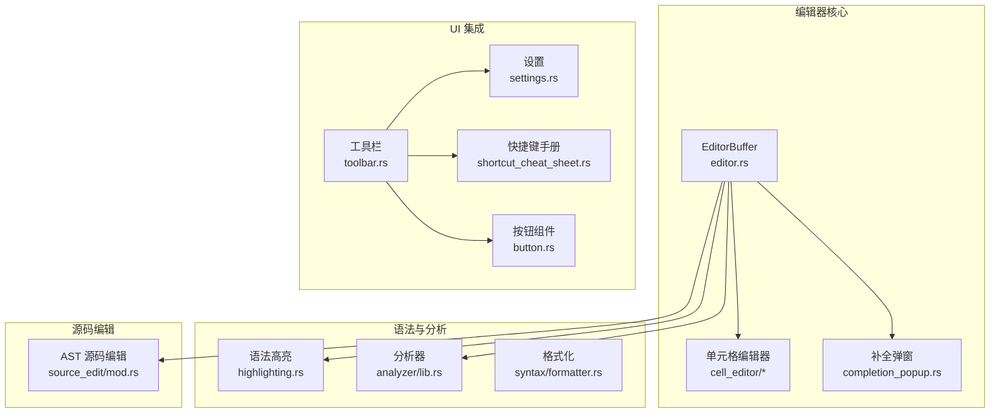
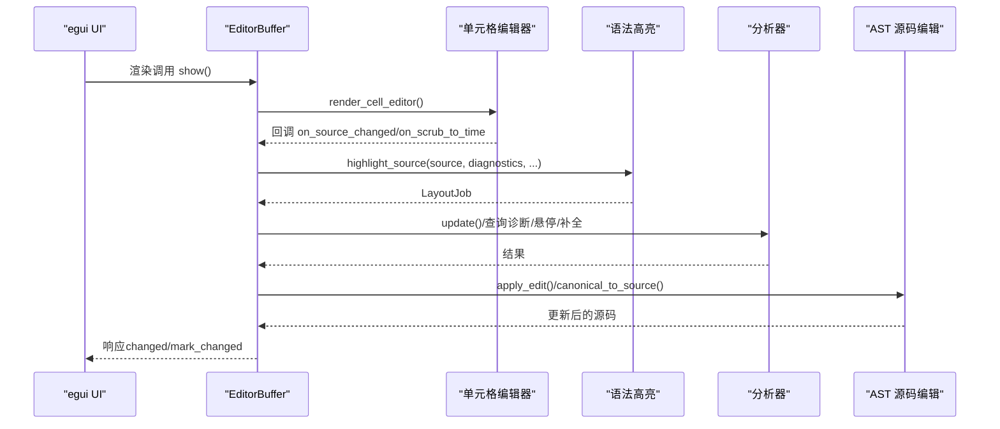
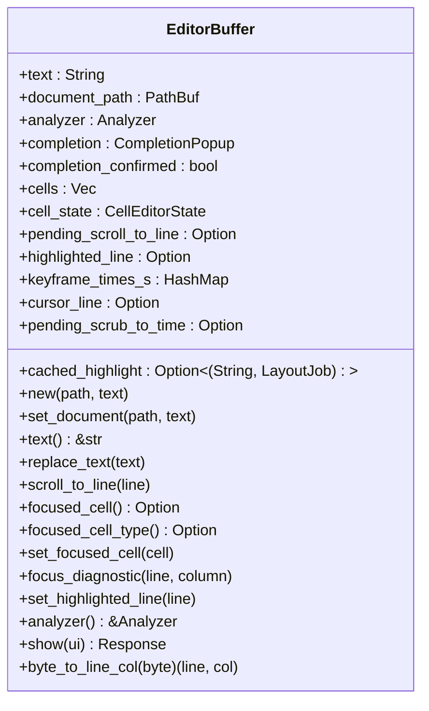
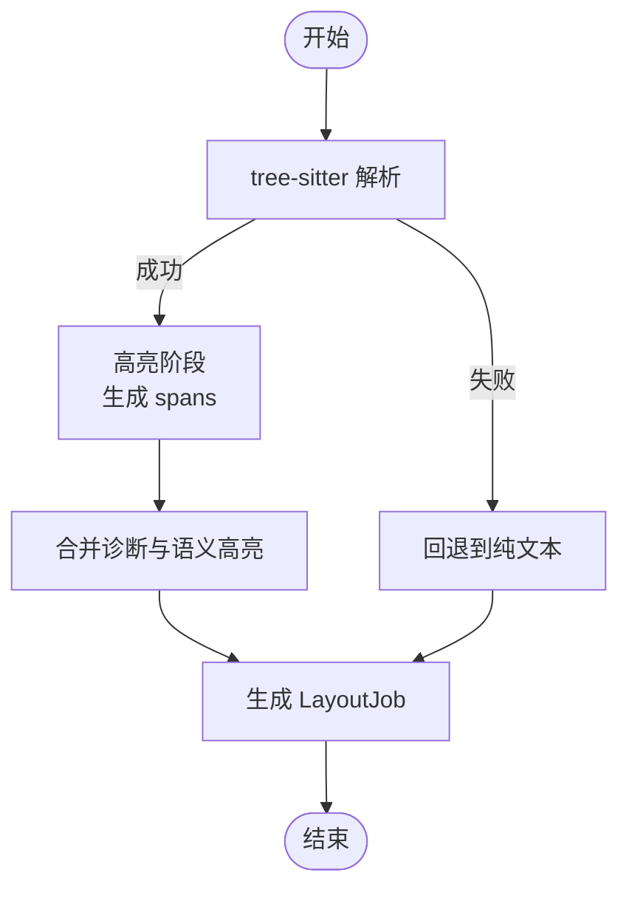
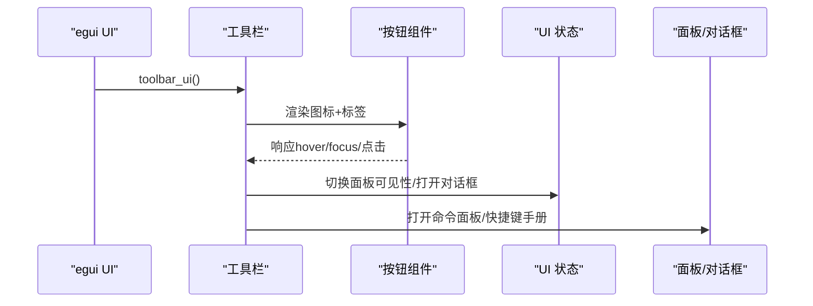
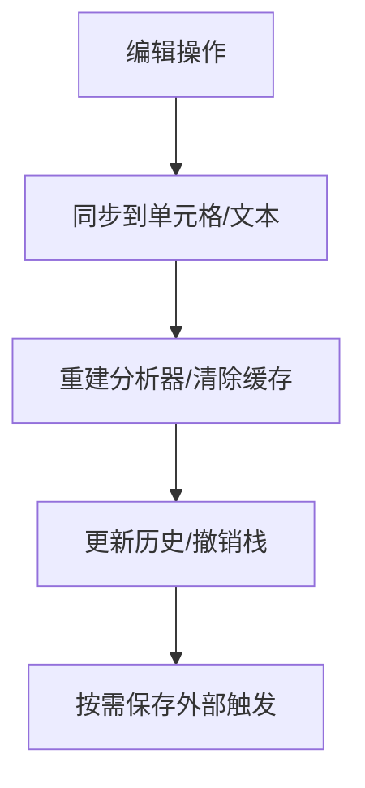
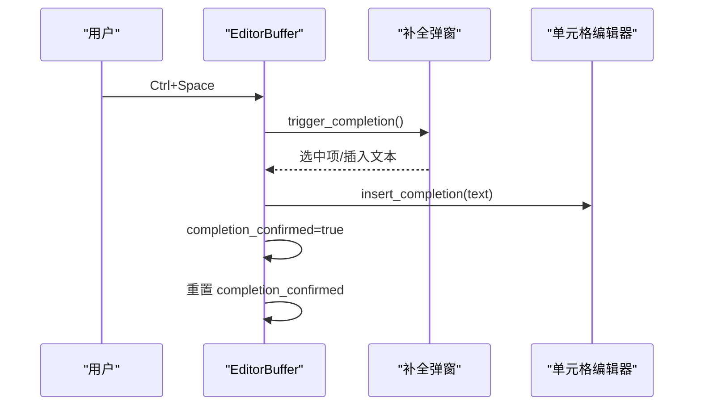
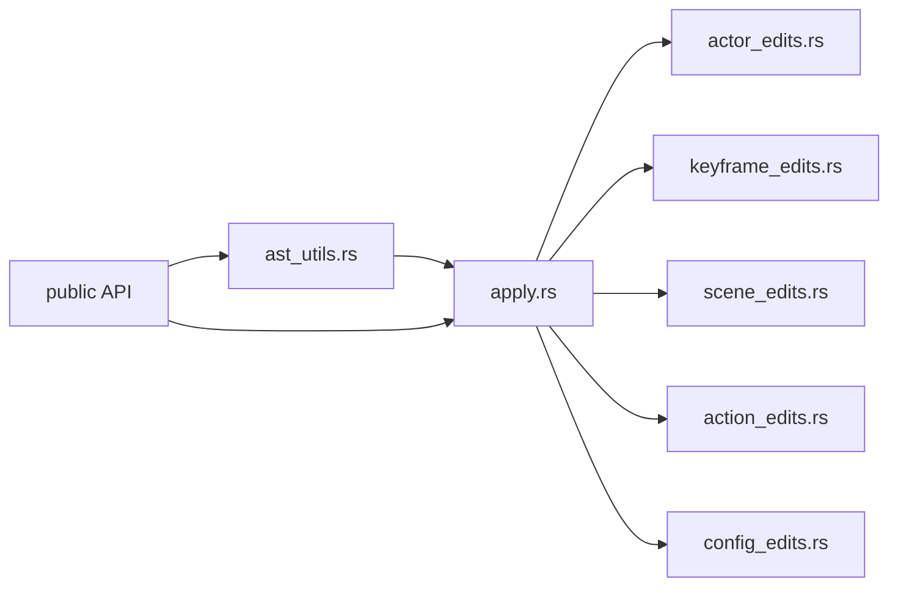
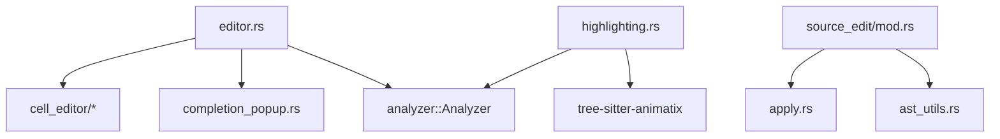

# 编辑器面板 API

<cite>
**本文引用的文件**
- [editor.rs](file://crates/animatix-gui/src/editor.rs)
- [highlighting.rs](file://crates/animatix-gui/src/highlighting.rs)
- [mod.rs](file://crates/animatix-gui/src/source_edit/mod.rs)
- [settings.rs](file://crates/animatix-gui/src/app/shell/settings.rs)
- [toolbar.rs](file://crates/animatix-gui/src/app/shell/toolbar.rs)
- [shortcut_cheat_sheet.rs](file://crates/animatix-gui/src/app/shell/shortcut_cheat_sheet.rs)
- [button.rs](file://crates/animatix-gui/src/app/components/button.rs)
- [cell_editor/mod.rs](file://crates/animatix-gui/src/cell_editor/mod.rs)
- [cell_editor/cell.rs](file://crates/animatix-gui/src/cell_editor/cell.rs)
- [completion_popup.rs](file://crates/animatix-gui/src/completion_popup.rs)
- [analyzer/lib.rs](file://crates/animatix-analyzer/src/lib.rs)
- [syntax/format_core.rs](file://crates/animatix-syntax/src/format_core.rs)
- [syntax/formatter.rs](file://crates/animatix-syntax/src/formatter.rs)
- [tree_sitter_grammar.js](file://tree-sitter-animatix/grammar.js)
- [tree_sitter_highlights.scm](file://tree-sitter-animatix/queries/highlights.scm)
</cite>

## 目录
1. [简介](#简介)
2. [项目结构](#项目结构)
3. [核心组件](#核心组件)
4. [架构总览](#架构总览)
5. [详细组件分析](#详细组件分析)
6. [依赖关系分析](#依赖关系分析)
7. [性能考量](#性能考量)
8. [故障排查指南](#故障排查指南)
9. [结论](#结论)
10. [附录：配置与扩展指南](#附录配置与扩展指南)

## 简介
本文件系统性记录 Animatix 编辑器面板的 API，覆盖以下方面：
- 编辑区域配置 API：编辑器实例管理、语法高亮与代码格式化接口
- 工具栏集成 API：工具按钮状态同步、快捷键绑定与上下文菜单
- 编辑器模型 API：文档状态管理、撤销重做与自动保存
- 编辑器事件 API：光标位置跟踪、选区管理与输入处理
- 集成与扩展：具体配置示例与扩展开发指南

目标是帮助开发者在 Animatix GUI 中正确集成与扩展编辑器功能。

## 项目结构
编辑器相关代码主要位于 crates/animatix-gui/src 下，围绕“单元格（Cell）+ 语法高亮 + 补全 + 源码编辑”构建：
- 编辑器主体：editor.rs 提供基于单元格的编辑缓冲区与渲染流程
- 语法高亮：highlighting.rs 基于 tree-sitter 生成 LayoutJob 并叠加诊断与语义高亮
- 源码编辑：source_edit/mod.rs 定义 AST 语义级编辑 API（属性、演员、关键帧、场景等）
- 工具栏与快捷键：toolbar.rs、shortcut_cheat_sheet.rs、button.rs
- 单元格与补全：cell_editor/*、completion_popup.rs
- 分析器与格式化：analyzer/lib.rs、syntax/formatter.rs、format_core.rs
- 语法树定义：tree_sitter_grammar.js、tree_sitter_highlights.scm

**图表来源**
- [editor.rs:1-480](file://crates/animatix-gui/src/editor.rs#L1-L480)
- [highlighting.rs:1-697](file://crates/animatix-gui/src/highlighting.rs#L1-L697)
- [mod.rs:1-33](file://crates/animatix-gui/src/source_edit/mod.rs#L1-L33)
- [toolbar.rs:1-339](file://crates/animatix-gui/src/app/shell/toolbar.rs#L1-L339)
- [settings.rs:229-261](file://crates/animatix-gui/src/app/shell/settings.rs#L229-L261)
- [shortcut_cheat_sheet.rs:49-178](file://crates/animatix-gui/src/app/shell/shortcut_cheat_sheet.rs#L49-L178)
- [button.rs:137-257](file://crates/animatix-gui/src/app/components/button.rs#L137-L257)

**章节来源**
- [editor.rs:1-480](file://crates/animatix-gui/src/editor.rs#L1-L480)
- [highlighting.rs:1-697](file://crates/animatix-gui/src/highlighting.rs#L1-L697)
- [mod.rs:1-33](file://crates/animatix-gui/src/source_edit/mod.rs#L1-L33)

## 核心组件
- 编辑器缓冲区 EditorBuffer：维护文本、单元格、补全状态、当前光标行、时间轴同步信息等
- 语法高亮 highlight_source：基于 tree-sitter 生成 LayoutJob，支持诊断背景与语义高亮叠加
- 源码编辑模块 source_edit：以 AST 为中心的语义编辑 API（属性、演员、关键帧、场景、动作、配置）
- 工具栏与快捷键：工具栏按钮、状态同步、快捷键提示与命令面板
- 单元格与补全：单元格解析/渲染、补全触发与插入

**章节来源**
- [editor.rs:14-480](file://crates/animatix-gui/src/editor.rs#L14-L480)
- [highlighting.rs:135-255](file://crates/animatix-gui/src/highlighting.rs#L135-L255)
- [mod.rs:1-33](file://crates/animatix-gui/src/source_edit/mod.rs#L1-L33)

## 架构总览
编辑器采用“单元格 + 语法高亮 + 补全 + AST 源码编辑”的分层设计：
- 上层 UI：egui 渲染，工具栏与快捷键驱动
- 中层模型：EditorBuffer 维护状态与事件；单元格编辑器负责结构化输入
- 下层分析：tree-sitter 高亮、Analyzer 提供诊断与补全；AST 编辑器负责语义修改
- 外部集成：设置项控制重建去抖与撤销上限；格式化器提供代码风格统一

**图表来源**
- [editor.rs:246-457](file://crates/animatix-gui/src/editor.rs#L246-L457)
- [highlighting.rs:135-255](file://crates/animatix-gui/src/highlighting.rs#L135-L255)
- [mod.rs:22-25](file://crates/animatix-gui/src/source_edit/mod.rs#L22-L25)

## 详细组件分析

### 编辑器实例与编辑区域配置 API
- 实例管理
  - 创建与更新：通过构造函数与 set_document 初始化/切换文档路径与内容，内部重建分析器、单元格与补全状态
  - 文本访问：提供只读文本视图，保证与单元格同步
  - 结构变更：replace_text 触发重建单元格与分析器，清空时间戳映射与滚动/高亮标记
- 光标与滚动
  - scroll_to_line 设置下帧滚动目标，由上层工作区消费
  - cursor_line 基于聚焦单元格估算当前光标行
  - highlighted_line 支持时间轴同步高亮整行
- 时间轴同步
  - keyframe_times_s 维护行到时间的映射
  - pending_scrub_to_time 由单元格播放按钮触发，供工作区拖动时间轴
- 诊断定位
  - focus_diagnostic 将诊断映射到单元格体内的字符偏移，自动滚动并放置光标在问题词后

**图表来源**
- [editor.rs:14-480](file://crates/animatix-gui/src/editor.rs#L14-L480)

**章节来源**
- [editor.rs:41-92](file://crates/animatix-gui/src/editor.rs#L41-L92)
- [editor.rs:94-178](file://crates/animatix-gui/src/editor.rs#L94-L178)
- [editor.rs:246-457](file://crates/animatix-gui/src/editor.rs#L246-L457)

### 语法高亮与代码格式化接口
- 语法高亮
  - highlight_source 使用 tree-sitter 解析与高亮，生成 egui LayoutJob
  - 支持主题色表（深浅）、诊断背景覆盖、语义高亮（演员名、场景名、属性名等）
  - 对解析失败或配置缺失进行降级回退
- 代码格式化
  - format_core 与 formatter 提供统一的格式化入口，确保风格一致性
  - 可与编辑器联动，在保存或显式触发时应用格式化

**图表来源**
- [highlighting.rs:135-255](file://crates/animatix-gui/src/highlighting.rs#L135-L255)
- [syntax/format_core.rs](file://crates/animatix-syntax/src/format_core.rs)
- [syntax/formatter.rs](file://crates/animatix-syntax/src/formatter.rs)

**章节来源**
- [highlighting.rs:135-255](file://crates/animatix-gui/src/highlighting.rs#L135-L255)
- [syntax/formatter.rs](file://crates/animatix-syntax/src/formatter.rs)

### 工具栏集成 API
- 工具按钮状态同步
  - 通过 GuiShell.toolbar_ui 组织按钮组，根据当前状态（如诊断面板可见性）动态切换按钮外观
  - 按钮组件 button.rs 提供工具栏按钮样式与焦点描边
- 快捷键绑定
  - 工具栏包含“命令面板/快捷键参考”入口
  - 快捷键手册 shortcut_cheat_sheet.rs 列出常用组合（如保存、撤销/重做、查找替换、截图等）
- 上下文菜单
  - 单元格编辑器提供结构化菜单（删除/复制/插入关键帧/插入代码/上下移动），编辑器缓冲区接收并应用结构变更

**图表来源**
- [toolbar.rs:10-339](file://crates/animatix-gui/src/app/shell/toolbar.rs#L10-L339)
- [button.rs:137-257](file://crates/animatix-gui/src/app/components/button.rs#L137-L257)
- [shortcut_cheat_sheet.rs:49-178](file://crates/animatix-gui/src/app/shell/shortcut_cheat_sheet.rs#L49-L178)

**章节来源**
- [toolbar.rs:10-339](file://crates/animatix-gui/src/app/shell/toolbar.rs#L10-L339)
- [button.rs:137-257](file://crates/animatix-gui/src/app/components/button.rs#L137-L257)
- [shortcut_cheat_sheet.rs:49-178](file://crates/animatix-gui/src/app/shell/shortcut_cheat_sheet.rs#L49-L178)

### 编辑器模型 API（文档状态、撤销重做、自动保存）
- 文档状态管理
  - set_document/new/replace_text 同步文本与单元格，重建分析器，清空滚动/高亮/时间戳映射
  - focus_diagnostic 将诊断映射到单元格内光标位置
- 撤销重做
  - 设置中可调整撤销上限（Undo limit），用于限制历史记录条目数量
- 自动保存
  - 未在编辑器缓冲区直接暴露自动保存逻辑；可通过外部工作流在合适时机调用保存命令

**图表来源**
- [editor.rs:62-92](file://crates/animatix-gui/src/editor.rs#L62-L92)
- [settings.rs:248-260](file://crates/animatix-gui/src/app/shell/settings.rs#L248-L260)

**章节来源**
- [editor.rs:62-92](file://crates/animatix-gui/src/editor.rs#L62-L92)
- [settings.rs:248-260](file://crates/animatix-gui/src/app/shell/settings.rs#L248-L260)

### 编辑器事件 API（光标、选区、输入）
- 光标位置跟踪
  - cursor_line 基于聚焦单元格起始行估算；highlighted_line 支持时间轴同步高亮
  - byte_to_line_col 提供字节偏移到行列转换
- 选区管理
  - 单元格编辑器负责体内的选择与光标移动；编辑器缓冲区在结构变更后重建源码并更新光标
- 输入处理
  - 补全：Ctrl+Space 触发，补全确认后插入文本并隐藏弹窗
  - 结构化编辑：单元格菜单请求删除/复制/插入/移动，编辑器缓冲区执行并更新焦点与源码

**图表来源**
- [editor.rs:418-454](file://crates/animatix-gui/src/editor.rs#L418-L454)
- [completion_popup.rs](file://crates/animatix-gui/src/completion_popup.rs)

**章节来源**
- [editor.rs:418-454](file://crates/animatix-gui/src/editor.rs#L418-L454)
- [editor.rs:459-477](file://crates/animatix-gui/src/editor.rs#L459-L477)

### 源码编辑 API（AST 语义级）
- 设计原则
  - 以 AST 为中心的语义编辑，避免基于字节跨度的字符串拼接
  - 修改后整体重序列化，确保一致性
- 主要模块
  - apply：核心 SourceEdit 枚举与应用分发、通用遍历辅助
  - actor_edits：属性变更、演员插入/重排/重命名
  - keyframe_edits：关键帧插入/合并/删除/缓动
  - scene_edits：场景重排/播放/过渡/重命名/增删
  - action_edits/config_edits：动作与配置编辑
  - ast_utils：关键帧时间计算、引用查找、声明包装等工具
- 公开接口
  - apply_edit、canonical_to_source、source_to_canonical、find_actor_decl
  - 错误类型 SourceEditError

**图表来源**
- [mod.rs:13-25](file://crates/animatix-gui/src/source_edit/mod.rs#L13-L25)

**章节来源**
- [mod.rs:1-33](file://crates/animatix-gui/src/source_edit/mod.rs#L1-L33)

## 依赖关系分析
- 内部依赖
  - editor.rs 依赖 cell_editor/*、completion_popup.rs、analyzer::Analyzer
  - highlighting.rs 依赖 analyzer::Diagnostic、cell_editor::SemanticHighlight、tree-sitter 动态库
  - source_edit/mod.rs 聚合多个子模块并通过 re-export 暴露公共 API
- 外部依赖
  - tree-sitter-animatix：语言定义与高亮查询
  - egui：UI 渲染与输入事件
  - tracing：日志与降级警告

**图表来源**
- [editor.rs:5-12](file://crates/animatix-gui/src/editor.rs#L5-L12)
- [highlighting.rs:3-10](file://crates/animatix-gui/src/highlighting.rs#L3-L10)
- [mod.rs:13-25](file://crates/animatix-gui/src/source_edit/mod.rs#L13-L25)

**章节来源**
- [editor.rs:5-12](file://crates/animatix-gui/src/editor.rs#L5-L12)
- [highlighting.rs:3-10](file://crates/animatix-gui/src/highlighting.rs#L3-L10)
- [mod.rs:13-25](file://crates/animatix-gui/src/source_edit/mod.rs#L13-L25)

## 性能考量
- 高亮缓存：EditorBuffer 缓存上次高亮结果，避免每帧重复解析
- 解析降级：tree-sitter 解析失败或配置异常时回退到纯文本，保证可用性
- 边界分割：高亮与诊断叠加时按边界点分割，减少颜色覆盖冲突
- 去抖设置：通过设置中的“重建去抖”参数降低频繁重建带来的开销

**章节来源**
- [editor.rs:17-19](file://crates/animatix-gui/src/editor.rs#L17-L19)
- [highlighting.rs:145-176](file://crates/animatix-gui/src/highlighting.rs#L145-L176)
- [settings.rs:238-245](file://crates/animatix-gui/src/app/shell/settings.rs#L238-L245)

## 故障排查指南
- 高亮异常
  - 现象：文本无语法高亮或显示为纯文本
  - 排查：检查 tree-sitter 语言设置、高亮配置初始化、解析返回值
  - 参考：highlighting.rs 中的降级分支与日志
- 补全不触发
  - 现象：Ctrl+Space 无效
  - 排查：确认响应 has_focus、补全弹窗可见性、键盘修饰符判断
  - 参考：editor.rs 补全处理分支
- 结构变更未生效
  - 现象：删除/复制/插入/移动单元格后未更新
  - 排查：确认单元格状态 pending_* 字段是否被消费与应用
  - 参考：editor.rs 结构变更分支与单元格索引交换逻辑
- 撤销历史过多
  - 现象：内存占用上升
  - 处理：在设置中降低“撤销上限”

**章节来源**
- [highlighting.rs:145-176](file://crates/animatix-gui/src/highlighting.rs#L145-L176)
- [editor.rs:418-454](file://crates/animatix-gui/src/editor.rs#L418-L454)
- [editor.rs:291-348](file://crates/animatix-gui/src/editor.rs#L291-L348)
- [settings.rs:248-260](file://crates/animatix-gui/src/app/shell/settings.rs#L248-L260)

## 结论
Animatix 编辑器面板以单元格为核心，结合 tree-sitter 高亮、Analyzer 诊断与补全、AST 语义编辑，形成完整的编辑体验。通过清晰的状态管理与事件分发，编辑器能够与工具栏、快捷键、时间轴等系统无缝集成。建议在扩展时遵循“先语义、后序列化”的原则，并充分利用缓存与降级策略提升稳定性与性能。

## 附录：配置与扩展指南

### 编辑器配置示例
- 语言与高亮
  - tree-sitter 语言与高亮查询由 tree-sitter-animatix 提供，无需手动配置
  - 如需自定义高亮规则，可在 queries/highlights.scm 中扩展
- 主题与颜色
  - highlight_source 根据 egui Style 自动选择深浅主题色表
  - 可通过自定义 egui Style 影响最终配色
- 重建与撤销
  - 在设置中调整“重建去抖”与“撤销上限”，平衡性能与体验

**章节来源**
- [highlighting.rs:67-128](file://crates/animatix-gui/src/highlighting.rs#L67-L128)
- [settings.rs:238-260](file://crates/animatix-gui/src/app/shell/settings.rs#L238-L260)
- [tree_sitter_highlights.scm](file://tree-sitter-animatix/queries/highlights.scm)

### 扩展开发指南
- 新增语法高亮类别
  - 在 queries/highlights.scm 中添加新规则
  - 在 highlighting.rs 的 HIGHLIGHT_NAMES 中注册名称
- 扩展 AST 编辑能力
  - 在 source_edit 子模块中实现新的编辑类型
  - 在 apply.rs 中添加分发逻辑与遍历辅助
- 集成工具栏按钮
  - 使用 toolbar.rs 的按钮组件与布局
  - 通过 ActionQueue 触发命令，更新 UI 状态
- 快捷键绑定
  - 在快捷键手册中新增条目
  - 在 UI 中提供对应按钮入口（命令面板/快捷键参考）

**章节来源**
- [mod.rs:13-25](file://crates/animatix-gui/src/source_edit/mod.rs#L13-L25)
- [toolbar.rs:10-339](file://crates/animatix-gui/src/app/shell/toolbar.rs#L10-L339)
- [shortcut_cheat_sheet.rs:49-178](file://crates/animatix-gui/src/app/shell/shortcut_cheat_sheet.rs#L49-L178)