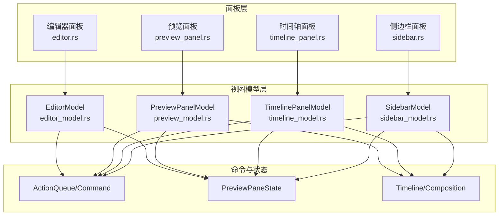
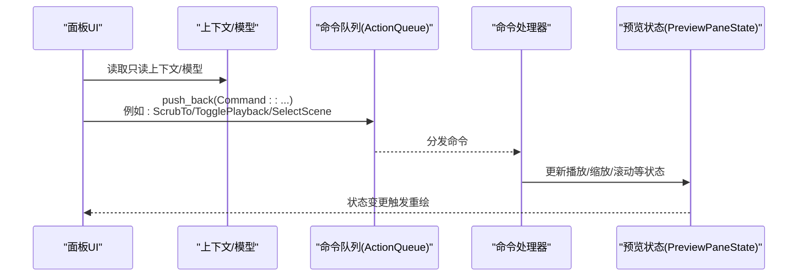
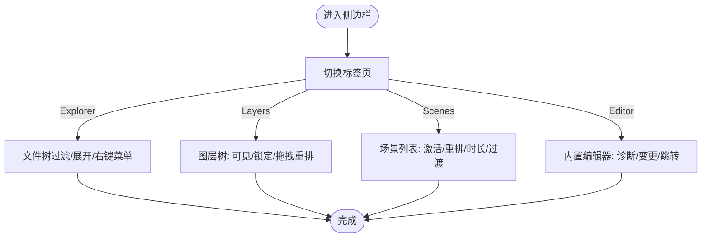
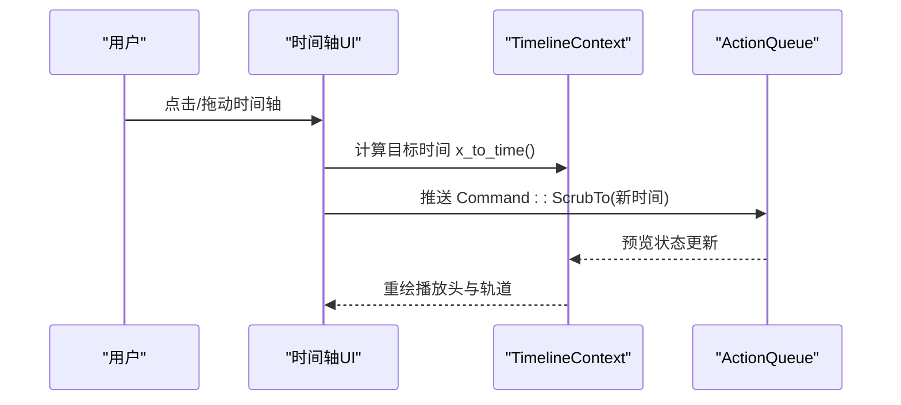
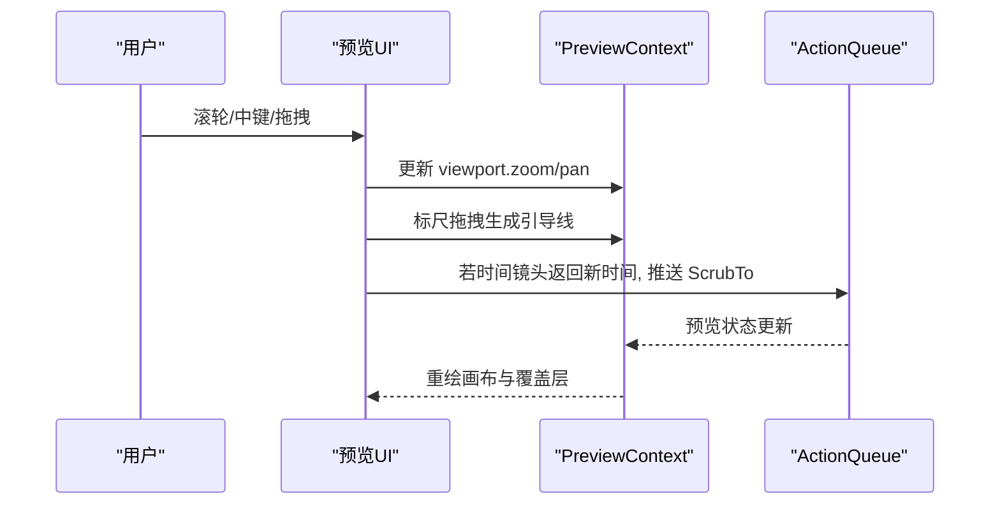
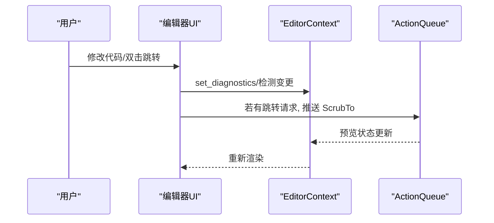
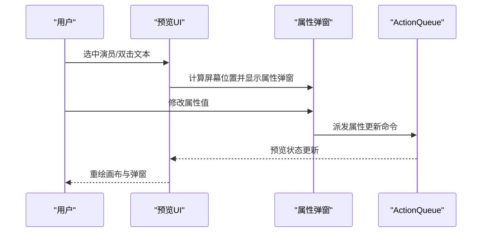
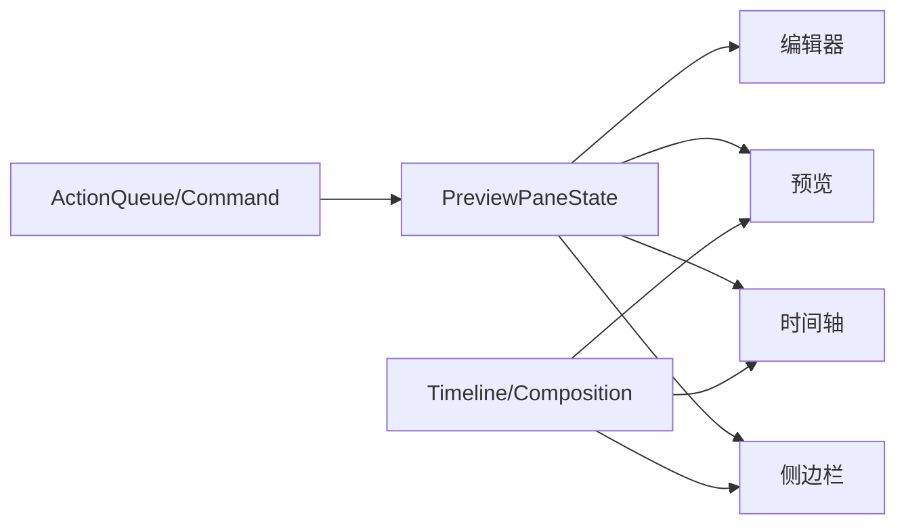

# 面板系统 API

<cite>
**本文引用的文件**
- [sidebar.rs](file://crates/animatix-gui/src/app/panels/sidebar.rs)
- [sidebar_model.rs](file://crates/animatix-gui/src/app/panels/sidebar_model.rs)
- [timeline_panel.rs](file://crates/animatix-gui/src/app/panels/timeline_panel.rs)
- [timeline_model.rs](file://crates/animatix-gui/src/app/panels/timeline_model.rs)
- [preview_panel.rs](file://crates/animatix-gui/src/app/panels/preview_panel.rs)
- [preview_model.rs](file://crates/animatix-gui/src/app/panels/preview_model.rs)
- [editor.rs](file://crates/animatix-gui/src/app/panels/editor.rs)
- [editor_model.rs](file://crates/animatix-gui/src/app/panels/editor_model.rs)
</cite>

## 目录
1. [简介](#简介)
2. [项目结构](#项目结构)
3. [核心组件](#核心组件)
4. [架构总览](#架构总览)
5. [详细组件分析](#详细组件分析)
6. [依赖关系分析](#依赖关系分析)
7. [性能考量](#性能考量)
8. [故障排查指南](#故障排查指南)
9. [结论](#结论)
10. [附录](#附录)

## 简介
本文件系统性梳理 Animatix 面板系统的 API 设计与实现，覆盖以下面板：
- 侧边栏面板：文件树、图层树、场景列表、组件库、资源库与内置编辑器入口
- 时间轴面板：轨道管理、关键帧可视化与编辑、播放控制与缩放
- 预览面板：画布、标尺、缩放/平移、吸附与引导线、时间镜头与选择反馈
- 编辑器面板：源码编辑、诊断高亮、时间轴跳转联动
- 检查器面板：属性展示与编辑（由“预览面板属性弹窗”与“检查器面板子模块”共同构成）

文档在每个面板下提供 API 职责、数据流、交互流程与集成示例，并给出可扩展的自定义指南。

## 项目结构
各面板位于 crates/animatix-gui/src/app/panels 下，采用“面板渲染函数 + 视图模型”的分层设计：
- 渲染层：以 panel_ui 函数为核心，负责 UI 布局、事件处理与绘制
- 视图模型层：以 Model 结构体为核心，封装只读上下文，便于迁移与测试
- 上下文层：以 Context 结构体为核心，封装可变状态与命令队列，驱动交互

图表来源
- [sidebar.rs:102-194](file://crates/animatix-gui/src/app/panels/sidebar.rs#L102-L194)
- [timeline_panel.rs:103-105](file://crates/animatix-gui/src/app/panels/timeline_panel.rs#L103-L105)
- [preview_panel.rs:38-469](file://crates/animatix-gui/src/app/panels/preview_panel.rs#L38-L469)
- [editor.rs:16-30](file://crates/animatix-gui/src/app/panels/editor.rs#L16-L30)

章节来源
- [sidebar.rs:102-194](file://crates/animatix-gui/src/app/panels/sidebar.rs#L102-L194)
- [timeline_panel.rs:103-105](file://crates/animatix-gui/src/app/panels/timeline_panel.rs#L103-L105)
- [preview_panel.rs:38-469](file://crates/animatix-gui/src/app/panels/preview_panel.rs#L38-L469)
- [editor.rs:16-30](file://crates/animatix-gui/src/app/panels/editor.rs#L16-L30)

## 核心组件
- 侧边栏上下文与视图模型
  - SidebarContext：包含当前场景、时间轴、文件树、预览状态、选中/折叠集合、命令队列等
  - SidebarModel：SidebarContext 的不可变视图模型版本
- 时间轴上下文与视图模型
  - TimelineContext：包含预览状态、时间轴、组合信息、折叠/展开集合、快照帧率等
  - TimelinePanelModel：TimelineContext 的不可变视图模型版本
- 预览上下文与视图模型
  - PreviewContext：包含场景尺寸、预览状态、命中区域、工具模式、旋转吸附等
  - PreviewPanelModel：PreviewContext 的不可变视图模型版本
- 编辑器上下文与视图模型
  - EditorContext：包含编辑器缓冲、诊断、脏文本、播放状态与命令队列
  - EditorModel：EditorContext 的不可变视图模型版本

章节来源
- [sidebar_model.rs:14-33](file://crates/animatix-gui/src/app/panels/sidebar_model.rs#L14-L33)
- [timeline_model.rs:7-19](file://crates/animatix-gui/src/app/panels/timeline_model.rs#L7-L19)
- [preview_model.rs:13-26](file://crates/animatix-gui/src/app/panels/preview_model.rs#L13-L26)
- [editor_model.rs:9-17](file://crates/animatix-gui/src/app/panels/editor_model.rs#L9-L17)

## 架构总览
各面板通过统一的命令通道与预览状态进行解耦协作：
- 面板渲染函数接收 Context 或 Model，构建 UI 并派发 Command
- Command 被 ActionQueue 收集，交由命令处理器执行副作用（如跳转时间轴、切换场景）
- 预览状态（播放、缩放、滚动偏移）在多个面板间共享，确保一致的用户感知

图表来源
- [sidebar.rs:210-223](file://crates/animatix-gui/src/app/panels/sidebar.rs#L210-L223)
- [timeline_panel.rs:280-422](file://crates/animatix-gui/src/app/panels/timeline_panel.rs#L280-L422)
- [preview_panel.rs:309-313](file://crates/animatix-gui/src/app/panels/preview_panel.rs#L309-L313)
- [editor.rs:16-30](file://crates/animatix-gui/src/app/panels/editor.rs#L16-L30)

## 详细组件分析

### 侧边栏面板 API
职责与能力
- 切换标签页：支持“资源库/文件树/图层/场景/组件/编辑器”
- 文件树浏览：过滤、展开/折叠、右键菜单、打开文件
- 图层树浏览：可见性/锁定切换、拖拽重排、多选对齐与分布
- 场景列表：激活场景、拖拽重排、时长与过渡提示
- 组件库与资源库：按需渲染与交互
- 内置编辑器：与诊断联动、时间轴跳转

关键 API
- 标签栏渲染与切换
  - render_sidebar_tab_bar：基于 pill_tab_bar 实现
  - 侧边栏主渲染：sidebar_ui，根据当前标签分派到对应内容区
- 文件树
  - explorer_content_ui：支持过滤、预计算可见性掩码、目录展开/折叠、右键菜单
- 图层树
  - layers_content_ui：根节点遍历、渲染 actor 行、可见/锁定按钮、拖拽重排
  - render_actor_tree：递归渲染树、绘制拖拽指示、处理 drop 区域
- 场景列表
  - scenes_content_ui：场景名、时长区间、过渡提示、右键菜单、拖拽重排
- 内置编辑器
  - editor_content_ui：设置诊断、监听变更、时间轴跳转与播放控制

图表来源
- [sidebar.rs:102-194](file://crates/animatix-gui/src/app/panels/sidebar.rs#L102-L194)
- [sidebar.rs:225-384](file://crates/animatix-gui/src/app/panels/sidebar.rs#L225-L384)
- [sidebar.rs:542-629](file://crates/animatix-gui/src/app/panels/sidebar.rs#L542-L629)
- [sidebar.rs:386-540](file://crates/animatix-gui/src/app/panels/sidebar.rs#L386-L540)
- [sidebar.rs:210-223](file://crates/animatix-gui/src/app/panels/sidebar.rs#L210-L223)

章节来源
- [sidebar.rs:102-194](file://crates/animatix-gui/src/app/panels/sidebar.rs#L102-L194)
- [sidebar.rs:225-384](file://crates/animatix-gui/src/app/panels/sidebar.rs#L225-L384)
- [sidebar.rs:542-629](file://crates/animatix-gui/src/app/panels/sidebar.rs#L542-L629)
- [sidebar.rs:386-540](file://crates/animatix-gui/src/app/panels/sidebar.rs#L386-L540)
- [sidebar.rs:210-223](file://crates/animatix-gui/src/app/panels/sidebar.rs#L210-L223)

集成示例（侧边栏）
- 在应用启动或窗口布局初始化时，构造 SidebarContext/SidebarModel，传入文件树、时间轴、预览状态与命令队列
- 在渲染循环中调用 sidebar_ui，根据返回的新标签更新内部状态
- 对于“图层树”中的可见/锁定操作，派发命令以修改时间轴轨道属性
- 对于“场景列表”，在拖拽释放后派发 ReorderScenes 命令

自定义指南（侧边栏）
- 新增标签页：在 SidebarTab 枚举与 render_sidebar_tab_bar 中注册图标与名称；在 sidebar_ui 分支中添加渲染函数
- 扩展文件树行为：在 explorer_content_ui 中增加更多右键菜单项，派发自定义命令
- 扩展图层树行为：在 render_actor_tree 中增加新的拖拽/放置逻辑，派发 ReparentActor 等命令

---

### 时间轴面板 API
职责与能力
- 播放控制：开始/结束、上一/下一关键帧、单帧步进、速度切换、循环/往返播放
- 缩放与滚动：滚轮缩放（光标稳定）、水平平移、最大可视范围限制
- 关键帧可视化：按属性分组、密度条、闪烁效果、多选
- 场景轨道：组合场景块、时长标注、密度条、边缘连接线
- 播放头与时间码：实时显示当前时间与总时长，支持点击/拖动跳转

关键 API
- 播放控制条：render_transport_strip，包含按钮、速度下拉、循环/往返开关、缩放控件与时间码
- 交互处理：bar_interaction，统一处理点击/拖动跳转
- 缩放/滚动：在 ScrollArea 闭包内读取 smooth_scroll_delta 与 zoom_delta，维护 timeline_zoom 与 timeline_scroll_offset
- 场景块渲染：render_scene_blocks，绘制场景色块、密度条与标注
- 属性分组与颜色：PROPERTY_GROUPS、property_group_for_prop、property_group_color
- 关键帧收集：collect_actor_keyframes、collect_per_property_keyframes

图表来源
- [timeline_panel.rs:260-276](file://crates/animatix-gui/src/app/panels/timeline_panel.rs#L260-L276)
- [timeline_panel.rs:280-422](file://crates/animatix-gui/src/app/panels/timeline_panel.rs#L280-L422)
- [timeline_panel.rs:584-663](file://crates/animatix-gui/src/app/panels/timeline_panel.rs#L584-L663)
- [timeline_panel.rs:495-569](file://crates/animatix-gui/src/app/panels/timeline_panel.rs#L495-L569)

章节来源
- [timeline_panel.rs:260-276](file://crates/animatix-gui/src/app/panels/timeline_panel.rs#L260-L276)
- [timeline_panel.rs:280-422](file://crates/animatix-gui/src/app/panels/timeline_panel.rs#L280-L422)
- [timeline_panel.rs:584-663](file://crates/animatix-gui/src/app/panels/timeline_panel.rs#L584-L663)
- [timeline_panel.rs:495-569](file://crates/animatix-gui/src/app/panels/timeline_panel.rs#L495-L569)

集成示例（时间轴）
- 在播放控制条中，点击“下一关键帧”按钮时派发 Command::NextKeyframe
- 在缩放/平移时，根据 smooth_scroll_delta 与 zoom_delta 更新 timeline_zoom 与 timeline_scroll_offset
- 在场景轨道中，拖拽场景块时，使用 render_scene_blocks 的坐标映射计算新起始时间并派发重排命令

自定义指南（时间轴）
- 新增播放控制：在 render_transport_strip 中添加按钮与状态切换逻辑，派发相应命令
- 新增属性分组：在 PROPERTY_GROUPS 中新增分组与属性列表，配合颜色映射
- 新增轨道类型：扩展 TimelineContext 以支持新的轨道元数据，并在渲染中绘制

---

### 预览面板 API
职责与能力
- 画布与标尺：绘制水平/垂直标尺、刻度与标签
- 缩放/平移：滚轮缩放（光标稳定）、中键拖拽平移、边界约束
- 引导线：从标尺拖拽生成水平/垂直引导线
- 选择与悬停：命中区域、悬停高亮、右键菜单
- 时间镜头：在预览区域附近显示时间镜头，支持拖动跳转
- 覆盖层：网格、场景边界、演员标签、运动轨迹、吸附线
- 文件拖放：支持图片/SVG 拖入，自动创建对应 Actor

关键 API
- 坐标转换：preview_screen_to_scene、preview_scene_to_screen
- 预览主函数：preview_panel_ui，分配画布与标尺矩形，绘制标尺与覆盖层
- 缩放/平移：读取 smooth_scroll_delta 与中间键状态，更新 viewport.preview_zoom 与 preview_pan
- 引导线：标尺拖拽阶段绘制临时线段，释放时写入 guides
- 时间镜头：time_lens.update_and_show 返回新时间则派发 ScrubTo
- 覆盖层：网格、场景边界、演员标签、吸附线、运动轨迹等

图表来源
- [preview_panel.rs:248-293](file://crates/animatix-gui/src/app/panels/preview_panel.rs#L248-L293)
- [preview_panel.rs:177-229](file://crates/animatix-gui/src/app/panels/preview_panel.rs#L177-L229)
- [preview_panel.rs:309-313](file://crates/animatix-gui/src/app/panels/preview_panel.rs#L309-L313)
- [preview_panel.rs:345-379](file://crates/animatix-gui/src/app/panels/preview_panel.rs#L345-L379)

章节来源
- [preview_panel.rs:248-293](file://crates/animatix-gui/src/app/panels/preview_panel.rs#L248-L293)
- [preview_panel.rs:177-229](file://crates/animatix-gui/src/app/panels/preview_panel.rs#L177-L229)
- [preview_panel.rs:309-313](file://crates/animatix-gui/src/app/panels/preview_panel.rs#L309-L313)
- [preview_panel.rs:345-379](file://crates/animatix-gui/src/app/panels/preview_panel.rs#L345-L379)

集成示例（预览）
- 在缩放时，根据滚轮增量与光标位置计算新的 zoom 与 pan，并调用 clamp_pan 约束
- 在标尺拖拽时，绘制临时引导线并在释放后写入 guides
- 在时间镜头拖动时，若返回新时间则派发 ScrubTo 并触发播放

自定义指南（预览）
- 新增覆盖层：在预览主循环中添加绘制逻辑（如自定义网格、调试框）
- 新增工具模式：扩展 ToolMode 并在 PreviewContext 中处理不同模式下的交互
- 新增吸附策略：在 snap 流程中加入新的对齐规则

---

### 编辑器面板 API
职责与能力
- 源码编辑：语法高亮、诊断标记、自动补全（由外部 EditorBuffer 提供）
- 诊断联动：将诊断数组注入编辑器，随编辑变化更新
- 时间轴联动：当编辑器请求跳转到某时间点时，派发 ScrubTo 并在需要时切换播放状态

关键 API
- 编辑器上下文：EditorContext，包含 editor、diagnostics、source_dirty、is_playing 与命令队列
- 编辑器渲染：editor_ui，设置诊断、监听变更、处理时间轴跳转

图表来源
- [editor.rs:16-30](file://crates/animatix-gui/src/app/panels/editor.rs#L16-L30)

章节来源
- [editor.rs:16-30](file://crates/animatix-gui/src/app/panels/editor.rs#L16-L30)

集成示例（编辑器）
- 在编辑器初始化时，将当前诊断数组注入 EditorBuffer
- 当编辑器检测到“跳转到时间”请求时，派发 ScrubTo，并在非播放状态下自动开始播放

自定义指南（编辑器）
- 扩展诊断类型：在 EditorContext 中接入更多语言服务诊断
- 扩展快捷键：在编辑器内部注册快捷键，派发自定义命令

---

### 检查器面板 API
职责与能力
- 属性显示：在预览面板中为选中的演员弹出属性卡片，显示当前值与单位
- 属性编辑：支持数值/字符串/枚举等编辑，编辑时即时更新时间轴关键帧
- 数据绑定：与时间轴属性轨道绑定，支持插值与动画
- 工具栏集成：与全局工具栏联动，切换工具模式影响检查器行为

关键实现位置
- 预览面板属性弹窗：在预览主循环中调用 property_popup::show_property_popup 显示与编辑属性
- 与时间轴联动：编辑属性时通过命令队列更新关键帧与轨道

图表来源
- [preview_panel.rs:448-466](file://crates/animatix-gui/src/app/panels/preview_panel.rs#L448-L466)

章节来源
- [preview_panel.rs:448-466](file://crates/animatix-gui/src/app/panels/preview_panel.rs#L448-L466)

集成示例（检查器）
- 在选中单一演员时，根据其位置计算弹窗屏幕坐标并显示属性卡片
- 对数值属性进行编辑时，派发命令更新对应属性轨道的关键帧

自定义指南（检查器）
- 新增属性类型：在属性弹窗中支持新的属性编辑器（如颜色选择器、路径选择器）
- 新增属性组：在 TimelineContext 的属性分组中加入新属性，以便在时间轴中显示

## 依赖关系分析
- 面板之间通过命令队列解耦：任何面板的交互最终通过 Command 影响预览状态
- 共享状态：PreviewPaneState 在多个面板中被读取与更新，确保 UI 一致性
- 时间轴与组合：时间轴面板与组合面板共享 Timeline/Composition，用于场景块与轨道渲染

图表来源
- [sidebar.rs:102-194](file://crates/animatix-gui/src/app/panels/sidebar.rs#L102-L194)
- [timeline_panel.rs:103-105](file://crates/animatix-gui/src/app/panels/timeline_panel.rs#L103-L105)
- [preview_panel.rs:38-469](file://crates/animatix-gui/src/app/panels/preview_panel.rs#L38-L469)
- [editor.rs:16-30](file://crates/animatix-gui/src/app/panels/editor.rs#L16-L30)

章节来源
- [sidebar.rs:102-194](file://crates/animatix-gui/src/app/panels/sidebar.rs#L102-L194)
- [timeline_panel.rs:103-105](file://crates/animatix-gui/src/app/panels/timeline_panel.rs#L103-L105)
- [preview_panel.rs:38-469](file://crates/animatix-gui/src/app/panels/preview_panel.rs#L38-L469)
- [editor.rs:16-30](file://crates/animatix-gui/src/app/panels/editor.rs#L16-L30)

## 性能考量
- 时间轴渲染
  - 使用预计算可见性掩码与分组缓存，减少重复计算
  - 关键帧密度条仅在场景块内绘制，避免全量扫描
- 预览渲染
  - 坐标转换与吸附线在每帧清空后重建，避免累积开销
  - 滚轮缩放采用光标稳定算法，避免频繁重绘
- 编辑器
  - 仅在编辑器文本变化或诊断更新时派发命令，降低刷新频率

## 故障排查指南
- 时间轴跳转无效
  - 检查命令是否正确派发至 ActionQueue，确认命令处理器已更新预览状态
  - 确认 smooth_scroll_delta 与 zoom_delta 是否被正确消费（ScrollArea 会在闭包后清零）
- 缩放/平移异常
  - 确认鼠标指针在画布区域内，且 zoom 未越界
  - 检查 clamp_pan 是否正确约束 pan 值
- 图层树拖拽不生效
  - 确认被拖拽节点非匿名节点，且 drop 区域判断逻辑正确
  - 检查命令派发顺序：先插入 temp 数据，再在释放时处理 drop
- 编辑器联动失效
  - 确认 EditorContext 的 diagnostics 已更新，且变更检测逻辑正常
  - 检查 pending_scrub_to_time 是否被正确消费

章节来源
- [timeline_panel.rs:584-663](file://crates/animatix-gui/src/app/panels/timeline_panel.rs#L584-L663)
- [preview_panel.rs:248-293](file://crates/animatix-gui/src/app/panels/preview_panel.rs#L248-L293)
- [sidebar.rs:718-776](file://crates/animatix-gui/src/app/panels/sidebar.rs#L718-L776)
- [editor.rs:16-30](file://crates/animatix-gui/src/app/panels/editor.rs#L16-L30)

## 结论
Animatix 面板系统采用清晰的上下文/模型分离与命令驱动架构，实现了面板间的低耦合与高内聚。通过统一的预览状态与命令通道，各面板能够协同工作，提供一致的创作体验。建议在扩展新功能时遵循现有模式：先定义命令与状态更新，再在面板中派发与渲染，确保整体一致性与可维护性。

## 附录
- 集成清单
  - 侧边栏：文件树、图层树、场景列表、组件库、资源库、内置编辑器
  - 时间轴：播放控制、缩放/滚动、关键帧可视化、场景轨道
  - 预览：画布/标尺、缩放/平移、引导线、覆盖层、文件拖放
  - 编辑器：源码编辑、诊断、时间轴联动
  - 检查器：属性显示与编辑、数据绑定、工具栏集成