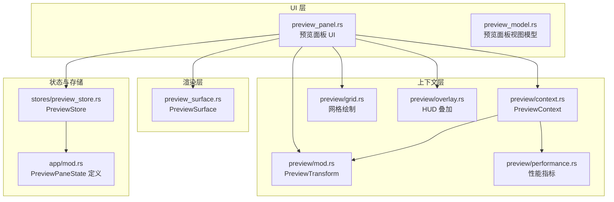
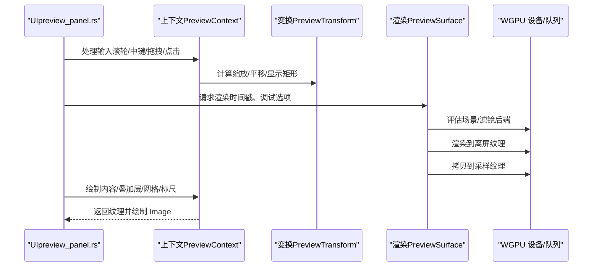
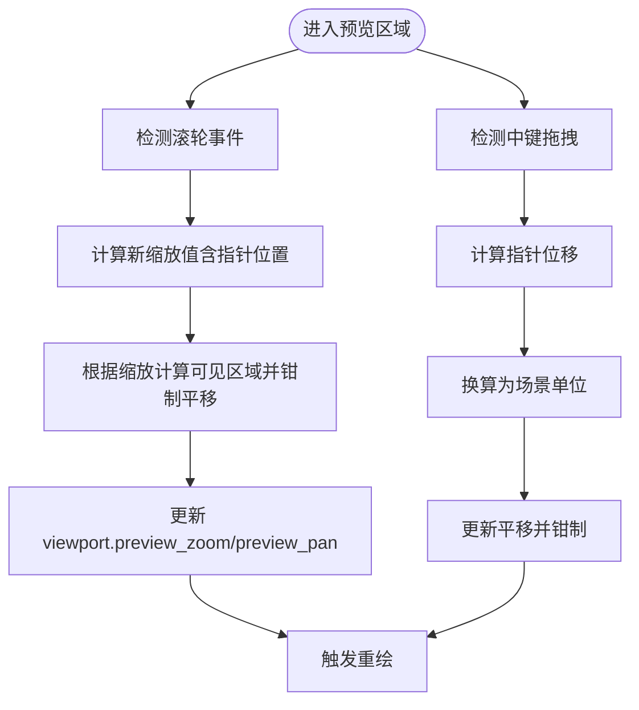
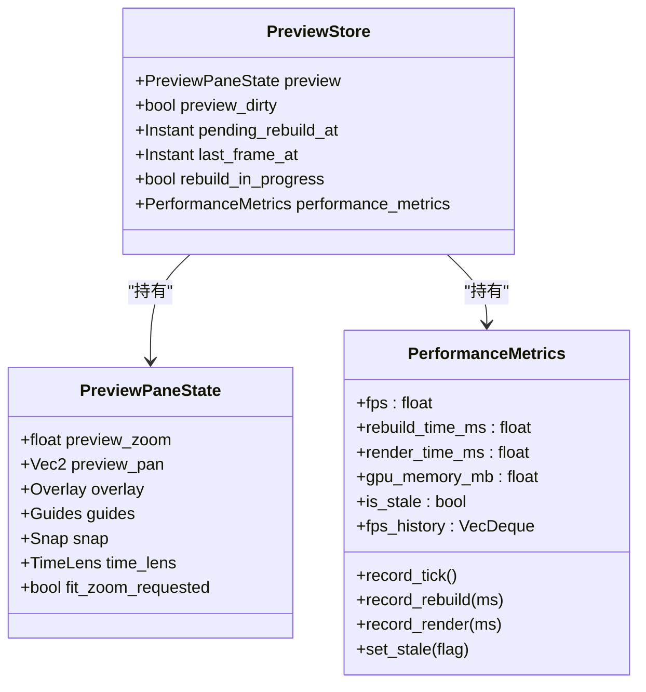
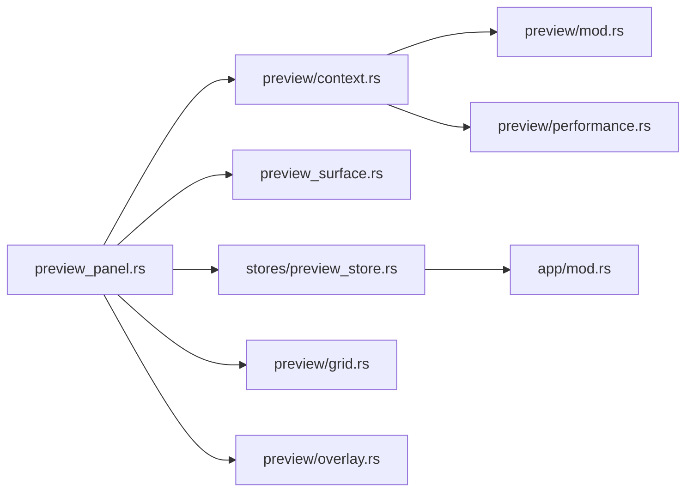

# 预览面板 API

<cite>
**本文引用的文件**
- [crates/animatix-gui/src/app/panels/preview_panel.rs](file://crates/animatix-gui/src/app/panels/preview_panel.rs)
- [crates/animatix-gui/src/app/preview/context.rs](file://crates/animatix-gui/src/app/preview/context.rs)
- [crates/animatix-gui/src/app/preview/mod.rs](file://crates/animatix-gui/src/app/preview/mod.rs)
- [crates/animatix-gui/src/app/preview/grid.rs](file://crates/animatix-gui/src/app/preview/grid.rs)
- [crates/animatix-gui/src/app/preview/performance.rs](file://crates/animatix-gui/src/app/preview/performance.rs)
- [crates/animatix-gui/src/app/preview/overlay.rs](file://crates/animatix-gui/src/app/preview/overlay.rs)
- [crates/animatix-gui/src/app/panels/preview_model.rs](file://crates/animatix-gui/src/app/panels/preview_model.rs)
- [crates/animatix-gui/src/app/stores/preview_store.rs](file://crates/animatix-gui/src/app/stores/preview_store.rs)
- [crates/animatix-gui/src/preview_surface.rs](file://crates/animatix-gui/src/preview_surface.rs)
- [crates/animatix-gui/src/app/mod.rs](file://crates/animatix-gui/src/app/mod.rs)
- [crates/animatix-gui/src/app/handlers/ui.rs](file://crates/animatix-gui/src/app/handlers/ui.rs)
</cite>

## 目录
1. [简介](#简介)
2. [项目结构](#项目结构)
3. [核心组件](#核心组件)
4. [架构总览](#架构总览)
5. [详细组件分析](#详细组件分析)
6. [依赖关系分析](#依赖关系分析)
7. [性能考量](#性能考量)
8. [故障排查指南](#故障排查指南)
9. [结论](#结论)
10. [附录：配置与集成示例](#附录配置与集成示例)

## 简介
本文件系统性梳理 Animatix 预览面板的 API 与实现，覆盖以下主题：
- 预览区域管理 API：画布尺寸调整、视口控制（缩放/平移）与坐标转换接口
- 缩放控制 API：缩放级别设置、平移操作、自动适配（全屏/选区适配）
- 预览模型 API：渲染状态管理、性能监控与内存优化
- 预览交互 API：鼠标事件处理、选择框、拖拽操作与旋转/缩放手柄
- 集成与体验优化：配置建议、常见问题与最佳实践

## 项目结构
预览面板由“UI 层 + 上下文层 + 渲染层”协同构成：
- UI 层：负责绘制画布、标尺、网格、叠加层与交互反馈
- 上下文层：封装共享状态、变换计算、坐标转换与交互逻辑
- 渲染层：基于 WGPU 的离屏渲染与纹理采样，供 egui 显示

图表来源
- [crates/animatix-gui/src/app/panels/preview_panel.rs:1-470](file://crates/animatix-gui/src/app/panels/preview_panel.rs#L1-L470)
- [crates/animatix-gui/src/app/preview/context.rs:1-800](file://crates/animatix-gui/src/app/preview/context.rs#L1-L800)
- [crates/animatix-gui/src/app/preview/mod.rs:46-74](file://crates/animatix-gui/src/app/preview/mod.rs#L46-L74)
- [crates/animatix-gui/src/app/preview/grid.rs:1-24](file://crates/animatix-gui/src/app/preview/grid.rs#L1-L24)
- [crates/animatix-gui/src/app/preview/performance.rs:1-78](file://crates/animatix-gui/src/app/preview/performance.rs#L1-L78)
- [crates/animatix-gui/src/app/preview/overlay.rs:71-110](file://crates/animatix-gui/src/app/preview/overlay.rs#L71-L110)
- [crates/animatix-gui/src/preview_surface.rs:1-396](file://crates/animatix-gui/src/preview_surface.rs#L1-L396)
- [crates/animatix-gui/src/app/stores/preview_store.rs:1-85](file://crates/animatix-gui/src/app/stores/preview_store.rs#L1-L85)
- [crates/animatix-gui/src/app/mod.rs:262-320](file://crates/animatix-gui/src/app/mod.rs#L262-L320)

章节来源
- [crates/animatix-gui/src/app/panels/preview_panel.rs:1-470](file://crates/animatix-gui/src/app/panels/preview_panel.rs#L1-L470)
- [crates/animatix-gui/src/app/preview/context.rs:1-800](file://crates/animatix-gui/src/app/preview/context.rs#L1-L800)
- [crates/animatix-gui/src/preview_surface.rs:1-396](file://crates/animatix-gui/src/preview_surface.rs#L1-L396)

## 核心组件
- 预览面板 UI（preview_panel.rs）
  - 负责分配画布区域、绘制标尺、网格、叠加层、时间镜头、拖拽与选择交互，并调用上下文层进行渲染与绘制
- 预览上下文（preview/context.rs）
  - 封装共享状态（缩放、平移、选区、拖拽状态等），提供坐标转换、变换计算与交互处理
- 预览变换（preview/mod.rs）
  - 提供场景坐标与屏幕坐标的双向映射、显示矩形计算与缩放因子
- 预览表面（preview_surface.rs）
  - 管理 WGPU 渲染目标、滤镜后端、过渡合成器与采样纹理，驱动渲染管线
- 预览状态与存储（stores/preview_store.rs、app/mod.rs）
  - 管理预览面板状态、播放控制、重建调度与性能指标；PreviewPaneState 描述视口、叠加层与状态

章节来源
- [crates/animatix-gui/src/app/panels/preview_panel.rs:38-470](file://crates/animatix-gui/src/app/panels/preview_panel.rs#L38-L470)
- [crates/animatix-gui/src/app/preview/context.rs:18-41](file://crates/animatix-gui/src/app/preview/context.rs#L18-L41)
- [crates/animatix-gui/src/app/preview/mod.rs:46-74](file://crates/animatix-gui/src/app/preview/mod.rs#L46-L74)
- [crates/animatix-gui/src/preview_surface.rs:9-27](file://crates/animatix-gui/src/preview_surface.rs#L9-L27)
- [crates/animatix-gui/src/app/stores/preview_store.rs:7-18](file://crates/animatix-gui/src/app/stores/preview_store.rs#L7-L18)
- [crates/animatix-gui/src/app/mod.rs:262-320](file://crates/animatix-gui/src/app/mod.rs#L262-L320)

## 架构总览
预览面板以“命令式 UI + 命令队列”的方式组织交互与状态更新，渲染通过 PreviewSurface 在后台完成，最终以纹理形式在 egui 中显示。

图表来源
- [crates/animatix-gui/src/app/panels/preview_panel.rs:248-293](file://crates/animatix-gui/src/app/panels/preview_panel.rs#L248-L293)
- [crates/animatix-gui/src/app/preview/context.rs:445-479](file://crates/animatix-gui/src/app/preview/context.rs#L445-L479)
- [crates/animatix-gui/src/preview_surface.rs:167-221](file://crates/animatix-gui/src/preview_surface.rs#L167-L221)

## 详细组件分析

### 预览区域管理 API
- 画布尺寸调整
  - UI 分配可用空间，减去标尺尺寸后得到预览矩形；支持“自适应”与“全屏适配”
  - 关键路径：[preview_panel_ui:45-59](file://crates/animatix-gui/src/app/panels/preview_panel.rs#L45-L59)
- 视口控制（缩放/平移）
  - 滚轮缩放：根据滚轮增量乘以系数，限制最小/最大缩放，可围绕指针位置缩放
  - 中键拖拽：按像素换算为场景单位进行平移，结合 clamp_pan 进行边界约束
  - 自动适配：全屏适配（fit-to-fit）、选区适配（fit-to-selection）
- 坐标转换接口
  - 场景坐标 ↔ 屏幕坐标互转，使用统一的 PreviewTransform
  - 接口路径：[preview_screen_to_scene:253-255](file://crates/animatix-gui/src/app/preview/context.rs#L253-L255)、[preview_scene_to_screen:257-259](file://crates/animatix-gui/src/app/preview/context.rs#L257-L259)

图表来源
- [crates/animatix-gui/src/app/panels/preview_panel.rs:248-293](file://crates/animatix-gui/src/app/panels/preview_panel.rs#L248-L293)
- [crates/animatix-gui/src/app/preview/context.rs:222-251](file://crates/animatix-gui/src/app/preview/context.rs#L222-L251)

章节来源
- [crates/animatix-gui/src/app/panels/preview_panel.rs:45-59](file://crates/animatix-gui/src/app/panels/preview_panel.rs#L45-L59)
- [crates/animatix-gui/src/app/panels/preview_panel.rs:248-293](file://crates/animatix-gui/src/app/panels/preview_panel.rs#L248-L293)
- [crates/animatix-gui/src/app/preview/context.rs:222-259](file://crates/animatix-gui/src/app/preview/context.rs#L222-L259)

### 缩放控制 API
- 缩放级别设置
  - 全屏适配：将场景完整放入预览区域（contain），居中显示
  - 选区适配：计算选区包围盒，使选区占约 80% 的视口
  - 关键路径：[handle_zoom_to_all:162-172](file://crates/animatix-gui/src/app/handlers/ui.rs#L162-L172)、[handle_zoom_to_selection:147-160](file://crates/animatix-gui/src/app/handlers/ui.rs#L147-L160)
- 平移操作
  - 中键拖拽：将像素位移换算为场景单位，更新 pan 并钳制
  - 关键路径：[preview_panel_ui 中的中键逻辑:277-293](file://crates/animatix-gui/src/app/panels/preview_panel.rs#L277-L293)
- 自动适配功能
  - fit_preview：计算适合的缩放与中心点
  - 关键路径：[fit_preview 使用处:48-58](file://crates/animatix-gui/src/app/panels/preview_panel.rs#L48-L58)

章节来源
- [crates/animatix-gui/src/app/handlers/ui.rs:147-172](file://crates/animatix-gui/src/app/handlers/ui.rs#L147-L172)
- [crates/animatix-gui/src/app/panels/preview_panel.rs:277-293](file://crates/animatix-gui/src/app/panels/preview_panel.rs#L277-L293)

### 预览模型 API
- 渲染状态管理
  - PreviewPaneState：包含缩放、平移、叠加层开关、时间镜头、引导线、快照等
  - PreviewStore：持有 PreviewPaneState，跟踪脏标记、重建计划、性能指标
  - 关键定义：[PreviewPaneState:262-320](file://crates/animatix-gui/src/app/mod.rs#L262-L320)、[PreviewStore:7-18](file://crates/animatix-gui/src/app/stores/preview_store.rs#L7-L18)
- 性能监控
  - PerformanceMetrics：滚动 FPS、重建耗时、渲染耗时、GPU 内存估算、过期标记与帧历史
  - 关键实现：[performance.rs:1-78](file://crates/animatix-gui/src/app/preview/performance.rs#L1-L78)
- 内存优化
  - PreviewSurface：延迟初始化渲染目标与滤镜后端；仅在尺寸变化或缺失时重建；拷贝到采样纹理供 egui 使用
  - 关键实现：[set_dimensions/render:75-221](file://crates/animatix-gui/src/preview_surface.rs#L75-L221)

图表来源
- [crates/animatix-gui/src/app/mod.rs:262-320](file://crates/animatix-gui/src/app/mod.rs#L262-L320)
- [crates/animatix-gui/src/app/stores/preview_store.rs:7-18](file://crates/animatix-gui/src/app/stores/preview_store.rs#L7-L18)
- [crates/animatix-gui/src/app/preview/performance.rs:6-36](file://crates/animatix-gui/src/app/preview/performance.rs#L6-L36)

章节来源
- [crates/animatix-gui/src/app/mod.rs:262-320](file://crates/animatix-gui/src/app/mod.rs#L262-L320)
- [crates/animatix-gui/src/app/stores/preview_store.rs:1-85](file://crates/animatix-gui/src/app/stores/preview_store.rs#L1-L85)
- [crates/animatix-gui/src/app/preview/performance.rs:1-78](file://crates/animatix-gui/src/app/preview/performance.rs#L1-L78)
- [crates/animatix-gui/src/preview_surface.rs:75-221](file://crates/animatix-gui/src/preview_surface.rs#L75-L221)

### 预览交互 API
- 鼠标事件处理
  - 左键点击：更新选区、右键弹出上下文菜单、双击进入内联文本编辑（针对文本类演员）
  - 右键：在非拖拽状态下打开上下文菜单
  - 关键路径：[handle_preview_selection:261-378](file://crates/animatix-gui/src/app/preview/context.rs#L261-L378)
- 选择框与多选
  - 支持框选（marquee）、多选联合包围盒与虚线拖拽反馈
  - 关键路径：[render_preview_selection_overlay:645-766](file://crates/animatix-gui/src/app/preview/context.rs#L645-L766)
- 拖拽操作
  - 移动/缩放/旋转/顶点编辑/重排序：根据 DragState 更新反馈与测量标注
  - 关键路径：[render_preview_selection_overlay（拖拽分支）:690-722](file://crates/animatix-gui/src/app/preview/context.rs#L690-L722)
- 标尺与引导线
  - 拖动标尺添加水平/垂直引导线；渲染时绘制引导线与吸附提示
  - 关键路径：[preview_panel_ui 标尺拖拽与引导线绘制:177-246](file://crates/animatix-gui/src/app/panels/preview_panel.rs#L177-L246)

章节来源
- [crates/animatix-gui/src/app/preview/context.rs:261-378](file://crates/animatix-gui/src/app/preview/context.rs#L261-L378)
- [crates/animatix-gui/src/app/preview/context.rs:645-766](file://crates/animatix-gui/src/app/preview/context.rs#L645-L766)
- [crates/animatix-gui/src/app/panels/preview_panel.rs:177-246](file://crates/animatix-gui/src/app/panels/preview_panel.rs#L177-L246)

### 预览渲染与叠加层
- 内容渲染
  - 当存在纹理时，按当前缩放与平移裁剪 UV 并绘制；否则显示“预览初始化中…”
  - 关键路径：[render_preview_content:445-479](file://crates/animatix-gui/src/app/preview/context.rs#L445-L479)
- 叠加层
  - 场景边界、演员标签、网格、布局调试、运动轨迹、吸附引导、性能 HUD、时间镜头、内联文本编辑器
  - 关键路径：[render_preview_overlays:481-528](file://crates/animatix-gui/src/app/preview/context.rs#L481-L528)、[grid.rs:1-24](file://crates/animatix-gui/src/app/preview/grid.rs#L1-L24)、[overlay.rs:71-110](file://crates/animatix-gui/src/app/preview/overlay.rs#L71-L110)

章节来源
- [crates/animatix-gui/src/app/preview/context.rs:445-479](file://crates/animatix-gui/src/app/preview/context.rs#L445-L479)
- [crates/animatix-gui/src/app/preview/context.rs:481-528](file://crates/animatix-gui/src/app/preview/context.rs#L481-L528)
- [crates/animatix-gui/src/app/preview/grid.rs:1-24](file://crates/animatix-gui/src/app/preview/grid.rs#L1-L24)
- [crates/animatix-gui/src/app/preview/overlay.rs:71-110](file://crates/animatix-gui/src/app/preview/overlay.rs#L71-L110)

## 依赖关系分析
- UI 依赖上下文与变换：UI 通过上下文访问 viewport、变换与绘制函数
- 上下文依赖变换与渲染：上下文使用 PreviewTransform 进行坐标转换，并调用渲染层提供的纹理
- 渲染层依赖 WGPU：负责 GPU 资源生命周期与渲染管线
- 存储层依赖状态：PreviewStore 持有 PreviewPaneState 并维护性能指标

图表来源
- [crates/animatix-gui/src/app/panels/preview_panel.rs:38-470](file://crates/animatix-gui/src/app/panels/preview_panel.rs#L38-L470)
- [crates/animatix-gui/src/app/preview/context.rs:1-800](file://crates/animatix-gui/src/app/preview/context.rs#L1-L800)
- [crates/animatix-gui/src/preview_surface.rs:1-396](file://crates/animatix-gui/src/preview_surface.rs#L1-L396)
- [crates/animatix-gui/src/app/stores/preview_store.rs:1-85](file://crates/animatix-gui/src/app/stores/preview_store.rs#L1-L85)
- [crates/animatix-gui/src/app/mod.rs:262-320](file://crates/animatix-gui/src/app/mod.rs#L262-L320)
- [crates/animatix-gui/src/app/preview/performance.rs:1-78](file://crates/animatix-gui/src/app/preview/performance.rs#L1-L78)
- [crates/animatix-gui/src/app/preview/grid.rs:1-24](file://crates/animatix-gui/src/app/preview/grid.rs#L1-L24)
- [crates/animatix-gui/src/app/preview/overlay.rs:71-110](file://crates/animatix-gui/src/app/preview/overlay.rs#L71-L110)

章节来源
- [crates/animatix-gui/src/app/panels/preview_panel.rs:38-470](file://crates/animatix-gui/src/app/panels/preview_panel.rs#L38-L470)
- [crates/animatix-gui/src/app/preview/context.rs:1-800](file://crates/animatix-gui/src/app/preview/context.rs#L1-L800)
- [crates/animatix-gui/src/preview_surface.rs:1-396](file://crates/animatix-gui/src/preview_surface.rs#L1-L396)

## 性能考量
- 渲染路径
  - 仅在尺寸变化或滤镜后端缺失时重建渲染目标与后端，避免频繁分配
  - 采用零拷贝策略：先渲染到离屏纹理，再复制到 sRGB 采样纹理
- 性能指标
  - 滚动平均 FPS、重建/渲染耗时、GPU 内存估算、过期标记与帧历史
- 交互优化
  - 滚轮缩放围绕指针位置，提升定位效率
  - 中键拖拽按像素换算为场景单位，保证平滑度

章节来源
- [crates/animatix-gui/src/preview_surface.rs:75-221](file://crates/animatix-gui/src/preview_surface.rs#L75-L221)
- [crates/animatix-gui/src/app/preview/performance.rs:25-78](file://crates/animatix-gui/src/app/preview/performance.rs#L25-L78)
- [crates/animatix-gui/src/app/panels/preview_panel.rs:248-293](file://crates/animatix-gui/src/app/panels/preview_panel.rs#L248-L293)

## 故障排查指南
- 预览空白或“初始化中”
  - 检查是否已成功渲染并生成采样纹理；确认尺寸非零
  - 参考：[render_preview_content:445-479](file://crates/animatix-gui/src/app/preview/context.rs#L445-L479)、[set_dimensions:75-165](file://crates/animatix-gui/src/preview_surface.rs#L75-L165)
- 缩放异常或平移越界
  - 确认 clamp_pan 是否被正确调用；检查缩放与平移范围
  - 参考：[clamp_pan_value:227-251](file://crates/animatix-gui/src/app/preview/context.rs#L227-L251)
- 性能抖动
  - 查看 PerformanceMetrics 的 FPS、重建/渲染耗时；关注 is_stale 标记
  - 参考：[performance.rs:25-78](file://crates/animatix-gui/src/app/preview/performance.rs#L25-L78)
- 交互无响应
  - 检查 egui 输入状态与响应区域；确认未处于拖拽或上下文菜单状态
  - 参考：[handle_preview_selection:261-378](file://crates/animatix-gui/src/app/preview/context.rs#L261-L378)

章节来源
- [crates/animatix-gui/src/app/preview/context.rs:227-251](file://crates/animatix-gui/src/app/preview/context.rs#L227-L251)
- [crates/animatix-gui/src/app/preview/context.rs:445-479](file://crates/animatix-gui/src/app/preview/context.rs#L445-L479)
- [crates/animatix-gui/src/app/preview/performance.rs:25-78](file://crates/animatix-gui/src/app/preview/performance.rs#L25-L78)
- [crates/animatix-gui/src/preview_surface.rs:75-165](file://crates/animatix-gui/src/preview_surface.rs#L75-L165)

## 结论
预览面板通过清晰的分层设计实现了高性能、高交互性的可视化编辑体验。UI 层专注绘制与交互，上下文层提供一致的坐标与状态管理，渲染层以 GPU 加速保障流畅度。配合完善的性能指标与内存优化策略，可在复杂场景下保持稳定表现。

## 附录：配置与集成示例
- 配置项（来自 PreviewPaneState）
  - 缩放与平移：preview_zoom、preview_pan
  - 叠加层：show_grid、show_actor_labels、show_scene_bounds、show_hover_highlight、show_snap_guides、show_performance_hud、show_motion_paths、show_guides
  - 引导线与吸附：horizontal_guides、vertical_guides、snap_lines_h/snap_lines_v
  - 时间镜头：time_lens
  - 关键定义参考：[PreviewPaneState:262-320](file://crates/animatix-gui/src/app/mod.rs#L262-L320)
- 集成步骤（概要）
  - 初始化 PreviewSurface 并设置尺寸
  - 在每帧调用 PreviewSurface.render 或 render_composition 获取纹理
  - 将纹理注册为 egui TextureId，并在 UI 中绘制 Image
  - 通过 PreviewContext 处理输入、更新 viewport 并绘制叠加层
- 用户体验优化建议
  - 启用吸附与引导线以提升对齐效率
  - 合理设置网格大小与标尺刻度，平衡信息密度
  - 使用性能 HUD 监控帧率与重建耗时，必要时降低场景复杂度或启用缓存策略

章节来源
- [crates/animatix-gui/src/app/mod.rs:262-320](file://crates/animatix-gui/src/app/mod.rs#L262-L320)
- [crates/animatix-gui/src/preview_surface.rs:167-221](file://crates/animatix-gui/src/preview_surface.rs#L167-L221)
- [crates/animatix-gui/src/app/panels/preview_panel.rs:38-470](file://crates/animatix-gui/src/app/panels/preview_panel.rs#L38-L470)