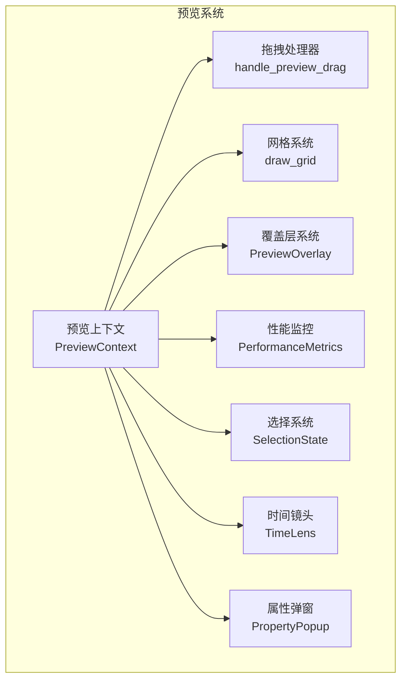
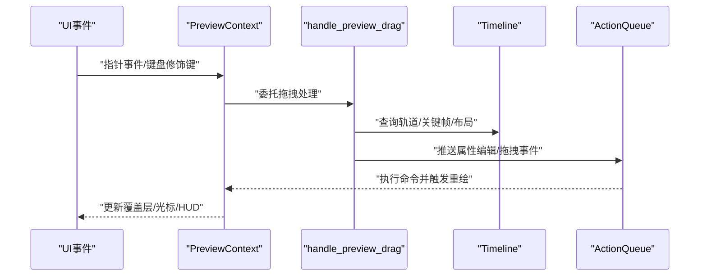
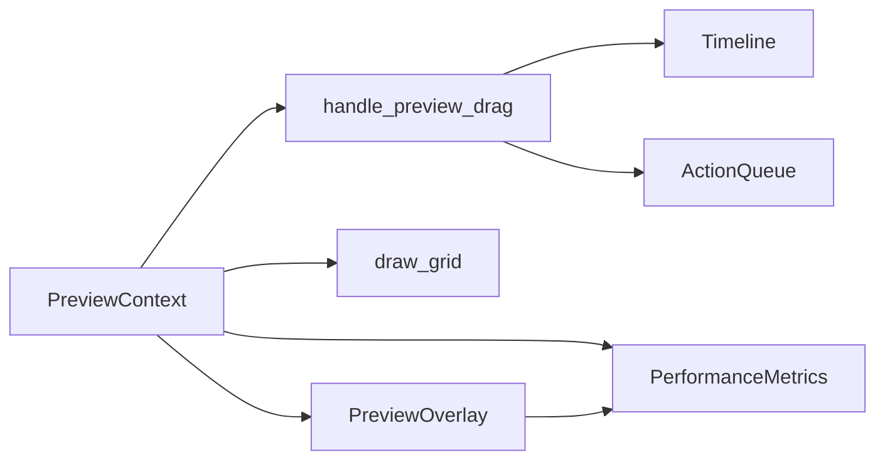

# 预览系统 API

<cite>
**本文档引用的文件**
- [crates/animatix-gui/src/app/preview/context.rs](file://crates/animatix-gui/src/app/preview/context.rs)
- [crates/animatix-gui/src/app/preview/drag_handler.rs](file://crates/animatix-gui/src/app/preview/drag_handler.rs)
- [crates/animatix-gui/src/app/preview/grid.rs](file://crates/animatix-gui/src/app/preview/grid.rs)
- [crates/animatix-gui/src/app/preview/overlay.rs](file://crates/animatix-gui/src/app/preview/overlay.rs)
- [crates/animatix-gui/src/app/preview/performance.rs](file://crates/animatix-gui/src/app/preview/performance.rs)
- [crates/animatix-gui/src/app/preview/selection.rs](file://crates/animatix-gui/src/app/preview/selection.rs)
- [crates/animatix-gui/src/app/preview/time_lens.rs](file://crates/animatix-gui/src/app/preview/time_lens.rs)
- [crates/animatix-gui/src/app/preview/property_popup.rs](file://crates/animatix-gui/src/app/preview/property_popup.rs)
</cite>

## 目录
1. [简介](#简介)
2. [项目结构](#项目结构)
3. [核心组件](#核心组件)
4. [架构总览](#架构总览)
5. [详细组件分析](#详细组件分析)
6. [依赖关系分析](#依赖关系分析)
7. [性能考量](#性能考量)
8. [故障排除指南](#故障排除指南)
9. [结论](#结论)

## 简介
本文件为 Animatix 预览系统的 API 文档，聚焦于预览上下文、拖拽处理器、网格系统、覆盖层、性能监控、选择系统与时间镜头等模块的接口规范与使用说明。文档旨在帮助开发者快速理解并正确集成预览面板的交互与渲染能力。

## 项目结构
预览系统位于 GUI 子工程中，核心文件组织如下：
- 预览上下文：提供场景维度、视口参数、拖拽状态、选择状态、性能指标等共享数据与辅助方法
- 拖拽处理器：统一处理移动、缩放、旋转、顶点编辑、重排、枢轴调整、运动路径等交互
- 网格系统：在预览画布上绘制网格线，支持像素级对齐
- 覆盖层：统一管理网格、标尺、标签、吸附引导线、性能 HUD、布局调试等叠加显示
- 性能监控：记录帧率、重建耗时、渲染耗时、GPU 内存占用与过期状态，并提供 HUD 可视化
- 选择系统与时间镜头：负责点击选择、右键菜单、多选框选、运动路径可视化等

**图表来源**
- [crates/animatix-gui/src/app/preview/context.rs:18-40](file://crates/animatix-gui/src/app/preview/context.rs#L18-L40)
- [crates/animatix-gui/src/app/preview/drag_handler.rs:11-16](file://crates/animatix-gui/src/app/preview/drag_handler.rs#L11-L16)
- [crates/animatix-gui/src/app/preview/grid.rs:8-15](file://crates/animatix-gui/src/app/preview/grid.rs#L8-L15)
- [crates/animatix-gui/src/app/preview/overlay.rs:12-32](file://crates/animatix-gui/src/app/preview/overlay.rs#L12-L32)
- [crates/animatix-gui/src/app/preview/performance.rs:7-23](file://crates/animatix-gui/src/app/preview/performance.rs#L7-L23)

**章节来源**
- [crates/animatix-gui/src/app/preview/context.rs:1-862](file://crates/animatix-gui/src/app/preview/context.rs#L1-L862)
- [crates/animatix-gui/src/app/preview/drag_handler.rs:1-764](file://crates/animatix-gui/src/app/preview/drag_handler.rs#L1-L764)
- [crates/animatix-gui/src/app/preview/grid.rs:1-49](file://crates/animatix-gui/src/app/preview/grid.rs#L1-L49)
- [crates/animatix-gui/src/app/preview/overlay.rs:1-311](file://crates/animatix-gui/src/app/preview/overlay.rs#L1-L311)
- [crates/animatix-gui/src/app/preview/performance.rs:1-78](file://crates/animatix-gui/src/app/preview/performance.rs#L1-L78)

## 核心组件
- 预览上下文（PreviewContext）
  - 职责：持有场景尺寸、预览状态、纹理 ID、命令队列、拖拽状态、选择集合、命中区域、时间线、枢轴偏移、工具模式、旋转角度步进、组合对象、活动场景、关键帧模式、性能指标、调试开关等；提供坐标转换、命中测试、选择处理、光标反馈、内容渲染、覆盖层绘制、吸附引导线、运动路径绘制、布局调试等辅助方法
  - 关键字段与方法参考：[字段定义:18-40](file://crates/animatix-gui/src/app/preview/context.rs#L18-L40)，[坐标转换:213-259](file://crates/animatix-gui/src/app/preview/context.rs#L213-L259)，[选择处理:261-378](file://crates/animatix-gui/src/app/preview/context.rs#L261-L378)，[光标反馈:380-443](file://crates/animatix-gui/src/app/preview/context.rs#L380-L443)，[内容渲染:445-479](file://crates/animatix-gui/src/app/preview/context.rs#L445-L479)，[覆盖层绘制:481-528](file://crates/animatix-gui/src/app/preview/context.rs#L481-L528)，[吸附引导线:530-571](file://crates/animatix-gui/src/app/preview/context.rs#L530-L571)，[运动路径:573-643](file://crates/animatix-gui/src/app/preview/context.rs#L573-L643)，[布局调试:768-785](file://crates/animatix-gui/src/app/preview/context.rs#L768-L785)

- 拖拽处理器（handle_preview_drag）
  - 职责：根据当前工具模式与命中结果启动不同拖拽状态（移动、缩放、旋转、顶点编辑、枢轴移动、重排、运动路径），在拖拽过程中更新属性（position/size/scale/rotation/points/pivot），并在释放时按需创建关键帧
  - 关键流程参考：[拖拽启动与状态机:11-373](file://crates/animatix-gui/src/app/preview/drag_handler.rs#L11-L373)，[移动/缩放/旋转/重排/顶点编辑/枢轴/运动路径处理:383-667](file://crates/animatix-gui/src/app/preview/drag_handler.rs#L383-L667)，[结束与关键帧提交:670-733](file://crates/animatix-gui/src/app/preview/drag_handler.rs#L670-L733)

- 网格系统（draw_grid）
  - 职责：基于场景尺寸、预览矩形、缩放与平移参数，计算可见范围内的网格线段并绘制
  - 接口参考：[函数签名与实现:8-48](file://crates/animatix-gui/src/app/preview/grid.rs#L8-L48)

- 覆盖层系统（PreviewOverlay）
  - 职责：统一管理网格、标尺、标签、吸附引导线、悬停高亮、运动路径、性能 HUD、场景边界等开关；提供性能 HUD 渲染与布局调试绘制
  - 结构与方法参考：[结构体定义:12-32](file://crates/animatix-gui/src/app/preview/overlay.rs#L12-L32)，[性能 HUD:50-129](file://crates/animatix-gui/src/app/preview/overlay.rs#L50-L129)，[布局调试:131-311](file://crates/animatix-gui/src/app/preview/overlay.rs#L131-L311)

- 性能监控（PerformanceMetrics）
  - 职责：维护滚动 FPS、重建耗时、渲染耗时、GPU 内存估算、过期标记与帧历史，提供 HUD 可视化所需的数据
  - 结构与方法参考：[结构体定义:7-23](file://crates/animatix-gui/src/app/preview/performance.rs#L7-L23)，[帧记录:38-56](file://crates/animatix-gui/src/app/preview/performance.rs#L38-L56)，[耗时记录:58-66](file://crates/animatix-gui/src/app/preview/performance.rs#L58-L66)，[状态设置:74-77](file://crates/animatix-gui/src/app/preview/performance.rs#L74-L77)

**章节来源**
- [crates/animatix-gui/src/app/preview/context.rs:18-785](file://crates/animatix-gui/src/app/preview/context.rs#L18-L785)
- [crates/animatix-gui/src/app/preview/drag_handler.rs:11-733](file://crates/animatix-gui/src/app/preview/drag_handler.rs#L11-L733)
- [crates/animatix-gui/src/app/preview/grid.rs:8-48](file://crates/animatix-gui/src/app/preview/grid.rs#L8-L48)
- [crates/animatix-gui/src/app/preview/overlay.rs:12-311](file://crates/animatix-gui/src/app/preview/overlay.rs#L12-L311)
- [crates/animatix-gui/src/app/preview/performance.rs:7-78](file://crates/animatix-gui/src/app/preview/performance.rs#L7-L78)

## 架构总览
预览系统采用“上下文驱动 + 统一处理器”的设计：
- 预览上下文集中管理所有状态与转换函数，避免重复计算
- 拖拽处理器通过状态机驱动不同交互模式，统一向命令队列提交属性变更
- 覆盖层系统以布尔开关控制渲染叠加层，性能 HUD 由性能监控模块提供数据
- 网格系统独立绘制，与拖拽的吸附逻辑协同工作

**图表来源**
- [crates/animatix-gui/src/app/preview/context.rs:261-378](file://crates/animatix-gui/src/app/preview/context.rs#L261-L378)
- [crates/animatix-gui/src/app/preview/drag_handler.rs:11-733](file://crates/animatix-gui/src/app/preview/drag_handler.rs#L11-L733)

## 详细组件分析

### 预览上下文 API
- 场景与视口
  - 获取场景尺寸与预览矩形，计算预览变换（缩放、平移）与屏幕/场景坐标互转
  - 参考：[预览变换构造:213-220](file://crates/animatix-gui/src/app/preview/context.rs#L213-L220)，[屏幕↔场景转换:253-259](file://crates/animatix-gui/src/app/preview/context.rs#L253-L259)

- 渲染状态与内容
  - 渲染预览纹理或初始化提示文本；支持 UV 裁剪以优化大图渲染
  - 参考：[内容渲染:445-479](file://crates/animatix-gui/src/app/preview/context.rs#L445-L479)

- 选择与命中
  - 处理左键点击、右键菜单、双击内联编辑、多选框选；过滤锁定演员；根据工具模式设置光标
  - 参考：[选择处理:261-378](file://crates/animatix-gui/src/app/preview/context.rs#L261-L378)，[光标反馈:380-443](file://crates/animatix-gui/src/app/preview/context.rs#L380-L443)

- 覆盖层绘制
  - 悬停高亮、吸附引导线、性能 HUD、运动路径、布局调试等
  - 参考：[覆盖层绘制:481-528](file://crates/animatix-gui/src/app/preview/context.rs#L481-L528)，[吸附引导线:530-571](file://crates/animatix-gui/src/app/preview/context.rs#L530-L571)，[运动路径:573-643](file://crates/animatix-gui/src/app/preview/context.rs#L573-L643)，[布局调试:768-785](file://crates/animatix-gui/src/app/preview/context.rs#L768-L785)

- 坐标变换与几何
  - 计算演员属性（位置、大小、旋转、枢轴）、世界坐标与屏幕坐标映射、多选包围盒、顶点句柄、旋转手柄等
  - 参考：[演员属性获取:44-63](file://crates/animatix-gui/src/app/preview/context.rs#L44-L63)，[几何绘制:645-766](file://crates/animatix-gui/src/app/preview/context.rs#L645-L766)

- 实际使用示例
  - 在 UI 中调用预览上下文进行坐标转换与覆盖层绘制
    - [坐标转换示例路径:253-259](file://crates/animatix-gui/src/app/preview/context.rs#L253-L259)
    - [覆盖层绘制示例路径:481-528](file://crates/animatix-gui/src/app/preview/context.rs#L481-L528)

**章节来源**
- [crates/animatix-gui/src/app/preview/context.rs:44-785](file://crates/animatix-gui/src/app/preview/context.rs#L44-L785)

### 拖拽处理器 API
- 工具模式与命中检测
  - Move/Scale/ Rotate/Vertex/Pivot/Select/Reorder/MotionPath 等模式下的命中测试与状态切换
  - 参考：[拖拽启动与模式分支:28-241](file://crates/animatix-gui/src/app/preview/drag_handler.rs#L28-L241)

- 属性更新策略
  - 移动：支持吸附到标尺、其他演员边缘、容器边界与关键帧；支持网格对齐；根据定位绑定写入 position/offset/at
  - 缩放：支持统一比例、轴向约束、锚点变换；可写入 size 或 scale（取决于 Primitive ResizeMode）
  - 旋转：支持角度步进与吸附
  - 顶点编辑：局部坐标系下修改多边形顶点
  - 枢轴移动：更新 pivot_offset
  - 重排：根据鼠标位置计算目标索引并更新 child_order
  - 运动路径：在指定时间戳更新 position 并创建关键帧
  - 参考：[移动/吸附/绑定:383-521](file://crates/animatix-gui/src/app/preview/drag_handler.rs#L383-L521)，[缩放/旋转/重排/顶点/枢轴/运动路径:522-667](file://crates/animatix-gui/src/app/preview/drag_handler.rs#L522-L667)

- 结束与关键帧提交
  - 拖拽结束时，若当前时间戳未有对应属性的关键帧，则自动创建关键帧
  - 参考：[结束处理:670-733](file://crates/animatix-gui/src/app/preview/drag_handler.rs#L670-L733)

- 实际使用示例
  - 在 UI 事件循环中调用拖拽处理器
    - [拖拽处理入口:11-16](file://crates/animatix-gui/src/app/preview/drag_handler.rs#L11-L16)
    - [移动/吸附/绑定示例路径:383-521](file://crates/animatix-gui/src/app/preview/drag_handler.rs#L383-L521)

**章节来源**
- [crates/animatix-gui/src/app/preview/drag_handler.rs:11-733](file://crates/animatix-gui/src/app/preview/drag_handler.rs#L11-L733)

### 网格系统 API
- 功能概述
  - 根据场景尺寸、预览矩形、缩放与平移参数，计算可见范围内的网格线段并绘制
- 接口定义
  - 函数：draw_grid(painter, scene_dimensions, preview_rect, zoom, pan, grid_size)
  - 参考：[函数声明与实现:8-48](file://crates/animatix-gui/src/app/preview/grid.rs#L8-L48)

- 使用示例
  - 在覆盖层渲染阶段调用网格绘制
    - [网格绘制调用示例路径:8-48](file://crates/animatix-gui/src/app/preview/grid.rs#L8-L48)

**章节来源**
- [crates/animatix-gui/src/app/preview/grid.rs:8-48](file://crates/animatix-gui/src/app/preview/grid.rs#L8-L48)

### 覆盖层 API
- 结构体与默认值
  - PreviewOverlay：包含 show_* 开关与 grid_size 字段，默认启用网格、标尺、吸附引导线、悬停高亮、运动路径
  - 参考：[结构体定义:12-32](file://crates/animatix-gui/src/app/preview/overlay.rs#L12-L32)，[默认值:34-48](file://crates/animatix-gui/src/app/preview/overlay.rs#L34-L48)

- 性能 HUD
  - 绘制右上角 HUD，显示 FPS、重建耗时、渲染耗时、GPU 内存、缓存新鲜度与最近 30 帧 FPS 曲线
  - 参考：[性能 HUD 渲染:50-129](file://crates/animatix-gui/src/app/preview/overlay.rs#L50-L129)

- 布局调试
  - 绘制容器轮廓、子项槽位与内构尺寸，可选绘制间距区域
  - 参考：[布局调试绘制:131-311](file://crates/animatix-gui/src/app/preview/overlay.rs#L131-L311)

- 使用示例
  - 切换覆盖层开关并渲染 HUD
    - [HUD 渲染调用示例路径:50-129](file://crates/animatix-gui/src/app/preview/overlay.rs#L50-L129)

**章节来源**
- [crates/animatix-gui/src/app/preview/overlay.rs:12-311](file://crates/animatix-gui/src/app/preview/overlay.rs#L12-L311)

### 性能监控 API
- 数据结构
  - PerformanceMetrics：包含 fps、rebuild_time_ms、render_time_ms、gpu_memory_mb、is_stale、fps_history 与 last_frame_time
  - 参考：[结构体定义:7-23](file://crates/animatix-gui/src/app/preview/performance.rs#L7-L23)

- 方法
  - record_tick：每帧记录帧时间并更新滚动 FPS 与历史
  - record_rebuild/record_render：记录重建与渲染耗时
  - set_gpu_memory/set_stale：设置 GPU 内存与缓存状态
  - 参考：[帧记录:38-56](file://crates/animatix-gui/src/app/preview/performance.rs#L38-L56)，[耗时记录:58-66](file://crates/animatix-gui/src/app/preview/performance.rs#L58-L66)，[状态设置:74-77](file://crates/animatix-gui/src/app/preview/performance.rs#L74-L77)

- 使用示例
  - 在渲染循环末尾调用 record_tick，必要时调用 record_rebuild/record_render
    - [帧记录调用示例路径:38-56](file://crates/animatix-gui/src/app/preview/performance.rs#L38-L56)

**章节来源**
- [crates/animatix-gui/src/app/preview/performance.rs:7-78](file://crates/animatix-gui/src/app/preview/performance.rs#L7-L78)

### 选择系统 API
- 功能概述
  - 支持单选、多选、右键菜单、悬停指示器、循环选择与多选框选；与预览上下文协作完成命中测试与 UI 反馈
- 关键流程
  - 左键点击：根据工具模式与修饰键决定选择行为
  - 右键点击：弹出上下文菜单
  - 双击：尝试内联编辑文本类演员
  - 参考：[选择处理:261-378](file://crates/animatix-gui/src/app/preview/context.rs#L261-L378)，[选择状态](file://crates/animatix-gui/src/app/preview/selection.rs)

- 使用示例
  - 在 UI 事件中调用选择处理
    - [选择处理入口:261-378](file://crates/animatix-gui/src/app/preview/context.rs#L261-L378)

**章节来源**
- [crates/animatix-gui/src/app/preview/context.rs:261-378](file://crates/animatix-gui/src/app/preview/context.rs#L261-L378)
- [crates/animatix-gui/src/app/preview/selection.rs](file://crates/animatix-gui/src/app/preview/selection.rs)

### 时间镜头 API
- 功能概述
  - 时间镜头用于在时间轴上进行缩放与平移，配合预览面板展示动画片段
- 关键接口
  - 时间镜头状态与操作（如缩放、平移、跳转到关键帧等）
  - 参考：[时间镜头模块](file://crates/animatix-gui/src/app/preview/time_lens.rs)

- 使用示例
  - 在时间轴控件中调用时间镜头操作
    - [时间镜头调用示例路径](file://crates/animatix-gui/src/app/preview/time_lens.rs)

**章节来源**
- [crates/animatix-gui/src/app/preview/time_lens.rs](file://crates/animatix-gui/src/app/preview/time_lens.rs)

### 属性弹窗 API
- 功能概述
  - 属性弹窗用于展示与编辑演员属性，支持内联文本编辑、属性组与表格视图
- 关键接口
  - 属性弹窗状态、渲染与交互
  - 参考：[属性弹窗模块](file://crates/animatix-gui/src/app/preview/property_popup.rs)

- 使用示例
  - 在选择演员后打开属性弹窗
    - [属性弹窗调用示例路径](file://crates/animatix-gui/src/app/preview/property_popup.rs)

**章节来源**
- [crates/animatix-gui/src/app/preview/property_popup.rs](file://crates/animatix-gui/src/app/preview/property_popup.rs)

## 依赖关系分析
- 组件耦合
  - 预览上下文是核心枢纽，被拖拽处理器、网格系统、覆盖层、性能监控等模块广泛依赖
  - 拖拽处理器依赖时间线与命令队列，负责将用户输入转化为属性变更
  - 覆盖层系统通过布尔开关控制渲染，不直接参与业务逻辑
- 外部依赖
  - egui 用于 UI 事件、绘制与样式
  - animatix timeline 提供演员轨迹、布局元数据与属性求值

**图表来源**
- [crates/animatix-gui/src/app/preview/context.rs:18-40](file://crates/animatix-gui/src/app/preview/context.rs#L18-L40)
- [crates/animatix-gui/src/app/preview/drag_handler.rs:11-16](file://crates/animatix-gui/src/app/preview/drag_handler.rs#L11-L16)
- [crates/animatix-gui/src/app/preview/overlay.rs:12-32](file://crates/animatix-gui/src/app/preview/overlay.rs#L12-L32)
- [crates/animatix-gui/src/app/preview/performance.rs:7-23](file://crates/animatix-gui/src/app/preview/performance.rs#L7-L23)

**章节来源**
- [crates/animatix-gui/src/app/preview/context.rs:18-40](file://crates/animatix-gui/src/app/preview/context.rs#L18-L40)
- [crates/animatix-gui/src/app/preview/drag_handler.rs:11-16](file://crates/animatix-gui/src/app/preview/drag_handler.rs#L11-L16)
- [crates/animatix-gui/src/app/preview/overlay.rs:12-32](file://crates/animatix-gui/src/app/preview/overlay.rs#L12-L32)
- [crates/animatix-gui/src/app/preview/performance.rs:7-23](file://crates/animatix-gui/src/app/preview/performance.rs#L7-L23)

## 性能考量
- 帧率与滚动平均
  - 使用指数加权滚动平均计算 FPS，保留最近 30 帧用于曲线绘制
  - 参考：[帧记录与历史:38-56](file://crates/animatix-gui/src/app/preview/performance.rs#L38-L56)
- 渲染优化
  - 预览纹理 UV 裁剪：仅在非默认缩放/平移时裁剪，减少带宽浪费
  - 参考：[UV 裁剪逻辑:455-467](file://crates/animatix-gui/src/app/preview/context.rs#L455-L467)
- 吸附与对齐
  - 网格对齐与吸附引导线在拖拽时动态计算，注意阈值与颜色区分（标尺/关键帧/容器/其他）
  - 参考：[吸附与引导线:413-494](file://crates/animatix-gui/src/app/preview/drag_handler.rs#L413-L494)，[吸附引导线绘制:530-571](file://crates/animatix-gui/src/app/preview/context.rs#L530-L571)

[本节为通用性能指导，无需特定文件引用]

## 故障排除指南
- 预览空白或初始化提示
  - 检查预览纹理 ID 是否存在；若为空则显示初始化提示
  - 参考：[内容渲染分支:445-479](file://crates/animatix-gui/src/app/preview/context.rs#L445-L479)
- 光标与命中异常
  - 确认工具模式与命中测试半径一致；检查是否处于拖拽或上下文菜单状态
  - 参考：[光标反馈:380-443](file://crates/animatix-gui/src/app/preview/context.rs#L380-L443)
- 拖拽无响应
  - 检查演员是否锁定；确认拖拽状态机已正确启动；核对修饰键与命中区域
  - 参考：[拖拽启动条件:28-37](file://crates/animatix-gui/src/app/preview/drag_handler.rs#L28-L37)
- 吸附无效
  - 检查吸附开关、阈值与目标类型（标尺/关键帧/容器/其他演员）；确认绘制了吸附引导线
  - 参考：[吸附逻辑:413-494](file://crates/animatix-gui/src/app/preview/drag_handler.rs#L413-L494)，[引导线绘制:530-571](file://crates/animatix-gui/src/app/preview/context.rs#L530-L571)

**章节来源**
- [crates/animatix-gui/src/app/preview/context.rs:380-479](file://crates/animatix-gui/src/app/preview/context.rs#L380-L479)
- [crates/animatix-gui/src/app/preview/drag_handler.rs:28-37](file://crates/animatix-gui/src/app/preview/drag_handler.rs#L28-L37)

## 结论
预览系统通过“上下文 + 统一处理器 + 覆盖层 + 性能监控”的架构实现了高内聚、低耦合的交互与渲染能力。开发者应优先使用预览上下文提供的坐标转换与辅助方法，结合拖拽处理器的状态机完成复杂交互，并通过覆盖层与性能监控提升编辑体验与可观测性。