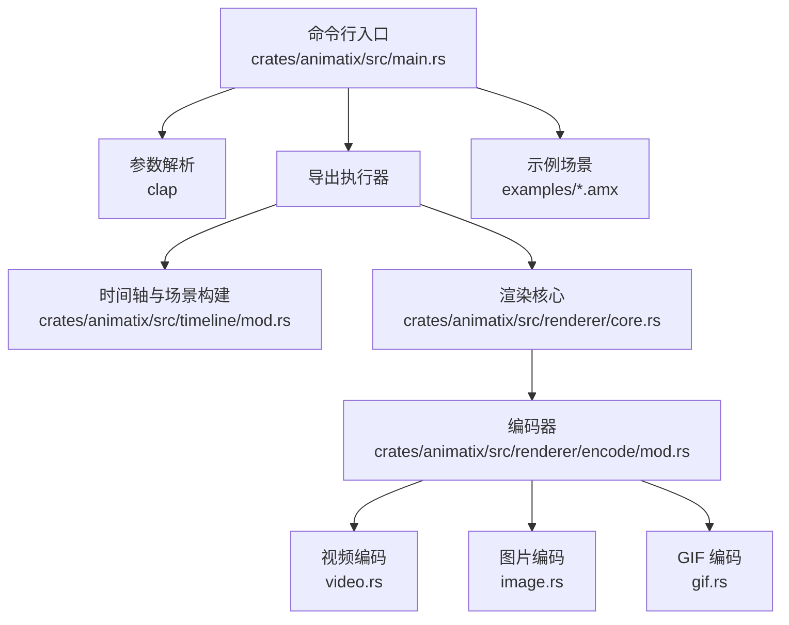
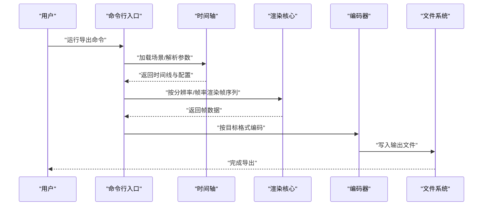
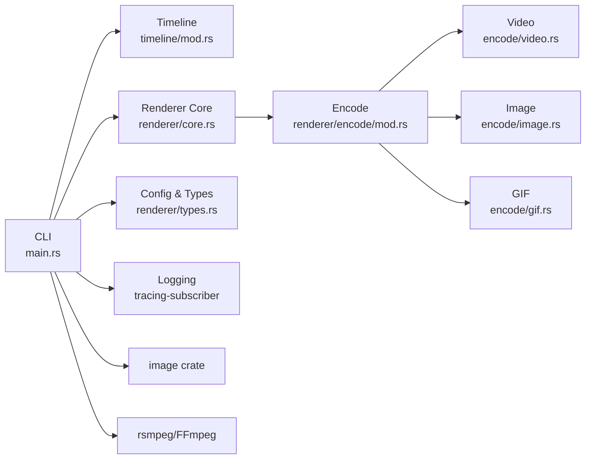

# 命令行工具 API

<cite>
**本文引用的文件**
- [crates/animatix/src/main.rs](file://crates/animatix/src/main.rs)
- [crates/animatix/Cargo.toml](file://crates/animatix/Cargo.toml)
- [crates/animatix/src/renderer/encode/mod.rs](file://crates/animatix/src/renderer/encode/mod.rs)
- [crates/animatix/src/renderer/encode/video.rs](file://crates/animatix/src/renderer/encode/video.rs)
- [crates/animatix/src/renderer/encode/image.rs](file://crates/animatix/src/renderer/encode/image.rs)
- [crates/animatix/src/renderer/encode/gif.rs](file://crates/animatix/src/renderer/encode/gif.rs)
- [crates/animatix/src/renderer/core.rs](file://crates/animatix/src/renderer/core.rs)
- [crates/animatix/src/renderer/types.rs](file://crates/animatix/src/renderer/types.rs)
- [crates/animatix/src/timeline/mod.rs](file://crates/animatix/src/timeline/mod.rs)
- [crates/animatix/src/composition.rs](file://crates/animatix/src/composition.rs)
- [crates/animatix/src/renderer/error.rs](file://crates/animatix/src/renderer/error.rs)
- [examples/README.md](file://examples/README.md)
- [examples/00_hello.amx](file://examples/00_hello.amx)
- [examples/01_shapes.amx](file://examples/01_shapes.amx)
- [examples/02_layout.amx](file://examples/02_layout.amx)
- [examples/03_timing.amx](file://examples/03_timing.amx)
- [examples/04_motion.amx](file://examples/04_motion.amx)
- [examples/05_morph.amx](file://examples/05_morph.amx)
- [examples/06_reactive.amx](file://examples/06_reactive.amx)
- [examples/07_plots.amx](file://examples/07_plots.amx)
- [examples/08_effects.amx](file://examples/08_effects.amx)
- [examples/09_components.amx](file://examples/09_components.amx)
- [examples/10_modules.amx](file://examples/10_modules.amx)
- [examples/11_colors.amx](file://examples/11_colors.amx)
- [examples/12_reorder.amx](file://examples/12_reorder.amx)
- [examples/13_paths.amx](file://examples/13_paths.amx)
- [examples/14_multiscene.amx](file://examples/14_multiscene.amx)
- [examples/15_for_loop.amx](file://examples/15_for_loop.amx)
- [examples/16_showcase.amx](file://examples/16_showcase.amx)
- [examples/17_audio_reactive.amx](file://examples/17_audio_reactive.amx)
- [examples/18_number_plane_contours.amx](file://examples/18_number_plane_contours.amx)
- [examples/19_cross_file_scenes.amx](file://examples/19_cross_file_scenes.amx)
- [examples/20_feature_reel.amx](file://examples/20_feature_reel.amx)
- [examples/21_actions.amx](file://examples/21_actions.amx)
- [examples/22_expressions.amx](file://examples/22_expressions.amx)
- [examples/23_plot_kinds.amx](file://examples/23_plot_kinds.amx)
</cite>

## 目录
1. [简介](#简介)
2. [项目结构](#项目结构)
3. [核心组件](#核心组件)
4. [架构总览](#架构总览)
5. [详细组件分析](#详细组件分析)
6. [依赖分析](#依赖分析)
7. [性能考虑](#性能考虑)
8. [故障排查指南](#故障排查指南)
9. [结论](#结论)
10. [附录](#附录)

## 简介
本文件为 Animatix 命令行工具的完整 API 文档，面向使用者与集成开发者，覆盖以下主题：
- 命令行参数与选项：输入文件指定、输出格式选择、质量与分辨率设置、帧率控制、日志与颜色开关等
- 支持的输出格式：视频（MP4、AVI）、图片（PNG、JPEG）、动画（GIF）
- 批处理与并行处理能力：多场景/多文件批量导出与并发渲染策略
- 渲染配置：分辨率、帧率、编码器选项
- 使用示例与最佳实践
- 错误处理与日志输出

## 项目结构
Animatix 的命令行工具位于主 crate 的入口文件中，通过子命令与参数解析实现导出流程；渲染与编码逻辑分布在渲染器与编码模块中；示例场景位于 examples 目录。

图表来源
- [crates/animatix/src/main.rs](file://crates/animatix/src/main.rs)
- [crates/animatix/src/timeline/mod.rs](file://crates/animatix/src/timeline/mod.rs)
- [crates/animatix/src/renderer/core.rs](file://crates/animatix/src/renderer/core.rs)
- [crates/animatix/src/renderer/encode/mod.rs](file://crates/animatix/src/renderer/encode/mod.rs)
- [crates/animatix/src/renderer/encode/video.rs](file://crates/animatix/src/renderer/encode/video.rs)
- [crates/animatix/src/renderer/encode/image.rs](file://crates/animatix/src/renderer/encode/image.rs)
- [crates/animatix/src/renderer/encode/gif.rs](file://crates/animatix/src/renderer/encode/gif.rs)
- [examples/README.md](file://examples/README.md)

章节来源
- [crates/animatix/src/main.rs](file://crates/animatix/src/main.rs)
- [crates/animatix/Cargo.toml](file://crates/animatix/Cargo.toml)
- [examples/README.md](file://examples/README.md)

## 核心组件
- 参数解析与子命令：通过 clap 定义命令行参数与子命令，支持详细日志与彩色输出控制
- 导出执行器：根据参数决定渲染与编码流程
- 时间轴与场景：将源场景转换为可渲染的时间线序列
- 渲染核心：生成帧图像
- 编码器：按目标格式写入文件（视频、图片、GIF）

章节来源
- [crates/animatix/src/main.rs](file://crates/animatix/src/main.rs)
- [crates/animatix/src/timeline/mod.rs](file://crates/animatix/src/timeline/mod.rs)
- [crates/animatix/src/renderer/core.rs](file://crates/animatix/src/renderer/core.rs)
- [crates/animatix/src/renderer/encode/mod.rs](file://crates/animatix/src/renderer/encode/mod.rs)

## 架构总览
下图展示从命令行到最终输出的端到端流程：

图表来源
- [crates/animatix/src/main.rs](file://crates/animatix/src/main.rs)
- [crates/animatix/src/timeline/mod.rs](file://crates/animatix/src/timeline/mod.rs)
- [crates/animatix/src/renderer/core.rs](file://crates/animatix/src/renderer/core.rs)
- [crates/animatix/src/renderer/encode/mod.rs](file://crates/animatix/src/renderer/encode/mod.rs)

## 详细组件分析

### 命令行参数与选项
- 输入文件
  - 单场景：通过位置参数或显式文件路径指定一个 .amx 场景文件
  - 多场景/批处理：支持传入多个 .amx 文件进行批量导出
- 输出控制
  - 输出文件名：显式指定输出路径；若未指定则按规则推导默认名称
  - 输出格式：通过格式参数选择 MP4、AVI、PNG、JPEG、GIF
- 分辨率与画质
  - 分辨率：以像素为单位设置宽高
  - 质量：针对视频与图片格式提供质量/压缩级别参数
- 帧率与时长
  - 帧率：每秒帧数（FPS），影响渲染与编码时序
  - 持续时长：总时长或结束帧控制
  - 最后一帧保持：在省略总时长时，可额外保持最后一帧若干秒
- 日志与颜色
  - 详细级别：支持多次增加详细程度
  - 彩色输出：可禁用 ANSI 颜色
- 并行处理
  - 多文件并行：对多个输入文件采用并发导出
  - 渲染并行：内部渲染管线可能利用多核并行（具体取决于实现细节）

章节来源
- [crates/animatix/src/main.rs](file://crates/animatix/src/main.rs)

### 支持的输出格式
- 视频：MP4、AVI（由底层编码器支持）
- 图片：PNG、JPEG（静态帧导出）
- 动画：GIF（逐帧合成）

章节来源
- [crates/animatix/src/renderer/encode/video.rs](file://crates/animatix/src/renderer/encode/video.rs)
- [crates/animatix/src/renderer/encode/image.rs](file://crates/animatix/src/renderer/encode/image.rs)
- [crates/animatix/src/renderer/encode/gif.rs](file://crates/animatix/src/renderer/encode/gif.rs)
- [crates/animatix/Cargo.toml](file://crates/animatix/Cargo.toml)

### 渲染配置参数
- 分辨率：宽、高（像素）
- 帧率：FPS
- 编码选项：视频编码器参数（如码率、预设、B 帧等，具体取决于实现）
- 文本与字体：字体数据库与布局（可选）
- GPU 加速：WGPU 后端（可选）

章节来源
- [crates/animatix/src/renderer/types.rs](file://crates/animatix/src/renderer/types.rs)
- [crates/animatix/src/renderer/core.rs](file://crates/animatix/src/renderer/core.rs)
- [crates/animatix/Cargo.toml](file://crates/animatix/Cargo.toml)

### 批处理与并行处理
- 批处理：一次传入多个 .amx 文件，依次导出
- 并行：对不同输入文件采用并发导出；渲染阶段可能利用多核并行
- 进度与日志：通过详细级别与日志输出观察进度与错误

章节来源
- [crates/animatix/src/main.rs](file://crates/animatix/src/main.rs)

### 错误处理与日志
- 日志系统：基于 tracing-subscriber，支持环境过滤
- 错误类型：渲染与编码错误统一映射为可读错误信息
- 建议：在 CI 或自动化脚本中结合详细日志定位问题

章节来源
- [crates/animatix/src/renderer/error.rs](file://crates/animatix/src/renderer/error.rs)
- [crates/animatix/Cargo.toml](file://crates/animatix/Cargo.toml)

### 使用示例与最佳实践
- 基础导出
  - 将单个场景导出为 MP4：指定输入 .amx 与输出 .mp4
  - 导出静态帧为 PNG：指定 PNG 输出格式
- 高质量导出
  - 提升分辨率与帧率，配合高质量编码参数
- 批量导出
  - 传入多个 .amx 文件，自动并行导出
- 示例场景
  - 参考 examples 目录中的示例文件，快速上手

章节来源
- [examples/README.md](file://examples/README.md)
- [examples/00_hello.amx](file://examples/00_hello.amx)
- [examples/01_shapes.amx](file://examples/01_shapes.amx)
- [examples/02_layout.amx](file://examples/02_layout.amx)
- [examples/03_timing.amx](file://examples/03_timing.amx)
- [examples/04_motion.amx](file://examples/04_motion.amx)
- [examples/05_morph.amx](file://examples/05_morph.amx)
- [examples/06_reactive.amx](file://examples/06_reactive.amx)
- [examples/07_plots.amx](file://examples/07_plots.amx)
- [examples/08_effects.amx](file://examples/08_effects.amx)
- [examples/09_components.amx](file://examples/09_components.amx)
- [examples/10_modules.amx](file://examples/10_modules.amx)
- [examples/11_colors.amx](file://examples/11_colors.amx)
- [examples/12_reorder.amx](file://examples/12_reorder.amx)
- [examples/13_paths.amx](file://examples/13_paths.amx)
- [examples/14_multiscene.amx](file://examples/14_multiscene.amx)
- [examples/15_for_loop.amx](file://examples/15_for_loop.amx)
- [examples/16_showcase.amx](file://examples/16_showcase.amx)
- [examples/17_audio_reactive.amx](file://examples/17_audio_reactive.amx)
- [examples/18_number_plane_contours.amx](file://examples/18_number_plane_contours.amx)
- [examples/19_cross_file_scenes.amx](file://examples/19_cross_file_scenes.amx)
- [examples/20_feature_reel.amx](file://examples/20_feature_reel.amx)
- [examples/21_actions.amx](file://examples/21_actions.amx)
- [examples/22_expressions.amx](file://examples/22_expressions.amx)
- [examples/23_plot_kinds.amx](file://examples/23_plot_kinds.amx)

## 依赖分析
- 关键外部依赖
  - clap：命令行参数解析
  - image：图片格式支持（PNG、JPEG、GIF）
  - rsmpeg：FFmpeg 集成，用于 MP4/AVI 等视频封装
  - wgpu：GPU 渲染后端（可选）
  - tracing-subscriber：日志与追踪
- 内部模块耦合
  - CLI 依赖时间轴与渲染器
  - 渲染器依赖编码器
  - 编码器依赖图像与视频模块

图表来源
- [crates/animatix/src/main.rs](file://crates/animatix/src/main.rs)
- [crates/animatix/src/timeline/mod.rs](file://crates/animatix/src/timeline/mod.rs)
- [crates/animatix/src/renderer/core.rs](file://crates/animatix/src/renderer/core.rs)
- [crates/animatix/src/renderer/encode/mod.rs](file://crates/animatix/src/renderer/encode/mod.rs)
- [crates/animatix/src/renderer/encode/video.rs](file://crates/animatix/src/renderer/encode/video.rs)
- [crates/animatix/src/renderer/encode/image.rs](file://crates/animatix/src/renderer/encode/image.rs)
- [crates/animatix/src/renderer/encode/gif.rs](file://crates/animatix/src/renderer/encode/gif.rs)
- [crates/animatix/src/renderer/types.rs](file://crates/animatix/src/renderer/types.rs)
- [crates/animatix/Cargo.toml](file://crates/animatix/Cargo.toml)

章节来源
- [crates/animatix/Cargo.toml](file://crates/animatix/Cargo.toml)

## 性能考虑
- 分辨率与帧率权衡：提高分辨率与帧率会显著增加渲染与编码成本
- 并行导出：多文件并行可提升吞吐；注意磁盘与 CPU 资源占用
- 编码器选择：不同编码器/预设对速度与质量影响较大
- GPU 加速：启用 WGPU 后端可加速渲染阶段（取决于平台与驱动）

## 故障排查指南
- 日志级别不足
  - 使用详细级别参数提升日志详细度，便于定位问题
- 输出为空或失败
  - 检查输入文件是否存在且可解析
  - 确认输出格式与编码器可用（例如 FFmpeg 是否正确安装）
- 性能过低
  - 降低分辨率或帧率
  - 合理设置编码参数与并行度
- 错误信息
  - 查看渲染与编码错误映射，结合日志定位具体步骤

章节来源
- [crates/animatix/src/renderer/error.rs](file://crates/animatix/src/renderer/error.rs)
- [crates/animatix/src/main.rs](file://crates/animatix/src/main.rs)

## 结论
Animatix 命令行工具提供了从场景到多种输出格式的一体化导出能力，具备良好的可扩展性与性能潜力。通过合理设置分辨率、帧率与编码参数，并结合批处理与并行导出，可在保证质量的同时高效完成大规模动画产出。

## 附录
- 快速参考
  - 输入：单个或多个 .amx 文件
  - 输出：MP4、AVI、PNG、JPEG、GIF
  - 关键参数：分辨率、帧率、质量、持续时长、最后帧保持、详细级别、彩色输出
- 示例场景清单
  - 参考 examples 目录中的示例文件，快速验证导出效果

章节来源
- [examples/README.md](file://examples/README.md)
- [examples/00_hello.amx](file://examples/00_hello.amx)
- [examples/01_shapes.amx](file://examples/01_shapes.amx)
- [examples/02_layout.amx](file://examples/02_layout.amx)
- [examples/03_timing.amx](file://examples/03_timing.amx)
- [examples/04_motion.amx](file://examples/04_motion.amx)
- [examples/05_morph.amx](file://examples/05_morph.amx)
- [examples/06_reactive.amx](file://examples/06_reactive.amx)
- [examples/07_plots.amx](file://examples/07_plots.amx)
- [examples/08_effects.amx](file://examples/08_effects.amx)
- [examples/09_components.amx](file://examples/09_components.amx)
- [examples/10_modules.amx](file://examples/10_modules.amx)
- [examples/11_colors.amx](file://examples/11_colors.amx)
- [examples/12_reorder.amx](file://examples/12_reorder.amx)
- [examples/13_paths.amx](file://examples/13_paths.amx)
- [examples/14_multiscene.amx](file://examples/14_multiscene.amx)
- [examples/15_for_loop.amx](file://examples/15_for_loop.amx)
- [examples/16_showcase.amx](file://examples/16_showcase.amx)
- [examples/17_audio_reactive.amx](file://examples/17_audio_reactive.amx)
- [examples/18_number_plane_contours.amx](file://examples/18_number_plane_contours.amx)
- [examples/19_cross_file_scenes.amx](file://examples/19_cross_file_scenes.amx)
- [examples/20_feature_reel.amx](file://examples/20_feature_reel.amx)
- [examples/21_actions.amx](file://examples/21_actions.amx)
- [examples/22_expressions.amx](file://examples/22_expressions.amx)
- [examples/23_plot_kinds.amx](file://examples/23_plot_kinds.amx)