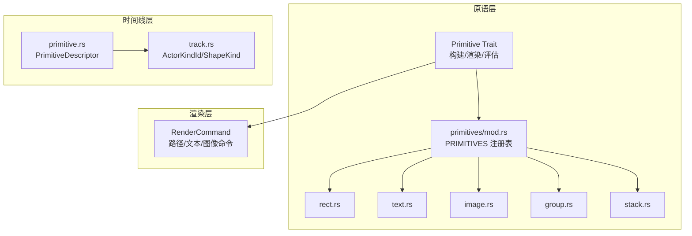
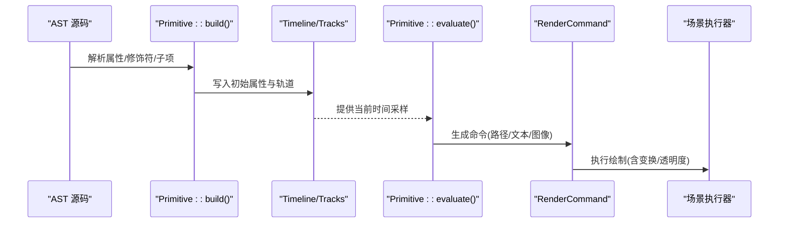
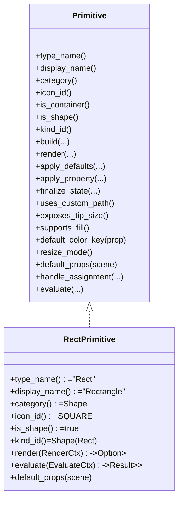
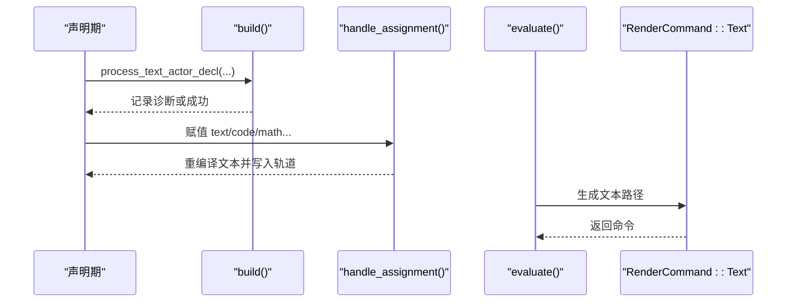
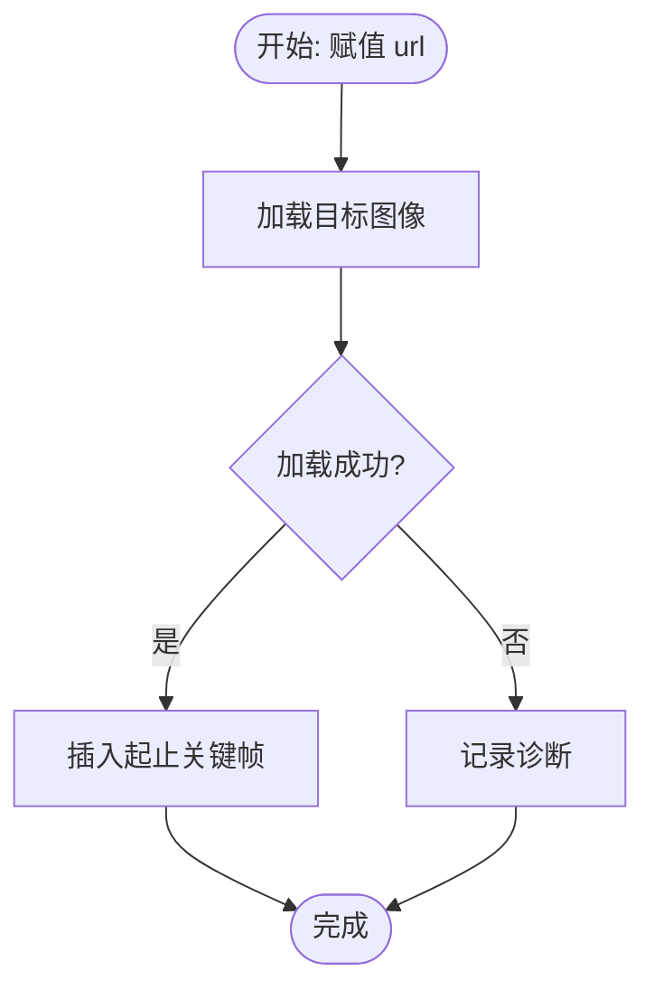
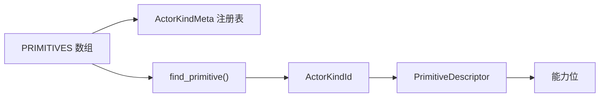

# 原语 API

<cite>
**本文引用的文件**
- [crates/animatix/src/primitives/mod.rs](file://crates/animatix/src/primitives/mod.rs)
- [crates/animatix/src/timeline/primitive.rs](file://crates/animatix/src/timeline/primitive.rs)
- [crates/animatix/src/primitives/rect.rs](file://crates/animatix/src/primitives/rect.rs)
- [crates/animatix/src/primitives/text.rs](file://crates/animatix/src/primitives/text.rs)
- [crates/animatix/src/primitives/image.rs](file://crates/animatix/src/primitives/image.rs)
- [crates/animatix/src/primitives/group.rs](file://crates/animatix/src/primitives/group.rs)
- [crates/animatix/src/primitives/stack.rs](file://crates/animatix/src/primitives/stack.rs)
- [crates/animatix/src/timeline/track.rs](file://crates/animatix/src/timeline/track.rs)
- [docs/primitives.md](file://docs/primitives.md)
- [docs/properties.md](file://docs/properties.md)
</cite>

## 目录
1. [简介](#简介)
2. [项目结构](#项目结构)
3. [核心组件](#核心组件)
4. [架构总览](#架构总览)
5. [详细组件分析](#详细组件分析)
6. [依赖关系分析](#依赖关系分析)
7. [性能考量](#性能考量)
8. [故障排查指南](#故障排查指南)
9. [结论](#结论)
10. [附录](#附录)

## 简介
本文件系统性梳理 Animatix 的“原语 API”，覆盖所有可视化元素（形状、文本、图像、媒体、图表与容器）的创建与操作接口，说明属性设置（位置、尺寸、颜色、变换等），文档化组合接口（组、堆叠与布局容器），并记录动画接口（属性绑定与关键帧）。文末提供使用示例与最佳实践，帮助开发者在不深入源码的情况下高效上手。

## 项目结构
Animatix 将“原语”统一抽象为实现了同一 Trait 的类型集合，通过静态注册表集中管理元数据与派发逻辑；渲染阶段以“命令”形式解耦原语与场景执行；时间线模块负责属性采样与动画编排。

图示来源
- [crates/animatix/src/primitives/mod.rs:570-586](file://crates/animatix/src/primitives/mod.rs#L570-L586)
- [crates/animatix/src/timeline/primitive.rs:25-30](file://crates/animatix/src/timeline/primitive.rs#L25-L30)
- [crates/animatix/src/timeline/track.rs:63-106](file://crates/animatix/src/timeline/track.rs#L63-L106)

章节来源
- [crates/animatix/src/primitives/mod.rs:1-100](file://crates/animatix/src/primitives/mod.rs#L1-L100)
- [crates/animatix/src/timeline/primitive.rs:1-30](file://crates/animatix/src/timeline/primitive.rs#L1-L30)
- [crates/animatix/src/timeline/track.rs:1-60](file://crates/animatix/src/timeline/track.rs#L1-L60)

## 核心组件
- Primitive Trait：定义原语的元数据、构建、渲染与评估接口，支持属性默认值、形状状态应用、分配期处理与帧评估。
- PRIMITIVES 注册表：集中声明所有原语实例，自动生成 ActorKindMeta 元数据。
- PrimitiveDescriptor：按 Actor 类型推导家族与能力（文本、矢量形状、媒体、图表、容器、分组）。
- RenderCommand：渲染阶段的统一命令，包含路径、文本与图像绘制。
- ActorKindId/ShapeKind：稳定类型标识，用于匹配与派发。

章节来源
- [crates/animatix/src/primitives/mod.rs:195-568](file://crates/animatix/src/primitives/mod.rs#L195-L568)
- [crates/animatix/src/timeline/primitive.rs:25-149](file://crates/animatix/src/timeline/primitive.rs#L25-L149)
- [crates/animatix/src/timeline/track.rs:63-145](file://crates/animatix/src/timeline/track.rs#L63-L145)

## 架构总览
原语从 AST 构建到时间线，再到帧评估生成渲染命令，最终由场景执行器绘制。

图示来源
- [crates/animatix/src/primitives/mod.rs:448-567](file://crates/animatix/src/primitives/mod.rs#L448-L567)
- [crates/animatix/src/primitives/rect.rs:86-107](file://crates/animatix/src/primitives/rect.rs#L86-L107)
- [crates/animatix/src/primitives/text.rs:94-112](file://crates/animatix/src/primitives/text.rs#L94-L112)
- [crates/animatix/src/primitives/image.rs:95-116](file://crates/animatix/src/primitives/image.rs#L95-L116)

## 详细组件分析

### 形状原语：矩形 Rect
- 元数据与类别：类型名为 Rect，显示名为 Rectangle，属于 Shape 分类。
- 构建：空实现（由时间线处理通用属性）。
- 渲染：基于当前尺寸生成矩形路径，并应用样式（填充/描边/透明度）。
- 评估：在帧评估时采样尺寸与样式，返回路径命令。
- 默认属性：位置 at、尺寸 size、颜色 color。

图示来源
- [crates/animatix/src/primitives/rect.rs:10-107](file://crates/animatix/src/primitives/rect.rs#L10-L107)

章节来源
- [crates/animatix/src/primitives/rect.rs:1-108](file://crates/animatix/src/primitives/rect.rs#L1-L108)
- [docs/primitives.md:93-113](file://docs/primitives.md#L93-L113)

### 文本原语：Text
- 元数据与类别：类型名为 Text，属于 Text 分类。
- 构建：委托给文本处理流程，记录诊断。
- 分配期处理：对 text/latex/math/code 属性进行即时重编译，支持缓动与延迟。
- 评估：在帧评估时根据内容与字体参数生成文本路径，返回文本命令。
- 默认属性：位置 at、文本 text、字号 font_size。

图示来源
- [crates/animatix/src/primitives/text.rs:22-92](file://crates/animatix/src/primitives/text.rs#L22-L92)
- [crates/animatix/src/primitives/text.rs:94-112](file://crates/animatix/src/primitives/text.rs#L94-L112)

章节来源
- [crates/animatix/src/primitives/text.rs:1-121](file://crates/animatix/src/primitives/text.rs#L1-L121)
- [docs/primitives.md:11-26](file://docs/primitives.md#L11-L26)

### 图像原语：Image
- 元数据与类别：类型名为 Image，属于 Media 分类。
- 构建：委托媒体处理流程。
- 分配期处理：对 url 属性进行加载与关键帧插入，支持缓动与延迟；失败记录诊断。
- 评估：在帧评估时采样尺寸与图像，返回图像命令。
- 默认属性：位置 at、URL url、尺寸 size。

图示来源
- [crates/animatix/src/primitives/image.rs:47-93](file://crates/animatix/src/primitives/image.rs#L47-L93)

章节来源
- [crates/animatix/src/primitives/image.rs:1-125](file://crates/animatix/src/primitives/image.rs#L1-L125)
- [docs/primitives.md:76-92](file://docs/primitives.md#L76-L92)

### 容器原语：Group 与 Stack
- Group：分组容器，参与场景树与变换继承，评估阶段返回空命令。
- Stack：堆叠布局容器，支持 gap/padding 等布局属性，评估阶段返回空命令。

章节来源
- [crates/animatix/src/primitives/group.rs:1-46](file://crates/animatix/src/primitives/group.rs#L1-L46)
- [crates/animatix/src/primitives/stack.rs:1-50](file://crates/animatix/src/primitives/stack.rs#L1-L50)
- [docs/primitives.md:401-426](file://docs/primitives.md#L401-L426)

### 原语分类与能力
- PrimitiveDescriptor 根据 Actor 类型推导家族与能力，如 TextLike/VectorShape/Media/Plot/Container/Group。
- 能力位包括：文本路径、矢量路径、图像载荷、布局容器、可形态路径、矢量揭示目标、图表几何等。

章节来源
- [crates/animatix/src/timeline/primitive.rs:25-149](file://crates/animatix/src/timeline/primitive.rs#L25-L149)

## 依赖关系分析
- 原语注册：PRIMITIVES 静态数组集中声明所有原语实例，驱动元数据注册与查找。
- 类型标识：ActorKindId/ShapeKind 作为稳定类型标识，贯穿构建、派发与匹配。
- 能力映射：PrimitiveDescriptor 将 Actor 类型映射到家族与能力，辅助 GUI 与运行时行为。

图示来源
- [crates/animatix/src/primitives/mod.rs:570-647](file://crates/animatix/src/primitives/mod.rs#L570-L647)
- [crates/animatix/src/timeline/track.rs:63-106](file://crates/animatix/src/timeline/track.rs#L63-L106)
- [crates/animatix/src/timeline/primitive.rs:32-149](file://crates/animatix/src/timeline/primitive.rs#L32-L149)

章节来源
- [crates/animatix/src/primitives/mod.rs:570-647](file://crates/animatix/src/primitives/mod.rs#L570-L647)
- [crates/animatix/src/timeline/track.rs:63-145](file://crates/animatix/src/timeline/track.rs#L63-L145)
- [crates/animatix/src/timeline/primitive.rs:25-149](file://crates/animatix/src/timeline/primitive.rs#L25-L149)

## 性能考量
- 路径与文本重编译：文本在分配期可能触发重编译，建议批量更新与合理使用缓动，避免频繁切换内容。
- 图像加载：大图或网络资源需注意加载失败与跨帧过渡策略，必要时手动叠加淡入淡出。
- 矢量路径插值：几何输入（points/commands）支持关键帧与路径形态插值，复杂路径会增加计算成本。
- 布局容器：Row/Col/Grid/Stack 的自动布局在声明期测量与放置，尽量减少深层嵌套与动态尺寸变更。

## 故障排查指南
- 文本赋值无效：确认使用 text/code/math/content 等受支持的属性名；检查字体与字号是否正确。
- 图像无法显示：检查 URL 是否有效且可访问；查看构建诊断中关于媒体加载失败的信息。
- SVG 源变更未生效：当前 SVG 源变更需要在关键帧重新声明，不支持直接赋值动画。
- 属性不可赋值：部分属性仅构建期可用（如图表函数 data），请参考属性参考表。

章节来源
- [docs/properties.md:85-101](file://docs/properties.md#L85-L101)
- [docs/primitives.md:74-75](file://docs/primitives.md#L74-L75)
- [docs/primitives.md:96-104](file://docs/primitives.md#L96-L104)

## 结论
Animatix 的原语 API 以统一的 Primitive Trait 抽象了所有可视化元素，借助静态注册表与描述符系统实现稳定的类型识别与能力判定。通过帧评估生成的渲染命令，既保证了原语的独立性，也便于后续扩展与迁移。配合完善的时间线与属性系统，开发者可以高效地创建与动画化丰富的视觉内容。

## 附录

### 原语与属性速查
- 通用几何与样式属性：position/at/offset/anchor/size/width/height/rotation/scale/transform/color/opactiy/stroke/stroke_width/stroke_progress/fill_opacity。
- 形状特有：radius_x/radius_y/from/to/head_size(points/commands)。
- 文本族：text/content/code/font_family/font_size。
- 媒体：url（Image/Svg，后者当前不支持赋值动画）。
- 图表：x_domain/y_domain/t_domain/kind/func/data/resolution/density/levels/tolerance/max_depth/grid/ticks/tick_labels 等。
- 容器：gap/padding/align/cols（Grid）。

章节来源
- [docs/properties.md:20-137](file://docs/properties.md#L20-L137)
- [docs/primitives.md:14-455](file://docs/primitives.md#L14-L455)

### 使用示例与最佳实践
- 创建矩形：设置 at 与 size，选择 color 与 stroke；需要旋转/缩放时使用 transform 或单独的 rotation/scale。
- 添加文本：使用 title: "..." 快捷语法或显式 Text；对多语言/数学内容优先考虑 Typst。
- 插入图像：指定 at 与 size；若需随时间更换图片，请在不同关键帧重新声明或使用分配期处理。
- 组合与布局：用 Group 进行变换继承与层级组织；用 Stack 实现重叠层叠；Row/Col/Grid 用于自动布局。
- 动画与关键帧：对 position/size/color/stroke 等属性添加带缓动的关键帧；文本与几何输入支持路径形态插值。

章节来源
- [docs/primitives.md:22-25](file://docs/primitives.md#L22-L25)
- [docs/primitives.md:105-113](file://docs/primitives.md#L105-L113)
- [docs/primitives.md:155-159](file://docs/primitives.md#L155-L159)
- [docs/primitives.md:353-377](file://docs/primitives.md#L353-L377)
- [docs/primitives.md:429-447](file://docs/primitives.md#L429-L447)