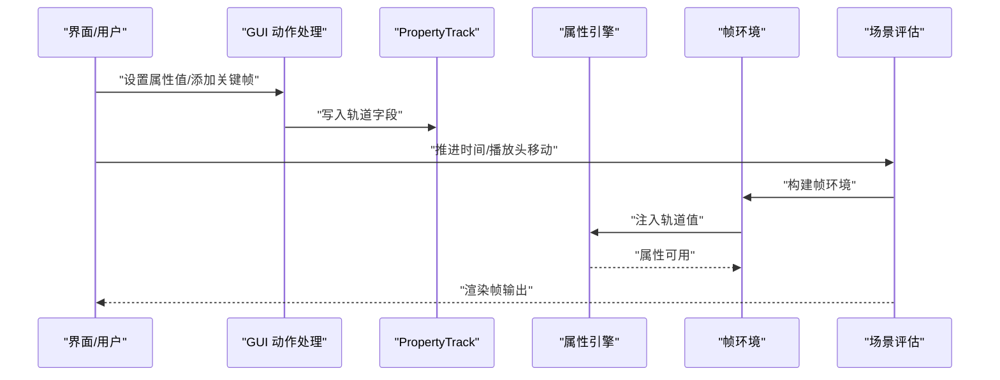
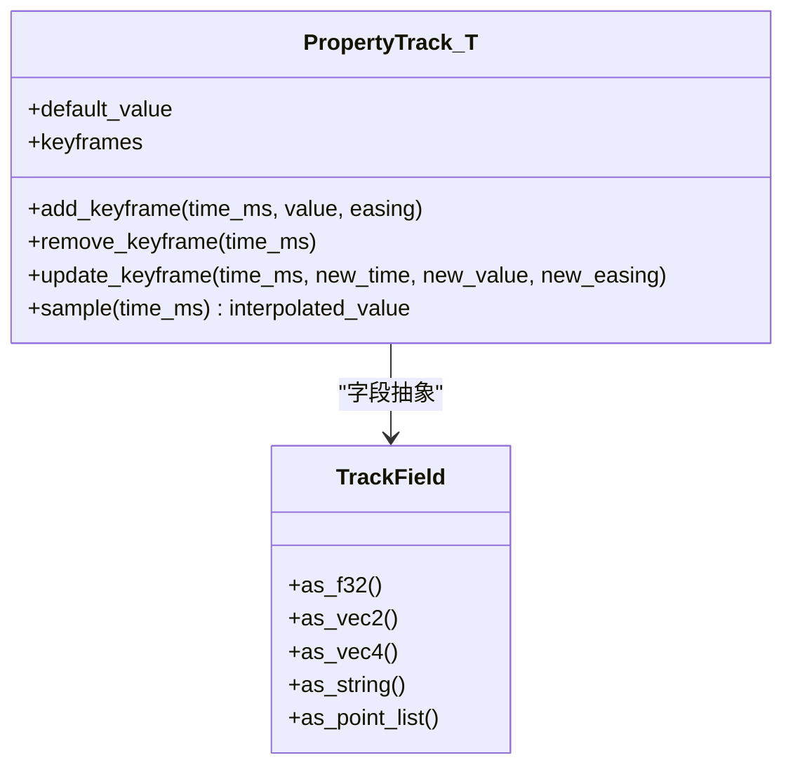
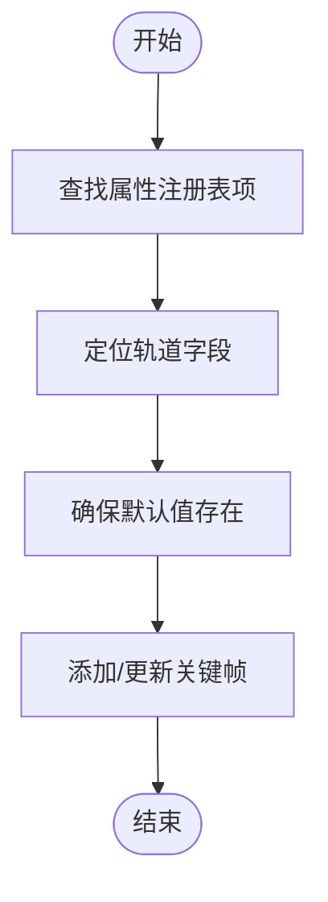
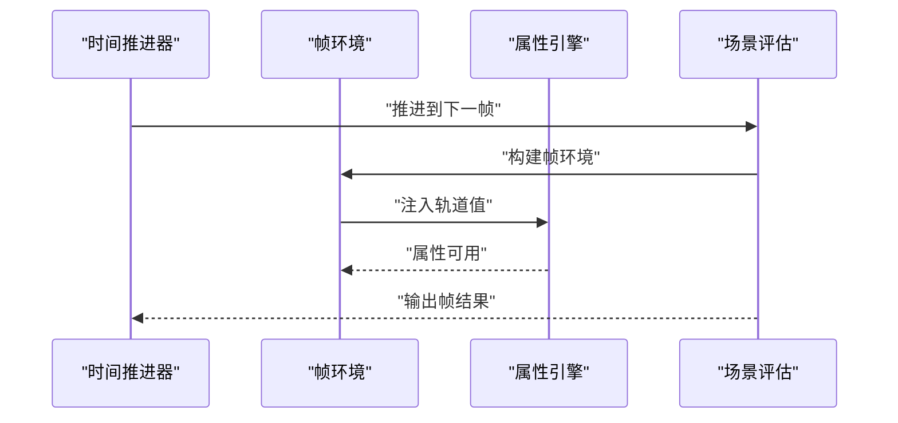
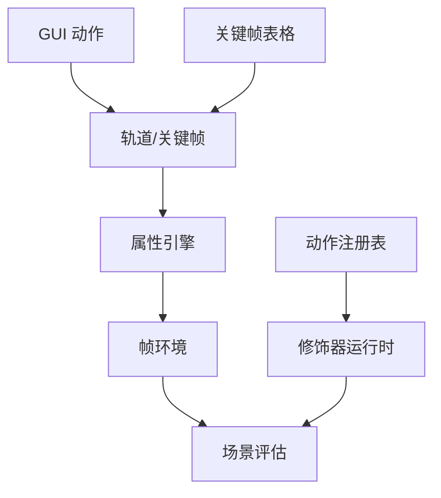

# 时间线 API

<cite>
**本文引用的文件**
- [crates/animatix/src/lib.rs](file://crates/animatix/src/lib.rs)
- [crates/animatix/src/timeline/mod.rs](file://crates/animatix/src/timeline/mod.rs)
- [crates/animatix/src/timeline/track.rs](file://crates/animatix/src/timeline/track.rs)
- [crates/animatix/src/timeline/property_engine.rs](file://crates/animatix/src/timeline/property_engine.rs)
- [crates/animatix/src/timeline/scene_eval.rs](file://crates/animatix/src/timeline/scene_eval.rs)
- [crates/animatix/src/timeline/timing.rs](file://crates/animatix/src/timeline/timing.rs)
- [crates/animatix/src/timeline/frame_env.rs](file://crates/animatix/src/timeline/frame_env.rs)
- [crates/animatix/src/timeline/property_registry.rs](file://crates/animatix/src/timeline/property_registry.rs)
- [crates/animatix/src/timeline/assignments.rs](file://crates/animatix/src/timeline/assignments.rs)
- [crates/animatix/src/timeline/actor_kind.rs](file://crates/animatix/src/timeline/actor_kind.rs)
- [crates/animatix/src/timeline/primitive.rs](file://crates/animatix/src/timeline/primitive.rs)
- [crates/animatix/src/timeline/layout.rs](file://crates/animatix/src/timeline/layout.rs)
- [crates/animatix/src/timeline/media.rs](file://crates/animatix/src/timeline/media.rs)
- [crates/animatix/src/timeline/svg.rs](file://crates/animatix/src/timeline/svg.rs)
- [crates/animatix/src/timeline/value_parser.rs](file://crates/animatix/src/timeline/value_parser.rs)
- [crates/animatix/src/timeline/utils.rs](file://crates/animatix/src/timeline/utils.rs)
- [crates/animatix/src/timeline/build/mod.rs](file://crates/animatix/src/timeline/build/mod.rs)
- [crates/animatix/src/timeline/shape/mod.rs](file://crates/animatix/src/timeline/shape/mod.rs)
- [crates/animatix/src/timeline/shape/primitives.rs](file://crates/animatix/src/timeline/shape/primitives.rs)
- [crates/animatix/src/timeline/actions/mod.rs](file://crates/animatix/src/timeline/actions/mod.rs)
- [crates/animatix/src/timeline/actions/effects.rs](file://crates/animatix/src/timeline/actions/effects.rs)
- [crates/animatix/src/timeline/actions/motion.rs](file://crates/animatix/src/timeline/actions/motion.rs)
- [crates/animatix/src/timeline/actions/reveal.rs](file://crates/animatix/src/timeline/actions/reveal.rs)
- [crates/animatix/src/timeline/actions/entrance.rs](file://crates/animatix/src/timeline/actions/entrance.rs)
- [crates/animatix/src/timeline/actions/exit.rs](file://crates/animatix/src/timeline/actions/exit.rs)
- [crates/animatix/src/timeline/actions/reorder.rs](file://crates/animatix/src/timeline/actions/reorder.rs)
- [crates/animatix/src/timeline/actions/registry.rs](file://crates/animatix/src/timeline/actions/registry.rs)
- [crates/animatix/src/timeline/sequence.rs](file://crates/animatix/src/timeline/sequence.rs)
- [crates/animatix/src/timeline/plot.rs](file://crates/animatix/src/timeline/plot.rs)
- [crates/animatix/src/timeline/morph.rs](file://crates/animatix/src/timeline/morph.rs)
- [crates/animatix/src/timeline/path_progress.rs](file://crates/animatix/src/timeline/path_progress.rs)
- [crates/animatix/src/timeline/taffy_layout.rs](file://crates/animatix/src/timeline/taffy_layout.rs)
- [crates/animatix/src/timeline/position.rs](file://crates/animatix/src/timeline/position.rs)
- [crates/animatix/src/timeline/kurbo_shapes.rs](file://crates/animatix/src/timeline/kurbo_shapes.rs)
- [crates/animatix/src/timeline/svg_import.rs](file://crates/animatix/src/timeline/svg_import.rs)
- [crates/animatix/src/timeline/vello_path.rs](file://crates/animatix/src/timeline/vello_path.rs)
- [crates/animatix/src/timeline/filter.rs](file://crates/animatix/src/timeline/filter.rs)
- [crates/animatix/src/timeline/colorscheme.rs](file://crates/animatix/src/timeline/colorscheme.rs)
- [crates/animatix/src/timeline/assets.rs](file://crates/animatix/src/timeline/assets.rs)
- [crates/animatix/src/timeline/image.rs](file://crates/animatix/src/timeline/image.rs)
- [crates/animatix/src/timeline/declarations_text.rs](file://crates/animatix/src/timeline/declarations_text.rs)
- [crates/animatix/src/timeline/env.rs](file://crates/animatix/src/timeline/env.rs)
- [crates/animatix/src/timeline/index.rs](file://crates/animatix/src/timeline/index.rs)
- [crates/animatix/src/timeline/builtins.rs](file://crates/animatix/src/timeline/builtins.rs)
- [crates/animatix/src/timeline/tests.rs](file://crates/animatix/src/timeline/tests.rs)
- [crates/animatix/src/timeline/modifier_exec.rs](file://crates/animatix/src/timeline/modifier_exec.rs)
- [crates/animatix/src/timeline/modifier_runtime/vm.rs](file://crates/animatix/src/timeline/modifier_runtime/vm.rs)
- [crates/animatix/src/timeline/modifier_runtime/ir/mod.rs](file://crates/animatix/src/timeline/modifier_runtime/ir/mod.rs)
- [crates/animatix/src/timeline/modifier_runtime/ir/types.rs](file://crates/animatix/src/timeline/modifier_runtime/ir/types.rs)
- [crates/animatix/src/timeline/modifier_runtime/ir/lower.rs](file://crates/animatix/src/timeline/modifier_runtime/ir/lower.rs)
- [crates/animatix/src/timeline/modifier_runtime/ir/eval.rs](file://crates/animatix/src/timeline/modifier_runtime/ir/eval.rs)
- [crates/animatix/src/timeline/modifier_runtime/ir/display.rs](file://crates/animatix/src/timeline/modifier_runtime/ir/display.rs)
- [crates/animatix/src/timeline/primitives/mod.rs](file://crates/animatix/src/timeline/primitives/mod.rs)
- [crates/animatix/src/timeline/primitives/arrow.rs](file://crates/animatix/src/timeline/primitives/arrow.rs)
- [crates/animatix/src/timeline/primitives/audio.rs](file://crates/animatix/src/timeline/primitives/arrow.rs)
- [crates/animatix/src/timeline/primitives/bar_chart.rs](file://crates/animatix/src/timeline/primitives/bar_chart.rs)
- [crates/animatix/src/timeline/primitives/code.rs](file://crates/animatix/src/timeline/primitives/code.rs)
- [crates/animatix/src/timeline/primitives/col.rs](file://crates/animatix/src/timeline/primitives/col.rs)
- [crates/animatix/src/timeline/primitives/ellipse.rs](file://crates/animatix/src/timeline/primitives/ellipse.rs)
- [crates/animatix/src/timeline/primitives/filter.rs](file://crates/animatix/src/timeline/primitives/filter.rs)
- [crates/animatix/src/timeline/primitives/grid.rs](file://crates/animatix/src/timeline/primitives/grid.rs)
- [crates/animatix/src/timeline/primitives/group.rs](file://crates/animatix/src/timeline/primitives/group.rs)
- [crates/animatix/src/timeline/primitives/image.rs](file://crates/animatix/src/timeline/primitives/image.rs)
- [crates/animatix/src/timeline/primitives/line.rs](file://crates/animatix/src/timeline/primitives/line.rs)
- [crates/animatix/src/timeline/primitives/mask.rs](file://crates/animatix/src/timeline/primitives/mask.rs)
- [crates/animatix/src/timeline/primitives/path.rs](file://crates/animatix/src/timeline/primitives/path.rs)
- [crates/animatix/src/timeline/primitives/plot.rs](file://crates/animatix/src/timeline/primitives/plot.rs)
- [crates/animatix/src/timeline/primitives/polygon.rs](file://crates/animatix/src/timeline/primitives/polygon.rs)
- [crates/animatix/src/timeline/primitives/rect.rs](file://crates/animatix/src/timeline/primitives/rect.rs)
- [crates/animatix/src/timeline/primitives/row.rs](file://crates/animatix/src/timeline/primitives/row.rs)
- [crates/animatix/src/timeline/primitives/stack.rs](file://crates/animatix/src/timeline/primitives/stack.rs)
- [crates/animatix/src/timeline/primitives/svg.rs](file://crates/animatix/src/timeline/primitives/svg.rs)
- [crates/animatix/src/timeline/primitives/text.rs](file://crates/animatix/src/timeline/primitives/text.rs)
- [crates/animatix/src/timeline/primitives/typst.rs](file://crates/animatix/src/timeline/primitives/typst.rs)
- [crates/animatix/src/timeline/primitives/arrow.rs](file://crates/animatix/src/timeline/primitives/arrow.rs)
- [crates/animatix/src/timeline/primitives/audio.rs](file://crates/animatix/src/timeline/primitives/audio.rs)
- [crates/animatix/src/timeline/primitives/bar_chart.rs](file://crates/animatix/src/timeline/primitives/bar_chart.rs)
- [crates/animatix/src/timeline/primitives/code.rs](file://crates/animatix/src/timeline/primitives/code.rs)
- [crates/animatix/src/timeline/primitives/col.rs](file://crates/animatix/src/timeline/primitives/col.rs)
- [crates/animatix/src/timeline/primitives/ellipse.rs](file://crates/animatix/src/timeline/primitives/ellipse.rs)
- [crates/animatix/src/timeline/primitives/filter.rs](file://crates/animatix/src/timeline/primitives/filter.rs)
- [crates/animatix/src/timeline/primitives/grid.rs](file://crates/animatix/src/timeline/primitives/grid.rs)
- [crates/animatix/src/timeline/primitives/group.rs](file://crates/animatix/src/timeline/primitives/group.rs)
- [crates/animatix/src/timeline/primitives/image.rs](file://crates/animatix/src/timeline/primitives/image.rs)
- [crates/animatix/src/timeline/primitives/line.rs](file://crates/animatix/src/timeline/primitives/line.rs)
- [crates/animatix/src/timeline/primitives/mask.rs](file://crates/animatix/src/timeline/primitives/mask.rs)
- [crates/animatix/src/timeline/primitives/path.rs](file://crates/animatix/src/timeline/primitives/path.rs)
- [crates/animatix/src/timeline/primitives/plot.rs](file://crates/animatix/src/timeline/primitives/plot.rs)
- [crates/animatix/src/timeline/primitives/polygon.rs](file://crates/animatix/src/timeline/primitives/polygon.rs)
- [crates/animatix/src/timeline/primitives/rect.rs](file://crates/animatix/src/timeline/primitives/rect.rs)
- [crates/animatix/src/timeline/primitives/row.rs](file://crates/animatix/src/timeline/primitives/row.rs)
- [crates/animatix/src/timeline/primitives/stack.rs](file://crates/animatix/src/timeline/primitives/stack.rs)
- [crates/animatix/src/timeline/primitives/svg.rs](file://crates/animatix/src/timeline/primitives/svg.rs)
- [crates/animatix/src/timeline/primitives/text.rs](file://crates/animatix/src/timeline/primitives/text.rs)
- [crates/animatix/src/timeline/primitives/typst.rs](file://crates/animatix/src/timeline/primitives/typst.rs)
- [crates/animatix-gui/src/app/actions/mod.rs](file://crates/animatix-gui/src/app/actions/mod.rs)
- [crates/animatix-gui/src/app/panels/inspector/keyframe_table.rs](file://crates/animatix-gui/src/app/panels/inspector/keyframe_table.rs)
</cite>

## 目录
1. [简介](#简介)
2. [项目结构](#项目结构)
3. [核心组件](#核心组件)
4. [架构总览](#架构总览)
5. [详细组件分析](#详细组件分析)
6. [依赖关系分析](#依赖关系分析)
7. [性能考量](#性能考量)
8. [故障排查指南](#故障排查指南)
9. [结论](#结论)
10. [附录](#附录)

## 简介
本文件系统性梳理 Animatix 时间线 API 的设计与实现，覆盖时间线构建接口（场景评估、轨道管理、属性引擎）、关键帧管理接口（插入、删除、修改）、动画评估接口（时间推进、属性插值、动画组合），并提供参数说明、返回类型、使用示例与最佳实践。目标是帮助开发者在不深入源码的前提下，高效理解并正确使用时间线能力。

## 项目结构
Animatix 的时间线子系统位于 crates/animatix/src/timeline 下，采用按功能域分层组织：轨道与属性（track.rs、property_engine.rs）、场景评估（scene_eval.rs）、时序控制（timing.rs）、环境注入（frame_env.rs）、动作与修饰（actions/、modifier_runtime/）、图形与布局（primitives/、layout.rs、svg.rs）等。GUI 层通过 crates/animatix-gui 提供编辑器交互，例如关键帧表格与属性面板。

```mermaid
graph TB
subgraph "时间线内核"
T_MOD["timeline/mod.rs"]
T_TRACK["timeline/track.rs"]
T_PROP_ENG["timeline/property_engine.rs"]
T_SCENE_EVAL["timeline/scene_eval.rs"]
T_TIMING["timeline/timing.rs"]
T_FRAME_ENV["timeline/frame_env.rs"]
T_PRIM["timeline/primitives/mod.rs"]
T_LAYOUT["timeline/layout.rs"]
T_SVG["timeline/svg.rs"]
end
subgraph "动作与修饰"
T_ACTIONS["timeline/actions/mod.rs"]
T_VM["timeline/modifier_runtime/vm.rs"]
T_IR["timeline/modifier_runtime/ir/mod.rs"]
end
subgraph "GUI 集成"
GUI_ACTIONS["animatix-gui/app/actions/mod.rs"]
GUI_KEYFRAME["animatix-gui/app/panels/inspector/keyframe_table.rs"]
end
T_MOD --> T_TRACK
T_MOD --> T_PROP_ENG
T_MOD --> T_SCENE_EVAL
T_MOD --> T_TIMING
T_MOD --> T_FRAME_ENV
T_MOD --> T_PRIM
T_MOD --> T_LAYOUT
T_MOD --> T_SVG
T_MOD --> T_ACTIONS
T_MOD --> T_VM
T_MOD --> T_IR
GUI_ACTIONS --> T_TRACK
GUI_ACTIONS --> T_PROP_ENG
GUI_KEYFRAME --> T_TRACK
```

图示来源
- [crates/animatix/src/timeline/mod.rs](file://crates/animatix/src/timeline/mod.rs)
- [crates/animatix/src/timeline/track.rs](file://crates/animatix/src/timeline/track.rs)
- [crates/animatix/src/timeline/property_engine.rs](file://crates/animatix/src/timeline/property_engine.rs)
- [crates/animatix/src/timeline/scene_eval.rs](file://crates/animatix/src/timeline/scene_eval.rs)
- [crates/animatix/src/timeline/timing.rs](file://crates/animatix/src/timeline/timing.rs)
- [crates/animatix/src/timeline/frame_env.rs](file://crates/animatix/src/timeline/frame_env.rs)
- [crates/animatix/src/timeline/primitives/mod.rs](file://crates/animatix/src/timeline/primitives/mod.rs)
- [crates/animatix/src/timeline/layout.rs](file://crates/animatix/src/timeline/layout.rs)
- [crates/animatix/src/timeline/svg.rs](file://crates/animatix/src/timeline/svg.rs)
- [crates/animatix/src/timeline/actions/mod.rs](file://crates/animatix/src/timeline/actions/mod.rs)
- [crates/animatix/src/timeline/modifier_runtime/vm.rs](file://crates/animatix/src/timeline/modifier_runtime/vm.rs)
- [crates/animatix/src/timeline/modifier_runtime/ir/mod.rs](file://crates/animatix/src/timeline/modifier_runtime/ir/mod.rs)
- [crates/animatix-gui/src/app/actions/mod.rs](file://crates/animatix-gui/src/app/actions/mod.rs)
- [crates/animatix-gui/src/app/panels/inspector/keyframe_table.rs](file://crates/animatix-gui/src/app/panels/inspector/keyframe_table.rs)

章节来源
- [crates/animatix/src/lib.rs](file://crates/animatix/src/lib.rs)
- [crates/animatix/src/timeline/mod.rs](file://crates/animatix/src/timeline/mod.rs)

## 核心组件
- 轨道与关键帧
  - PropertyTrack<T>：通用属性轨道，支持默认值、关键帧集合与插值策略；提供插入、删除、修改关键帧等操作入口。
  - TrackField：对不同属性类型的轨道字段进行统一抽象，便于注册表驱动的写入与更新。
- 属性引擎
  - 注册表驱动的属性查找与注入，将轨道值注入到帧环境，供表达式与修饰器使用。
- 场景评估
  - 将当前时间戳映射为场景状态，结合轨道与属性引擎生成可渲染输出。
- 时序控制
  - 时间推进、播放头移动、循环与边界处理。
- 动作与修饰
  - 内置动作（运动、显隐、重排等）与修饰器运行时（VM/IR）执行管线。
- 图形与布局
  - 基元图形、SVG 导入、布局计算、路径进度等。

章节来源
- [crates/animatix/src/timeline/track.rs](file://crates/animatix/src/timeline/track.rs)
- [crates/animatix/src/timeline/property_engine.rs](file://crates/animatix/src/timeline/property_engine.rs)
- [crates/animatix/src/timeline/scene_eval.rs](file://crates/animatix/src/timeline/scene_eval.rs)
- [crates/animatix/src/timeline/timing.rs](file://crates/animatix/src/timeline/timing.rs)
- [crates/animatix/src/timeline/actions/mod.rs](file://crates/animatix/src/timeline/actions/mod.rs)
- [crates/animatix/src/timeline/modifier_runtime/vm.rs](file://crates/animatix/src/timeline/modifier_runtime/vm.rs)

## 架构总览
时间线从“轨道与属性”出发，经由“属性引擎注入”，进入“场景评估”，最终产出可渲染结果。GUI 层通过动作与关键帧表格与轨道交互，驱动时间推进与属性变更。

图示来源
- [crates/animatix-gui/src/app/actions/mod.rs](file://crates/animatix-gui/src/app/actions/mod.rs)
- [crates/animatix/src/timeline/track.rs](file://crates/animatix/src/timeline/track.rs)
- [crates/animatix/src/timeline/property_engine.rs](file://crates/animatix/src/timeline/property_engine.rs)
- [crates/animatix/src/timeline/frame_env.rs](file://crates/animatix/src/timeline/frame_env.rs)
- [crates/animatix/src/timeline/scene_eval.rs](file://crates/animatix/src/timeline/scene_eval.rs)

## 详细组件分析

### 轨道与关键帧管理
- 数据模型
  - PropertyTrack<T>：保存默认值与关键帧序列，支持按时间查询最近关键帧、线性/缓动插值等。
  - TrackField：对不同属性类型（如 F32、Vec2、Vec4、字符串、点列表）的轨道字段进行统一访问。
- 关键帧操作
  - 插入：基于时间戳添加关键帧，自动维护有序序列。
  - 删除：按时间或索引移除关键帧。
  - 修改：更新现有关键帧的时间、值或缓动曲线。
- 使用示例（路径）
  - 在 GUI 中为标准属性添加关键帧：[crates/animatix-gui/src/app/actions/mod.rs](file://crates/animatix-gui/src/app/actions/mod.rs)
  - 收集轨道关键帧用于表格展示：[crates/animatix-gui/src/app/panels/inspector/keyframe_table.rs](file://crates/animatix-gui/src/app/panels/inspector/keyframe_table.rs)

图示来源
- [crates/animatix/src/timeline/track.rs](file://crates/animatix/src/timeline/track.rs)

章节来源
- [crates/animatix/src/timeline/track.rs](file://crates/animatix/src/timeline/track.rs)
- [crates/animatix-gui/src/app/actions/mod.rs](file://crates/animatix-gui/src/app/actions/mod.rs)
- [crates/animatix-gui/src/app/panels/inspector/keyframe_table.rs](file://crates/animatix-gui/src/app/panels/inspector/keyframe_table.rs)

### 属性引擎与注册表
- 属性注册表
  - 通过注册表查找属性名对应的字段信息（名称、类型、允许的关键帧等），驱动轨道字段的创建与写入。
- 引擎注入
  - 在每一帧，将轨道值注入到帧环境，使表达式与修饰器可读取。
- 使用示例（路径）
  - 注册表驱动的标准属性写入：[crates/animatix-gui/src/app/actions/mod.rs](file://crates/animatix-gui/src/app/actions/mod.rs)
  - 将轨道值注入帧环境：[crates/animatix/src/timeline/frame_env.rs](file://crates/animatix/src/timeline/frame_env.rs)

图示来源
- [crates/animatix/src/timeline/property_registry.rs](file://crates/animatix/src/timeline/property_registry.rs)
- [crates/animatix/src/timeline/property_engine.rs](file://crates/animatix/src/timeline/property_engine.rs)
- [crates/animatix/src/timeline/frame_env.rs](file://crates/animatix/src/timeline/frame_env.rs)
- [crates/animatix-gui/src/app/actions/mod.rs](file://crates/animatix-gui/src/app/actions/mod.rs)

章节来源
- [crates/animatix/src/timeline/property_registry.rs](file://crates/animatix/src/timeline/property_registry.rs)
- [crates/animatix/src/timeline/property_engine.rs](file://crates/animatix/src/timeline/property_engine.rs)
- [crates/animatix/src/timeline/frame_env.rs](file://crates/animatix/src/timeline/frame_env.rs)
- [crates/animatix-gui/src/app/actions/mod.rs](file://crates/animatix-gui/src/app/actions/mod.rs)

### 场景评估与时间推进
- 场景评估
  - 将当前时间戳转换为场景状态，调用各轨道与属性引擎，生成帧级输出。
- 时间推进
  - 播放头移动、循环边界、时间缩放等。
- 使用示例（路径）
  - 场景评估入口：[crates/animatix/src/timeline/scene_eval.rs](file://crates/animatix/src/timeline/scene_eval.rs)
  - 帧环境构建与属性注入：[crates/animatix/src/timeline/frame_env.rs](file://crates/animatix/src/timeline/frame_env.rs)

图示来源
- [crates/animatix/src/timeline/scene_eval.rs](file://crates/animatix/src/timeline/scene_eval.rs)
- [crates/animatix/src/timeline/frame_env.rs](file://crates/animatix/src/timeline/frame_env.rs)
- [crates/animatix/src/timeline/property_engine.rs](file://crates/animatix/src/timeline/property_engine.rs)

章节来源
- [crates/animatix/src/timeline/scene_eval.rs](file://crates/animatix/src/timeline/scene_eval.rs)
- [crates/animatix/src/timeline/frame_env.rs](file://crates/animatix/src/timeline/frame_env.rs)
- [crates/animatix/src/timeline/timing.rs](file://crates/animatix/src/timeline/timing.rs)

### 动作与修饰器
- 动作（Actions）
  - 运动、显隐、重排、揭示等内置动作，通过注册表统一调度。
- 修饰器运行时（Modifier Runtime）
  - IR 低级指令与 VM 执行器，支持修饰器的编译与求值。
- 使用示例（路径）
  - 动作注册与派发：[crates/animatix/src/timeline/actions/registry.rs](file://crates/animatix/src/timeline/actions/registry.rs)
  - 运动/效果动作实现：[crates/animatix/src/timeline/actions/motion.rs](file://crates/animatix/src/timeline/actions/motion.rs), [crates/animatix/src/timeline/actions/effects.rs](file://crates/animatix/src/timeline/actions/effects.rs)
  - VM/IR 执行：[crates/animatix/src/timeline/modifier_runtime/vm.rs](file://crates/animatix/src/timeline/modifier_runtime/vm.rs), [crates/animatix/src/timeline/modifier_runtime/ir/mod.rs](file://crates/animatix/src/timeline/modifier_runtime/ir/mod.rs)

图示来源
- [crates/animatix/src/timeline/actions/registry.rs](file://crates/animatix/src/timeline/actions/registry.rs)
- [crates/animatix/src/timeline/modifier_runtime/vm.rs](file://crates/animatix/src/timeline/modifier_runtime/vm.rs)
- [crates/animatix/src/timeline/modifier_runtime/ir/mod.rs](file://crates/animatix/src/timeline/modifier_runtime/ir/mod.rs)

章节来源
- [crates/animatix/src/timeline/actions/registry.rs](file://crates/animatix/src/timeline/actions/registry.rs)
- [crates/animatix/src/timeline/actions/motion.rs](file://crates/animatix/src/timeline/actions/motion.rs)
- [crates/animatix/src/timeline/actions/effects.rs](file://crates/animatix/src/timeline/actions/effects.rs)
- [crates/animatix/src/timeline/modifier_runtime/vm.rs](file://crates/animatix/src/timeline/modifier_runtime/vm.rs)
- [crates/animatix/src/timeline/modifier_runtime/ir/mod.rs](file://crates/animatix/src/timeline/modifier_runtime/ir/mod.rs)

### 图形与布局
- 基元与 SVG
  - 多种图形基元（矩形、椭圆、路径、文本、图像等）与 SVG 导入/渲染。
- 布局与定位
  - 基于 Taffy 的布局与位置计算，支持路径进度与锚点。
- 使用示例（路径）
  - 基元定义与集合：[crates/animatix/src/timeline/primitives/mod.rs](file://crates/animatix/src/timeline/primitives/mod.rs)
  - SVG 导入与路径：[crates/animatix/src/timeline/svg_import.rs](file://crates/animatix/src/timeline/svg_import.rs), [crates/animatix/src/timeline/vello_path.rs](file://crates/animatix/src/timeline/vello_path.rs)
  - 布局与定位：[crates/animatix/src/timeline/layout.rs](file://crates/animatix/src/timeline/layout.rs), [crates/animatix/src/timeline/position.rs](file://crates/animatix/src/timeline/position.rs)

章节来源
- [crates/animatix/src/timeline/primitives/mod.rs](file://crates/animatix/src/timeline/primitives/mod.rs)
- [crates/animatix/src/timeline/svg_import.rs](file://crates/animatix/src/timeline/svg_import.rs)
- [crates/animatix/src/timeline/vello_path.rs](file://crates/animatix/src/timeline/vello_path.rs)
- [crates/animatix/src/timeline/layout.rs](file://crates/animatix/src/timeline/layout.rs)
- [crates/animatix/src/timeline/position.rs](file://crates/animatix/src/timeline/position.rs)

## 依赖关系分析
- 组件耦合
  - 轨道与属性引擎紧密耦合，轨道负责数据，引擎负责注入。
  - 场景评估依赖帧环境与属性引擎，形成稳定的上层调用链。
  - 动作与修饰器通过注册表解耦，便于扩展。
- 外部集成
  - GUI 层通过动作与关键帧表格与轨道交互，驱动时间线构建与编辑。

图示来源
- [crates/animatix/src/timeline/track.rs](file://crates/animatix/src/timeline/track.rs)
- [crates/animatix/src/timeline/property_engine.rs](file://crates/animatix/src/timeline/property_engine.rs)
- [crates/animatix/src/timeline/frame_env.rs](file://crates/animatix/src/timeline/frame_env.rs)
- [crates/animatix/src/timeline/scene_eval.rs](file://crates/animatix/src/timeline/scene_eval.rs)
- [crates/animatix/src/timeline/actions/registry.rs](file://crates/animatix/src/timeline/actions/registry.rs)
- [crates/animatix/src/timeline/modifier_runtime/vm.rs](file://crates/animatix/src/timeline/modifier_runtime/vm.rs)
- [crates/animatix-gui/src/app/actions/mod.rs](file://crates/animatix-gui/src/app/actions/mod.rs)
- [crates/animatix-gui/src/app/panels/inspector/keyframe_table.rs](file://crates/animatix-gui/src/app/panels/inspector/keyframe_table.rs)

章节来源
- [crates/animatix/src/timeline/track.rs](file://crates/animatix/src/timeline/track.rs)
- [crates/animatix/src/timeline/property_engine.rs](file://crates/animatix/src/timeline/property_engine.rs)
- [crates/animatix/src/timeline/frame_env.rs](file://crates/animatix/src/timeline/frame_env.rs)
- [crates/animatix/src/timeline/scene_eval.rs](file://crates/animatix/src/timeline/scene_eval.rs)
- [crates/animatix/src/timeline/actions/registry.rs](file://crates/animatix/src/timeline/actions/registry.rs)
- [crates/animatix/src/timeline/modifier_runtime/vm.rs](file://crates/animatix/src/timeline/modifier_runtime/vm.rs)
- [crates/animatix-gui/src/app/actions/mod.rs](file://crates/animatix-gui/src/app/actions/mod.rs)
- [crates/animatix-gui/src/app/panels/inspector/keyframe_table.rs](file://crates/animatix-gui/src/app/panels/inspector/keyframe_table.rs)

## 性能考量
- 关键帧数量控制
  - 合理减少关键帧密度，避免每帧大量插值计算。
- 缓存与增量
  - 利用帧环境缓存与增量更新，避免重复计算已知不变的属性。
- 插值策略
  - 对昂贵的非线性插值（如复杂缓动）进行预采样或简化。
- 修饰器优化
  - IR/VM 执行尽量保持简单指令，避免深层嵌套与高复杂度修饰。
- 布局与渲染
  - 布局树稳定时复用布局结果，SVG/路径计算避免重复解析。

## 故障排查指南
- 关键帧未生效
  - 检查属性注册表是否支持该属性，确认轨道字段存在且默认值已初始化。
  - 参考：[crates/animatix/src/timeline/property_registry.rs](file://crates/animatix/src/timeline/property_registry.rs)
- 值未注入到帧环境
  - 确认帧环境构建流程中调用了属性注入函数。
  - 参考：[crates/animatix/src/timeline/frame_env.rs](file://crates/animatix/src/timeline/frame_env.rs)
- 场景评估异常
  - 检查时间推进逻辑与边界条件，确保轨道与属性引擎正常工作。
  - 参考：[crates/animatix/src/timeline/scene_eval.rs](file://crates/animatix/src/timeline/scene_eval.rs)
- 动作/修饰器无效
  - 核查动作注册表与修饰器运行时配置，确保 IR/VM 正常加载。
  - 参考：[crates/animatix/src/timeline/actions/registry.rs](file://crates/animatix/src/timeline/actions/registry.rs), [crates/animatix/src/timeline/modifier_runtime/vm.rs](file://crates/animatix/src/timeline/modifier_runtime/vm.rs)

章节来源
- [crates/animatix/src/timeline/property_registry.rs](file://crates/animatix/src/timeline/property_registry.rs)
- [crates/animatix/src/timeline/frame_env.rs](file://crates/animatix/src/timeline/frame_env.rs)
- [crates/animatix/src/timeline/scene_eval.rs](file://crates/animatix/src/timeline/scene_eval.rs)
- [crates/animatix/src/timeline/actions/registry.rs](file://crates/animatix/src/timeline/actions/registry.rs)
- [crates/animatix/src/timeline/modifier_runtime/vm.rs](file://crates/animatix/src/timeline/modifier_runtime/vm.rs)

## 结论
时间线 API 以“轨道+属性引擎+场景评估”为核心，辅以动作与修饰器运行时，形成可扩展、可编辑、可渲染的完整管线。通过注册表驱动与帧环境注入，实现了属性的统一管理与高效求值。GUI 层提供直观的关键帧编辑体验，配合上述内核，可快速构建高质量动画。

## 附录
- 参数与返回类型（概要）
  - 轨道操作
    - 添加关键帧：输入时间戳、值、缓动曲线；返回成功/失败。
    - 删除关键帧：输入时间戳；返回成功/失败。
    - 更新关键帧：输入旧时间与新时间/值/缓动；返回成功/失败。
  - 属性注入
    - 输入：轨道标签、轨道对象、时间戳；输出：帧环境中的属性可用。
  - 场景评估
    - 输入：当前时间戳；输出：帧级渲染结果。
  - 动作与修饰
    - 输入：动作参数/修饰器指令；输出：对轨道或场景的影响。
- 最佳实践
  - 使用注册表驱动写入属性，确保类型安全与一致性。
  - 控制关键帧密度，优先使用线性或简单缓动。
  - 将昂贵计算下沉至修饰器 IR/VM，必要时进行预采样。
  - 在布局稳定阶段复用布局结果，减少重复计算。
- 使用示例（路径）
  - GUI 添加关键帧：[crates/animatix-gui/src/app/actions/mod.rs](file://crates/animatix-gui/src/app/actions/mod.rs)
  - 关键帧表格收集：[crates/animatix-gui/src/app/panels/inspector/keyframe_table.rs](file://crates/animatix-gui/src/app/panels/inspector/keyframe_table.rs)
  - 场景评估与帧环境：[crates/animatix/src/timeline/scene_eval.rs](file://crates/animatix/src/timeline/scene_eval.rs), [crates/animatix/src/timeline/frame_env.rs](file://crates/animatix/src/timeline/frame_env.rs)