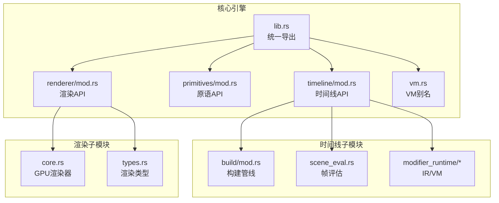
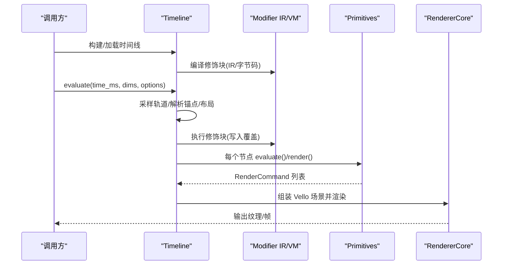
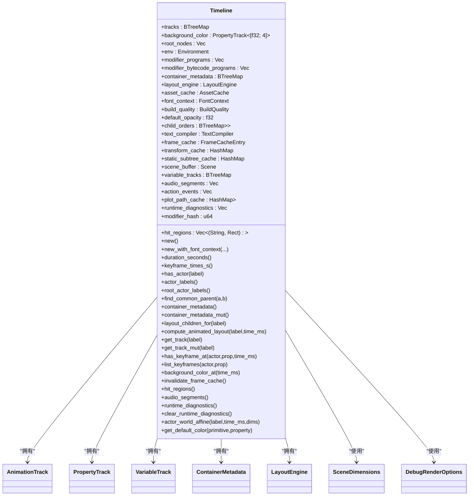
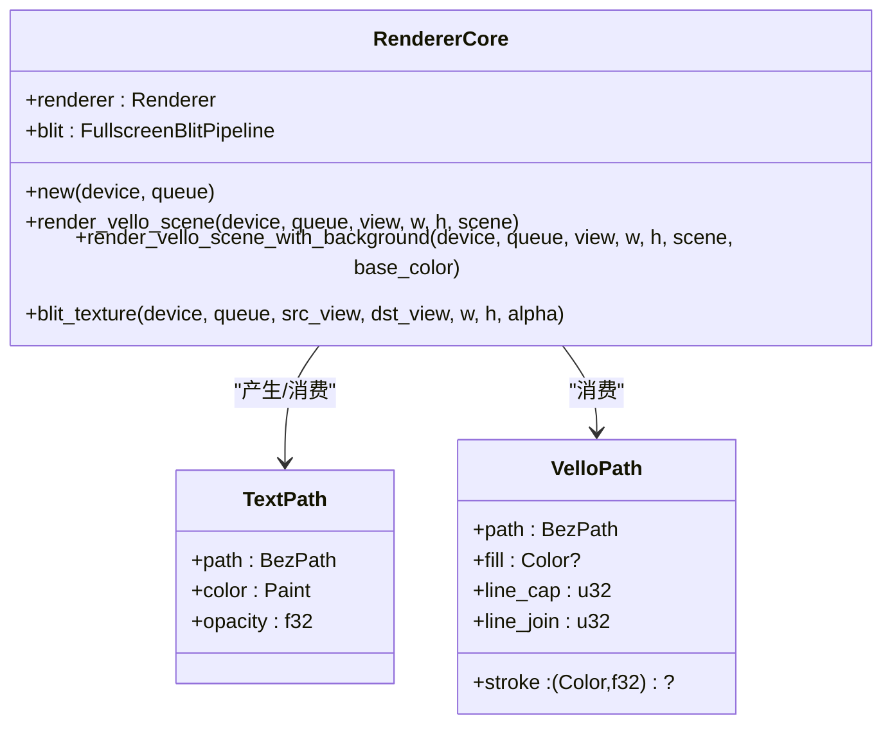
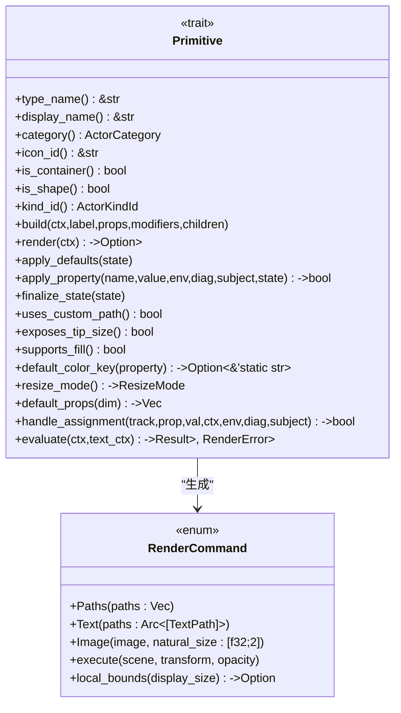
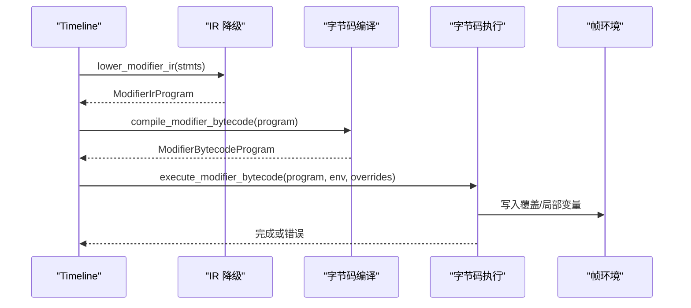
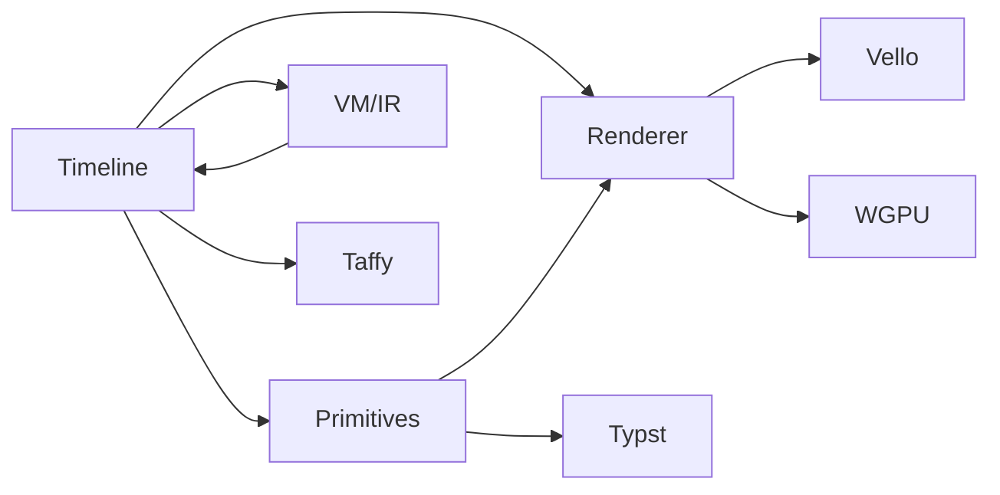

# 核心引擎 API

<cite>
**本文引用的文件**
- [lib.rs](file://crates/animatix/src/lib.rs)
- [timeline/mod.rs](file://crates/animatix/src/timeline/mod.rs)
- [primitives/mod.rs](file://crates/animatix/src/primitives/mod.rs)
- [renderer/mod.rs](file://crates/animatix/src/renderer/mod.rs)
- [renderer/core.rs](file://crates/animatix/src/renderer/core.rs)
- [renderer/types.rs](file://crates/animatix/src/renderer/types.rs)
- [vm.rs](file://crates/animatix/src/vm.rs)
- [modifier_runtime/vm.rs](file://crates/animatix/src/timeline/modifier_runtime/vm.rs)
- [modifier_runtime/ir/mod.rs](file://crates/animatix/src/timeline/modifier_runtime/ir/mod.rs)
- [modifier_runtime/ir/types.rs](file://crates/animatix/src/timeline/modifier_runtime/ir/types.rs)
- [modifier_runtime/ir/eval.rs](file://crates/animatix/src/timeline/modifier_runtime/ir/eval.rs)
- [modifier_runtime/ir/lower.rs](file://crates/animatix/src/timeline/modifier_runtime/ir/lower.rs)
- [timeline/build/mod.rs](file://crates/animatix/src/timeline/build/mod.rs)
- [timeline/scene_eval.rs](file://crates/animatix/src/timeline/scene_eval.rs)
</cite>

## 目录
1. [简介](#简介)
2. [项目结构](#项目结构)
3. [核心组件](#核心组件)
4. [架构总览](#架构总览)
5. [详细组件分析](#详细组件分析)
6. [依赖关系分析](#依赖关系分析)
7. [性能考量](#性能考量)
8. [故障排查指南](#故障排查指南)
9. [结论](#结论)

## 简介
本文件面向 Animatix 核心引擎的四大 API：Timeline（时间线）、Renderer（渲染器）、Primitive（原语系统）、VM（字节码执行与中间表示）。文档覆盖各模块的公共接口、数据结构、调用流程、错误处理与性能优化建议，帮助开发者在不深入源码细节的前提下高效使用与扩展引擎。

## 项目结构
Animatix 将核心能力按领域拆分为独立模块，通过统一入口导出：
- 时间线引擎：负责场景图构建、属性轨道管理、帧评估与渲染场景装配
- 渲染器：基于 Vello/WGPU 的 GPU 渲染、离屏输出、过渡合成与导出
- 原语系统：统一的形状、文本、媒体、图表与容器等可视元素的注册与执行
- 虚拟机与中间表示：修饰块（always）的 IR 降级、字节码编译与执行

**图表来源**
- [lib.rs:1-24](file://crates/animatix/src/lib.rs#L1-L24)
- [timeline/mod.rs:1-1093](file://crates/animatix/src/timeline/mod.rs#L1-L1093)
- [primitives/mod.rs:1-727](file://crates/animatix/src/primitives/mod.rs#L1-L727)
- [renderer/mod.rs:1-57](file://crates/animatix/src/renderer/mod.rs#L1-L57)
- [renderer/core.rs:1-183](file://crates/animatix/src/renderer/core.rs#L1-L183)
- [renderer/types.rs:1-41](file://crates/animatix/src/renderer/types.rs#L1-L41)
- [vm.rs:1-2](file://crates/animatix/src/vm.rs#L1-L2)
- [timeline/build/mod.rs:1-55](file://crates/animatix/src/timeline/build/mod.rs#L1-L55)
- [timeline/scene_eval.rs:1-200](file://crates/animatix/src/timeline/scene_eval.rs#L1-L200)

**章节来源**
- [lib.rs:1-24](file://crates/animatix/src/lib.rs#L1-L24)
- [timeline/mod.rs:1-1093](file://crates/animatix/src/timeline/mod.rs#L1-L1093)
- [primitives/mod.rs:1-727](file://crates/animatix/src/primitives/mod.rs#L1-L727)
- [renderer/mod.rs:1-57](file://crates/animatix/src/renderer/mod.rs#L1-L57)
- [renderer/core.rs:1-183](file://crates/animatix/src/renderer/core.rs#L1-L183)
- [renderer/types.rs:1-41](file://crates/animatix/src/renderer/types.rs#L1-L41)
- [vm.rs:1-2](file://crates/animatix/src/vm.rs#L1-L2)
- [timeline/build/mod.rs:1-55](file://crates/animatix/src/timeline/build/mod.rs#L1-L55)
- [timeline/scene_eval.rs:1-200](file://crates/animatix/src/timeline/scene_eval.rs#L1-L200)

## 核心组件
- Timeline（时间线）
  - 职责：场景图、属性轨道、布局、颜色方案、路径插值、修饰块执行、帧缓存与命中区域
  - 关键类型：Timeline、AnimationTrack、PropertyTrack、VariableTrack、ContainerMetadata、LayoutEngine、SceneDimensions、DebugRenderOptions
  - 公共方法：构建、时长查询、关键帧收集、根节点与容器元数据访问、布局计算、世界变换求解、音频片段收集、诊断读取与清理
- Renderer（渲染器）
  - 职责：GPU 渲染、离屏输出、零拷贝纹理合成、过渡合成、视频/GIF 导出
  - 关键类型：RendererCore、TextPath、VelloPath、OffscreenRenderer、RenderedFrame、ExportSettings
  - 公共方法：渲染到纹理、零拷贝 blit、导出图片/视频/GIF
- Primitive（原语系统）
  - 职责：统一的可视元素注册与执行，支持构建期与帧评估期的差异化逻辑
  - 关键类型：Primitive trait、BuildCtx、RenderCtx、EvaluateCtx、TextCompileCtx、RenderCommand
  - 公共方法：构建、渲染、评估、默认属性、尺寸调整模式、查找与注册表
- VM（字节码执行与中间表示）
  - 职责：修饰块（always）的 IR 降级、字节码编译与执行、环境变量与覆盖写入
  - 关键类型：ModifierIrProgram、ModifierBytecodeProgram、Instruction、BuiltinFn、CompiledExpr、ModifierOverrides
  - 公共方法：IR 降级、字节码编译、字节码执行、表达式求值

**章节来源**
- [timeline/mod.rs:431-1093](file://crates/animatix/src/timeline/mod.rs#L431-L1093)
- [renderer/mod.rs:1-57](file://crates/animatix/src/renderer/mod.rs#L1-L57)
- [renderer/core.rs:1-183](file://crates/animatix/src/renderer/core.rs#L1-L183)
- [renderer/types.rs:1-41](file://crates/animatix/src/renderer/types.rs#L1-L41)
- [primitives/mod.rs:195-727](file://crates/animatix/src/primitives/mod.rs#L195-L727)
- [vm.rs:1-2](file://crates/animatix/src/vm.rs#L1-L2)
- [modifier_runtime/vm.rs:1-536](file://crates/animatix/src/timeline/modifier_runtime/vm.rs#L1-L536)
- [modifier_runtime/ir/mod.rs:1-10](file://crates/animatix/src/timeline/modifier_runtime/ir/mod.rs#L1-L10)
- [modifier_runtime/ir/types.rs:1-144](file://crates/animatix/src/timeline/modifier_runtime/ir/types.rs#L1-L144)
- [modifier_runtime/ir/eval.rs:1-800](file://crates/animatix/src/timeline/modifier_runtime/ir/eval.rs#L1-L800)
- [modifier_runtime/ir/lower.rs:1-199](file://crates/animatix/src/timeline/modifier_runtime/ir/lower.rs#L1-L199)

## 架构总览
时间线引擎以 Timeline 为中心，贯穿构建期（AST 降级为 Timeline）与帧评估期（采样轨道、执行修饰块、生成 Vello 场景）。渲染器接收 Vello 场景进行 GPU 输出；原语系统提供可扩展的可视化元素；VM/IR 负责修饰块的高性能执行。

**图表来源**
- [timeline/mod.rs:554-1093](file://crates/animatix/src/timeline/mod.rs#L554-L1093)
- [timeline/scene_eval.rs:68-200](file://crates/animatix/src/timeline/scene_eval.rs#L68-L200)
- [primitives/mod.rs:550-568](file://crates/animatix/src/primitives/mod.rs#L550-L568)
- [renderer/core.rs:53-90](file://crates/animatix/src/renderer/core.rs#L53-L90)
- [modifier_runtime/vm.rs:99-111](file://crates/animatix/src/timeline/modifier_runtime/vm.rs#L99-L111)

## 详细组件分析

### Timeline API（时间线）
- 公共接口概览
  - 构造与初始化
    - new() / new_with_font_context()：创建空时间线并注入字体上下文
  - 时长与关键帧
    - duration_seconds()：基于所有轨道与子序轨道的最大关键帧时间推导
    - keyframe_times_s()：汇总所有轨道的关键帧时间（秒）
    - collect_all_keyframe_times()：按属性注册表聚合某动画轨道的所有关键帧时间
  - 场景图与容器
    - has_actor()/actor_labels()/root_actor_labels()
    - find_common_parent()：查找两个子节点的共同父容器
    - container_metadata()/container_metadata_mut()：容器元数据读写
    - layout_children_for()/compute_animated_layout()：动态布局计算
  - 属性与轨道
    - get_track()/get_track_mut()：按标签访问轨道
    - has_keyframe_at()/list_keyframes()：查询属性关键帧
    - background_color_at()：背景色采样
  - 变量与诊断
    - variable_tracks：作用域内 let 变量（帧内常量函数）
    - runtime_diagnostics()/clear_runtime_diagnostics()：运行时诊断
  - 性能与缓存
    - invalidate_frame_cache()：失效帧缓存、静态子树缓存与变换缓存
    - hit_regions()：上一帧命中区域（用于点击选择等）
  - 其他
    - audio_segments()：导出时混音的音频段
    - actor_world_affine()：计算任意节点的世界仿射变换链
    - get_default_color()/colorscheme_name()：默认色板查询

- 数据结构要点
  - Timeline：持有 tracks、background_color、root_nodes、env、modifiers、modifier_programs、modifier_bytecode_programs、container_metadata、layout_engine、asset_cache、font_context、build_quality、default_opacity、child_orders、text_compiler、frame_cache、transform_cache、static_subtree_cache、scene_buffer、hit_regions、variable_tracks、audio_segments、action_events、plot_path_cache、runtime_diagnostics、modifier_hash
  - AnimationTrack/PropertyTrack/VariableTrack：属性轨道与变量轨道
  - ContainerMetadata/LayoutEngine：容器布局配置与缓存
  - SceneDimensions/DebugRenderOptions：场景尺寸与调试选项

- 使用示例（路径）
  - 创建时间线并设置字体上下文：[timeline/mod.rs:556-598](file://crates/animatix/src/timeline/mod.rs#L556-L598)
  - 计算时长与关键帧：[timeline/mod.rs:600-677](file://crates/animatix/src/timeline/mod.rs#L600-L677)
  - 动态布局计算：[timeline/mod.rs:780-849](file://crates/animatix/src/timeline/mod.rs#L780-L849)
  - 世界变换链求解：[timeline/mod.rs:995-1057](file://crates/animatix/src/timeline/mod.rs#L995-L1057)

- 错误处理与边界
  - 无显式 Result 返回的查询接口（如 has_actor、duration_seconds）按“不存在即空”策略返回默认值
  - 命中区域与诊断需在 evaluate 前后配合使用，避免脏读

**章节来源**
- [timeline/mod.rs:431-1093](file://crates/animatix/src/timeline/mod.rs#L431-L1093)

#### 类图（Timeline 核心类型）

**图表来源**
- [timeline/mod.rs:431-1093](file://crates/animatix/src/timeline/mod.rs#L431-L1093)

### Renderer API（渲染器）
- 公共接口概览
  - GPU 渲染器
    - RendererCore::new()：创建基于 WGPU 的 Vello 渲染器与零拷贝 blit 管线
    - render_vello_scene()/render_vello_scene_with_background()：将 Vello 场景渲染到指定纹理视图
    - blit_texture()：零读回纹理合成（用于滤镜后子场景回写）
  - 离屏与导出
    - OffscreenRenderer/RenderedFrame：CPU 可读帧输出
    - 视频/GIF 导出：render_video_* / render_gif_* 系列函数，支持进度回调与自定义设置
  - 渲染类型
    - TextPath/VelloPath：文本与矢量路径的渲染单元

- 使用示例（路径）
  - 初始化 GPU 渲染器：[renderer/core.rs:14-90](file://crates/animatix/src/renderer/core.rs#L14-L90)
  - 渲染到纹理：[renderer/core.rs:53-90](file://crates/animatix/src/renderer/core.rs#L53-L90)
  - 导出图片/视频/GIF：[renderer/mod.rs:40-54](file://crates/animatix/src/renderer/mod.rs#L40-L54)

- 错误处理与边界
  - 渲染器初始化失败会返回 RenderError；GPU 不可用时测试可跳过
  - 零拷贝 blit 要求源/目标视图为 RGBA8Unorm

**章节来源**
- [renderer/mod.rs:1-57](file://crates/animatix/src/renderer/mod.rs#L1-L57)
- [renderer/core.rs:1-183](file://crates/animatix/src/renderer/core.rs#L1-L183)
- [renderer/types.rs:1-41](file://crates/animatix/src/renderer/types.rs#L1-L41)

#### 类图（Renderer 核心类型）

**图表来源**
- [renderer/core.rs:6-90](file://crates/animatix/src/renderer/core.rs#L6-L90)
- [renderer/types.rs:4-41](file://crates/animatix/src/renderer/types.rs#L4-L41)

### Primitive API（原语系统）
- 公共接口概览
  - 原语 trait：Primitive
    - 类型元信息：type_name/display_name/category/icon_id/is_container/is_shape/kind_id
    - 构建期：build(ctx,label,props,modifiers,children)
    - 渲染期（可选）：render(ctx)->Option<Vec<VelloPath>>
    - 形状状态（可选）：apply_defaults/finalize_state/uses_custom_path/exposes_tip_size/supports_fill
    - 默认色键：default_color_key(property)->Option<&'static str>
    - 尺寸调整模式：resize_mode()->ResizeMode
    - GUI 默认属性：default_props(scene_dimensions)->Vec<Property>
    - 分配阶段处理：handle_assignment(track,property,value,ctx,env,diag,subject)->bool
    - 帧评估期：evaluate(ctx,text_ctx)->Result<Option<Vec<RenderCommand>>, RenderError>
  - 上下文与命令
    - BuildCtx/RenderCtx/EvaluateCtx/TextCompileCtx
    - RenderCommand：Paths/Text/Image，支持执行到 Vello 场景与本地包围盒计算

- 注册与发现
  - PRIMITIVES 静态数组：集中注册所有原语
  - actor_kind_registry()/actor_kind_meta()/actor_kind_meta_by_name()：自动构建的元数据注册表
  - find_primitive(type_name): Option<&dyn Primitive>

- 使用示例（路径）
  - 原语 trait 定义与默认行为：[primitives/mod.rs:416-568](file://crates/animatix/src/primitives/mod.rs#L416-L568)
  - 帧评估命令执行到场景：[primitives/mod.rs:293-414](file://crates/animatix/src/primitives/mod.rs#L293-L414)
  - 文本路径采样与样式采样：[primitives/mod.rs:50-100](file://crates/animatix/src/primitives/mod.rs#L50-L100)

- 错误处理与边界
  - evaluate 返回 RenderError；RenderCommand::execute 内部对不同命令分支进行安全绘制
  - 样式采样支持增量覆盖（overrides）

**章节来源**
- [primitives/mod.rs:1-727](file://crates/animatix/src/primitives/mod.rs#L1-L727)

#### 类图（Primitive 与命令）

**图表来源**
- [primitives/mod.rs:195-414](file://crates/animatix/src/primitives/mod.rs#L195-L414)

### VM API（字节码执行与中间表示）
- 公共接口概览
  - IR 降级
    - lower_modifier_ir()/lower_modifier_block()/lower_modifier_body()：从 AST 降级为 ModifierIrProgram
    - compile_modifier_expr()/compile_expr()：表达式编译（支持的表达式进入 IR，否则标记为不支持）
  - 字节码编译
    - compile_modifier_bytecode(program)->Result<ModifierBytecodeProgram, VmCompileError>
  - 字节码执行
    - execute_modifier_bytecode(program, frame_env, overrides)->Result<(), EvalError>
  - 表达式求值（IR）
    - evaluate_modifier_expr()/evaluate_compiled_expr()：支持常量、环境读取、向量构造、一元/二元运算、条件选择、内置函数、索引、方法调用
  - 运行时指令
    - LoadConst/LoadEnv/StoreEnv/MakVec/UnaryNeg/UnaryNot/Binary/CallBuiltin/Index/CallMethod/JumpIfFalse/Jump/BeginFor/CheckFor/WriteOverride/Halt

- 使用示例（路径）
  - IR 降级与编译：[modifier_runtime/ir/lower.rs:8-199](file://crates/animatix/src/timeline/modifier_runtime/ir/lower.rs#L8-L199)
  - 字节码编译与执行：[modifier_runtime/vm.rs:84-111](file://crates/animatix/src/timeline/modifier_runtime/vm.rs#L84-L111)
  - 表达式求值与方法调用：[modifier_runtime/ir/eval.rs:9-800](file://crates/animatix/src/timeline/modifier_runtime/ir/eval.rs#L9-L800)

- 错误处理与边界
  - 不支持的表达式/语句会返回 IrLowerError 或 VmCompileError
  - VM 执行过程中检查栈下溢、索引越界、循环上限（100k 次）等

**章节来源**
- [modifier_runtime/ir/mod.rs:1-10](file://crates/animatix/src/timeline/modifier_runtime/ir/mod.rs#L1-L10)
- [modifier_runtime/ir/types.rs:1-144](file://crates/animatix/src/timeline/modifier_runtime/ir/types.rs#L1-L144)
- [modifier_runtime/ir/eval.rs:1-800](file://crates/animatix/src/timeline/modifier_runtime/ir/eval.rs#L1-L800)
- [modifier_runtime/ir/lower.rs:1-199](file://crates/animatix/src/timeline/modifier_runtime/ir/lower.rs#L1-L199)
- [modifier_runtime/vm.rs:1-536](file://crates/animatix/src/timeline/modifier_runtime/vm.rs#L1-L536)

#### 序列图（修饰块执行流程）

**图表来源**
- [modifier_runtime/ir/lower.rs:8-199](file://crates/animatix/src/timeline/modifier_runtime/ir/lower.rs#L8-L199)
- [modifier_runtime/vm.rs:84-111](file://crates/animatix/src/timeline/modifier_runtime/vm.rs#L84-L111)

## 依赖关系分析
- 模块耦合
  - Timeline 依赖：primitives（原语执行）、renderer（渲染类型）、modifier_runtime（修饰块执行）、assets（资源缓存）、taffy（布局）
  - Renderer 依赖：vello、wgpu、fullscreen_blit（零拷贝合成）
  - VM/IR 依赖：ast（表达式/语句）、timeline::Environment（执行环境）
- 外部集成点
  - Vello/WGPU：GPU 渲染与纹理管理
  - Taffy：容器布局（Row/Col/Grid/Stack）
  - Typst：文本/数学排版（Text/Code/TYPST）

**图表来源**
- [timeline/mod.rs:1-1093](file://crates/animatix/src/timeline/mod.rs#L1-L1093)
- [renderer/core.rs:1-183](file://crates/animatix/src/renderer/core.rs#L1-L183)
- [primitives/mod.rs:1-727](file://crates/animatix/src/primitives/mod.rs#L1-L727)
- [modifier_runtime/vm.rs:1-536](file://crates/animatix/src/timeline/modifier_runtime/vm.rs#L1-L536)

**章节来源**
- [timeline/mod.rs:1-1093](file://crates/animatix/src/timeline/mod.rs#L1-L1093)
- [renderer/core.rs:1-183](file://crates/animatix/src/renderer/core.rs#L1-L183)
- [primitives/mod.rs:1-727](file://crates/animatix/src/primitives/mod.rs#L1-L727)
- [modifier_runtime/vm.rs:1-536](file://crates/animatix/src/timeline/modifier_runtime/vm.rs#L1-L536)

## 性能考量
- 帧缓存与静态子树缓存
  - Timeline::invalidate_frame_cache()：在轨道变更后失效缓存，避免陈旧结果
  - is_static_subtree()：当无修饰块且无过程式绘图时，可缓存完全静态子树的场景片段
- 变换缓存与布局缓存
  - transform_cache：按时间与父变换系数缓存节点变换，减少重复计算
  - LayoutEngine::cache：按容器子序字符串缓存布局结果，避免重复 Taffy 计算
- 文本与路径重用
  - text_compiler 与 plot_path_cache：文本与过程式绘图路径的运行时重编译与缓存
- 渲染参数
  - RendererCore::render_vello_scene_with_background：可设置背景色与抗锯齿策略
- 导出与预览质量
  - BuildQuality：Draft/Preview/Production 影响采样精度与性能平衡

[本节为通用指导，无需特定文件引用]

## 故障排查指南
- 渲染器初始化失败
  - 现象：RendererCore::new 报错
  - 排查：确认 WGPU 设备可用性；在无 GPU 环境下测试可跳过
  - 参考：[renderer/core.rs:14-31](file://crates/animatix/src/renderer/core.rs#L14-L31)
- VM 执行异常
  - 现象：栈下溢、索引越界、无限循环保护
  - 排查：检查 IR/字节码生成是否完整；for 循环迭代次数上限为 100k
  - 参考：[modifier_runtime/vm.rs:496-501](file://crates/animatix/src/timeline/modifier_runtime/vm.rs#L496-L501)
- 修饰块不生效
  - 现象：always 中赋值未反映到属性
  - 排查：确认修饰块已编译为 IR/字节码；检查 WriteOverride 是否正确写入覆盖
  - 参考：[modifier_runtime/vm.rs:479-489](file://crates/animatix/src/timeline/modifier_runtime/vm.rs#L479-L489)
- 布局错乱
  - 现象：容器子序动画导致位置跳跃
  - 排查：检查 child_orders 轨道与插值；确认 compute_animated_layout 正常
  - 参考：[timeline/mod.rs:780-849](file://crates/animatix/src/timeline/mod.rs#L780-L849)
- 文本渲染问题
  - 现象：文本内容/字体/字号未更新
  - 排查：确认 evaluate_text_paths 已触发 text_compiler 重新编译
  - 参考：[primitives/mod.rs:50-100](file://crates/animatix/src/primitives/mod.rs#L50-L100)

**章节来源**
- [renderer/core.rs:14-31](file://crates/animatix/src/renderer/core.rs#L14-L31)
- [modifier_runtime/vm.rs:496-501](file://crates/animatix/src/timeline/modifier_runtime/vm.rs#L496-L501)
- [timeline/mod.rs:780-849](file://crates/animatix/src/timeline/mod.rs#L780-L849)
- [primitives/mod.rs:50-100](file://crates/animatix/src/primitives/mod.rs#L50-L100)

## 结论
本文档系统梳理了 Animatix 核心引擎的四大 API：Timeline、Renderer、Primitive、VM/IR。通过明确的接口职责、数据结构与调用流程，开发者可以快速定位功能、编写高质量扩展，并在性能与稳定性之间取得良好平衡。建议在实际开发中结合缓存策略、质量等级与诊断接口，持续优化构建与渲染体验。