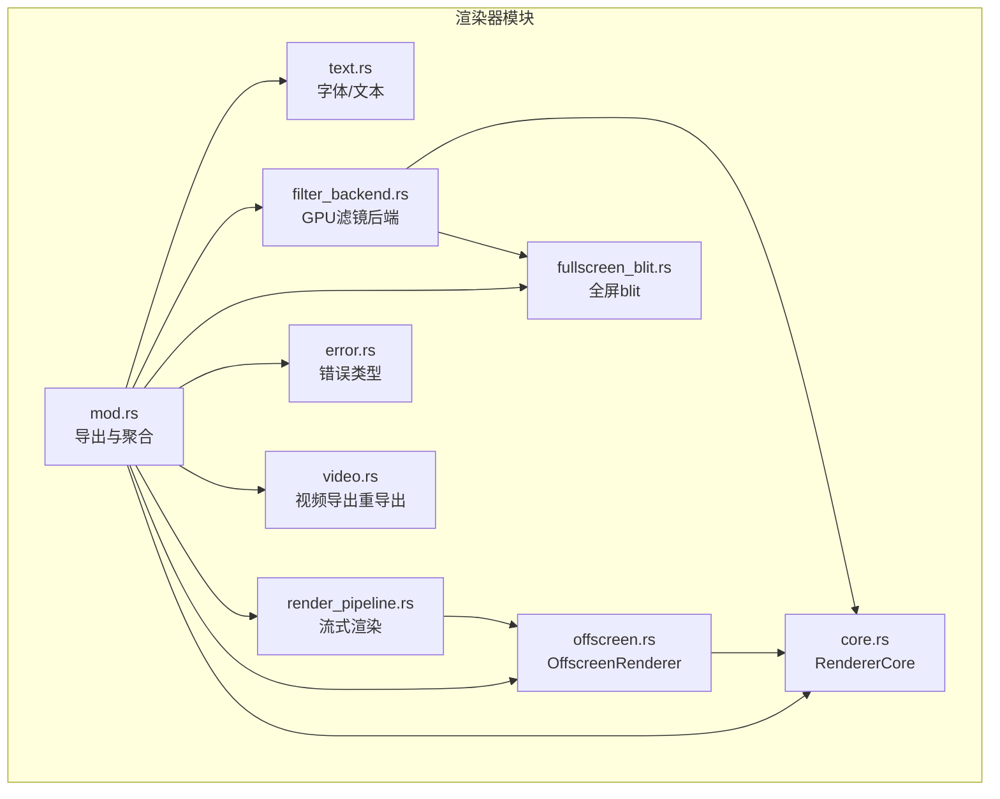
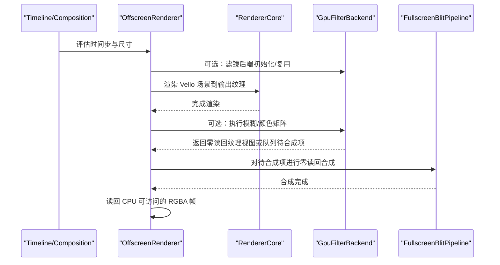
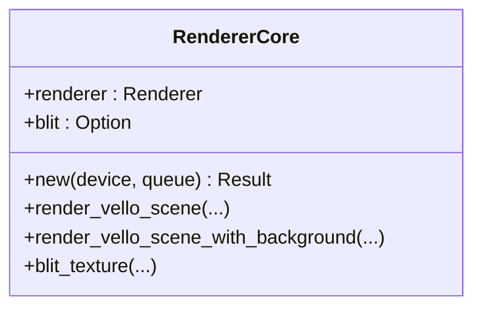
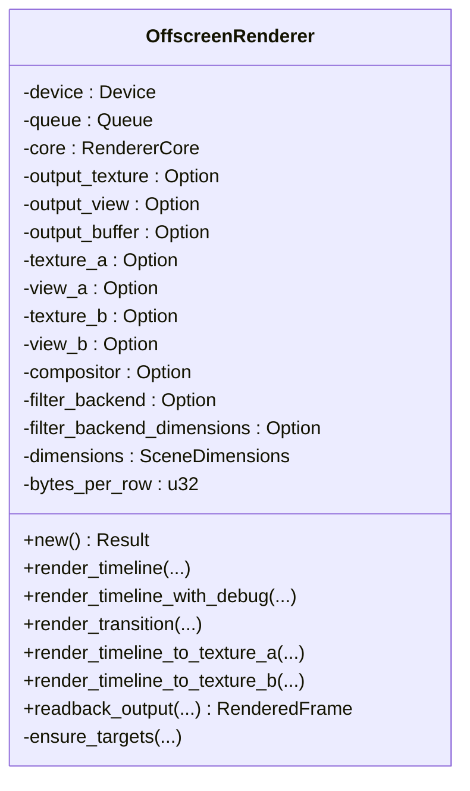
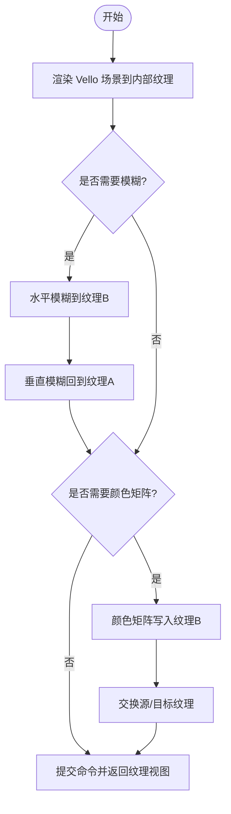
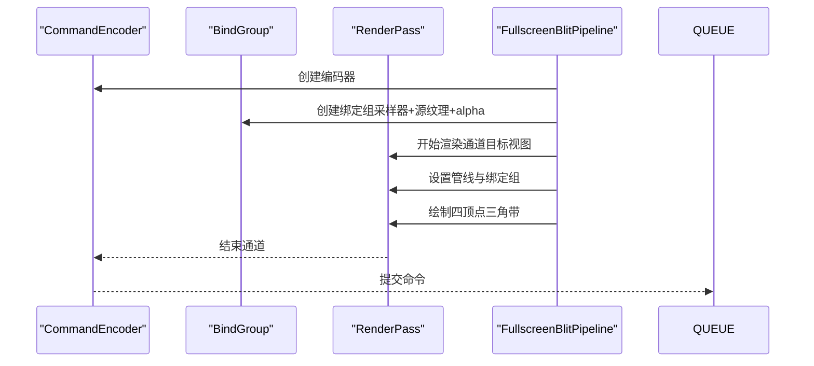
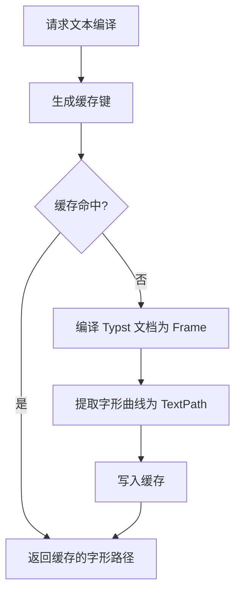
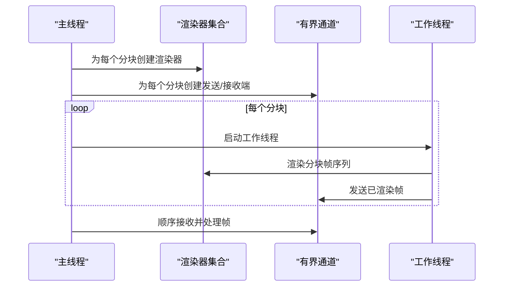
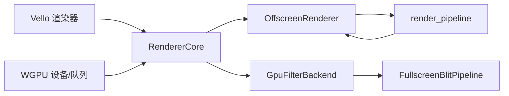

# 渲染器 API

<cite>
**本文档引用的文件**
- [crates/animatix/src/renderer/mod.rs](file://crates/animatix/src/renderer/mod.rs)
- [crates/animatix/src/renderer/core.rs](file://crates/animatix/src/renderer/core.rs)
- [crates/animatix/src/renderer/types.rs](file://crates/animatix/src/renderer/types.rs)
- [crates/animatix/src/renderer/text.rs](file://crates/animatix/src/renderer/text.rs)
- [crates/animatix/src/renderer/offscreen.rs](file://crates/animatix/src/renderer/offscreen.rs)
- [crates/animatix/src/renderer/filter_backend.rs](file://crates/animatix/src/renderer/filter_backend.rs)
- [crates/animatix/src/renderer/fullscreen_blit.rs](file://crates/animatix/src/renderer/fullscreen_blit.rs)
- [crates/animatix/src/renderer/render_pipeline.rs](file://crates/animatix/src/renderer/render_pipeline.rs)
- [crates/animatix/src/renderer/error.rs](file://crates/animatix/src/renderer/error.rs)
- [crates/animatix/src/renderer/video.rs](file://crates/animatix/src/renderer/video.rs)
</cite>

## 目录
1. [简介](#简介)
2. [项目结构](#项目结构)
3. [核心组件](#核心组件)
4. [架构总览](#架构总览)
5. [详细组件分析](#详细组件分析)
6. [依赖关系分析](#依赖关系分析)
7. [性能考量](#性能考量)
8. [故障排查指南](#故障排查指南)
9. [结论](#结论)
10. [附录](#附录)

## 简介
本文件系统性梳理 Animatix 中基于 Vello 的渲染器 API，覆盖以下方面：
- 渲染上下文与画布管理：离屏渲染器、输出缓冲、中间纹理与读回路径
- 渲染命令生成：Vello 场景到纹理的渲染流程
- GPU 渲染管线接口：着色器管理（顶点/片段/计算）、纹理处理、渲染状态控制
- 文本渲染接口：字体加载、文本布局与字符路径提取
- 滤镜效果接口：GPU 滤镜（模糊、颜色矩阵）与零读回合成
- 渲染配置选项、性能参数与使用示例

## 项目结构
渲染器模块位于 crates/animatix/src/renderer，采用按功能分层组织：
- 核心封装：RendererCore 封装 Vello 渲染器与全屏纹理 blit
- 离屏渲染：OffscreenRenderer 负责设备初始化、目标纹理与读回
- 文本支持：FontContext、TypstWorld、TextCompiler 提供字体与文本编译
- 滤镜后端：GpuFilterBackend 提供 GPU 滤镜管线与零读回合成
- 全屏 blit：FullscreenBlitPipeline 提供零 CPU 读回的纹理合成
- 流式渲染：render_pipeline 提供多线程并行帧渲染与顺序输出
- 错误类型：统一的 RenderError 与导出错误类型

**图表来源**
- [crates/animatix/src/renderer/mod.rs:1-57](file://crates/animatix/src/renderer/mod.rs#L1-L57)
- [crates/animatix/src/renderer/core.rs:1-183](file://crates/animatix/src/renderer/core.rs#L1-L183)
- [crates/animatix/src/renderer/offscreen.rs:1-529](file://crates/animatix/src/renderer/offscreen.rs#L1-L529)
- [crates/animatix/src/renderer/text.rs:1-622](file://crates/animatix/src/renderer/text.rs#L1-L622)
- [crates/animatix/src/renderer/filter_backend.rs:1-982](file://crates/animatix/src/renderer/filter_backend.rs#L1-L982)
- [crates/animatix/src/renderer/fullscreen_blit.rs:1-232](file://crates/animatix/src/renderer/fullscreen_blit.rs#L1-L232)
- [crates/animatix/src/renderer/render_pipeline.rs:1-301](file://crates/animatix/src/renderer/render_pipeline.rs#L1-L301)
- [crates/animatix/src/renderer/error.rs:1-29](file://crates/animatix/src/renderer/error.rs#L1-L29)
- [crates/animatix/src/renderer/video.rs:1-24](file://crates/animatix/src/renderer/video.rs#L1-L24)

**章节来源**
- [crates/animatix/src/renderer/mod.rs:1-57](file://crates/animatix/src/renderer/mod.rs#L1-L57)

## 核心组件
- RendererCore：封装 Vello 渲染器实例与全屏 blit 管线，负责场景到纹理的渲染与零读回合成
- OffscreenRenderer：设备与队列持有者，管理输出纹理、中间 ping-pong 纹理、读回缓冲，提供单帧渲染与过渡合成
- GpuFilterBackend：独立的 GPU 滤镜后端，包含模糊与颜色矩阵计算管线，支持零读回合成
- FullscreenBlitPipeline：全屏四边形 blit 管线，用于零 CPU 读回的纹理合成
- Text 支持：FontContext、TypstWorld、TextCompiler 提供字体数据库、文本编译与缓存
- 流式渲染：render_pipeline 提供多线程并行渲染与顺序输出，支持 Composition 与 Timeline

**章节来源**
- [crates/animatix/src/renderer/core.rs:6-90](file://crates/animatix/src/renderer/core.rs#L6-L90)
- [crates/animatix/src/renderer/offscreen.rs:18-447](file://crates/animatix/src/renderer/offscreen.rs#L18-L447)
- [crates/animatix/src/renderer/filter_backend.rs:134-746](file://crates/animatix/src/renderer/filter_backend.rs#L134-L746)
- [crates/animatix/src/renderer/fullscreen_blit.rs:41-231](file://crates/animatix/src/renderer/fullscreen_blit.rs#L41-L231)
- [crates/animatix/src/renderer/text.rs:17-174](file://crates/animatix/src/renderer/text.rs#L17-L174)
- [crates/animatix/src/renderer/render_pipeline.rs:38-137](file://crates/animatix/src/renderer/render_pipeline.rs#L38-L137)

## 架构总览
下图展示渲染器在不同阶段的交互：时间线求值、场景构建、Vello 渲染、滤镜后端处理与最终合成。

**图表来源**
- [crates/animatix/src/renderer/offscreen.rs:106-167](file://crates/animatix/src/renderer/offscreen.rs#L106-L167)
- [crates/animatix/src/renderer/filter_backend.rs:619-746](file://crates/animatix/src/renderer/filter_backend.rs#L619-L746)
- [crates/animatix/src/renderer/fullscreen_blit.rs:155-231](file://crates/animatix/src/renderer/fullscreen_blit.rs#L155-L231)

## 详细组件分析

### RendererCore 组件分析
- 职责：封装 Vello 渲染器与全屏 blit 管线；提供场景到纹理的渲染与零读回合成
- 关键方法：
  - 新建：初始化 Vello 渲染器与 blit 管线
  - 渲染：以指定背景色渲染 Vello 场景到纹理
  - blit：零读回将源纹理合成到目标纹理
- 性能要点：避免 CPU 读回，直接在 GPU 内部合成

**图表来源**
- [crates/animatix/src/renderer/core.rs:6-90](file://crates/animatix/src/renderer/core.rs#L6-L90)

**章节来源**
- [crates/animatix/src/renderer/core.rs:14-90](file://crates/animatix/src/renderer/core.rs#L14-L90)

### OffscreenRenderer 组件分析
- 职责：设备与队列持有者；管理输出纹理、中间 ping-pong 纹理与读回缓冲；提供单帧渲染、过渡合成与读回
- 关键方法：
  - 初始化：自动选择适配器并创建设备/队列
  - 单帧渲染：评估时间线，渲染到输出纹理，必要时执行滤镜后端零读回合成，最后读回 CPU 帧
  - 过渡合成：渲染两个时间线到纹理 A/B，使用合成器混合输出
  - 纹理渲染：分别渲染到纹理 A/B 以便后续合成
  - 读回：将输出纹理拷贝到缓冲区并映射为 CPU 可访问的 RGBA 数据
- 性能要点：确保目标尺寸一致时复用滤镜后端；使用对齐的 bytes_per_row 减少拷贝成本

**图表来源**
- [crates/animatix/src/renderer/offscreen.rs:18-447](file://crates/animatix/src/renderer/offscreen.rs#L18-L447)

**章节来源**
- [crates/animatix/src/renderer/offscreen.rs:39-447](file://crates/animatix/src/renderer/offscreen.rs#L39-L447)

### GpuFilterBackend 组件分析
- 职责：独立的 GPU 滤镜后端，拥有自己的渲染目标与计算管线；支持零读回合成
- 计算管线：
  - 模糊：水平/垂直两次高斯模糊，使用 WGSL 计算着色器
  - 颜色矩阵：亮度、对比度、饱和度、色相旋转、褐色化等组合矩阵
- 关键方法：
  - 初始化：创建渲染纹理、ping-pong 纹理、读回缓冲、计算管线与绑定布局
  - 渲染与滤镜：将 Vello 场景渲染到内部纹理，按需执行模糊与颜色矩阵，返回最终纹理视图
  - 零读回合成：复制最近滤镜结果到专用纹理，供后续合成使用
- 性能要点：使用 ping-pong 纹理减少中间拷贝；仅在需要时执行滤镜；通过 blit 在 GPU 内部合成

**图表来源**
- [crates/animatix/src/renderer/filter_backend.rs:619-746](file://crates/animatix/src/renderer/filter_backend.rs#L619-L746)

**章节来源**
- [crates/animatix/src/renderer/filter_backend.rs:184-746](file://crates/animatix/src/renderer/filter_backend.rs#L184-L746)

### FullscreenBlitPipeline 组件分析
- 职责：全屏四边形 blit 管线，实现零 CPU 读回的纹理合成
- 着色器：顶点着色器输出裁剪空间坐标与纹理坐标；片段着色器采样源纹理并乘以 alpha
- 关键方法：
  - 初始化：创建采样器、绑定布局、管线布局与渲染管线
  - blit：将源纹理视图合成到目标纹理视图，支持外部编码器批量提交
- 性能要点：使用三角带拓扑与混合状态；预分配 alpha 均匀缓冲减少更新开销

**图表来源**
- [crates/animatix/src/renderer/fullscreen_blit.rs:155-231](file://crates/animatix/src/renderer/fullscreen_blit.rs#L155-L231)

**章节来源**
- [crates/animatix/src/renderer/fullscreen_blit.rs:53-231](file://crates/animatix/src/renderer/fullscreen_blit.rs#L53-L231)

### 文本渲染接口分析
- 字体加载：FontContext 持久化 fontdb 数据库，避免重复扫描；支持系统字体与内嵌字体
- 文本编译：TypstWorld 实现 World trait，支持 Typst 文本、数学、代码与普通文本编译
- 字形提取：从 Frame 中递归提取字形曲线，生成 TextPath；提供中心化与测量工具
- 编译缓存：TextCompiler 使用 LRU 风格缓存，按内容、字体族、字号、颜色与类型生成键

**图表来源**
- [crates/animatix/src/renderer/text.rs:542-621](file://crates/animatix/src/renderer/text.rs#L542-L621)

**章节来源**
- [crates/animatix/src/renderer/text.rs:17-174](file://crates/animatix/src/renderer/text.rs#L17-L174)
- [crates/animatix/src/renderer/text.rs:212-272](file://crates/animatix/src/renderer/text.rs#L212-L272)
- [crates/animatix/src/renderer/text.rs:358-417](file://crates/animatix/src/renderer/text.rs#L358-L417)
- [crates/animatix/src/renderer/text.rs:542-621](file://crates/animatix/src/renderer/text.rs#L542-L621)

### 流式渲染与导出接口分析
- 并行帧渲染：render_frames_streaming 与 render_frames_streaming_composition 提供多线程并行渲染，严格顺序输出
- 分块策略：按线程数与帧数计算分块大小，每个分块独立创建渲染器实例，避免并发枚举适配器问题
- 进度与取消：支持原子计数进度与取消信号
- Composition 支持：根据全局时间解析场景与本地时间，支持过渡混合（未来扩展）

**图表来源**
- [crates/animatix/src/renderer/render_pipeline.rs:38-137](file://crates/animatix/src/renderer/render_pipeline.rs#L38-L137)
- [crates/animatix/src/renderer/render_pipeline.rs:149-301](file://crates/animatix/src/renderer/render_pipeline.rs#L149-L301)

**章节来源**
- [crates/animatix/src/renderer/render_pipeline.rs:38-137](file://crates/animatix/src/renderer/render_pipeline.rs#L38-L137)
- [crates/animatix/src/renderer/render_pipeline.rs:149-301](file://crates/animatix/src/renderer/render_pipeline.rs#L149-L301)

## 依赖关系分析
- 外部依赖：Vello（渲染）、WGPU（GPU 通信）、Typst（文本/数学）、fontdb（字体数据库）、ttf-parser（轮廓提取）
- 内部耦合：
  - OffscreenRenderer 依赖 RendererCore、GpuFilterBackend 与 FullscreenBlitPipeline
  - GpuFilterBackend 自身持有 RendererCore 与独立管线
  - render_pipeline 依赖 OffscreenRenderer 与导出错误类型

**图表来源**
- [crates/animatix/src/renderer/core.rs:1-30](file://crates/animatix/src/renderer/core.rs#L1-L30)
- [crates/animatix/src/renderer/offscreen.rs:1-37](file://crates/animatix/src/renderer/offscreen.rs#L1-L37)
- [crates/animatix/src/renderer/filter_backend.rs:1-20](file://crates/animatix/src/renderer/filter_backend.rs#L1-L20)
- [crates/animatix/src/renderer/fullscreen_blit.rs:1-15](file://crates/animatix/src/renderer/fullscreen_blit.rs#L1-L15)
- [crates/animatix/src/renderer/render_pipeline.rs:1-14](file://crates/animatix/src/renderer/render_pipeline.rs#L1-L14)

**章节来源**
- [crates/animatix/src/renderer/core.rs:1-30](file://crates/animatix/src/renderer/core.rs#L1-L30)
- [crates/animatix/src/renderer/offscreen.rs:1-37](file://crates/animatix/src/renderer/offscreen.rs#L1-L37)
- [crates/animatix/src/renderer/filter_backend.rs:1-20](file://crates/animatix/src/renderer/filter_backend.rs#L1-L20)
- [crates/animatix/src/renderer/fullscreen_blit.rs:1-15](file://crates/animatix/src/renderer/fullscreen_blit.rs#L1-L15)
- [crates/animatix/src/renderer/render_pipeline.rs:1-14](file://crates/animatix/src/renderer/render_pipeline.rs#L1-L14)

## 性能考量
- GPU 优先：尽量避免 CPU 读回，使用零读回合成（FullscreenBlitPipeline）与滤镜后端的内部纹理
- 内存对齐：读回缓冲使用对齐的 bytes_per_row，减少拷贝与内存浪费
- 并行渲染：render_pipeline 使用分块与有界通道，限制内存占用并提升吞吐
- 滤镜短路：当滤镜参数为单位值时跳过计算，直接返回渲染纹理视图
- 管线复用：OffscreenRenderer 与 GpuFilterBackend 在尺寸不变时复用目标与管线

[本节为通用性能建议，不直接分析具体文件]

## 故障排查指南
- 适配器/设备初始化失败：检查 GPU 是否可用、驱动是否正确安装
- 文本编译失败：确认字体族名称、颜色格式与 Typst 标记语法
- 渲染帧为空或黑屏：检查场景维度是否大于零、背景色设置与 Vello 场景构建
- 导出中断：检查取消信号与进度回调；确认线程安全与通道关闭
- 滤镜无效果：确认滤镜参数非单位值且尺寸匹配；检查绑定组与 uniform 更新

**章节来源**
- [crates/animatix/src/renderer/error.rs:1-29](file://crates/animatix/src/renderer/error.rs#L1-L29)
- [crates/animatix/src/renderer/offscreen.rs:113-115](file://crates/animatix/src/renderer/offscreen.rs#L113-L115)
- [crates/animatix/src/renderer/render_pipeline.rs:119-127](file://crates/animatix/src/renderer/render_pipeline.rs#L119-L127)

## 结论
该渲染器 API 以 Vello 为核心，结合 WGPU 的 GPU 能力，提供了从场景渲染、滤镜处理到零读回合成的完整链路。OffscreenRenderer 与 GpuFilterBackend 将 CPU 读回降至最低，配合流式渲染与缓存机制，满足高质量与高性能的导出需求。文本渲染通过 Typst 与字体数据库实现灵活的排版能力。

[本节为总结性内容，不直接分析具体文件]

## 附录

### 渲染配置选项与参数
- 渲染参数（RenderParams）：背景色、宽度、高度、抗锯齿方式
- 抗锯齿支持：启用 Area 抗锯齿
- 设备特性：默认使用 GPU，可按需调整管线缓存与线程数
- 文本编译参数：字体族、字号、颜色、文本类型（文本/数学/代码/Tex）
- 滤镜参数：模糊半径、方向（水平/垂直）、颜色矩阵（亮度、对比度、饱和度、色相旋转、褐色化）
- 导出参数：视频编码器、H264 预设、最大渲染线程数、进度与取消信号

**章节来源**
- [crates/animatix/src/renderer/core.rs:79-89](file://crates/animatix/src/renderer/core.rs#L79-L89)
- [crates/animatix/src/renderer/text.rs:275-356](file://crates/animatix/src/renderer/text.rs#L275-L356)
- [crates/animatix/src/renderer/filter_backend.rs:115-131](file://crates/animatix/src/renderer/filter_backend.rs#L115-L131)
- [crates/animatix/src/renderer/video.rs:10-23](file://crates/animatix/src/renderer/video.rs#L10-L23)

### 使用示例（步骤级）
- 初始化离屏渲染器：创建 OffscreenRenderer 实例
- 渲染单帧：调用 render_timeline 或 render_timeline_with_debug 获取 RGBA 帧
- 执行滤镜：通过 GpuFilterBackend 渲染并获取零读回纹理视图，随后使用 FullscreenBlitPipeline 合成
- 多线程导出：使用 render_frames_streaming 或 render_frames_streaming_composition 并传入进度与取消信号
- 文本渲染：使用 FontContext 与 TextCompiler 编译文本为字形路径，再加入 Vello 场景

**章节来源**
- [crates/animatix/src/renderer/offscreen.rs:95-167](file://crates/animatix/src/renderer/offscreen.rs#L95-L167)
- [crates/animatix/src/renderer/filter_backend.rs:619-746](file://crates/animatix/src/renderer/filter_backend.rs#L619-L746)
- [crates/animatix/src/renderer/fullscreen_blit.rs:155-231](file://crates/animatix/src/renderer/fullscreen_blit.rs#L155-L231)
- [crates/animatix/src/renderer/render_pipeline.rs:38-137](file://crates/animatix/src/renderer/render_pipeline.rs#L38-L137)
- [crates/animatix/src/renderer/text.rs:542-621](file://crates/animatix/src/renderer/text.rs#L542-L621)