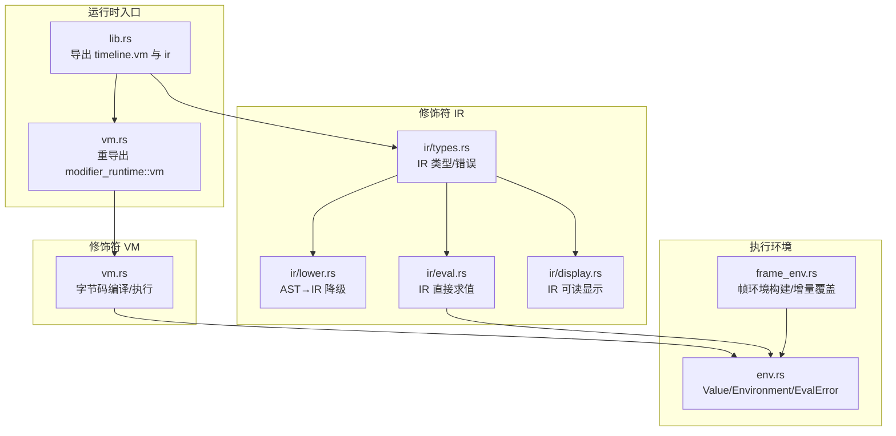
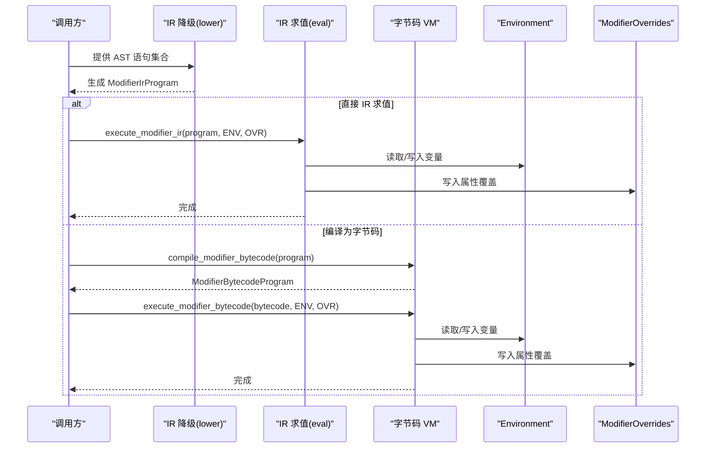
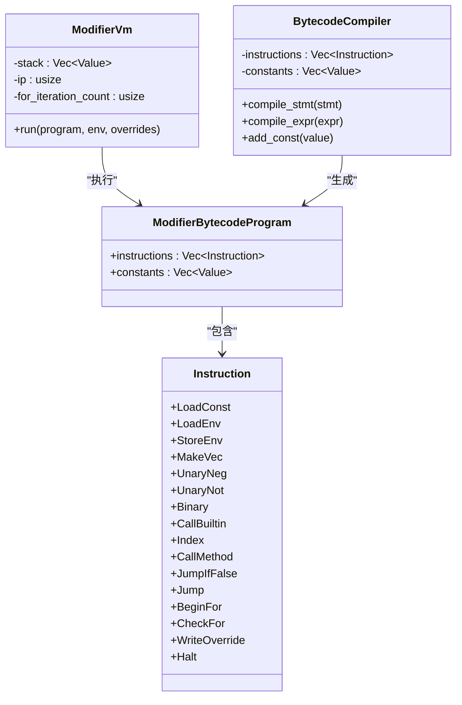
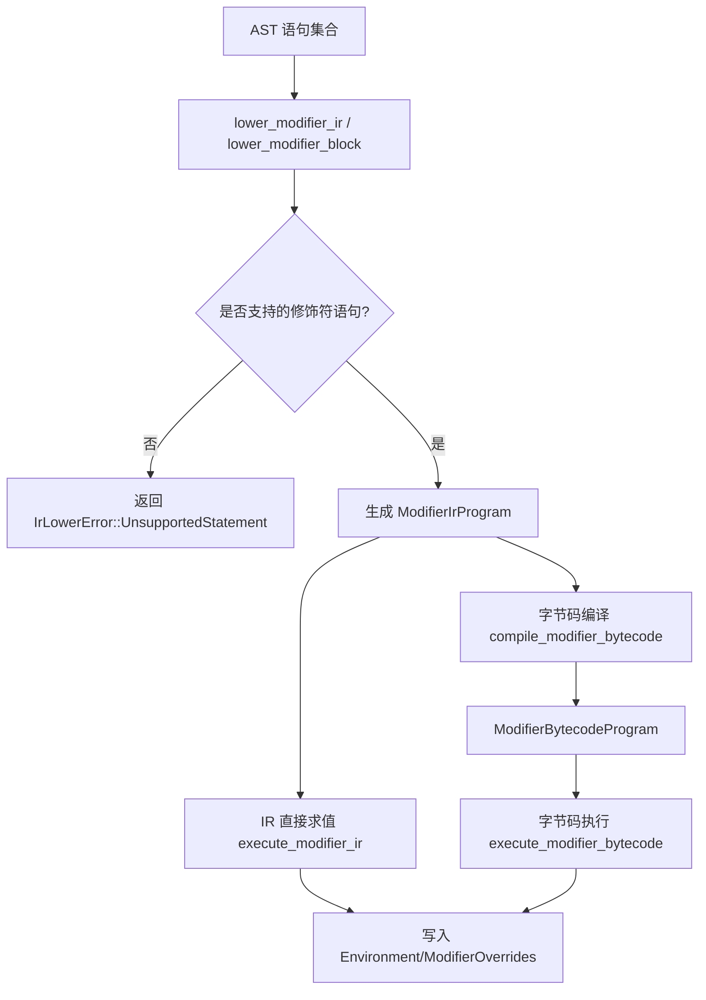
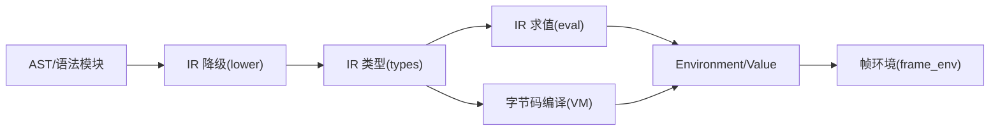

# 虚拟机 API

<cite>
**本文引用的文件**
- [lib.rs](file://crates/animatix/src/lib.rs)
- [vm.rs](file://crates/animatix/src/vm.rs)
- [modifier_runtime/vm.rs](file://crates/animatix/src/timeline/modifier_runtime/vm.rs)
- [modifier_runtime/ir/mod.rs](file://crates/animatix/src/timeline/modifier_runtime/ir/mod.rs)
- [ir.rs](file://crates/animatix/src/ir.rs)
- [modifier_runtime/ir/types.rs](file://crates/animatix/src/timeline/modifier_runtime/ir/types.rs)
- [modifier_runtime/ir/lower.rs](file://crates/animatix/src/timeline/modifier_runtime/ir/lower.rs)
- [modifier_runtime/ir/eval.rs](file://crates/animatix/src/timeline/modifier_runtime/ir/eval.rs)
- [modifier_runtime/ir/display.rs](file://crates/animatix/src/timeline/modifier_runtime/ir/display.rs)
- [modifier_runtime/mod.rs](file://crates/animatix/src/timeline/modifier_runtime/mod.rs)
- [env.rs](file://crates/animatix/src/timeline/env.rs)
- [frame_env.rs](file://crates/animatix/src/timeline/frame_env.rs)
</cite>

## 目录
1. [简介](#简介)
2. [项目结构](#项目结构)
3. [核心组件](#核心组件)
4. [架构总览](#架构总览)
5. [详细组件分析](#详细组件分析)
6. [依赖关系分析](#依赖关系分析)
7. [性能考量](#性能考量)
8. [故障排查指南](#故障排查指南)
9. [结论](#结论)
10. [附录：使用示例与集成步骤](#附录使用示例与集成步骤)

## 简介
本文件系统性地记录了动画引擎中的“修饰符运行时”API，覆盖以下方面：
- 字节码执行接口：指令解释器、寄存器（栈）管理、执行环境控制
- 中间表示（IR）处理接口：IR 生成（从 AST 降级）、优化与执行流程
- 修饰符运行时接口：修饰符应用、参数传递、结果计算
- 虚拟机状态管理：执行上下文、错误处理、调试支持
- 集成示例与性能调优建议

该运行时同时提供“IR 直接求值路径”和“编译为字节码再执行”的两条路径，二者在语义上等价，但字节码路径具备更紧凑的指令序列与可打印的调试输出。

## 项目结构
与虚拟机 API 相关的关键模块组织如下：
- 运行时入口与导出
  - 根模块导出：[lib.rs](file://crates/animatix/src/lib.rs)
  - VM 模块重导出：[vm.rs](file://crates/animatix/src/vm.rs)
- 修饰符运行时子模块
  - IR 类型与工具：[modifier_runtime/ir/mod.rs](file://crates/animatix/src/timeline/modifier_runtime/ir/mod.rs)
  - IR 类型定义：[modifier_runtime/ir/types.rs](file://crates/animatix/src/timeline/modifier_runtime/ir/types.rs)
  - IR 降级（AST→IR）：[modifier_runtime/ir/lower.rs](file://crates/animatix/src/timeline/modifier_runtime/ir/lower.rs)
  - IR 求值（直接执行）：[modifier_runtime/ir/eval.rs](file://crates/animatix/src/timeline/modifier_runtime/ir/eval.rs)
  - IR 可读显示：[modifier_runtime/ir/display.rs](file://crates/animatix/src/timeline/modifier_runtime/ir/display.rs)
  - 字节码 VM：[modifier_runtime/vm.rs](file://crates/animatix/src/timeline/modifier_runtime/vm.rs)
  - IR 子模块聚合：[modifier_runtime/mod.rs](file://crates/animatix/src/timeline/modifier_runtime/mod.rs)
- 执行环境与帧环境
  - 值类型与环境：[env.rs](file://crates/animatix/src/timeline/env.rs)
  - 帧环境构建与增量覆盖：[frame_env.rs](file://crates/animatix/src/timeline/frame_env.rs)

图表来源
- [lib.rs:12-24](file://crates/animatix/src/lib.rs#L12-L24)
- [vm.rs:1-2](file://crates/animatix/src/vm.rs#L1-L2)
- [modifier_runtime/ir/mod.rs:1-10](file://crates/animatix/src/timeline/modifier_runtime/ir/mod.rs#L1-L10)
- [modifier_runtime/ir/types.rs:1-144](file://crates/animatix/src/timeline/modifier_runtime/ir/types.rs#L1-L144)
- [modifier_runtime/ir/lower.rs:1-199](file://crates/animatix/src/timeline/modifier_runtime/ir/lower.rs#L1-L199)
- [modifier_runtime/ir/eval.rs:1-834](file://crates/animatix/src/timeline/modifier_runtime/ir/eval.rs#L1-L834)
- [modifier_runtime/ir/display.rs:1-150](file://crates/animatix/src/timeline/modifier_runtime/ir/display.rs#L1-L150)
- [modifier_runtime/vm.rs:1-536](file://crates/animatix/src/timeline/modifier_runtime/vm.rs#L1-L536)
- [env.rs:1-355](file://crates/animatix/src/timeline/env.rs#L1-L355)
- [frame_env.rs:1-207](file://crates/animatix/src/timeline/frame_env.rs#L1-L207)

章节来源
- [lib.rs:12-24](file://crates/animatix/src/lib.rs#L12-L24)
- [vm.rs:1-2](file://crates/animatix/src/vm.rs#L1-L2)
- [modifier_runtime/mod.rs:1-3](file://crates/animatix/src/timeline/modifier_runtime/mod.rs#L1-L3)

## 核心组件
- 字节码 VM
  - 指令集：常量加载、变量读写、向量构造、一元/二元运算、内置函数调用、方法调用、索引、条件跳转、循环、写入覆盖、停机
  - 执行器：基于栈的解释器，维护指令指针与迭代计数以防止无限循环
  - 编译器：将 IR 表达式/语句转换为指令序列与常量池
- IR 子系统
  - 类型：Built-in 函数枚举、编译表达式、修饰符表达式（已编译/未支持）、修饰符语句、程序、覆盖映射、降级错误
  - 降级：AST 语句→IR 语句（仅支持赋值、局部绑定、条件、for 循环）
  - 求值：IR 直接求值（支持所有表达式与内置函数、方法）
  - 显示：IR 程序与表达式的可读字符串格式
- 执行环境
  - Value：数值、字符串、布尔、向量、颜色、列表、对象、原生函数、闭包
  - Environment：覆盖层+共享基础层+双槽绑定，零拷贝访问与增量更新
  - EvalError：未定义变量、类型不匹配、不可调用、不支持的方法/索引/构造等
- 帧环境
  - 构建每帧环境：时间、场景尺寸、锚点、轨道采样、覆盖增量注入
  - 增量覆盖：按需更新键与派生键（如 size 变化时自动推导 radius/radius_x/y）

章节来源
- [modifier_runtime/vm.rs:11-536](file://crates/animatix/src/timeline/modifier_runtime/vm.rs#L11-L536)
- [modifier_runtime/ir/types.rs:6-144](file://crates/animatix/src/timeline/modifier_runtime/ir/types.rs#L6-L144)
- [modifier_runtime/ir/lower.rs:1-199](file://crates/animatix/src/timeline/modifier_runtime/ir/lower.rs#L1-L199)
- [modifier_runtime/ir/eval.rs:1-834](file://crates/animatix/src/timeline/modifier_runtime/ir/eval.rs#L1-L834)
- [modifier_runtime/ir/display.rs:1-150](file://crates/animatix/src/timeline/modifier_runtime/ir/display.rs#L1-L150)
- [env.rs:6-355](file://crates/animatix/src/timeline/env.rs#L6-L355)
- [frame_env.rs:1-207](file://crates/animatix/src/timeline/frame_env.rs#L1-L207)

## 架构总览
修饰符运行时提供两条执行路径，二者在功能上等价：
- IR 直接求值路径：AST→IR 降级→IR 求值，适合动态表达式与调试
- 字节码编译路径：AST→IR 降级→字节码编译→字节码执行，适合高频帧执行与可读调试

图表来源
- [modifier_runtime/ir/lower.rs:10-52](file://crates/animatix/src/timeline/modifier_runtime/ir/lower.rs#L10-L52)
- [modifier_runtime/ir/eval.rs:20-97](file://crates/animatix/src/timeline/modifier_runtime/ir/eval.rs#L20-L97)
- [modifier_runtime/vm.rs:84-111](file://crates/animatix/src/timeline/modifier_runtime/vm.rs#L84-L111)

## 详细组件分析

### 字节码执行接口
- 指令集与数据结构
  - 指令：常量加载、环境读写、向量构造、一元/二元运算、内置函数、方法调用、索引、条件/无条件跳转、for 循环、写入覆盖、停机
  - 程序：指令序列 + 常量池
  - 错误：不支持的表达式
- 执行器
  - 基于栈的解释器，维护指令指针与 for 循环迭代上限
  - 支持增量覆盖写入，并同步到帧环境
- 编译器
  - 将 IR 语句/表达式映射为指令序列
  - 常量池去重与索引

图表来源
- [modifier_runtime/vm.rs:11-111](file://crates/animatix/src/timeline/modifier_runtime/vm.rs#L11-L111)
- [modifier_runtime/vm.rs:113-249](file://crates/animatix/src/timeline/modifier_runtime/vm.rs#L113-L249)
- [modifier_runtime/vm.rs:251-501](file://crates/animatix/src/timeline/modifier_runtime/vm.rs#L251-L501)

章节来源
- [modifier_runtime/vm.rs:11-536](file://crates/animatix/src/timeline/modifier_runtime/vm.rs#L11-L536)

### 中间表示（IR）处理接口
- IR 类型
  - Built-in 函数：三角、指数、对数、夹取、取整、角度换算等
  - 表达式：常量、环境读取、向量构造、一元/二元运算、三元选择、内置函数调用、索引、方法调用
  - 语句：赋值、局部绑定、条件、for 循环
  - 程序：语句序列
  - 覆盖映射：目标标签→属性→值
  - 降级错误：不支持的语句类型
- 降级（AST→IR）
  - 仅支持 Always/Keyframe/RelativeKeyframe 包裹体内的修饰符语句
  - 不支持注释、动作、演员声明、导入、序列等
- 求值（IR 直接执行）
  - 支持所有表达式与内置函数、方法
  - 方法覆盖：字符串与列表常用方法
- 显示（IR 可读）
  - 提供 IR 程序与表达式的可读字符串格式

图表来源
- [modifier_runtime/ir/lower.rs:10-118](file://crates/animatix/src/timeline/modifier_runtime/ir/lower.rs#L10-L118)
- [modifier_runtime/ir/eval.rs:20-97](file://crates/animatix/src/timeline/modifier_runtime/ir/eval.rs#L20-L97)
- [modifier_runtime/vm.rs:84-97](file://crates/animatix/src/timeline/modifier_runtime/vm.rs#L84-L97)

章节来源
- [modifier_runtime/ir/types.rs:6-144](file://crates/animatix/src/timeline/modifier_runtime/ir/types.rs#L6-L144)
- [modifier_runtime/ir/lower.rs:1-199](file://crates/animatix/src/timeline/modifier_runtime/ir/lower.rs#L1-L199)
- [modifier_runtime/ir/eval.rs:1-834](file://crates/animatix/src/timeline/modifier_runtime/ir/eval.rs#L1-L834)
- [modifier_runtime/ir/display.rs:1-150](file://crates/animatix/src/timeline/modifier_runtime/ir/display.rs#L1-L150)

### 修饰符运行时接口（应用、参数、结果）
- 应用方式
  - 通过 IR 语句 Assign 将表达式结果写入目标属性
  - 字节码路径在 WriteOverride 指令中完成写入与帧环境增量更新
- 参数传递
  - 环境变量：通过 Environment 提供的键访问
  - 内置函数与方法：按固定签名与类型约束进行参数校验
- 结果计算
  - IR 求值与字节码执行均支持二元运算、内置函数、方法调用、索引
  - 增量覆盖会触发派生键（如 size→radius/radius_x/y）的自动更新

章节来源
- [modifier_runtime/ir/eval.rs:32-97](file://crates/animatix/src/timeline/modifier_runtime/ir/eval.rs#L32-L97)
- [modifier_runtime/vm.rs:479-490](file://crates/animatix/src/timeline/modifier_runtime/vm.rs#L479-L490)
- [frame_env.rs:14-55](file://crates/animatix/src/timeline/frame_env.rs#L14-L55)

### 虚拟机状态管理（执行上下文、错误处理、调试）
- 执行上下文
  - Environment：覆盖层 + 共享基础层 + 双槽绑定，避免每帧复制大量标准库条目
  - 帧环境：每帧构建，注入时间、场景尺寸、锚点、轨道采样与覆盖
- 错误处理
  - EvalError：未定义变量、类型不匹配、不可调用、不支持的方法/索引/构造
  - 字节码 VM：边界检查（常量池越界、跳转越界、栈下溢、for 循环超限）
- 调试支持
  - IR 显示：IR 程序与表达式的可读字符串
  - 字节码显示：ModifierBytecodeProgram 实现 Display，逐条打印指令与常量

章节来源
- [env.rs:6-42](file://crates/animatix/src/timeline/env.rs#L6-L42)
- [modifier_runtime/vm.rs:258-501](file://crates/animatix/src/timeline/modifier_runtime/vm.rs#L258-L501)
- [modifier_runtime/ir/display.rs:5-150](file://crates/animatix/src/timeline/modifier_runtime/ir/display.rs#L5-L150)

## 依赖关系分析
- 模块耦合
  - IR 与 VM：IR 是 VM 的输入；IR 求值与 VM 执行在语义上一致
  - 环境：IR 求值与 VM 执行均依赖 Environment 与 Value
  - 帧环境：由 Timeline 构建，修饰符运行时在其基础上写入覆盖
- 外部依赖
  - AST 与语法模块：用于降级与表达式编译
  - 时间线与轨道：提供帧时间、场景尺寸与轨道采样

图表来源
- [modifier_runtime/ir/lower.rs:1-199](file://crates/animatix/src/timeline/modifier_runtime/ir/lower.rs#L1-L199)
- [modifier_runtime/ir/types.rs:1-144](file://crates/animatix/src/timeline/modifier_runtime/ir/types.rs#L1-L144)
- [modifier_runtime/ir/eval.rs:1-834](file://crates/animatix/src/timeline/modifier_runtime/ir/eval.rs#L1-L834)
- [modifier_runtime/vm.rs:1-536](file://crates/animatix/src/timeline/modifier_runtime/vm.rs#L1-L536)
- [env.rs:1-355](file://crates/animatix/src/timeline/env.rs#L1-L355)
- [frame_env.rs:1-207](file://crates/animatix/src/timeline/frame_env.rs#L1-L207)

章节来源
- [ir.rs:1-2](file://crates/animatix/src/ir.rs#L1-L2)
- [lib.rs:12-24](file://crates/animatix/src/lib.rs#L12-L24)

## 性能考量
- 字节码路径优势
  - 指令序列紧凑，减少重复解析开销
  - 常量池复用，降低内存占用
  - 可打印的字节码便于调试与性能分析
- 环境设计优化
  - 共享基础层避免每帧复制 stdlib 条目
  - 双槽绑定避免为每个采样点克隆覆盖表
  - 增量覆盖只更新受影响键与派生键
- 循环与安全
  - for 循环设置迭代上限，防止无限循环导致卡顿
  - 指令执行前进行边界检查（常量池、跳转、栈深）

章节来源
- [env.rs:204-355](file://crates/animatix/src/timeline/env.rs#L204-L355)
- [frame_env.rs:64-205](file://crates/animatix/src/timeline/frame_env.rs#L64-L205)
- [modifier_runtime/vm.rs:440-478](file://crates/animatix/src/timeline/modifier_runtime/vm.rs#L440-L478)

## 故障排查指南
- 常见错误与定位
  - 未定义变量：检查 Environment 是否正确构建与扩展
  - 类型不匹配：核对二元运算、索引与方法调用的参数类型
  - 不支持的方法：确认接收者类型与方法名是否匹配
  - 字节码相关错误：常量池越界、跳转越界、栈下溢、for 循环超限
- 排查步骤
  - 使用 IR 显示或字节码显示打印中间产物
  - 在字节码路径中启用 Halt 前后断点，观察栈状态
  - 对比 IR 直接求值与字节码执行的结果一致性

章节来源
- [env.rs:6-42](file://crates/animatix/src/timeline/env.rs#L6-L42)
- [modifier_runtime/ir/display.rs:5-150](file://crates/animatix/src/timeline/modifier_runtime/ir/display.rs#L5-L150)
- [modifier_runtime/vm.rs:264-494](file://crates/animatix/src/timeline/modifier_runtime/vm.rs#L264-L494)

## 结论
修饰符运行时提供了高内聚、低耦合的执行框架：IR 作为统一中间语言，既可直接求值，也可编译为字节码执行；配合高效的执行环境与增量覆盖机制，既能满足开发期的灵活性与可观测性，也能满足播放期的性能需求。通过合理选择执行路径与遵循错误处理规范，可在复杂动画场景中稳定高效地驱动属性覆盖与渲染管线。

## 附录：使用示例与集成步骤
- 集成步骤
  - 降级 AST 修饰符语句为 IR：参考 [modifier_runtime/ir/lower.rs:10-52](file://crates/animatix/src/timeline/modifier_runtime/ir/lower.rs#L10-L52)
  - 选择执行路径
    - IR 直接求值：参考 [modifier_runtime/ir/eval.rs:20-97](file://crates/animatix/src/timeline/modifier_runtime/ir/eval.rs#L20-L97)
    - 字节码编译与执行：参考 [modifier_runtime/vm.rs:84-111](file://crates/animatix/src/timeline/modifier_runtime/vm.rs#L84-L111)
  - 构建帧环境并应用覆盖：参考 [frame_env.rs:104-205](file://crates/animatix/src/timeline/frame_env.rs#L104-L205)
- 性能调优建议
  - 高频帧场景优先采用字节码路径，并缓存编译后的程序
  - 利用环境的共享基础层与双槽绑定，减少分配与拷贝
  - 对长循环或复杂表达式进行拆分，避免单帧过长阻塞
  - 使用 IR/字节码显示进行热点定位与指令级优化

章节来源
- [modifier_runtime/ir/lower.rs:10-52](file://crates/animatix/src/timeline/modifier_runtime/ir/lower.rs#L10-L52)
- [modifier_runtime/ir/eval.rs:20-97](file://crates/animatix/src/timeline/modifier_runtime/ir/eval.rs#L20-L97)
- [modifier_runtime/vm.rs:84-111](file://crates/animatix/src/timeline/modifier_runtime/vm.rs#L84-L111)
- [frame_env.rs:104-205](file://crates/animatix/src/timeline/frame_env.rs#L104-L205)