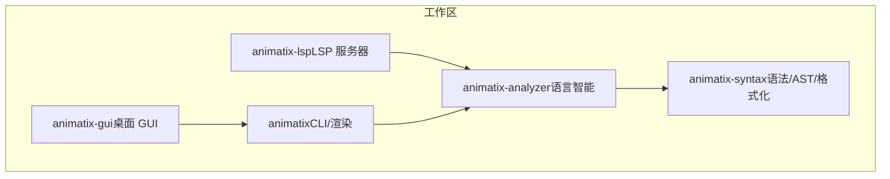
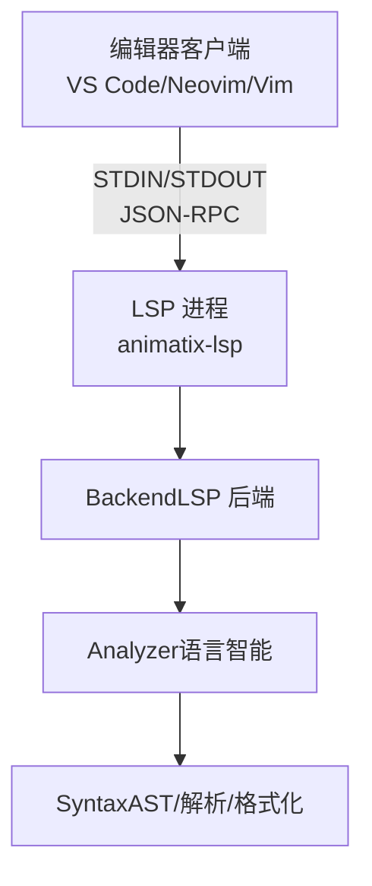
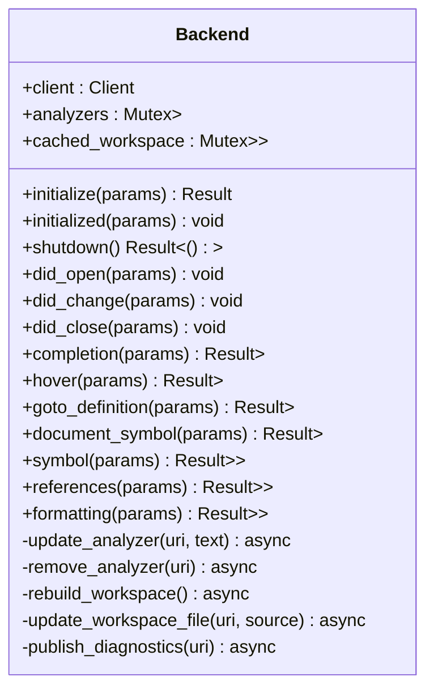
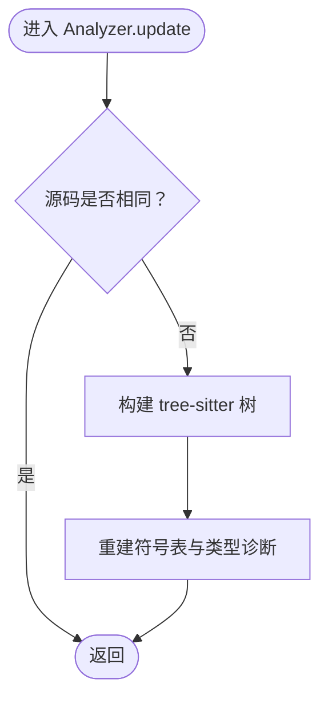
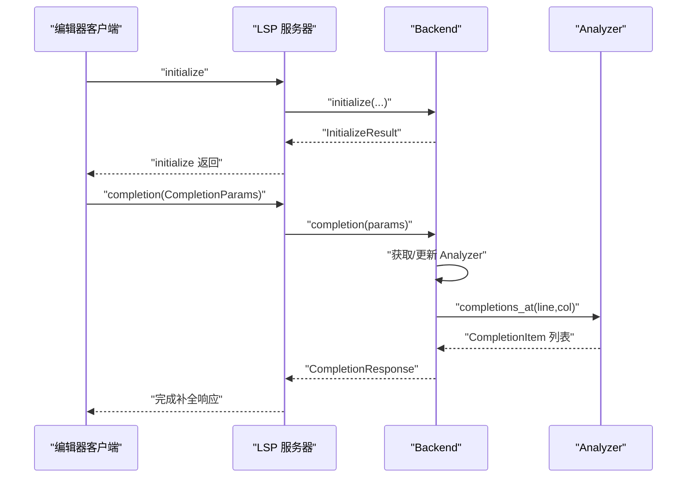

# IDE 集成指南

<cite>
**本文引用的文件**
- [crates/animatix-lsp/src/main.rs](file://crates/animatix-lsp/src/main.rs)
- [crates/animatix-analyzer/src/lib.rs](file://crates/animatix-analyzer/src/lib.rs)
- [crates/animatix-syntax/src/lib.rs](file://crates/animatix-syntax/src/lib.rs)
- [Cargo.toml（工作区）](file://Cargo.toml)
- [crates/animatix/Cargo.toml](file://crates/animatix/Cargo.toml)
- [crates/animatix-analyzer/Cargo.toml](file://crates/animatix-analyzer/Cargo.toml)
- [crates/animatix-gui/Cargo.toml](file://crates/animatix-gui/Cargo.toml)
- [Readme.md](file://Readme.md)
- [docs/README.md](file://docs/README.md)
</cite>

## 目录
1. [简介](#简介)
2. [项目结构](#项目结构)
3. [核心组件](#核心组件)
4. [架构总览](#架构总览)
5. [详细组件分析](#详细组件分析)
6. [依赖关系分析](#依赖关系分析)
7. [性能考虑](#性能考虑)
8. [调试与故障排除](#调试与故障排除)
9. [结论](#结论)
10. [附录：集成示例与配置模板](#附录集成示例与配置模板)

## 简介
本指南面向希望在主流编辑器（VS Code、Neovim、Vim 等）中使用 Animatix LSP 的开发者，系统讲解如何配置与运行 Animatix LSP 服务器，并解释客户端实现的关键步骤（进程启动、标准输入输出通信、消息序列化）。同时提供调试与故障排除建议、性能监控与优化策略，以及可直接套用的集成示例与配置模板。

## 项目结构
Animatix 是一个基于 Rust 的多 crate 工作区，其中与 LSP 直接相关的是：
- animatix-lsp：LSP 服务器二进制，负责语言服务能力（补全、诊断、悬停、跳转定义、符号等）
- animatix-analyzer：共享的语言智能实现，为 GUI 和 LSP 提供解析、符号表、诊断、类型检查等
- animatix-syntax：语法与 AST、格式化、类型检查等基础模块
- animatix：渲染引擎与 CLI 主程序（含日志与追踪配置）

图表来源
- [Cargo.toml（工作区）:1-11](file://Cargo.toml#L1-L11)
- [crates/animatix/Cargo.toml:1-105](file://crates/animatix/Cargo.toml#L1-L105)
- [crates/animatix-analyzer/Cargo.toml:1-15](file://crates/animatix-analyzer/Cargo.toml#L1-L15)
- [crates/animatix-gui/Cargo.toml:1-49](file://crates/animatix-gui/Cargo.toml#L1-L49)
- [crates/animatix-lsp/src/main.rs:1-509](file://crates/animatix-lsp/src/main.rs#L1-L509)

章节来源
- [Cargo.toml（工作区）:1-11](file://Cargo.toml#L1-L11)
- [Readme.md:143-178](file://Readme.md#L143-L178)
- [docs/README.md:1-22](file://docs/README.md#L1-L22)

## 核心组件
- LSP 服务器后端（Backend）
  - 维护每个文档的 Analyzer 实例与全局 Workspace 缓存
  - 处理初始化、打开/变更/关闭文档事件
  - 提供补全、悬停、跳转定义、文档符号、工作区符号、引用、格式化等能力
- Analyzer
  - 基于 tree-sitter 的 CST 与 chumsky 的 AST 双轨解析
  - 构建符号表、收集引用、增量更新、生成诊断与类型检查结果
- Syntax 模块
  - 提供 AST、解析器、格式化器、类型检查器等基础能力

章节来源
- [crates/animatix-lsp/src/main.rs:15-145](file://crates/animatix-lsp/src/main.rs#L15-L145)
- [crates/animatix-analyzer/src/lib.rs:44-442](file://crates/animatix-analyzer/src/lib.rs#L44-L442)
- [crates/animatix-syntax/src/lib.rs:1-29](file://crates/animatix-syntax/src/lib.rs#L1-L29)

## 架构总览
下图展示了从编辑器到 LSP 服务器，再到分析器与语法模块的数据流与职责边界。

图表来源
- [crates/animatix-lsp/src/main.rs:478-485](file://crates/animatix-lsp/src/main.rs#L478-L485)
- [crates/animatix-analyzer/src/lib.rs:44-134](file://crates/animatix-analyzer/src/lib.rs#L44-L134)
- [crates/animatix-syntax/src/lib.rs:1-29](file://crates/animatix-syntax/src/lib.rs#L1-L29)

## 详细组件分析

### LSP 服务器后端（Backend）
- 职责
  - 维护文档级 Analyzer 映射与全局 Workspace 缓存
  - 在文档打开/变更/关闭时更新 Analyzer 并重建或增量更新 Workspace
  - 将 Analyzer 的诊断、补全、悬停、符号等结果映射为 LSP 类型并返回
- 关键流程
  - 初始化：声明支持的文本同步、补全触发字符、悬停、跳转定义、文档/工作区符号、引用等能力
  - 文档事件：did_open/did_change/did_close 更新 Analyzer 并发布诊断
  - 查询接口：completion/hover/goto_definition/document_symbol/symbol/references/formatting

图表来源
- [crates/animatix-lsp/src/main.rs:15-145](file://crates/animatix-lsp/src/main.rs#L15-L145)
- [crates/animatix-lsp/src/main.rs:147-470](file://crates/animatix-lsp/src/main.rs#L147-L470)

章节来源
- [crates/animatix-lsp/src/main.rs:147-470](file://crates/animatix-lsp/src/main.rs#L147-L470)

### Analyzer（语言智能）
- 职责
  - 维护源码、AST、tree-sitter 树、符号表、类型诊断
  - 支持增量更新、位置查询、补全、悬停、跳转定义、引用查找、文档符号、格式化
- 解析与符号
  - 使用 tree-sitter 构建 CST，用于位置精确查询
  - 使用 chumsky 解析 AST，作为语义与类型检查的权威来源
  - 符号表包含标签、组件、导入、场景等，并补充真实行列位置

图表来源
- [crates/animatix-analyzer/src/lib.rs:77-134](file://crates/animatix-analyzer/src/lib.rs#L77-L134)

章节来源
- [crates/animatix-analyzer/src/lib.rs:44-442](file://crates/animatix-analyzer/src/lib.rs#L44-L442)

### LSP 请求处理序列（以“补全”为例）

图表来源
- [crates/animatix-lsp/src/main.rs:147-173](file://crates/animatix-lsp/src/main.rs#L147-L173)
- [crates/animatix-lsp/src/main.rs:205-239](file://crates/animatix-lsp/src/main.rs#L205-L239)
- [crates/animatix-analyzer/src/lib.rs:372-375](file://crates/animatix-analyzer/src/lib.rs#L372-L375)

## 依赖关系分析
- animatix-lsp 依赖 animatix-analyzer；后者依赖 animatix-syntax
- 工作区通过 Cargo.toml 统一管理成员 crate

图表来源
- [Cargo.toml（工作区）:2-9](file://Cargo.toml#L2-L9)
- [crates/animatix-analyzer/Cargo.toml:8-15](file://crates/animatix-analyzer/Cargo.toml#L8-L15)

章节来源
- [Cargo.toml（工作区）:1-11](file://Cargo.toml#L1-L11)
- [crates/animatix-analyzer/Cargo.toml:1-15](file://crates/animatix-analyzer/Cargo.toml#L1-L15)

## 性能考虑
- 文档同步策略
  - LSP 服务器声明为“全文同步”，适合小至中等规模的 .amx 文件；对大型文件建议减少频繁全量重算
- Analyzer 增量更新
  - Analyzer 对相同源码不做重复解析；仅在源码变化时重建符号表与诊断
- Workspace 缓存
  - 新开文档时进行全量重建；后续变更采用增量更新，显著降低跨文件分析成本
- 格式化
  - 仅当 AST 存在且格式化前后不一致时才返回替换整个文档的 TextEdit

章节来源
- [crates/animatix-lsp/src/main.rs:149-172](file://crates/animatix-lsp/src/main.rs#L149-L172)
- [crates/animatix-analyzer/src/lib.rs:77-93](file://crates/animatix-analyzer/src/lib.rs#L77-L93)
- [crates/animatix-lsp/src/main.rs:67-100](file://crates/animatix-lsp/src/main.rs#L67-L100)
- [crates/animatix-lsp/src/main.rs:436-469](file://crates/animatix-lsp/src/main.rs#L436-L469)

## 调试与故障排除
- 日志与追踪
  - CLI 渲染器支持通过环境变量控制日志级别与颜色输出，便于定位问题
  - LSP 服务器使用 tracing 记录消息与状态，可在编辑器终端查看
- 常见问题
  - LSP 无法启动：确认已编译 animatix-lsp 并正确配置编辑器的 LSP 执行路径
  - 无诊断/补全：检查文档是否被正确打开（did_open）、URI 是否为 file:// 协议
  - 跨文件跳转失败：确保至少有两个已打开文档，以便重建 Workspace
- 排查步骤
  - 启用更高日志级别，观察初始化、打开文档、变更与诊断发布的日志
  - 在编辑器中手动触发格式化，验证格式化逻辑是否生效
  - 使用最小示例文件验证 LSP 能力（如补全、悬停、跳转定义）

章节来源
- [crates/animatix/src/main.rs:316-333](file://crates/animatix/src/main.rs#L316-L333)
- [crates/animatix-lsp/src/main.rs:175-179](file://crates/animatix-lsp/src/main.rs#L175-L179)
- [crates/animatix-lsp/src/main.rs:185-203](file://crates/animatix-lsp/src/main.rs#L185-L203)
- [crates/animatix-lsp/src/main.rs:436-469](file://crates/animatix-lsp/src/main.rs#L436-L469)

## 结论
Animatix LSP 通过清晰的分层设计（LSP 服务器 → 分析器 → 语法模块），在编辑器中提供了完善的语言智能体验。结合增量更新与 Workspace 缓存，能够在日常开发中保持良好的响应性。按本文提供的配置与调试方法，可快速在 VS Code、Neovim、Vim 等编辑器中启用 Animatix LSP。

## 附录：集成示例与配置模板

### 客户端实现关键步骤（通用）
- 进程启动
  - 启动 animatix-lsp 二进制，标准输入输出作为 JSON-RPC 通道
- 消息序列化
  - 使用 LSP JSON-RPC 规范（lsp-types）进行请求/响应序列化
- 文档生命周期
  - 打开：发送 didOpen，随后发布诊断
  - 变更：发送 didChange，增量更新 Analyzer 并发布诊断
  - 关闭：发送 didClose，移除 Analyzer 并重建 Workspace
- 能力调用
  - 补全、悬停、跳转定义、文档符号、工作区符号、引用、格式化等均通过对应 LSP 方法触发

章节来源
- [crates/animatix-lsp/src/main.rs:478-485](file://crates/animatix-lsp/src/main.rs#L478-L485)
- [crates/animatix-lsp/src/main.rs:149-172](file://crates/animatix-lsp/src/main.rs#L149-L172)
- [crates/animatix-lsp/src/main.rs:185-203](file://crates/animatix-lsp/src/main.rs#L185-L203)

### VS Code 配置模板
- 插件建议：使用官方“Language Servers”扩展或自定义 LSP 配置
- 设置片段（settings.json）
  - 指定 LSP 可执行文件路径与参数
  - 启用文件关联（*.amx）
  - 可选：设置日志级别与输出通道
- 注意事项
  - 确保 LSP 进程可通过 PATH 或绝对路径访问
  - 若需高亮与树语法支持，建议同时安装 Tree-sitter 相关扩展

[本节为通用配置说明，未直接分析具体文件，故不附加章节来源]

### Neovim 配置模板（Lua）
- 使用 nvim-lspconfig 或兼容方案
  - 指定命令为 animatix-lsp
  - 设置 filetypes = { "animatix" }（或 *.amx）
  - 可选：启用自动格式化、悬浮窗口显示诊断
- 典型步骤
  - require'lspconfig'.animatix.setup{}
  - 在 BufEnter 时绑定格式化快捷键
  - 在诊断面板中查看错误与警告

[本节为通用配置说明，未直接分析具体文件，故不附加章节来源]

### Vim 配置模板（vim-plug + coc.nvim）
- 插件管理：Plug 'neoclide/coc.nvim'
- 配置片段（coc-settings.json）
  - 添加 LSP 条目：command 指向 animatix-lsp，filetypes 包含 .amx
  - 可选：启用诊断、补全、格式化
- 使用建议
  - 在 .amx 文件中执行 CocAction('refresh') 以加载 LSP
  - 使用 :CocList diagnostics 查看诊断

[本节为通用配置说明，未直接分析具体文件，故不附加章节来源]

### LSP 服务器启动与通信（代码级要点）
- 进程与 I/O
  - 通过 tokio::io::stdin/stdout 获取 STDIN/STDOUT
  - 使用 LspService::new 创建服务与 socket
  - Server::new 启动循环，处理 JSON-RPC 请求
- 消息处理
  - Backend 实现 LanguageServer trait，逐个方法映射到 Analyzer 与 Workspace

章节来源
- [crates/animatix-lsp/src/main.rs:478-485](file://crates/animatix-lsp/src/main.rs#L478-L485)
- [crates/animatix-lsp/src/main.rs:147-173](file://crates/animatix-lsp/src/main.rs#L147-L173)