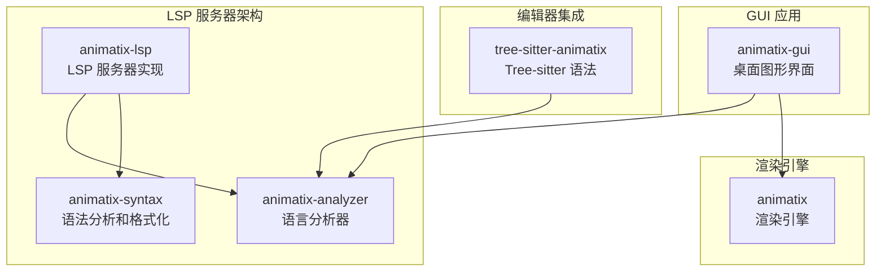
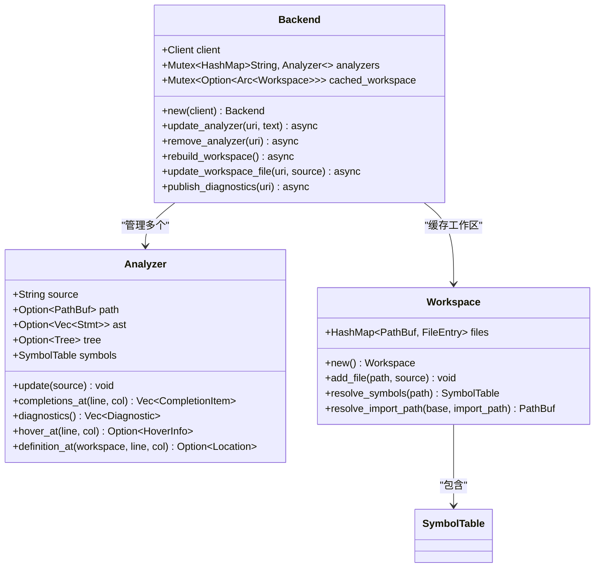
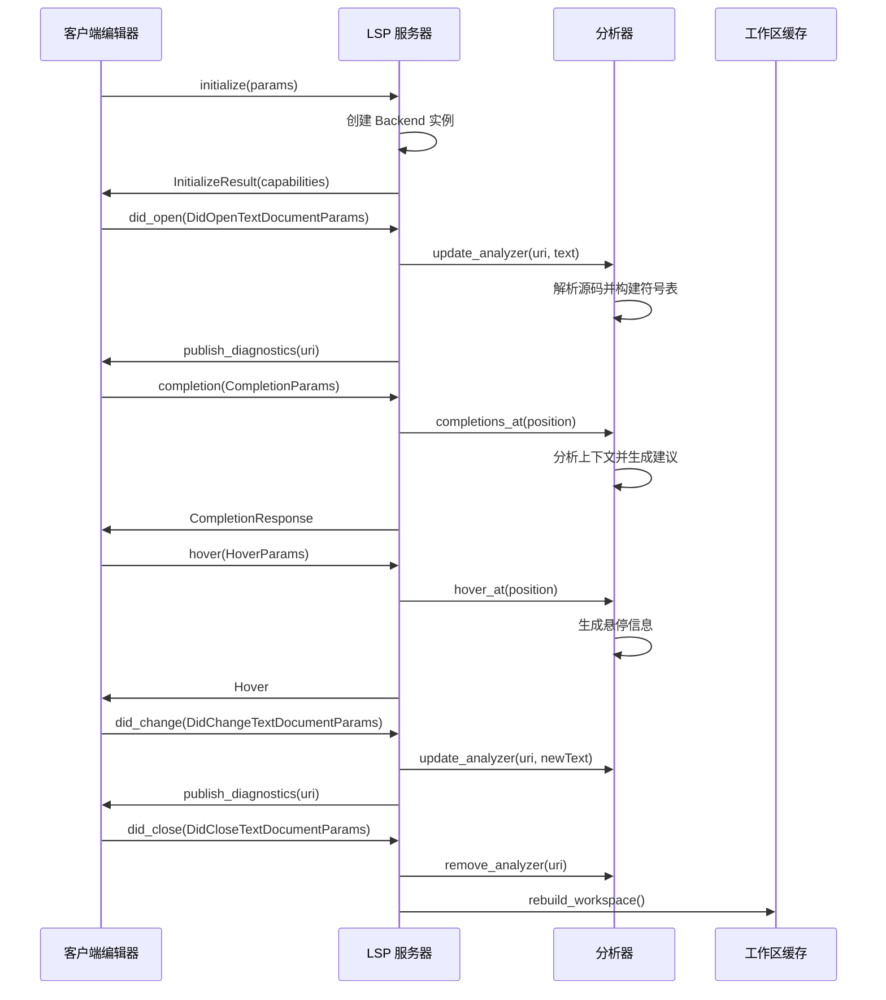
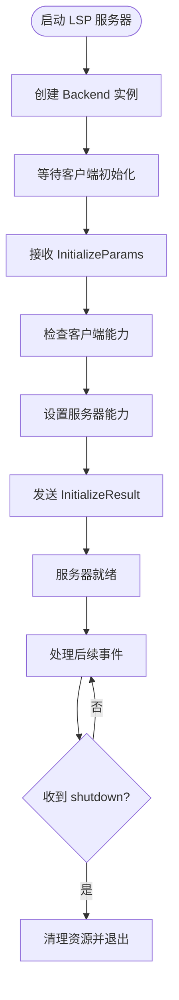
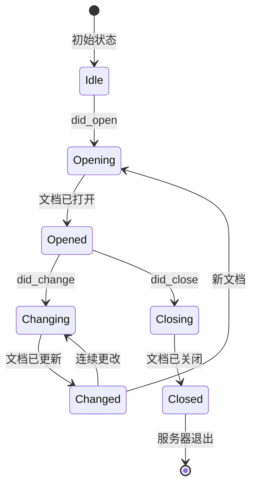
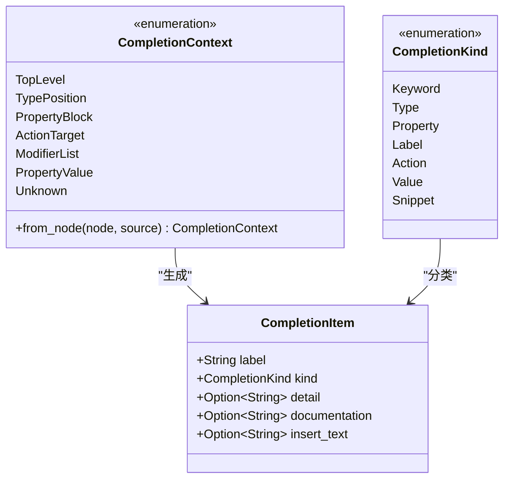
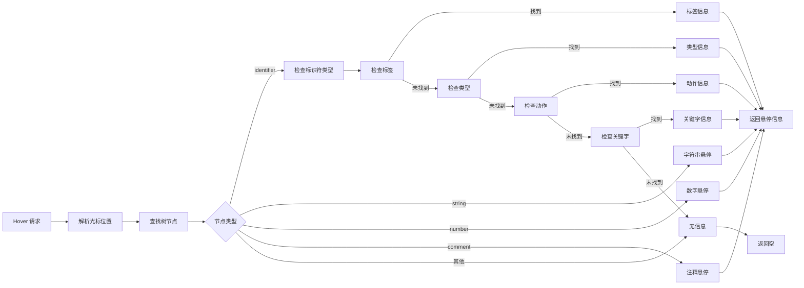
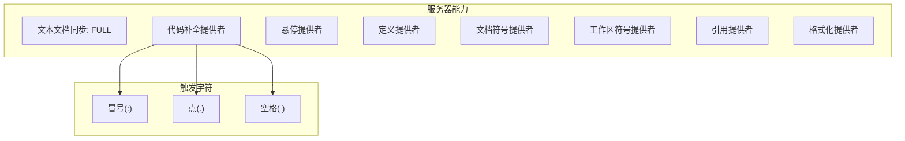
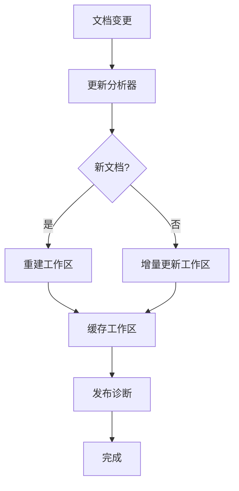
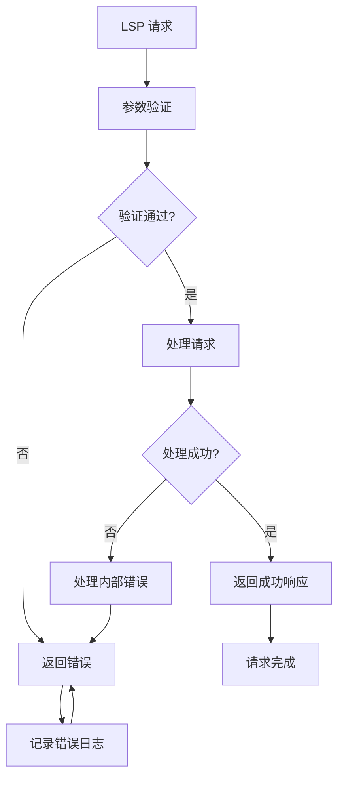

# LSP 协议接口

<cite>
**本文档引用的文件**
- [crates/animatix-lsp/src/main.rs](file://crates/animatix-lsp/src/main.rs)
- [crates/animatix-lsp/Cargo.toml](file://crates/animatix-lsp/Cargo.toml)
- [crates/animatix-analyzer/src/lib.rs](file://crates/animatix-analyzer/src/lib.rs)
- [crates/animatix-analyzer/src/completer.rs](file://crates/animatix-analyzer/src/completer.rs)
- [crates/animatix-analyzer/src/hover.rs](file://crates/animatix-analyzer/src/hover.rs)
- [crates/animatix-analyzer/src/workspace.rs](file://crates/animatix-analyzer/src/workspace.rs)
- [crates/animatix-syntax/src/formatter.rs](file://crates/animatix-syntax/src/formatter.rs)
</cite>

## 目录
1. [简介](#简介)
2. [项目结构](#项目结构)
3. [核心组件](#核心组件)
4. [架构概览](#架构概览)
5. [详细组件分析](#详细组件分析)
6. [协议实现详解](#协议实现详解)
7. [文档同步机制](#文档同步机制)
8. [客户端能力配置](#客户端能力配置)
9. [错误处理与状态管理](#错误处理与状态管理)
10. [性能考虑](#性能考虑)
11. [故障排除指南](#故障排除指南)
12. [结论](#结论)

## 简介

Animatix LSP 服务器为 Animatix 声明式动画语言提供了完整的 Language Server Protocol 实现。该服务器通过 Tower LSP 框架构建，为外部编辑器（如 VS Code 和 Neovim）提供智能语言服务，包括代码补全、诊断信息、悬停提示、定义跳转、符号导航等功能。

Animatix DSL 是一种专门用于创建解释性数学、图表和矢量动画的声明式语言。LSP 服务器通过强大的分析器模块提供实时的语言智能，支持跨文件分析、类型检查和语义高亮。

## 项目结构

Animatix 项目采用多 Crate 工作空间结构，LSP 服务器位于独立的 `animatix-lsp` Crate 中：

**图表来源**
- [crates/animatix-lsp/src/main.rs:1-509](file://crates/animatix-lsp/src/main.rs#L1-L509)
- [crates/animatix-analyzer/src/lib.rs:1-912](file://crates/animatix-analyzer/src/lib.rs#L1-L912)

**章节来源**
- [crates/animatix-lsp/src/main.rs:1-509](file://crates/animatix-lsp/src/main.rs#L1-L509)
- [Cargo.toml:1-11](file://Cargo.toml#L1-L11)

## 核心组件

### Backend 结构体

LSP 服务器的核心是 `Backend` 结构体，它管理着客户端连接、分析器实例和缓存的工作区：

**图表来源**
- [crates/animatix-lsp/src/main.rs:16-145](file://crates/animatix-lsp/src/main.rs#L16-L145)
- [crates/animatix-analyzer/src/lib.rs:44-442](file://crates/animatix-analyzer/src/lib.rs#L44-L442)
- [crates/animatix-analyzer/src/workspace.rs:12-93](file://crates/animatix-analyzer/src/workspace.rs#L12-L93)

### 依赖关系

LSP 服务器依赖于以下核心模块：

- **animatix-analyzer**: 提供语言分析、符号表管理和诊断信息
- **animatix-syntax**: 提供语法解析和代码格式化功能
- **tower-lsp**: LSP 协议实现框架
- **tokio**: 异步运行时环境

**章节来源**
- [crates/animatix-lsp/Cargo.toml:12-19](file://crates/animatix-lsp/Cargo.toml#L12-L19)
- [crates/animatix-lsp/src/main.rs:6-13](file://crates/animatix-lsp/src/main.rs#L6-L13)

## 架构概览

LSP 服务器采用事件驱动的异步架构，通过 Tower LSP 框架处理客户端请求：

**图表来源**
- [crates/animatix-lsp/src/main.rs:148-470](file://crates/animatix-lsp/src/main.rs#L148-L470)

## 详细组件分析

### 初始化流程

LSP 服务器的初始化过程包括能力协商和连接建立：

**图表来源**
- [crates/animatix-lsp/src/main.rs:148-173](file://crates/animatix-lsp/src/main.rs#L148-L173)

### 文档同步机制

服务器支持全量文档同步模式，这是当前实现的主要同步方式：

**图表来源**
- [crates/animatix-lsp/src/main.rs:185-203](file://crates/animatix-lsp/src/main.rs#L185-L203)

**章节来源**
- [crates/animatix-lsp/src/main.rs:148-203](file://crates/animatix-lsp/src/main.rs#L148-L203)

### 代码补全系统

代码补全系统基于上下文感知的智能建议：

**图表来源**
- [crates/animatix-analyzer/src/completer.rs:100-175](file://crates/animatix-analyzer/src/completer.rs#L100-L175)
- [crates/animatix-analyzer/src/completer.rs:22-38](file://crates/animatix-analyzer/src/completer.rs#L22-L38)

**章节来源**
- [crates/animatix-analyzer/src/completer.rs:40-97](file://crates/animatix-analyzer/src/completer.rs#L40-L97)

### 悬停信息提供

悬停信息系统为用户提供丰富的上下文信息：

**图表来源**
- [crates/animatix-analyzer/src/hover.rs:8-159](file://crates/animatix-analyzer/src/hover.rs#L8-L159)

**章节来源**
- [crates/animatix-analyzer/src/hover.rs:1-215](file://crates/animatix-analyzer/src/hover.rs#L1-L215)

## 协议实现详解

### 支持的 LSP 方法

LSP 服务器实现了以下核心方法：

#### 初始化相关方法

**initialize 方法**
- 返回服务器能力声明
- 配置文本文档同步模式
- 设置各种语言特性提供者

**initialized 方法**
- 处理客户端初始化完成通知
- 记录日志信息

**shutdown 方法**
- 平滑关闭服务器
- 清理资源

#### 文档生命周期方法

**did_open**
- 处理新文档打开事件
- 更新分析器状态
- 发布诊断信息

**did_change**
- 处理文档内容变更
- 支持增量更新
- 重新计算诊断

**did_close**
- 处理文档关闭事件
- 移除分析器实例
- 重建工作区缓存

#### 语言特性方法

**completion**
- 提供代码补全建议
- 基于上下文智能推荐
- 支持多种补全类型

**hover**
- 提供悬停信息
- 显示类型和文档
- 支持属性和动作信息

**goto_definition**
- 实现定义跳转
- 支持跨文件引用
- 提供精确位置信息

**document_symbol**
- 提供文档符号列表
- 支持大纲视图
- 标识不同类型的符号

**symbol**
- 提供工作区符号搜索
- 支持全局符号查找
- 实现模糊匹配

**references**
- 查找符号引用
- 支持跨文件引用
- 返回位置范围

**formatting**
- 提供代码格式化
- 基于 AST 的安全格式化
- 全文档替换

**章节来源**
- [crates/animatix-lsp/src/main.rs:148-470](file://crates/animatix-lsp/src/main.rs#L148-L470)

### 能力协商

服务器在初始化时向客户端声明其支持的功能：

**图表来源**
- [crates/animatix-lsp/src/main.rs:149-172](file://crates/animatix-lsp/src/main.rs#L149-L172)

**章节来源**
- [crates/animatix-lsp/src/main.rs:149-172](file://crates/animatix-lsp/src/main.rs#L149-L172)

## 文档同步机制

### 同步策略

LSP 服务器采用全量同步模式，这是当前实现的主要策略：

- **同步模式**: TextDocumentSyncKind::FULL
- **更新策略**: 每次文档变更都发送完整的新内容
- **增量优化**: 在分析器层面进行增量解析

### 缓存管理

服务器维护多层缓存以提高性能：

**图表来源**
- [crates/animatix-lsp/src/main.rs:37-100](file://crates/animatix-lsp/src/main.rs#L37-L100)

**章节来源**
- [crates/animatix-lsp/src/main.rs:37-100](file://crates/animatix-lsp/src/main.rs#L37-L100)

### 诊断发布

服务器自动发布诊断信息，包括：

- **解析错误**: 语法错误和解析失败
- **语义诊断**: 类型检查和语义分析结果
- **警告信息**: 可能的问题和最佳实践建议
- **错误信息**: 严重问题和编译错误

**章节来源**
- [crates/animatix-lsp/src/main.rs:103-144](file://crates/animatix-lsp/src/main.rs#L103-L144)

## 客户端能力配置

### 支持的功能特性

LSP 服务器为客户端声明了以下能力：

#### 代码补全
- **触发字符**: 冒号(:)、点(.)、空格( )
- **补全类型**: 关键字、类型、属性、标签、动作、值、代码片段
- **上下文感知**: 基于当前位置的智能建议

#### 诊断信息
- **错误级别**: 错误、警告、信息、提示
- **位置信息**: 精确的行列号定位
- **消息格式**: 用户友好的错误描述

#### 悬停支持
- **类型信息**: 显示变量和属性的类型
- **文档内容**: 提供详细的使用说明
- **范围标注**: 高亮显示悬停的元素

#### 导航功能
- **定义跳转**: 快速定位到符号定义
- **符号列表**: 文档大纲和符号索引
- **引用查找**: 查找所有引用位置

#### 格式化支持
- **AST 基础**: 基于语法树的安全格式化
- **配置选项**: 可定制的缩进和空白规则
- **幂等性**: 格式化结果稳定不变

**章节来源**
- [crates/animatix-lsp/src/main.rs:149-172](file://crates/animatix-lsp/src/main.rs#L149-L172)

### 跨文件分析

服务器支持跨文件分析，通过工作区缓存实现：

- **导入解析**: 自动解析文件导入关系
- **符号合并**: 合并本地和导入的符号
- **命名空间**: 支持别名导入的命名空间
- **路径解析**: 相对路径的正确解析

**章节来源**
- [crates/animatix-analyzer/src/workspace.rs:58-82](file://crates/animatix-analyzer/src/workspace.rs#L58-L82)

## 错误处理与状态管理

### 错误处理策略

LSP 服务器采用健壮的错误处理机制：

### 状态管理

服务器维护以下关键状态：

- **连接状态**: 客户端连接的生命周期管理
- **文档状态**: 打开文档的分析器实例管理
- **工作区状态**: 跨文件分析的缓存管理
- **分析状态**: 语法树和符号表的更新状态

### 异常情况处理

服务器能够优雅地处理各种异常情况：

- **无效 URI**: 安全地处理非文件 URI
- **解析失败**: 提供有用的错误信息而非崩溃
- **内存不足**: 实施合理的资源限制
- **网络中断**: 处理客户端断开连接

**章节来源**
- [crates/animatix-lsp/src/main.rs:472-476](file://crates/animatix-lsp/src/main.rs#L472-L476)

## 性能考虑

### 内存管理

LSP 服务器采用高效的内存管理模式：

- **分析器缓存**: 每个文档维护独立的分析器实例
- **工作区缓存**: 跨文件分析结果的共享缓存
- **异步处理**: 使用 Tokio 运行时进行并发处理
- **零拷贝优化**: 尽可能减少数据复制操作

### 处理效率

服务器通过以下方式优化处理效率：

- **增量更新**: 仅在源码变化时重新解析
- **懒加载**: 符号表和 AST 的延迟构建
- **缓存策略**: 合理的缓存失效和更新策略
- **并发设计**: 多文档同时处理的并发架构

### 资源限制

服务器实施了多项资源限制措施：

- **最大文档大小**: 限制单个文档的大小
- **内存使用**: 监控和限制内存使用量
- **CPU 时间**: 限制单个请求的处理时间
- **并发连接**: 控制同时连接的数量

## 故障排除指南

### 常见问题诊断

#### LSP 服务器无法启动

**症状**: LSP 服务器启动后立即退出或无法连接

**排查步骤**:
1. 检查 LSP 二进制文件是否正确编译
2. 验证客户端配置是否正确
3. 查看服务器日志输出
4. 确认依赖库版本兼容性

#### 文档同步问题

**症状**: 文档变更不被正确识别或诊断信息不更新

**排查步骤**:
1. 检查文本文档同步配置
2. 验证 did_change 消息格式
3. 确认分析器更新逻辑
4. 查看缓存状态

#### 代码补全失效

**症状**: 代码补全不工作或建议不准确

**排查步骤**:
1. 检查补全触发字符配置
2. 验证上下文分析逻辑
3. 确认符号表完整性
4. 查看补全项生成过程

### 日志和调试

服务器提供了丰富的日志信息：

- **初始化日志**: 服务器启动和能力声明
- **请求日志**: 所有 LSP 请求和响应
- **错误日志**: 异常和错误信息
- **性能日志**: 处理时间和资源使用

**章节来源**
- [crates/animatix-lsp/src/main.rs:175-179](file://crates/animatix-lsp/src/main.rs#L175-L179)

## 结论

Animatix LSP 服务器提供了一个功能完整、性能优良的语言服务实现。通过精心设计的架构和高效的算法，服务器能够为 Animatix DSL 提供实时的智能语言服务。

主要特点包括：
- **全面的功能覆盖**: 支持代码补全、诊断、悬停、导航等核心功能
- **高效的性能表现**: 通过缓存和增量更新优化处理速度
- **稳健的错误处理**: 健壮的异常处理和状态管理机制
- **良好的扩展性**: 模块化的架构便于功能扩展和维护

未来的发展方向包括：
- 支持增量文档同步模式
- 增强跨文件分析能力
- 优化大文件的处理性能
- 扩展更多语言特性支持