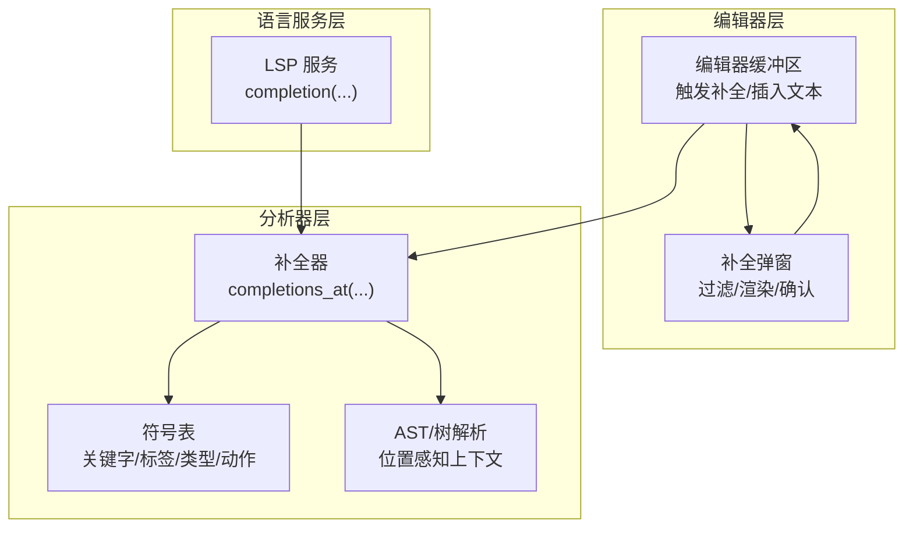
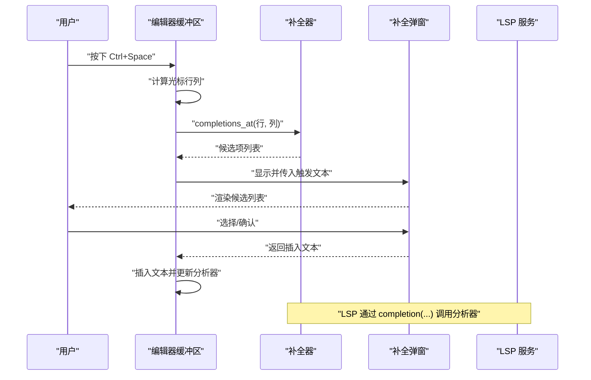
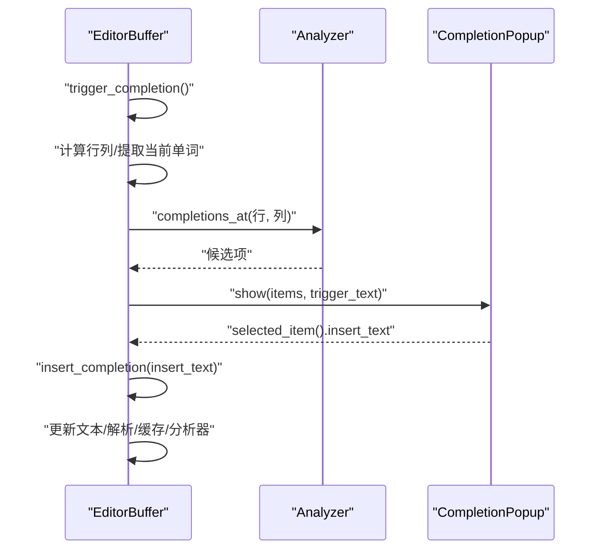
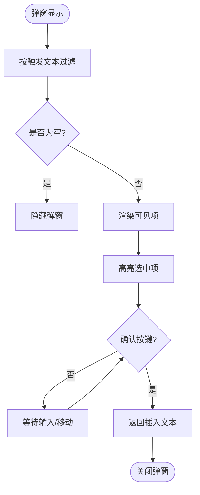
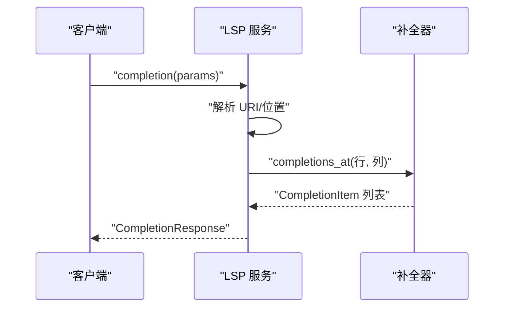
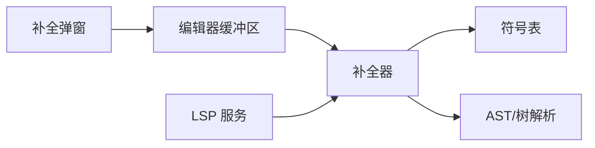

# 代码补全 API

<cite>
**本文引用的文件**
- [crates/animatix-analyzer/src/completer.rs](file://crates/animatix-analyzer/src/completer.rs)
- [crates/animatix-gui/src/editor/completion.rs](file://crates/animatix-gui/src/editor/completion.rs)
- [crates/animatix-gui/src/editor.rs](file://crates/animatix-gui/src/editor.rs)
- [crates/animatix-gui/src/completion_popup.rs](file://crates/animatix-gui/src/completion_popup.rs)
- [crates/animatix-lsp/src/main.rs](file://crates/animatix-lsp/src/main.rs)
- [crates/animatix/src/renderer/text.rs](file://crates/animatix/src/renderer/text.rs)
- [crates/animatix/src/timeline/mod.rs](file://crates/animatix/src/timeline/mod.rs)
</cite>

## 目录
1. [简介](#简介)
2. [项目结构](#项目结构)
3. [核心组件](#核心组件)
4. [架构总览](#架构总览)
5. [详细组件分析](#详细组件分析)
6. [依赖关系分析](#依赖关系分析)
7. [性能考量与缓存策略](#性能考量与缓存策略)
8. [故障排查指南](#故障排查指南)
9. [结论](#结论)
10. [附录：补全示例与最佳实践](#附录补全示例与最佳实践)

## 简介
本文件为代码补全系统的完整 API 文档，聚焦于 completion 方法的实现与使用，涵盖以下要点：
- 补全触发方式与触发字符配置（冒号、点号、空格）
- 基于上下文的位置感知补全（TopLevel、TypePosition、PropertyBlock、ActionTarget、ModifierList、PropertyValue、Unknown）
- 补全候选项生成逻辑（关键字、类型、属性、标签、动作、值、代码片段）
- 补全项数据结构（标签、类型、详情、文档、插入文本）
- 补全上下文分析与树解析
- 性能优化策略与缓存机制
- 实际补全示例与最佳实践

## 项目结构
补全系统由三部分组成：
- 分析器（Analyzer）：负责根据 AST 和符号表生成补全候选项
- GUI 编辑器：负责触发补全、接收候选项、渲染弹窗并插入文本
- LSP 服务：对外暴露补全接口，桥接编辑器与分析器

图表来源
- [crates/animatix-gui/src/editor/completion.rs:1-42](file://crates/animatix-gui/src/editor/completion.rs#L1-L42)
- [crates/animatix-gui/src/completion_popup.rs:117-215](file://crates/animatix-gui/src/completion_popup.rs#L117-L215)
- [crates/animatix-analyzer/src/completer.rs:41-97](file://crates/animatix-analyzer/src/completer.rs#L41-L97)
- [crates/animatix-lsp/src/main.rs:205-239](file://crates/animatix-lsp/src/main.rs#L205-L239)

章节来源
- [crates/animatix-gui/src/editor/completion.rs:1-42](file://crates/animatix-gui/src/editor/completion.rs#L1-L42)
- [crates/animatix-gui/src/editor.rs:418-457](file://crates/animatix-gui/src/editor.rs#L418-L457)
- [crates/animatix-gui/src/completion_popup.rs:117-215](file://crates/animatix-gui/src/completion_popup.rs#L117-L215)
- [crates/animatix-analyzer/src/completer.rs:41-97](file://crates/animatix-analyzer/src/completer.rs#L41-L97)
- [crates/animatix-lsp/src/main.rs:205-239](file://crates/animatix-lsp/src/main.rs#L205-L239)

## 核心组件
- 补全项数据结构
  - 字段：标签、类型、详情、文档、插入文本
  - 类型枚举：关键字、类型、属性、标签、动作、值、代码片段
- 上下文识别
  - 通过树解析定位光标节点，结合父节点判断上下文类别
  - 支持顶层、类型位置、属性块、动作目标、修饰符列表、属性值、未知等上下文
- 候选生成
  - 根据上下文组合关键字、类型、标签、动作、属性、值、代码片段等
- 触发与插入
  - 编辑器在 Ctrl+Space 或触发字符时调用补全
  - 弹窗按当前输入前缀过滤，确认后插入文本并更新分析器

章节来源
- [crates/animatix-analyzer/src/completer.rs:6-38](file://crates/animatix-analyzer/src/completer.rs#L6-L38)
- [crates/animatix-analyzer/src/completer.rs:100-118](file://crates/animatix-analyzer/src/completer.rs#L100-L118)
- [crates/animatix-analyzer/src/completer.rs:41-97](file://crates/animatix-analyzer/src/completer.rs#L41-L97)
- [crates/animatix-gui/src/editor/completion.rs:1-42](file://crates/animatix-gui/src/editor/completion.rs#L1-L42)
- [crates/animatix-gui/src/completion_popup.rs:117-215](file://crates/animatix-gui/src/completion_popup.rs#L117-L215)

## 架构总览
补全流程从编辑器触发开始，经由分析器生成候选项，再由弹窗进行过滤与渲染，最终插入文本并更新分析状态。

图表来源
- [crates/animatix-gui/src/editor.rs:418-457](file://crates/animatix-gui/src/editor.rs#L418-L457)
- [crates/animatix-gui/src/editor/completion.rs:8-25](file://crates/animatix-gui/src/editor/completion.rs#L8-L25)
- [crates/animatix-lsp/src/main.rs:205-239](file://crates/animatix-lsp/src/main.rs#L205-L239)

## 详细组件分析

### 补全器（Analyzer）
- 入口函数：completions_at(...)
  - 输入：符号表、可选 AST、源码、行、列
  - 输出：补全项列表
- 上下文识别
  - 使用树解析定位光标节点，结合父节点判断上下文
  - 不同上下文组合不同候选集合
- 候选生成
  - 关键字、类型、标签、动作、属性、值、代码片段
  - 某些上下文强制限定候选类型（如类型位置只给类型）

```mermaid
flowchart TD
Start(["进入 completions_at"]) --> HasTree{"是否有 AST?"}
HasTree --> |是| Locate["定位光标节点"]
Locate --> Ctx["推断上下文 CompletionContext"]
Ctx --> MatchCtx{"匹配上下文"}
MatchCtx --> |TopLevel| TL["添加关键字/标签/类型/动作/代码片段"]
MatchCtx --> |TypePosition| TP["添加类型"]
MatchCtx --> |PropertyBlock| PB["添加属性/值"]
MatchCtx --> |ActionTarget| AT["添加标签"]
MatchCtx --> |ModifierList| ML["添加修饰符"]
MatchCtx --> |PropertyValue| PV["按属性名/类型生成值"]
MatchCtx --> |Unknown| UN["回退：关键字/标签/类型"]
HasTree --> |否| Fallback["无 AST：添加常用候选"]
TL --> Merge["合并去重/排序"]
TP --> Merge
PB --> Merge
AT --> Merge
ML --> Merge
PV --> Merge
UN --> Merge
Fallback --> Merge
Merge --> End(["返回候选列表"])
```

图表来源
- [crates/animatix-analyzer/src/completer.rs:41-97](file://crates/animatix-analyzer/src/completer.rs#L41-L97)
- [crates/animatix-analyzer/src/completer.rs:120-140](file://crates/animatix-analyzer/src/completer.rs#L120-L140)

章节来源
- [crates/animatix-analyzer/src/completer.rs:41-97](file://crates/animatix-analyzer/src/completer.rs#L41-L97)
- [crates/animatix-analyzer/src/completer.rs:120-140](file://crates/animatix-analyzer/src/completer.rs#L120-L140)

### 编辑器缓冲区（EditorBuffer）
- 触发补全
  - 计算光标行列，调用分析器获取候选项
  - 提取当前单词作为触发文本，显示弹窗
- 插入补全
  - 将插入文本追加到文本末尾
  - 重新解析单元格、清缓存、更新分析器
- 当前单词提取
  - 从光标反向扫描字母数字、下划线、连字符，直到遇到非标识字符

图表来源
- [crates/animatix-gui/src/editor/completion.rs:8-25](file://crates/animatix-gui/src/editor/completion.rs#L8-L25)
- [crates/animatix-gui/src/editor/completion.rs:18-25](file://crates/animatix-gui/src/editor/completion.rs#L18-L25)
- [crates/animatix-gui/src/editor/completion.rs:27-41](file://crates/animatix-gui/src/editor/completion.rs#L27-L41)

章节来源
- [crates/animatix-gui/src/editor/completion.rs:1-42](file://crates/animatix-gui/src/editor/completion.rs#L1-L42)

### 补全弹窗（CompletionPopup）
- 渲染与交互
  - 过滤：仅保留以触发文本开头的候选项
  - 渲染：绘制背景、边框、图标、颜色、滚动条
  - 选择：支持键盘上下移动、确认插入
- 视觉映射
  - 不同 CompletionKind 对应不同图标与颜色

图表来源
- [crates/animatix-gui/src/completion_popup.rs:117-215](file://crates/animatix-gui/src/completion_popup.rs#L117-L215)

章节来源
- [crates/animatix-gui/src/completion_popup.rs:117-215](file://crates/animatix-gui/src/completion_popup.rs#L117-L215)

### LSP 服务（Language Server）
- 暴露 completion(...) 接口
  - 从 URI 获取对应分析器实例
  - 调用分析器的 completions_at(...)
  - 将内部 CompletionItem 映射为 LSP 的 CompletionItem 并返回

图表来源
- [crates/animatix-lsp/src/main.rs:205-239](file://crates/animatix-lsp/src/main.rs#L205-L239)

章节来源
- [crates/animatix-lsp/src/main.rs:205-239](file://crates/animatix-lsp/src/main.rs#L205-L239)

## 依赖关系分析
- 编辑器缓冲区依赖分析器生成候选项
- 弹窗依赖编辑器传递的候选项与触发文本
- LSP 服务依赖分析器完成补全请求
- 分析器依赖符号表与树解析结果

图表来源
- [crates/animatix-gui/src/editor/completion.rs:1-42](file://crates/animatix-gui/src/editor/completion.rs#L1-L42)
- [crates/animatix-gui/src/completion_popup.rs:117-215](file://crates/animatix-gui/src/completion_popup.rs#L117-L215)
- [crates/animatix-analyzer/src/completer.rs:41-97](file://crates/animatix-analyzer/src/completer.rs#L41-L97)
- [crates/animatix-lsp/src/main.rs:205-239](file://crates/animatix-lsp/src/main.rs#L205-L239)

章节来源
- [crates/animatix-gui/src/editor/completion.rs:1-42](file://crates/animatix-gui/src/editor/completion.rs#L1-L42)
- [crates/animatix-gui/src/completion_popup.rs:117-215](file://crates/animatix-gui/src/completion_popup.rs#L117-L215)
- [crates/animatix-analyzer/src/completer.rs:41-97](file://crates/animatix-analyzer/src/completer.rs#L41-L97)
- [crates/animatix-lsp/src/main.rs:205-239](file://crates/animatix-lsp/src/main.rs#L205-L239)

## 性能考量与缓存策略
- 编辑器侧
  - 插入补全后立即清理高亮缓存并更新分析器，避免过期状态影响后续补全
- 文本渲染侧
  - 文本编译缓存具备容量上限与淘汰策略，防止内存无限增长
- 时间线评估侧
  - 存在帧级缓存条目结构，用于存储评估结果以减少重复计算
- 建议
  - 在高频补全场景中，优先复用分析器输出并限制候选数量
  - 对热点路径采用版本化缓存（如文档快照代际与源纪元），确保一致性

章节来源
- [crates/animatix-gui/src/editor/completion.rs:18-25](file://crates/animatix-gui/src/editor/completion.rs#L18-L25)
- [crates/animatix/src/renderer/text.rs:584-621](file://crates/animatix/src/renderer/text.rs#L584-L621)
- [crates/animatix/src/timeline/mod.rs:504-513](file://crates/animatix/src/timeline/mod.rs#L504-L513)

## 故障排查指南
- 补全不出现
  - 检查是否正确触发（Ctrl+Space）
  - 确认当前上下文是否支持该类补全（例如类型位置不应出现属性）
- 候选项不符合预期
  - 核对光标位置是否落在正确的 AST 节点上
  - 验证符号表是否包含所需关键字/标签/类型/动作
- 插入文本异常
  - 确认 CompletionItem 的 insert_text 是否存在；若不存在则回退到 label
  - 检查插入后是否及时更新分析器与解析状态

章节来源
- [crates/animatix-gui/src/editor.rs:418-457](file://crates/animatix-gui/src/editor.rs#L418-L457)
- [crates/animatix-gui/src/completion_popup.rs:117-215](file://crates/animatix-gui/src/completion_popup.rs#L117-L215)

## 结论
本补全系统通过“编辑器触发—分析器生成—弹窗渲染—插入更新”的闭环，实现了位置感知的智能补全。其核心在于：
- 基于树解析的上下文识别
- 多类型候选的组合生成
- 可配置的触发与过滤
- 与 LSP 的无缝对接
配合合理的缓存与性能策略，可在复杂场景中保持流畅体验。

## 附录：补全示例与最佳实践
- 触发字符与触发方式
  - Ctrl+Space：显式触发补全
  - 输入触发：当前单词提取用于弹窗过滤
- 上下文示例
  - 顶层：建议关键字、标签、类型、动作、代码片段
  - 类型位置（冒号后）：仅建议类型
  - 属性块（花括号内）：建议属性与值
  - 动作目标（动词后）：建议标签
  - 修饰符列表（方括号内）：建议修饰符
  - 属性值（等号或冒号后）：按属性名与类型生成值
- 数据结构字段
  - 标签：显示名称
  - 类型：补全项类型（关键字/类型/属性/标签/动作/值/代码片段）
  - 详情：附加信息（如类型签名或参数说明）
  - 文档：帮助文档
  - 插入文本：实际插入内容（可与标签不同）
- 最佳实践
  - 优先使用 insert_text，确保插入行为符合语义
  - 控制候选数量，提升弹窗渲染效率
  - 在 LSP 中统一映射 CompletionKind，保证客户端一致体验
  - 对热点路径采用版本化缓存，避免重复计算

章节来源
- [crates/animatix-gui/src/editor.rs:433-440](file://crates/animatix-gui/src/editor.rs#L433-L440)
- [crates/animatix-gui/src/editor/completion.rs:27-41](file://crates/animatix-gui/src/editor/completion.rs#L27-L41)
- [crates/animatix-analyzer/src/completer.rs:6-38](file://crates/animatix-analyzer/src/completer.rs#L6-L38)
- [crates/animatix-analyzer/src/completer.rs:100-118](file://crates/animatix-analyzer/src/completer.rs#L100-L118)