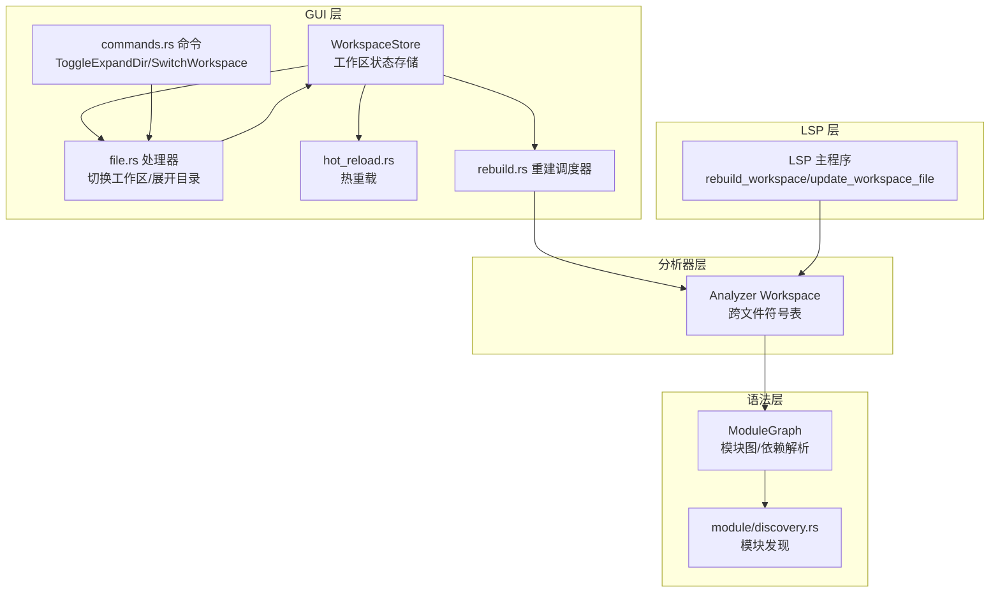
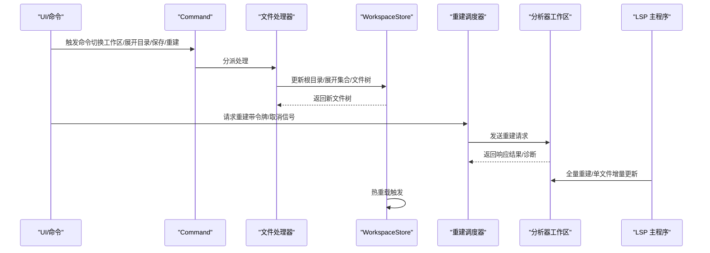
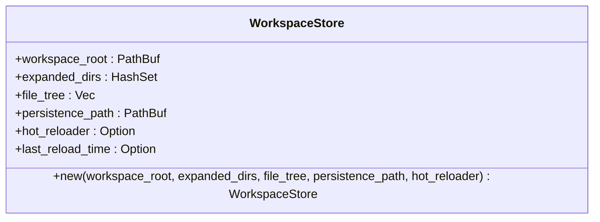
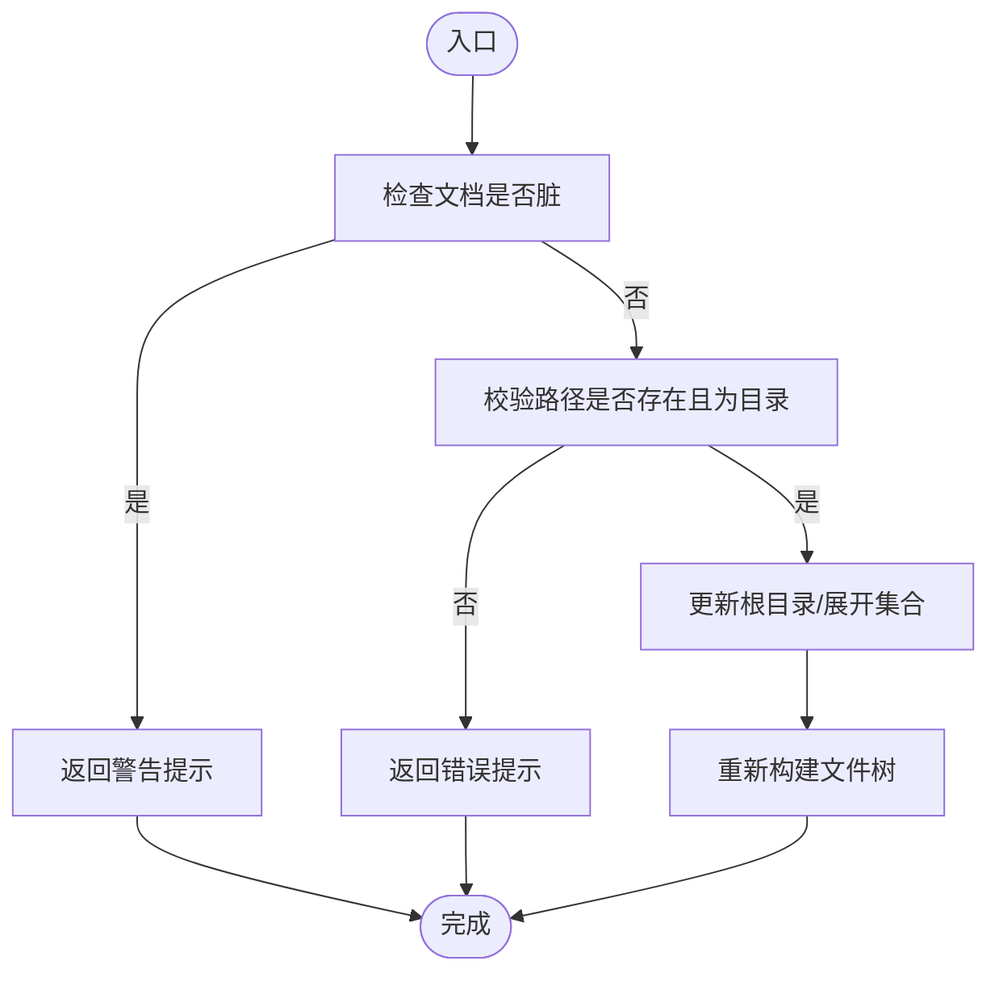
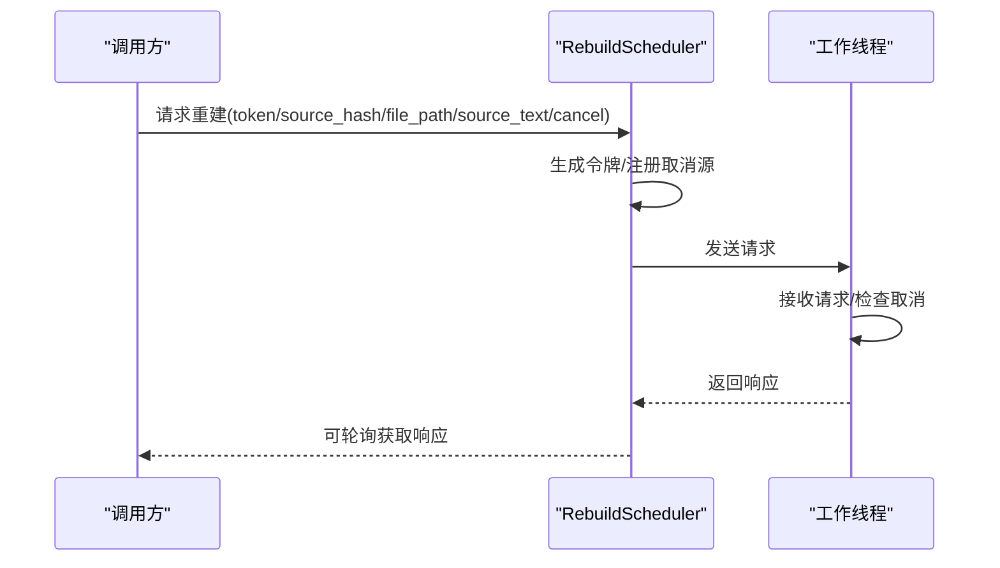
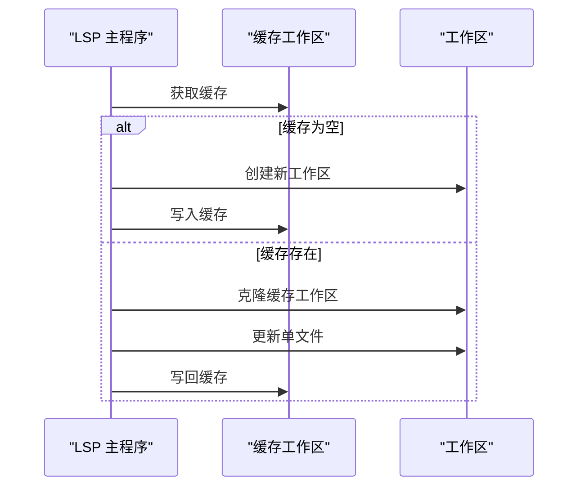
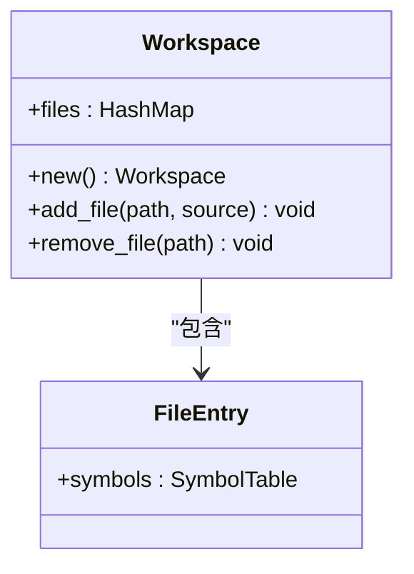
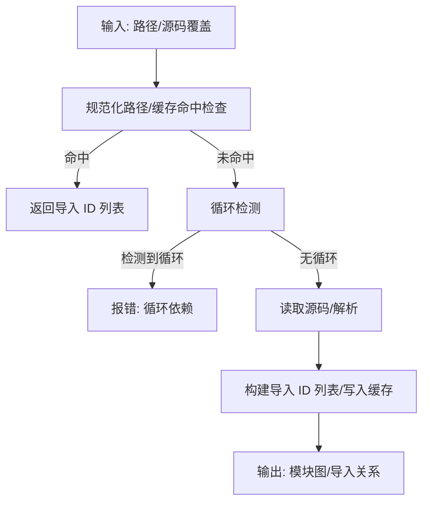
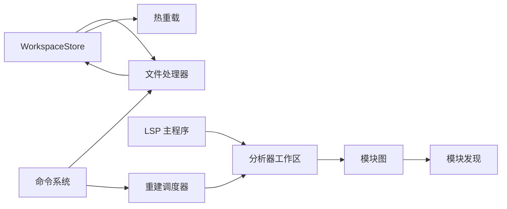

# 工作区管理 API

<cite>
**本文引用的文件**
- [crates/animatix-gui/src/app/stores/workspace_store.rs](file://crates/animatix-gui/src/app/stores/workspace_store.rs)
- [crates/animatix-gui/src/app/handlers/file.rs](file://crates/animatix-gui/src/app/handlers/file.rs)
- [crates/animatix-gui/src/app/commands.rs](file://crates/animatix-gui/src/app/commands.rs)
- [crates/animatix-gui/src/app/document/rebuild.rs](file://crates/animatix-gui/src/app/document/rebuild.rs)
- [crates/animatix-lsp/src/main.rs](file://crates/animatix-lsp/src/main.rs)
- [crates/animatix-analyzer/src/workspace.rs](file://crates/animatix-analyzer/src/workspace.rs)
- [crates/animatix-syntax/src/module.rs](file://crates/animatix-syntax/src/module.rs)
- [crates/animatix-syntax/src/module/discovery.rs](file://crates/animatix-syntax/src/module/discovery.rs)
- [crates/animatix-gui/src/hot_reload.rs](file://crates/animatix-gui/src/hot_reload.rs)
</cite>

## 目录
1. [简介](#简介)
2. [项目结构](#项目结构)
3. [核心组件](#核心组件)
4. [架构总览](#架构总览)
5. [详细组件分析](#详细组件分析)
6. [依赖关系分析](#依赖关系分析)
7. [性能考虑](#性能考虑)
8. [故障排查指南](#故障排查指南)
9. [结论](#结论)
10. [附录](#附录)

## 简介
本文件为 Animatix 工作区管理系统的完整 API 文档，聚焦于工作区的构建与维护机制（文件添加、移除、增量更新）、跨文件分析（模块间引用与依赖解析）、工作区缓存策略（内存管理与性能优化）、文件监听与变更通知机制、工作区状态管理与错误恢复策略，以及大型项目的配置与最佳实践。内容基于代码库中的实际实现进行梳理与可视化，帮助开发者快速理解并正确使用工作区相关能力。

## 项目结构
工作区管理涉及 GUI 层、分析器层与语法层的协同：
- GUI 层负责工作区状态存储、文件树构建与命令处理，以及热重载集成。
- 分析器层提供跨文件符号表与工作区对象，支持增量与全量更新。
- LSP 层负责在语言服务中维护工作区缓存，支持全量重建与单文件增量更新。
- 语法层提供模块图与模块发现，支撑跨文件依赖解析与循环检测。

**图表来源**
- [crates/animatix-gui/src/app/stores/workspace_store.rs:1-35](file://crates/animatix-gui/src/app/stores/workspace_store.rs#L1-L35)
- [crates/animatix-gui/src/app/handlers/file.rs:127-170](file://crates/animatix-gui/src/app/handlers/file.rs#L127-L170)
- [crates/animatix-gui/src/app/commands.rs:32-53](file://crates/animatix-gui/src/app/commands.rs#L32-L53)
- [crates/animatix-gui/src/hot_reload.rs](file://crates/animatix-gui/src/hot_reload.rs)
- [crates/animatix-gui/src/app/document/rebuild.rs:80-113](file://crates/animatix-gui/src/app/document/rebuild.rs#L80-L113)
- [crates/animatix-analyzer/src/workspace.rs:1-46](file://crates/animatix-analyzer/src/workspace.rs#L1-L46)
- [crates/animatix-lsp/src/main.rs:65-100](file://crates/animatix-lsp/src/main.rs#L65-L100)
- [crates/animatix-syntax/src/module.rs:345-418](file://crates/animatix-syntax/src/module.rs#L345-L418)
- [crates/animatix-syntax/src/module/discovery.rs](file://crates/animatix-syntax/src/module/discovery.rs)

**章节来源**
- [crates/animatix-gui/src/app/stores/workspace_store.rs:1-35](file://crates/animatix-gui/src/app/stores/workspace_store.rs#L1-L35)
- [crates/animatix-gui/src/app/handlers/file.rs:127-170](file://crates/animatix-gui/src/app/handlers/file.rs#L127-L170)
- [crates/animatix-gui/src/app/commands.rs:32-53](file://crates/animatix-gui/src/app/commands.rs#L32-L53)
- [crates/animatix-gui/src/app/document/rebuild.rs:80-113](file://crates/animatix-gui/src/app/document/rebuild.rs#L80-L113)
- [crates/animatix-lsp/src/main.rs:65-100](file://crates/animatix-lsp/src/main.rs#L65-L100)
- [crates/animatix-analyzer/src/workspace.rs:1-46](file://crates/animatix-analyzer/src/workspace.rs#L1-L46)
- [crates/animatix-syntax/src/module.rs:345-418](file://crates/animatix-syntax/src/module.rs#L345-L418)
- [crates/animatix-syntax/src/module/discovery.rs](file://crates/animatix-syntax/src/module/discovery.rs)
- [crates/animatix-gui/src/hot_reload.rs](file://crates/animatix-gui/src/hot_reload.rs)

## 核心组件
- 工作区状态存储（WorkspaceStore）
  - 负责保存工作区根路径、已展开目录集合、文件树、持久化路径、热重载器与上次重载时间等。
  - 提供构造函数以初始化工作区状态。
- 文件处理器（handle_switch_workspace / handle_toggle_expand_dir）
  - 支持切换工作区目录与切换目录展开状态；切换前会检查当前文档是否脏（未保存）。
  - 切换后重新构建文件树。
- 命令定义（Command）
  - 定义可撤销/重做的领域命令，包括打开文件、保存、重建、切换工作区、展开/折叠目录等。
- 重建调度器（RebuildScheduler）
  - 提供请求令牌、发送重建请求、轮询响应的能力；内部通过通道异步处理请求，支持取消。
- LSP 工作区管理
  - 全量重建：从所有已打开文档构建工作区。
  - 单文件增量更新：在缓存工作区内仅更新指定文件，提升响应速度。
- 分析器工作区（Analyzer Workspace）
  - 维护文件到符号表的映射，支持新增/删除文件；用于跨文件分析（补全、悬停、跳转定义等）。
- 模块图（ModuleGraph）
  - 支持模块加载、导入解析、循环检测与缓存；在存在源码覆盖时会失效并重建对应缓存条目。
- 模块发现（module/discovery.rs）
  - 提供模块发现与扩展能力，配合模块图完成跨文件依赖解析。

**章节来源**
- [crates/animatix-gui/src/app/stores/workspace_store.rs:1-35](file://crates/animatix-gui/src/app/stores/workspace_store.rs#L1-L35)
- [crates/animatix-gui/src/app/handlers/file.rs:127-170](file://crates/animatix-gui/src/app/handlers/file.rs#L127-L170)
- [crates/animatix-gui/src/app/commands.rs:32-53](file://crates/animatix-gui/src/app/commands.rs#L32-L53)
- [crates/animatix-gui/src/app/document/rebuild.rs:80-113](file://crates/animatix-gui/src/app/document/rebuild.rs#L80-L113)
- [crates/animatix-lsp/src/main.rs:65-100](file://crates/animatix-lsp/src/main.rs#L65-L100)
- [crates/animatix-analyzer/src/workspace.rs:1-46](file://crates/animatix-analyzer/src/workspace.rs#L1-L46)
- [crates/animatix-syntax/src/module.rs:345-418](file://crates/animatix-syntax/src/module.rs#L345-L418)
- [crates/animatix-syntax/src/module/discovery.rs](file://crates/animatix-syntax/src/module/discovery.rs)

## 架构总览
下图展示了工作区管理在 GUI、分析器与 LSP 之间的交互流程，以及文件树构建与热重载的集成点。

**图表来源**
- [crates/animatix-gui/src/app/commands.rs:32-53](file://crates/animatix-gui/src/app/commands.rs#L32-L53)
- [crates/animatix-gui/src/app/handlers/file.rs:127-170](file://crates/animatix-gui/src/app/handlers/file.rs#L127-L170)
- [crates/animatix-gui/src/app/stores/workspace_store.rs:1-35](file://crates/animatix-gui/src/app/stores/workspace_store.rs#L1-L35)
- [crates/animatix-gui/src/app/document/rebuild.rs:80-113](file://crates/animatix-gui/src/app/document/rebuild.rs#L80-L113)
- [crates/animatix-analyzer/src/workspace.rs:1-46](file://crates/animatix-analyzer/src/workspace.rs#L1-L46)
- [crates/animatix-lsp/src/main.rs:65-100](file://crates/animatix-lsp/src/main.rs#L65-L100)

## 详细组件分析

### 工作区状态存储（WorkspaceStore）
- 职责
  - 维护工作区根路径、展开目录集合、文件树、持久化路径、热重载器与最后重载时间。
  - 提供构造函数以初始化上述字段。
- 关键点
  - 展开目录集合用于控制文件树的显示范围。
  - 热重载器与最后重载时间用于驱动 UI 刷新与性能监控。
- 使用场景
  - 切换工作区或切换目录展开状态后，重新构建文件树并更新状态。

**图表来源**
- [crates/animatix-gui/src/app/stores/workspace_store.rs:1-35](file://crates/animatix-gui/src/app/stores/workspace_store.rs#L1-L35)

**章节来源**
- [crates/animatix-gui/src/app/stores/workspace_store.rs:1-35](file://crates/animatix-gui/src/app/stores/workspace_store.rs#L1-L35)

### 文件处理器（handle_switch_workspace / handle_toggle_expand_dir）
- 职责
  - 切换工作区目录：校验当前文档状态，更新根目录与展开集合，并重新构建文件树。
  - 切换目录展开状态：在展开集合中插入/移除路径，并重新构建文件树。
- 错误处理
  - 若当前文档脏（未保存），返回警告提示，阻止切换。
  - 若目标路径不存在或非目录，返回错误提示。
- 性能
  - 文件树重建仅在必要时发生，避免不必要的 IO。

**图表来源**
- [crates/animatix-gui/src/app/handlers/file.rs:127-170](file://crates/animatix-gui/src/app/handlers/file.rs#L127-L170)

**章节来源**
- [crates/animatix-gui/src/app/handlers/file.rs:127-170](file://crates/animatix-gui/src/app/handlers/file.rs#L127-L170)

### 命令系统（Command）
- 职责
  - 定义可撤销/重做的领域命令，涵盖文档/文件操作与工作区/资源管理。
- 关键命令
  - 打开文件、保存、重载、重建。
  - 切换工作区、展开/折叠目录。
- 作用
  - 作为 UI 与业务逻辑的统一入口，便于快照与回放。

**章节来源**
- [crates/animatix-gui/src/app/commands.rs:32-53](file://crates/animatix-gui/src/app/commands.rs#L32-L53)

### 重建调度器（RebuildScheduler）
- 职责
  - 生成重建令牌、发送重建请求、轮询响应；内部通过通道异步处理，支持取消。
- 流程
  - 生成令牌并写入取消源。
  - 将请求放入通道。
  - 在工作线程中接收请求，按需检查取消信号。
- 性能
  - 异步处理避免阻塞主线程；轮询模式减少阻塞等待。

**图表来源**
- [crates/animatix-gui/src/app/document/rebuild.rs:80-113](file://crates/animatix-gui/src/app/document/rebuild.rs#L80-L113)

**章节来源**
- [crates/animatix-gui/src/app/document/rebuild.rs:80-113](file://crates/animatix-gui/src/app/document/rebuild.rs#L80-L113)

### LSP 工作区管理
- 全量重建（rebuild_workspace）
  - 当打开的文档数量大于 1 时，遍历分析器，将每个文档加入工作区。
- 单文件增量更新（update_workspace_file）
  - 若缓存存在，则克隆工作区，更新指定文件后写回缓存。
- 适用场景
  - 全量重建适用于打开/关闭文件后的整体刷新。
  - 增量更新适用于按键级编辑的快速反馈。

**图表来源**
- [crates/animatix-lsp/src/main.rs:65-100](file://crates/animatix-lsp/src/main.rs#L65-L100)

**章节来源**
- [crates/animatix-lsp/src/main.rs:65-100](file://crates/animatix-lsp/src/main.rs#L65-L100)

### 分析器工作区（Analyzer Workspace）
- 职责
  - 维护文件到符号表的映射，支持新增/删除文件。
  - 新增文件时解析 AST 并构建符号表，收集引用信息。
- 用途
  - 为跨文件分析提供基础数据结构，如补全、悬停、跳转定义等。

**图表来源**
- [crates/animatix-analyzer/src/workspace.rs:1-46](file://crates/animatix-analyzer/src/workspace.rs#L1-L46)

**章节来源**
- [crates/animatix-analyzer/src/workspace.rs:1-46](file://crates/animatix-analyzer/src/workspace.rs#L1-L46)

### 模块图与依赖解析（ModuleGraph）
- 职责
  - 加载文件、解析导入、构建模块图、检测循环依赖。
  - 支持缓存命中与失效；当存在源码覆盖时，先清理旧缓存再写入。
- 关键流程
  - 规范化路径、缓存命中检查。
  - 循环检测与错误报告。
  - 解析源码并构建语义信息。

**图表来源**
- [crates/animatix-syntax/src/module.rs:345-418](file://crates/animatix-syntax/src/module.rs#L345-L418)

**章节来源**
- [crates/animatix-syntax/src/module.rs:345-418](file://crates/animatix-syntax/src/module.rs#L345-L418)

### 模块发现（module/discovery.rs）
- 职责
  - 提供模块发现与扩展能力，辅助模块图完成跨文件依赖解析。
- 作用
  - 与模块图协作，确保导入路径解析与依赖收集的完整性。

**章节来源**
- [crates/animatix-syntax/src/module/discovery.rs](file://crates/animatix-syntax/src/module/discovery.rs)

### 热重载集成（hot_reload.rs）
- 职责
  - 集成热重载功能，与工作区状态联动，在文件变更后触发 UI 刷新与重建。
- 与工作区的关系
  - 工作区状态中包含热重载器与最后重载时间，用于驱动 UI 与性能监控。

**章节来源**
- [crates/animatix-gui/src/hot_reload.rs](file://crates/animatix-gui/src/hot_reload.rs)
- [crates/animatix-gui/src/app/stores/workspace_store.rs:1-35](file://crates/animatix-gui/src/app/stores/workspace_store.rs#L1-L35)

## 依赖关系分析
- 组件耦合
  - WorkspaceStore 与文件处理器紧密耦合，共同维护文件树与工作区状态。
  - 命令系统作为统一入口，分派给文件处理器与重建调度器。
  - LSP 主程序与分析器工作区通过缓存共享，实现增量更新。
  - 模块图与模块发现为跨文件分析提供底层支持。
- 外部依赖
  - 通道通信用于异步任务调度与结果返回。
  - 文件系统访问用于路径规范化与源码读取。

**图表来源**
- [crates/animatix-gui/src/app/stores/workspace_store.rs:1-35](file://crates/animatix-gui/src/app/stores/workspace_store.rs#L1-L35)
- [crates/animatix-gui/src/app/handlers/file.rs:127-170](file://crates/animatix-gui/src/app/handlers/file.rs#L127-L170)
- [crates/animatix-gui/src/app/commands.rs:32-53](file://crates/animatix-gui/src/app/commands.rs#L32-L53)
- [crates/animatix-gui/src/app/document/rebuild.rs:80-113](file://crates/animatix-gui/src/app/document/rebuild.rs#L80-L113)
- [crates/animatix-analyzer/src/workspace.rs:1-46](file://crates/animatix-analyzer/src/workspace.rs#L1-L46)
- [crates/animatix-lsp/src/main.rs:65-100](file://crates/animatix-lsp/src/main.rs#L65-L100)
- [crates/animatix-syntax/src/module.rs:345-418](file://crates/animatix-syntax/src/module.rs#L345-L418)
- [crates/animatix-syntax/src/module/discovery.rs](file://crates/animatix-syntax/src/module/discovery.rs)
- [crates/animatix-gui/src/hot_reload.rs](file://crates/animatix-gui/src/hot_reload.rs)

**章节来源**
- [crates/animatix-gui/src/app/stores/workspace_store.rs:1-35](file://crates/animatix-gui/src/app/stores/workspace_store.rs#L1-L35)
- [crates/animatix-gui/src/app/handlers/file.rs:127-170](file://crates/animatix-gui/src/app/handlers/file.rs#L127-L170)
- [crates/animatix-gui/src/app/commands.rs:32-53](file://crates/animatix-gui/src/app/commands.rs#L32-L53)
- [crates/animatix-gui/src/app/document/rebuild.rs:80-113](file://crates/animatix-gui/src/app/document/rebuild.rs#L80-L113)
- [crates/animatix-analyzer/src/workspace.rs:1-46](file://crates/animatix-analyzer/src/workspace.rs#L1-L46)
- [crates/animatix-lsp/src/main.rs:65-100](file://crates/animatix-lsp/src/main.rs#L65-L100)
- [crates/animatix-syntax/src/module.rs:345-418](file://crates/animatix-syntax/src/module.rs#L345-L418)
- [crates/animatix-syntax/src/module/discovery.rs](file://crates/animatix-syntax/src/module/discovery.rs)
- [crates/animatix-gui/src/hot_reload.rs](file://crates/animatix-gui/src/hot_reload.rs)

## 性能考虑
- 缓存策略
  - 模块图缓存：在无源码覆盖时直接命中缓存，避免重复解析。
  - LSP 工作区缓存：全量重建后缓存，单文件增量更新仅修改受影响节点。
- 异步与取消
  - 重建调度器采用通道与取消令牌，避免阻塞与无效计算。
- 文件树构建
  - 仅在必要时重建文件树，减少 IO 开销。
- 热重载
  - 结合最后重载时间与热重载器，控制刷新频率与 UI 响应。

[本节为通用性能建议，不直接分析具体文件]

## 故障排查指南
- 切换工作区失败
  - 现象：提示“不是有效目录”或“请先保存更改”。
  - 排查：确认目标路径存在且为目录；检查当前文档是否脏。
- 循环依赖
  - 现象：模块图加载时报错，包含循环路径列表。
  - 排查：检查导入链路，消除循环引用。
- LSP 工作区未更新
  - 现象：编辑后补全/跳转定义未反映最新变化。
  - 排查：确认是否执行了增量更新；若无缓存则触发全量重建。
- 重建卡顿
  - 现象：重建耗时过长。
  - 排查：检查是否频繁取消；优先使用增量更新；避免同时大量并发请求。

**章节来源**
- [crates/animatix-gui/src/app/handlers/file.rs:127-170](file://crates/animatix-gui/src/app/handlers/file.rs#L127-L170)
- [crates/animatix-syntax/src/module.rs:345-418](file://crates/animatix-syntax/src/module.rs#L345-L418)
- [crates/animatix-lsp/src/main.rs:65-100](file://crates/animatix-lsp/src/main.rs#L65-L100)
- [crates/animatix-gui/src/app/document/rebuild.rs:80-113](file://crates/animatix-gui/src/app/document/rebuild.rs#L80-L113)

## 结论
工作区管理系统通过 GUI 状态存储、命令分派、文件树构建、重建调度、LSP 工作区缓存与语法层模块图的协同，实现了高效、可扩展的跨文件分析与增量更新能力。结合热重载与缓存策略，系统在大型项目中也能保持良好的响应性与稳定性。建议在实际工程中遵循增量更新优先、缓存复用与异步处理的原则，以获得最佳体验。

[本节为总结性内容，不直接分析具体文件]

## 附录
- 大型项目配置与最佳实践
  - 优先使用增量更新：在 LSP 中启用单文件增量更新，减少全量重建频率。
  - 合理划分模块：避免深层嵌套与循环依赖，降低模块图复杂度。
  - 控制并发重建：限制同时重建的任务数量，避免资源争用。
  - 启用缓存：充分利用模块图与工作区缓存，减少重复解析。
  - 监控热重载：结合最后重载时间与热重载器，优化 UI 刷新节奏。

[本节为通用建议，不直接分析具体文件]