# 符号导航 API

<cite>
**本文档引用的文件**
- [crates/animatix-analyzer/src/definition.rs](file://crates/animatix-analyzer/src/definition.rs)
- [crates/animatix-analyzer/src/references.rs](file://crates/animatix-analyzer/src/references.rs)
- [crates/animatix-analyzer/src/document_symbol.rs](file://crates/animatix-analyzer/src/document_symbol.rs)
- [crates/animatix-analyzer/src/symbol_table.rs](file://crates/animatix-analyzer/src/symbol_table.rs)
- [crates/animatix-analyzer/src/types.rs](file://crates/animatix-analyzer/src/types.rs)
- [crates/animatix-analyzer/src/workspace.rs](file://crates/animatix-analyzer/src/workspace.rs)
- [crates/animatix-analyzer/src/lib.rs](file://crates/animatix-analyzer/src/lib.rs)
- [crates/animatix-lsp/src/main.rs](file://crates/animatix-lsp/src/main.rs)
</cite>

## 目录
1. [简介](#简介)
2. [项目结构](#项目结构)
3. [核心组件](#核心组件)
4. [架构概览](#架构概览)
5. [详细组件分析](#详细组件分析)
6. [依赖关系分析](#依赖关系分析)
7. [性能考虑](#性能考虑)
8. [故障排除指南](#故障排除指南)
9. [结论](#结论)

## 简介

符号导航系统是动画制作软件中的核心功能之一，它提供了从源代码中提取符号信息、进行符号跳转、查找符号引用以及在工作区内搜索符号的能力。该系统基于树形语法解析器构建，能够处理复杂的动画场景文件，并为用户提供直观的符号导航体验。

本系统主要包含以下功能模块：
- 定义跳转：支持在同一文件内和跨文件的符号定义跳转
- 符号查找：提供文档符号提取和工作区范围内的符号搜索
- 引用搜索：定位符号的所有引用位置并支持高亮显示
- 符号信息管理：维护符号的名称、类型、位置和容器信息
- 符号索引与缓存：通过符号表和工作区索引提高查询性能

## 项目结构

符号导航系统主要分布在三个核心模块中：

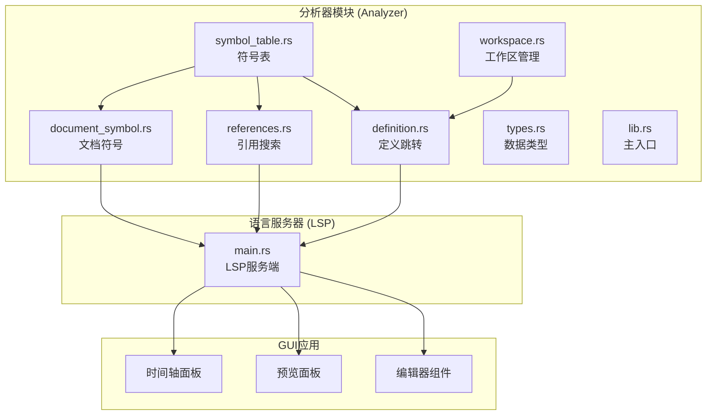

**图表来源**
- [crates/animatix-analyzer/src/definition.rs:1-93](file://crates/animatix-analyzer/src/definition.rs#L1-L93)
- [crates/animatix-analyzer/src/references.rs:1-46](file://crates/animatix-analyzer/src/references.rs#L1-L46)
- [crates/animatix-analyzer/src/document_symbol.rs:1-44](file://crates/animatix-analyzer/src/document_symbol.rs#L1-L44)
- [crates/animatix-lsp/src/main.rs:287-427](file://crates/animatix-lsp/src/main.rs#L287-L427)

**章节来源**
- [crates/animatix-analyzer/src/lib.rs:382-420](file://crates/animatix-analyzer/src/lib.rs#L382-L420)
- [crates/animatix-lsp/src/main.rs:287-427](file://crates/animatix-lsp/src/main.rs#L287-L427)

## 核心组件

### 符号表 (SymbolTable)

符号表是符号导航系统的核心数据结构，负责存储和管理所有符号信息。它包含了标签、组件、场景等不同类型的符号。

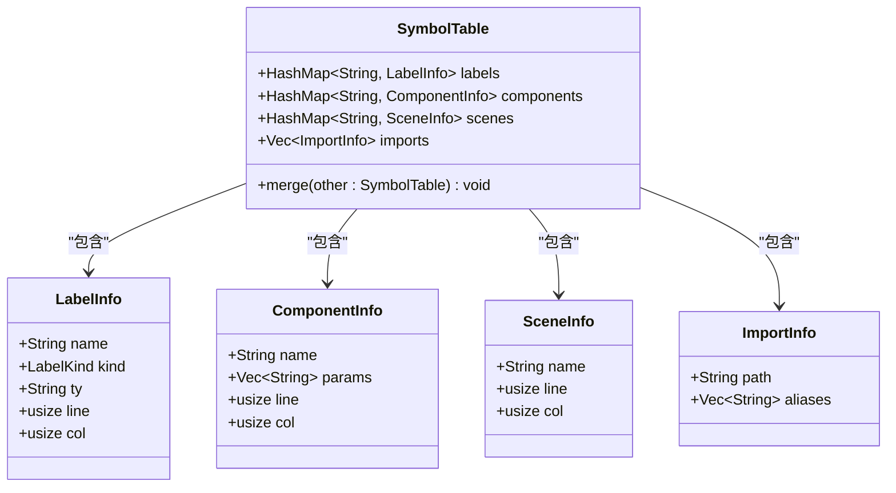

**图表来源**
- [crates/animatix-analyzer/src/symbol_table.rs:34-556](file://crates/animatix-analyzer/src/symbol_table.rs#L34-L556)

### 位置信息 (Location)

位置信息用于精确定位符号在源代码中的位置，支持跨文件跳转。

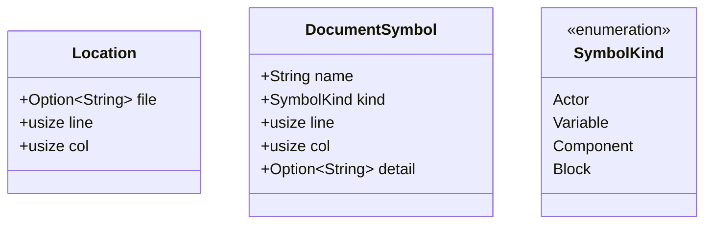

**图表来源**
- [crates/animatix-analyzer/src/types.rs:13-25](file://crates/animatix-analyzer/src/types.rs#L13-L25)
- [crates/animatix-analyzer/src/document_symbol.rs:1-44](file://crates/animatix-analyzer/src/document_symbol.rs#L1-L44)

**章节来源**
- [crates/animatix-analyzer/src/symbol_table.rs:34-556](file://crates/animatix-analyzer/src/symbol_table.rs#L34-L556)
- [crates/animatix-analyzer/src/types.rs:13-25](file://crates/animatix-analyzer/src/types.rs#L13-L25)

## 架构概览

符号导航系统的整体架构采用分层设计，从底层的语法解析到上层的应用集成形成了完整的符号处理链路。

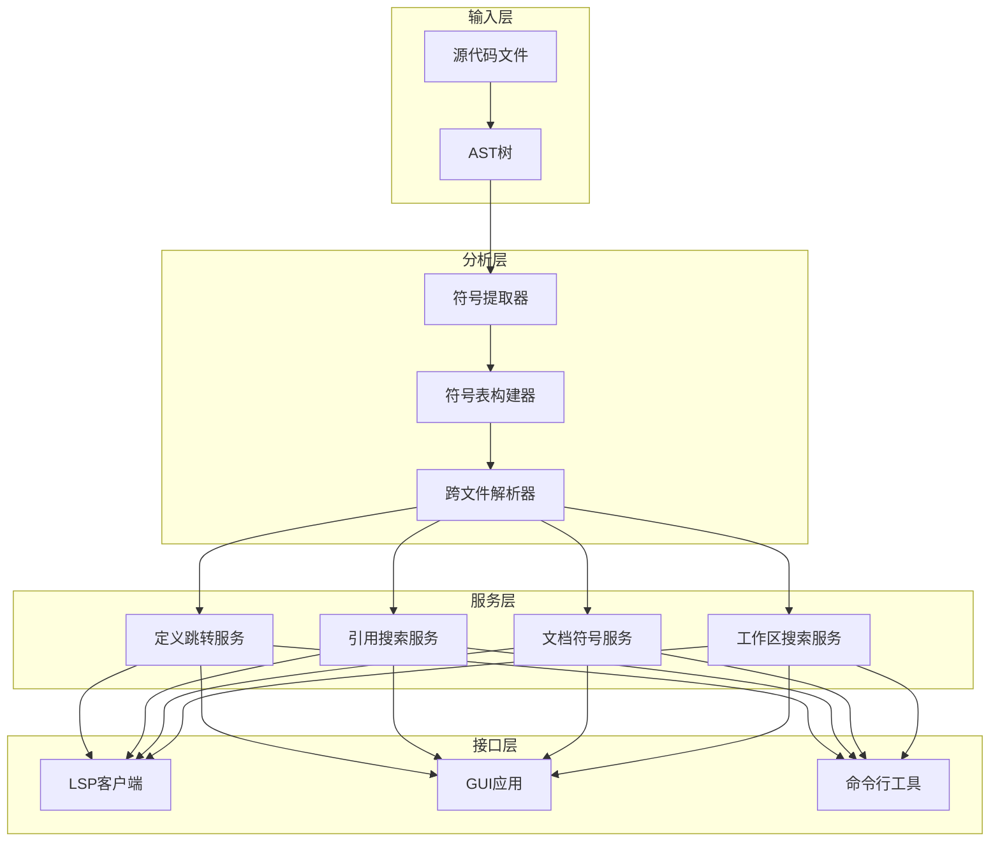

**图表来源**
- [crates/animatix-analyzer/src/lib.rs:382-420](file://crates/animatix-analyzer/src/lib.rs#L382-L420)
- [crates/animatix-lsp/src/main.rs:287-427](file://crates/animatix-lsp/src/main.rs#L287-L427)

## 详细组件分析

### 定义跳转功能 (goto_definition)

定义跳转功能是符号导航系统的核心特性，支持在同一文件内和跨文件的符号跳转。

#### 实现流程

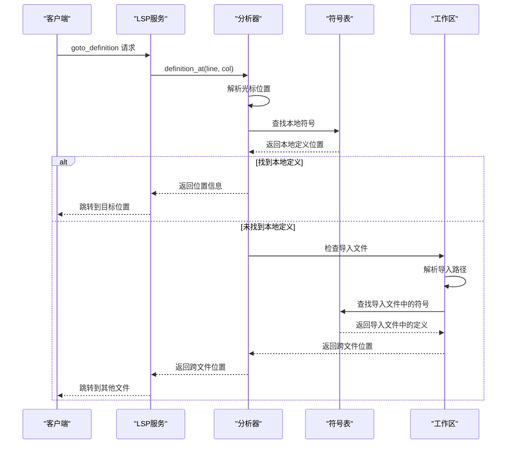

**图表来源**
- [crates/animatix-analyzer/src/definition.rs:10-93](file://crates/animatix-analyzer/src/definition.rs#L10-L93)
- [crates/animatix-lsp/src/main.rs:287-304](file://crates/animatix-lsp/src/main.rs#L287-L304)

#### 关键实现细节

定义跳转功能的核心逻辑包括以下几个步骤：

1. **位置解析**：根据行列坐标找到对应的语法节点
2. **符号识别**：验证节点是否为标识符类型
3. **本地查找**：在当前文件的符号表中查找符号定义
4. **跨文件查找**：如果本地未找到，在导入的文件中继续查找
5. **结果返回**：构建位置信息并返回给调用方

**章节来源**
- [crates/animatix-analyzer/src/definition.rs:10-93](file://crates/animatix-analyzer/src/definition.rs#L10-L93)
- [crates/animatix-analyzer/src/lib.rs:401-414](file://crates/animatix-analyzer/src/lib.rs#L401-L414)

### 符号查找机制

符号查找机制分为文档符号提取和工作区符号搜索两个层面。

#### 文档符号提取

文档符号提取负责生成可用于大纲视图的符号列表：

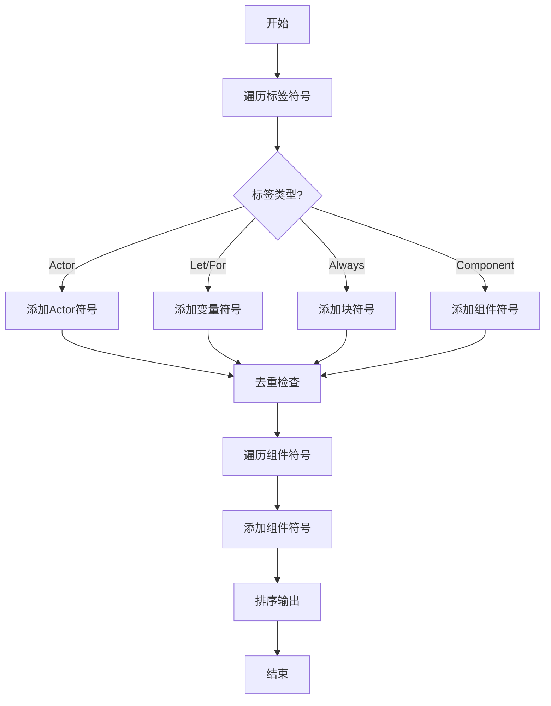

**图表来源**
- [crates/animatix-analyzer/src/document_symbol.rs:8-44](file://crates/animatix-analyzer/src/document_symbol.rs#L8-L44)

#### 工作区符号搜索

工作区符号搜索在整个项目范围内查找匹配的符号：

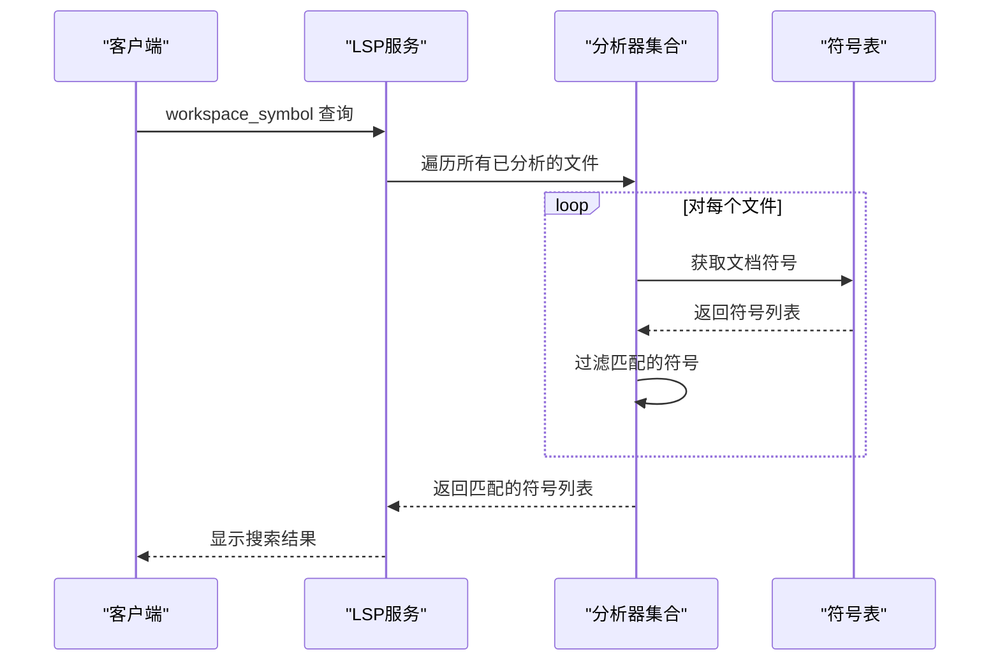

**图表来源**
- [crates/animatix-lsp/src/main.rs:347-393](file://crates/animatix-lsp/src/main.rs#L347-L393)

**章节来源**
- [crates/animatix-analyzer/src/document_symbol.rs:1-44](file://crates/animatix-analyzer/src/document_symbol.rs#L1-L44)
- [crates/animatix-lsp/src/main.rs:306-393](file://crates/animatix-lsp/src/main.rs#L306-L393)

### 引用搜索功能

引用搜索功能用于定位符号在代码中的所有使用位置。

#### 实现算法

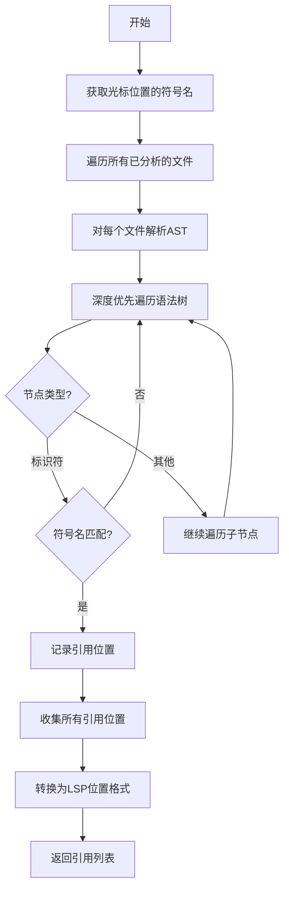

**图表来源**
- [crates/animatix-analyzer/src/references.rs:7-46](file://crates/animatix-analyzer/src/references.rs#L7-L46)
- [crates/animatix-lsp/src/main.rs:395-427](file://crates/animatix-lsp/src/main.rs#L395-L427)

#### 引用高亮显示

引用搜索不仅提供位置信息，还支持在编辑器中高亮显示所有引用位置，提升用户体验。

**章节来源**
- [crates/animatix-analyzer/src/references.rs:1-46](file://crates/animatix-analyzer/src/references.rs#L1-L46)
- [crates/animatix-lsp/src/main.rs:395-427](file://crates/animatix-lsp/src/main.rs#L395-L427)

### 符号信息数据结构

符号导航系统使用多种数据结构来表示和管理符号信息。

#### 符号表结构

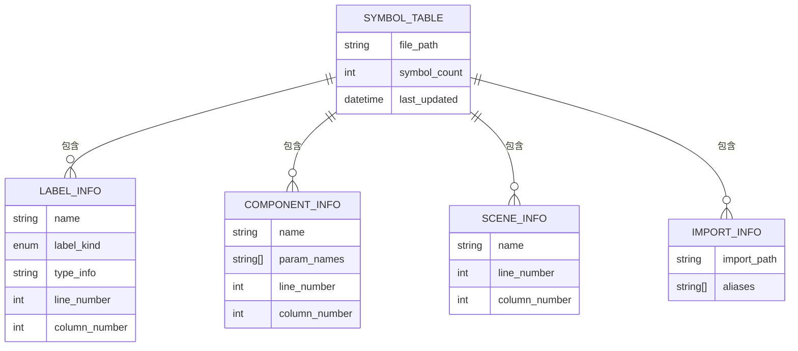

**图表来源**
- [crates/animatix-analyzer/src/symbol_table.rs:34-556](file://crates/animatix-analyzer/src/symbol_table.rs#L34-L556)

#### 位置信息结构

位置信息结构支持精确的符号定位：

| 字段 | 类型 | 描述 | 示例 |
|------|------|------|------|
| file | Option<String> | 文件路径（跨文件时） | Some("src/components/button.amx") |
| line | usize | 行号（从0开始） | 42 |
| col | usize | 列号（从0开始） | 15 |

**章节来源**
- [crates/animatix-analyzer/src/symbol_table.rs:34-556](file://crates/animatix-analyzer/src/symbol_table.rs#L34-L556)
- [crates/animatix-analyzer/src/types.rs:13-25](file://crates/animatix-analyzer/src/types.rs#L13-L25)

## 依赖关系分析

符号导航系统的依赖关系呈现清晰的层次结构，从底层的语法解析到上层的应用集成。

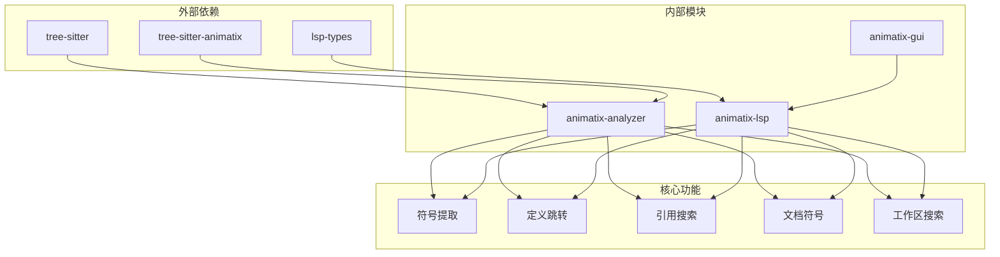

**图表来源**
- [crates/animatix-analyzer/src/lib.rs:382-420](file://crates/animatix-analyzer/src/lib.rs#L382-L420)
- [crates/animatix-lsp/src/main.rs:287-427](file://crates/animatix-lsp/src/main.rs#L287-L427)

**章节来源**
- [crates/animatix-analyzer/src/lib.rs:382-420](file://crates/animatix-analyzer/src/lib.rs#L382-L420)
- [crates/animatix-lsp/src/main.rs:287-427](file://crates/animatix-lsp/src/main.rs#L287-L427)

## 性能考虑

符号导航系统的性能优化是确保良好用户体验的关键因素。以下是主要的性能优化策略：

### 缓存策略

1. **符号表缓存**：符号表在文件修改前保持不变，避免重复解析
2. **AST缓存**：语法树在增量更新时进行局部重建
3. **工作区索引缓存**：工作区范围的符号搜索结果进行缓存

### 增量更新

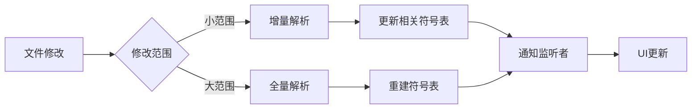

### 并行处理

- **多线程分析**：利用多核CPU并行分析多个文件
- **异步操作**：LSP请求采用异步处理模式
- **懒加载**：只在需要时加载和解析文件内容

### 内存优化

- **符号共享**：相同符号信息在内存中共享存储
- **字符串池**：使用字符串池减少内存占用
- **延迟计算**：复杂计算结果进行延迟计算和缓存

## 故障排除指南

### 常见问题及解决方案

#### 符号跳转失败

**问题描述**：点击符号无法跳转到定义位置

**可能原因**：
1. 符号未被正确解析到符号表
2. 跨文件导入路径解析失败
3. 位置信息计算错误

**解决步骤**：
1. 检查符号是否在符号表中存在
2. 验证导入文件的路径解析
3. 确认位置信息的行列坐标

#### 引用搜索不完整

**问题描述**：符号的引用位置没有完全显示

**可能原因**：
1. AST解析遗漏某些节点
2. 树遍历算法有缺陷
3. 符号名匹配规则不准确

**解决步骤**：
1. 检查AST节点类型识别
2. 验证递归遍历逻辑
3. 测试边界情况

#### 性能问题

**问题描述**：符号导航响应缓慢

**可能原因**：
1. 符号表过大导致查找慢
2. 缺少适当的缓存机制
3. 多线程同步开销大

**解决步骤**：
1. 实施符号表分片存储
2. 添加适当的缓存层
3. 优化并发访问模式

**章节来源**
- [crates/animatix-analyzer/src/definition.rs:10-93](file://crates/animatix-analyzer/src/definition.rs#L10-L93)
- [crates/animatix-analyzer/src/references.rs:18-46](file://crates/animatix-analyzer/src/references.rs#L18-L46)

## 结论

符号导航系统为动画制作软件提供了强大的代码导航能力。通过精心设计的架构和优化的算法，系统能够在大型项目中提供快速、准确的符号导航体验。

### 主要优势

1. **全面的符号支持**：支持标签、组件、场景等多种符号类型
2. **跨文件导航**：无缝支持同一项目内的文件间跳转
3. **高性能实现**：通过缓存和增量更新确保响应速度
4. **可扩展架构**：模块化设计便于功能扩展和维护

### 未来发展方向

1. **智能预测**：基于使用模式提供符号使用预测
2. **可视化增强**：提供更丰富的符号关系可视化
3. **协作支持**：支持多人协作环境下的符号导航
4. **移动端适配**：优化移动端的符号导航体验

该系统为动画制作流程提供了坚实的技术基础，通过持续的优化和改进，将进一步提升用户的创作效率和体验质量。