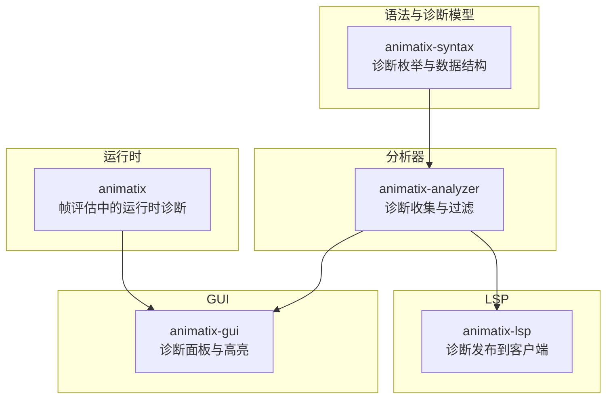
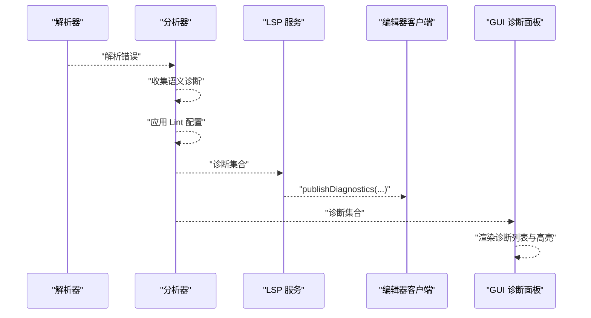
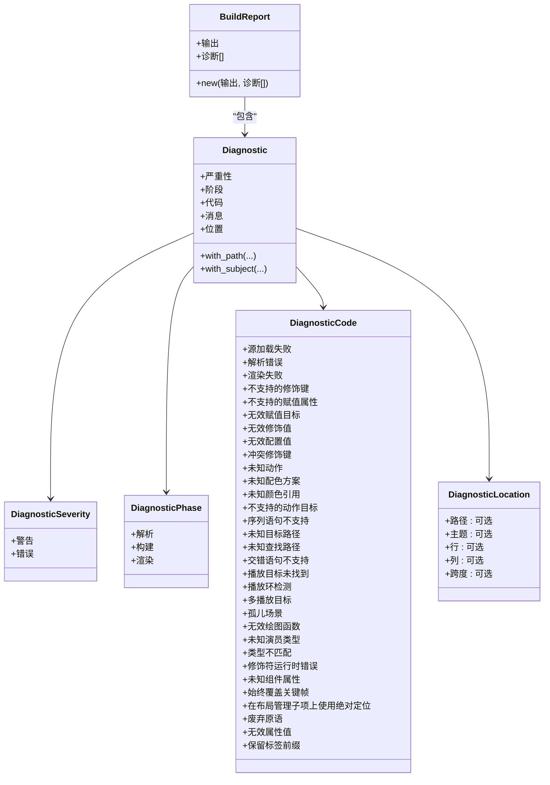
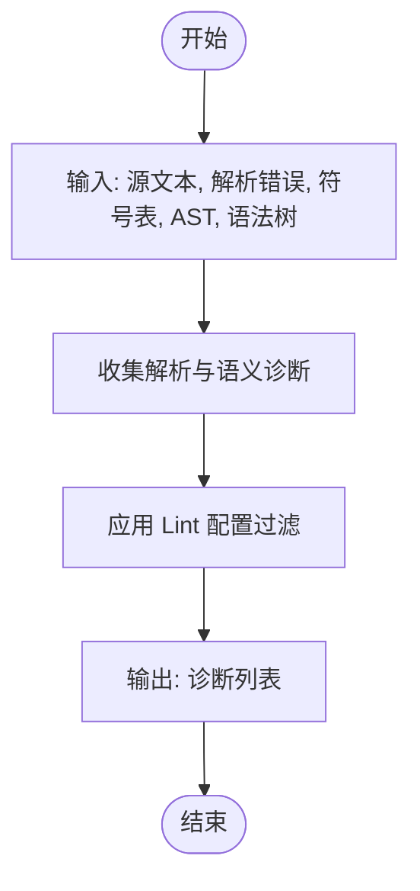
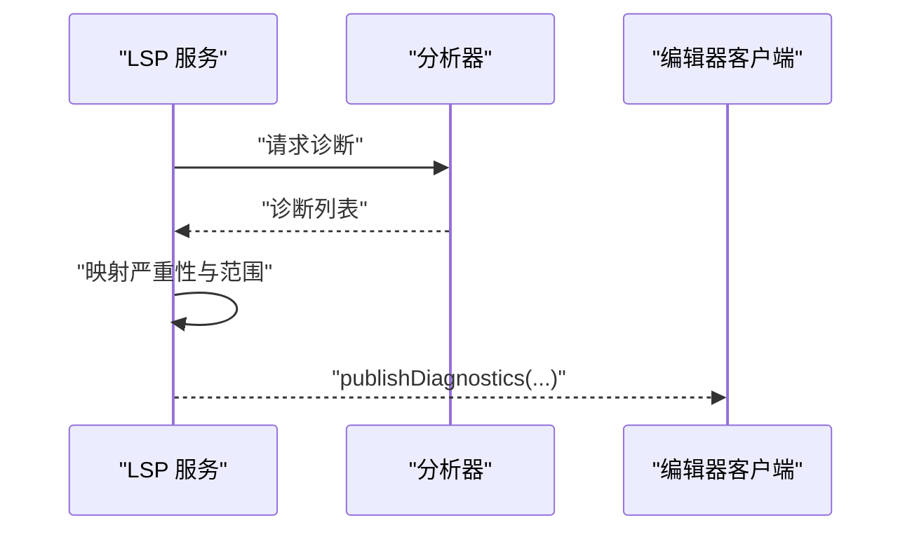
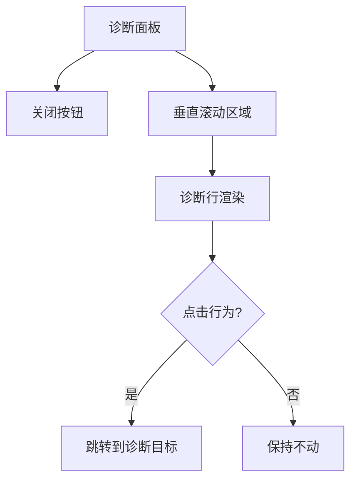
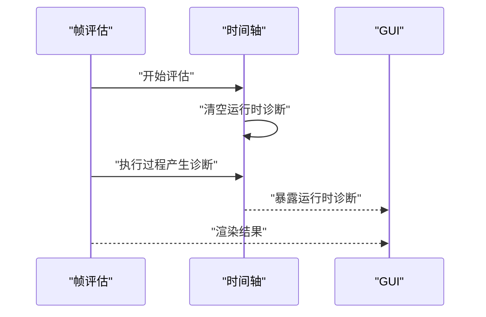
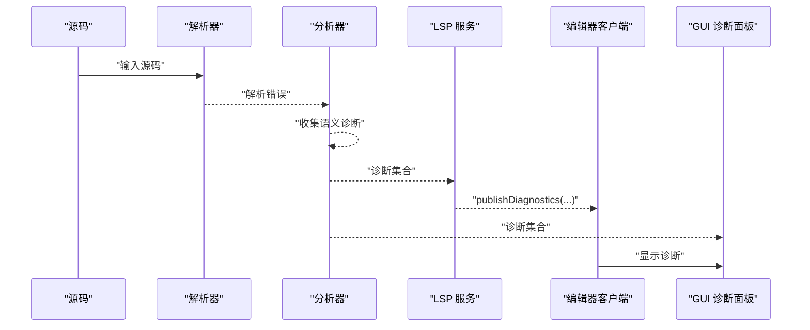
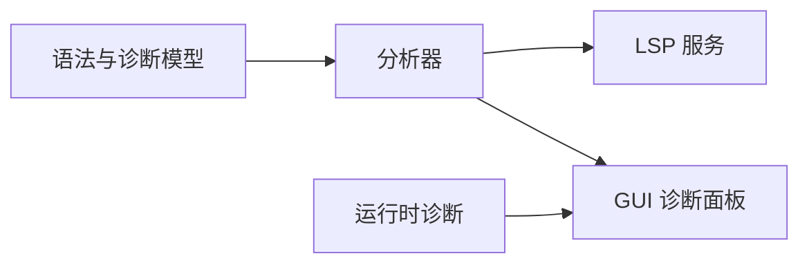

# 诊断系统 API

<cite>
**本文引用的文件**
- [crates/animatix-syntax/src/diagnostics.rs](file://crates/animatix-syntax/src/diagnostics.rs)
- [crates/animatix-analyzer/src/diagnostics.rs](file://crates/animatix-analyzer/src/diagnostics.rs)
- [crates/animatix/src/main.rs](file://crates/animatix/src/main.rs)
- [crates/animatix/src/timeline/mod.rs](file://crates/animatix/src/timeline/mod.rs)
- [crates/animatix-gui/src/app/components/diagnostics.rs](file://crates/animatix-gui/src/app/components/diagnostics.rs)
- [crates/animatix-gui/src/editor/diagnostics.rs](file://crates/animatix-gui/src/editor/diagnostics.rs)
- [crates/animatix-lsp/src/main.rs](file://crates/animatix-lsp/src/main.rs)
</cite>

## 目录
1. [简介](#简介)
2. [项目结构](#项目结构)
3. [核心组件](#核心组件)
4. [架构总览](#架构总览)
5. [详细组件分析](#详细组件分析)
6. [依赖关系分析](#依赖关系分析)
7. [性能考量](#性能考量)
8. [故障排除指南](#故障排除指南)
9. [结论](#结论)
10. [附录](#附录)

## 简介
本文件为动画系统诊断子系统的完整 API 文档，覆盖诊断信息的生成与发布机制，涵盖语法错误、类型错误、语义警告等不同严重性级别，并说明诊断范围（起止位置）的确定方式、数据结构定义、LSP 映射关系、GUI 展示与交互、以及性能优化与增量更新策略。同时提供常见问题排查建议与实践示例。

## 项目结构
诊断系统横跨多个子模块：
- 语法与诊断模型：在语法层定义诊断严重性、阶段、代码与位置信息
- 分析器：收集解析与语义阶段的诊断，支持 Lint 配置过滤
- LSP：将内部诊断映射到 LSP 类型并发布到客户端
- GUI：在编辑器面板中展示诊断列表、高亮与导航
- 运行时：在帧评估过程中累积运行时诊断并在每帧重置

图表来源
- [crates/animatix-syntax/src/diagnostics.rs](file://crates/animatix-syntax/src/diagnostics.rs)
- [crates/animatix-analyzer/src/diagnostics.rs](file://crates/animatix-analyzer/src/diagnostics.rs)
- [crates/animatix-lsp/src/main.rs](file://crates/animatix-lsp/src/main.rs)
- [crates/animatix-gui/src/app/components/diagnostics.rs](file://crates/animatix-gui/src/app/components/diagnostics.rs)
- [crates/animatix/src/timeline/mod.rs](file://crates/animatix/src/timeline/mod.rs)

章节来源
- [crates/animatix-syntax/src/diagnostics.rs](file://crates/animatix-syntax/src/diagnostics.rs)
- [crates/animatix-analyzer/src/diagnostics.rs](file://crates/animatix-analyzer/src/diagnostics.rs)
- [crates/animatix-lsp/src/main.rs](file://crates/animatix-lsp/src/main.rs)
- [crates/animatix-gui/src/app/components/diagnostics.rs](file://crates/animatix-gui/src/app/components/diagnostics.rs)
- [crates/animatix/src/timeline/mod.rs](file://crates/animatix/src/timeline/mod.rs)

## 核心组件
- 诊断严重性与阶段
  - 严重性：错误、警告
  - 阶段：解析、构建、渲染
- 诊断代码：唯一机器可读标识，用于分组、过滤与 LSP 发布
- 诊断位置：包含源路径、主题标识、1 基行列号（字符偏移）、字节跨度
- 诊断实体：包含严重性、阶段、代码、消息与位置
- 构建报告：对诊断进行去重（按代码、消息、主题）
- 诊断汇总：按阶段统计警告与错误数量
- Lint 配置：支持禁用特定代码或全部警告
- 运行时诊断：帧评估期间累积，每帧重置

章节来源
- [crates/animatix-syntax/src/diagnostics.rs](file://crates/animatix-syntax/src/diagnostics.rs)
- [crates/animatix-analyzer/src/diagnostics.rs](file://crates/animatix-analyzer/src/diagnostics.rs)

## 架构总览
诊断从“语法与诊断模型”出发，经“分析器”收集与过滤，再通过“LSP”发布到编辑器客户端，同时在“GUI”中以面板形式呈现；运行时在“帧评估”中产生额外诊断。

图表来源
- [crates/animatix-analyzer/src/diagnostics.rs](file://crates/animatix-analyzer/src/diagnostics.rs)
- [crates/animatix-lsp/src/main.rs](file://crates/animatix-lsp/src/main.rs)
- [crates/animatix-gui/src/app/components/diagnostics.rs](file://crates/animatix-gui/src/app/components/diagnostics.rs)

## 详细组件分析

### 诊断数据模型与 API
- 诊断严重性与阶段
  - 严重性：错误、警告
  - 阶段：解析、构建、渲染
- 诊断代码
  - 覆盖源加载失败、解析错误、渲染失败、修饰符/配置无效、未知动作/颜色方案/颜色引用、目标路径/查找路径未知、序列/交错语句不支持、播放循环/孤儿场景、绘图函数无效、未知演员类型、类型不匹配、修饰符运行时错误、组件属性未知、绝对定位冲突、废弃原语、属性值无效、保留标签前缀等
- 诊断位置
  - 支持附加源路径、主题标识、1 基行列号（字符级偏移）、字节跨度
- 诊断实体
  - 提供构造方法（错误/警告），支持链式附加路径与主题
- 构建报告
  - 按（代码、消息、主题）去重，避免重复告警
- 诊断汇总
  - 按阶段统计并格式化输出

图表来源
- [crates/animatix-syntax/src/diagnostics.rs](file://crates/animatix-syntax/src/diagnostics.rs)

章节来源
- [crates/animatix-syntax/src/diagnostics.rs](file://crates/animatix-syntax/src/diagnostics.rs)

### 诊断收集与过滤（分析器）
- 收集入口
  - 接收源文本、解析错误、符号表、AST、树形语法树，返回诊断列表
- 语义诊断
  - 示例：重复标签检查，生成警告并标注起止行列
- Lint 过滤
  - 不会抑制错误
  - 若开启“禁用全部警告”，则过滤掉所有警告
  - 若指定禁用代码，则过滤对应警告
- 输出
  - 返回过滤后的诊断列表

图表来源
- [crates/animatix-analyzer/src/diagnostics.rs](file://crates/animatix-analyzer/src/diagnostics.rs)

章节来源
- [crates/animatix-analyzer/src/diagnostics.rs](file://crates/animatix-analyzer/src/diagnostics.rs)

### LSP 诊断发布
- 从分析器获取诊断
- 将内部严重性映射为 LSP 严重性（错误、警告、信息、提示）
- 将行列转换为 LSP Position/Range
- 发布到客户端

图表来源
- [crates/animatix-lsp/src/main.rs](file://crates/animatix-lsp/src/main.rs)

章节来源
- [crates/animatix-lsp/src/main.rs](file://crates/animatix-lsp/src/main.rs)

### GUI 诊断展示与交互
- 诊断面板
  - 右侧关闭按钮
  - 垂直滚动区域，逐条显示诊断
  - 最后一项可点击跳转到诊断目标
- 行为
  - 点击行可触发导航至源码位置或相关元素
  - 支持折叠与滚动查看更多

图表来源
- [crates/animatix-gui/src/app/components/diagnostics.rs](file://crates/animatix-gui/src/app/components/diagnostics.rs)

章节来源
- [crates/animatix-gui/src/app/components/diagnostics.rs](file://crates/animatix-gui/src/app/components/diagnostics.rs)

### 运行时诊断（帧评估）
- 在帧评估开始前清空运行时诊断
- 在执行过程中累积诊断（如修饰符错误）
- 渲染阶段结束后可读取并参与 GUI 展示

图表来源
- [crates/animatix/src/timeline/mod.rs](file://crates/animatix/src/timeline/mod.rs)

章节来源
- [crates/animatix/src/timeline/mod.rs](file://crates/animatix/src/timeline/mod.rs)

### 诊断范围与位置计算
- 字符级偏移
  - 列号为字符（grapheme）偏移，非字节偏移
  - 从字节跨度转换时需考虑多字节 UTF-8
- 起止位置
  - 由行、列与结束行、结束列共同决定
  - 用于 LSP 范围映射与 GUI 高亮

章节来源
- [crates/animatix-syntax/src/diagnostics.rs](file://crates/animatix-syntax/src/diagnostics.rs)

### 诊断严重性与 LSP 映射
- 内部严重性：错误、警告
- LSP 映射：错误、警告、信息、提示
- 具体映射逻辑见 LSP 发布流程

章节来源
- [crates/animatix-lsp/src/main.rs](file://crates/animatix-lsp/src/main.rs)

### 诊断生成与发布流程（端到端）

图表来源
- [crates/animatix-analyzer/src/diagnostics.rs](file://crates/animatix-analyzer/src/diagnostics.rs)
- [crates/animatix-lsp/src/main.rs](file://crates/animatix-lsp/src/main.rs)
- [crates/animatix-gui/src/app/components/diagnostics.rs](file://crates/animatix-gui/src/app/components/diagnostics.rs)

## 依赖关系分析
- 语法与诊断模型
  - 定义严重性、阶段、代码、位置与诊断实体
- 分析器
  - 依赖语法模型与符号表，产出诊断并支持 Lint 过滤
- LSP
  - 依赖分析器输出，负责与编辑器通信
- GUI
  - 依赖分析器与运行时诊断，负责可视化与交互
- 运行时
  - 与 GUI 协作，提供帧评估期间的诊断

图表来源
- [crates/animatix-syntax/src/diagnostics.rs](file://crates/animatix-syntax/src/diagnostics.rs)
- [crates/animatix-analyzer/src/diagnostics.rs](file://crates/animatix-analyzer/src/diagnostics.rs)
- [crates/animatix-lsp/src/main.rs](file://crates/animatix-lsp/src/main.rs)
- [crates/animatix-gui/src/app/components/diagnostics.rs](file://crates/animatix-gui/src/app/components/diagnostics.rs)
- [crates/animatix/src/timeline/mod.rs](file://crates/animatix/src/timeline/mod.rs)

章节来源
- [crates/animatix-syntax/src/diagnostics.rs](file://crates/animatix-syntax/src/diagnostics.rs)
- [crates/animatix-analyzer/src/diagnostics.rs](file://crates/animatix-analyzer/src/diagnostics.rs)
- [crates/animatix-lsp/src/main.rs](file://crates/animatix-lsp/src/main.rs)
- [crates/animatix-gui/src/app/components/diagnostics.rs](file://crates/animatix-gui/src/app/components/diagnostics.rs)
- [crates/animatix/src/timeline/mod.rs](file://crates/animatix/src/timeline/mod.rs)

## 性能考量
- 诊断去重
  - 构建报告按（代码、消息、主题）去重，减少重复告警
- Lint 过滤
  - 在分析阶段尽早过滤，降低后续处理成本
- 范围计算
  - 使用字符级偏移与正确的字节到字符转换，避免额外开销
- 增量更新
  - 建议基于源码哈希与版本控制进行增量重建，仅对受影响部分重新分析
  - 运行时诊断每帧重置，避免累积导致内存膨胀
- GUI 渲染
  - 限制面板最大高度与滚动区域，避免大量诊断导致渲染卡顿

章节来源
- [crates/animatix-syntax/src/diagnostics.rs](file://crates/animatix-syntax/src/diagnostics.rs)
- [crates/animatix-analyzer/src/diagnostics.rs](file://crates/animatix-analyzer/src/diagnostics.rs)
- [crates/animatix/src/timeline/mod.rs](file://crates/animatix/src/timeline/mod.rs)

## 故障排除指南
- 诊断未出现在 LSP
  - 检查分析器是否正确返回诊断
  - 确认 LSP 发布流程中的严重性映射与范围转换
- 诊断被误过滤
  - 检查 Lint 配置是否启用了“禁用全部警告”
  - 检查是否禁用了特定诊断代码
- GUI 不显示诊断
  - 确认诊断已传入 GUI 组件
  - 检查面板可见性与滚动区域设置
- 运行时诊断未出现
  - 确认帧评估开始前已清空运行时诊断
  - 检查诊断是否在执行过程中正确累积

章节来源
- [crates/animatix-lsp/src/main.rs](file://crates/animatix-lsp/src/main.rs)
- [crates/animatix-gui/src/app/components/diagnostics.rs](file://crates/animatix-gui/src/app/components/diagnostics.rs)
- [crates/animatix/src/timeline/mod.rs](file://crates/animatix/src/timeline/mod.rs)

## 结论
该诊断系统以清晰的数据模型为基础，结合分析器的收集与过滤、LSP 的发布与 GUI 的展示，形成了从源码到编辑器反馈的闭环。通过去重、Lint 过滤与增量更新策略，系统在准确性与性能之间取得平衡。运行时诊断进一步完善了调试体验，使开发者能够快速定位问题。

## 附录

### 诊断 API 速查
- 创建诊断
  - 错误：[Diagnostic::error](file://crates/animatix-syntax/src/diagnostics.rs)
  - 警告：[Diagnostic::warning](file://crates/animatix-syntax/src/diagnostics.rs)
  - 附加路径：[Diagnostic::with_path](file://crates/animatix-syntax/src/diagnostics.rs)
  - 附加主题：[Diagnostic::with_subject](file://crates/animatix-syntax/src/diagnostics.rs)
- 构建报告去重：[BuildReport::new](file://crates/animatix-syntax/src/diagnostics.rs)
- 诊断汇总：[diagnostics_summary_by_phase](file://crates/animatix-syntax/src/diagnostics.rs)
- LSP 发布：[publish_diagnostics](file://crates/animatix-lsp/src/main.rs)
- GUI 展示：[诊断面板组件](file://crates/animatix-gui/src/app/components/diagnostics.rs)
- 运行时诊断：[帧评估中的运行时诊断字段](file://crates/animatix/src/timeline/mod.rs)

### 示例参考
- 诊断 JSON 序列化（命令行/日志）：[diagnostic_to_json/print_build_diagnostics](file://crates/animatix/src/main.rs)
- 语义诊断示例（重复标签）：[collect_semantic_diagnostics](file://crates/animatix-analyzer/src/diagnostics.rs)
- GUI 诊断行渲染与点击行为：[diagnostic_row](file://crates/animatix-gui/src/app/components/diagnostics.rs)