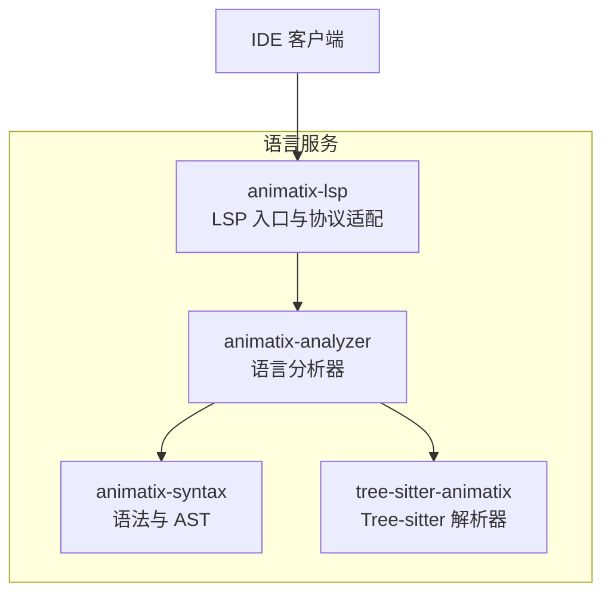
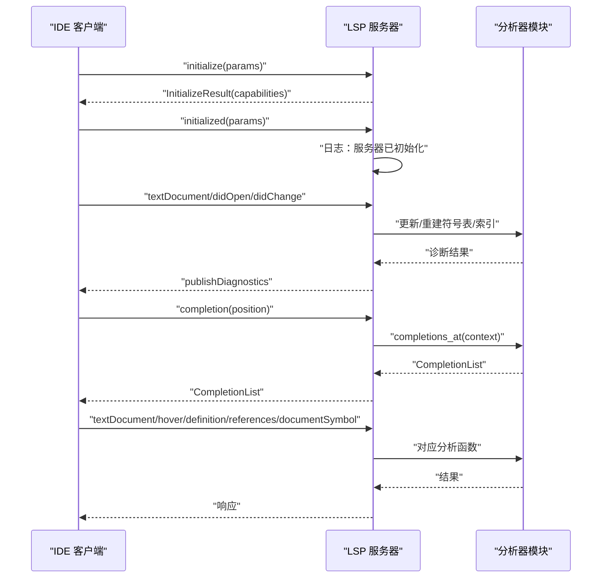
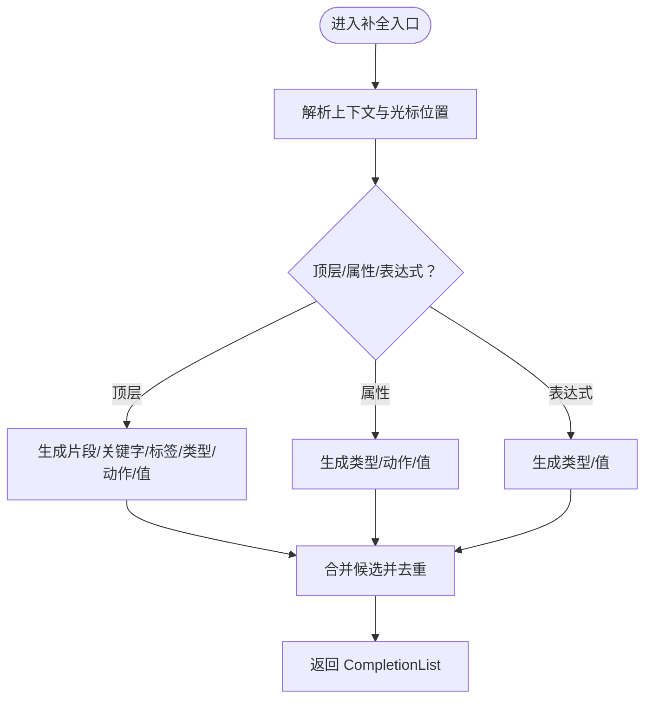
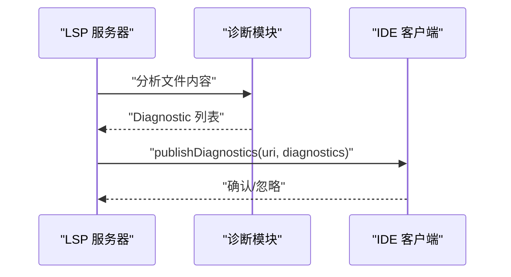
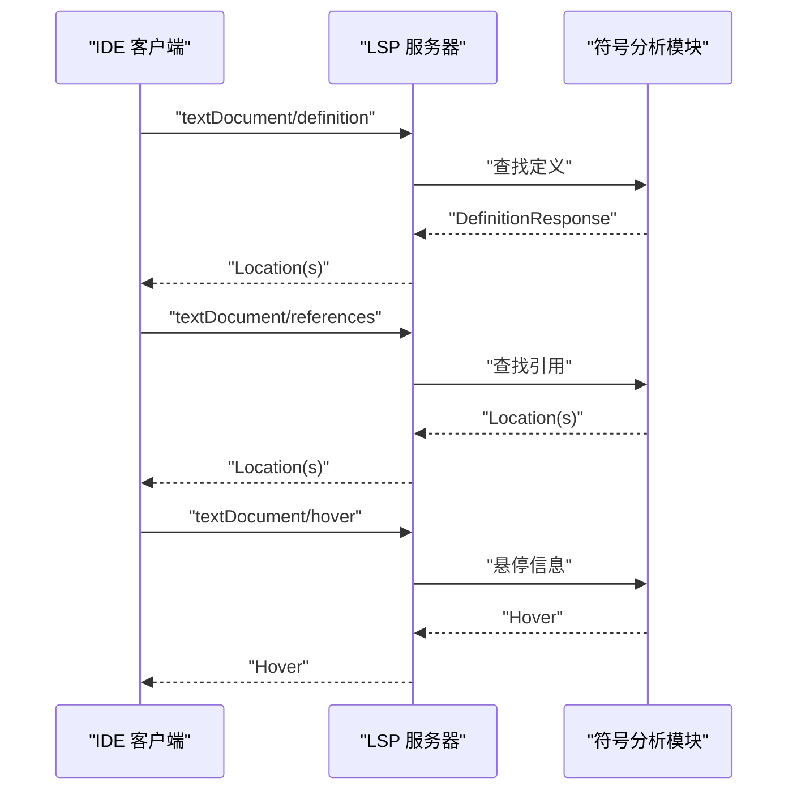
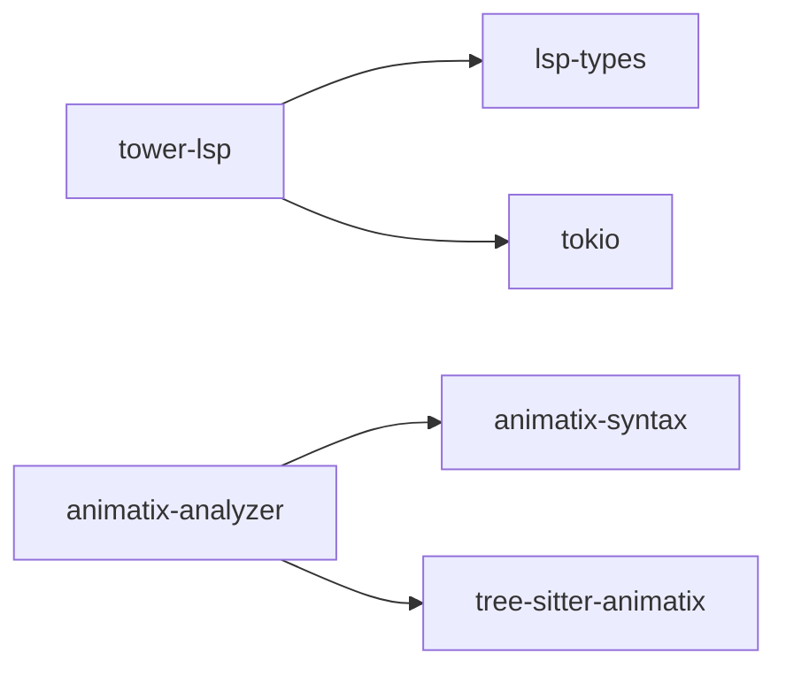

# 语言服务 API

<cite>
**本文引用的文件**
- [crates/animatix-lsp/src/main.rs](file://crates/animatix-lsp/src/main.rs)
- [crates/animatix-analyzer/src/completer.rs](file://crates/animatix-analyzer/src/completer.rs)
- [crates/animatix-analyzer/src/definition.rs](file://crates/animatix-analyzer/src/definition.rs)
- [crates/animatix-analyzer/src/diagnostics.rs](file://crates/animatix-analyzer/src/diagnostics.rs)
- [crates/animatix-analyzer/src/document_symbol.rs](file://crates/animatix-analyzer/src/document_symbol.rs)
- [crates/animatix-analyzer/src/hover.rs](file://crates/animatix-analyzer/src/hover.rs)
- [crates/animatix-analyzer/src/references.rs](file://crates/animatix-analyzer/src/references.rs)
- [crates/animatix-analyzer/src/workspace.rs](file://crates/animatix-analyzer/src/workspace.rs)
- [Cargo.toml](file://Cargo.toml)
- [Cargo.lock](file://Cargo.lock)
</cite>

## 目录
1. [简介](#简介)
2. [项目结构](#项目结构)
3. [核心组件](#核心组件)
4. [架构总览](#架构总览)
5. [详细组件分析](#详细组件分析)
6. [依赖关系分析](#依赖关系分析)
7. [性能考量](#性能考量)
8. [故障排查指南](#故障排查指南)
9. [结论](#结论)
10. [附录](#附录)

## 简介
本文件为 Animatix 语言服务的完整 API 文档，聚焦于 LSP（Language Server Protocol）接口与相关能力，覆盖以下方面：
- 连接建立与初始化：服务器能力声明、消息通道与生命周期事件
- 消息处理与响应格式：基于 LSP 类型的请求/响应模型
- 代码补全 API：触发机制、候选项生成与插入逻辑
- 诊断系统 API：错误检测、警告信息与修复建议
- 符号导航 API：定义跳转、引用搜索与符号重命名
- 工作区管理 API：文件监听、项目索引与缓存策略
- IDE 集成指南与客户端实现要点

本语言服务以 Rust 实现，使用 tower-lsp 提供 LSP 能力，并通过独立 crate 暴露分析器功能（如补全、诊断、符号等），由 LSP 适配层统一对外。

## 项目结构
Animatix 语言服务由多个 crate 组成，其中与 LSP 和语言分析直接相关的核心模块如下：
- animatix-lsp：LSP 入口与协议适配，负责连接建立、能力声明与消息分发
- animatix-analyzer：语言分析核心，提供补全、诊断、定义、引用、悬停、文档符号等能力
- animatix-syntax：语法解析与 AST 支持，为分析器提供基础数据结构
- tree-sitter-animatix：Tree-sitter 解析器，用于增量解析与高亮查询

图表来源
- [crates/animatix-lsp/src/main.rs:141-173](file://crates/animatix-lsp/src/main.rs#L141-L173)
- [crates/animatix-analyzer/src/completer.rs:82-692](file://crates/animatix-analyzer/src/completer.rs#L82-L692)
- [crates/animatix-analyzer/src/diagnostics.rs](file://crates/animatix-analyzer/src/diagnostics.rs)
- [crates/animatix-analyzer/src/definition.rs](file://crates/animatix-analyzer/src/definition.rs)
- [crates/animatix-analyzer/src/references.rs](file://crates/animatix-analyzer/src/references.rs)
- [crates/animatix-analyzer/src/document_symbol.rs](file://crates/animatix-analyzer/src/document_symbol.rs)
- [crates/animatix-analyzer/src/hover.rs](file://crates/animatix-analyzer/src/hover.rs)

章节来源
- [crates/animatix-lsp/src/main.rs:141-173](file://crates/animatix-lsp/src/main.rs#L141-L173)
- [Cargo.toml](file://Cargo.toml)

## 核心组件
- LSP 后端与能力声明
  - 初始化返回 ServerCapabilities，声明文本同步模式、补全提供者、悬停、定义、文档符号、工作区符号、引用等能力
  - 声明补全触发字符集（如冒号、点、空格）
- 分析器子模块
  - 补全：根据上下文生成关键字、标签、类型、动作、值、片段等候选
  - 诊断：从语法与类型检查结果生成诊断项
  - 定义：定位符号在源码中的定义位置
  - 引用：查找符号的所有引用位置
  - 悬停：提供符号的简要描述或类型信息
  - 文档符号：提取文档级符号以便“打开符号”快速导航
  - 工作区：维护工作区范围内的文件索引与变更

章节来源
- [crates/animatix-lsp/src/main.rs:141-173](file://crates/animatix-lsp/src/main.rs#L141-L173)
- [crates/animatix-analyzer/src/completer.rs:82-692](file://crates/animatix-analyzer/src/completer.rs#L82-L692)
- [crates/animatix-analyzer/src/diagnostics.rs](file://crates/animatix-analyzer/src/diagnostics.rs)
- [crates/animatix-analyzer/src/definition.rs](file://crates/animatix-analyzer/src/definition.rs)
- [crates/animatix-analyzer/src/references.rs](file://crates/animatix-analyzer/src/references.rs)
- [crates/animatix-analyzer/src/document_symbol.rs](file://crates/animatix-analyzer/src/document_symbol.rs)
- [crates/animatix-analyzer/src/hover.rs](file://crates/animatix-analyzer/src/hover.rs)

## 架构总览
下图展示 LSP 服务器与客户端之间的交互流程，以及分析器各模块如何被调用：

图表来源
- [crates/animatix-lsp/src/main.rs:141-173](file://crates/animatix-lsp/src/main.rs#L141-L173)
- [crates/animatix-analyzer/src/completer.rs:82-692](file://crates/animatix-analyzer/src/completer.rs#L82-L692)
- [crates/animatix-analyzer/src/diagnostics.rs](file://crates/animatix-analyzer/src/diagnostics.rs)
- [crates/animatix-analyzer/src/definition.rs](file://crates/animatix-analyzer/src/definition.rs)
- [crates/animatix-analyzer/src/references.rs](file://crates/animatix-analyzer/src/references.rs)
- [crates/animatix-analyzer/src/document_symbol.rs](file://crates/animatix-analyzer/src/document_symbol.rs)
- [crates/animatix-analyzer/src/hover.rs](file://crates/animatix-analyzer/src/hover.rs)

## 详细组件分析

### LSP 连接与初始化
- 连接建立
  - 使用 LspService::new 创建服务实例，绑定 Backend::new 构造器
  - 通过 Server::new 将标准输入输出与服务绑定，启动消息循环
- 初始化流程
  - initialize 返回 ServerCapabilities，声明文本同步方式（全文同步）、补全触发字符、悬停、定义、文档符号、工作区符号、引用等能力
  - initialized 触发后记录 INFO 日志，表示服务器已就绪
- URI 处理
  - 提供 uri_to_path 辅助函数，将 file:// URI 转换为本地路径，便于文件系统操作

章节来源
- [crates/animatix-lsp/src/main.rs:141-173](file://crates/animatix-lsp/src/main.rs#L141-L173)
- [crates/animatix-lsp/src/main.rs:472-485](file://crates/animatix-lsp/src/main.rs#L472-L485)

### 代码补全 API
- 触发机制
  - 通过 initialize 中的 CompletionOptions 声明触发字符集（例如冒号、点、空格）
  - 客户端在这些字符处或光标位置触发 completion 请求
- 候选项生成
  - 根据上下文在不同作用域内生成候选：
    - 片段（snippets）
    - 关键字（keywords）
    - 标签（labels）
    - 类型（types）
    - 动作（actions）
    - 值（values）
  - 在顶层上下文时，优先包含常用片段与关键字；在属性/表达式上下文中，按需扩展类型、动作等
- 插入逻辑
  - 候选项包含 label、kind、insertText 等字段，客户端据此进行插入与编辑
  - 分析器还支持 resolve_provider（当前关闭），可按需补充详情

图表来源
- [crates/animatix-analyzer/src/completer.rs:82-692](file://crates/animatix-analyzer/src/completer.rs#L82-L692)

章节来源
- [crates/animatix-lsp/src/main.rs:141-173](file://crates/animatix-lsp/src/main.rs#L141-L173)
- [crates/animatix-analyzer/src/completer.rs:82-692](file://crates/animatix-analyzer/src/completer.rs#L82-L692)

### 诊断系统 API
- 错误检测与警告
  - 诊断模块从语法与类型检查结果中提取问题，生成带严重级别（错误/警告/信息）的诊断项
  - 诊断项包含范围（range）、标题（title）、消息（message）与可选修复建议
- 发布与刷新
  - 服务器通过 client.publish_diagnostics 将诊断推送给客户端
  - 文件变更时重新计算并发布最新诊断

图表来源
- [crates/animatix-lsp/src/main.rs:141-144](file://crates/animatix-lsp/src/main.rs#L141-L144)
- [crates/animatix-analyzer/src/diagnostics.rs](file://crates/animatix-analyzer/src/diagnostics.rs)

章节来源
- [crates/animatix-lsp/src/main.rs:141-144](file://crates/animatix-lsp/src/main.rs#L141-L144)
- [crates/animatix-analyzer/src/diagnostics.rs](file://crates/animatix-analyzer/src/diagnostics.rs)

### 符号导航 API
- 定义跳转
  - definition 接口返回符号定义位置（URI + range），支持 OneOf::Left(true) 能力声明
- 引用搜索
  - references 接口返回所有引用该符号的位置集合
- 文档符号与工作区符号
  - document_symbol 提供文档级符号树，便于“打开符号”
  - workspace_symbol 提供工作区内符号列表，便于全局搜索
- 悬停信息
  - hover 提供符号的简要描述或类型信息，提升阅读体验

图表来源
- [crates/animatix-lsp/src/main.rs:141-173](file://crates/animatix-lsp/src/main.rs#L141-L173)
- [crates/animatix-analyzer/src/definition.rs](file://crates/animatix-analyzer/src/definition.rs)
- [crates/animatix-analyzer/src/references.rs](file://crates/animatix-analyzer/src/references.rs)
- [crates/animatix-analyzer/src/document_symbol.rs](file://crates/animatix-analyzer/src/document_symbol.rs)
- [crates/animatix-analyzer/src/hover.rs](file://crates/animatix-analyzer/src/hover.rs)

章节来源
- [crates/animatix-lsp/src/main.rs:141-173](file://crates/animatix-lsp/src/main.rs#L141-L173)
- [crates/animatix-analyzer/src/definition.rs](file://crates/animatix-analyzer/src/definition.rs)
- [crates/animatix-analyzer/src/references.rs](file://crates/animatix-analyzer/src/references.rs)
- [crates/animatix-analyzer/src/document_symbol.rs](file://crates/animatix-analyzer/src/document_symbol.rs)
- [crates/animatix-analyzer/src/hover.rs](file://crates/animatix-analyzer/src/hover.rs)

### 工作区管理 API
- 文件监听与变更
  - 通过 didOpen/didChange 等通知更新内存中的符号表与索引
- 项目索引
  - 工作区模块维护跨文件的符号索引，支持工作区范围内的符号查询与导航
- 缓存策略
  - 对频繁访问的数据（如符号表、AST、诊断）采用缓存，减少重复计算
  - 文件变更时失效相关缓存并触发增量更新

章节来源
- [crates/animatix-analyzer/src/workspace.rs](file://crates/animatix-analyzer/src/workspace.rs)
- [crates/animatix-analyzer/src/completer.rs:82-692](file://crates/animatix-analyzer/src/completer.rs#L82-L692)

## 依赖关系分析
- LSP 协议栈
  - 使用 lsp-types 作为 LSP 数据类型与序列化基础
  - 使用 tower-lsp 提供 LSP 服务框架与 JSON-RPC 通信
- 语言分析依赖
  - animatix-analyzer 依赖 animatix-syntax 与 tree-sitter-animatix 提供的解析与 AST 支持
- 运行时
  - 使用 tokio 作为异步运行时，确保高性能的消息处理

图表来源
- [Cargo.lock:3165-3218](file://Cargo.lock#L3165-L3218)
- [Cargo.toml](file://Cargo.toml)

章节来源
- [Cargo.lock:3165-3218](file://Cargo.lock#L3165-L3218)
- [Cargo.toml](file://Cargo.toml)

## 性能考量
- 文本同步策略
  - 当前使用 FULL 同步，适合中小规模项目；对于大型项目可考虑增量同步以降低传输与解析开销
- 候选生成优化
  - 仅在必要上下文生成候选，避免无谓的类型/动作/值枚举
- 缓存与增量
  - 利用符号表与诊断缓存，文件变更时只更新受影响部分
- 并发与异步
  - 使用 tokio 并发处理多文件与多请求，避免阻塞主线程

## 故障排查指南
- 无法建立 LSP 连接
  - 检查 IDE 是否正确传递 initialize 参数与 capabilities
  - 查看服务器日志是否输出“已初始化”信息
- 补全不生效
  - 确认客户端是否在触发字符处发送 completion 请求
  - 检查服务器是否声明了 completion_provider 及触发字符
- 诊断未显示
  - 确认服务器是否调用 publish_diagnostics 并传入有效 URI
  - 检查文件是否被正确加入工作区索引
- 定义/引用无效
  - 确保符号在符号表中存在且范围正确
  - 检查文件变更后是否触发了索引重建

章节来源
- [crates/animatix-lsp/src/main.rs:141-173](file://crates/animatix-lsp/src/main.rs#L141-L173)
- [crates/animatix-lsp/src/main.rs:472-485](file://crates/animatix-lsp/src/main.rs#L472-L485)

## 结论
Animatix 语言服务通过清晰的模块划分与 LSP 协议实现，提供了完整的开发体验：从连接建立到补全、诊断、符号导航与工作区管理。其分析器模块以可扩展的方式组织，便于持续增强语言特性与 IDE 集成质量。建议在大型项目中引入增量同步与更细粒度的缓存策略，以进一步提升性能与稳定性。

## 附录
- IDE 集成要点
  - 在客户端侧启用 LSP 并配置 Animatix 语言服务器路径
  - 确保对以下 LSP 方法的实现：initialize、initialized、textDocument/*、workspace/*
  - 对 completion、hover、definition、references、documentSymbol、workspaceSymbol 等方法提供 UI 展示
- 客户端实现示例（步骤）
  - 启动语言服务器进程并建立 STDIO 通道
  - 发送 initialize 请求并应用返回的能力声明
  - 监听 didOpen/didChange 事件并推送文本变更
  - 在用户输入触发字符时请求补全并渲染候选
  - 显示诊断、悬停、定义跳转与引用列表