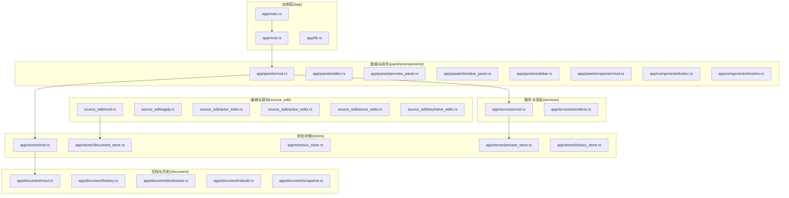
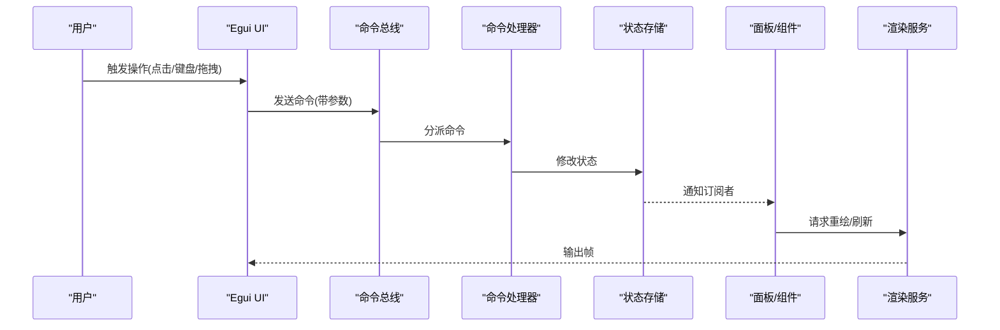
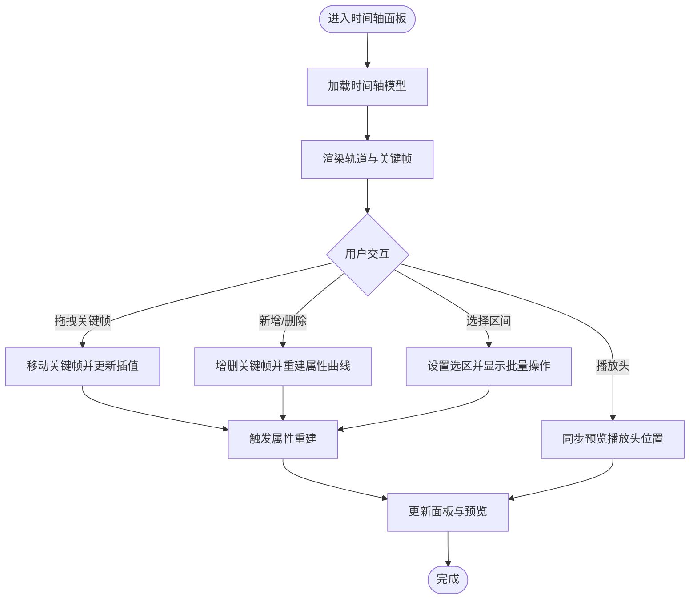
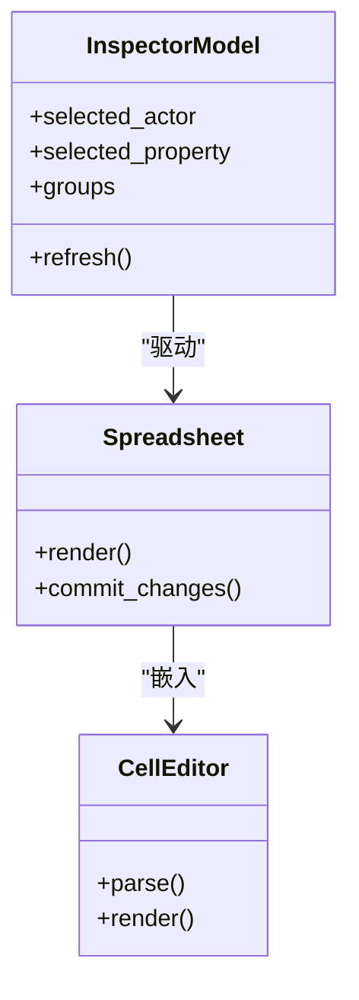
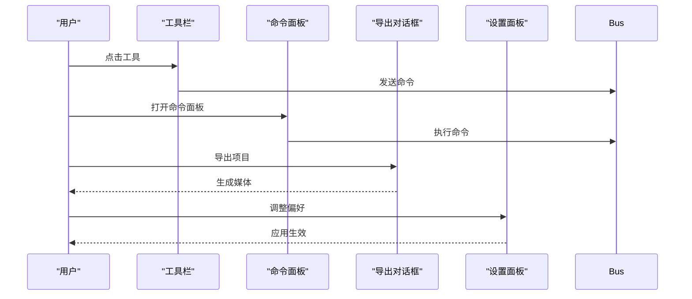
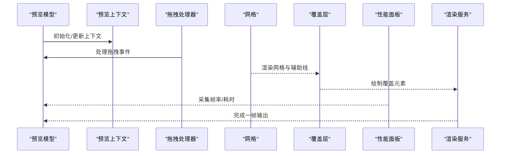
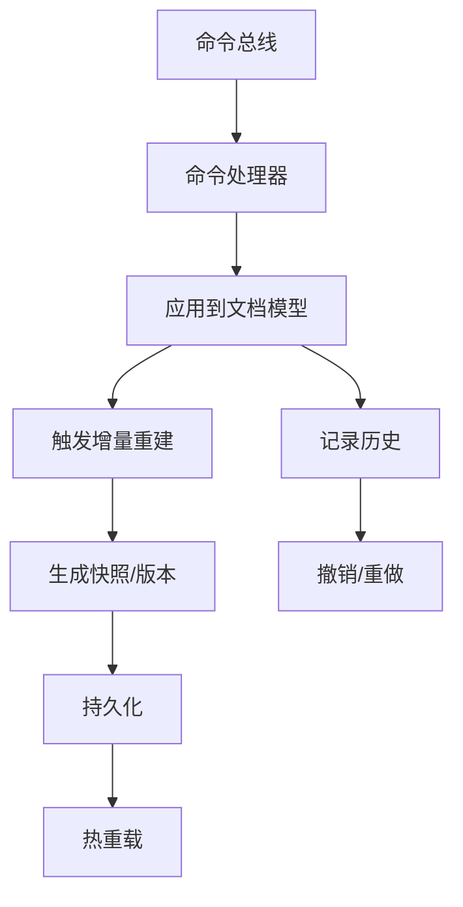
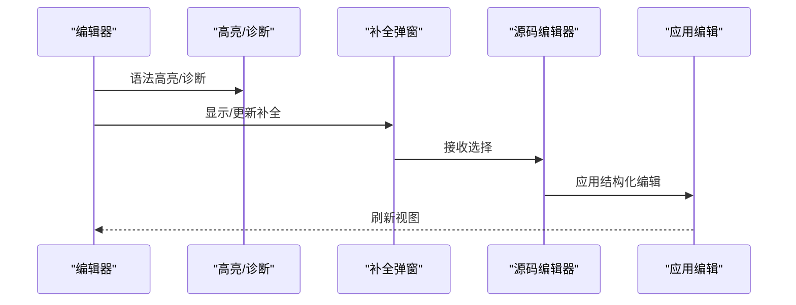
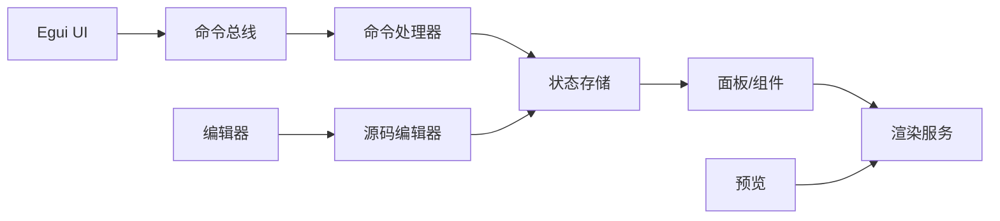

# GUI 开发

<cite>
**本文引用的文件**
- [lib.rs](file://crates/animatix-gui/src/lib.rs)
- [main.rs](file://crates/animatix-gui/src/main.rs)
- [app/mod.rs](file://crates/animatix-gui/src/app/mod.rs)
- [app/document/mod.rs](file://crates/animatix-gui/src/app/document/mod.rs)
- [app/document/history.rs](file://crates/animatix-gui/src/app/document/history.rs)
- [app/document/scheduler.rs](file://crates/animatix-gui/src/app/document/scheduler.rs)
- [app/document/rebuild.rs](file://crates/animatix-gui/src/app/document/rebuild.rs)
- [app/document/snapshot.rs](file://crates/animatix-gui/src/app/document/snapshot.rs)
- [app/stores/mod.rs](file://crates/animatix-gui/src/app/stores/mod.rs)
- [app/stores/document_store.rs](file://crates/animatix-gui/src/app/stores/document_store.rs)
- [app/stores/ui_store.rs](file://crates/animatix-gui/src/app/stores/ui_store.rs)
- [app/stores/preview_store.rs](file://crates/animatix-gui/src/app/stores/preview_store.rs)
- [app/stores/history_store.rs](file://crates/animatix-gui/src/app/stores/history_store.rs)
- [app/panels/mod.rs](file://crates/animatix-gui/src/app/panels/mod.rs)
- [app/panels/editor.rs](file://crates/animatix-gui/src/app/panels/editor.rs)
- [app/panels/editor_model.rs](file://crates/animatix-gui/src/app/panels/editor_model.rs)
- [app/panels/preview_panel.rs](file://crates/animatix-gui/src/app/panels/preview_panel.rs)
- [app/panels/preview_model.rs](file://crates/animatix-gui/src/app/panels/preview_model.rs)
- [app/panels/timeline_panel.rs](file://crates/animatix-gui/src/app/panels/timeline_panel.rs)
- [app/panels/timeline_model.rs](file://crates/animatix-gui/src/app/panels/timeline_model.rs)
- [app/panels/sidebar.rs](file://crates/animatix-gui/src/app/panels/sidebar.rs)
- [app/panels/sidebar_model.rs](file://crates/animatix-gui/src/app/panels/sidebar_model.rs)
- [app/panels/inspector/mod.rs](file://crates/animatix-gui/src/app/panels/inspector/mod.rs)
- [app/panels/inspector/model.rs](file://crates/animatix-gui/src/app/panels/inspector/model.rs)
- [app/panels/inspector/graph_editor.rs](file://crates/animatix-gui/src/app/panels/inspector/graph_editor.rs)
- [app/panels/inspector/keyframe_table.rs](file://crates/animatix-gui/src/app/panels/inspector/keyframe_table.rs)
- [app/preview/context.rs](file://crates/animatix-gui/src/app/preview/context.rs)
- [app/preview/drag_handler.rs](file://crates/animatix-gui/src/app/preview/drag_handler.rs)
- [app/preview/grid.rs](file://crates/animatix-gui/src/app/preview/grid.rs)
- [app/preview/overlay.rs](file://crates/animatix-gui/src/app/preview/overlay.rs)
- [app/preview/performance.rs](file://crates/animatix-gui/src/app/preview/performance.rs)
- [app/preview/selection.rs](file://crates/animatix-gui/src/app/preview/selection.rs)
- [app/preview/time_lens.rs](file://crates/animatix-gui/src/app/preview/time_lens.rs)
- [app/shell/toolbar.rs](file://crates/animatix-gui/src/app/shell/toolbar.rs)
- [app/shell/command_palette.rs](file://crates/animatix-gui/src/app/shell/command_palette.rs)
- [app/shell/export_dialog.rs](file://crates/animatix-gui/src/app/shell/export_dialog.rs)
- [app/shell/settings.rs](file://crates/animatix-gui/src/app/shell/settings.rs)
- [app/components/button.rs](file://crates/animatix-gui/src/app/components/button.rs)
- [app/components/timeline.rs](file://crates/animatix-gui/src/app/components/timeline.rs)
- [app/components/easing_curve_editor.rs](file://crates/animatix-gui/src/app/components/easing_curve_editor.rs)
- [app/services/renderer.rs](file://crates/animatix-gui/src/app/services/renderer.rs)
- [app/persistence.rs](file://crates/animatix-gui/src/app/persistence.rs)
- [app/runtime.rs](file://crates/animatix-gui/src/app/runtime.rs)
- [app/design_tokens.rs](file://crates/animatix-gui/src/app/design_tokens.rs)
- [app/icons.rs](file://crates/animatix-gui/src/app/icons.rs)
- [app/utils/labels.rs](file://crates/animatix-gui/src/app/utils/labels.rs)
- [app/utils/text.rs](file://crates/animatix-gui/src/app/utils/text.rs)
- [app/handlers/ui.rs](file://crates/animatix-gui/src/app/handlers/ui.rs)
- [app/handlers/playback.rs](file://crates/animatix-gui/src/app/handlers/playback.rs)
- [app/handlers/actor.rs](file://crates/animatix-gui/src/app/handlers/actor.rs)
- [app/handlers/property.rs](file://crates/animatix-gui/src/app/handlers/property.rs)
- [app/handlers/keyframe.rs](file://crates/animatix-gui/src/app/handlers/keyframe.rs)
- [app/handlers/scene.rs](file://crates/animatix-gui/src/app/handlers/scene.rs)
- [app/handlers/file.rs](file://crates/animatix-gui/src/app/handlers/file.rs)
- [app/command_bus.rs](file://crates/animatix-gui/src/app/command_bus.rs)
- [app/command_handlers.rs](file://crates/animatix-gui/src/app/command_handlers.rs)
- [app/commands.rs](file://crates/animatix-gui/src/app/commands.rs)
- [editor.rs](file://crates/animatix-gui/src/editor.rs)
- [source_edit/mod.rs](file://crates/animatix-gui/src/source_edit/mod.rs)
- [source_edit/apply.rs](file://crates/animatix-gui/src/source_edit/apply.rs)
- [source_edit/actor_edits.rs](file://crates/animatix-gui/src/source_edit/actor_edits.rs)
- [source_edit/action_edits.rs](file://crates/animatix-gui/src/source_edit/action_edits.rs)
- [source_edit/scene_edits.rs](file://crates/animatix-gui/src/source_edit/scene_edits.rs)
- [source_edit/keyframe_edits.rs](file://crates/animatix-gui/src/source_edit/keyframe_edits.rs)
- [hot_reload.rs](file://crates/animatix-gui/src/hot_reload.rs)
- [validation.rs](file://crates/animatix-gui/src/validation.rs)
- [highlighting.rs](file://crates/animatix-gui/src/highlighting.rs)
- [completion_popup.rs](file://crates/animatix-gui/src/completion_popup.rs)
- [cell_editor/mod.rs](file://crates/animatix-gui/src/cell_editor/mod.rs)
- [cell_editor/cell.rs](file://crates/animatix-gui/src/cell_editor/cell.rs)
- [cell_editor/parser.rs](file://crates/animatix-gui/src/cell_editor/parser.rs)
- [cell_editor/render.rs](file://crates/animatix-gui/src/cell_editor/render.rs)
- [document.rs](file://crates/animatix-gui/src/document.rs)
- [preview_surface.rs](file://crates/animatix-gui/src/preview_surface.rs)
- [text_diff.rs](file://crates/animatix-gui/src/text_diff.rs)
- [app/insertion.rs](file://crates/animatix-gui/src/app/insertion.rs)
- [app/file_tree.rs](file://crates/animatix-gui/src/app/file_tree.rs)
- [app/utils.rs](file://crates/animatix-gui/src/app/utils.rs)
- [app/tests.rs](file://crates/animatix-gui/src/app/tests.rs)
- [app/dev/screenshot_harness.rs](file://crates/animatix-gui/src/app/dev/screenshot_harness.rs)
</cite>

## 目录
1. [简介](#简介)
2. [项目结构](#项目结构)
3. [核心组件](#核心组件)
4. [架构总览](#架构总览)
5. [组件详解](#组件详解)
6. [依赖关系分析](#依赖关系分析)
7. [性能考量](#性能考量)
8. [故障排查指南](#故障排查指南)
9. [结论](#结论)
10. [附录](#附录)

## 简介
本文件面向 Animatix 的 GUI 开发，聚焦于基于 Egui 的界面实现与定制、可视化编辑器（时间轴、属性面板、工具栏）的设计与交互、实时预览系统的架构与优化、文档模型的状态管理与持久化，并提供 UI 组件开发的实践指导（自定义控件、主题与响应式设计）、调试技巧与性能优化建议。内容以 crates/animatix-gui 为核心，结合相关模块与服务，形成从架构到实现的完整说明。

## 项目结构
Animatix GUI 采用模块化分层组织：应用入口与生命周期在 app 层，UI 面板与组件在 panels 与 components，状态通过 stores 管理，编辑器与源码变更在 editor 与 source_edit，预览与渲染由 services 提供，命令总线与处理器统一调度，文档与历史在 document 子模块中管理。

图表来源
- [app/mod.rs](file://crates/animatix-gui/src/app/mod.rs)
- [app/main.rs](file://crates/animatix-gui/src/app/main.rs)
- [app/panels/mod.rs](file://crates/animatix-gui/src/app/panels/mod.rs)
- [app/stores/mod.rs](file://crates/animatix-gui/src/app/stores/mod.rs)
- [app/document/mod.rs](file://crates/animatix-gui/src/app/document/mod.rs)
- [app/services/mod.rs](file://crates/animatix-gui/src/app/services/mod.rs)
- [source_edit/mod.rs](file://crates/animatix-gui/src/source_edit/mod.rs)

章节来源
- [app/mod.rs](file://crates/animatix-gui/src/app/mod.rs)
- [app/main.rs](file://crates/animatix-gui/src/app/main.rs)
- [app/panels/mod.rs](file://crates/animatix-gui/src/app/panels/mod.rs)
- [app/stores/mod.rs](file://crates/animatix-gui/src/app/stores/mod.rs)
- [app/document/mod.rs](file://crates/animatix-gui/src/app/document/mod.rs)
- [app/services/mod.rs](file://crates/animatix-gui/src/app/services/mod.rs)
- [source_edit/mod.rs](file://crates/animatix-gui/src/source_edit/mod.rs)

## 核心组件
- 应用入口与生命周期：负责初始化窗口、Egui 上下文、命令总线、渲染器与各 store，驱动主循环。
- 面板系统：编辑器、预览、时间轴、侧边栏、检查器等，通过模型与视图分离实现数据驱动的 UI 更新。
- 状态存储：文档、UI、预览、历史等独立 store，通过命令与事件解耦。
- 文档与历史：统一的重建、快照与撤销/重做机制，保障编辑一致性。
- 编辑与源码变更：对场景、演员、动作、关键帧等进行结构化编辑，支持热重载与诊断高亮。
- 预览与渲染：上下文、拖拽、网格、覆盖层、性能指标与选择框，支撑可视化编辑体验。
- 命令总线与处理器：集中式命令分发，保证 UI 与业务逻辑解耦。

章节来源
- [app/main.rs](file://crates/animatix-gui/src/app/main.rs)
- [app/lib.rs](file://crates/animatix-gui/src/app/lib.rs)
- [app/panels/mod.rs](file://crates/animatix-gui/src/app/panels/mod.rs)
- [app/stores/mod.rs](file://crates/animatix-gui/src/app/stores/mod.rs)
- [app/document/mod.rs](file://crates/animatix-gui/src/app/document/mod.rs)
- [app/services/renderer.rs](file://crates/animatix-gui/src/app/services/renderer.rs)
- [source_edit/mod.rs](file://crates/animatix-gui/src/source_edit/mod.rs)

## 架构总览
GUI 架构围绕“命令驱动 + 数据驱动”的模式构建：命令总线接收用户输入或内部事件，命令处理器根据目标类型调用相应 handler 或修改 store；store 变化触发面板与组件重新绘制；渲染服务负责预览输出；文档子系统确保状态可恢复与可持久化。

图表来源
- [app/command_bus.rs](file://crates/animatix-gui/src/app/command_bus.rs)
- [app/command_handlers.rs](file://crates/animatix-gui/src/app/command_handlers.rs)
- [app/stores/mod.rs](file://crates/animatix-gui/src/app/stores/mod.rs)
- [app/panels/mod.rs](file://crates/animatix-gui/src/app/panels/mod.rs)
- [app/services/renderer.rs](file://crates/animatix-gui/src/app/services/renderer.rs)

## 组件详解

### 时间轴编辑器
- 设计要点：轨道抽象、关键帧集合、播放头同步、区间选择、吸附与对齐、时间缩放与滚动。
- 实现路径：时间轴面板与模型负责布局与交互；关键帧表与图编辑器支撑属性动画编辑；预览时间轴联动。
- 关键文件：
  - [app/panels/timeline_panel.rs](file://crates/animatix-gui/src/app/panels/timeline_panel.rs)
  - [app/panels/timeline_model.rs](file://crates/animatix-gui/src/app/panels/timeline_model.rs)
  - [app/panels/inspector/keyframe_table.rs](file://crates/animatix-gui/src/app/panels/inspector/keyframe_table.rs)
  - [app/panels/inspector/graph_editor.rs](file://crates/animatix-gui/src/app/panels/inspector/graph_editor.rs)
  - [app/components/timeline.rs](file://crates/animatix-gui/src/app/components/timeline.rs)

图表来源
- [app/panels/timeline_panel.rs](file://crates/animatix-gui/src/app/panels/timeline_panel.rs)
- [app/panels/timeline_model.rs](file://crates/animatix-gui/src/app/panels/timeline_model.rs)
- [app/panels/inspector/keyframe_table.rs](file://crates/animatix-gui/src/app/panels/inspector/keyframe_table.rs)
- [app/panels/inspector/graph_editor.rs](file://crates/animatix-gui/src/app/panels/inspector/graph_editor.rs)
- [app/components/timeline.rs](file://crates/animatix-gui/src/app/components/timeline.rs)

章节来源
- [app/panels/timeline_panel.rs](file://crates/animatix-gui/src/app/panels/timeline_panel.rs)
- [app/panels/timeline_model.rs](file://crates/animatix-gui/src/app/panels/timeline_model.rs)
- [app/panels/inspector/keyframe_table.rs](file://crates/animatix-gui/src/app/panels/inspector/keyframe_table.rs)
- [app/panels/inspector/graph_editor.rs](file://crates/animatix-gui/src/app/panels/inspector/graph_editor.rs)
- [app/components/timeline.rs](file://crates/animatix-gui/src/app/components/timeline.rs)

### 属性面板与检查器
- 设计要点：按组折叠/展开、属性行编辑、类型感知校验、快捷键与上下文菜单、与时间轴联动。
- 实现路径：检查器模型维护属性树与当前选中项；表格与图编辑器支持数值、颜色、路径等多类型输入；单元格编辑器提供表达式解析与渲染。
- 关键文件：
  - [app/panels/inspector/mod.rs](file://crates/animatix-gui/src/app/panels/inspector/mod.rs)
  - [app/panels/inspector/model.rs](file://crates/animatix-gui/src/app/panels/inspector/model.rs)
  - [app/panels/inspector/property_groups.rs](file://crates/animatix-gui/src/app/panels/inspector/property_groups.rs)
  - [app/panels/inspector/spreadsheet.rs](file://crates/animatix-gui/src/app/panels/inspector/spreadsheet.rs)
  - [cell_editor/mod.rs](file://crates/animatix-gui/src/cell_editor/mod.rs)
  - [cell_editor/cell.rs](file://crates/animatix-gui/src/cell_editor/cell.rs)
  - [cell_editor/parser.rs](file://crates/animatix-gui/src/cell_editor/parser.rs)
  - [cell_editor/render.rs](file://crates/animatix-gui/src/cell_editor/render.rs)

图表来源
- [app/panels/inspector/model.rs](file://crates/animatix-gui/src/app/panels/inspector/model.rs)
- [app/panels/inspector/spreadsheet.rs](file://crates/animatix-gui/src/app/panels/inspector/spreadsheet.rs)
- [cell_editor/mod.rs](file://crates/animatix-gui/src/cell_editor/mod.rs)
- [cell_editor/cell.rs](file://crates/animatix-gui/src/cell_editor/cell.rs)
- [cell_editor/parser.rs](file://crates/animatix-gui/src/cell_editor/parser.rs)
- [cell_editor/render.rs](file://crates/animatix-gui/src/cell_editor/render.rs)

章节来源
- [app/panels/inspector/mod.rs](file://crates/animatix-gui/src/app/panels/inspector/mod.rs)
- [app/panels/inspector/model.rs](file://crates/animatix-gui/src/app/panels/inspector/model.rs)
- [app/panels/inspector/property_groups.rs](file://crates/animatix-gui/src/app/panels/inspector/property_groups.rs)
- [app/panels/inspector/spreadsheet.rs](file://crates/animatix-gui/src/app/panels/inspector/spreadsheet.rs)
- [cell_editor/mod.rs](file://crates/animatix-gui/src/cell_editor/mod.rs)
- [cell_editor/cell.rs](file://crates/animatix-gui/src/cell_editor/cell.rs)
- [cell_editor/parser.rs](file://crates/animatix-gui/src/cell_editor/parser.rs)
- [cell_editor/render.rs](file://crates/animatix-gui/src/cell_editor/render.rs)

### 工具栏与命令面板
- 设计要点：图标按钮、快捷键提示、命令分派、导出与设置对话框、插入调色板。
- 实现路径：工具栏组件封装按钮与分隔符；命令面板提供全局命令搜索与执行；导出对话框与设置面板分别管理输出与偏好。
- 关键文件：
  - [app/shell/toolbar.rs](file://crates/animatix-gui/src/app/shell/toolbar.rs)
  - [app/shell/command_palette.rs](file://crates/animatix-gui/src/app/shell/command_palette.rs)
  - [app/shell/export_dialog.rs](file://crates/animatix-gui/src/app/shell/export_dialog.rs)
  - [app/shell/settings.rs](file://crates/animatix-gui/src/app/shell/settings.rs)
  - [app/shell/insertion_palette.rs](file://crates/animatix-gui/src/app/shell/insertion_palette.rs)

图表来源
- [app/shell/toolbar.rs](file://crates/animatix-gui/src/app/shell/toolbar.rs)
- [app/shell/command_palette.rs](file://crates/animatix-gui/src/app/shell/command_palette.rs)
- [app/shell/export_dialog.rs](file://crates/animatix-gui/src/app/shell/export_dialog.rs)
- [app/shell/settings.rs](file://crates/animatix-gui/src/app/shell/settings.rs)
- [app/shell/insertion_palette.rs](file://crates/animatix-gui/src/app/shell/insertion_palette.rs)

章节来源
- [app/shell/toolbar.rs](file://crates/animatix-gui/src/app/shell/toolbar.rs)
- [app/shell/command_palette.rs](file://crates/animatix-gui/src/app/shell/command_palette.rs)
- [app/shell/export_dialog.rs](file://crates/animatix-gui/src/app/shell/export_dialog.rs)
- [app/shell/settings.rs](file://crates/animatix-gui/src/app/shell/settings.rs)
- [app/shell/insertion_palette.rs](file://crates/animatix-gui/src/app/shell/insertion_palette.rs)

### 实时预览系统
- 设计要点：预览上下文、网格与覆盖层、拖拽与选择、时间镜头、性能指标、渲染管线集成。
- 实现路径：预览面板持有预览上下文与渲染器；网格与覆盖层提供视觉辅助；拖拽处理器与选择器支持交互；时间镜头联动播放头；性能面板展示帧率与耗时。
- 关键文件：
  - [app/panels/preview_panel.rs](file://crates/animatix-gui/src/app/panels/preview_panel.rs)
  - [app/panels/preview_model.rs](file://crates/animatix-gui/src/app/panels/preview_model.rs)
  - [app/preview/context.rs](file://crates/animatix-gui/src/app/preview/context.rs)
  - [app/preview/grid.rs](file://crates/animatix-gui/src/app/preview/grid.rs)
  - [app/preview/overlay.rs](file://crates/animatix-gui/src/app/preview/overlay.rs)
  - [app/preview/drag_handler.rs](file://crates/animatix-gui/src/app/preview/drag_handler.rs)
  - [app/preview/selection.rs](file://crates/animatix-gui/src/app/preview/selection.rs)
  - [app/preview/time_lens.rs](file://crates/animatix-gui/src/app/preview/time_lens.rs)
  - [app/preview/performance.rs](file://crates/animatix-gui/src/app/preview/performance.rs)
  - [app/services/renderer.rs](file://crates/animatix-gui/src/app/services/renderer.rs)

图表来源
- [app/panels/preview_panel.rs](file://crates/animatix-gui/src/app/panels/preview_panel.rs)
- [app/panels/preview_model.rs](file://crates/animatix-gui/src/app/panels/preview_model.rs)
- [app/preview/context.rs](file://crates/animatix-gui/src/app/preview/context.rs)
- [app/preview/grid.rs](file://crates/animatix-gui/src/app/preview/grid.rs)
- [app/preview/overlay.rs](file://crates/animatix-gui/src/app/preview/overlay.rs)
- [app/preview/drag_handler.rs](file://crates/animatix-gui/src/app/preview/drag_handler.rs)
- [app/preview/selection.rs](file://crates/animatix-gui/src/app/preview/selection.rs)
- [app/preview/time_lens.rs](file://crates/animatix-gui/src/app/preview/time_lens.rs)
- [app/preview/performance.rs](file://crates/animatix-gui/src/app/preview/performance.rs)
- [app/services/renderer.rs](file://crates/animatix-gui/src/app/services/renderer.rs)

章节来源
- [app/panels/preview_panel.rs](file://crates/animatix-gui/src/app/panels/preview_panel.rs)
- [app/panels/preview_model.rs](file://crates/animatix-gui/src/app/panels/preview_model.rs)
- [app/preview/context.rs](file://crates/animatix-gui/src/app/preview/context.rs)
- [app/preview/grid.rs](file://crates/animatix-gui/src/app/preview/grid.rs)
- [app/preview/overlay.rs](file://crates/animatix-gui/src/app/preview/overlay.rs)
- [app/preview/drag_handler.rs](file://crates/animatix-gui/src/app/preview/drag_handler.rs)
- [app/preview/selection.rs](file://crates/animatix-gui/src/app/preview/selection.rs)
- [app/preview/time_lens.rs](file://crates/animatix-gui/src/app/preview/time_lens.rs)
- [app/preview/performance.rs](file://crates/animatix-gui/src/app/preview/performance.rs)
- [app/services/renderer.rs](file://crates/animatix-gui/src/app/services/renderer.rs)

### 文档模型与状态管理
- 设计要点：命令驱动的状态变更、增量重建、快照与版本控制、撤销/重做栈、持久化与热重载。
- 实现路径：命令总线与处理器统一调度；文档子模块维护重建队列与快照；历史 store 记录变更；持久化模块负责序列化与反序列化。
- 关键文件：
  - [app/command_bus.rs](file://crates/animatix-gui/src/app/command_bus.rs)
  - [app/command_handlers.rs](file://crates/animatix-gui/src/app/command_handlers.rs)
  - [app/document/rebuild.rs](file://crates/animatix-gui/src/app/document/rebuild.rs)
  - [app/document/scheduler.rs](file://crates/animatix-gui/src/app/document/scheduler.rs)
  - [app/document/snapshot.rs](file://crates/animatix-gui/src/app/document/snapshot.rs)
  - [app/document/history.rs](file://crates/animatix-gui/src/app/document/history.rs)
  - [app/stores/history_store.rs](file://crates/animatix-gui/src/app/stores/history_store.rs)
  - [app/persistence.rs](file://crates/animatix-gui/src/app/persistence.rs)
  - [hot_reload.rs](file://crates/animatix-gui/src/hot_reload.rs)

图表来源
- [app/command_bus.rs](file://crates/animatix-gui/src/app/command_bus.rs)
- [app/command_handlers.rs](file://crates/animatix-gui/src/app/command_handlers.rs)
- [app/document/rebuild.rs](file://crates/animatix-gui/src/app/document/rebuild.rs)
- [app/document/scheduler.rs](file://crates/animatix-gui/src/app/document/scheduler.rs)
- [app/document/snapshot.rs](file://crates/animatix-gui/src/app/document/snapshot.rs)
- [app/document/history.rs](file://crates/animatix-gui/src/app/document/history.rs)
- [app/stores/history_store.rs](file://crates/animatix-gui/src/app/stores/history_store.rs)
- [app/persistence.rs](file://crates/animatix-gui/src/app/persistence.rs)
- [hot_reload.rs](file://crates/animatix-gui/src/hot_reload.rs)

章节来源
- [app/command_bus.rs](file://crates/animatix-gui/src/app/command_bus.rs)
- [app/command_handlers.rs](file://crates/animatix-gui/src/app/command_handlers.rs)
- [app/document/rebuild.rs](file://crates/animatix-gui/src/app/document/rebuild.rs)
- [app/document/scheduler.rs](file://crates/animatix-gui/src/app/document/scheduler.rs)
- [app/document/snapshot.rs](file://crates/animatix-gui/src/app/document/snapshot.rs)
- [app/document/history.rs](file://crates/animatix-gui/src/app/document/history.rs)
- [app/stores/history_store.rs](file://crates/animatix-gui/src/app/stores/history_store.rs)
- [app/persistence.rs](file://crates/animatix-gui/src/app/persistence.rs)
- [hot_reload.rs](file://crates/animatix-gui/src/hot_reload.rs)

### 编辑器与源码变更
- 设计要点：语法高亮、诊断提示、自动补全弹窗、结构化编辑（场景/演员/动作/关键帧）、文本差异与合并。
- 实现路径：编辑器模块提供高亮与诊断；补全弹窗与单元格编辑器提升输入效率；source_edit 提供原子级编辑操作与应用。
- 关键文件：
  - [editor.rs](file://crates/animatix-gui/src/editor.rs)
  - [highlighting.rs](file://crates/animatix-gui/src/highlighting.rs)
  - [validation.rs](file://crates/animatix-gui/src/validation.rs)
  - [completion_popup.rs](file://crates/animatix-gui/src/completion_popup.rs)
  - [source_edit/mod.rs](file://crates/animatix-gui/src/source_edit/mod.rs)
  - [source_edit/apply.rs](file://crates/animatix-gui/src/source_edit/apply.rs)
  - [source_edit/actor_edits.rs](file://crates/animatix-gui/src/source_edit/actor_edits.rs)
  - [source_edit/action_edits.rs](file://crates/animatix-gui/src/source_edit/action_edits.rs)
  - [source_edit/scene_edits.rs](file://crates/animatix-gui/src/source_edit/scene_edits.rs)
  - [source_edit/keyframe_edits.rs](file://crates/animatix-gui/src/source_edit/keyframe_edits.rs)
  - [text_diff.rs](file://crates/animatix-gui/src/text_diff.rs)

图表来源
- [editor.rs](file://crates/animatix-gui/src/editor.rs)
- [highlighting.rs](file://crates/animatix-gui/src/highlighting.rs)
- [validation.rs](file://crates/animatix-gui/src/validation.rs)
- [completion_popup.rs](file://crates/animatix-gui/src/completion_popup.rs)
- [source_edit/mod.rs](file://crates/animatix-gui/src/source_edit/mod.rs)
- [source_edit/apply.rs](file://crates/animatix-gui/src/source_edit/apply.rs)
- [source_edit/actor_edits.rs](file://crates/animatix-gui/src/source_edit/actor_edits.rs)
- [source_edit/action_edits.rs](file://crates/animatix-gui/src/source_edit/action_edits.rs)
- [source_edit/scene_edits.rs](file://crates/animatix-gui/src/source_edit/scene_edits.rs)
- [source_edit/keyframe_edits.rs](file://crates/animatix-gui/src/source_edit/keyframe_edits.rs)
- [text_diff.rs](file://crates/animatix-gui/src/text_diff.rs)

章节来源
- [editor.rs](file://crates/animatix-gui/src/editor.rs)
- [highlighting.rs](file://crates/animatix-gui/src/highlighting.rs)
- [validation.rs](file://crates/animatix-gui/src/validation.rs)
- [completion_popup.rs](file://crates/animatix-gui/src/completion_popup.rs)
- [source_edit/mod.rs](file://crates/animatix-gui/src/source_edit/mod.rs)
- [source_edit/apply.rs](file://crates/animatix-gui/src/source_edit/apply.rs)
- [source_edit/actor_edits.rs](file://crates/animatix-gui/src/source_edit/actor_edits.rs)
- [source_edit/action_edits.rs](file://crates/animatix-gui/src/source_edit/action_edits.rs)
- [source_edit/scene_edits.rs](file://crates/animatix-gui/src/source_edit/scene_edits.rs)
- [source_edit/keyframe_edits.rs](file://crates/animatix-gui/src/source_edit/keyframe_edits.rs)
- [text_diff.rs](file://crates/animatix-gui/src/text_diff.rs)

### 自定义控件与主题
- 设计要点：按钮、行容器、上下文菜单、吐司提示、缓动曲线编辑器；主题令牌统一风格；标签与文本工具。
- 实现路径：组件模块封装通用控件；设计令牌集中管理尺寸、色彩、字体；标签与文本工具提供一致的文案与格式化。
- 关键文件：
  - [app/components/button.rs](file://crates/animatix-gui/src/app/components/button.rs)
  - [app/components/layout.rs](file://crates/animatix-gui/src/app/components/layout.rs)
  - [app/components/context_menu.rs](file://crates/animatix-gui/src/app/components/context_menu.rs)
  - [app/components/toast.rs](file://crates/animatix-gui/src/app/components/toast.rs)
  - [app/components/easing_curve_editor.rs](file://crates/animatix-gui/src/app/components/easing_curve_editor.rs)
  - [app/design_tokens.rs](file://crates/animatix-gui/src/app/design_tokens.rs)
  - [app/utils/labels.rs](file://crates/animatix-gui/src/app/utils/labels.rs)
  - [app/utils/text.rs](file://crates/animatix-gui/src/app/utils/text.rs)

章节来源
- [app/components/button.rs](file://crates/animatix-gui/src/app/components/button.rs)
- [app/components/layout.rs](file://crates/animatix-gui/src/app/components/layout.rs)
- [app/components/context_menu.rs](file://crates/animatix-gui/src/app/components/context_menu.rs)
- [app/components/toast.rs](file://crates/animatix-gui/src/app/components/toast.rs)
- [app/components/easing_curve_editor.rs](file://crates/animatix-gui/src/app/components/easing_curve_editor.rs)
- [app/design_tokens.rs](file://crates/animatix-gui/src/app/design_tokens.rs)
- [app/utils/labels.rs](file://crates/animatix-gui/src/app/utils/labels.rs)
- [app/utils/text.rs](file://crates/animatix-gui/src/app/utils/text.rs)

## 依赖关系分析
- 松耦合：命令总线与处理器解耦 UI 与业务；面板通过 store 订阅状态变化；渲染服务与预览上下文分离。
- 依赖链：UI -> 命令总线 -> 命令处理器 -> store -> 面板；编辑器 -> 源码编辑器 -> store；预览 -> 渲染服务。
- 循环依赖：未见直接循环；若出现需通过接口或消息传递打破。
- 外部集成：Egui 作为 UI 框架；渲染服务对接底层图形后端；热重载与持久化依赖文件系统与序列化。

图表来源
- [app/command_bus.rs](file://crates/animatix-gui/src/app/command_bus.rs)
- [app/command_handlers.rs](file://crates/animatix-gui/src/app/command_handlers.rs)
- [app/stores/mod.rs](file://crates/animatix-gui/src/app/stores/mod.rs)
- [app/panels/mod.rs](file://crates/animatix-gui/src/app/panels/mod.rs)
- [app/services/renderer.rs](file://crates/animatix-gui/src/app/services/renderer.rs)
- [editor.rs](file://crates/animatix-gui/src/editor.rs)
- [source_edit/mod.rs](file://crates/animatix-gui/src/source_edit/mod.rs)
- [app/panels/preview_panel.rs](file://crates/animatix-gui/src/app/panels/preview_panel.rs)

章节来源
- [app/command_bus.rs](file://crates/animatix-gui/src/app/command_bus.rs)
- [app/command_handlers.rs](file://crates/animatix-gui/src/app/command_handlers.rs)
- [app/stores/mod.rs](file://crates/animatix-gui/src/app/stores/mod.rs)
- [app/panels/mod.rs](file://crates/animatix-gui/src/app/panels/mod.rs)
- [app/services/renderer.rs](file://crates/animatix-gui/src/app/services/renderer.rs)
- [editor.rs](file://crates/animatix-gui/src/editor.rs)
- [source_edit/mod.rs](file://crates/animatix-gui/src/source_edit/mod.rs)
- [app/panels/preview_panel.rs](file://crates/animatix-gui/src/app/panels/preview_panel.rs)

## 性能考量
- 渲染更新策略：按需重建、增量更新、帧内批处理；避免在 UI 线程执行重型计算。
- 预览优化：限制重绘频率、延迟绘制覆盖层、使用双缓冲；在时间轴拖动时降低细节级别。
- 文档重建：任务调度与优先级队列，合并相邻变更；快照与版本控制减少回溯成本。
- 编辑器：高亮与诊断按需触发；补全弹窗延迟显示；文本差异仅在必要时计算。
- 主题与布局：统一设计令牌减少样式计算；响应式布局避免频繁测量。

## 故障排查指南
- 命令未生效：检查命令总线是否正确发送、处理器是否注册、目标 store 是否存在。
- 面板不刷新：确认 store 订阅是否建立、变更是否触发通知、Egui 是否在主线程绘制。
- 预览卡顿：查看性能面板指标，定位 GPU/CPU 占用；检查覆盖层绘制复杂度与重绘频率。
- 撤销/重做异常：核对历史栈状态、快照一致性与版本号递增。
- 热重载失败：验证文件监听与序列化流程、错误诊断与回滚策略。
- 编辑冲突：检查源码编辑器的原子性与应用顺序，确保文本差异合并正确。

章节来源
- [app/command_bus.rs](file://crates/animatix-gui/src/app/command_bus.rs)
- [app/command_handlers.rs](file://crates/animatix-gui/src/app/command_handlers.rs)
- [app/stores/mod.rs](file://crates/animatix-gui/src/app/stores/mod.rs)
- [app/preview/performance.rs](file://crates/animatix-gui/src/app/preview/performance.rs)
- [app/document/history.rs](file://crates/animatix-gui/src/app/document/history.rs)
- [hot_reload.rs](file://crates/animatix-gui/src/hot_reload.rs)
- [text_diff.rs](file://crates/animatix-gui/src/text_diff.rs)

## 结论
Animatix GUI 以命令与数据驱动为核心，通过模块化与松耦合设计实现了可视化编辑器、实时预览与文档模型的协同工作。借助 Egui 的高效渲染与灵活扩展能力，系统在保持良好用户体验的同时具备良好的可维护性与可扩展性。后续可在性能监控、主题体系完善与交互反馈方面持续优化。

## 附录
- 快速开始：启动应用入口，打开示例场景，使用工具栏与时间轴进行编辑，预览实时更新。
- 常用命令：播放/暂停、撤销/重做、导出、设置、插入新演员/动作。
- 调试技巧：启用性能面板、断点日志、最小化场景复现问题、逐步回退变更集。