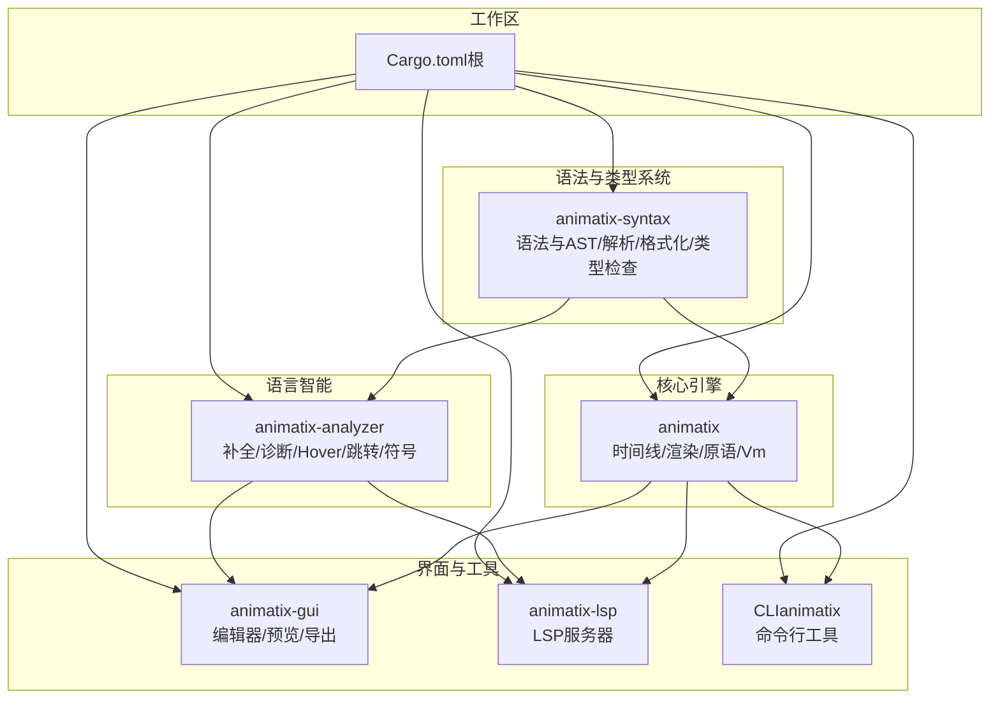
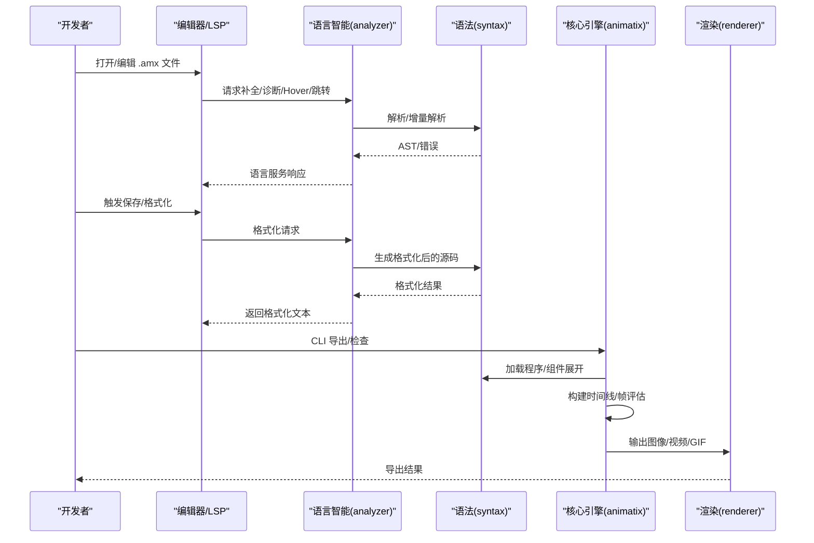
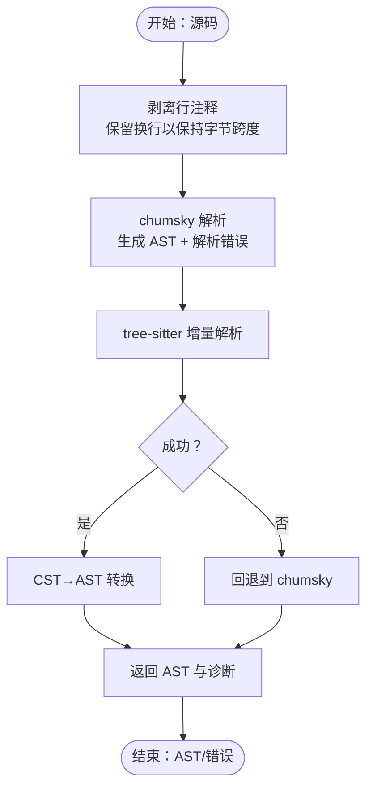
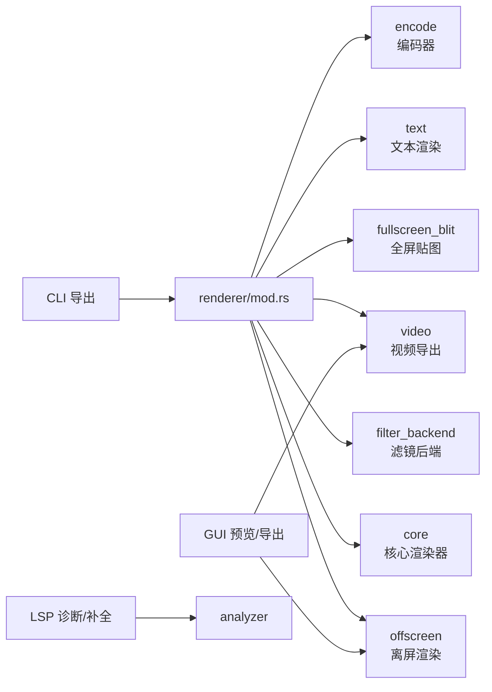
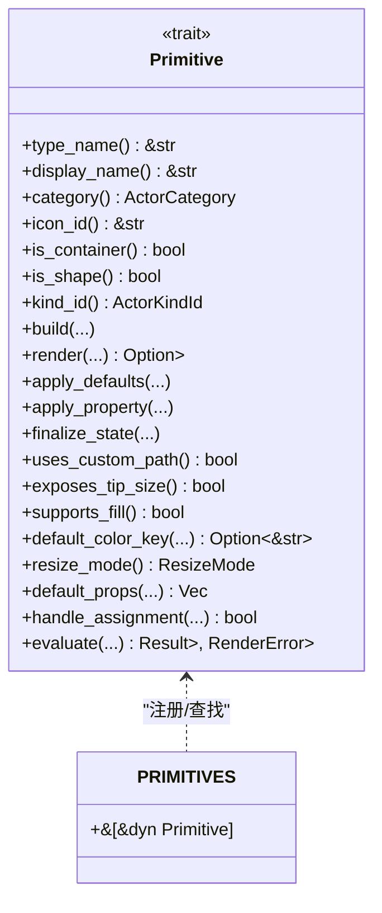
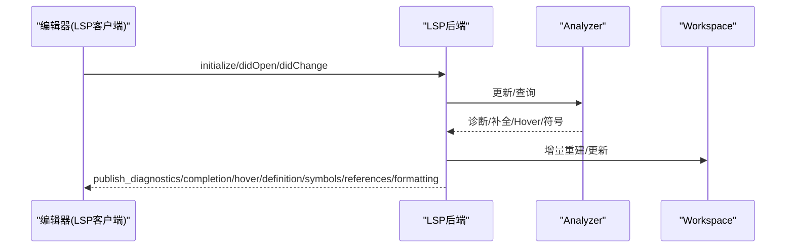
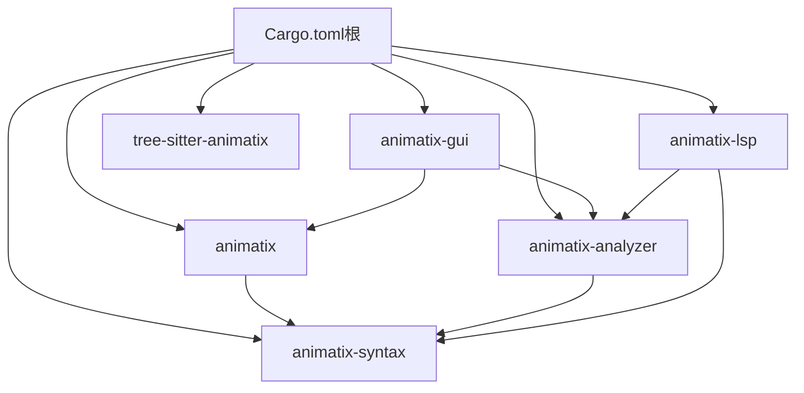

# 开发者指南

<cite>
**本文档引用的文件**
- [Cargo.toml](file://crates/animatix/Cargo.toml)
- [lib.rs](file://crates/animatix/src/lib.rs)
- [main.rs](file://crates/animatix/src/main.rs)
- [timeline/mod.rs](file://crates/animatix/src/timeline/mod.rs)
- [renderer/mod.rs](file://crates/animatix/src/renderer/mod.rs)
- [primitives/mod.rs](file://crates/animatix/src/primitives/mod.rs)
- [vm.rs](file://crates/animatix/src/vm.rs)
- [animatix-analyzer/Cargo.toml](file://crates/animatix-analyzer/Cargo.toml)
- [analyzer/lib.rs](file://crates/animatix-analyzer/src/lib.rs)
- [animatix-gui/Cargo.toml](file://crates/animatix-gui/Cargo.toml)
- [gui/lib.rs](file://crates/animatix-gui/src/lib.rs)
- [animatix-lsp/Cargo.toml](file://crates/animatix-lsp/Cargo.toml)
- [lsp/main.rs](file://crates/animatix-lsp/src/main.rs)
- [animatix-syntax/Cargo.toml](file://crates/animatix-syntax/Cargo.toml)
- [syntax/lib.rs](file://crates/animatix-syntax/src/lib.rs)
- [ast.rs](file://crates/animatix-syntax/src/ast.rs)
- [parser/mod.rs](file://crates/animatix-syntax/src/parser/mod.rs)
- [Cargo.toml（根）](file://Cargo.toml)
</cite>

## 目录
1. [简介](#简介)
2. [项目结构](#项目结构)
3. [核心组件](#核心组件)
4. [架构总览](#架构总览)
5. [详细组件分析](#详细组件分析)
6. [依赖分析](#依赖分析)
7. [性能考虑](#性能考虑)
8. [故障排查指南](#故障排查指南)
9. [结论](#结论)
10. [附录](#附录)

## 简介
本指南面向 Animatix 的开发者，系统性阐述动画引擎的整体架构、模块关系与数据流；深入解析核心引擎的时间线系统、渲染系统、原语系统与修饰符运行时；详解语法分析器的设计原理（AST 结构、语法树转换与错误处理）；说明语言服务（LSP）的实现（服务器、代码补全、诊断系统与符号导航）；并提供扩展与定制指导（自定义原语、插件与主题）、性能优化建议、调试技巧与最佳实践。

## 项目结构
Animatix 采用多 Crate 工作区组织，围绕“语法分析”“语言智能”“核心引擎”“GUI/LSP/CLI”四大领域分层构建，通过清晰的模块边界与可选特性开关实现功能解耦与按需编译。



图表来源
- [Cargo.toml（根）:1-11](file://Cargo.toml#L1-L11)
- [animatix-syntax/Cargo.toml:1-12](file://crates/animatix-syntax/Cargo.toml#L1-L12)
- [animatix-analyzer/Cargo.toml:1-15](file://crates/animatix-analyzer/Cargo.toml#L1-L15)
- [Cargo.toml:1-105](file://crates/animatix/Cargo.toml#L1-L105)
- [animatix-gui/Cargo.toml:1-49](file://crates/animatix-gui/Cargo.toml#L1-L49)
- [animatix-lsp/Cargo.toml:1-19](file://crates/animatix-lsp/Cargo.toml#L1-L19)

章节来源
- [Cargo.toml（根）:1-11](file://Cargo.toml#L1-L11)
- [animatix-syntax/Cargo.toml:1-12](file://crates/animatix-syntax/Cargo.toml#L1-L12)
- [animatix-analyzer/Cargo.toml:1-15](file://crates/animatix-analyzer/Cargo.toml#L1-L15)
- [Cargo.toml:1-105](file://crates/animatix/Cargo.toml#L1-L105)
- [animatix-gui/Cargo.toml:1-49](file://crates/animatix-gui/Cargo.toml#L1-L49)
- [animatix-lsp/Cargo.toml:1-19](file://crates/animatix-lsp/Cargo.toml#L1-L19)

## 核心组件
- 语法与类型系统（animatix-syntax）
  - AST 定义、表达式与语句、类型注解与参数定义
  - 解析器（chumsky 组合子）、增量解析（tree-sitter）、格式化与源码索引
  - 类型检查、诊断与位置映射
- 语言智能（animatix-analyzer）
  - 符号表、补全、诊断、Hover、跳转定义、引用、文档符号
  - 工作区跨文件解析与命名空间管理
- 核心引擎（animatix）
  - 时间线：构建与帧评估、属性轨道、布局、颜色方案、路径变形、绘图采样
  - 渲染：离屏渲染、过渡合成、视频/GIF 导出、文本与滤镜后端
  - 原语：统一的 Primitive 抽象与注册表、形状/文本/媒体/容器/滤镜等
  - 修饰符运行时：IR 与字节码 VM
  - CLI：AST 查看、图像/视频/GIF 导出、检查、格式化、lint
- GUI（animatix-gui）
  - 编辑器、预览、面板、热重载、导出对话框、命令总线与状态管理
- LSP（animatix-lsp）
  - 基于 Tower LSP 的语言服务器，提供补全、诊断、Hover、跳转、符号与格式化

章节来源
- [syntax/lib.rs:1-29](file://crates/animatix-syntax/src/lib.rs#L1-L29)
- [analyzer/lib.rs:1-800](file://crates/animatix-analyzer/src/lib.rs#L1-L800)
- [lib.rs:1-24](file://crates/animatix/src/lib.rs#L1-L24)
- [renderer/mod.rs:1-57](file://crates/animatix/src/renderer/mod.rs#L1-L57)
- [primitives/mod.rs:1-727](file://crates/animatix/src/primitives/mod.rs#L1-L727)
- [vm.rs:1-2](file://crates/animatix/src/vm.rs#L1-L2)
- [gui/lib.rs:1-18](file://crates/animatix-gui/src/lib.rs#L1-L18)
- [lsp/main.rs:1-509](file://crates/animatix-lsp/src/main.rs#L1-L509)

## 架构总览
Animatix 的执行链路从“源码输入”开始，经由语法分析与类型检查生成 AST，随后在引擎中完成时间线构建与帧评估，最终由渲染管线输出图像或视频。语言服务与 GUI 在此过程中提供编辑体验与交互能力。



图表来源
- [analyzer/lib.rs:44-442](file://crates/animatix-analyzer/src/lib.rs#L44-L442)
- [parser/mod.rs:94-128](file://crates/animatix-syntax/src/parser/mod.rs#L94-L128)
- [main.rs:213-230](file://crates/animatix/src/main.rs#L213-L230)
- [renderer/mod.rs:36-57](file://crates/animatix/src/renderer/mod.rs#L36-L57)

## 详细组件分析

### 语法分析器与 AST 设计
- AST 节点
  - 表达式：数值、百分比、字符串、布尔、空值、标识符/路径、索引、元组/列表、二元/一元运算、函数/方法调用、闭包、条件表达式、内联形态构造
  - 语句：动作、变量声明、演员声明、导入、关键帧、赋值、序列/交错、始终块、响应式绑定、条件/循环、组件定义/动作、配置、场景与播放
  - 辅助类型：时间、类型注解、参数定义、内联项（匿名/带标签/循环/插槽）
- 解析流程
  - 注释剥离（保留换行以维持字节跨度）与 chumsky 解析，生成 AST 与结构化解析错误
  - 增量解析：tree-sitter 派生语法树转换为 AST，失败时回退到 chumsky
  - 片段模板清理（VS Code 占位符），便于插入板解析
- 错误处理
  - 解析错误包含消息、字节范围、行列号、期望与实际、上下文栈，统一转为诊断用于报告



图表来源
- [parser/mod.rs:48-128](file://crates/animatix-syntax/src/parser/mod.rs#L48-L128)
- [ast.rs:1-712](file://crates/animatix-syntax/src/ast.rs#L1-L712)

章节来源
- [ast.rs:101-712](file://crates/animatix-syntax/src/ast.rs#L101-L712)
- [parser/mod.rs:94-128](file://crates/animatix-syntax/src/parser/mod.rs#L94-L128)
- [parser/mod.rs:190-273](file://crates/animatix-syntax/src/parser/mod.rs#L190-L273)

### 时间线系统（Timeline）
- 构建期
  - 加载模块与组件展开，构建 Timeline：包含属性轨道、环境、修饰符程序（IR/字节码）、容器元数据、布局引擎、字体上下文、资源缓存、音频片段、动作事件、运行时诊断哈希等
  - 关键帧时间收集、容器子序动画、静态子树缓存、帧缓存、变换缓存、绘图路径缓存
- 帧评估期
  - 构建每帧环境（含 t、场景尺寸、轨道属性、覆盖），采样轨道、执行 always 修饰符、解析锚点/百分比位置、生成 Vello 场景
  - 支持布局缓存、命中区域计算、调试叠加（边框/间距/布局调试）
- 质量等级
  - Draft/Preview/Production 影响绘图采样精度与速度

```mermaid
classDiagram
class Timeline {
+tracks : BTreeMap~String, AnimationTrack~
+background_color : PropertyTrack<[f32;4]>
+root_nodes : Vec~String~
+env : Environment
+env_base : Arc<HashMap>
+modifiers : Vec~Stmt~
+modifier_programs : Vec~ModifierIrProgram~
+modifier_bytecode_programs : Vec~ModifierBytecodeProgram~
+colorscheme : ResolvedColorscheme
+external_colorschemes : HashMap
+container_metadata : BTreeMap
+layout_engine : LayoutEngine
+dynamic_layout : bool
+asset_cache : Arc<AssetCache>
+font_context : Arc<FontContext>
+build_quality : BuildQuality
+default_opacity : f32
+child_orders : BTreeMap
+text_compiler : RefCell<TextCompiler>
+frame_cache : RefCell<Option<FrameCacheEntry>>
+transform_cache : RefCell<HashMap>
+static_subtree_cache : RefCell<HashMap>
+scene_buffer : RefCell<Option<Scene>>
+hit_regions : RefCell<Vec<(String, Rect)>>
+variable_tracks : BTreeMap
+audio_segments : Vec~AudioSegment~
+action_events : Vec~ActionEvent~
+plot_path_cache : HashMap
+runtime_diagnostics : RefCell<Vec<Diagnostic>>
+modifier_hash : u64
}
class AnimationTrack {
+position : Option<PropertyTrack<Vec2>>
+rotation : Option<PropertyTrack<f32>>
+scale : Option<PropertyTrack<Vec2>>
+size : Option<PropertyTrack<Vec2>>
+color : Option<PropertyTrack<Color>>
+opacity : Option<PropertyTrack<f32>>
+children : Vec~String~
+placement_mode : PropertyTrack<PlacementMode>
+layout_size : Option<PropertyTrack<Vec2>>
+text_content : Option<PropertyTrack<String>>
+vector_paths : Option<PropertyTrack<Vec<VelloPath>>>
+image : Option<PropertyTrack<SceneImage>>
+morph_options : Option<PropertyTrack<MorphOptions>>
+... 多种属性轨道
}
class LayoutEngine {
+cache : RefCell<HashMap>
+compute_positions(...)
}
Timeline --> AnimationTrack : "持有"
Timeline --> LayoutEngine : "使用"
```

图表来源
- [timeline/mod.rs:431-502](file://crates/animatix/src/timeline/mod.rs#L431-L502)
- [timeline/mod.rs:554-598](file://crates/animatix/src/timeline/mod.rs#L554-L598)
- [timeline/mod.rs:600-677](file://crates/animatix/src/timeline/mod.rs#L600-L677)

章节来源
- [timeline/mod.rs:1-1093](file://crates/animatix/src/timeline/mod.rs#L1-L1093)

### 渲染系统
- 功能模块
  - 错误类型、过渡合成、共享类型
  - 可选特性：核心渲染器、离屏渲染、滤镜后端、全屏贴图、文本支持、视频导出、编码器
- 导出接口
  - 图像、GIF、视频导出，支持分辨率、帧率、持续时间、线程数、编码器与预设、调试叠加
- 集成点
  - CLI 通过渲染器导出；GUI 使用离屏渲染进行预览与导出；LSP 与 GUI 共享语言智能



图表来源
- [renderer/mod.rs:1-57](file://crates/animatix/src/renderer/mod.rs#L1-L57)
- [main.rs:336-446](file://crates/animatix/src/main.rs#L336-L446)

章节来源
- [renderer/mod.rs:1-57](file://crates/animatix/src/renderer/mod.rs#L1-L57)
- [main.rs:336-446](file://crates/animatix/src/main.rs#L336-L446)

### 原语系统与修饰符运行时
- 原语抽象
  - 统一的 Primitive trait：类型名、显示名、分类、图标、是否容器/形状、构建/渲染/默认色键/调整模式、分配阶段处理、帧评估
  - PRIMITIVES 注册表与自动元数据生成，查找与派发
- 修饰符运行时
  - IR 与字节码程序在构建期编译，帧评估期执行，支持 always 块的动态修改
- 文本/矢量/图像/媒体/容器/滤镜等原语模块化实现



图表来源
- [primitives/mod.rs:419-568](file://crates/animatix/src/primitives/mod.rs#L419-L568)
- [primitives/mod.rs:575-586](file://crates/animatix/src/primitives/mod.rs#L575-L586)

章节来源
- [primitives/mod.rs:1-727](file://crates/animatix/src/primitives/mod.rs#L1-L727)
- [vm.rs:1-2](file://crates/animatix/src/vm.rs#L1-L2)

### 语言服务（LSP）
- 服务器职责
  - 文档级分析器缓存、工作区增量重建、发布诊断、补全、Hover、跳转定义、文档符号、引用、格式化
- 实现要点
  - 后端持有每个文档的 Analyzer，并在文件打开/变更/关闭时重建/更新工作区
  - 将 Analyzer 的诊断映射为 LSP 诊断；补全/Hover/跳转等映射为 LSP 响应
  - 支持 VS Code/Neovim 等外部编辑器



图表来源
- [lsp/main.rs:16-144](file://crates/animatix-lsp/src/main.rs#L16-L144)
- [lsp/main.rs:205-239](file://crates/animatix-lsp/src/main.rs#L205-L239)
- [lsp/main.rs:241-269](file://crates/animatix-lsp/src/main.rs#L241-L269)
- [lsp/main.rs:271-304](file://crates/animatix-lsp/src/main.rs#L271-L304)
- [lsp/main.rs:306-345](file://crates/animatix-lsp/src/main.rs#L306-L345)
- [lsp/main.rs:395-434](file://crates/animatix-lsp/src/main.rs#L395-L434)
- [lsp/main.rs:436-469](file://crates/animatix-lsp/src/main.rs#L436-L469)

章节来源
- [lsp/main.rs:1-509](file://crates/animatix-lsp/src/main.rs#L1-L509)
- [analyzer/lib.rs:44-442](file://crates/animatix-analyzer/src/lib.rs#L44-L442)

### 语言智能（Analyzer）
- 数据结构与职责
  - Analyzer：持有源码、AST、tree-sitter 树、符号表、类型诊断、工作区；提供补全、诊断、Hover、跳转、引用、文档符号、符号名查询
  - Workspace：跨文件符号解析与命名空间合并
- 增量与位置映射
  - 使用 tree-sitter 树补充符号位置信息；仅当源码变化时重建解析
  - 位置映射：将 tree-sitter 节点映射到 AST 符号表中的行列与跨度

章节来源
- [analyzer/lib.rs:44-442](file://crates/animatix-analyzer/src/lib.rs#L44-L442)

### CLI 工作流
- 子命令
  - AST 查看、单帧图像导出、视频/GIF 导出、检查（含渲染冒烟测试）、格式化、lint
- 流程
  - 加载程序与组件展开，构建目标（单场景/多场景），打印构建诊断，按需渲染或导出

章节来源
- [main.rs:36-204](file://crates/animatix/src/main.rs#L36-L204)
- [main.rs:213-230](file://crates/animatix/src/main.rs#L213-L230)
- [main.rs:250-312](file://crates/animatix/src/main.rs#L250-L312)
- [main.rs:336-446](file://crates/animatix/src/main.rs#L336-L446)
- [main.rs:511-597](file://crates/animatix/src/main.rs#L511-L597)
- [main.rs:599-714](file://crates/animatix/src/main.rs#L599-L714)

## 依赖分析
- 工作区成员与版本
  - animatix、animatix-analyzer、animatix-gui、animatix-lsp、animatix-syntax、tree-sitter-animatix
  - 统一 resolver="2"，确保依赖解析一致性
- 核心依赖
  - animatix 依赖 animatix-syntax、animatix-analyzer；GUI/LSP/CLI 依赖各自 crate；渲染/视频/文本/SVG 通过特性开关启用
  - 语法 crate 内部依赖 chumsky、tree-sitter 与其 Rust 绑定；类型检查与诊断模块化



图表来源
- [Cargo.toml（根）:1-11](file://Cargo.toml#L1-L11)
- [Cargo.toml:14-38](file://crates/animatix/Cargo.toml#L14-L38)
- [animatix-analyzer/Cargo.toml:8-15](file://crates/animatix-analyzer/Cargo.toml#L8-L15)
- [animatix-gui/Cargo.toml:13-41](file://crates/animatix-gui/Cargo.toml#L13-L41)
- [animatix-lsp/Cargo.toml:12-19](file://crates/animatix-lsp/Cargo.toml#L12-L19)

章节来源
- [Cargo.toml（根）:1-11](file://Cargo.toml#L1-L11)
- [Cargo.toml:1-105](file://crates/animatix/Cargo.toml#L1-L105)
- [animatix-analyzer/Cargo.toml:1-15](file://crates/animatix-analyzer/Cargo.toml#L1-L15)
- [animatix-gui/Cargo.toml:1-49](file://crates/animatix-gui/Cargo.toml#L1-L49)
- [animatix-lsp/Cargo.toml:1-19](file://crates/animatix-lsp/Cargo.toml#L1-L19)

## 性能考虑
- 时间线构建与评估
  - 利用布局缓存、帧缓存、变换缓存与静态子树缓存减少重复计算
  - 质量等级按需降低绘图采样精度（Draft/Preview/Production）
- 渲染
  - 离屏渲染避免窗口系统开销；全屏贴图零拷贝合成；文本编译缓存与字体上下文复用
  - 视频导出支持多线程与编码器选择
- 语言服务
  - 文档级 Analyzer 缓存与增量工作区重建；tree-sitter 增量解析优先
- 语法解析
  - 注释剥离与增量解析提升大文件编辑体验；回退策略保证稳定性

## 故障排查指南
- 解析错误定位
  - 使用解析错误的行列与字节跨度定位问题；结合上下文栈理解错误发生位置
- 类型与语义诊断
  - 通过 Analyzer 的诊断集合与类型检查结果定位组件/动作参数不匹配等问题
- 运行时诊断
  - Timeline 的运行时诊断会在帧评估时累积，可用于定位修饰符错误
- 导出问题
  - CLI 检查命令可进行渲染冒烟测试；视频/GIF 导出失败时检查编码器与线程设置

章节来源
- [parser/mod.rs:190-273](file://crates/animatix-syntax/src/parser/mod.rs#L190-L273)
- [analyzer/lib.rs:378-394](file://crates/animatix-analyzer/src/lib.rs#L378-L394)
- [main.rs:250-312](file://crates/animatix/src/main.rs#L250-L312)

## 结论
Animatix 通过清晰的分层架构与模块化设计，在语法分析、语言智能、核心引擎与工具链之间建立了高内聚低耦合的关系。语法与类型系统为上层提供稳定的数据结构与诊断；语言智能与 GUI/LSP 提升开发体验；核心引擎在时间线、渲染与原语层面提供高性能与可扩展性；CLI 保障了批处理与自动化导出能力。遵循本文档的扩展与定制指导，可高效地添加新原语、插件与主题，同时保持良好的性能与可维护性。

## 附录

### 扩展与定制指导
- 自定义原语
  - 在 primitives 目录新增模块并实现 Primitive trait；将常量注册到 PRIMITIVES 数组；如为形状需扩展 ActorKindId/ShapeKind
- 插件系统
  - 通过模块加载与组件展开机制接入外部模块；利用符号表与工作区实现跨文件解析与命名空间管理
- 主题定制
  - 通过颜色方案解析与默认色键映射，结合 GUI 的设计令牌系统实现主题切换

章节来源
- [primitives/mod.rs:18-29](file://crates/animatix/src/primitives/mod.rs#L18-L29)
- [analyzer/lib.rs:26-32](file://crates/animatix-analyzer/src/lib.rs#L26-L32)