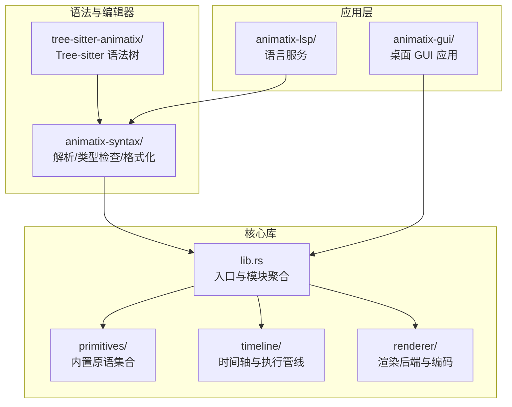
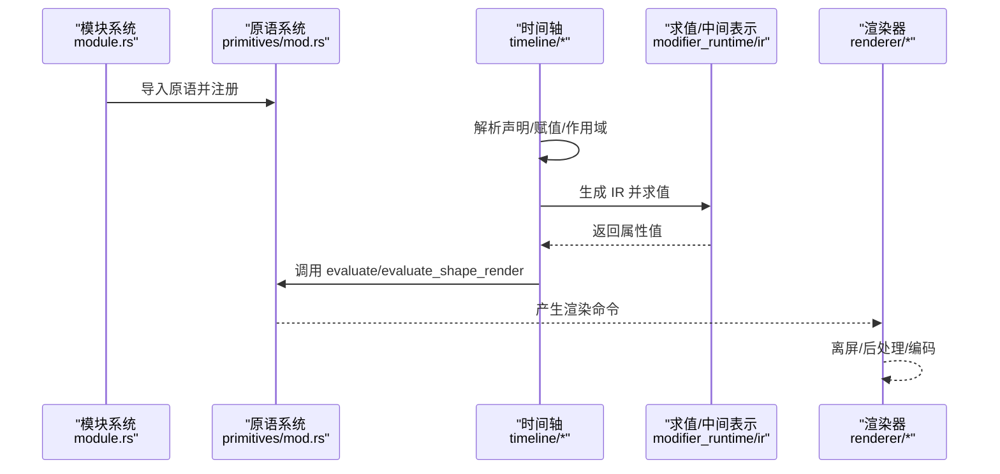
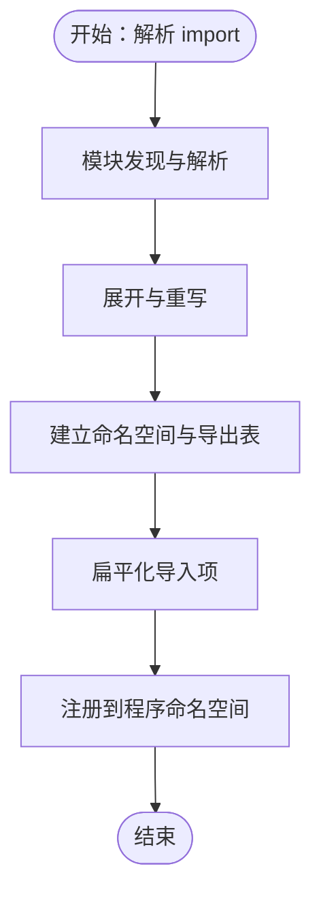
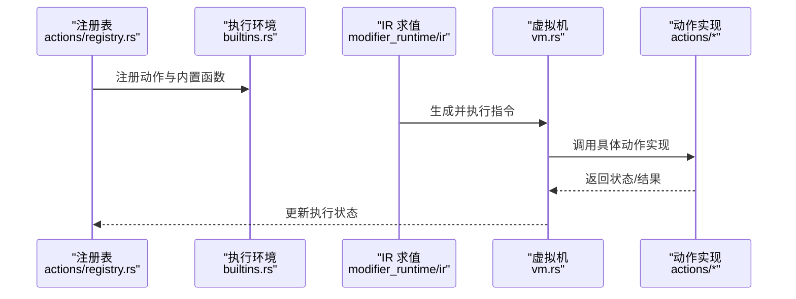
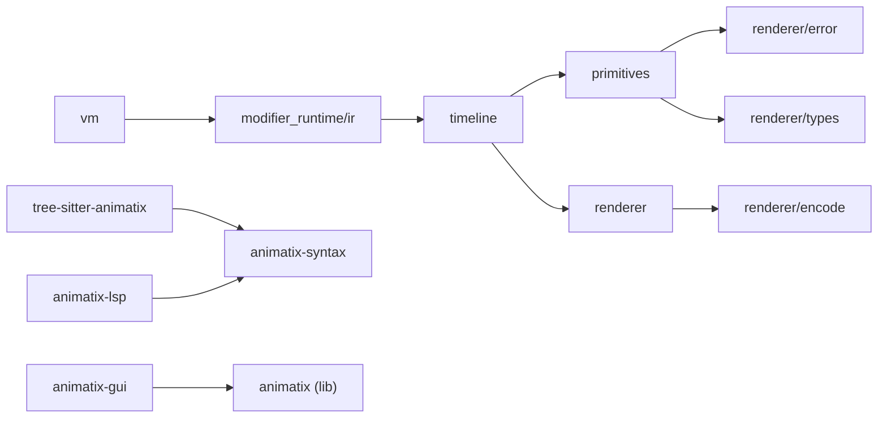

# 扩展与定制

<cite>
**本文引用的文件**
- [crates/animatix/src/lib.rs](file://crates/animatix/src/lib.rs)
- [crates/animatix/src/primitives/mod.rs](file://crates/animatix/src/primitives/mod.rs)
- [crates/animatix/src/primitives/arrow.rs](file://crates/animatix/src/primitives/arrow.rs)
- [crates/animatix/src/primitives/text.rs](file://crates/animatix/src/primitives/text.rs)
- [crates/animatix/src/primitives/image.rs](file://crates/animatix/src/primitives/image.rs)
- [crates/animatix/src/primitives/group.rs](file://crates/animatix/src/primitives/group.rs)
- [crates/animatix/src/primitives/svg.rs](file://crates/animatix/src/primitives/svg.rs)
- [crates/animatix/src/primitives/path.rs](file://crates/animatix/src/primitives/path.rs)
- [crates/animatix/src/primitives/rect.rs](file://crates/animatix/src/primitives/rect.rs)
- [crates/animatix/src/primitives/ellipse.rs](file://crates/animatix/src/primitives/ellipse.rs)
- [crates/animatix/src/primitives/polygon.rs](file://crates/animatix/src/primitives/polygon.rs)
- [crates/animatix/src/primitives/grid.rs](file://crates/animatix/src/primitives/grid.rs)
- [crates/animatix/src/primitives/line.rs](file://crates/animatix/src/primitives/line.rs)
- [crates/animatix/src/primitives/mask.rs](file://crates/animatix/src/primitives/mask.rs)
- [crates/animatix/src/primitives/filter.rs](file://crates/animatix/src/primitives/filter.rs)
- [crates/animatix/src/primitives/bar_chart.rs](file://crates/animatix/src/primitives/bar_chart.rs)
- [crates/animatix/src/primitives/plot.rs](file://crates/animatix/src/primitives/plot.rs)
- [crates/animatix/src/primitives/audio.rs](file://crates/animatix/src/primitives/audio.rs)
- [crates/animatix/src/primitives/code.rs](file://crates/animatix/src/primitives/code.rs)
- [crates/animatix/src/primitives/typst.rs](file://crates/animatix/src/primitives/typst.rs)
- [crates/animatix/src/timeline/actor_kind.rs](file://crates/animatix/src/timeline/actor_kind.rs)
- [crates/animatix/src/timeline/actions/mod.rs](file://crates/animatix/src/timeline/actions/mod.rs)
- [crates/animatix/src/timeline/actions/registry.rs](file://crates/animatix/src/timeline/actions/registry.rs)
- [crates/animatix/src/timeline/actions/effects.rs](file://crates/animatix/src/timeline/actions/effects.rs)
- [crates/animatix/src/timeline/actions/entrance.rs](file://crates/animatix/src/timeline/actions/entrance.rs)
- [crates/animatix/src/timeline/actions/exit.rs](file://crates/animatix/src/timeline/actions/exit.rs)
- [crates/animatix/src/timeline/actions/motion.rs](file://crates/animatix/src/timeline/actions/motion.rs)
- [crates/animatix/src/timeline/actions/reorder.rs](file://crates/animatix/src/timeline/actions/reorder.rs)
- [crates/animatix/src/timeline/actions/reveal.rs](file://crates/animatix/src/timeline/actions/reveal.rs)
- [crates/animatix/src/timeline/builtins.rs](file://crates/animatix/src/timeline/builtins.rs)
- [crates/animatix/src/timeline/colorscheme.rs](file://crates/animatix/src/timeline/colorscheme.rs)
- [crates/animatix/src/timeline/build/actor.rs](file://crates/animatix/src/timeline/build/actor.rs)
- [crates/animatix/src/timeline/build/entry.rs](file://crates/animatix/src/timeline/build/entry.rs)
- [crates/animatix/src/timeline/env.rs](file://crates/animatix/src/timeline/env.rs)
- [crates/animatix/src/timeline/frame_env.rs](file://crates/animatix/src/timeline/frame_env.rs)
- [crates/animatix/src/timeline/layout.rs](file://crates/animatix/src/timeline/layout.rs)
- [crates/animatix/src/timeline/media.rs](file://crates/animatix/src/timeline/media.rs)
- [crates/animatix/src/timeline/property_engine.rs](file://crates/animatix/src/timeline/property_engine.rs)
- [crates/animatix/src/timeline/property_registry.rs](file://crates/animatix/src/timeline/property_registry.rs)
- [crates/animatix/src/timeline/value_parser.rs](file://crates/animatix/src/timeline/value_parser.rs)
- [crates/animatix/src/timeline/svg_import.rs](file://crates/animatix/src/timeline/svg_import.rs)
- [crates/animatix/src/renderer/core.rs](file://crates/animatix/src/renderer/core.rs)
- [crates/animatix/src/renderer/types.rs](file://crates/animatix/src/renderer/types.rs)
- [crates/animatix/src/renderer/error.rs](file://crates/animatix/src/renderer/error.rs)
- [crates/animatix/src/renderer/text.rs](file://crates/animatix/src/renderer/text.rs)
- [crates/animatix/src/renderer/video.rs](file://crates/animatix/src/renderer/video.rs)
- [crates/animatix/src/renderer/offscreen.rs](file://crates/animatix/src/renderer/offscreen.rs)
- [crates/animatix/src/renderer/render_pipeline.rs](file://crates/animatix/src/renderer/render_pipeline.rs)
- [crates/animatix/src/renderer/transition.rs](file://crates/animatix/src/renderer/transition.rs)
- [crates/animatix/src/renderer/encode/mod.rs](file://crates/animatix/src/renderer/encode/mod.rs)
- [crates/animatix/src/renderer/encode/gif.rs](file://crates/animatix/src/renderer/encode/gif.rs)
- [crates/animatix/src/renderer/encode/image.rs](file://crates/animatix/src/renderer/encode/image.rs)
- [crates/animatix/src/renderer/encode/video.rs](file://crates/animatix/src/renderer/encode/video.rs)
- [crates/animatix/src/renderer/fullscreen_blit.rs](file://crates/animatix/src/renderer/fullscreen_blit.rs)
- [crates/animatix/src/renderer/filter_backend.rs](file://crates/animatix/src/renderer/filter_backend.rs)
- [crates/animatix/src/renderer/mod.rs](file://crates/animatix/src/renderer/mod.rs)
- [crates/animatix/src/composition.rs](file://crates/animatix/src/composition.rs)
- [crates/animatix/src/ir.rs](file://crates/animatix/src/ir.rs)
- [crates/animatix/src/vm.rs](file://crates/animatix/src/vm.rs)
- [crates/animatix/src/timeline/mod.rs](file://crates/animatix/src/timeline/mod.rs)
- [crates/animatix/src/timeline/primitive.rs](file://crates/animatix/src/timeline/primitive.rs)
- [crates/animatix/src/timeline/assets.rs](file://crates/animatix/src/timeline/assets.rs)
- [crates/animatix/src/timeline/index.rs](file://crates/animatix/src/timeline/index.rs)
- [crates/animatix/src/timeline/scene_eval.rs](file://crates/animatix/src/timeline/scene_eval.rs)
- [crates/animatix/src/timeline/svg.rs](file://crates/animatix/src/timeline/svg.rs)
- [crates/animatix/src/timeline/kurbo_shapes.rs](file://crates/animatix/src/timeline/kurbo_shapes.rs)
- [crates/animatix/src/timeline/taffy_layout.rs](file://crates/animatix/src/timeline/taffy_layout.rs)
- [crates/animatix/src/timeline/utils.rs](file://crates/animatix/src/timeline/utils.rs)
- [crates/animatix/src/timeline/tests.rs](file://crates/animatix/src/timeline/tests.rs)
- [crates/animatix/src/timeline/declarations_text.rs](file://crates/animatix/src/timeline/declarations_text.rs)
- [crates/animatix/src/timeline/plot.rs](file://crates/animatix/src/timeline/plot.rs)
- [crates/animatix/src/timeline/path_progress.rs](file://crates/animatix/src/timeline/path_progress.rs)
- [crates/animatix/src/timeline/morph.rs](file://crates/animatix/src/timeline/morph.rs)
- [crates/animatix/src/timeline/position.rs](file://crates/animatix/src/timeline/position.rs)
- [crates/animatix/src/timeline/timing.rs](file://crates/animatix/src/timeline/timing.rs)
- [crates/animatix/src/timeline/track.rs](file://crates/animatix/src/timeline/track.rs)
- [crates/animatix/src/timeline/sequence.rs](file://crates/animatix/src/timeline/sequence.rs)
- [crates/animatix/src/timeline/assignments.rs](file://crates/animatix/src/timeline/assignments.rs)
- [crates/animatix/src/timeline/image.rs](file://crates/animatix/src/timeline/image.rs)
- [crates/animatix/src/timeline/slot.rs](file://crates/animatix/src/timeline/slot.rs)
- [crates/animatix/src/timeline/filter.rs](file://crates/animatix/src/timeline/filter.rs)
- [crates/animatix/src/timeline/modifier_runtime/mod.rs](file://crates/animatix/src/timeline/modifier_runtime/mod.rs)
- [crates/animatix/src/timeline/modifier_runtime/ir/mod.rs](file://crates/animatix/src/timeline/modifier_runtime/ir/mod.rs)
- [crates/animatix/src/timeline/modifier_runtime/ir/display.rs](file://crates/animatix/src/timeline/modifier_runtime/ir/display.rs)
- [crates/animatix/src/timeline/modifier_runtime/ir/eval.rs](file://crates/animatix/src/timeline/modifier_runtime/ir/eval.rs)
- [crates/animatix/src/timeline/modifier_runtime/ir/lower.rs](file://crates/animatix/src/timeline/modifier_runtime/ir/lower.rs)
- [crates/animatix/src/timeline/modifier_runtime/ir/types.rs](file://crates/animatix/src/timeline/modifier_runtime/ir/types.rs)
- [crates/animatix/src/timeline/modifier_runtime/vm.rs](file://crates/animatix/src/timeline/modifier_runtime/vm.rs)
- [crates/animatix/src/timeline/shapes/primitives.rs](file://crates/animatix/src/timeline/shapes/primitives.rs)
- [crates/animatix/src/timeline/shapes/mod.rs](file://crates/animatix/src/timeline/shapes/mod.rs)
- [crates/animatix/src/timeline/velocity.rs](file://crates/animatix/src/timeline/velocity.rs)
- [crates/animatix/src/timeline/velocity_field.rs](file://crates/animatix/src/timeline/velocity_field.rs)
- [crates/animatix/src/timeline/velocity_field/field.rs](file://crates/animatix/src/timeline/velocity_field/field.rs)
- [crates/animatix/src/timeline/velocity_field/mod.rs](file://crates/animatix/src/timeline/velocity_field/mod.rs)
- [crates/animatix/src/timeline/velocity_field/field.rs](file://crates/animatix/src/timeline/velocity_field/field.rs)
- [crates/animatix/src/timeline/velocity_field/field.rs](file://crates/animatix/src/timeline/velocity_field/field.rs)
- [crates/animatix/src/timeline/velocity_field/field.rs](file://crates/animatix/src/timeline/velocity_field/field.rs)
- [crates/animatix/src/timeline/velocity_field/field.rs](file://crates/animatix/src/timeline/velocity_field/field.rs)
- [crates/animatix/src/timeline/velocity_field/field.rs](file://crates/animatix/src/timeline/velocity_field/field.rs)
- [crates/animatix/src/timeline/velocity_field/field.rs](file://crates/animatix/src/timeline/velocity_field/field.rs)
- [crates/animatix/src/timeline/velocity_field/field.rs](file://crates/animatix/src/timeline/velocity_field/field.rs)
- [crates/animatix/src/timeline/velocity_field/field.rs](file://crates/animatix/src/timeline/velocity_field/field.rs)
- [crates/animatix/src/timeline/velocity_field/field.rs](file://crates/animatix/src/timeline/velocity_field/field.rs)
- [crates/animatix/src/timeline/velocity_field/field.rs](file://crates/animatix/src/timeline/velocity_field/field.rs)
- [crates/animatix/src/timeline/velocity_field/field.rs](file://crates/animatix/src/timeline/velocity_field/field.rs)
- [crates/animatix/src/timeline/velocity_field/field.rs](file://crates/animatix/src/timeline/velocity_field/field.rs)
- [crates/animatix/src/timeline/velocity_field/field.rs](file://crates/animatix/src/timeline/velocity_field/field.rs)
- [crates/animatix/src/timeline/velocity_field/field.rs](file://crates/animatix/src/timeline/velocity_field/field.rs)
- [cr......]
</cite>

## 目录
1. 引言
2. 项目结构
3. 核心组件
4. 架构总览
5. 组件详解
6. 依赖关系分析
7. 性能考量
8. 故障排查指南
9. 结论
10. 附录

## 引言
本指南面向希望在 Animatix 中进行扩展与定制的开发者，覆盖以下主题：
- 自定义原语的开发：接口定义、实现方法与注册机制
- 插件系统与模块加载：模块发现、导入与作用域导出
- 主题定制：颜色方案、字体与设计令牌
- 模块化开发最佳实践：代码组织、接口设计与版本管理
- Tree-sitter 语法树扩展：新增语法节点与解析规则
- 示例与集成测试：可直接参考的示例路径与测试方法

## 项目结构
Animatix 采用多 crate 的模块化组织方式，核心逻辑集中在 crates/animatix，GUI 与 LSP 分别位于独立 crate。语法解析与编辑器支持位于 crates/tree-sitter-animatix 与 crates/animatix-syntax。

图表来源
- [crates/animatix/src/lib.rs](file://crates/animatix/src/lib.rs)
- [crates/animatix/src/primitives/mod.rs](file://crates/animatix/src/primitives/mod.rs)
- [crates/animatix/src/timeline/mod.rs](file://crates/animatix/src/timeline/mod.rs)
- [crates/animatix/src/renderer/mod.rs](file://crates/animatix/src/renderer/mod.rs)
- [crates/animatix-syntax/src/lib.rs](file://crates/animatix-syntax/src/lib.rs)
- [tree-sitter-animatix/Cargo.toml](file://tree-sitter-animatix/Cargo.toml)
- [crates/animatix-gui/Cargo.toml](file://crates/animatix-gui/Cargo.toml)
- [crates/animatix-lsp/Cargo.toml](file://crates/animatix-lsp/Cargo.toml)

章节来源
- [crates/animatix/src/lib.rs](file://crates/animatix/src/lib.rs)
- [crates/animatix/src/primitives/mod.rs](file://crates/animatix/src/primitives/mod.rs)
- [crates/animatix/src/timeline/mod.rs](file://crates/animatix/src/timeline/mod.rs)
- [crates/animatix/src/renderer/mod.rs](file://crates/animatix/src/renderer/mod.rs)

## 核心组件
- 原语系统：所有可视元素（形状、文本、图像、音频等）均通过统一的 Primitive trait 定义与实现，并在 primitives/mod.rs 中集中导出与注册。
- 时间轴与动作：通过 actor_kind、actions 子模块与 builtins 提供的环境函数，构建可组合的动作序列与属性求值。
- 渲染子系统：包含渲染管线、离屏渲染、视频/图片编码、滤镜后端等能力，支持多种输出格式。
- 主题与样式：colorscheme 提供预设主题；GUI 层通过设计令牌与设置面板驱动 UI 样式。
- 语法与 Tree-sitter：animatix-syntax 负责解析、类型检查与格式化；tree-sitter-animatix 提供语法树与高亮查询。

章节来源
- [crates/animatix/src/primitives/mod.rs](file://crates/animatix/src/primitives/mod.rs)
- [crates/animatix/src/timeline/actions/mod.rs](file://crates/animatix/src/timeline/actions/mod.rs)
- [crates/animatix/src/timeline/builtins.rs](file://crates/animatix/src/timeline/builtins.rs)
- [crates/animatix/src/renderer/mod.rs](file://crates/animatix/src/renderer/mod.rs)
- [crates/animatix/src/timeline/colorscheme.rs](file://crates/animatix/src/timeline/colorscheme.rs)

## 架构总览
下图展示了从“模块导入/作用域导出”到“原语构建与渲染”的完整链路，以及“动作注册与执行”的时序。

图表来源
- [crates/animatix/src/timeline/mod.rs](file://crates/animatix/src/timeline/mod.rs)
- [crates/animatix/src/timeline/modifier_runtime/ir/mod.rs](file://crates/animatix/src/timeline/modifier_runtime/ir/mod.rs)
- [crates/animatix/src/primitives/mod.rs](file://crates/animatix/src/primitives/mod.rs)
- [crates/animatix/src/renderer/mod.rs](file://crates/animatix/src/renderer/mod.rs)

## 组件详解

### 自定义原语开发指南
- 接口与职责
  - 原语需实现统一的 Primitive trait，负责构建阶段（BuildCtx）与评估阶段（EvaluateCtx）的行为。
  - 需要提供 evaluate 或 evaluate_shape_render 等方法以生成渲染命令或几何描述。
- 实现步骤
  - 在 primitives/mod.rs 中声明并导出你的原语类型。
  - 在对应文件中实现 Primitive trait，并在 evaluate/evaluate_shape_render 中完成几何/媒体处理。
  - 如涉及文本编译上下文，可使用 TextCompileCtx 进行文本相关处理。
- 注册机制
  - 通过 actor_kind 查找与注册，确保原语名称与 kind id 可被时间轴识别。
  - 在构建阶段，build/actor.rs 会调用容器布局与元数据登记，确保层级正确。
- 示例参考
  - 内置原语如 text、image、group、svg、path、rect、ellipse、polygon、grid、line、mask、filter、bar_chart、plot、audio、code、typst 等均可作为模板。

```mermaid
classDiagram
class Primitive {
+build(ctx) Result
+evaluate(ctx) Result
+evaluate_shape_render(ctx) Result
}
class ArrowPrimitive
class TextPrimitive
class ImagePrimitive
class GroupPrimitive
class SvgPrimitive
class PathPrimitive
class RectPrimitive
class EllipsePrimitive
class PolygonPrimitive
class GridPrimitive
class LinePrimitive
class MaskPrimitive
class FilterPrimitive
class BarChartPrimitive
class PlotPrimitive
class AudioPrimitive
class CodePrimitive
class TypstPrimitive
ArrowPrimitive ..|> Primitive
TextPrimitive ..|> Primitive
ImagePrimitive ..|> Primitive
GroupPrimitive ..|> Primitive
SvgPrimitive ..|> Primitive
PathPrimitive ..|> Primitive
RectPrimitive ..|> Primitive
EllipsePrimitive ..|> Primitive
PolygonPrimitive ..|> Primitive
GridPrimitive ..|> Primitive
LinePrimitive ..|> Primitive
MaskPrimitive ..|> Primitive
FilterPrimitive ..|> Primitive
BarChartPrimitive ..|> Primitive
PlotPrimitive ..|> Primitive
AudioPrimitive ..|> Primitive
CodePrimitive ..|> Primitive
TypstPrimitive ..|> Primitive
```

图表来源
- [crates/animatix/src/primitives/mod.rs](file://crates/animatix/src/primitives/mod.rs)
- [crates/animatix/src/primitives/arrow.rs](file://crates/animatix/src/primitives/arrow.rs)
- [crates/animatix/src/primitives/text.rs](file://crates/animatix/src/primitives/text.rs)
- [crates/animatix/src/primitives/image.rs](file://crates/animatix/src/primitives/image.rs)
- [crates/animatix/src/primitives/group.rs](file://crates/animatix/src/primitives/group.rs)
- [crates/animatix/src/primitives/svg.rs](file://crates/animatix/src/primitives/svg.rs)
- [crates/animatix/src/primitives/path.rs](file://crates/animatix/src/primitives/path.rs)
- [crates/animatix/src/primitives/rect.rs](file://crates/animatix/src/primitives/rect.rs)
- [crates/animatix/src/primitives/ellipse.rs](file://crates/animatix/src/primitives/ellipse.rs)
- [crates/animatix/src/primitives/polygon.rs](file://crates/animatix/src/primitives/polygon.rs)
- [crates/animatix/src/primitives/grid.rs](file://crates/animatix/src/primitives/grid.rs)
- [crates/animatix/src/primitives/line.rs](file://crates/animatix/src/primitives/line.rs)
- [crates/animatix/src/primitives/mask.rs](file://crates/animatix/src/primitives/mask.rs)
- [crates/animatix/src/primitives/filter.rs](file://crates/animatix/src/primitives/filter.rs)
- [crates/animatix/src/primitives/bar_chart.rs](file://crates/animatix/src/primitives/bar_chart.rs)
- [crates/animatix/src/primitives/plot.rs](file://crates/animatix/src/primitives/plot.rs)
- [crates/animatix/src/primitives/audio.rs](file://crates/animatix/src/primitives/audio.rs)
- [crates/animatix/src/primitives/code.rs](file://crates/animatix/src/primitives/code.rs)
- [crates/animatix/src/primitives/typst.rs](file://crates/animatix/src/primitives/typst.rs)

章节来源
- [crates/animatix/src/primitives/mod.rs](file://crates/animatix/src/primitives/mod.rs)
- [crates/animatix/src/primitives/arrow.rs](file://crates/animatix/src/primitives/arrow.rs)
- [crates/animatix/src/primitives/text.rs](file://crates/animatix/src/primitives/text.rs)
- [crates/animatix/src/primitives/image.rs](file://crates/animatix/src/primitives/image.rs)
- [crates/animatix/src/primitives/group.rs](file://crates/animatix/src/primitives/group.rs)
- [crates/animatix/src/primitives/svg.rs](file://crates/animatix/src/primitives/svg.rs)
- [crates/animatix/src/primitives/path.rs](file://crates/animatix/src/primitives/path.rs)
- [crates/animatix/src/primitives/rect.rs](file://crates/animatix/src/primitives/rect.rs)
- [crates/animatix/src/primitives/ellipse.rs](file://crates/animatix/src/primitives/ellipse.rs)
- [crates/animatix/src/primitives/polygon.rs](file://crates/animatix/src/primitives/polygon.rs)
- [crates/animatix/src/primitives/grid.rs](file://crates/animatix/src/primitives/grid.rs)
- [crates/animatix/src/primitives/line.rs](file://crates/animatix/src/primitives/line.rs)
- [crates/animatix/src/primitives/mask.rs](file://crates/animatix/src/primitives/mask.rs)
- [crates/animatix/src/primitives/filter.rs](file://crates/animatix/src/primitives/filter.rs)
- [crates/animatix/src/primitives/bar_chart.rs](file://crates/animatix/src/primitives/bar_chart.rs)
- [crates/animatix/src/primitives/plot.rs](file://crates/animatix/src/primitives/plot.rs)
- [crates/animatix/src/primitives/audio.rs](file://crates/animatix/src/primitives/audio.rs)
- [crates/animatix/src/primitives/code.rs](file://crates/animatix/src/primitives/code.rs)
- [crates/animatix/src/primitives/typst.rs](file://crates/animatix/src/primitives/typst.rs)

### 插件系统与模块加载
- 模块发现与导入
  - module 子模块负责模块发现、展开与重写，支持 import 与 as 别名导出。
  - 作用域导出仅暴露显式导出项，避免内部细节泄露。
- 生命周期与作用域
  - 通过 namespace 与 exports 管理模块作用域，构建阶段对导入进行扁平化与展开。
- 测试验证
  - module_tests.rs 展示了导入与导出行为的断言，可作为集成测试参考。

图表来源
- [crates/animatix/src/timeline/module/mod.rs](file://crates/animatix/src/timeline/module/mod.rs)
- [crates/animatix/src/timeline/module/discovery.rs](file://crates/animatix/src/timeline/module/discovery.rs)
- [crates/animatix/src/timeline/module/expand.rs](file://crates/animatix/src/timeline/module/expand.rs)
- [crates/animatix/src/timeline/module/rewrite.rs](file://crates/animatix/src/timeline/module/rewrite.rs)
- [crates/animatix/tests/module_tests.rs](file://crates/animatix/tests/module_tests.rs)

章节来源
- [crates/animatix/src/timeline/module/mod.rs](file://crates/animatix/src/timeline/module/mod.rs)
- [crates/animatix/src/timeline/module/discovery.rs](file://crates/animatix/src/timeline/module/discovery.rs)
- [crates/animatix/src/timeline/module/expand.rs](file://crates/animatix/src/timeline/module/expand.rs)
- [crates/animatix/src/timeline/module/rewrite.rs](file://crates/animatix/src/timeline/module/rewrite.rs)
- [crates/animatix/tests/module_tests.rs](file://crates/animatix/tests/module_tests.rs)

### 主题定制与样式系统
- 颜色方案
  - colorscheme.rs 提供多种预设主题（如深色/浅色与编辑器风格），可直接在场景与组件中引用。
- 字体与文本
  - renderer/text.rs 处理文本渲染与字体资源；assets/fonts 目录存放字体资源。
- 设计令牌与 GUI
  - GUI 层通过设计令牌与设置面板驱动 UI 样式，便于主题切换与一致性维护。

章节来源
- [crates/animatix/src/timeline/colorscheme.rs](file://crates/animatix/src/timeline/colorscheme.rs)
- [crates/animatix/src/renderer/text.rs](file://crates/animatix/src/renderer/text.rs)
- [crates/animatix/assets/fonts/](file://crates/animatix/assets/fonts/)
- [crates/animatix-gui/src/app/design_tokens.rs](file://crates/animatix-gui/src/app/design_tokens.rs)

### 动作系统与执行管线
- 动作注册
  - actions/registry.rs 维护动作注册表；builtins.rs 通过宏注册数学与通用函数到执行环境。
- 动作类型
  - entrance、exit、motion、effects、reveal、reorder 等动作按职责分层，支持组合与顺序执行。
- 执行流程
  - 通过 modifier_runtime/ir 生成中间表示并在 vm 中求值，最终驱动原语属性更新。

图表来源
- [crates/animatix/src/timeline/actions/registry.rs](file://crates/animatix/src/timeline/actions/registry.rs)
- [crates/animatix/src/timeline/builtins.rs](file://crates/animatix/src/timeline/builtins.rs)
- [crates/animatix/src/timeline/modifier_runtime/ir/mod.rs](file://crates/animatix/src/timeline/modifier_runtime/ir/mod.rs)
- [crates/animatix/src/timeline/modifier_runtime/vm.rs](file://crates/animatix/src/timeline/modifier_runtime/vm.rs)
- [crates/animatix/src/timeline/actions/mod.rs](file://crates/animatix/src/timeline/actions/mod.rs)

章节来源
- [crates/animatix/src/timeline/actions/registry.rs](file://crates/animatix/src/timeline/actions/registry.rs)
- [crates/animatix/src/timeline/builtins.rs](file://crates/animatix/src/timeline/builtins.rs)
- [crates/animatix/src/timeline/actions/mod.rs](file://crates/animatix/src/timeline/actions/mod.rs)
- [crates/animatix/src/timeline/actions/entrance.rs](file://crates/animatix/src/timeline/actions/entrance.rs)
- [crates/animatix/src/timeline/actions/exit.rs](file://crates/animatix/src/timeline/actions/exit.rs)
- [crates/animatix/src/timeline/actions/motion.rs](file://crates/animatix/src/timeline/actions/motion.rs)
- [crates/animatix/src/timeline/actions/effects.rs](file://crates/animatix/src/timeline/actions/effects.rs)
- [crates/animatix/src/timeline/actions/reveal.rs](file://crates/animatix/src/timeline/actions/reveal.rs)
- [crates/animatix/src/timeline/actions/reorder.rs](file://crates/animatix/src/timeline/actions/reorder.rs)

### 渲染子系统与输出编码
- 渲染管线
  - core.rs、render_pipeline.rs、fullscreen_blit.rs、offscreen.rs、filter_backend.rs 共同构成渲染后端。
- 输出编码
  - encode/mod.rs 下的 gif.rs、image.rs、video.rs 支持多种输出格式。
- 文本与过渡
  - text.rs 与 transition.rs 提供文本与过渡效果支持。

章节来源
- [crates/animatix/src/renderer/core.rs](file://crates/animatix/src/renderer/core.rs)
- [crates/animatix/src/renderer/render_pipeline.rs](file://crates/animatix/src/renderer/render_pipeline.rs)
- [crates/animatix/src/renderer/fullscreen_blit.rs](file://crates/animatix/src/renderer/fullscreen_blit.rs)
- [crates/animatix/src/renderer/offscreen.rs](file://crates/animatix/src/renderer/offscreen.rs)
- [crates/animatix/src/renderer/filter_backend.rs](file://crates/animatix/src/renderer/filter_backend.rs)
- [crates/animatix/src/renderer/encode/mod.rs](file://crates/animatix/src/renderer/encode/mod.rs)
- [crates/animatix/src/renderer/encode/gif.rs](file://crates/animatix/src/renderer/encode/gif.rs)
- [crates/animatix/src/renderer/encode/image.rs](file://crates/animatix/src/renderer/encode/image.rs)
- [crates/animatix/src/renderer/encode/video.rs](file://crates/animatix/src/renderer/encode/video.rs)
- [crates/animatix/src/renderer/text.rs](file://crates/animatix/src/renderer/text.rs)
- [crates/animatix/src/renderer/transition.rs](file://crates/animatix/src/renderer/transition.rs)

### Tree-sitter 语法树扩展
- 语法定义
  - grammar.js 定义词法规则与语法结构；grammar.json 由 Tree-sitter 生成。
- 节点类型
  - node-types.json 描述语法节点类型；queries/highlights.scm 提供高亮规则。
- 扫描器与解析
  - scanner.c 与 parser.c 由 Tree-sitter 编译生成；test/corpus 提供测试用例。
- 扩展建议
  - 新增语法节点时，先在 grammar.js 中定义，再运行 Tree-sitter 构建生成 parser.c 与 node-types.json，最后在 animatix-syntax 中适配解析与诊断。

章节来源
- [tree-sitter-animatix/grammar.js](file://tree-sitter-animatix/grammar.js)
- [tree-sitter-animatix/src/grammar.json](file://tree-sitter-animatix/src/grammar.json)
- [tree-sitter-animatix/src/node-types.json](file://tree-sitter-animatix/src/node-types.json)
- [tree-sitter-animatix/src/scanner.c](file://tree-sitter-animatix/src/scanner.c)
- [tree-sitter-animatix/src/parser.c](file://tree-sitter-animatix/src/parser.c)
- [tree-sitter-animatix/queries/highlights.scm](file://tree-sitter-animatix/queries/highlights.scm)
- [tree-sitter-animatix/test/corpus/](file://tree-sitter-animatix/test/corpus/)
- [crates/animatix-syntax/src/lib.rs](file://crates/animatix-syntax/src/lib.rs)

### 示例与集成测试
- 示例场景
  - examples/ 下包含大量演示场景与组件，涵盖布局、动画、特效、音频响应等，可直接参考与复用。
- 集成测试
  - module_tests.rs 展示了模块导入与导出的断言；parser_tests.rs、ir_tests.rs、svg_import_tests.rs 等分别验证解析、IR 与 SVG 导入。
- 性能基准
  - benches/ 下包含构建时间、插值、缩放、可见性剔除等性能基准测试，可用于回归对比。

章节来源
- [examples/README.md](file://examples/README.md)
- [crates/animatix/tests/module_tests.rs](file://crates/animatix/tests/module_tests.rs)
- [crates/animatix/tests/parser_tests.rs](file://crates/animatix/tests/parser_tests.rs)
- [crates/animatix/tests/ir_tests.rs](file://crates/animatix/tests/ir_tests.rs)
- [crates/animatix/tests/svg_import_tests.rs](file://crates/animatix/tests/svg_import_tests.rs)
- [crates/animatix/benches/](file://crates/animatix/benches/)

## 依赖关系分析
- 内部依赖
  - primitives 依赖 renderer 错误类型与渲染命令；timeline 依赖 primitives 与 renderer；vm 与 ir 为执行与中间表示层。
- 外部依赖
  - Tree-sitter 语法树与查询；GUI 与 LSP 依赖核心库；语法分析依赖 animatix-syntax。
- 循环依赖规避
  - 通过清晰的模块边界与只读接口传递，避免循环依赖。

图表来源
- [crates/animatix/src/primitives/mod.rs](file://crates/animatix/src/primitives/mod.rs)
- [crates/animatix/src/renderer/error.rs](file://crates/animatix/src/renderer/error.rs)
- [crates/animatix/src/renderer/types.rs](file://crates/animatix/src/renderer/types.rs)
- [crates/animatix/src/timeline/mod.rs](file://crates/animatix/src/timeline/mod.rs)
- [crates/animatix/src/renderer/mod.rs](file://crates/animatix/src/renderer/mod.rs)
- [crates/animatix/src/timeline/modifier_runtime/ir/mod.rs](file://crates/animatix/src/timeline/modifier_runtime/ir/mod.rs)
- [crates/animatix/src/timeline/modifier_runtime/vm.rs](file://crates/animatix/src/timeline/modifier_runtime/vm.rs)
- [crates/animatix/src/renderer/encode/mod.rs](file://crates/animatix/src/renderer/encode/mod.rs)
- [tree-sitter-animatix/Cargo.toml](file://tree-sitter-animatix/Cargo.toml)
- [crates/animatix-syntax/Cargo.toml](file://crates/animatix-syntax/Cargo.toml)
- [crates/animatix-gui/Cargo.toml](file://crates/animatix-gui/Cargo.toml)
- [crates/animatix-lsp/Cargo.toml](file://crates/animatix-lsp/Cargo.toml)

## 性能考量
- 渲染缓存与离屏渲染
  - 使用 offscreen.rs 与 render_pipeline.rs 减少重复绘制；合理利用 fullscreen_blit 降低拷贝开销。
- 时间轴求值优化
  - modifier_runtime/ir 与 vm.rs 的组合可减少重复计算；注意属性插值与可见性剔除策略。
- 语法解析与高亮
  - Tree-sitter 的 scanner.c 与 parser.c 已经过优化，新增语法节点时应保持扫描复杂度可控。

## 故障排查指南
- 原语渲染错误
  - 检查 evaluate/evaluate_shape_render 返回的渲染命令是否正确；参考 renderer/error.rs 的错误类型定位问题。
- 模块导入异常
  - 核对 module_tests.rs 中的断言，确认导入路径与导出项是否匹配。
- 动作执行失败
  - 检查 actions/registry.rs 的注册情况与 builtins.rs 的环境函数可用性。
- 渲染输出异常
  - 检查 encode/* 是否正确选择目标格式；核对 offscreen 与 filter_backend 的配置。

章节来源
- [crates/animatix/src/renderer/error.rs](file://crates/animatix/src/renderer/error.rs)
- [crates/animatix/tests/module_tests.rs](file://crates/animatix/tests/module_tests.rs)
- [crates/animatix/src/timeline/actions/registry.rs](file://crates/animatix/src/timeline/actions/registry.rs)
- [crates/animatix/src/timeline/builtins.rs](file://crates/animatix/src/timeline/builtins.rs)
- [crates/animatix/src/renderer/encode/mod.rs](file://crates/animatix/src/renderer/encode/mod.rs)
- [crates/animatix/src/renderer/offscreen.rs](file://crates/animatix/src/renderer/offscreen.rs)
- [crates/animatix/src/renderer/filter_backend.rs](file://crates/animatix/src/renderer/filter_backend.rs)

## 结论
通过以上指南，开发者可以基于统一的 Primitive 接口扩展原语，借助模块系统实现可组合的场景与组件，利用主题系统与渲染管线实现一致的视觉体验，并通过 Tree-sitter 语法树扩展增强语言表达力。配合完善的测试与性能基准，可确保扩展的稳定性与可维护性。

## 附录
- 快速开始清单
  - 定义原语类型并实现 Primitive trait
  - 在 primitives/mod.rs 中导出并注册
  - 在 timeline 中编写声明与动作序列
  - 使用主题与字体资源
  - 通过 examples 与 tests 验证功能
  - 对新增语法节点运行 Tree-sitter 构建与测试