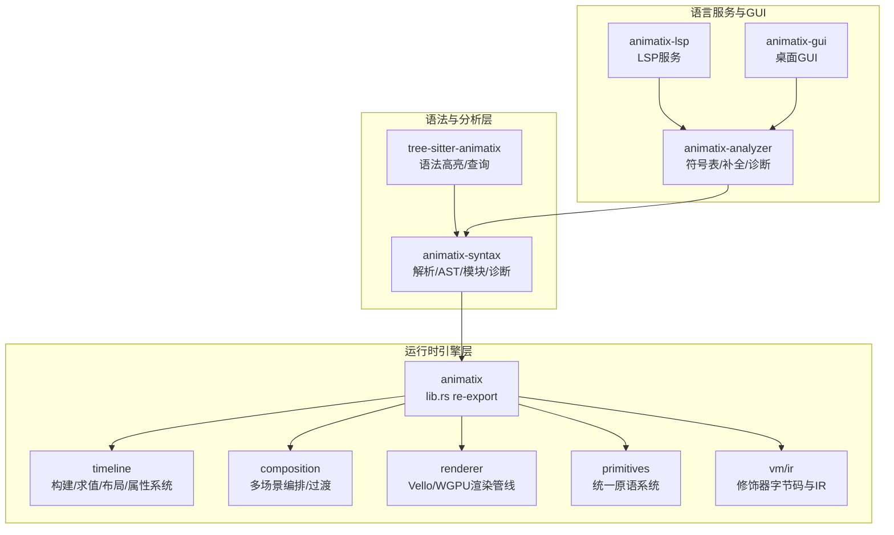
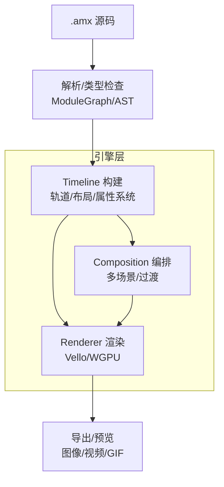
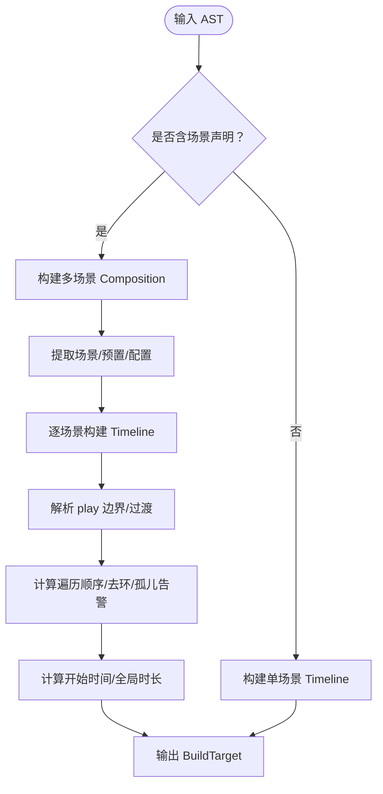
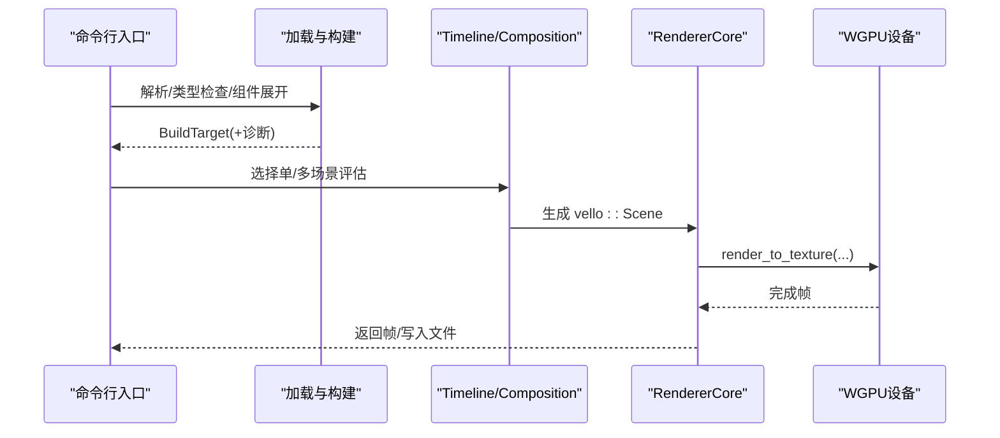
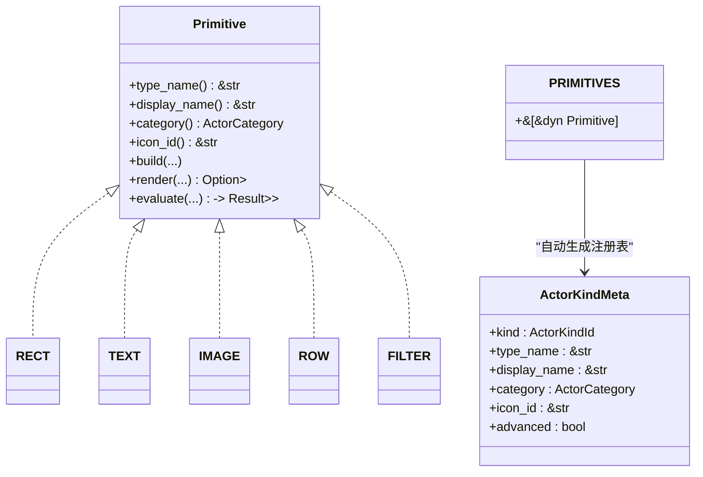
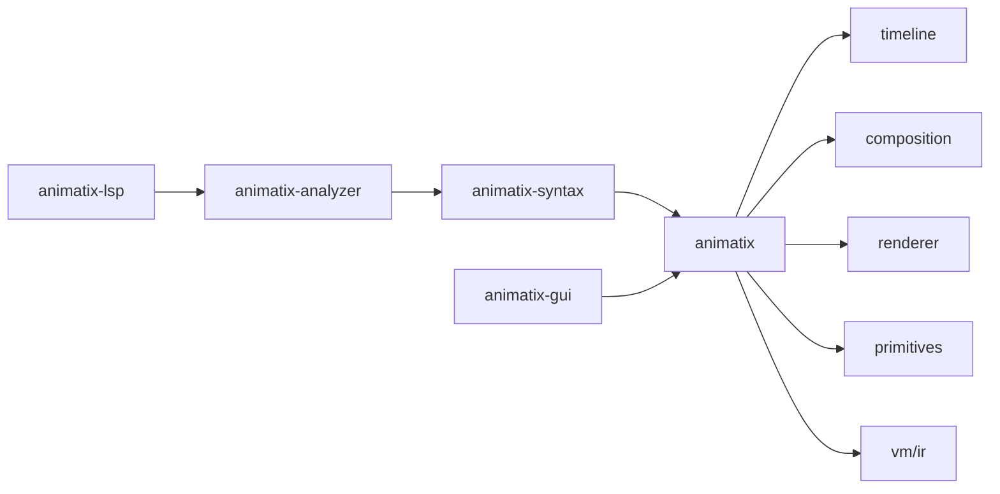
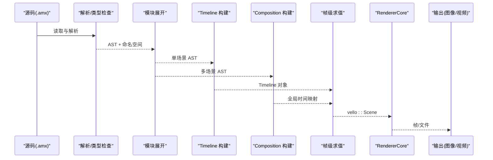

# 架构设计

<cite>
**本文引用的文件**
- [Cargo.toml](file://crates/animatix/Cargo.toml)
- [lib.rs](file://crates/animatix/src/lib.rs)
- [main.rs](file://crates/animatix/src/main.rs)
- [composition.rs](file://crates/animatix/src/composition.rs)
- [mod.rs（timeline）](file://crates/animatix/src/timeline/mod.rs)
- [scene_eval.rs](file://crates/animatix/src/timeline/scene_eval.rs)
- [track.rs](file://crates/animatix/src/timeline/track.rs)
- [mod.rs（renderer)】(file://crates/animatix/src/renderer/mod.rs)
- [core.rs（renderer）](file://crates/animatix/src/renderer/core.rs)
- [mod.rs（primitives）](file://crates/animatix/src/primitives/mod.rs)
- [vm.rs（重导出）](file://crates/animatix/src/vm.rs)
- [ir.rs（重导出）](file://crates/animatix/src/ir.rs)
- [mod.rs（modifier_runtime）](file://crates/animatix/src/timeline/modifier_runtime/mod.rs)
- [architecture.md](file://docs/architecture.md)
</cite>

## 目录
1. [引言](#引言)
2. [项目结构](#项目结构)
3. [核心组件](#核心组件)
4. [架构总览](#架构总览)
5. [详细组件分析](#详细组件分析)
6. [依赖分析](#依赖分析)
7. [性能考量](#性能考量)
8. [故障排查指南](#故障排查指南)
9. [结论](#结论)
10. [附录](#附录)

## 引言
本文件面向 Animatix 的架构设计，系统化阐述其分层架构、模块化组织与数据驱动实现方式；详解 timeline、composition、renderer、primitives、vm 等核心模块的职责与交互；给出从源码到最终渲染的完整数据流；解释关键设计决策与技术权衡，并提供系统边界、组件分解图、基础设施要求、可扩展性与部署拓扑建议，以及安全、监控与灾备等横切关注点。

## 项目结构
Animatix 采用多 crate 分层：语法与分析层（animatix-syntax）、运行时引擎层（animatix）、语言服务与 GUI（animatix-analyzer、animatix-lsp、animatix-gui、tree-sitter-animatix）。运行时引擎层进一步细分为 timeline、composition、renderer、primitives、vm/ir 子模块，形成清晰的编译期与运行期边界。



图表来源
- [lib.rs:12-24](file://crates/animatix/src/lib.rs#L12-L24)
- [architecture.md:682-714](file://docs/architecture.md#L682-L714)

章节来源
- [lib.rs:12-24](file://crates/animatix/src/lib.rs#L12-L24)
- [architecture.md:682-714](file://docs/architecture.md#L682-L714)

## 核心组件
- 解析与类型检查：基于 Chumsky 的语法解析与渐进式类型检查，生成 AST 并产出诊断。
- 模块系统：ModuleGraph 管理 import 与跨文件组件导出，支持命名空间别名与场景预置合并。
- 时间线（Timeline）：将 AST 降级为动画轨道与场景图，支持布局、路径插值、文本/矢量图绘制、滤镜容器等。
- 组合（Composition）：多场景编排，管理 play 边界、全局时间映射、过渡混合与诊断。
- 渲染（Renderer）：Vello/WGPU 驱动的离屏帧合成、窗口预览、视频/GIF 导出、滤镜后处理。
- 原语（Primitives）：统一的 Actor 原语注册与派发，支持形状、文本、媒体、图表、容器与滤镜。
- 修饰器运行时（VM/IR）：修饰器（如 always）在帧级执行，通过 IR/字节码降低开销。

章节来源
- [main.rs:210-230](file://crates/animatix/src/main.rs#L210-L230)
- [composition.rs:168-219](file://crates/animatix/src/composition.rs#L168-L219)
- [mod.rs（timeline）:1-102](file://crates/animatix/src/timeline/mod.rs#L1-L102)
- [mod.rs（renderer）:1-57](file://crates/animatix/src/renderer/mod.rs#L1-L57)
- [mod.rs（primitives）:1-60](file://crates/animatix/src/primitives/mod.rs#L1-L60)

## 架构总览
Animatix 采用“布局优先”的分层架构：语法层负责可逆的 AST 表达；引擎层完成编译期降级与运行期求值；渲染层以 Vello/WGPU 作为通用后端。多场景通过 Composition 在全局时间轴上进行过渡编排，单场景则由 Timeline 直接评估。



图表来源
- [architecture.md:14-53](file://docs/architecture.md#L14-L53)
- [main.rs:316-715](file://crates/animatix/src/main.rs#L316-L715)

## 详细组件分析

### 组件一：时间线（Timeline）
- 职责：将 AST 降级为动画轨道与场景图，提供帧级求值能力；内置布局系统、属性注册表、路径插值与文本/矢量图绘制。
- 关键子模块：
  - build/*：节点创建、容器元数据、属性提取、形状状态、演员声明与主处理流程。
  - runtime/scene_eval：帧级求值、节点变换、调试覆盖与命中区域计算。
  - track：动画轨道、位置绑定、布局尺寸与属性访问器。
  - property_engine/property_registry：属性注册表与读写分离的环境注入。
- 数据结构要点：AnimationTrack（几何/样式/负载三段存储）、PropertyTrack（键帧+缓动）、ContainerMetadata（容器布局配置）。
- 性能特性：帧缓存、静态子树缓存、变换缓存、文本编译器缓存、构建质量分级（Draft/Preview/Production）。

```mermaid
classDiagram
class Timeline {
+tracks : BTreeMap<String, AnimationTrack>
+root_nodes : Vec<String>
+modifiers : Vec<Stmt>
+modifier_programs : Vec<ModifierIrProgram>
+modifier_bytecode_programs : Vec<ModifierBytecodeProgram>
+layout_engine : LayoutEngine
+asset_cache : AssetCache
+text_compiler : TextCompiler
+evaluate(time_ms, dims) vello : : Scene
}
class AnimationTrack {
+position,size,rotation,scale,transform
+color,opacity,stroke_width,fill_opacity
+vector_paths,text_paths,image,svg_paths
+evaluate(time_ms) -> Values
}
class LayoutEngine {
+cache : HashMap<String, LayoutCacheEntry>
+compute_positions(...)
}
class PropertyTrack~T~ {
+keyframes : BTreeMap<u64,(T,Easing)>
+default_value : T
+evaluate(time_ms) T
}
Timeline --> AnimationTrack : "持有"
Timeline --> LayoutEngine : "使用"
AnimationTrack --> PropertyTrack : "包含"
```

图表来源
- [mod.rs（timeline）:431-502](file://crates/animatix/src/timeline/mod.rs#L431-L502)
- [track.rs:1-200](file://crates/animatix/src/timeline/track.rs#L1-L200)
- [scene_eval.rs:68-181](file://crates/animatix/src/timeline/scene_eval.rs#L68-L181)

章节来源
- [mod.rs（timeline）:1-102](file://crates/animatix/src/timeline/mod.rs#L1-L102)
- [track.rs:1-200](file://crates/animatix/src/timeline/track.rs#L1-L200)
- [scene_eval.rs:1-200](file://crates/animatix/src/timeline/scene_eval.rs#L1-L200)

### 组件二：组合（Composition）
- 职责：检测多场景标记，构建每个场景的时间线，解析 play 边界，计算全局时间映射与过渡混合，报告循环/孤立场景等诊断。
- 关键流程：从 AST 提取场景、构建 Timeline、收集 play 目标、计算遍历顺序、确定开始时间与全局时长。
- 输出：BuildTarget（单场景或多场景），供 CLI/GUI 自动路由。



图表来源
- [composition.rs:168-219](file://crates/animatix/src/composition.rs#L168-L219)
- [composition.rs:225-459](file://crates/animatix/src/composition.rs#L225-L459)

章节来源
- [composition.rs:1-120](file://crates/animatix/src/composition.rs#L1-L120)
- [composition.rs:168-219](file://crates/animatix/src/composition.rs#L168-L219)

### 组件三：渲染（Renderer）
- 职责：封装 Vello/WGPU 渲染器，提供离屏帧、窗口预览、视频/GIF 导出、滤镜后处理与零回读合成。
- 关键模块：
  - core：Vello 渲染器包装与零回读 blit。
  - offscreen：离屏渲染接口。
  - filter_backend：滤镜后端（CPU/GPU），支持 GPU 计算与零回读合成。
  - render_pipeline：渲染管线编排。
  - video/encode：视频编码与导出工具。
- 设计要点：统一后端保证 GUI 与 CLI 输出一致；滤镜容器支持嵌套与多重后处理；零回读路径避免 CPU 读写瓶颈。



图表来源
- [main.rs:316-715](file://crates/animatix/src/main.rs#L316-L715)
- [core.rs（renderer）:14-90](file://crates/animatix/src/renderer/core.rs#L14-L90)
- [mod.rs（renderer）:1-57](file://crates/animatix/src/renderer/mod.rs#L1-L57)

章节来源
- [mod.rs（renderer）:1-57](file://crates/animatix/src/renderer/mod.rs#L1-L57)
- [core.rs（renderer）:1-183](file://crates/animatix/src/renderer/core.rs#L1-L183)

### 组件四：原语（Primitives）
- 职责：统一 Actor 原语注册与派发，支持形状、文本、媒体、图表、容器与滤镜；提供构建、渲染、评估三阶段接口。
- 关键机制：PRIMITIVES 静态数组作为唯一新增入口；自动生成 ActorKindMeta 注册表；EvaluateCtx/Evaluate 评估迁移路径。
- 扩展流程：新增原语只需实现 Primitive trait 并加入 PRIMITIVES 数组，其余由注册表与派发自动完成。



图表来源
- [mod.rs（primitives）:419-568](file://crates/animatix/src/primitives/mod.rs#L419-L568)
- [mod.rs（primitives）:570-641](file://crates/animatix/src/primitives/mod.rs#L570-L641)

章节来源
- [mod.rs（primitives）:1-200](file://crates/animatix/src/primitives/mod.rs#L1-L200)
- [mod.rs（primitives）:570-641](file://crates/animatix/src/primitives/mod.rs#L570-L641)

### 组件五：修饰器运行时（VM/IR）
- 职责：修饰器（如 always）在帧级执行，通过 IR/字节码降低开销；支持修饰器程序编译与执行。
- 位置：位于 timeline/modifier_runtime 下，对外通过 vm.rs/ir.rs 重导出。

章节来源
- [vm.rs（重导出）:1-2](file://crates/animatix/src/vm.rs#L1-L2)
- [ir.rs（重导出）:1-2](file://crates/animatix/src/ir.rs#L1-L2)
- [mod.rs（modifier_runtime）:1-3](file://crates/animatix/src/timeline/modifier_runtime/mod.rs#L1-L3)

## 依赖分析
- 运行时依赖：wgpu、vello、bytemuck、pollster、image、rsmpeg、typst、fontdb、ttf-parser、usvg、roxmltree、taffy 等；通过特性开关启用渲染、视频、文本、SVG 功能。
- crate 间依赖：animatix 依赖 animatix-syntax；animatix-analyzer 仅依赖 animatix-syntax；GUI/LSP 可独立编译。
- 内部耦合：timeline 与 primitives 强关联（原语注册与派发）；composition 依赖 timeline；renderer 依赖 timeline 的场景与资源。



图表来源
- [Cargo.toml:14-37](file://crates/animatix/Cargo.toml#L14-L37)
- [lib.rs:5-11](file://crates/animatix/src/lib.rs#L5-L11)
- [architecture.md:733-754](file://docs/architecture.md#L733-L754)

章节来源
- [Cargo.toml:14-37](file://crates/animatix/Cargo.toml#L14-L37)
- [lib.rs:5-11](file://crates/animatix/src/lib.rs#L5-L11)
- [architecture.md:733-754](file://docs/architecture.md#L733-L754)

## 性能考量
- 构建质量分级：Draft/Preview/Production 影响绘图采样精度与缓存策略，兼顾 GUI 实时性与导出质量。
- 帧缓存与静态缓存：避免重复求值与重复编码；变换缓存提升时间连贯性。
- 文本编译缓存：按内容与字体参数缓存，减少重编译成本。
- 多线程导出：CLI 支持最大渲染线程数控制，提升视频/GIF 导出吞吐。
- 滤镜后处理：当前 CPU 管线存在 GPU→CPU 读回瓶颈；计划通过 GPU 计算管线与零回读合成优化。

章节来源
- [mod.rs（timeline）:150-190](file://crates/animatix/src/timeline/mod.rs#L150-L190)
- [scene_eval.rs:68-181](file://crates/animatix/src/timeline/scene_eval.rs#L68-L181)
- [mod.rs（renderer）:40-54](file://crates/animatix/src/renderer/mod.rs#L40-L54)

## 故障排查指南
- 诊断输出：CLI 提供文本/JSON 两种格式；Check 子命令可进行渲染冒烟测试，定位渲染错误。
- 常见问题：
  - Play 边界循环/孤立场景：Composition 会报告 PlayCycleDetected/OrphanScene。
  - 类型不匹配：渐进式类型检查产生 TypeMismatch 诊断。
  - 滤镜异常：确认 GPU 适配器支持与零回读路径可用性。
- 日志与颜色：支持 -v/-vv 控制日志级别，支持禁用 ANSI 颜色。

章节来源
- [main.rs:511-597](file://crates/animatix/src/main.rs#L511-L597)
- [composition.rs:62-121](file://crates/animatix/src/composition.rs#L62-L121)

## 结论
Animatix 通过清晰的分层与模块化设计，实现了从源码到渲染的一体化流程：语法层确保可逆与可编辑，引擎层提供高性能的编译与求值，渲染层以 Vello/WGPU 为通用后端。多场景编排与原语系统进一步增强了表达力与可扩展性。未来可在滤镜 GPU 化、修饰器执行优化等方面持续演进。

## 附录

### 数据流：从源码到渲染（序列图）


图表来源
- [main.rs:316-715](file://crates/animatix/src/main.rs#L316-L715)
- [composition.rs:168-219](file://crates/animatix/src/composition.rs#L168-L219)
- [mod.rs（timeline）:1-102](file://crates/animatix/src/timeline/mod.rs#L1-L102)
- [core.rs（renderer）:53-90](file://crates/animatix/src/renderer/core.rs#L53-L90)

### 基础设施与部署拓扑
- 基础设施要求：
  - Rust 工具链（1.85+），WGPU/适配器（Vulkan/WebGPU），FFmpeg（视频导出）。
  - 可选：GPU 显卡与驱动，以便启用 Vello/WGPU 加速与滤镜零回读。
- 部署拓扑：
  - CLI：直接运行 animatix 命令，支持图像/视频/GIF 导出。
  - GUI：桌面应用，依赖 animatix 与 animatix-syntax，提供可视化编辑与预览。
  - LSP：独立进程，依赖 animatix-analyzer 与 animatix-syntax，提供语言智能。
- 安全与合规：
  - 严格类型检查与诊断输出，避免运行时错误。
  - 无 I/O 的分析器模块，降低 LSP 侧攻击面。
- 监控与灾备：
  - 使用 tracing 记录运行时日志，结合 -v/-vv 控制粒度。
  - 视频导出失败时保留中间帧/临时文件清理策略，便于重试与审计。

章节来源
- [Cargo.toml:7-37](file://crates/animatix/Cargo.toml#L7-L37)
- [architecture.md:589-605](file://docs/architecture.md#L589-L605)