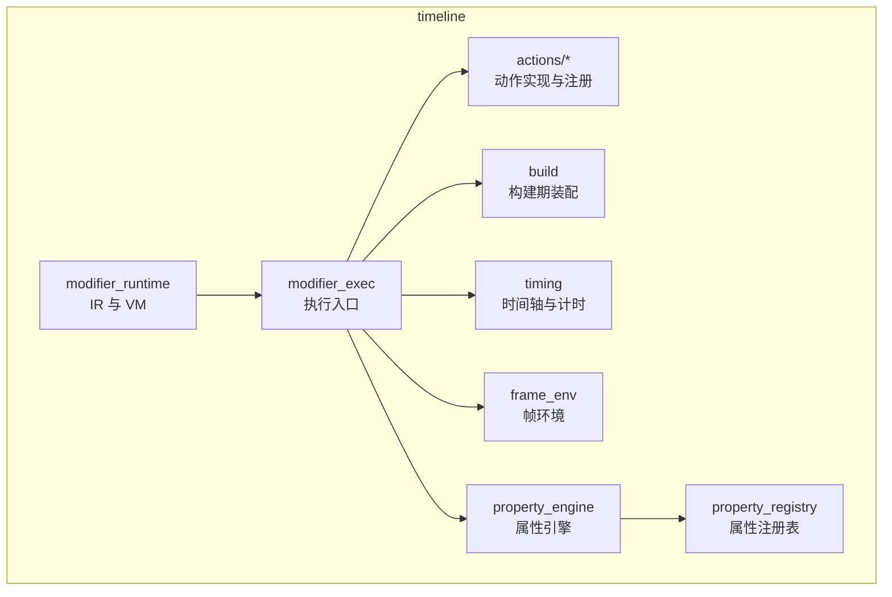
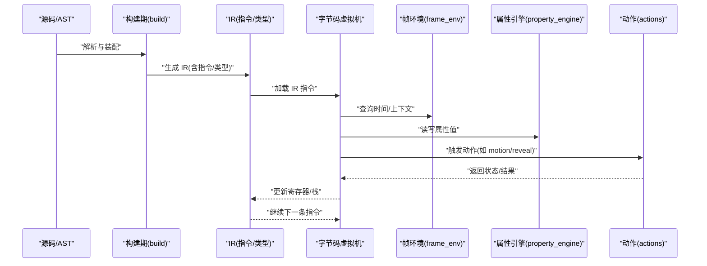
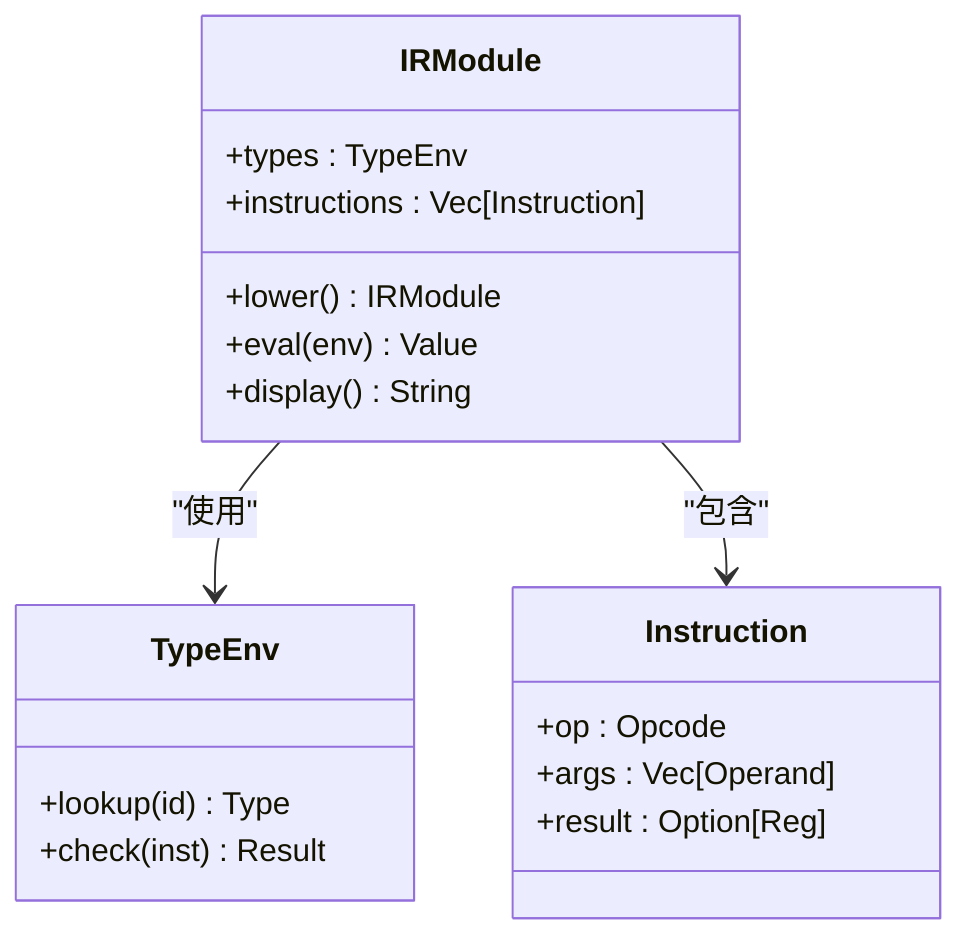
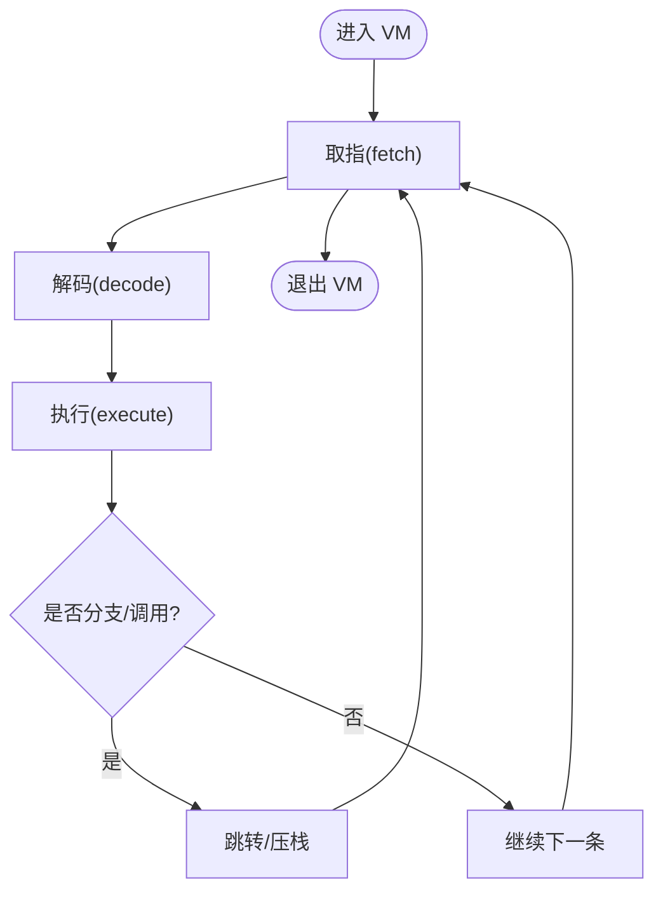
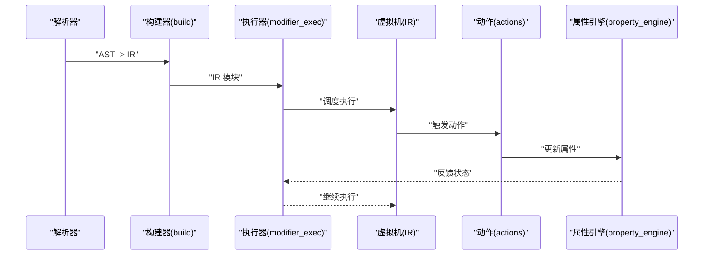
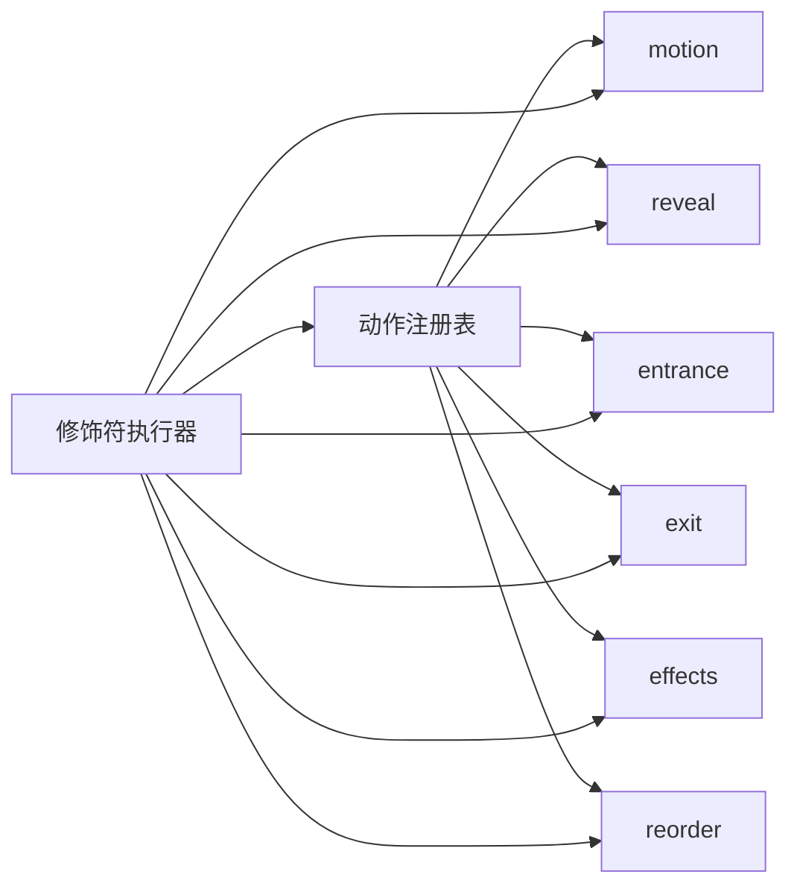
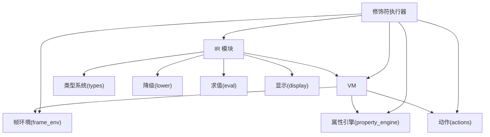

# 修饰符运行时

<cite>
**本文引用的文件**
- [crates/animatix/src/timeline/modifier_runtime/mod.rs](file://crates/animatix/src/timeline/modifier_runtime/mod.rs)
- [crates/animatix/src/timeline/modifier_runtime/vm.rs](file://crates/animatix/src/timeline/modifier_runtime/vm.rs)
- [crates/animatix/src/timeline/modifier_runtime/ir/mod.rs](file://crates/animatix/src/timeline/modifier_runtime/ir/mod.rs)
- [crates/animatix/src/timeline/modifier_runtime/ir/types.rs](file://crates/animatix/src/timeline/modifier_runtime/ir/types.rs)
- [crates/animatix/src/timeline/modifier_runtime/ir/lower.rs](file://crates/animatix/src/timeline/modifier_runtime/ir/lower.rs)
- [crates/animatix/src/timeline/modifier_runtime/ir/eval.rs](file://crates/animatix/src/timeline/modifier_runtime/ir/eval.rs)
- [crates/animatix/src/timeline/modifier_runtime/ir/display.rs](file://crates/animatix/src/timeline/modifier_runtime/ir/display.rs)
- [crates/animatix/src/timeline/modifier_exec.rs](file://crates/animatix/src/timeline/modifier_exec.rs)
- [crates/animatix/src/timeline/scene_eval.rs](file://crates/animatix/src/timeline/scene_eval.rs)
- [crates/animatix/src/timeline/actions/effects.rs](file://crates/animatix/src/timeline/actions/effects.rs)
- [crates/animatix/src/timeline/actions/motion.rs](file://crates/animatix/src/timeline/actions/motion.rs)
- [crates/animatix/src/timeline/actions/reveal.rs](file://crates/animatix/src/timeline/actions/reveal.rs)
- [crates/animatix/src/timeline/actions/entrance.rs](file://crates/animatix/src/timeline/actions/entrance.rs)
- [crates/animatix/src/timeline/actions/exit.rs](file://crates/animatix/src/timeline/actions/exit.rs)
- [crates/animatix/src/timeline/actions/reorder.rs](file://crates/animatix/src/timeline/actions/reorder.rs)
- [crates/animatix/src/timeline/actions/registry.rs](file://crates/animatix/src/timeline/actions/registry.rs)
- [crates/animatix/src/timeline/build/mod.rs](file://crates/animatix/src/timeline/build/mod.rs)
- [crates/animatix/src/timeline/timing.rs](file://crates/animatix/src/timeline/timing.rs)
- [crates/animatix/src/timeline/frame_env.rs](file://crates/animatix/src/timeline/frame_env.rs)
- [crates/animatix/src/timeline/property_engine.rs](file://crates/animatix/src/timeline/property_engine.rs)
- [crates/animatix/src/timeline/property_lookup.rs](file://crates/animatix/src/timeline/property_lookup.rs)
- [crates/animatix/src/timeline/property_registry.rs](file://crates/animatix/src/timeline/property_registry.rs)
- [crates/animatix/src/timeline/utils.rs](file://crates/animatix/src/timeline/utils.rs)
- [crates/animatix/src/lib.rs](file://crates/animatix/src/lib.rs)
- [crates/animatix/src/main.rs](file://crates/animatix/src/main.rs)
- [crates/animatix/Cargo.toml](file://crates/animatix/Cargo.toml)
- [crates/animatix/tests/ir_tests.rs](file://crates/animatix/tests/ir_tests.rs)
- [crates/animatix/benches/modifier_runtime.rs](file://crates/animatix/benches/modifier_runtime.rs)
- [crates/animatix/benches/vm_vs_ir.rs](file://crates/animatix/benches/vm_vs_ir.rs)
</cite>

## 目录
1. [引言](#引言)
2. [项目结构](#项目结构)
3. [核心组件](#核心组件)
4. [架构总览](#架构总览)
5. [详细组件分析](#详细组件分析)
6. [依赖关系分析](#依赖关系分析)
7. [性能考量](#性能考量)
8. [故障排查指南](#故障排查指南)
9. [结论](#结论)
10. [附录](#附录)

## 引言
本文件面向 Animatix 的“修饰符运行时”，系统性阐述其中间表示（IR）设计与实现、字节码虚拟机（VM）执行机制、修饰符编译流程（从源码到 IR 再到优化），并给出可操作的性能分析与调试建议。文档同时提供关键流程的序列图与时序图，帮助读者快速把握从解析、降级、求值到渲染管线的数据流与控制流。

## 项目结构
修饰符运行时位于 timeline 子系统中，核心目录组织如下：
- modifier_runtime：包含 IR 定义与变换、VM 执行器
- modifier_exec：修饰符执行入口与调度
- actions：具体动作（motion、reveal、entrance、exit、effects、reorder）的实现与注册
- build：构建期的修饰符装配与优化
- 其他相关模块：timing、frame_env、property_engine 等

**图表来源**
- [crates/animatix/src/timeline/modifier_runtime/mod.rs](file://crates/animatix/src/timeline/modifier_runtime/mod.rs)
- [crates/animatix/src/timeline/modifier_exec.rs](file://crates/animatix/src/timeline/modifier_exec.rs)
- [crates/animatix/src/timeline/actions/registry.rs](file://crates/animatix/src/timeline/actions/registry.rs)
- [crates/animatix/src/timeline/build/mod.rs](file://crates/animatix/src/timeline/build/mod.rs)
- [crates/animatix/src/timeline/timing.rs](file://crates/animatix/src/timeline/timing.rs)
- [crates/animatix/src/timeline/frame_env.rs](file://crates/animatix/src/timeline/frame_env.rs)
- [crates/animatix/src/timeline/property_engine.rs](file://crates/animatix/src/timeline/property_engine.rs)
- [crates/animatix/src/timeline/property_registry.rs](file://crates/animatix/src/timeline/property_registry.rs)

**章节来源**
- [crates/animatix/src/timeline/modifier_runtime/mod.rs](file://crates/animatix/src/timeline/modifier_runtime/mod.rs)
- [crates/animatix/src/timeline/modifier_exec.rs](file://crates/animatix/src/timeline/modifier_exec.rs)
- [crates/animatix/src/timeline/actions/registry.rs](file://crates/animatix/src/timeline/actions/registry.rs)

## 核心组件
- 中间表示（IR）子系统：定义修饰符的指令集、类型系统、显示与降级（lowering）、求值（evaluation）与调试显示。
- 字节码虚拟机（VM）：负责解释执行 IR 指令、管理寄存器与栈、进行必要的内存管理与垃圾回收。
- 修饰符执行器：在时间轴与帧环境中调度修饰符，协调动作、属性与渲染管线。
- 动作系统：提供运动、显隐、入场、出场、重排、特效等内置动作，并通过注册表统一管理。

**章节来源**
- [crates/animatix/src/timeline/modifier_runtime/ir/mod.rs](file://crates/animatix/src/timeline/modifier_runtime/ir/mod.rs)
- [crates/animatix/src/timeline/modifier_runtime/vm.rs](file://crates/animatix/src/timeline/modifier_runtime/vm.rs)
- [crates/animatix/src/timeline/modifier_exec.rs](file://crates/animatix/src/timeline/modifier_exec.rs)
- [crates/animatix/src/timeline/actions/registry.rs](file://crates/animatix/src/timeline/actions/registry.rs)

## 架构总览
下图展示了修饰符从“构建期”到“运行时”的整体流程：源码经由构建期装配为 IR，运行时由 VM 解释执行，期间与帧环境、属性引擎、动作系统协同工作。

**图表来源**
- [crates/animatix/src/timeline/build/mod.rs](file://crates/animatix/src/timeline/build/mod.rs)
- [crates/animatix/src/timeline/modifier_runtime/ir/mod.rs](file://crates/animatix/src/timeline/modifier_runtime/ir/mod.rs)
- [crates/animatix/src/timeline/modifier_runtime/vm.rs](file://crates/animatix/src/timeline/modifier_runtime/vm.rs)
- [crates/animatix/src/timeline/frame_env.rs](file://crates/animatix/src/timeline/frame_env.rs)
- [crates/animatix/src/timeline/property_engine.rs](file://crates/animatix/src/timeline/property_engine.rs)
- [crates/animatix/src/timeline/actions/motion.rs](file://crates/animatix/src/timeline/actions/motion.rs)
- [crates/animatix/src/timeline/actions/reveal.rs](file://crates/animatix/src/timeline/actions/reveal.rs)

## 详细组件分析

### IR 设计与实现
IR 是修饰符运行时的核心抽象，负责以指令形式表达修饰符的行为，并支持类型检查、降级与调试显示。

- 指令集与类型系统
  - IR 定义了修饰符指令的集合与语义，类型系统用于约束指令参数与结果。
  - 类型系统与显示/调试输出紧密耦合，便于在开发阶段可视化 IR 结构。
- 降级（Lowering）
  - 将高层 IR 转换为更基础的指令序列，消除高级构造，便于后续优化与执行。
- 求值（Evaluation）
  - 提供 IR 的求值接口，支持在给定帧环境与属性上下文中计算修饰符结果。
- 显示（Display）
  - 提供 IR 的人类可读打印与可视化能力，辅助调试与测试。

**图表来源**
- [crates/animatix/src/timeline/modifier_runtime/ir/mod.rs](file://crates/animatix/src/timeline/modifier_runtime/ir/mod.rs)
- [crates/animatix/src/timeline/modifier_runtime/ir/types.rs](file://crates/animatix/src/timeline/modifier_runtime/ir/types.rs)
- [crates/animatix/src/timeline/modifier_runtime/ir/lower.rs](file://crates/animatix/src/timeline/modifier_runtime/ir/lower.rs)
- [crates/animatix/src/timeline/modifier_runtime/ir/eval.rs](file://crates/animatix/src/timeline/modifier_runtime/ir/eval.rs)
- [crates/animatix/src/timeline/modifier_runtime/ir/display.rs](file://crates/animatix/src/timeline/modifier_runtime/ir/display.rs)

**章节来源**
- [crates/animatix/src/timeline/modifier_runtime/ir/mod.rs](file://crates/animatix/src/timeline/modifier_runtime/ir/mod.rs)
- [crates/animatix/src/timeline/modifier_runtime/ir/types.rs](file://crates/animatix/src/timeline/modifier_runtime/ir/types.rs)
- [crates/animatix/src/timeline/modifier_runtime/ir/lower.rs](file://crates/animatix/src/timeline/modifier_runtime/ir/lower.rs)
- [crates/animatix/src/timeline/modifier_runtime/ir/eval.rs](file://crates/animatix/src/timeline/modifier_runtime/ir/eval.rs)
- [crates/animatix/src/timeline/modifier_runtime/ir/display.rs](file://crates/animatix/src/timeline/modifier_runtime/ir/display.rs)

### 字节码虚拟机（VM）
VM 负责解释执行 IR 指令，管理寄存器与栈，处理控制流与函数调用，并进行必要的内存管理与垃圾回收。

- 指令解释
  - VM 遍历 IR 指令序列，按操作码执行相应逻辑；支持条件跳转、循环与函数调用。
- 寄存器与栈
  - 使用寄存器存储临时值，使用栈保存调用帧与局部变量；寄存器分配与回收策略影响性能。
- 垃圾回收
  - 在分配大量临时对象或长生命周期对象时，VM 需要周期性清理不可达对象，避免内存膨胀。
- 错误处理
  - 对越界访问、类型不匹配、栈溢出等异常进行捕获与报告，确保执行稳定性。

**图表来源**
- [crates/animatix/src/timeline/modifier_runtime/vm.rs](file://crates/animatix/src/timeline/modifier_runtime/vm.rs)

**章节来源**
- [crates/animatix/src/timeline/modifier_runtime/vm.rs](file://crates/animatix/src/timeline/modifier_runtime/vm.rs)

### 修饰符编译与执行流程
修饰符从源码到运行时的关键步骤如下：

- 源码解析与 AST 构建
  - 解析修饰符语法，生成 AST；随后进行类型检查与语义验证。
- 构建期装配（build）
  - 将 AST 转换为 IR 模块，完成指令生成与初步优化。
- 运行时执行（modifier_exec）
  - 在帧环境与时间轴驱动下，调度 IR 指令执行；与动作系统协作完成实际效果。
- 属性引擎与渲染
  - 属性引擎根据修饰符输出更新场景属性，驱动渲染管线产生最终画面。

**图表来源**
- [crates/animatix/src/timeline/build/mod.rs](file://crates/animatix/src/timeline/build/mod.rs)
- [crates/animatix/src/timeline/modifier_exec.rs](file://crates/animatix/src/timeline/modifier_exec.rs)
- [crates/animatix/src/timeline/modifier_runtime/vm.rs](file://crates/animatix/src/timeline/modifier_runtime/vm.rs)
- [crates/animatix/src/timeline/property_engine.rs](file://crates/animatix/src/timeline/property_engine.rs)
- [crates/animatix/src/timeline/actions/registry.rs](file://crates/animatix/src/timeline/actions/registry.rs)

**章节来源**
- [crates/animatix/src/timeline/build/mod.rs](file://crates/animatix/src/timeline/build/mod.rs)
- [crates/animatix/src/timeline/modifier_exec.rs](file://crates/animatix/src/timeline/modifier_exec.rs)
- [crates/animatix/src/timeline/property_engine.rs](file://crates/animatix/src/timeline/property_engine.rs)
- [crates/animatix/src/timeline/actions/registry.rs](file://crates/animatix/src/timeline/actions/registry.rs)

### 动作系统与修饰符交互
动作系统提供多种内置动作（motion、reveal、entrance、exit、effects、reorder），并通过注册表统一管理。修饰符在运行时可触发这些动作，实现复杂的视觉与交互效果。

**图表来源**
- [crates/animatix/src/timeline/actions/registry.rs](file://crates/animatix/src/timeline/actions/registry.rs)
- [crates/animatix/src/timeline/actions/motion.rs](file://crates/animatix/src/timeline/actions/motion.rs)
- [crates/animatix/src/timeline/actions/reveal.rs](file://crates/animatix/src/timeline/actions/reveal.rs)
- [crates/animatix/src/timeline/actions/entrance.rs](file://crates/animatix/src/timeline/actions/entrance.rs)
- [crates/animatix/src/timeline/actions/exit.rs](file://crates/animatix/src/timeline/actions/exit.rs)
- [crates/animatix/src/timeline/actions/effects.rs](file://crates/animatix/src/timeline/actions/effects.rs)
- [crates/animatix/src/timeline/actions/reorder.rs](file://crates/animatix/src/timeline/actions/reorder.rs)

**章节来源**
- [crates/animatix/src/timeline/actions/registry.rs](file://crates/animatix/src/timeline/actions/registry.rs)
- [crates/animatix/src/timeline/actions/motion.rs](file://crates/animatix/src/timeline/actions/motion.rs)
- [crates/animatix/src/timeline/actions/reveal.rs](file://crates/animatix/src/timeline/actions/reveal.rs)
- [crates/animatix/src/timeline/actions/entrance.rs](file://crates/animatix/src/timeline/actions/entrance.rs)
- [crates/animatix/src/timeline/actions/exit.rs](file://crates/animatix/src/timeline/actions/exit.rs)
- [crates/animatix/src/timeline/actions/effects.rs](file://crates/animatix/src/timeline/actions/effects.rs)
- [crates/animatix/src/timeline/actions/reorder.rs](file://crates/animatix/src/timeline/actions/reorder.rs)

## 依赖关系分析
修饰符运行时与时间轴、帧环境、属性引擎、动作系统之间存在强耦合关系，构建期与运行时的职责清晰分离。

**图表来源**
- [crates/animatix/src/timeline/modifier_runtime/ir/mod.rs](file://crates/animatix/src/timeline/modifier_runtime/ir/mod.rs)
- [crates/animatix/src/timeline/modifier_runtime/vm.rs](file://crates/animatix/src/timeline/modifier_runtime/vm.rs)
- [crates/animatix/src/timeline/modifier_exec.rs](file://crates/animatix/src/timeline/modifier_exec.rs)
- [crates/animatix/src/timeline/frame_env.rs](file://crates/animatix/src/timeline/frame_env.rs)
- [crates/animatix/src/timeline/property_engine.rs](file://crates/animatix/src/timeline/property_engine.rs)
- [crates/animatix/src/timeline/actions/registry.rs](file://crates/animatix/src/timeline/actions/registry.rs)

**章节来源**
- [crates/animatix/src/timeline/modifier_runtime/ir/mod.rs](file://crates/animatix/src/timeline/modifier_runtime/ir/mod.rs)
- [crates/animatix/src/timeline/modifier_runtime/vm.rs](file://crates/animatix/src/timeline/modifier_runtime/vm.rs)
- [crates/animatix/src/timeline/modifier_exec.rs](file://crates/animatix/src/timeline/modifier_exec.rs)
- [crates/animatix/src/timeline/frame_env.rs](file://crates/animatix/src/timeline/frame_env.rs)
- [crates/animatix/src/timeline/property_engine.rs](file://crates/animatix/src/timeline/property_engine.rs)
- [crates/animatix/src/timeline/actions/registry.rs](file://crates/animatix/src/timeline/actions/registry.rs)

## 性能考量
- IR 优化
  - 通过降级与常量折叠减少指令数量；利用类型信息进行分支消除与内联。
- VM 执行
  - 寄存器分配策略与缓存命中率直接影响性能；应避免频繁的堆分配与跨帧对象共享。
- 垃圾回收
  - 控制 GC 触发频率与暂停时间，优先采用分代回收策略；对短生命周期对象进行池化。
- 构建期优化
  - 在构建阶段完成尽可能多的静态分析与常量传播，降低运行时开销。
- 基准与回归
  - 使用基准测试持续监控修饰符执行与 VM 行为，及时发现性能退化。

[本节为通用性能指导，无需特定文件来源]

## 故障排查指南
- IR 相关问题
  - 使用 IR 的显示功能打印当前模块，核对指令序列与类型标注是否符合预期。
  - 逐步回放降级过程，定位类型不匹配或指令缺失的位置。
- VM 相关问题
  - 关注寄存器越界、栈不平衡、未初始化寄存器等错误；启用断点与单步执行定位问题指令。
  - 检查 GC 抖动与内存泄漏迹象，确认对象生命周期与引用关系。
- 执行问题
  - 在修饰符执行器处设置断点，观察帧环境与属性引擎的状态变化。
  - 对照动作注册表，确认触发的动作是否存在且参数正确。
- 测试与回归
  - 利用 IR 测试套件与基准测试，复现问题并编写最小化回归样例。

**章节来源**
- [crates/animatix/src/timeline/modifier_runtime/ir/display.rs](file://crates/animatix/src/timeline/modifier_runtime/ir/display.rs)
- [crates/animatix/src/timeline/modifier_runtime/vm.rs](file://crates/animatix/src/timeline/modifier_runtime/vm.rs)
- [crates/animatix/tests/ir_tests.rs](file://crates/animatix/tests/ir_tests.rs)
- [crates/animatix/benches/modifier_runtime.rs](file://crates/animatix/benches/modifier_runtime.rs)
- [crates/animatix/benches/vm_vs_ir.rs](file://crates/animatix/benches/vm_vs_ir.rs)

## 结论
修饰符运行时通过清晰的 IR 抽象与高效的 VM 执行，实现了从源码到可视化的完整链路。IR 的类型系统、降级与求值模块为优化与调试提供了坚实基础；VM 的指令解释、寄存器管理与垃圾回收保障了执行的稳定性与性能。配合动作系统与属性引擎，修饰符能够在时间轴上实现复杂而流畅的动画与交互效果。

[本节为总结性内容，无需特定文件来源]

## 附录
- 示例与基准
  - 可参考基准测试文件，了解修饰符执行与 VM 性能对比，作为优化与回归的依据。
- 相关模块索引
  - 修饰符执行入口、构建期装配、帧环境、属性引擎与动作注册表等模块均与运行时密切相关。

**章节来源**
- [crates/animatix/benches/modifier_runtime.rs](file://crates/animatix/benches/modifier_runtime.rs)
- [crates/animatix/benches/vm_vs_ir.rs](file://crates/animatix/benches/vm_vs_ir.rs)
- [crates/animatix/src/timeline/modifier_exec.rs](file://crates/animatix/src/timeline/modifier_exec.rs)
- [crates/animatix/src/timeline/build/mod.rs](file://crates/animatix/src/timeline/build/mod.rs)
- [crates/animatix/src/timeline/frame_env.rs](file://crates/animatix/src/timeline/frame_env.rs)
- [crates/animatix/src/timeline/property_engine.rs](file://crates/animatix/src/timeline/property_engine.rs)
- [crates/animatix/src/timeline/actions/registry.rs](file://crates/animatix/src/timeline/actions/registry.rs)