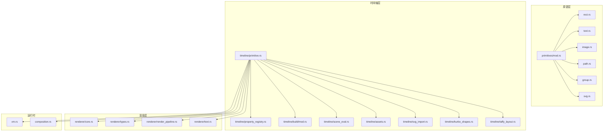
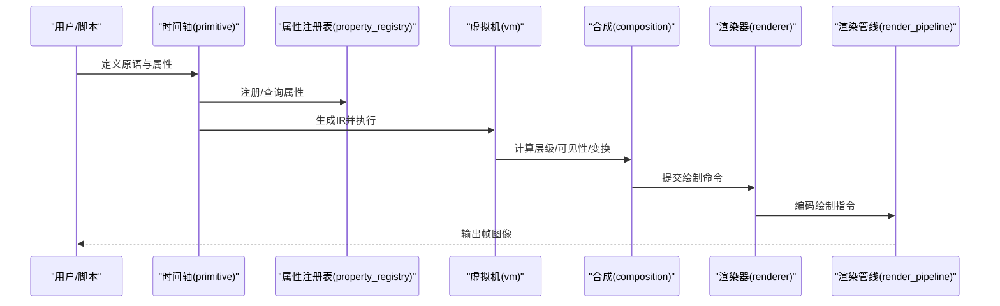
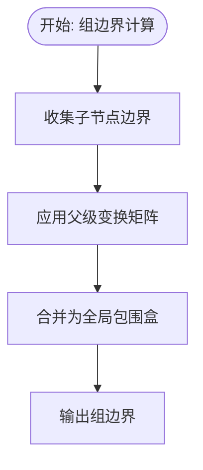
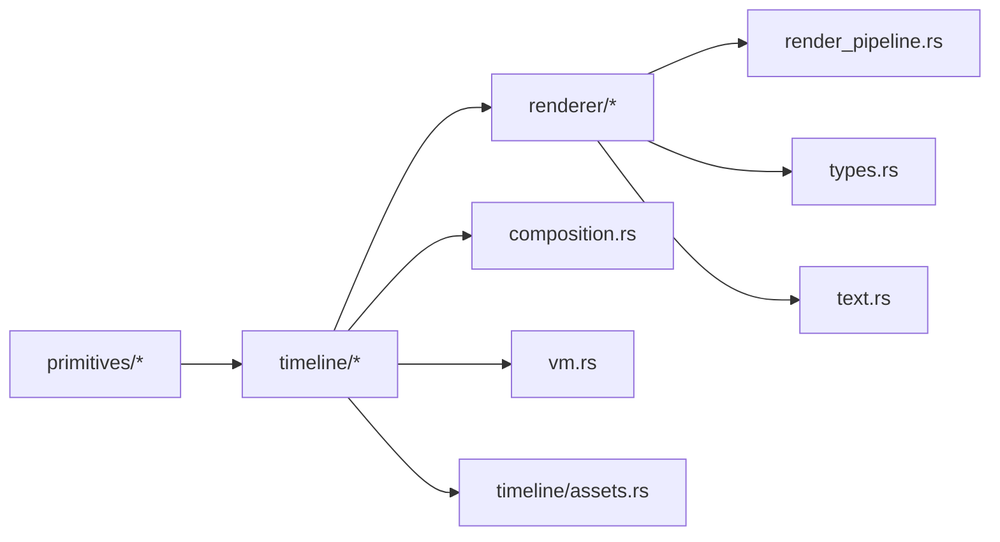

# 原语系统

<cite>
**本文引用的文件**
- [crates/animatix/src/lib.rs](file://crates/animatix/src/lib.rs)
- [crates/animatix/src/primitives/mod.rs](file://crates/animatix/src/primitives/mod.rs)
- [crates/animatix/src/primitives/rect.rs](file://crates/animatix/src/primitives/rect.rs)
- [crates/animatix/src/primitives/text.rs](file://crates/animatix/src/primitives/text.rs)
- [crates/animatix/src/primitives/image.rs](file://crates/animatix/src/primitives/image.rs)
- [crates/animatix/src/primitives/path.rs](file://crates/animatix/src/primitives/path.rs)
- [crates/animatix/src/primitives/group.rs](file://crates/animatix/src/primitives/group.rs)
- [crates/animatix/src/primitives/svg.rs](file://crates/animatix/src/primitives/svg.rs)
- [crates/animatix/src/timeline/primitive.rs](file://crates/animatix/src/timeline/primitive.rs)
- [crates/animatix/src/timeline/property_registry.rs](file://crates/animatix/src/timeline/property_registry.rs)
- [crates/animatix/src/renderer/types.rs](file://crates/animatix/src/renderer/types.rs)
- [crates/animatix/src/renderer/core.rs](file://crates/animatix/src/renderer/core.rs)
- [crates/animatix/src/renderer/render_pipeline.rs](file://crates/animatix/src/renderer/render_pipeline.rs)
- [crates/animatix/src/renderer/text.rs](file://crates/animatix/src/renderer/text.rs)
- [crates/animatix/src/composition.rs](file://crates/animatix/src/composition.rs)
- [crates/animatix/src/timeline/build/mod.rs](file://crates/animatix/src/timeline/build/mod.rs)
- [crates/animatix/src/timeline/scene_eval.rs](file://crates/animatix/src/timeline/scene_eval.rs)
- [crates/animatix/src/timeline/assets.rs](file://crates/animatix/src/timeline/assets.rs)
- [crates/animatix/src/timeline/svg_import.rs](file://crates/animatix/src/timeline/svg_import.rs)
- [crates/animatix/src/timeline/kurbo_shapes.rs](file://crates/animatix/src/timeline/kurbo_shapes.rs)
- [crates/animatix/src/timeline/taffy_layout.rs](file://crates/animatix/src/timeline/taffy_layout.rs)
- [crates/animatix/src/timeline/value_parser.rs](file://crates/animatix/src/timeline/value_parser.rs)
- [crates/animatix/src/timeline/utils.rs](file://crates/animatix/src/timeline/utils.rs)
- [crates/animatix/src/vm.rs](file://crates/animatix/src/vm.rs)
- [crates/animatix/Cargo.toml](file://crates/animatix/Cargo.toml)
- [docs/primitives.md](file://docs/primitives.md)
- [docs/properties.md](file://docs/properties.md)
- [docs/architecture.md](file://docs/architecture.md)
</cite>

## 目录
1. [引言](#引言)
2. [项目结构](#项目结构)
3. [核心组件](#核心组件)
4. [架构总览](#架构总览)
5. [详细组件分析](#详细组件分析)
6. [依赖分析](#依赖分析)
7. [性能考量](#性能考量)
8. [故障排查指南](#故障排查指南)
9. [结论](#结论)
10. [附录](#附录)

## 引言
本文件面向 Animatix 的原语系统，系统性阐述统一的视觉元素抽象接口设计、原语注册与属性系统、生命周期管理，以及各类原语（矩形、文本、图像、路径、组、SVG 等）的渲染逻辑与组合嵌套机制。文档同时提供扩展自定义原语的实践指南与最佳实践，帮助开发者在不破坏现有架构的前提下高效扩展。

## 项目结构
Animatix 将“原语”作为场景构建的基本单元，围绕原语的定义、属性、渲染与组合展开。核心目录与职责概览如下：
- primitives：内置原语类型集合（矩形、文本、图像、路径、组、SVG 等）
- timeline：原语在时间轴上的声明、属性注册、求值与执行
- renderer：渲染管线、离屏渲染、文本渲染、滤镜后端等
- composition：场景合成与层级管理
- vm：运行时虚拟机与中间表示（IR）执行
- 文档：primitives.md、properties.md、architecture.md 提供高层设计说明



图表来源
- [crates/animatix/src/primitives/mod.rs](file://crates/animatix/src/primitives/mod.rs)
- [crates/animatix/src/timeline/primitive.rs](file://crates/animatix/src/timeline/primitive.rs)
- [crates/animatix/src/timeline/property_registry.rs](file://crates/animatix/src/timeline/property_registry.rs)
- [crates/animatix/src/timeline/build/mod.rs](file://crates/animatix/src/timeline/build/mod.rs)
- [crates/animatix/src/timeline/scene_eval.rs](file://crates/animatix/src/timeline/scene_eval.rs)
- [crates/animatix/src/timeline/assets.rs](file://crates/animatix/src/timeline/assets.rs)
- [crates/animatix/src/timeline/svg_import.rs](file://crates/animatix/src/timeline/svg_import.rs)
- [crates/animatix/src/timeline/kurbo_shapes.rs](file://crates/animatix/src/timeline/kurbo_shapes.rs)
- [crates/animatix/src/timeline/taffy_layout.rs](file://crates/animatix/src/timeline/taffy_layout.rs)
- [crates/animatix/src/renderer/core.rs](file://crates/animatix/src/renderer/core.rs)
- [crates/animatix/src/renderer/types.rs](file://crates/animatix/src/renderer/types.rs)
- [crates/animatix/src/renderer/render_pipeline.rs](file://crates/animatix/src/renderer/render_pipeline.rs)
- [crates/animatix/src/renderer/text.rs](file://crates/animatix/src/renderer/text.rs)
- [crates/animatix/src/composition.rs](file://crates/animatix/src/composition.rs)
- [crates/animatix/src/vm.rs](file://crates/animatix/src/vm.rs)

章节来源
- [crates/animatix/src/lib.rs](file://crates/animatix/src/lib.rs)
- [crates/animatix/src/primitives/mod.rs](file://crates/animatix/src/primitives/mod.rs)
- [crates/animatix/src/timeline/primitive.rs](file://crates/animatix/src/timeline/primitive.rs)
- [crates/animatix/src/timeline/property_registry.rs](file://crates/animatix/src/timeline/property_registry.rs)
- [crates/animatix/src/renderer/core.rs](file://crates/animatix/src/renderer/core.rs)
- [crates/animatix/src/renderer/types.rs](file://crates/animatix/src/renderer/types.rs)
- [crates/animatix/src/renderer/render_pipeline.rs](file://crates/animatix/src/renderer/render_pipeline.rs)
- [crates/animatix/src/renderer/text.rs](file://crates/animatix/src/renderer/text.rs)
- [crates/animatix/src/composition.rs](file://crates/animatix/src/composition.rs)
- [crates/animatix/src/vm.rs](file://crates/animatix/src/vm.rs)

## 核心组件
- 统一原语接口与注册表
  - 原语注册与发现：通过模块导出与集中注册，确保新原语可被时间轴解析与渲染器识别。
  - 属性系统：基于属性注册表对原语属性进行声明、验证与求值，支持动画插值与跨帧缓存。
- 渲染子系统
  - 渲染类型与管线：定义绘制资源、命令编码与渲染通道组织。
  - 文本渲染：独立的文本着色器与布局策略，支持字体与字形栅格化。
  - 滤镜后端：可选的滤镜链路，用于特效叠加。
- 时间轴与运行时
  - 原语在时间轴上的声明与执行：从 AST 到 IR 再到 VM 执行，贯穿属性求值与渲染调度。
  - 场景求值与合成：按层级顺序合成，处理可见性、裁剪与过渡效果。
- 组合与嵌套
  - 组原语承载子节点，维护层级关系与变换矩阵传播。
  - 边界计算：基于子树几何信息推导父级包围盒，支撑布局与裁剪。

章节来源
- [crates/animatix/src/timeline/primitive.rs](file://crates/animatix/src/timeline/primitive.rs)
- [crates/animatix/src/timeline/property_registry.rs](file://crates/animatix/src/timeline/property_registry.rs)
- [crates/animatix/src/renderer/types.rs](file://crates/animatix/src/renderer/types.rs)
- [crates/animatix/src/renderer/core.rs](file://crates/animatix/src/renderer/core.rs)
- [crates/animatix/src/renderer/text.rs](file://crates/animatix/src/renderer/text.rs)
- [crates/animatix/src/composition.rs](file://crates/animatix/src/composition.rs)
- [crates/animatix/src/timeline/scene_eval.rs](file://crates/animatix/src/timeline/scene_eval.rs)

## 架构总览
下图展示了从“原语定义”到“渲染输出”的关键流程：原语在时间轴层被声明与求值，属性通过注册表参与插值与缓存；渲染层根据原语类型选择合适的绘制路径，并在必要时应用滤镜与文本栅格化；最终由合成器组织层级与变换，生成最终画面。



图表来源
- [crates/animatix/src/timeline/primitive.rs](file://crates/animatix/src/timeline/primitive.rs)
- [crates/animatix/src/timeline/property_registry.rs](file://crates/animatix/src/timeline/property_registry.rs)
- [crates/animatix/src/vm.rs](file://crates/animatix/src/vm.rs)
- [crates/animatix/src/composition.rs](file://crates/animatix/src/composition.rs)
- [crates/animatix/src/renderer/render_pipeline.rs](file://crates/animatix/src/renderer/render_pipeline.rs)

## 详细组件分析

### 统一原语接口与注册表
- 接口设计
  - 原语需实现一致的生命周期方法：初始化、属性更新、边界计算、渲染准备与提交。
  - 属性以键值形式注册，支持类型检查、默认值与插值策略。
- 注册机制
  - 通过模块导出与集中注册，新原语只需在导出列表中声明即可被系统发现。
  - 属性注册表负责校验与缓存，避免重复解析与错误传播。
- 生命周期管理
  - 初始化阶段完成资源加载与状态建立。
  - 每帧更新阶段处理属性插值与脏标记清理。
  - 渲染阶段仅提交必要的绘制命令，减少冗余调用。

```mermaid
classDiagram
class Primitive {
"+初始化()"
"+更新属性()"
"+计算边界()"
"+准备渲染()"
"+提交渲染()"
}
class PropertyRegistry {
"+注册属性()"
"+查询属性()"
"+缓存结果()"
}
class GroupPrimitive {
"+添加子节点()"
"+移除子节点()"
"+传播变换()"
"+聚合边界()"
}
Primitive <|-- GroupPrimitive
Primitive --> PropertyRegistry : "使用"
```

图表来源
- [crates/animatix/src/timeline/primitive.rs](file://crates/animatix/src/timeline/primitive.rs)
- [crates/animatix/src/timeline/property_registry.rs](file://crates/animatix/src/timeline/property_registry.rs)
- [crates/animatix/src/primitives/group.rs](file://crates/animatix/src/primitives/group.rs)

章节来源
- [crates/animatix/src/timeline/primitive.rs](file://crates/animatix/src/timeline/primitive.rs)
- [crates/animatix/src/timeline/property_registry.rs](file://crates/animatix/src/timeline/property_registry.rs)
- [crates/animatix/src/primitives/group.rs](file://crates/animatix/src/primitives/group.rs)

### 矩形原语（Rect）
- 渲染逻辑
  - 使用基础几何绘制，支持填充、描边与圆角参数。
  - 在渲染类型中映射为简单图元，避免复杂栅格化开销。
- 性能要点
  - 合理设置圆角与描边宽度，避免过度细分导致顶点膨胀。
  - 复用相同样式的矩形，利用渲染器的批处理能力。

章节来源
- [crates/animatix/src/primitives/rect.rs](file://crates/animatix/src/primitives/rect.rs)
- [crates/animatix/src/renderer/types.rs](file://crates/animatix/src/renderer/types.rs)

### 文本原语（Text）
- 渲染逻辑
  - 文本原语依赖独立的文本渲染模块，结合字体度量与字形栅格化生成位图。
  - 支持多行文本、对齐、换行与裁剪策略。
- 性能要点
  - 字体缓存与字形复用，避免重复加载。
  - 合理控制文本尺寸与分辨率，平衡清晰度与内存占用。

章节来源
- [crates/animatix/src/primitives/text.rs](file://crates/animatix/src/primitives/text.rs)
- [crates/animatix/src/renderer/text.rs](file://crates/animatix/src/renderer/text.rs)

### 图像原语（Image）
- 渲染逻辑
  - 加载外部图像资源，支持缩放、裁剪与变换。
  - 在渲染类型中映射为纹理采样与变换矩阵应用。
- 性能要点
  - 预先解码与格式转换，减少运行时 CPU 开销。
  - 纹理池与共享策略，降低内存峰值。

章节来源
- [crates/animatix/src/primitives/image.rs](file://crates/animatix/src/primitives/image.rs)
- [crates/animatix/src/timeline/assets.rs](file://crates/animatix/src/timeline/assets.rs)

### 路径原语（Path）
- 渲染逻辑
  - 路径由一系列几何段组成，支持填充与描边。
  - 可与时间轴的 morph 功能配合，实现路径变形动画。
- 性能要点
  - 对复杂路径进行简化或分段，减少顶点数量。
  - 描边宽度与抗锯齿策略需权衡质量与性能。

章节来源
- [crates/animatix/src/primitives/path.rs](file://crates/animatix/src/primitives/path.rs)
- [crates/animatix/src/timeline/morph.rs](file://crates/animatix/src/timeline/morph.rs)

### 组原语（Group）
- 组合与嵌套
  - 组原语持有子节点列表，负责传播父级变换矩阵至子节点。
  - 子节点的边界计算需考虑父级变换，以保证父级包围盒准确。
- 边界计算
  - 通过聚合子节点边界并应用变换，得到组的全局包围盒。
  - 该包围盒用于裁剪、可见性判断与布局优化。



图表来源
- [crates/animatix/src/primitives/group.rs](file://crates/animatix/src/primitives/group.rs)

章节来源
- [crates/animatix/src/primitives/group.rs](file://crates/animatix/src/primitives/group.rs)

### SVG 原语（SVG）
- 导入与解析
  - 通过 SVG 导入模块解析外部 SVG 文件，提取路径、形状与样式。
  - 将 SVG 几何转换为内部路径原语，保持与路径原语一致的渲染路径。
- 性能要点
  - 对大型 SVG 进行预处理与简化，减少运行时解析成本。
  - 共享样式与渐变资源，避免重复创建。

章节来源
- [crates/animatix/src/primitives/svg.rs](file://crates/animatix/src/primitives/svg.rs)
- [crates/animatix/src/timeline/svg_import.rs](file://crates/animatix/src/timeline/svg_import.rs)
- [crates/animatix/src/timeline/kurbo_shapes.rs](file://crates/animatix/src/timeline/kurbo_shapes.rs)

### 自定义原语扩展指南
- 实现步骤
  - 定义原语数据结构与属性字段，参考内置原语的属性命名与类型。
  - 在原语模块中实现生命周期方法：初始化、属性更新、边界计算、渲染准备与提交。
  - 在属性注册表中注册新属性，声明类型、默认值与插值策略。
  - 在渲染层选择合适的绘制路径，必要时新增渲染类型或复用现有类型。
- 渲染优化
  - 尽量复用资源与状态，避免每帧重建。
  - 控制几何复杂度与采样分辨率，结合性能分析工具定位瓶颈。
- 示例路径
  - 参考矩形、文本、图像、路径与 SVG 的实现文件，遵循相同的接口契约与生命周期模式。

章节来源
- [crates/animatix/src/primitives/mod.rs](file://crates/animatix/src/primitives/mod.rs)
- [crates/animatix/src/timeline/property_registry.rs](file://crates/animatix/src/timeline/property_registry.rs)
- [crates/animatix/src/renderer/types.rs](file://crates/animatix/src/renderer/types.rs)

## 依赖分析
- 模块耦合
  - primitives 依赖 timeline 的属性系统与运行时环境。
  - timeline 依赖 renderer 的类型与管线，以及 composition 的层级管理。
  - renderer 依赖 assets 与 shader 资源，以及文本渲染模块。
- 关键依赖链
  - 原语定义 → 属性注册 → 时间轴求值 → VM 执行 → 合成 → 渲染 → 输出。
- 循环依赖规避
  - 通过清晰的模块边界与接口抽象，避免原语与渲染器之间的直接循环引用。



图表来源
- [crates/animatix/src/primitives/mod.rs](file://crates/animatix/src/primitives/mod.rs)
- [crates/animatix/src/timeline/primitive.rs](file://crates/animatix/src/timeline/primitive.rs)
- [crates/animatix/src/timeline/property_registry.rs](file://crates/animatix/src/timeline/property_registry.rs)
- [crates/animatix/src/renderer/core.rs](file://crates/animatix/src/renderer/core.rs)
- [crates/animatix/src/renderer/types.rs](file://crates/animatix/src/renderer/types.rs)
- [crates/animatix/src/renderer/render_pipeline.rs](file://crates/animatix/src/renderer/render_pipeline.rs)
- [crates/animatix/src/renderer/text.rs](file://crates/animatix/src/renderer/text.rs)
- [crates/animatix/src/composition.rs](file://crates/animatix/src/composition.rs)
- [crates/animatix/src/vm.rs](file://crates/animatix/src/vm.rs)

章节来源
- [crates/animatix/src/timeline/build/mod.rs](file://crates/animatix/src/timeline/build/mod.rs)
- [crates/animatix/src/timeline/scene_eval.rs](file://crates/animatix/src/timeline/scene_eval.rs)
- [crates/animatix/src/timeline/assets.rs](file://crates/animatix/src/timeline/assets.rs)
- [crates/animatix/src/timeline/svg_import.rs](file://crates/animatix/src/timeline/svg_import.rs)
- [crates/animatix/src/timeline/kurbo_shapes.rs](file://crates/animatix/src/timeline/kurbo_shapes.rs)
- [crates/animatix/src/timeline/taffy_layout.rs](file://crates/animatix/src/timeline/taffy_layout.rs)

## 性能考量
- 属性插值与缓存
  - 利用属性注册表的缓存机制，避免重复计算；对昂贵属性采用增量更新策略。
- 渲染批处理
  - 合理组织绘制命令，尽量批量提交相同材质与状态的图元。
- 资源管理
  - 字体、纹理与着色器资源应预热与共享，减少运行时分配与切换。
- 几何与采样
  - 控制路径细分与文本分辨率，结合可视质量评估进行取舍。
- 布局与可见性
  - 使用边界与可见性裁剪，减少不可见对象的渲染与计算。

## 故障排查指南
- 常见问题
  - 属性未注册或类型不匹配：检查属性注册表中的声明与默认值。
  - 渲染异常或黑屏：确认渲染类型与资源绑定是否正确，检查着色器与管线配置。
  - 性能抖动：关注属性更新频率与几何复杂度，使用性能分析工具定位热点。
- 调试建议
  - 分步验证：先验证原语生命周期回调是否完整触发，再逐步接入渲染。
  - 最小复现：构造最小场景，排除无关因素，快速定位问题根因。
  - 日志与断言：在关键路径增加日志与断言，确保状态一致性。

章节来源
- [crates/animatix/src/timeline/property_registry.rs](file://crates/animatix/src/timeline/property_registry.rs)
- [crates/animatix/src/renderer/render_pipeline.rs](file://crates/animatix/src/renderer/render_pipeline.rs)
- [crates/animatix/src/timeline/scene_eval.rs](file://crates/animatix/src/timeline/scene_eval.rs)

## 结论
Animatix 的原语系统通过统一接口、属性注册与生命周期管理，实现了高内聚、低耦合的可视化元素抽象。内置原语覆盖常见图形与媒体类型，组与嵌套机制支持复杂的层级与变换。借助清晰的渲染管线与运行时执行模型，系统在保证易扩展的同时兼顾性能与可维护性。遵循本文的最佳实践与扩展指南，开发者可以安全地引入新的原语类型并优化整体表现。

## 附录
- 相关文档
  - 原语设计与属性体系：参阅文档目录中的 primitives.md 与 properties.md。
  - 架构概览：参阅 architecture.md。
- 版本与依赖
  - 顶层 Cargo.toml 定义了各子 crate 的版本与依赖关系，便于理解模块边界与升级路径。

章节来源
- [docs/primitives.md](file://docs/primitives.md)
- [docs/properties.md](file://docs/properties.md)
- [docs/architecture.md](file://docs/architecture.md)
- [crates/animatix/Cargo.toml](file://crates/animatix/Cargo.toml)