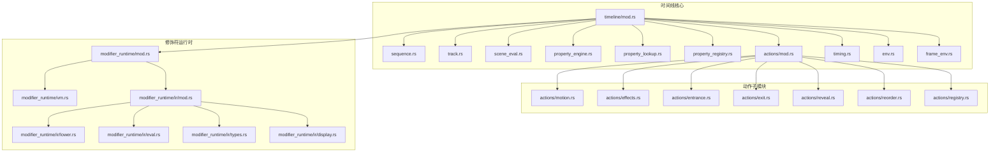
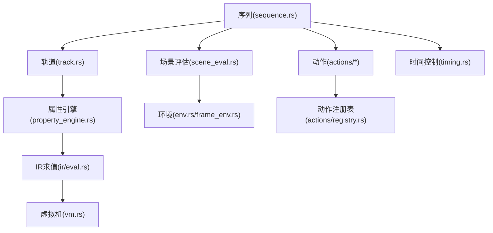
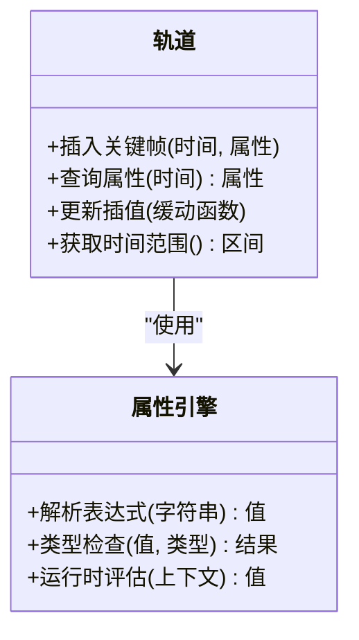
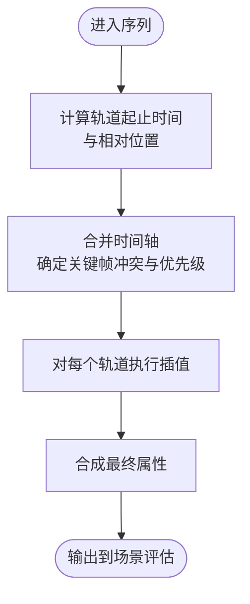
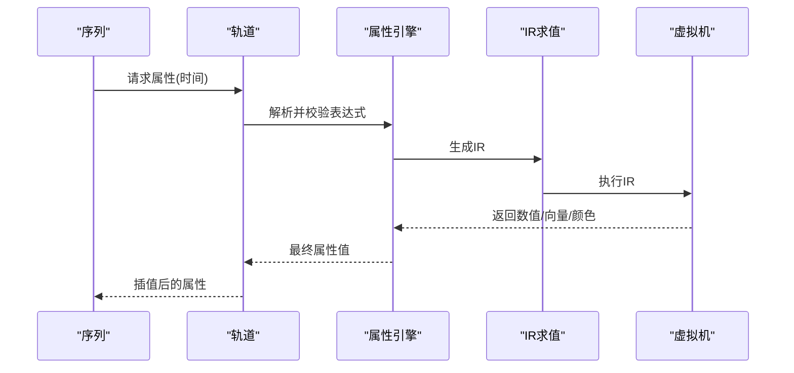
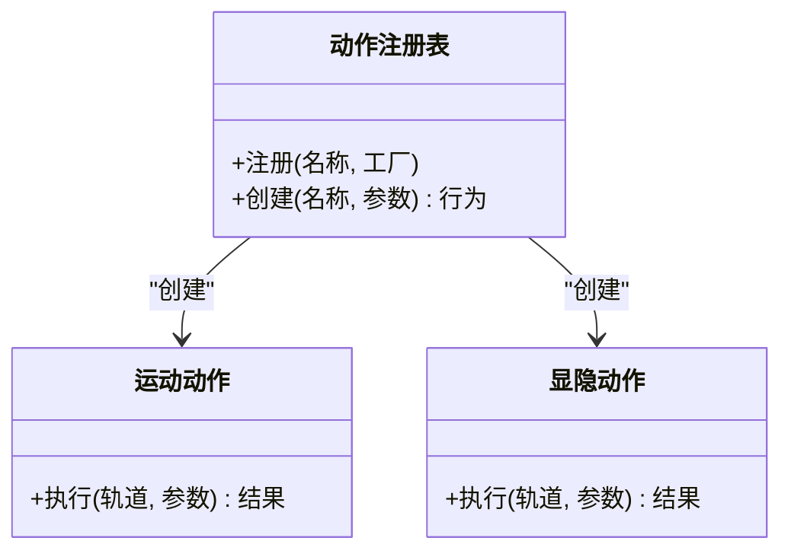
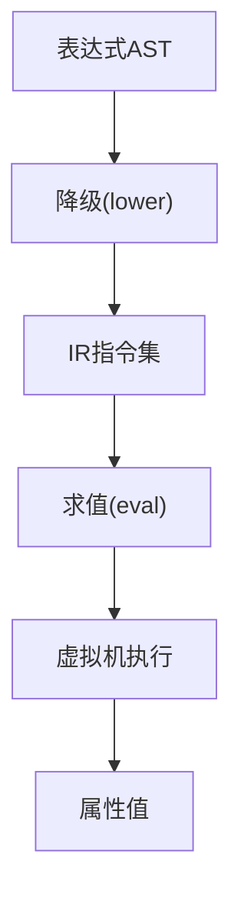
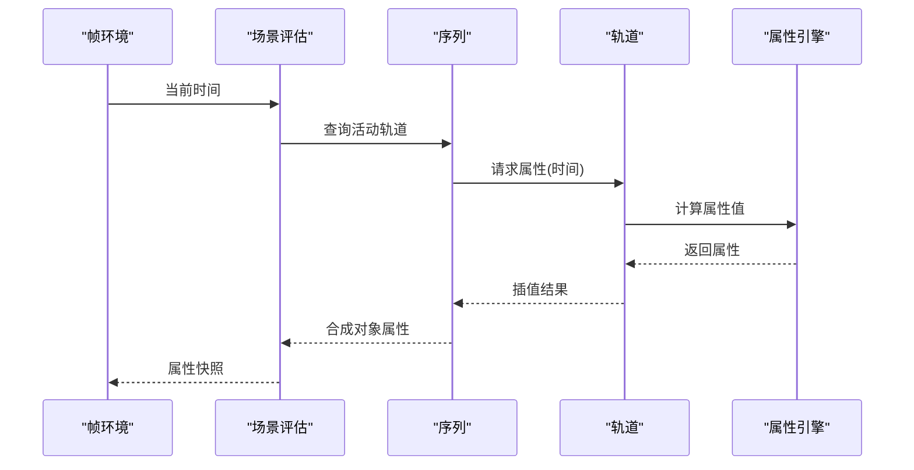
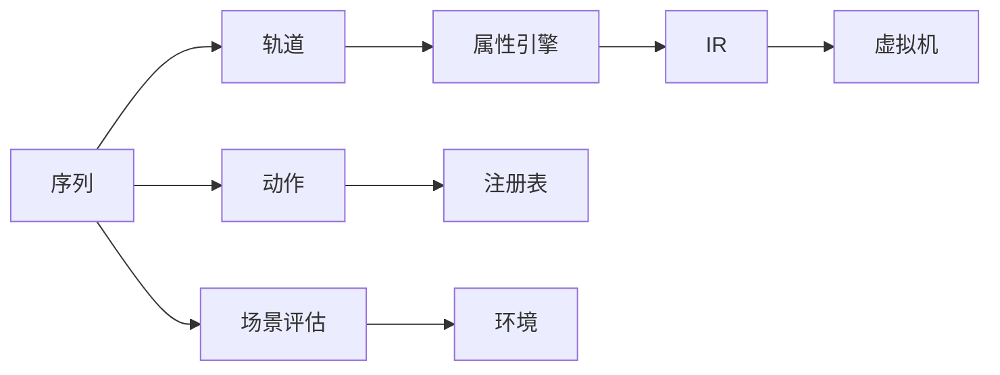

# 时间线系统

<cite>
**本文引用的文件**
- [crates/animatix/src/timeline/mod.rs](file://crates/animatix/src/timeline/mod.rs)
- [crates/animatix/src/timeline/track.rs](file://crates/animatix/src/timeline/track.rs)
- [crates/animatix/src/timeline/sequence.rs](file://crates/animatix/src/timeline/sequence.rs)
- [crates/animatix/src/timeline/property_engine.rs](file://crates/animatix/src/timeline/property_engine.rs)
- [crates/animatix/src/timeline/scene_eval.rs](file://crates/animatix/src/timeline/scene_eval.rs)
- [crates/animatix/src/timeline/actions/mod.rs](file://crates/animatix/src/timeline/actions/mod.rs)
- [crates/animatix/src/timeline/actions/motion.rs](file://crates/animatix/src/timeline/actions/motion.rs)
- [crates/animatix/src/timeline/actions/effects.rs](file://crates/animatix/src/timeline/actions/effects.rs)
- [crates/animatix/src/timeline/actions/entrance.rs](file://crates/animatix/src/timeline/actions/entrance.rs)
- [crates/animatix/src/timeline/actions/exit.rs](file://crates/animatix/src/timeline/actions/exit.rs)
- [crates/animatix/src/timeline/actions/reveal.rs](file://crates/animatix/src/timeline/actions/reveal.rs)
- [crates/animatix/src/timeline/actions/reorder.rs](file://crates/animatix/src/timeline/actions/reorder.rs)
- [crates/animatix/src/timeline/actions/registry.rs](file://crates/animatix/src/timeline/actions/registry.rs)
- [crates/animatix/src/timeline/property_lookup.rs](file://crates/animatix/src/timeline/property_lookup.rs)
- [crates/animatix/src/timeline/property_registry.rs](file://crates/animatix/src/timeline/property_registry.rs)
- [crates/animatix/src/timeline/timing.rs](file://crates/animatix/src/timeline/timing.rs)
- [crates/animatix/src/timeline/env.rs](file://crates/animatix/src/timeline/env.rs)
- [crates/animatix/src/timeline/frame_env.rs](file://crates/animatix/src/timeline/frame_env.rs)
- [crates/animatix/src/timeline/assignments.rs](file://crates/animatix/src/timeline/assignments.rs)
- [crates/animatix/src/timeline/index.rs](file://crates/animatix/src/timeline/index.rs)
- [crates/animatix/src/timeline/utils.rs](file://crates/animatix/src/timeline/utils.rs)
- [crates/animatix/src/timeline/build/mod.rs](file://crates/animatix/src/timeline/build/mod.rs)
- [crates/animatix/src/timeline/modifier_runtime/mod.rs](file://crates/animatix/src/timeline/modifier_runtime/mod.rs)
- [crates/animatix/src/timeline/modifier_runtime/vm.rs](file://crates/animatix/src/timeline/modifier_runtime/vm.rs)
- [crates/animatix/src/timeline/modifier_runtime/ir/mod.rs](file://crates/animatix/src/timeline/modifier_runtime/ir/mod.rs)
- [crates/animatix/src/timeline/modifier_runtime/ir/lower.rs](file://crates/animatix/src/timeline/modifier_runtime/ir/lower.rs)
- [crates/animatix/src/timeline/modifier_runtime/ir/eval.rs](file://crates/animatix/src/timeline/modifier_runtime/ir/eval.rs)
- [crates/animatix/src/timeline/modifier_runtime/ir/types.rs](file://crates/animatix/src/timeline/modifier_runtime/ir/types.rs)
- [crates/animatix/src/timeline/modifier_runtime/ir/display.rs](file://crates/animatix/src/timeline/modifier_runtime/ir/display.rs)
- [crates/animatix/src/timeline/tests.rs](file://crates/animatix/src/timeline/tests.rs)
- [examples/03_timing.amx](file://examples/03_timing.amx)
- [examples/04_motion.amx](file://examples/04_motion.amx)
- [examples/05_morph.amx](file://examples/05_morph.amx)
- [examples/08_effects.amx](file://examples/08_effects.amx)
- [examples/12_reorder.amx](file://examples/12_reorder.amx)
- [examples/16_showcase.amx](file://examples/16_showcase.amx)
</cite>

## 目录
1. [引言](#引言)
2. [项目结构](#项目结构)
3. [核心组件](#核心组件)
4. [架构总览](#架构总览)
5. [详细组件分析](#详细组件分析)
6. [依赖关系分析](#依赖关系分析)
7. [性能考虑](#性能考虑)
8. [故障排查指南](#故障排查指南)
9. [结论](#结论)
10. [附录](#附录)

## 引言
本文件面向 Animatix 的时间线系统，系统性阐述时间线的构建流程与执行机制：从场景评估、轨道管理到序列组织；从动画轨道的关键帧存储、属性插值算法到时间轴管理；再到属性引擎的属性查找、类型检查与运行时评估。文末提供基于仓库示例的实践指引与性能优化建议。

## 项目结构
Animatix 的时间线系统位于 crates/animatix/src/timeline 下，采用模块化设计，围绕“轨道(track)”“序列(sequence)”“动作(actions)”“属性引擎(property engine)”“修饰符运行时(modifier runtime)”等核心子系统协同工作。顶层模块导出时间线能力，具体功能分布在多个子模块中，便于维护与扩展。

图表来源
- [crates/animatix/src/timeline/mod.rs](file://crates/animatix/src/timeline/mod.rs)
- [crates/animatix/src/timeline/sequence.rs](file://crates/animatix/src/timeline/sequence.rs)
- [crates/animatix/src/timeline/track.rs](file://crates/animatix/src/timeline/track.rs)
- [crates/animatix/src/timeline/scene_eval.rs](file://crates/animatix/src/timeline/scene_eval.rs)
- [crates/animatix/src/timeline/property_engine.rs](file://crates/animatix/src/timeline/property_engine.rs)
- [crates/animatix/src/timeline/property_lookup.rs](file://crates/animatix/src/timeline/property_lookup.rs)
- [crates/animatix/src/timeline/property_registry.rs](file://crates/animatix/src/timeline/property_registry.rs)
- [crates/animatix/src/timeline/actions/mod.rs](file://crates/animatix/src/timeline/actions/mod.rs)
- [crates/animatix/src/timeline/actions/motion.rs](file://crates/animatix/src/timeline/actions/motion.rs)
- [crates/animatix/src/timeline/actions/effects.rs](file://crates/animatix/src/timeline/actions/effects.rs)
- [crates/animatix/src/timeline/actions/entrance.rs](file://crates/animatix/src/timeline/actions/entrance.rs)
- [crates/animatix/src/timeline/actions/exit.rs](file://crates/animatix/src/timeline/actions/exit.rs)
- [crates/animatix/src/timeline/actions/reveal.rs](file://crates/animatix/src/timeline/actions/reveal.rs)
- [crates/animatix/src/timeline/actions/reorder.rs](file://crates/animatix/src/timeline/actions/reorder.rs)
- [crates/animatix/src/timeline/actions/registry.rs](file://crates/animatix/src/timeline/actions/registry.rs)
- [crates/animatix/src/timeline/timing.rs](file://crates/animatix/src/timeline/timing.rs)
- [crates/animatix/src/timeline/env.rs](file://crates/animatix/src/timeline/env.rs)
- [crates/animatix/src/timeline/frame_env.rs](file://crates/animatix/src/timeline/frame_env.rs)
- [crates/animatix/src/timeline/modifier_runtime/mod.rs](file://crates/animatix/src/timeline/modifier_runtime/mod.rs)
- [crates/animatix/src/timeline/modifier_runtime/vm.rs](file://crates/animatix/src/timeline/modifier_runtime/vm.rs)
- [crates/animatix/src/timeline/modifier_runtime/ir/mod.rs](file://crates/animatix/src/timeline/modifier_runtime/ir/mod.rs)
- [crates/animatix/src/timeline/modifier_runtime/ir/lower.rs](file://crates/animatix/src/timeline/modifier_runtime/ir/lower.rs)
- [crates/animatix/src/timeline/modifier_runtime/ir/eval.rs](file://crates/animatix/src/timeline/modifier_runtime/ir/eval.rs)
- [crates/animatix/src/timeline/modifier_runtime/ir/types.rs](file://crates/animatix/src/timeline/modifier_runtime/ir/types.rs)
- [crates/animatix/src/timeline/modifier_runtime/ir/display.rs](file://crates/animatix/src/timeline/modifier_runtime/ir/display.rs)

章节来源
- [crates/animatix/src/timeline/mod.rs](file://crates/animatix/src/timeline/mod.rs)
- [crates/animatix/src/timeline/track.rs](file://crates/animatix/src/timeline/track.rs)
- [crates/animatix/src/timeline/sequence.rs](file://crates/animatix/src/timeline/sequence.rs)
- [crates/animatix/src/timeline/property_engine.rs](file://crates/animatix/src/timeline/property_engine.rs)
- [crates/animatix/src/timeline/scene_eval.rs](file://crates/animatix/src/timeline/scene_eval.rs)
- [crates/animatix/src/timeline/actions/mod.rs](file://crates/animatix/src/timeline/actions/mod.rs)

## 核心组件
- 轨道(track): 管理单一对象在时间轴上的属性变化，支持关键帧与插值。
- 序列(sequence): 组织多个轨道，协调跨轨道同步与交错播放。
- 属性引擎(property engine): 提供属性查找、类型检查与运行时求值。
- 动作(actions): 定义可复用的动画行为（运动、显隐、效果、重排等）。
- 修饰符运行时(modifier runtime): 将高级表达式降级为中间表示(IR)，再由虚拟机执行。
- 场景评估(scene_eval): 将场景图在某一时刻的属性状态计算出来，用于渲染或导出。
- 时间控制(timing): 提供时间轴管理、节拍与缓动等能力。
- 环境(env/frame_env): 提供运行时上下文（如当前帧、全局变量、作用域）。

章节来源
- [crates/animatix/src/timeline/track.rs](file://crates/animatix/src/timeline/track.rs)
- [crates/animatix/src/timeline/sequence.rs](file://crates/animatix/src/timeline/sequence.rs)
- [crates/animatix/src/timeline/property_engine.rs](file://crates/animatix/src/timeline/property_engine.rs)
- [crates/animatix/src/timeline/actions/mod.rs](file://crates/animatix/src/timeline/actions/mod.rs)
- [crates/animatix/src/timeline/modifier_runtime/mod.rs](file://crates/animatix/src/timeline/modifier_runtime/mod.rs)
- [crates/animatix/src/timeline/scene_eval.rs](file://crates/animatix/src/timeline/scene_eval.rs)
- [crates/animatix/src/timeline/timing.rs](file://crates/animatix/src/timeline/timing.rs)
- [crates/animatix/src/timeline/env.rs](file://crates/animatix/src/timeline/env.rs)
- [crates/animatix/src/timeline/frame_env.rs](file://crates/animatix/src/timeline/frame_env.rs)

## 架构总览
时间线系统以“序列”为中心组织多个“轨道”，每个轨道承载对象的属性随时间的变化。在某一时刻，系统通过“场景评估”结合“属性引擎”与“修饰符运行时”计算出对象的最终属性，再交由渲染管线输出。

图表来源
- [crates/animatix/src/timeline/sequence.rs](file://crates/animatix/src/timeline/sequence.rs)
- [crates/animatix/src/timeline/track.rs](file://crates/animatix/src/timeline/track.rs)
- [crates/animatix/src/timeline/property_engine.rs](file://crates/animatix/src/timeline/property_engine.rs)
- [crates/animatix/src/timeline/modifier_runtime/ir/eval.rs](file://crates/animatix/src/timeline/modifier_runtime/ir/eval.rs)
- [crates/animatix/src/timeline/modifier_runtime/vm.rs](file://crates/animatix/src/timeline/modifier_runtime/vm.rs)
- [crates/animatix/src/timeline/scene_eval.rs](file://crates/animatix/src/timeline/scene_eval.rs)
- [crates/animatix/src/timeline/env.rs](file://crates/animatix/src/timeline/env.rs)
- [crates/animatix/src/timeline/frame_env.rs](file://crates/animatix/src/timeline/frame_env.rs)
- [crates/animatix/src/timeline/actions/mod.rs](file://crates/animatix/src/timeline/actions/mod.rs)
- [crates/animatix/src/timeline/actions/registry.rs](file://crates/animatix/src/timeline/actions/registry.rs)
- [crates/animatix/src/timeline/timing.rs](file://crates/animatix/src/timeline/timing.rs)

## 详细组件分析

### 轨道(track)与关键帧存储
- 关键帧模型：轨道按时间点存储属性变更，形成离散的关键帧集合。
- 插值策略：在相邻关键帧之间进行属性插值，支持线性、缓动等多种模式。
- 时间轴管理：轨道内部维护时间边界与步进策略，确保在任意时刻能快速定位并插值。

图表来源
- [crates/animatix/src/timeline/track.rs](file://crates/animatix/src/timeline/track.rs)
- [crates/animatix/src/timeline/property_engine.rs](file://crates/animatix/src/timeline/property_engine.rs)

章节来源
- [crates/animatix/src/timeline/track.rs](file://crates/animatix/src/timeline/track.rs)
- [crates/animatix/src/timeline/property_engine.rs](file://crates/animatix/src/timeline/property_engine.rs)

### 序列(sequence)与多轨道同步
- 组织方式：序列聚合多个轨道，定义它们的开始时间、持续时间与相对位置。
- 同步策略：支持并行播放、交错播放与延迟对齐，保证跨轨道一致性。
- 事件驱动：序列在时间推进时触发轨道更新，维持整体节奏。

图表来源
- [crates/animatix/src/timeline/sequence.rs](file://crates/animatix/src/timeline/sequence.rs)
- [crates/animatix/src/timeline/track.rs](file://crates/animatix/src/timeline/track.rs)

章节来源
- [crates/animatix/src/timeline/sequence.rs](file://crates/animatix/src/timeline/sequence.rs)

### 属性引擎(property_engine)与运行时评估
- 属性查找：根据属性名在对象的作用域内检索，支持链式访问与默认值回退。
- 类型检查：在运行前验证表达式的类型一致性，避免运行时错误。
- 运行时评估：结合帧环境与全局上下文，计算表达式的最终值。

图表来源
- [crates/animatix/src/timeline/sequence.rs](file://crates/animatix/src/timeline/sequence.rs)
- [crates/animatix/src/timeline/track.rs](file://crates/animatix/src/timeline/track.rs)
- [crates/animatix/src/timeline/property_engine.rs](file://crates/animatix/src/timeline/property_engine.rs)
- [crates/animatix/src/timeline/modifier_runtime/ir/eval.rs](file://crates/animatix/src/timeline/modifier_runtime/ir/eval.rs)
- [crates/animatix/src/timeline/modifier_runtime/vm.rs](file://crates/animatix/src/timeline/modifier_runtime/vm.rs)

章节来源
- [crates/animatix/src/timeline/property_engine.rs](file://crates/animatix/src/timeline/property_engine.rs)
- [crates/animatix/src/timeline/property_lookup.rs](file://crates/animatix/src/timeline/property_lookup.rs)
- [crates/animatix/src/timeline/property_registry.rs](file://crates/animatix/src/timeline/property_registry.rs)

### 动作(actions)与行为编排
- 动作类型：运动(motion)、显隐(entrance/exit)、揭示(reveal)、效果(effects)、重排(reorder)等。
- 注册与分发：动作通过注册表统一管理，序列在合适时机触发对应动作。
- 参数化：动作通常接受参数（如目标属性、持续时间、缓动曲线），支持链式调用与组合。

图表来源
- [crates/animatix/src/timeline/actions/registry.rs](file://crates/animatix/src/timeline/actions/registry.rs)
- [crates/animatix/src/timeline/actions/motion.rs](file://crates/animatix/src/timeline/actions/motion.rs)
- [crates/animatix/src/timeline/actions/entrance.rs](file://crates/animatix/src/timeline/actions/entrance.rs)
- [crates/animatix/src/timeline/actions/exit.rs](file://crates/animatix/src/timeline/actions/exit.rs)
- [crates/animatix/src/timeline/actions/reveal.rs](file://crates/animatix/src/timeline/actions/reveal.rs)
- [crates/animatix/src/timeline/actions/effects.rs](file://crates/animatix/src/timeline/actions/effects.rs)
- [crates/animatix/src/timeline/actions/reorder.rs](file://crates/animatix/src/timeline/actions/reorder.rs)

章节来源
- [crates/animatix/src/timeline/actions/mod.rs](file://crates/animatix/src/timeline/actions/mod.rs)
- [crates/animatix/src/timeline/actions/registry.rs](file://crates/animatix/src/timeline/actions/registry.rs)

### 修饰符运行时(modifier_runtime)与IR
- 中间表示(IR)：将高级表达式转换为轻量的、可执行的IR指令集。
- 降级(lower)：将语法树映射为IR节点，保留语义信息。
- 求值(eval)：在给定上下文中执行IR，产出属性值。
- 虚拟机(vm)：提供稳定的执行环境，支持栈式或寄存器式调度。

图表来源
- [crates/animatix/src/timeline/modifier_runtime/ir/lower.rs](file://crates/animatix/src/timeline/modifier_runtime/ir/lower.rs)
- [crates/animatix/src/timeline/modifier_runtime/ir/eval.rs](file://crates/animatix/src/timeline/modifier_runtime/ir/eval.rs)
- [crates/animatix/src/timeline/modifier_runtime/ir/types.rs](file://crates/animatix/src/timeline/modifier_runtime/ir/types.rs)
- [crates/animatix/src/timeline/modifier_runtime/ir/display.rs](file://crates/animatix/src/timeline/modifier_runtime/ir/display.rs)
- [crates/animatix/src/timeline/modifier_runtime/vm.rs](file://crates/animatix/src/timeline/modifier_runtime/vm.rs)

章节来源
- [crates/animatix/src/timeline/modifier_runtime/mod.rs](file://crates/animatix/src/timeline/modifier_runtime/mod.rs)
- [crates/animatix/src/timeline/modifier_runtime/ir/mod.rs](file://crates/animatix/src/timeline/modifier_runtime/ir/mod.rs)

### 场景评估(scene_eval)与渲染集成
- 输入：序列、轨道、属性引擎、帧环境。
- 输出：对象在当前帧的完整属性快照，供渲染器使用。
- 集成点：与渲染管线解耦，仅负责属性计算。

图表来源
- [crates/animatix/src/timeline/scene_eval.rs](file://crates/animatix/src/timeline/scene_eval.rs)
- [crates/animatix/src/timeline/frame_env.rs](file://crates/animatix/src/timeline/frame_env.rs)
- [crates/animatix/src/timeline/sequence.rs](file://crates/animatix/src/timeline/sequence.rs)
- [crates/animatix/src/timeline/track.rs](file://crates/animatix/src/timeline/track.rs)
- [crates/animatix/src/timeline/property_engine.rs](file://crates/animatix/src/timeline/property_engine.rs)

章节来源
- [crates/animatix/src/timeline/scene_eval.rs](file://crates/animatix/src/timeline/scene_eval.rs)
- [crates/animatix/src/timeline/frame_env.rs](file://crates/animatix/src/timeline/frame_env.rs)

### 时间控制(timing)与缓动
- 时间轴：提供帧率、总时长、循环与节拍等控制。
- 缓动：内置多种缓动函数，支持自定义曲线，用于平滑速度变化。
- 与轨道联动：轨道插值时可选择缓动函数，影响视觉节奏。

章节来源
- [crates/animatix/src/timeline/timing.rs](file://crates/animatix/src/timeline/timing.rs)

### 环境(env/frame_env)与作用域
- 全局上下文：包含时间、全局变量、资源索引等。
- 帧环境：每帧更新，承载当前时间戳与局部作用域。
- 作用域链：支持嵌套作用域与变量遮蔽，保障属性查找正确性。

章节来源
- [crates/animatix/src/timeline/env.rs](file://crates/animatix/src/timeline/env.rs)
- [crates/animatix/src/timeline/frame_env.rs](file://crates/animatix/src/timeline/frame_env.rs)

## 依赖关系分析
- 模块内聚：轨道与属性引擎紧密耦合，序列与轨道松耦合，通过接口交互。
- 外部依赖：修饰符运行时依赖 IR 与 VM；动作系统依赖注册表；场景评估依赖帧环境与序列。
- 循环依赖：未见直接循环导入；IR 与 VM 通过 eval 接口连接，避免强耦合。

图表来源
- [crates/animatix/src/timeline/sequence.rs](file://crates/animatix/src/timeline/sequence.rs)
- [crates/animatix/src/timeline/track.rs](file://crates/animatix/src/timeline/track.rs)
- [crates/animatix/src/timeline/property_engine.rs](file://crates/animatix/src/timeline/property_engine.rs)
- [crates/animatix/src/timeline/modifier_runtime/ir/eval.rs](file://crates/animatix/src/timeline/modifier_runtime/ir/eval.rs)
- [crates/animatix/src/timeline/modifier_runtime/vm.rs](file://crates/animatix/src/timeline/modifier_runtime/vm.rs)
- [crates/animatix/src/timeline/actions/registry.rs](file://crates/animatix/src/timeline/actions/registry.rs)
- [crates/animatix/src/timeline/scene_eval.rs](file://crates/animatix/src/timeline/scene_eval.rs)
- [crates/animatix/src/timeline/env.rs](file://crates/animatix/src/timeline/env.rs)

章节来源
- [crates/animatix/src/timeline/sequence.rs](file://crates/animatix/src/timeline/sequence.rs)
- [crates/animatix/src/timeline/track.rs](file://crates/animatix/src/timeline/track.rs)
- [crates/animatix/src/timeline/property_engine.rs](file://crates/animatix/src/timeline/property_engine.rs)
- [crates/animatix/src/timeline/actions/registry.rs](file://crates/animatix/src/timeline/actions/registry.rs)
- [crates/animatix/src/timeline/scene_eval.rs](file://crates/animatix/src/timeline/scene_eval.rs)

## 性能考虑
- 关键帧压缩：减少冗余关键帧，降低插值开销。
- 插值缓存：对相邻帧的插值结果进行缓存，避免重复计算。
- IR 复用：对相同表达式生成的 IR 进行缓存，减少降级成本。
- 并行评估：在不破坏时序一致性的前提下，对独立对象的属性计算并行化。
- 虚拟机优化：指令级优化与常量折叠，减少运行时分支。
- 渲染前剪枝：剔除不可见对象或静止对象的属性计算。

## 故障排查指南
- 属性类型不匹配：检查属性引擎的类型检查日志，确认表达式返回类型与期望一致。
- 插值异常：核对关键帧时间与缓动设置，确保时间单调与边界处理正确。
- 动作未生效：确认动作注册表是否已注册，序列触发条件是否满足。
- IR 执行错误：查看 IR 生成与求值阶段的日志，定位表达式语法或上下文问题。
- 性能瓶颈：使用基准测试工具定位热点模块（如序列评估、IR求值、虚拟机执行）。

章节来源
- [crates/animatix/src/timeline/tests.rs](file://crates/animatix/src/timeline/tests.rs)

## 结论
Animatix 的时间线系统通过“序列-轨道-属性引擎-修饰符运行时”的分层设计，实现了高可读性与高可扩展性的动画编排。其关键在于：
- 明确的职责划分与松耦合接口；
- 可配置的插值与缓动策略；
- 类型安全的表达式求值与运行时评估；
- 可组合的动作体系与统一的注册表管理。

这些特性共同支撑了从简单过渡到复杂多轨道同步的广泛场景。

## 附录

### 实践示例与参考路径
以下示例展示了不同层面的时间线动画实践，读者可对照源码理解系统行为：

- 基础计时与节拍
  - 示例路径: [examples/03_timing.amx](file://examples/03_timing.amx)
  - 关注点: 时间轴长度、帧率、节拍标记与循环设置

- 运动与路径动画
  - 示例路径: [examples/04_motion.amx](file://examples/04_motion.amx)
  - 关注点: 轨道属性、关键帧时间、缓动函数与路径进度

- 形变与形态过渡
  - 示例路径: [examples/05_morph.amx](file://examples/05_morph.amx)
  - 关注点: 形态属性插值、关键帧对齐与连续性

- 视觉效果与滤镜
  - 示例路径: [examples/08_effects.amx](file://examples/08_effects.amx)
  - 关注点: 效果动作的参数化与叠加顺序

- 对象重排与层级变化
  - 示例路径: [examples/12_reorder.amx](file://examples/12_reorder.amx)
  - 关注点: 重排动作与序列同步

- 综合展示与多轨道
  - 示例路径: [examples/16_showcase.amx](file://examples/16_showcase.amx)
  - 关注点: 多轨道并行/交错、动作组合与缓动链式调用

章节来源
- [examples/03_timing.amx](file://examples/03_timing.amx)
- [examples/04_motion.amx](file://examples/04_motion.amx)
- [examples/05_morph.amx](file://examples/05_morph.amx)
- [examples/08_effects.amx](file://examples/08_effects.amx)
- [examples/12_reorder.amx](file://examples/12_reorder.amx)
- [examples/16_showcase.amx](file://examples/16_showcase.amx)