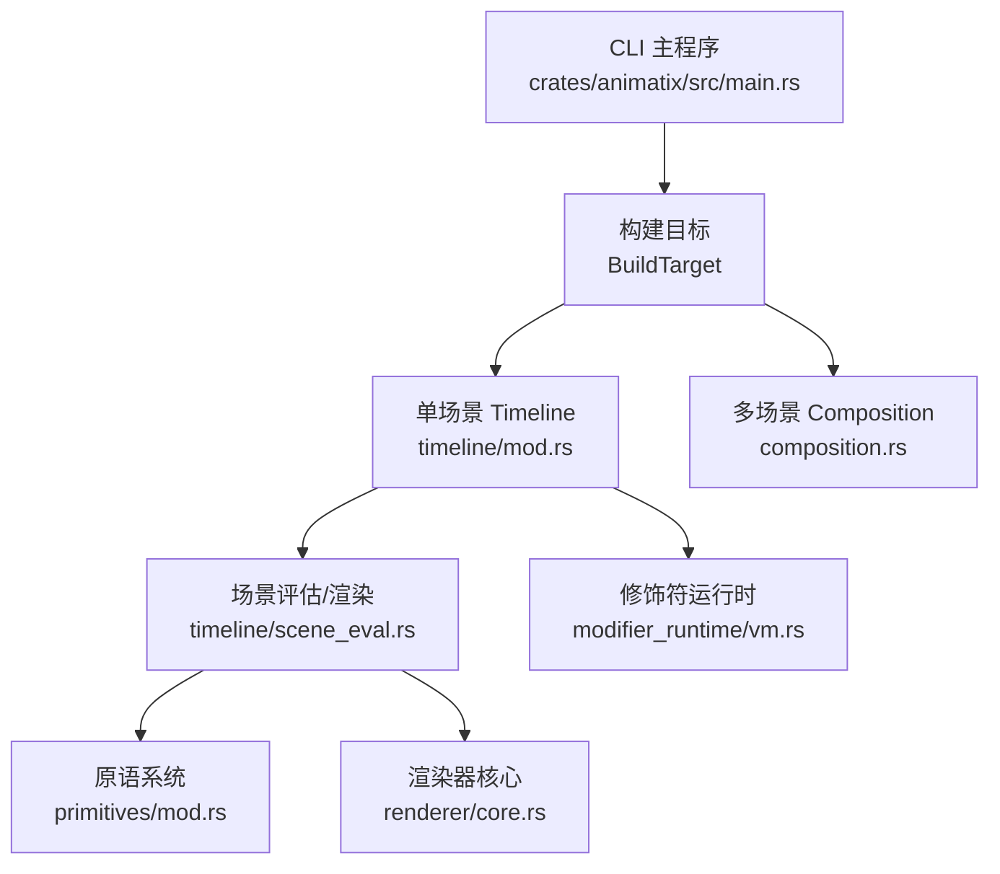
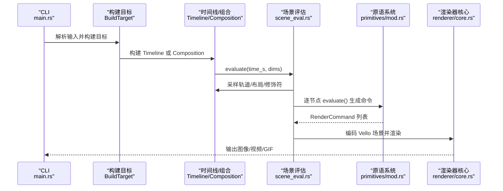
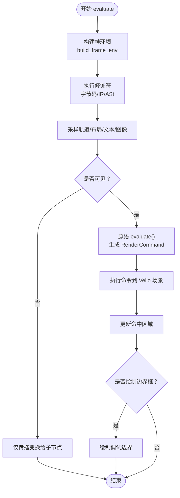
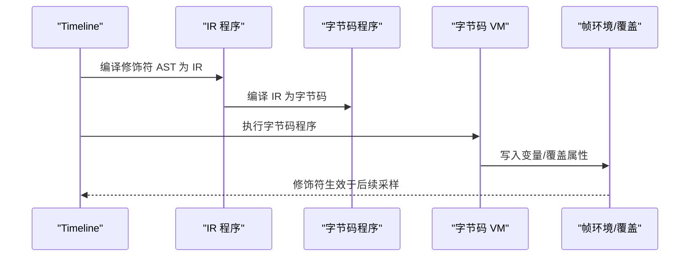
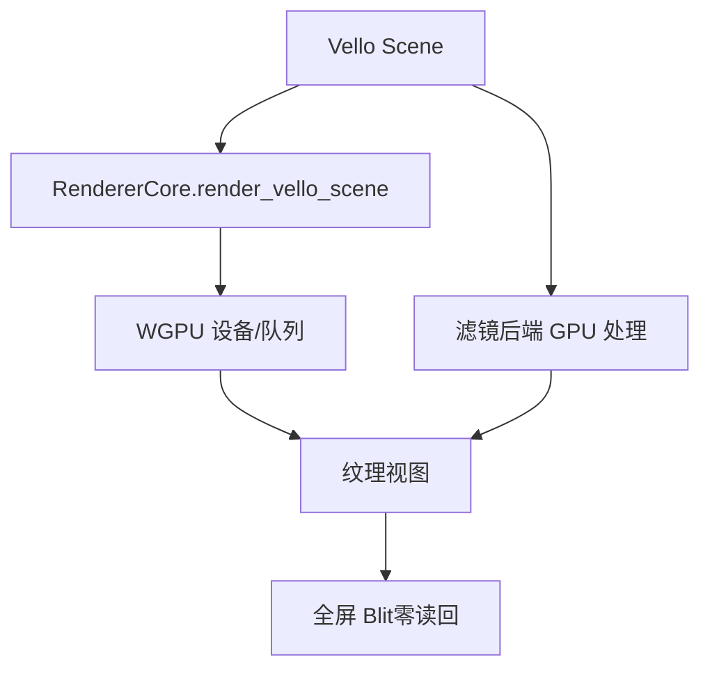
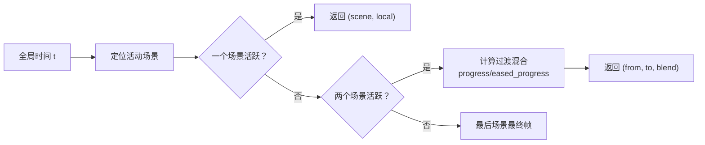
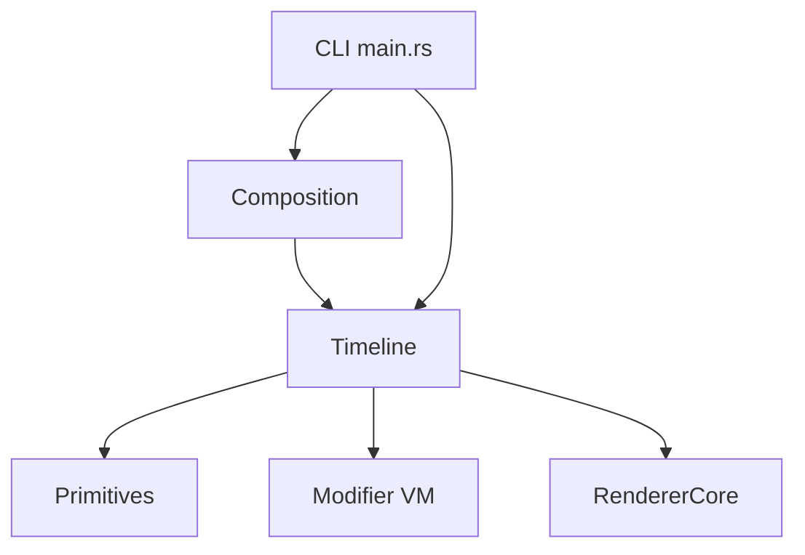

# 核心引擎

<cite>
**本文引用的文件**
- [lib.rs](file://crates/animatix/src/lib.rs)
- [main.rs](file://crates/animatix/src/main.rs)
- [mod.rs（渲染器）](file://crates/animatix/src/renderer/mod.rs)
- [core.rs（渲染器核心）](file://crates/animatix/src/renderer/core.rs)
- [mod.rs（时间线）](file://crates/animatix/src/timeline/mod.rs)
- [track.rs（时间线轨道）](file://crates/animatix/src/timeline/track.rs)
- [scene_eval.rs（时间线场景评估）](file://crates/animatix/src/timeline/scene_eval.rs)
- [mod.rs（修饰符运行时）](file://crates/animatix/src/timeline/modifier_runtime/mod.rs)
- [vm.rs（修饰符字节码VM）](file://crates/animatix/src/timeline/modifier_runtime/vm.rs)
- [mod.rs（原语系统）](file://crates/animatix/src/primitives/mod.rs)
- [composition.rs（组合编排）](file://crates/animatix/src/composition.rs)
</cite>

## 目录
1. [引言](#引言)
2. [项目结构](#项目结构)
3. [核心组件](#核心组件)
4. [架构总览](#架构总览)
5. [详细组件分析](#详细组件分析)
6. [依赖关系分析](#依赖关系分析)
7. [性能考量](#性能考量)
8. [故障排查指南](#故障排查指南)
9. [结论](#结论)
10. [附录](#附录)

## 引言
本文件面向 Animatix 核心引擎，系统性阐述以下主题：
- 时间线系统：动画轨道、关键帧管理与属性插值算法
- 渲染系统：基于 Vello 的渲染器、GPU 着色器与渲染管线
- 原语系统：形状、文本、图像等视觉元素的统一抽象接口
- 修饰符运行时：中间表示（IR）到字节码（VM）的执行机制
- 实战用法与性能优化、调试技巧

目标是帮助开发者快速理解并高效扩展 Animatix 的动画与渲染能力。

## 项目结构
Animatix 的核心位于 crates/animatix/src 下，采用模块化分层设计：
- lib.rs：对外 re-export 模块入口
- main.rs：CLI 入口，负责加载程序、构建目标、调用渲染导出
- timeline/：时间线与动画系统（轨道、布局、修饰符）
- renderer/：渲染子系统（Vello 包装、离屏渲染、滤镜后端、视频导出）
- primitives/：原语系统（形状、文本、媒体、容器等）
- composition.rs：多场景编排（场景图、播放边、全局时间映射）



图表来源
- [main.rs:316-715](file://crates/animatix/src/main.rs#L316-L715)
- [mod.rs（时间线）:1-100](file://crates/animatix/src/timeline/mod.rs#L1-L100)
- [scene_eval.rs:700-800](file://crates/animatix/src/timeline/scene_eval.rs#L700-L800)
- [mod.rs（渲染器）:1-57](file://crates/animatix/src/renderer/mod.rs#L1-L57)
- [mod.rs（原语系统）:1-100](file://crates/animatix/src/primitives/mod.rs#L1-L100)
- [composition.rs:159-220](file://crates/animatix/src/composition.rs#L159-L220)

章节来源
- [lib.rs:1-24](file://crates/animatix/src/lib.rs#L1-L24)
- [main.rs:316-715](file://crates/animatix/src/main.rs#L316-L715)

## 核心组件
- 时间线（Timeline）：编译后的动画包，包含场景图、每演员的关键帧轨道、布局、颜色方案、文本编译器缓存、帧缓存与静态子树缓存等
- 轨道（PropertyTrack/AnimationTrack）：键控属性随时间变化的数据结构与插值逻辑
- 场景评估（scene_eval）：按帧采样轨道、应用修饰符、生成 Vello 场景
- 原语系统（Primitives）：所有可视元素的统一抽象，支持渲染命令生成与命中区域计算
- 修饰符运行时（Modifier Runtime）：从 IR 到字节码 VM 的执行路径
- 渲染器（Renderer）：Vello 封装、离屏渲染、滤镜后端、全屏 Blit、视频导出

章节来源
- [mod.rs（时间线）:431-502](file://crates/animatix/src/timeline/mod.rs#L431-L502)
- [track.rs（时间线轨道）:438-537](file://crates/animatix/src/timeline/track.rs#L438-L537)
- [scene_eval.rs:68-181](file://crates/animatix/src/timeline/scene_eval.rs#L68-L181)
- [mod.rs（原语系统）:416-568](file://crates/animatix/src/primitives/mod.rs#L416-L568)
- [vm.rs（修饰符字节码VM）:11-111](file://crates/animatix/src/timeline/modifier_runtime/vm.rs#L11-L111)
- [mod.rs（渲染器）:1-57](file://crates/animatix/src/renderer/mod.rs#L1-L57)

## 架构总览
Animatix 的执行流自上而下分为“构建期”和“帧执行期”：
- 构建期：解析 AST、展开组件、构建 Timeline/Composition，编译修饰符 IR/字节码，构建字体与资源缓存
- 帧执行期：按时间采样轨道、执行修饰符、生成原语命令、编码为 Vello 场景、通过渲染器输出



图表来源
- [main.rs:316-715](file://crates/animatix/src/main.rs#L316-L715)
- [composition.rs:159-220](file://crates/animatix/src/composition.rs#L159-L220)
- [scene_eval.rs:700-800](file://crates/animatix/src/timeline/scene_eval.rs#L700-L800)
- [mod.rs（原语系统）:550-568](file://crates/animatix/src/primitives/mod.rs#L550-L568)
- [core.rs（渲染器核心）:53-90](file://crates/animatix/src/renderer/core.rs#L53-L90)

## 详细组件分析

### 时间线系统与轨道
- Timeline 结构体保存所有演员轨道、背景色、根节点、环境、修饰符程序、布局元数据、文本编译器、帧缓存、变换缓存、静态子树缓存、命中区域等
- AnimationTrack 按层级组织几何、样式、滤镜、形状、文本/媒体、布局与程序化绘图等属性轨道
- PropertyTrack 提供键帧插入、默认值、带记忆化的求值、拷贝优化、当前是否在动画中判断等
- 插值类型覆盖标量、向量、颜色、仿射矩阵、枚举（位置绑定、锚点、布局模式）等，并对不同类型采用合适插值策略

```mermaid
classDiagram
class Timeline {
+tracks : BTreeMap<String, AnimationTrack>
+background_color : PropertyTrack<[f32;4]>
+root_nodes : Vec<String>
+env : Environment
+modifier_programs : Vec<ModifierIrProgram>
+modifier_bytecode_programs : Vec<ModifierBytecodeProgram>
+layout_engine : LayoutEngine
+text_compiler : TextCompiler
+frame_cache : FrameCacheEntry
+transform_cache : HashMap<String, TransformCacheEntry>
+scene_buffer : Scene
+hit_regions : Vec<(String, Rect)>
+plot_path_cache : HashMap<u64, Vec<VelloPath>>
}
class AnimationTrack {
+label : String
+kind : ActorKindId
+position : Option<PropertyTrack<[f32;2]>>
+rotation : Option<PropertyTrack<f32>>
+scale : Option<PropertyTrack<f32>>
+size : Option<PropertyTrack<[f32;2]>>
+color : Option<PropertyTrack<[f32;4]>>
+opacity : Option<PropertyTrack<f32>>
+text_content : Option<PropertyTrack<String>>
+image : Option<PropertyTrack<Option<SceneImage>>>
+layout_size : Option<PropertyTrack<[f32;2]>>
+procedural_plot : Option<ProceduralPlot>
}
class PropertyTrack~T~ {
+keyframes : BTreeMap<u64, (T,Easing)>
+default_value : T
+add_keyframe(time_ms, value, easing)
+evaluate(time_ms) T
+is_currently_animating(time_ms) bool
}
Timeline --> AnimationTrack : "持有"
AnimationTrack --> PropertyTrack : "包含多个轨道"
```

图表来源
- [mod.rs（时间线）:431-502](file://crates/animatix/src/timeline/mod.rs#L431-L502)
- [track.rs（时间线轨道）:438-651](file://crates/animatix/src/timeline/track.rs#L438-L651)
- [track.rs（时间线轨道）:439-537](file://crates/animatix/src/timeline/track.rs#L439-L537)

章节来源
- [mod.rs（时间线）:431-502](file://crates/animatix/src/timeline/mod.rs#L431-L502)
- [track.rs（时间线轨道）:438-537](file://crates/animatix/src/timeline/track.rs#L438-L537)

#### 属性插值算法要点
- 数值型：线性插值并应用缓动函数
- 颜色：按 RGBA 分量线性插值
- 向量/仿射：分别线性插值各分量
- 离散枚举：在时间边界处取前一或后一值（避免跨值混插）
- 文本路径/矢量路径：在 morph 选项控制下进行对齐与插值

章节来源
- [track.rs（时间线轨道）:228-436](file://crates/animatix/src/timeline/track.rs#L228-L436)

### 场景评估与渲染管线
- evaluate_with_debug：按帧构建帧环境、执行修饰符、采样轨道、生成原语命令、写入命中区域、可选零读回合成
- 可视性剔除：基于视口与包围盒保守估算，跳过完全不可见节点的绘制但仍传播变换以保证子节点正确评估
- 过滤器后端：支持 GPU 零读回合成（当滤镜位于容器末尾且无其他内容在其之后），否则回退到读回路径
- 命中区域：在开启调试时收集每个节点的世界坐标包围盒，用于点击选择



图表来源
- [scene_eval.rs:700-800](file://crates/animatix/src/timeline/scene_eval.rs#L700-L800)
- [scene_eval.rs:238-485](file://crates/animatix/src/timeline/scene_eval.rs#L238-L485)

章节来源
- [scene_eval.rs:68-181](file://crates/animatix/src/timeline/scene_eval.rs#L68-L181)
- [scene_eval.rs:238-485](file://crates/animatix/src/timeline/scene_eval.rs#L238-L485)

### 原语系统统一抽象
- Primitive trait：定义类型名、显示名、类别、图标、容器/形状判定、构建、渲染（可选）、形状状态应用与收尾、属性处理、默认属性、分配阶段处理、帧评估（新式迁移路径）
- RenderCommand：封装路径/文本/图像绘制命令，支持执行到 Vello 场景、本地包围盒计算
- 统一渲染：原语 evaluate 返回命令列表，由 scene_eval 执行，实现与具体渲染循环解耦

```mermaid
classDiagram
class Primitive {
<<trait>>
+type_name() &str
+display_name() &str
+category() ActorCategory
+icon_id() &str
+is_container() bool
+is_shape() bool
+build(...)
+evaluate(...) -> Option<Vec<RenderCommand>>
+render(...) -> Option<Vec<VelloPath>>
}
class RenderCommand {
<<enum>>
+Paths { paths : Vec<VelloPath> }
+Text { paths : Arc<[TextPath]> }
+Image { image : SceneImage, natural_size : [f32;2] }
+execute(scene, transform, opacity)
+local_bounds(display_size) Option<Rect>
}
Primitive --> RenderCommand : "生成"
```

图表来源
- [mod.rs（原语系统）:416-568](file://crates/animatix/src/primitives/mod.rs#L416-L568)
- [mod.rs（原语系统）:268-414](file://crates/animatix/src/primitives/mod.rs#L268-L414)

章节来源
- [mod.rs（原语系统）:1-100](file://crates/animatix/src/primitives/mod.rs#L1-L100)
- [mod.rs（原语系统）:416-568](file://crates/animatix/src/primitives/mod.rs#L416-L568)

### 修饰符运行时：IR 到字节码 VM
- IR：修饰符语句与表达式在构建期被编译为 IR 程序
- 字节码：IR 进一步编译为指令序列（常量池、栈机、分支/循环、方法调用、覆盖写入等）
- VM：解释执行字节码，维护栈、指令指针、迭代计数上限，将结果写入帧环境与覆盖映射



图表来源
- [vm.rs（修饰符字节码VM）:84-111](file://crates/animatix/src/timeline/modifier_runtime/vm.rs#L84-L111)
- [vm.rs（修饰符字节码VM）:258-494](file://crates/animatix/src/timeline/modifier_runtime/vm.rs#L258-L494)

章节来源
- [vm.rs（修饰符字节码VM）:11-111](file://crates/animatix/src/timeline/modifier_runtime/vm.rs#L11-L111)
- [vm.rs（修饰符字节码VM）:113-249](file://crates/animatix/src/timeline/modifier_runtime/vm.rs#L113-L249)
- [vm.rs（修饰符字节码VM）:258-494](file://crates/animatix/src/timeline/modifier_runtime/vm.rs#L258-L494)

### 渲染系统：Vello 渲染器与管线
- RendererCore：封装 Vello 渲染器，支持渲染到纹理、零读回全屏 Blit
- 离屏渲染：OffscreenRenderer 用于 CPU 可读帧输出
- 滤镜后端：GPU 后端对子场景进行滤镜处理，优先尝试零读回合成
- 视频导出：提供 GIF/MP4 导出、进度回调、线程与编码参数配置



图表来源
- [core.rs（渲染器核心）:53-90](file://crates/animatix/src/renderer/core.rs#L53-L90)
- [mod.rs（渲染器）:1-57](file://crates/animatix/src/renderer/mod.rs#L1-L57)

章节来源
- [core.rs（渲染器核心）:1-183](file://crates/animatix/src/renderer/core.rs#L1-L183)
- [mod.rs（渲染器）:1-57](file://crates/animatix/src/renderer/mod.rs#L1-L57)

### 多场景编排（Composition）
- Composition 管理多个 Timeline 场景、声明顺序、play 边（显式/隐式）、全局时间映射、过渡重叠
- evaluate：根据全局时间返回当前场景、本地时间与过渡混合信息（含缓动进度）



图表来源
- [composition.rs:470-555](file://crates/animatix/src/composition.rs#L470-L555)

章节来源
- [composition.rs:1-100](file://crates/animatix/src/composition.rs#L1-L100)
- [composition.rs:225-459](file://crates/animatix/src/composition.rs#L225-L459)
- [composition.rs:470-555](file://crates/animatix/src/composition.rs#L470-L555)

## 依赖关系分析
- 时间线依赖原语系统生成命令，依赖渲染器核心编码 Vello 场景
- 修饰符运行时与时间线共享帧环境，修改覆盖影响后续轨道采样
- Composition 依赖 Timeline，负责全局时间映射与过渡混合



图表来源
- [main.rs:316-715](file://crates/animatix/src/main.rs#L316-L715)
- [composition.rs:159-220](file://crates/animatix/src/composition.rs#L159-L220)
- [scene_eval.rs:700-800](file://crates/animatix/src/timeline/scene_eval.rs#L700-L800)
- [mod.rs（原语系统）:550-568](file://crates/animatix/src/primitives/mod.rs#L550-L568)
- [vm.rs（修饰符字节码VM）:99-111](file://crates/animatix/src/timeline/modifier_runtime/vm.rs#L99-L111)
- [core.rs（渲染器核心）:53-90](file://crates/animatix/src/renderer/core.rs#L53-L90)

章节来源
- [mod.rs（时间线）:1-100](file://crates/animatix/src/timeline/mod.rs#L1-L100)
- [mod.rs（渲染器）:1-57](file://crates/animatix/src/renderer/mod.rs#L1-L57)

## 性能考量
- 帧缓存与变换缓存：避免重复采样与变换计算
- 静态子树缓存：对完全静态子树复用 Vello 场景
- 可视性剔除与包围盒估算：减少离屏绘制开销
- 零读回合成：滤镜后端在安全条件下直接合成，避免 CPU 读回
- 字节码优先：修饰符优先走字节码路径，降低解释 AST 成本
- 文本编译器缓存：动态文本内容变更时按需重新编译
- 多场景过渡：合理设置过渡时长与重叠，避免不必要的重采样

## 故障排查指南
- 修饰符错误：在帧评估时收集修饰符错误诊断，可通过日志查看
- 渲染失败：检查 Vello 初始化与渲染参数；确认设备可用性
- 文本渲染问题：检查字体上下文与文本编译器状态
- 多场景播放链异常：关注循环播放、孤立场景告警

章节来源
- [scene_eval.rs:795-800](file://crates/animatix/src/timeline/scene_eval.rs#L795-L800)
- [core.rs（渲染器核心）:16-31](file://crates/animatix/src/renderer/core.rs#L16-L31)

## 结论
Animatix 通过清晰的模块划分与缓存策略，在保证高保真渲染的同时兼顾了交互与导出性能。时间线轨道与原语系统的统一抽象使得新增可视化元素与效果变得简单；修饰符运行时的 IR/VM 体系提供了强大的动态行为能力；渲染器以 Vello 为核心，结合 GPU 后端实现了高效的零读回合成与导出流水线。

## 附录
- 常见使用模式（示例路径）
  - 单场景渲染图片：[main.rs 图像导出分支:472-509](file://crates/animatix/src/main.rs#L472-L509)
  - 多场景渲染视频：[main.rs 视频导出分支:389-446](file://crates/animatix/src/main.rs#L389-L446)
  - 修饰符字节码执行：[vm.rs 执行流程:99-111](file://crates/animatix/src/timeline/modifier_runtime/vm.rs#L99-L111)
  - 原语命令执行：[mod.rs（原语系统）命令执行:293-376](file://crates/animatix/src/primitives/mod.rs#L293-L376)
  - Vello 场景渲染：[core.rs（渲染器核心）渲染函数:53-90](file://crates/animatix/src/renderer/core.rs#L53-L90)