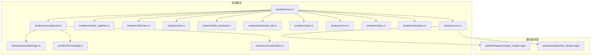
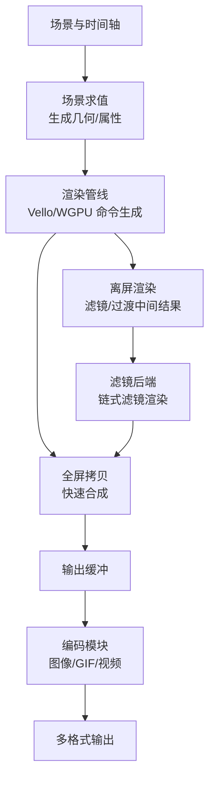
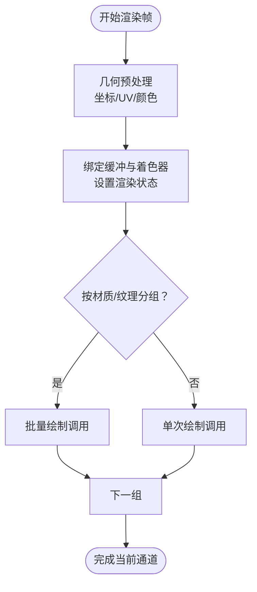
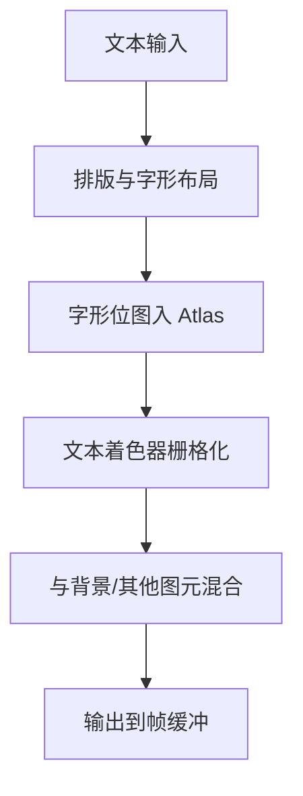
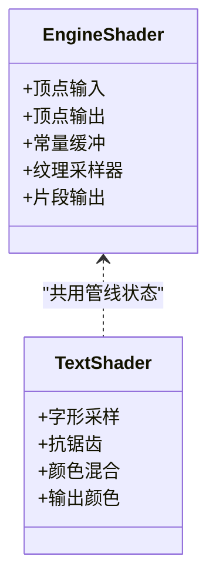
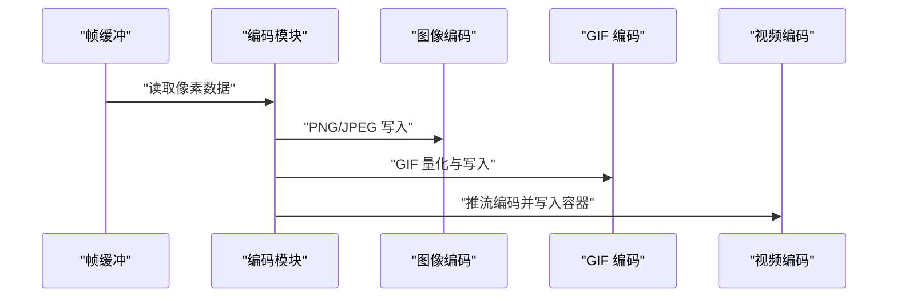
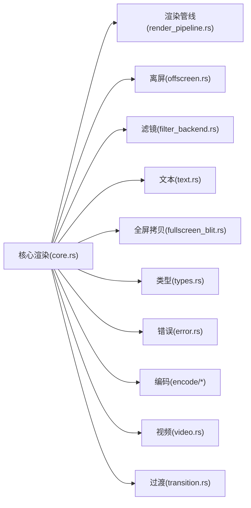

# 渲染系统

<cite>
**本文引用的文件**
- [crates/animatix/src/renderer/mod.rs](file://crates/animatix/src/renderer/mod.rs)
- [crates/animatix/src/renderer/core.rs](file://crates/animatix/src/renderer/core.rs)
- [crates/animatix/src/renderer/render_pipeline.rs](file://crates/animatix/src/renderer/render_pipeline.rs)
- [crates/animatix/src/renderer/offscreen.rs](file://crates/animatix/src/renderer/offscreen.rs)
- [crates/animatix/src/renderer/text.rs](file://crates/animatix/src/renderer/text.rs)
- [crates/animatix/src/renderer/filter_backend.rs](file://crates/animatix/src/renderer/filter_backend.rs)
- [crates/animatix/src/renderer/fullscreen_blit.rs](file://crates/animatix/src/renderer/fullscreen_blit.rs)
- [crates/animatix/src/renderer/types.rs](file://crates/animatix/src/renderer/types.rs)
- [crates/animatix/src/renderer/error.rs](file://crates/animatix/src/renderer/error.rs)
- [crates/animatix/src/renderer/video.rs](file://crates/animatix/src/renderer/video.rs)
- [crates/animatix/src/renderer/transition.rs](file://crates/animatix/src/renderer/transition.rs)
- [crates/animatix/src/renderer/encode/mod.rs](file://crates/animatix/src/renderer/encode/mod.rs)
- [crates/animatix/src/renderer/encode/image.rs](file://crates/animatix/src/renderer/encode/image.rs)
- [crates/animatix/src/renderer/encode/gif.rs](file://crates/animatix/src/renderer/encode/gif.rs)
- [crates/animatix/src/renderer/encode/video.rs](file://crates/animatix/src/renderer/encode/video.rs)
- [crates/animatix/assets/shaders/engine_shader.wgsl](file://crates/animatix/assets/shaders/engine_shader.wgsl)
- [crates/animatix/assets/shaders/text_shader.wgsl](file://crates/animatix/assets/shaders/text_shader.wgsl)
</cite>

## 目录
1. [引言](#引言)
2. [项目结构](#项目结构)
3. [核心组件](#核心组件)
4. [架构总览](#架构总览)
5. [详细组件分析](#详细组件分析)
6. [依赖关系分析](#依赖关系分析)
7. [性能考量](#性能考量)
8. [故障排除指南](#故障排除指南)
9. [结论](#结论)
10. [附录](#附录)

## 引言
本文件面向 Animatix 的渲染系统，聚焦于基于 Vello 与 WGPU 的渲染架构，系统性阐述渲染管线设计、GPU 着色器实现、离屏渲染机制、滤镜效果处理、文本渲染优化以及多格式输出支持。文档同时覆盖渲染命令生成与执行流程（几何数据处理、纹理管理、状态切换），并提供高质量动画渲染的实践建议（性能优化、内存管理、并发渲染策略）。最后给出渲染调试工具与故障排除方法。

## 项目结构
Animatix 的渲染子系统位于 crates/animatix/src/renderer 下，采用模块化组织：核心渲染逻辑、离屏渲染、文本渲染、滤镜后端、全屏拷贝、视频编码等模块协同工作；着色器资源位于 crates/animatix/assets/shaders。



图示来源
- [crates/animatix/src/renderer/mod.rs](file://crates/animatix/src/renderer/mod.rs)
- [crates/animatix/src/renderer/core.rs](file://crates/animatix/src/renderer/core.rs)
- [crates/animatix/src/renderer/render_pipeline.rs](file://crates/animatix/src/renderer/render_pipeline.rs)
- [crates/animatix/src/renderer/offscreen.rs](file://crates/animatix/src/renderer/offscreen.rs)
- [crates/animatix/src/renderer/text.rs](file://crates/animatix/src/renderer/text.rs)
- [crates/animatix/src/renderer/filter_backend.rs](file://crates/animatix/src/renderer/filter_backend.rs)
- [crates/animatix/src/renderer/fullscreen_blit.rs](file://crates/animatix/src/renderer/fullscreen_blit.rs)
- [crates/animatix/src/renderer/types.rs](file://crates/animatix/src/renderer/types.rs)
- [crates/animatix/src/renderer/error.rs](file://crates/animatix/src/renderer/error.rs)
- [crates/animatix/src/renderer/video.rs](file://crates/animatix/src/renderer/video.rs)
- [crates/animatix/src/renderer/transition.rs](file://crates/animatix/src/renderer/transition.rs)
- [crates/animatix/src/renderer/encode/mod.rs](file://crates/animatix/src/renderer/encode/mod.rs)
- [crates/animatix/src/renderer/encode/image.rs](file://crates/animatix/src/renderer/encode/image.rs)
- [crates/animatix/src/renderer/encode/gif.rs](file://crates/animatix/src/renderer/encode/gif.rs)
- [crates/animatix/src/renderer/encode/video.rs](file://crates/animatix/src/renderer/encode/video.rs)
- [crates/animatix/assets/shaders/engine_shader.wgsl](file://crates/animatix/assets/shaders/engine_shader.wgsl)
- [crates/animatix/assets/shaders/text_shader.wgsl](file://crates/animatix/assets/shaders/text_shader.wgsl)

章节来源
- [crates/animatix/src/renderer/mod.rs](file://crates/animatix/src/renderer/mod.rs)
- [crates/animatix/src/renderer/core.rs](file://crates/animatix/src/renderer/core.rs)
- [crates/animatix/assets/shaders/engine_shader.wgsl](file://crates/animatix/assets/shaders/engine_shader.wgsl)
- [crates/animatix/assets/shaders/text_shader.wgsl](file://crates/animatix/assets/shaders/text_shader.wgsl)

## 核心组件
- 渲染核心与管线
  - 渲染器入口与聚合：通过模块聚合导出渲染能力，协调离屏、文本、滤镜、全屏拷贝与编码模块。
  - 渲染管线：封装 Vello/WGPU 的绘制命令生成、绑定状态切换、几何与纹理管理。
- 离屏渲染
  - 提供可复用的离屏帧缓冲与采样器配置，支撑滤镜链路与过渡合成。
- 文本渲染
  - 针对文本几何与栅格化的专用路径，结合着色器实现高质量字形绘制。
- 滤镜后端
  - 将滤镜效果以多阶段渲染的方式在 GPU 上实现，支持链式组合与参数化。
- 全屏拷贝
  - 快速将中间结果复制到最终目标，减少冗余计算。
- 视频与编码
  - 支持图像序列、GIF 与视频输出，统一帧缓冲读取与像素格式转换。
- 类型与错误
  - 统一的数据类型定义与错误模型，便于上层调用与调试。

章节来源
- [crates/animatix/src/renderer/mod.rs](file://crates/animatix/src/renderer/mod.rs)
- [crates/animatix/src/renderer/core.rs](file://crates/animatix/src/renderer/core.rs)
- [crates/animatix/src/renderer/render_pipeline.rs](file://crates/animatix/src/renderer/render_pipeline.rs)
- [crates/animatix/src/renderer/offscreen.rs](file://crates/animatix/src/renderer/offscreen.rs)
- [crates/animatix/src/renderer/text.rs](file://crates/animatix/src/renderer/text.rs)
- [crates/animatix/src/renderer/filter_backend.rs](file://crates/animatix/src/renderer/filter_backend.rs)
- [crates/animatix/src/renderer/fullscreen_blit.rs](file://crates/animatix/src/renderer/fullscreen_blit.rs)
- [crates/animatix/src/renderer/types.rs](file://crates/animatix/src/renderer/types.rs)
- [crates/animatix/src/renderer/error.rs](file://crates/animatix/src/renderer/error.rs)
- [crates/animatix/src/renderer/video.rs](file://crates/animatix/src/renderer/video.rs)
- [crates/animatix/src/renderer/transition.rs](file://crates/animatix/src/renderer/transition.rs)
- [crates/animatix/src/renderer/encode/mod.rs](file://crates/animatix/src/renderer/encode/mod.rs)

## 架构总览
渲染系统围绕“场景到帧”的流水线展开：时间轴驱动场景求值，生成几何与属性；渲染器将几何与纹理提交至 Vello/WGPU；离屏通道用于滤镜与过渡合成；最终通过全屏拷贝或编码模块输出。



图示来源
- [crates/animatix/src/renderer/render_pipeline.rs](file://crates/animatix/src/renderer/render_pipeline.rs)
- [crates/animatix/src/renderer/offscreen.rs](file://crates/animatix/src/renderer/offscreen.rs)
- [crates/animatix/src/renderer/filter_backend.rs](file://crates/animatix/src/renderer/filter_backend.rs)
- [crates/animatix/src/renderer/fullscreen_blit.rs](file://crates/animatix/src/renderer/fullscreen_blit.rs)
- [crates/animatix/src/renderer/encode/mod.rs](file://crates/animatix/src/renderer/encode/mod.rs)

## 详细组件分析

### 渲染管线与命令生成
- 职责
  - 将几何数据与材质状态提交给 Vello/WGPU，生成绘制命令。
  - 管理顶点/索引缓冲、着色器绑定组、渲染通道与颜色/深度附件。
- 关键流程
  - 几何预处理：归一化坐标、UV 映射、颜色插值。
  - 状态切换：根据图元类型、混合模式、深度测试进行最小化切换。
  - 批处理：按材质/纹理分组，合并 draw 调用。
- 性能要点
  - 尽量减少绑定组切换与状态变更。
  - 使用 instancing 或大批次降低调用开销。
  - 合理的缓冲对齐与分配策略。



图示来源
- [crates/animatix/src/renderer/render_pipeline.rs](file://crates/animatix/src/renderer/render_pipeline.rs)
- [crates/animatix/src/renderer/core.rs](file://crates/animatix/src/renderer/core.rs)

章节来源
- [crates/animatix/src/renderer/render_pipeline.rs](file://crates/animatix/src/renderer/render_pipeline.rs)
- [crates/animatix/src/renderer/core.rs](file://crates/animatix/src/renderer/core.rs)

### 离屏渲染与滤镜链
- 职责
  - 在独立帧缓冲上渲染中间结果，支持多阶段滤镜叠加。
- 实现要点
  - 多级 MRT（如需）或顺序渲染，避免跨通道读写不一致。
  - 采样器与过滤参数随滤镜动态配置。
  - 输出作为后续通道输入，形成滤镜链。
- 典型滤镜
  - 高斯模糊、阴影、发光、遮罩、合成模式等。

```mermaid
sequenceDiagram
participant RP as "渲染管线"
participant Off as "离屏渲染"
participant FB as "滤镜后端"
participant Blit as "全屏拷贝"
RP->>Off : "渲染场景到离屏缓冲"
Off->>FB : "传递中间结果"
FB->>FB : "滤镜链处理<br/>高斯/阴影/发光"
FB-->>Blit : "输出最终中间帧"
Blit-->>RP : "合成到主缓冲"
```

图示来源
- [crates/animatix/src/renderer/offscreen.rs](file://crates/animatix/src/renderer/offscreen.rs)
- [crates/animatix/src/renderer/filter_backend.rs](file://crates/animatix/src/renderer/filter_backend.rs)
- [crates/animatix/src/renderer/fullscreen_blit.rs](file://crates/animatix/src/renderer/fullscreen_blit.rs)

章节来源
- [crates/animatix/src/renderer/offscreen.rs](file://crates/animatix/src/renderer/offscreen.rs)
- [crates/animatix/src/renderer/filter_backend.rs](file://crates/animatix/src/renderer/filter_backend.rs)

### 文本渲染优化
- 职责
  - 将文本几何与字形位图高效栅格化，保证清晰度与性能。
- 实现要点
  - 字形缓存与 Atlas 管理，减少重复上传。
  - 纹理压缩与 mipmap，提升采样质量与带宽利用。
  - 着色器路径针对字形轮廓与颜色进行优化。
- 与着色器协作
  - 使用专用文本着色器，支持抗锯齿、颜色混合与变换矩阵。



图示来源
- [crates/animatix/src/renderer/text.rs](file://crates/animatix/src/renderer/text.rs)
- [crates/animatix/assets/shaders/text_shader.wgsl](file://crates/animatix/assets/shaders/text_shader.wgsl)

章节来源
- [crates/animatix/src/renderer/text.rs](file://crates/animatix/src/renderer/text.rs)
- [crates/animatix/assets/shaders/text_shader.wgsl](file://crates/animatix/assets/shaders/text_shader.wgsl)

### 着色器实现与管线绑定
- 引擎着色器（engine_shader.wgsl）
  - 定义顶点/片段阶段的输入输出、常量与采样器绑定。
  - 支持基础几何变换、纹理采样、混合与深度测试。
- 文本着色器（text_shader.wgsl）
  - 针对字形轮廓与颜色的专用片段逻辑，优化清晰度与速度。
- 绑定策略
  - 将常量缓冲、纹理采样器、顶点缓冲按组绑定，减少切换。
  - 使用 push constants 传递小规模动态参数（如颜色、透明度）。



图示来源
- [crates/animatix/assets/shaders/engine_shader.wgsl](file://crates/animatix/assets/shaders/engine_shader.wgsl)
- [crates/animatix/assets/shaders/text_shader.wgsl](file://crates/animatix/assets/shaders/text_shader.wgsl)

章节来源
- [crates/animatix/assets/shaders/engine_shader.wgsl](file://crates/animatix/assets/shaders/engine_shader.wgsl)
- [crates/animatix/assets/shaders/text_shader.wgsl](file://crates/animatix/assets/shaders/text_shader.wgsl)

### 多格式输出与视频编码
- 图像序列
  - 从帧缓冲读取像素，按帧保存为 PNG/JPEG 等格式。
- GIF
  - 量化与遍历扫描，生成动画 GIF。
- 视频
  - 推流到编码器，生成 MP4/H.264/H.265 等容器。
- 关键注意
  - 像素格式一致性（BGRA/RGBA）、行对齐与内存布局。
  - 编码速率控制与质量参数平衡。



图示来源
- [crates/animatix/src/renderer/encode/mod.rs](file://crates/animatix/src/renderer/encode/mod.rs)
- [crates/animatix/src/renderer/encode/image.rs](file://crates/animatix/src/renderer/encode/image.rs)
- [crates/animatix/src/renderer/encode/gif.rs](file://crates/animatix/src/renderer/encode/gif.rs)
- [crates/animatix/src/renderer/encode/video.rs](file://crates/animatix/src/renderer/encode/video.rs)

章节来源
- [crates/animatix/src/renderer/encode/mod.rs](file://crates/animatix/src/renderer/encode/mod.rs)
- [crates/animatix/src/renderer/encode/image.rs](file://crates/animatix/src/renderer/encode/image.rs)
- [crates/animatix/src/renderer/encode/gif.rs](file://crates/animatix/src/renderer/encode/gif.rs)
- [crates/animatix/src/renderer/encode/video.rs](file://crates/animatix/src/renderer/encode/video.rs)

### 过渡与合成
- 职责
  - 实现入场/退场/重排等过渡效果，通常在离屏通道中合成。
- 实现要点
  - 时间参数驱动状态插值（位置、缩放、旋转、透明度）。
  - 可选遮罩与混合模式增强视觉表现。
- 与滤镜后端配合
  - 过渡前后的滤镜链路保持一致性。

章节来源
- [crates/animatix/src/renderer/transition.rs](file://crates/animatix/src/renderer/transition.rs)
- [crates/animatix/src/renderer/filter_backend.rs](file://crates/animatix/src/renderer/filter_backend.rs)

## 依赖关系分析
- 模块内聚与耦合
  - 渲染核心与管线高度内聚，仅通过类型与错误接口对外暴露。
  - 离屏、滤镜、文本、全屏拷贝模块相对独立，通过共享缓冲与状态连接。
- 外部依赖
  - Vello/WGPU 作为底层图形后端，负责命令缓冲与提交。
  - 编码模块依赖系统图像/视频库，负责像素格式转换与写盘。
- 循环依赖
  - 当前模块划分避免了循环导入，接口清晰。



图示来源
- [crates/animatix/src/renderer/core.rs](file://crates/animatix/src/renderer/core.rs)
- [crates/animatix/src/renderer/render_pipeline.rs](file://crates/animatix/src/renderer/render_pipeline.rs)
- [crates/animatix/src/renderer/offscreen.rs](file://crates/animatix/src/renderer/offscreen.rs)
- [crates/animatix/src/renderer/filter_backend.rs](file://crates/animatix/src/renderer/filter_backend.rs)
- [crates/animatix/src/renderer/text.rs](file://crates/animatix/src/renderer/text.rs)
- [crates/animatix/src/renderer/fullscreen_blit.rs](file://crates/animatix/src/renderer/fullscreen_blit.rs)
- [crates/animatix/src/renderer/types.rs](file://crates/animatix/src/renderer/types.rs)
- [crates/animatix/src/renderer/error.rs](file://crates/animatix/src/renderer/error.rs)
- [crates/animatix/src/renderer/encode/mod.rs](file://crates/animatix/src/renderer/encode/mod.rs)
- [crates/animatix/src/renderer/video.rs](file://crates/animatix/src/renderer/video.rs)
- [crates/animatix/src/renderer/transition.rs](file://crates/animatix/src/renderer/transition.rs)

章节来源
- [crates/animatix/src/renderer/core.rs](file://crates/animatix/src/renderer/core.rs)
- [crates/animatix/src/renderer/types.rs](file://crates/animatix/src/renderer/types.rs)
- [crates/animatix/src/renderer/error.rs](file://crates/animatix/src/renderer/error.rs)

## 性能考量
- 几何与纹理
  - 合理分批与合并 draw 调用，减少状态切换。
  - 使用纹理 Atlas 与常驻缓冲，降低上传频率。
- 着色器
  - 控制分支与采样次数，避免昂贵的分支发散。
  - 使用低精度浮点与合适的插值方式。
- 离屏与滤镜
  - 优先使用 RTT（Render To Texture）而非多次屏幕读取。
  - 滤镜链路尽量使用离屏复用，避免重复计算。
- 并发渲染
  - 多帧并行：将不同帧的准备与提交交错，提高 GPU 利用率。
  - 多线程：CPU 端几何/纹理准备与 GPU 提交解耦。
- 内存管理
  - 对齐与池化：缓冲区对齐到 256B/1KB 边界，使用对象池减少分配。
  - 生命周期：及时释放不再使用的纹理与缓冲。

## 故障排除指南
- 常见问题
  - 画面空白或黑屏：检查渲染通道颜色附件与清除标志；确认着色器编译与绑定。
  - 模糊或锯齿：检查字体/纹理采样参数与 mip 设置；核对视口与分辨率。
  - 性能骤降：核查状态切换次数、批次大小与缓冲更新频率。
  - 输出异常：核对像素格式、行对齐与编码参数。
- 调试工具
  - 使用图形调试器（如 RenderDoc/Xbox GPU Profiler）捕获帧，检查命令缓冲与资源状态。
  - 在关键路径打印统计信息（draw 调用数、缓冲大小、纹理数量）。
- 错误处理
  - 统一错误类型与上下文信息，便于定位问题来源。
  - 对不可恢复错误进行优雅降级（如回退到软件渲染或简化滤镜）。

章节来源
- [crates/animatix/src/renderer/error.rs](file://crates/animatix/src/renderer/error.rs)

## 结论
Animatix 的渲染系统以模块化为核心，结合 Vello/WGPU 的强大能力，实现了从几何到像素的完整渲染链路。通过离屏渲染与滤镜链、文本优化与多格式输出，系统在质量与性能之间取得良好平衡。遵循本文的流程与最佳实践，可在复杂动画场景中稳定产出高质量帧，并具备良好的扩展性与可维护性。

## 附录
- 术语
  - RTT：Render To Texture，将渲染输出到纹理而非屏幕。
  - MRT：Multiple Render Targets，同时写入多个颜色附件。
  - Atlas：纹理图集，将多个小纹理打包到一张大纹理中。
- 参考路径
  - 着色器资源：[engine_shader.wgsl](file://crates/animatix/assets/shaders/engine_shader.wgsl), [text_shader.wgsl](file://crates/animatix/assets/shaders/text_shader.wgsl)
  - 编码模块：[encode/mod.rs](file://crates/animatix/src/renderer/encode/mod.rs), [image.rs](file://crates/animatix/src/renderer/encode/image.rs), [gif.rs](file://crates/animatix/src/renderer/encode/gif.rs), [video.rs](file://crates/animatix/src/renderer/encode/video.rs)