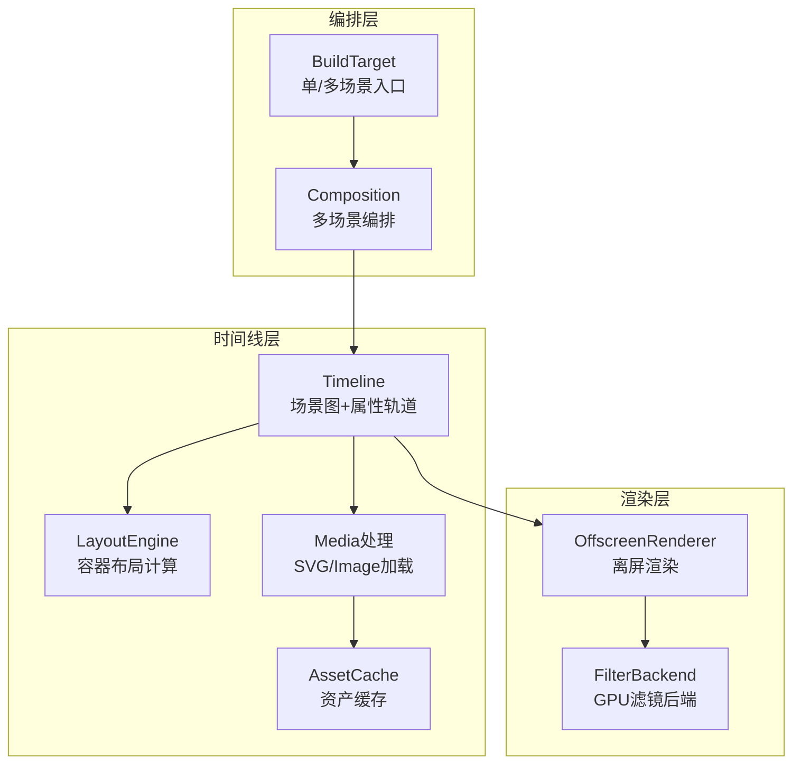
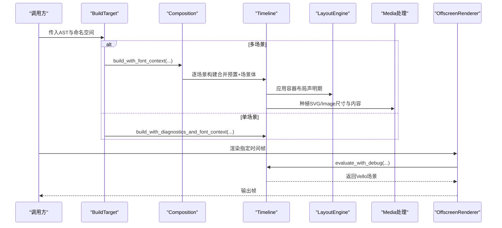
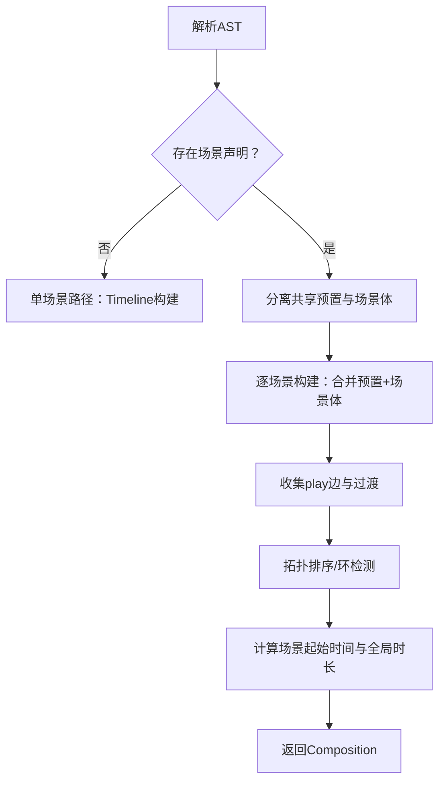
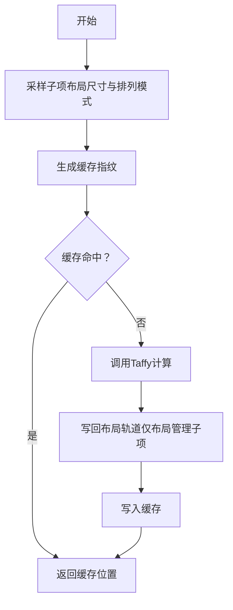
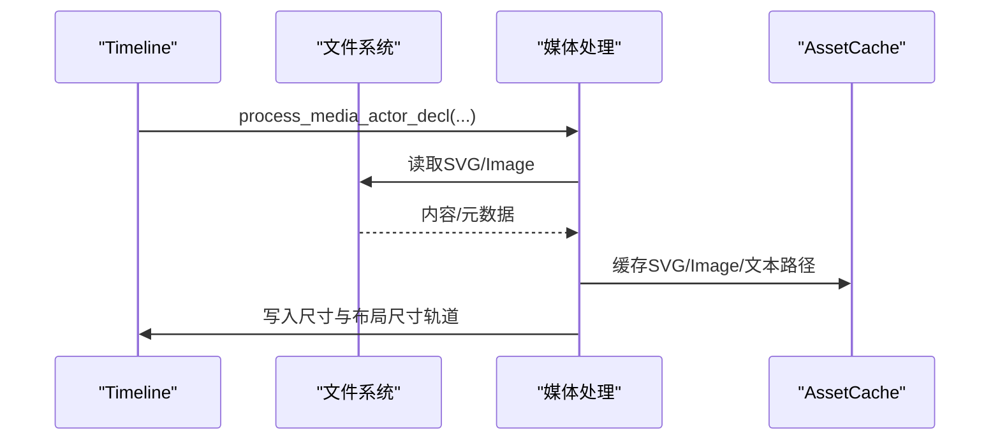
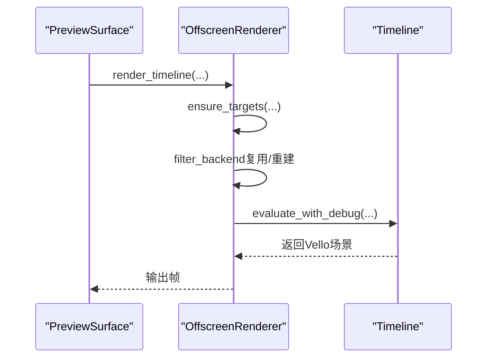
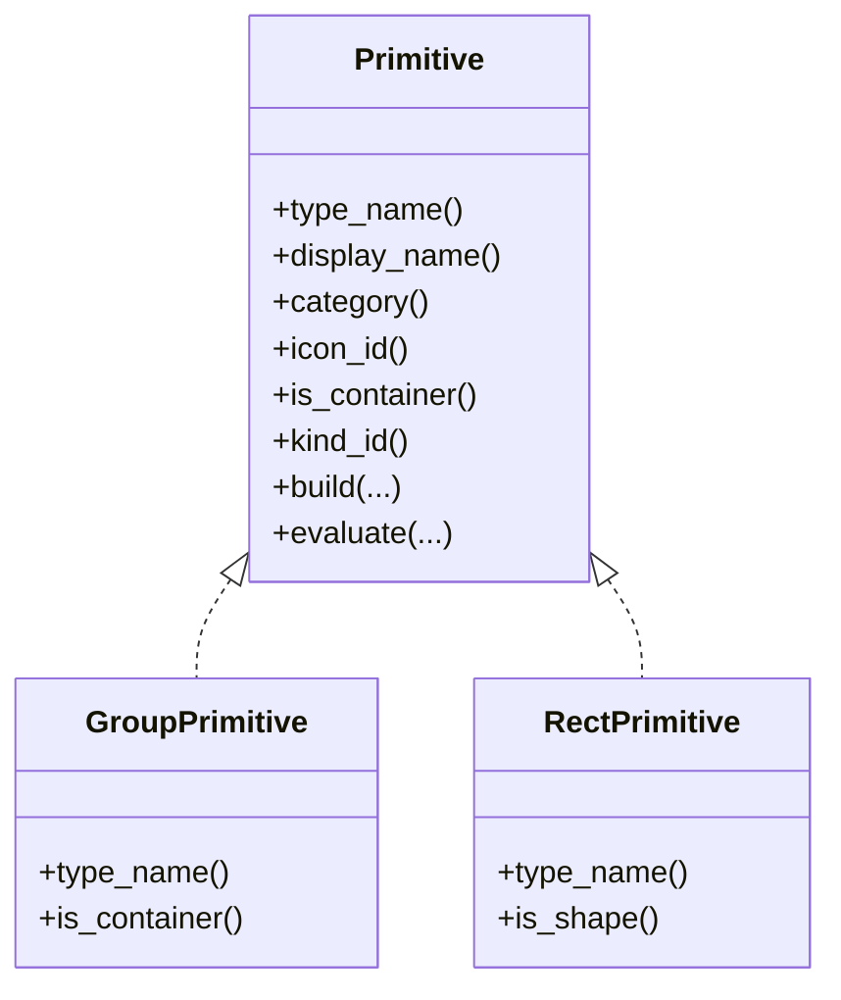
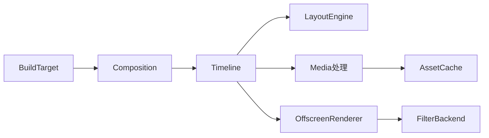

# 组合系统

<cite>
**本文引用的文件**
- [composition.rs](file://crates/animatix/src/composition.rs)
- [layout.rs](file://crates/animatix/src/timeline/layout.rs)
- [media.rs](file://crates/animatix/src/timeline/media.rs)
- [assets.rs](file://crates/animatix/src/timeline/assets.rs)
- [mod.rs](file://crates/animatix/src/timeline/mod.rs)
- [offscreen.rs](file://crates/animatix/src/renderer/offscreen.rs)
- [group.rs](file://crates/animatix/src/primitives/group.rs)
- [rect.rs](file://crates/animatix/src/primitives/rect.rs)
- [primitive.rs](file://crates/animatix/src/timeline/primitive.rs)
- [preview_surface.rs](file://crates/animatix-gui/src/preview_surface.rs)
</cite>

## 目录
1. [引言](#引言)
2. [项目结构](#项目结构)
3. [核心组件](#核心组件)
4. [架构总览](#架构总览)
5. [详细组件分析](#详细组件分析)
6. [依赖分析](#依赖分析)
7. [性能考量](#性能考量)
8. [故障排查指南](#故障排查指南)
9. [结论](#结论)
10. [附录：示例与最佳实践](#附录示例与最佳实践)

## 引言
本文件面向 Animatix 的“组合系统”，系统性阐述多场景组合（多场景编排）、资产与媒体处理、以及布局计算与渲染管线的实现原理。文档覆盖从构建期到运行时的数据流、缓存策略、生命周期管理，并给出可操作的示例路径与扩展建议，帮助开发者在不直接阅读源码的情况下理解并高效使用该系统。

## 项目结构
组合系统主要由以下模块协同完成：
- 多场景编排与全局时间映射：Composition 与 BuildTarget
- 时间线与场景图：Timeline 及其构建/评估子模块
- 布局系统：容器化布局、缓存与动态重计算
- 资产与媒体：统一缓存、SVG/Image 加载与尺寸播种
- 渲染后端：离屏渲染、滤镜后端复用与帧缓存

图表来源
- [composition.rs:168-219](file://crates/animatix/src/composition.rs#L168-L219)
- [mod.rs:431-502](file://crates/animatix/src/timeline/mod.rs#L431-L502)
- [layout.rs:320-324](file://crates/animatix/src/timeline/layout.rs#L320-L324)
- [media.rs:117-128](file://crates/animatix/src/timeline/media.rs#L117-L128)
- [assets.rs:6-13](file://crates/animatix/src/timeline/assets.rs#L6-L13)
- [offscreen.rs:94-167](file://crates/animatix/src/renderer/offscreen.rs#L94-L167)

章节来源
- [composition.rs:1-120](file://crates/animatix/src/composition.rs#L1-L120)
- [mod.rs:1-120](file://crates/animatix/src/timeline/mod.rs#L1-L120)

## 核心组件
- 组合器（BuildTarget/Composition）
  - 单/多场景统一入口；多场景时负责解析场景声明、边（play）与过渡，计算全局时间轴与场景起始时间。
- 时间线（Timeline）
  - 场景图（父子关系）+ 每个演员的属性轨道（位置、旋转、缩放、颜色等），支持构建期与运行期两阶段。
- 布局引擎（LayoutEngine）
  - 容器（Row/Col/Grid/Stack）的声明期布局，基于 Taffy 计算相对容器中心的位置，支持缓存与按时间采样。
- 媒体与资产（Media/AssetCache）
  - SVG/Image 加载与尺寸播种，文本/矢量路径缓存，避免重复解析与编译。
- 渲染器（OffscreenRenderer/FilterBackend）
  - 离屏渲染、GPU 滤镜后端复用、帧缓存与静态子树缓存，降低每帧开销。

章节来源
- [composition.rs:159-219](file://crates/animatix/src/composition.rs#L159-L219)
- [mod.rs:431-502](file://crates/animatix/src/timeline/mod.rs#L431-L502)
- [layout.rs:320-324](file://crates/animatix/src/timeline/layout.rs#L320-L324)
- [media.rs:117-128](file://crates/animatix/src/timeline/media.rs#L117-L128)
- [assets.rs:6-13](file://crates/animatix/src/timeline/assets.rs#L6-L13)
- [offscreen.rs:94-167](file://crates/animatix/src/renderer/offscreen.rs#L94-L167)

## 架构总览
下图展示了从 AST 到最终渲染的关键流程，以及组合系统在其中的角色。

图表来源
- [composition.rs:242-240](file://crates/animatix/src/composition.rs#L242-L240)
- [mod.rs:174-190](file://crates/animatix/src/timeline/mod.rs#L174-L190)
- [layout.rs:266-308](file://crates/animatix/src/timeline/layout.rs#L266-L308)
- [media.rs:117-254](file://crates/animatix/src/timeline/media.rs#L117-L254)
- [offscreen.rs:106-167](file://crates/animatix/src/renderer/offscreen.rs#L106-L167)

## 详细组件分析

### 组合系统（多场景编排）
- 场景发现与预置合并
  - 遍历 AST，识别场景声明，提取共享预置（导入、公开声明、配置、组件定义）并与场景体合并后构建时间线。
- 边与过渡
  - 支持显式 play 边与隐式顺序；对每个边解析过渡（id/duration/easing），并据此计算场景重叠与全局时间轴。
- 全局时间映射
  - 将全局时间映射到当前活跃场景与局部时间，并在切换期间返回过渡混合信息（含原始进度与缓动后的进度）。
- 跨文件场景
  - 对 play alias.SceneName 形式的跨文件目标，从命名空间中提取对应场景数据进行构建并注册。

图表来源
- [composition.rs:242-459](file://crates/animatix/src/composition.rs#L242-L459)

章节来源
- [composition.rs:225-459](file://crates/animatix/src/composition.rs#L225-L459)

### 布局系统（容器化布局与缓存）
- 设计契约
  - 布局是“声明期度量/放置契约”，仅在应用容器时计算一次，不随后续动画轨道重采样。
  - 子项通过专用布局尺寸轨道播种尺寸；未播种的子项被排除在布局准入之外。
- 计算与缓存
  - 使用 Taffy 计算 Row/Col/Grid；Stack 在原点放置。
  - 按容器键（子序字符串）缓存指纹（各子半尺寸与排列模式），若指纹不变则直接命中缓存。
- 动态重计算
  - 当子项布局尺寸或排列模式变化时，重新计算并更新轨道位置；支持子序动画插值。

图表来源
- [layout.rs:140-199](file://crates/animatix/src/timeline/layout.rs#L140-L199)

章节来源
- [layout.rs:1-310](file://crates/animatix/src/timeline/layout.rs#L1-L310)

### 媒体处理与资产缓存
- SVG/Image 加载与尺寸播种
  - 解析 url/scale/size/at/anchor/offset 等属性；SVG 读取文件后解析路径并测量半尺寸，写入 size 与布局尺寸轨道；Image 读取自然尺寸并写入。
- 文本/矢量路径缓存
  - 以内容+样式为键缓存文本/矢量路径，避免重复编译。
- 错误诊断
  - 文件读取/解析失败时输出带路径与主题的错误诊断。

图表来源
- [media.rs:117-254](file://crates/animatix/src/timeline/media.rs#L117-L254)
- [assets.rs:15-53](file://crates/animatix/src/timeline/assets.rs#L15-L53)

章节来源
- [media.rs:1-345](file://crates/animatix/src/timeline/media.rs#L1-L345)
- [assets.rs:1-71](file://crates/animatix/src/timeline/assets.rs#L1-L71)

### 渲染管线与生命周期
- 离屏渲染
  - 提供渲染单帧、渲染到纹理A/B、以及跨帧场景间渲染的接口；自动确保目标与滤镜后端可用。
- 滤镜后端复用
  - 当分辨率变化时重建，否则复用 GPU 滤镜后端，减少分配与初始化成本。
- 帧缓存与静态子树缓存
  - 帧缓存避免相同时间/尺寸重复求值；静态子树缓存避免完全静态子树重复编码。

图表来源
- [preview_surface.rs:334-346](file://crates/animatix-gui/src/preview_surface.rs#L334-L346)
- [offscreen.rs:94-167](file://crates/animatix/src/renderer/offscreen.rs#L94-L167)

章节来源
- [preview_surface.rs:334-346](file://crates/animatix-gui/src/preview_surface.rs#L334-L346)
- [offscreen.rs:94-270](file://crates/animatix/src/renderer/offscreen.rs#L94-L270)

### 原型与容器注册（扩展接口）
- 原型注册
  - 所有原型在此集中注册，新增原型需在此处登记，保证类型系统与 UI 分类一致。
- 容器原型
  - Group 等容器原型参与构建与评估流程，作为布局与渲染的节点。

图表来源
- [primitive.rs:121-168](file://crates/animatix/src/timeline/primitive.rs#L121-L168)
- [group.rs:14-45](file://crates/animatix/src/primitives/group.rs#L14-L45)
- [rect.rs:16-50](file://crates/animatix/src/primitives/rect.rs#L16-L50)

章节来源
- [primitive.rs:121-168](file://crates/animatix/src/timeline/primitive.rs#L121-L168)
- [group.rs:1-45](file://crates/animatix/src/primitives/group.rs#L1-L45)
- [rect.rs:1-50](file://crates/animatix/src/primitives/rect.rs#L1-L50)

## 依赖分析
- 组合系统依赖
  - BuildTarget 依据是否存在场景声明选择单/多场景路径；Composition 依赖 Timeline 构建每个场景并计算全局时间轴。
- 时间线内部依赖
  - Timeline 依赖 LayoutEngine 进行容器布局，依赖 Media 处理播种媒体尺寸，依赖 AssetCache 进行缓存。
- 渲染依赖
  - OffscreenRenderer 依赖 Timeline 的 evaluate 结果与 FilterBackend；PreviewSurface 作为 GUI 的桥接层调用离屏渲染。

图表来源
- [composition.rs:174-219](file://crates/animatix/src/composition.rs#L174-L219)
- [mod.rs:431-502](file://crates/animatix/src/timeline/mod.rs#L431-L502)
- [layout.rs:320-324](file://crates/animatix/src/timeline/layout.rs#L320-L324)
- [media.rs:117-128](file://crates/animatix/src/timeline/media.rs#L117-L128)
- [assets.rs:6-13](file://crates/animatix/src/timeline/assets.rs#L6-L13)
- [offscreen.rs:94-167](file://crates/animatix/src/renderer/offscreen.rs#L94-L167)

章节来源
- [composition.rs:159-219](file://crates/animatix/src/composition.rs#L159-L219)
- [mod.rs:431-502](file://crates/animatix/src/timeline/mod.rs#L431-L502)

## 性能考量
- 构建质量等级
  - Draft/Preview/Production 三档质量影响绘图采样精度与速度，GUI 编辑使用 Draft，导出使用 Production。
- 帧缓存与静态子树缓存
  - 相同时间/尺寸的帧结果缓存，静态子树缓存避免重复编码。
- 滤镜后端复用
  - 维持 GPU 资源，避免频繁重建。
- 布局缓存
  - 以子项半尺寸与排列模式指纹缓存，避免重复 Taffy 计算。
- 文本/矢量路径缓存
  - 避免重复解析与编译，显著降低构建期与运行期开销。

章节来源
- [mod.rs:155-190](file://crates/animatix/src/timeline/mod.rs#L155-L190)
- [offscreen.rs:117-131](file://crates/animatix/src/renderer/offscreen.rs#L117-L131)
- [layout.rs:140-199](file://crates/animatix/src/timeline/layout.rs#L140-L199)
- [assets.rs:15-53](file://crates/animatix/src/timeline/assets.rs#L15-L53)

## 故障排查指南
- 媒体加载失败
  - 现象：SVG/Image 无法读取或解析。
  - 排查：检查 url 是否为空、文件是否存在、权限是否正确；查看诊断输出的路径与主题。
  - 参考
    - [media.rs:12-27](file://crates/animatix/src/timeline/media.rs#L12-L27)
    - [media.rs:42-77](file://crates/animatix/src/timeline/media.rs#L42-L77)
- 布局尺寸缺失导致子项被排除
  - 现象：布局管理的子项未参与布局。
  - 排查：确认子项已播种布局尺寸（如文本/图像/SVG 已测量），或手动设置 at/anchor/offset 使其跳过布局。
  - 参考
    - [layout.rs:221-264](file://crates/animatix/src/timeline/layout.rs#L221-L264)
- 多场景循环播放
  - 现象：play 边形成环。
  - 排查：检查边集合，确保无环；GUI 会报告环检测与孤儿场景警告。
  - 参考
    - [composition.rs:718-729](file://crates/animatix/src/composition.rs#L718-L729)
- 过渡重叠与边界
  - 现象：场景切换时出现重叠或边界时间异常。
  - 排查：确认过渡时长与场景时长的夹紧逻辑；使用 eased_progress 进行混合。
  - 参考
    - [composition.rs:516-522](file://crates/animatix/src/composition.rs#L516-L522)

章节来源
- [media.rs:12-77](file://crates/animatix/src/timeline/media.rs#L12-L77)
- [layout.rs:221-264](file://crates/animatix/src/timeline/layout.rs#L221-L264)
- [composition.rs:718-729](file://crates/animatix/src/composition.rs#L718-L729)
- [composition.rs:516-522](file://crates/animatix/src/composition.rs#L516-L522)

## 结论
Animatix 的组合系统通过“声明期布局”“构建期缓存”“运行期帧缓存”三大支柱，在保证可预测性的同时兼顾了性能与易用性。多场景编排提供了强大的叙事能力，配合媒体与资产缓存体系，能够高效地构建复杂的动画场景。对于扩展与自定义，遵循原型注册与布局契约即可平滑接入。

## 附录：示例与最佳实践
- 多场景组合与过渡
  - 示例路径：[14_multiscene.amx](file://examples/14_multiscene.amx)
  - 关键点：使用 play 边与过渡效果；合理设置场景时长与重叠。
  - 参考
    - [composition.rs:474-555](file://crates/animatix/src/composition.rs#L474-L555)
- 容器化布局与动态重计算
  - 示例路径：[02_layout.amx](file://examples/02_layout.amx)
  - 关键点：Row/Col/Grid/Stack 的 gap/padding/align；布局尺寸播种；子序动画。
  - 参考
    - [layout.rs:140-199](file://crates/animatix/src/timeline/layout.rs#L140-L199)
    - [layout.rs:266-308](file://crates/animatix/src/timeline/layout.rs#L266-L308)
- 媒体资源与尺寸播种
  - 示例路径：[08_effects.amx](file://examples/08_effects.amx)、[17_audio_reactive.amx](file://examples/17_audio_reactive.amx)
  - 关键点：SVG 的 url/scale；Image 的 url/size；音频段落收集与混音。
  - 参考
    - [media.rs:117-254](file://crates/animatix/src/timeline/media.rs#L117-L254)
- 性能优化建议
  - 使用 Draft/Preview/Production 质量等级；启用帧缓存与静态子树缓存；复用滤镜后端；缓存文本/矢量路径。
  - 参考
    - [mod.rs:155-190](file://crates/animatix/src/timeline/mod.rs#L155-L190)
    - [offscreen.rs:117-131](file://crates/animatix/src/renderer/offscreen.rs#L117-L131)
    - [assets.rs:15-53](file://crates/animatix/src/timeline/assets.rs#L15-L53)