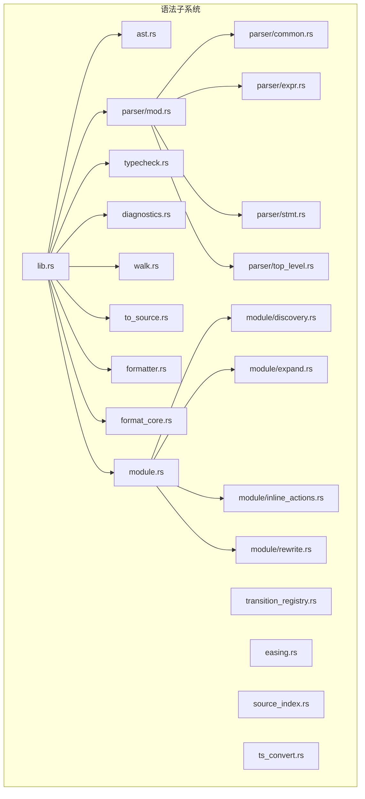
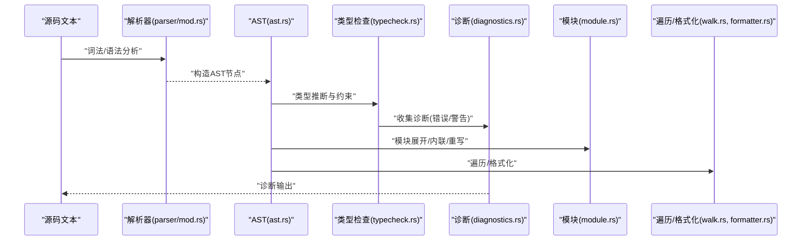
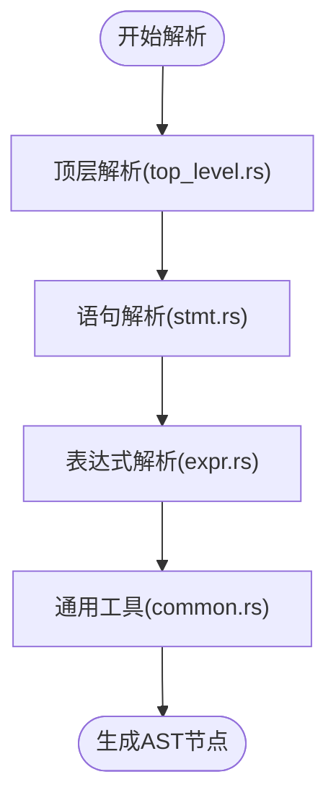
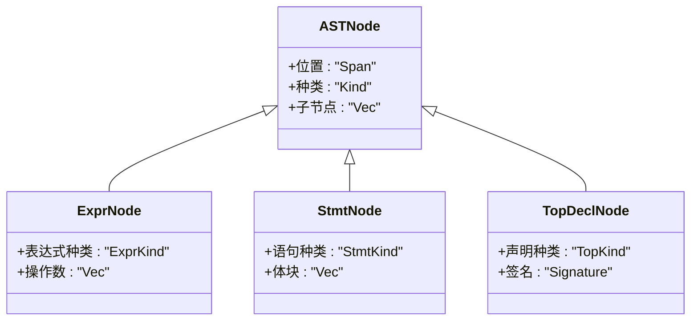
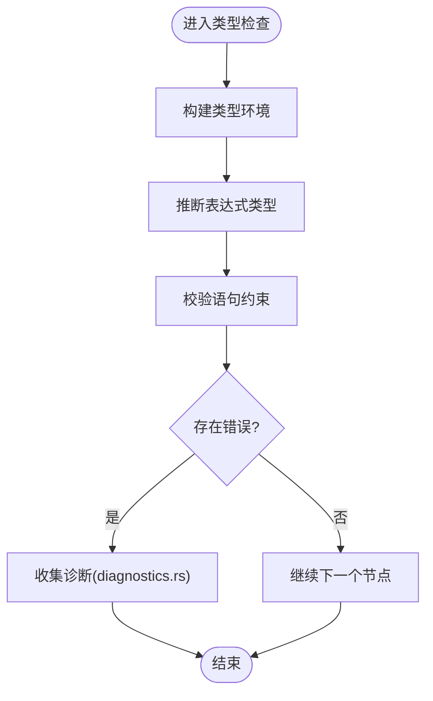
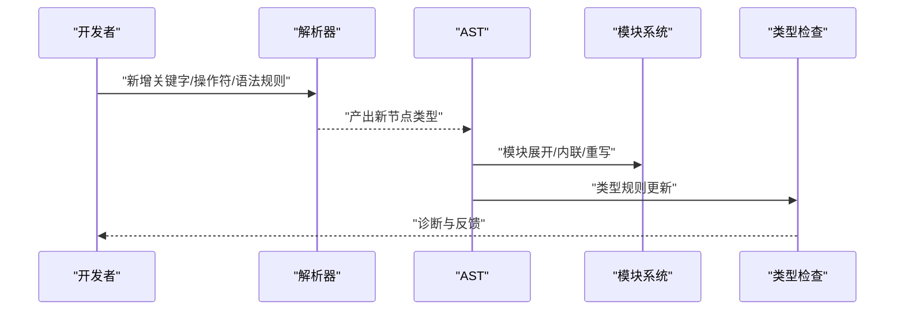
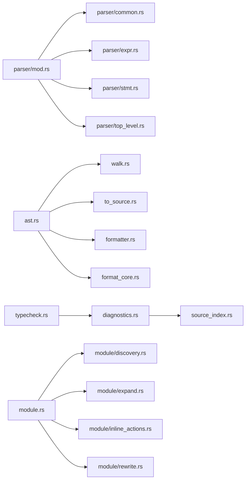

# 语法分析

<cite>
**本文引用的文件**
- [lib.rs](file://crates/animatix-syntax/src/lib.rs)
- [ast.rs](file://crates/animatix-syntax/src/ast.rs)
- [parser/mod.rs](file://crates/animatix-syntax/src/parser/mod.rs)
- [parser/common.rs](file://crates/animatix-syntax/src/parser/common.rs)
- [parser/expr.rs](file://crates/animatix-syntax/src/parser/expr.rs)
- [parser/stmt.rs](file://crates/animatix-syntax/src/parser/stmt.rs)
- [parser/top_level.rs](file://crates/animatix-syntax/src/parser/top_level.rs)
- [typecheck.rs](file://crates/animatix-syntax/src/typecheck.rs)
- [diagnostics.rs](file://crates/animatix-syntax/src/diagnostics.rs)
- [walk.rs](file://crates/animatix-syntax/src/walk.rs)
- [to_source.rs](file://crates/animatix-syntax/src/to_source.rs)
- [formatter.rs](file://crates/animatix-syntax/src/formatter.rs)
- [module.rs](file://crates/animatix-syntax/src/module.rs)
- [module/discovery.rs](file://crates/animatix-syntax/src/module/discovery.rs)
- [module/expand.rs](file://crates/animatix-syntax/src/module/expand.rs)
- [module/inline_actions.rs](file://crates/animatix-syntax/src/module/inline_actions.rs)
- [module/rewrite.rs](file://crates/animatix-syntax/src/module/rewrite.rs)
- [transition_registry.rs](file://crates/animatix-syntax/src/transition_registry.rs)
- [easing.rs](file://crates/animatix-syntax/src/easing.rs)
- [source_index.rs](file://crates/animatix-syntax/src/source_index.rs)
- [format_core.rs](file://crates/animatix-syntax/src/format_core.rs)
- [ts_convert.rs](file://crates/animatix-syntax/src/ts_convert.rs)
</cite>

## 目录
1. [引言](#引言)
2. [项目结构](#项目结构)
3. [核心组件](#核心组件)
4. [架构总览](#架构总览)
5. [详细组件分析](#详细组件分析)
6. [依赖关系分析](#依赖关系分析)
7. [性能考量](#性能考量)
8. [故障排查指南](#故障排查指南)
9. [结论](#结论)
10. [附录](#附录)

## 引言
本文件面向 Animatix 的语法分析与类型系统，系统性阐述语法解析器设计、AST 结构、语法树转换、类型检查与诊断、以及语法扩展方法。Animatix 使用自研解析器与 AST 模型，结合模块化与类型检查流程，支撑动画场景脚本的构建与验证。

## 项目结构
Animatix 语法子系统位于 crates/animatix-syntax，采用按功能域分层的组织方式：
- 核心入口与导出：lib.rs
- 抽象语法树定义：ast.rs
- 解析器：parser/mod.rs 及其子模块（expr.rs、stmt.rs、top_level.rs、common.rs）
- 类型检查与诊断：typecheck.rs、diagnostics.rs
- 遍历与转换：walk.rs、to_source.rs、formatter.rs、format_core.rs
- 模块系统：module.rs 及其子模块（discovery.rs、expand.rs、inline_actions.rs、rewrite.rs）
- 其他辅助：transition_registry.rs、easing.rs、source_index.rs、ts_convert.rs

图表来源
- [lib.rs](file://crates/animatix-syntax/src/lib.rs)
- [ast.rs](file://crates/animatix-syntax/src/ast.rs)
- [parser/mod.rs](file://crates/animatix-syntax/src/parser/mod.rs)
- [parser/common.rs](file://crates/animatix-syntax/src/parser/common.rs)
- [parser/expr.rs](file://crates/animatix-syntax/src/parser/expr.rs)
- [parser/stmt.rs](file://crates/animatix-syntax/src/parser/stmt.rs)
- [parser/top_level.rs](file://crates/animatix-syntax/src/parser/top_level.rs)
- [typecheck.rs](file://crates/animatix-syntax/src/typecheck.rs)
- [diagnostics.rs](file://crates/animatix-syntax/src/diagnostics.rs)
- [walk.rs](file://crates/animatix-syntax/src/walk.rs)
- [to_source.rs](file://crates/animatix-syntax/src/to_source.rs)
- [formatter.rs](file://crates/animatix-syntax/src/formatter.rs)
- [format_core.rs](file://crates/animatix-syntax/src/format_core.rs)
- [module.rs](file://crates/animatix-syntax/src/module.rs)
- [module/discovery.rs](file://crates/animatix-syntax/src/module/discovery.rs)
- [module/expand.rs](file://crates/animatix-syntax/src/module/expand.rs)
- [module/inline_actions.rs](file://crates/animatix-syntax/src/module/inline_actions.rs)
- [module/rewrite.rs](file://crates/animatix-syntax/src/module/rewrite.rs)
- [transition_registry.rs](file://crates/animatix-syntax/src/transition_registry.rs)
- [easing.rs](file://crates/animatix-syntax/src/easing.rs)
- [source_index.rs](file://crates/animatix-syntax/src/source_index.rs)
- [ts_convert.rs](file://crates/animatix-syntax/src/ts_convert.rs)

章节来源
- [lib.rs](file://crates/animatix-syntax/src/lib.rs)
- [ast.rs](file://crates/animatix-syntax/src/ast.rs)
- [parser/mod.rs](file://crates/animatix-syntax/src/parser/mod.rs)

## 核心组件
- 语法解析器：基于表达式、语句、顶层声明等模块化解析，统一由 parser/mod.rs 导出。
- 抽象语法树：在 ast.rs 中定义节点类型与属性，支持遍历与转换。
- 类型检查：typecheck.rs 实现类型推断与约束检查，配合 diagnostics.rs 生成诊断信息。
- 模块系统：module.rs 及其子模块负责模块发现、展开、内联动作与重写。
- 工具链：walk.rs 提供遍历，to_source.rs 支持从 AST 回写源码，formatter.rs 与 format_core.rs 负责格式化。

章节来源
- [parser/mod.rs](file://crates/animatix-syntax/src/parser/mod.rs)
- [ast.rs](file://crates/animatix-syntax/src/ast.rs)
- [typecheck.rs](file://crates/animatix-syntax/src/typecheck.rs)
- [diagnostics.rs](file://crates/animatix-syntax/src/diagnostics.rs)
- [module.rs](file://crates/animatix-syntax/src/module.rs)
- [walk.rs](file://crates/animatix-syntax/src/walk.rs)
- [to_source.rs](file://crates/animatix-syntax/src/to_source.rs)
- [formatter.rs](file://crates/animatix-syntax/src/formatter.rs)
- [format_core.rs](file://crates/animatix-syntax/src/format_core.rs)

## 架构总览
下图展示从源码到 AST、再到类型检查与诊断的整体流程，以及模块系统的参与点。

图表来源
- [parser/mod.rs](file://crates/animatix-syntax/src/parser/mod.rs)
- [ast.rs](file://crates/animatix-syntax/src/ast.rs)
- [typecheck.rs](file://crates/animatix-syntax/src/typecheck.rs)
- [diagnostics.rs](file://crates/animatix-syntax/src/diagnostics.rs)
- [module.rs](file://crates/animatix-syntax/src/module.rs)
- [walk.rs](file://crates/animatix-syntax/src/walk.rs)
- [formatter.rs](file://crates/animatix-syntax/src/formatter.rs)

## 详细组件分析

### 语法解析器设计与实现
- 分层解析策略：解析器按“顶层声明、语句、表达式”分层，确保优先级与上下文正确处理。
- 通用解析工具：common.rs 提供共享的解析辅助（如位置、标记、错误恢复）。
- 表达式解析：expr.rs 定义表达式优先级、中缀/前缀/后缀、函数调用、索引等。
- 语句解析：stmt.rs 处理控制流、赋值、声明等语句级结构。
- 顶层解析：top_level.rs 负责模块级、导入/导出、作用域边界等顶层结构。
- 解析器入口：parser/mod.rs 统一导出解析接口，供上层消费。

图表来源
- [parser/top_level.rs](file://crates/animatix-syntax/src/parser/top_level.rs)
- [parser/stmt.rs](file://crates/animatix-syntax/src/parser/stmt.rs)
- [parser/expr.rs](file://crates/animatix-syntax/src/parser/expr.rs)
- [parser/common.rs](file://crates/animatix-syntax/src/parser/common.rs)

章节来源
- [parser/mod.rs](file://crates/animatix-syntax/src/parser/mod.rs)
- [parser/common.rs](file://crates/animatix-syntax/src/parser/common.rs)
- [parser/expr.rs](file://crates/animatix-syntax/src/parser/expr.rs)
- [parser/stmt.rs](file://crates/animatix-syntax/src/parser/stmt.rs)
- [parser/top_level.rs](file://crates/animatix-syntax/src/parser/top_level.rs)

### AST 结构设计与遍历
- 节点类型：ast.rs 定义了表达式、语句、顶层声明等节点类型及其属性（如位置、标识符、参数、体块等）。
- 属性与复杂度：节点属性决定后续类型检查与 IR 生成的成本；合理拆分节点可降低遍历与检查复杂度。
- 遍历算法：walk.rs 提供深度/广度优先遍历框架，支持访问者模式，便于扩展检查与转换。
- AST 转换：to_source.rs 将 AST 回写为源码片段，formatter.rs 与 format_core.rs 提供格式化能力。

图表来源
- [ast.rs](file://crates/animatix-syntax/src/ast.rs)
- [walk.rs](file://crates/animatix-syntax/src/walk.rs)
- [to_source.rs](file://crates/animatix-syntax/src/to_source.rs)
- [formatter.rs](file://crates/animatix-syntax/src/formatter.rs)
- [format_core.rs](file://crates/animatix-syntax/src/format_core.rs)

章节来源
- [ast.rs](file://crates/animatix-syntax/src/ast.rs)
- [walk.rs](file://crates/animatix-syntax/src/walk.rs)
- [to_source.rs](file://crates/animatix-syntax/src/to_source.rs)
- [formatter.rs](file://crates/animatix-syntax/src/formatter.rs)
- [format_core.rs](file://crates/animatix-syntax/src/format_core.rs)

### 语法树转换与优化策略
- 从源码到 AST：解析器逐层产出 AST，保持与源码位置映射，便于诊断与格式化。
- 优化策略：
  - 常量折叠与死代码消除：在表达式层面进行常量传播与冗余分支剔除。
  - 形态简化：将嵌套表达式标准化为更易处理的形式，减少类型检查复杂度。
  - 惰性求值提示：对副作用较小的表达式保留延迟计算机会。
- 回写与格式化：to_source.rs 与 formatter.rs 确保 AST 到源码的可逆与一致。

章节来源
- [parser/mod.rs](file://crates/animatix-syntax/src/parser/mod.rs)
- [ast.rs](file://crates/animatix-syntax/src/ast.rs)
- [to_source.rs](file://crates/animatix-syntax/src/to_source.rs)
- [formatter.rs](file://crates/animatix-syntax/src/formatter.rs)
- [format_core.rs](file://crates/animatix-syntax/src/format_core.rs)

### 类型检查系统
- 类型推断：typecheck.rs 对表达式与语句进行类型推断，维护类型环境与约束方程。
- 错误检测与诊断：diagnostics.rs 将类型不匹配、未定义符号、重复声明等问题转化为用户可读的诊断消息。
- 诊断生成：结合 source_index.rs 的源码索引，定位问题范围并提供上下文高亮。
- 与 AST 的协作：类型检查依赖 AST 的结构与属性，遍历由 walk.rs 提供基础。

图表来源
- [typecheck.rs](file://crates/animatix-syntax/src/typecheck.rs)
- [diagnostics.rs](file://crates/animatix-syntax/src/diagnostics.rs)
- [source_index.rs](file://crates/animatix-syntax/src/source_index.rs)
- [walk.rs](file://crates/animatix-syntax/src/walk.rs)

章节来源
- [typecheck.rs](file://crates/animatix-syntax/src/typecheck.rs)
- [diagnostics.rs](file://crates/animatix-syntax/src/diagnostics.rs)
- [source_index.rs](file://crates/animatix-syntax/src/source_index.rs)
- [walk.rs](file://crates/animatix-syntax/src/walk.rs)

### 模块系统与语法扩展
- 模块发现与展开：module/discovery.rs 与 module/expand.rs 负责模块路径解析与内容展开。
- 内联动作：module/inline_actions.rs 在解析阶段将动作内联，减少运行时开销。
- 重写规则：module/rewrite.rs 提供语法层面的重写与规范化。
- 语法扩展指南：
  - 新增关键字/操作符：在解析器 common.rs/expr.rs/stmt.rs 中添加词法/语法规则，并在 AST 中补充对应节点类型。
  - 新增语法规则：在 parser/mod.rs 中注册新规则，确保与现有优先级体系兼容。
  - 类型系统扩展：在 typecheck.rs 中增加类型规则与约束，配合 diagnostics.rs 输出相应诊断。
  - 模块系统扩展：在 module.rs 子模块中实现发现/展开/内联/重写的配套逻辑。

图表来源
- [module/discovery.rs](file://crates/animatix-syntax/src/module/discovery.rs)
- [module/expand.rs](file://crates/animatix-syntax/src/module/expand.rs)
- [module/inline_actions.rs](file://crates/animatix-syntax/src/module/inline_actions.rs)
- [module/rewrite.rs](file://crates/animatix-syntax/src/module/rewrite.rs)
- [parser/mod.rs](file://crates/animatix-syntax/src/parser/mod.rs)
- [ast.rs](file://crates/animatix-syntax/src/ast.rs)
- [typecheck.rs](file://crates/animatix-syntax/src/typecheck.rs)
- [diagnostics.rs](file://crates/animatix-syntax/src/diagnostics.rs)

章节来源
- [module.rs](file://crates/animatix-syntax/src/module.rs)
- [module/discovery.rs](file://crates/animatix-syntax/src/module/discovery.rs)
- [module/expand.rs](file://crates/animatix-syntax/src/module/expand.rs)
- [module/inline_actions.rs](file://crates/animatix-syntax/src/module/inline_actions.rs)
- [module/rewrite.rs](file://crates/animatix-syntax/src/module/rewrite.rs)
- [parser/mod.rs](file://crates/animatix-syntax/src/parser/mod.rs)
- [ast.rs](file://crates/animatix-syntax/src/ast.rs)
- [typecheck.rs](file://crates/animatix-syntax/src/typecheck.rs)
- [diagnostics.rs](file://crates/animatix-syntax/src/diagnostics.rs)

## 依赖关系分析
- 解析器依赖：parser/mod.rs 统一导出，内部依赖 common.rs、expr.rs、stmt.rs、top_level.rs。
- AST 依赖：walk.rs、to_source.rs、formatter.rs、format_core.rs 依赖 ast.rs。
- 类型系统：typecheck.rs 依赖 ast.rs 与 diagnostics.rs；diagnostics.rs 依赖 source_index.rs。
- 模块系统：module.rs 依赖 discovery.rs、expand.rs、inline_actions.rs、rewrite.rs。

图表来源
- [parser/mod.rs](file://crates/animatix-syntax/src/parser/mod.rs)
- [parser/common.rs](file://crates/animatix-syntax/src/parser/common.rs)
- [parser/expr.rs](file://crates/animatix-syntax/src/parser/expr.rs)
- [parser/stmt.rs](file://crates/animatix-syntax/src/parser/stmt.rs)
- [parser/top_level.rs](file://crates/animatix-syntax/src/parser/top_level.rs)
- [ast.rs](file://crates/animatix-syntax/src/ast.rs)
- [walk.rs](file://crates/animatix-syntax/src/walk.rs)
- [to_source.rs](file://crates/animatix-syntax/src/to_source.rs)
- [formatter.rs](file://crates/animatix-syntax/src/formatter.rs)
- [format_core.rs](file://crates/animatix-syntax/src/format_core.rs)
- [typecheck.rs](file://crates/animatix-syntax/src/typecheck.rs)
- [diagnostics.rs](file://crates/animatix-syntax/src/diagnostics.rs)
- [source_index.rs](file://crates/animatix-syntax/src/source_index.rs)
- [module.rs](file://crates/animatix-syntax/src/module.rs)
- [module/discovery.rs](file://crates/animatix-syntax/src/module/discovery.rs)
- [module/expand.rs](file://crates/animatix-syntax/src/module/expand.rs)
- [module/inline_actions.rs](file://crates/animatix-syntax/src/module/inline_actions.rs)
- [module/rewrite.rs](file://crates/animatix-syntax/src/module/rewrite.rs)

章节来源
- [parser/mod.rs](file://crates/animatix-syntax/src/parser/mod.rs)
- [ast.rs](file://crates/animatix-syntax/src/ast.rs)
- [typecheck.rs](file://crates/animatix-syntax/src/typecheck.rs)
- [diagnostics.rs](file://crates/animatix-syntax/src/diagnostics.rs)
- [module.rs](file://crates/animatix-syntax/src/module.rs)

## 性能考量
- 解析阶段：通过分层解析与优先级表避免回溯，提升吞吐量。
- AST 遍历：利用 walk.rs 的访问者框架，尽量一次性完成多任务（类型检查+副作用分析）。
- 类型检查：在 typecheck.rs 中缓存中间结果，减少重复推断；对大型表达式采用惰性策略。
- 格式化与回写：to_source.rs 与 formatter.rs 仅在必要时重建源码，避免全量重排。

## 故障排查指南
- 诊断来源：diagnostics.rs 负责将类型不匹配、未定义符号、重复声明等错误转化为可读消息。
- 位置映射：source_index.rs 提供源码行/列到 AST 节点的映射，辅助定位问题。
- 常见问题：
  - 类型不匹配：检查 typecheck.rs 的约束是否覆盖到该节点类型。
  - 未定义符号：确认模块展开与作用域是否正确传播。
  - 语法错误：核对 parser/* 中的规则与优先级是否完整。

章节来源
- [diagnostics.rs](file://crates/animatix-syntax/src/diagnostics.rs)
- [source_index.rs](file://crates/animatix-syntax/src/source_index.rs)
- [typecheck.rs](file://crates/animatix-syntax/src/typecheck.rs)

## 结论
Animatix 的语法分析系统以模块化解析器为核心，配合清晰的 AST 设计、完善的类型检查与诊断、以及可扩展的模块系统，实现了从源码到可执行语义的可靠转换。遵循本文的扩展与优化建议，可在保证正确性的前提下持续增强语言能力与开发体验。

## 附录
- 过渡与缓动：transition_registry.rs 与 easing.rs 提供过渡与缓动注册与查询，便于在类型检查与语义分析中使用。
- TypeScript 转换：ts_convert.rs 提供类型系统与外部生态的桥接能力。

章节来源
- [transition_registry.rs](file://crates/animatix-syntax/src/transition_registry.rs)
- [easing.rs](file://crates/animatix-syntax/src/easing.rs)
- [ts_convert.rs](file://crates/animatix-syntax/src/ts_convert.rs)