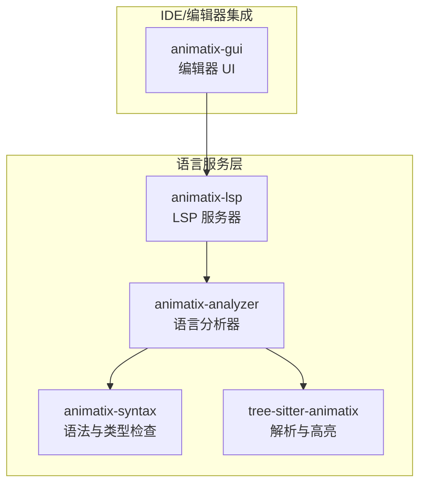
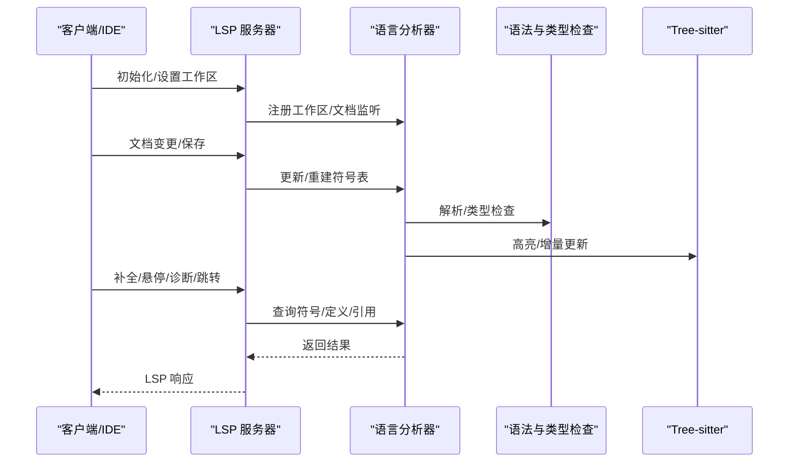
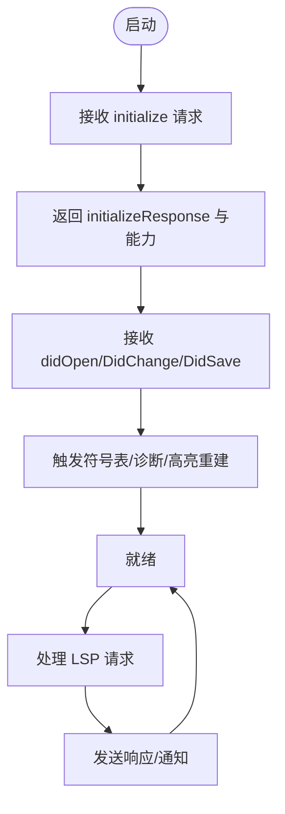
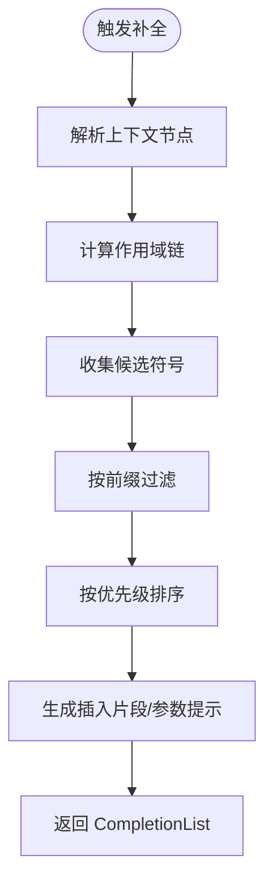
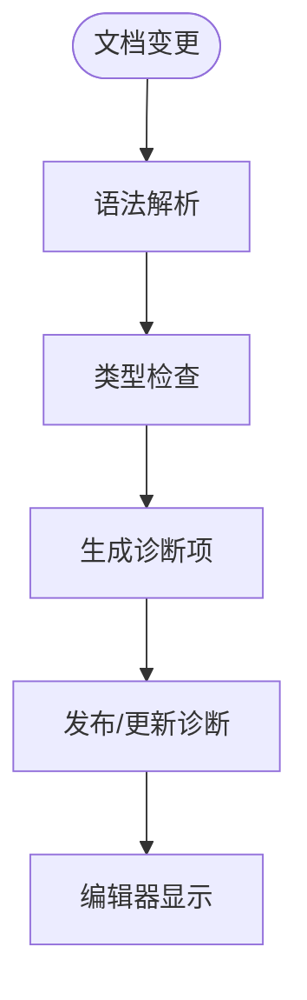
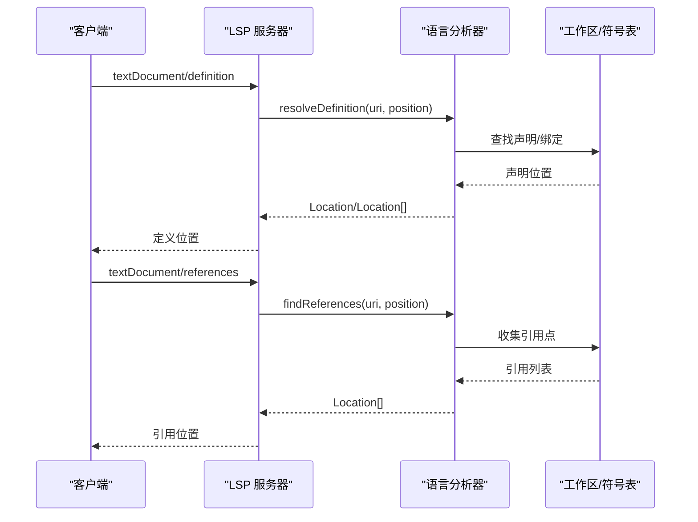
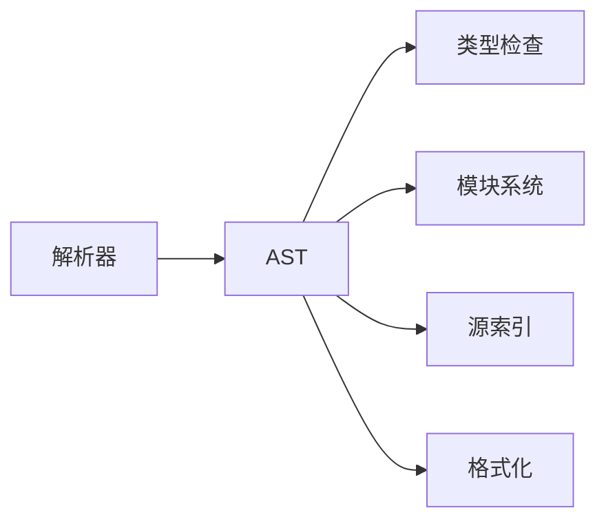
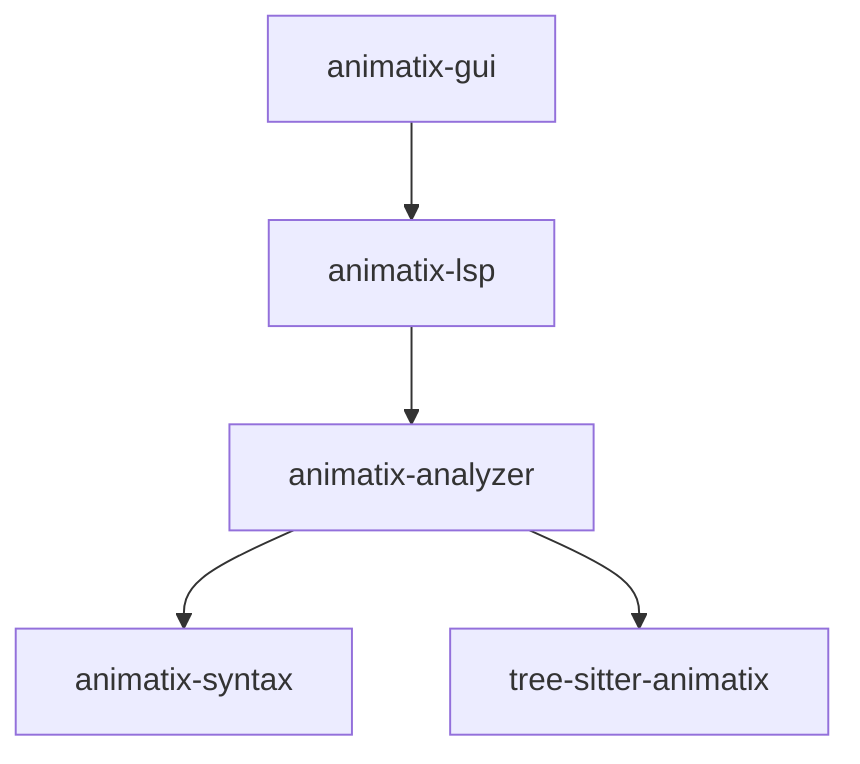

# 语言服务

<cite>
**本文档引用的文件**
- [crates/animatix-lsp/Cargo.toml](file://crates/animatix-lsp/Cargo.toml)
- [crates/animatix-lsp/src/main.rs](file://crates/animatix-lsp/src/main.rs)
- [crates/animatix-analyzer/Cargo.toml](file://crates/animatix-analyzer/Cargo.toml)
- [crates/animatix-analyzer/src/lib.rs](file://crates/animatix-analyzer/src/lib.rs)
- [crates/animatix-analyzer/src/completer.rs](file://crates/animatix-analyzer/src/completer.rs)
- [crates/animatix-analyzer/src/symbol_table.rs](file://crates/animatix-analyzer/src/symbol_table.rs)
- [crates/animatix-analyzer/src/diagnostics.rs](file://crates/animatix-analyzer/src/diagnostics.rs)
- [crates/animatix-analyzer/src/definition.rs](file://crates/animatix-analyzer/src/definition.rs)
- [crates/animatix-analyzer/src/references.rs](file://crates/animatix-analyzer/src/references.rs)
- [crates/animatix-analyzer/src/document_symbol.rs](file://crates/animatix-analyzer/src/document_symbol.rs)
- [crates/animatix-analyzer/src/hover.rs](file://crates/animatix-analyzer/src/hover.rs)
- [crates/animatix-analyzer/src/workspace.rs](file://crates/animatix-analyzer/src/workspace.rs)
- [crates/animatix-analyzer/src/types.rs](file://crates/animatix-analyzer/src/types.rs)
- [crates/animatix-syntax/src/lib.rs](file://crates/animatix-syntax/src/lib.rs)
- [crates/animatix-syntax/src/parser/mod.rs](file://crates/animatix-syntax/src/parser/mod.rs)
- [crates/animatix-syntax/src/typecheck.rs](file://crates/animatix-syntax/src/typecheck.rs)
- [crates/animatix-syntax/src/diagnostics.rs](file://crates/animatix-syntax/src/diagnostics.rs)
- [crates/animatix-syntax/src/source_index.rs](file://crates/animatix-syntax/src/source_index.rs)
- [crates/animatix-syntax/src/module.rs](file://crates/animatix-syntax/src/module.rs)
- [crates/animatix-syntax/src/module/discovery.rs](file://crates/animatix-syntax/src/module/discovery.rs)
- [crates/animatix-syntax/src/module/expand.rs](file://crates/animatix-syntax/src/module/expand.rs)
- [crates/animatix-syntax/src/module/inline_actions.rs](file://crates/animatix-syntax/src/module/inline_actions.rs)
- [crates/animatix-syntax/src/module/rewrite.rs](file://crates/animatix-syntax/src/module/rewrite.rs)
- [crates/animatix-syntax/src/format_core.rs](file://crates/animatix-syntax/src/format_core.rs)
- [crates/animatix-syntax/src/formatter.rs](file://crates/animatix-syntax/src/formatter.rs)
- [crates/animatix-syntax/src/walk.rs](file://crates/animatix-syntax/src/walk.rs)
- [crates/animatix-syntax/src/easing.rs](file://crates/animatix-syntax/src/easing.rs)
- [crates/animatix-syntax/src/transition_registry.rs](file://crates/animatix-syntax/src/transition_registry.rs)
- [crates/animatix-syntax/src/ts_convert.rs](file://crates/animatix-syntax/src/ts_convert.rs)
- [crates/animatix-syntax/src/to_source.rs](file://crates/animatix-syntax/src/to_source.rs)
- [crates/animatix-syntax/src/ast.rs](file://crates/animatix-syntax/src/ast.rs)
- [crates/animatix-syntax/tests/roundtrip_examples.rs](file://crates/animatix-syntax/tests/roundtrip_examples.rs)
- [Cargo.toml](file://Cargo.toml)
- [crates/animatix-gui/src/editor/completion.rs](file://crates/animatix-gui/src/editor/completion.rs)
- [crates/animatix-gui/src/editor/diagnostics.rs](file://crates/animatix-gui/src/editor/diagnostics.rs)
- [crates/animatix-gui/src/lib.rs](file://crates/animatix-gui/src/lib.rs)
- [crates/animatix-gui/src/main.rs](file://crates/animatix-gui/src/main.rs)
- [tree-sitter-animatix/src/lib.rs](file://tree-sitter-animatix/src/lib.rs)
- [tree-sitter-animatix/Cargo.toml](file://tree-sitter-animatix/Cargo.toml)
</cite>

## 目录
1. [简介](#简介)
2. [项目结构](#项目结构)
3. [核心组件](#核心组件)
4. [架构总览](#架构总览)
5. [详细组件分析](#详细组件分析)
6. [依赖关系分析](#依赖关系分析)
7. [性能考虑](#性能考虑)
8. [故障排查指南](#故障排查指南)
9. [结论](#结论)
10. [附录](#附录)

## 简介
本文件面向 Animatix 的语言服务系统，聚焦以下目标：
- LSP 服务器实现架构：消息处理、连接管理与协议规范
- 代码补全系统：符号表构建、上下文感知与智能提示算法
- 诊断系统：错误检测、警告生成与修复建议
- 符号导航：定义跳转、引用查找与符号重命名
- IDE 集成：VS Code 扩展开发与配置方法
- 性能优化策略与调试技巧

Animatix 采用多 crate 分层设计：语法与类型检查位于 animatix-syntax，语言分析器位于 animatix-analyzer，LSP 服务器位于 animatix-lsp，GUI 编辑器与补全/诊断 UI 位于 animatix-gui，Tree-sitter 词法树用于高亮与增量解析。

## 项目结构
- crates/animatix-lsp：LSP 服务器入口与协议适配
- crates/animatix-analyzer：语言分析核心（补全、符号表、诊断、定义、引用、文档符号、悬停）
- crates/animatix-syntax：语法解析、AST、模块系统、格式化、类型检查、源索引等
- crates/animatix-gui：编辑器 UI、补全弹窗、诊断面板、命令总线等
- tree-sitter-animatix：Tree-sitter 解析器与查询
- 根 Cargo.toml：工作区聚合

图表来源
- [crates/animatix-lsp/src/main.rs](file://crates/animatix-lsp/src/main.rs)
- [crates/animatix-analyzer/src/lib.rs](file://crates/animatix-analyzer/src/lib.rs)
- [crates/animatix-syntax/src/lib.rs](file://crates/animatix-syntax/src/lib.rs)
- [tree-sitter-animatix/src/lib.rs](file://tree-sitter-animatix/src/lib.rs)
- [crates/animatix-gui/src/lib.rs](file://crates/animatix-gui/src/lib.rs)

章节来源
- [Cargo.toml](file://Cargo.toml)
- [crates/animatix-lsp/Cargo.toml](file://crates/animatix-lsp/Cargo.toml)
- [crates/animatix-analyzer/Cargo.toml](file://crates/animatix-analyzer/Cargo.toml)
- [crates/animatix-syntax/Cargo.toml](file://crates/animatix-syntax/Cargo.toml)
- [tree-sitter-animatix/Cargo.toml](file://tree-sitter-animatix/Cargo.toml)

## 核心组件
- LSP 服务器：负责标准 LSP 消息循环、请求/响应分发、连接生命周期管理
- 语言分析器（Analyzer）：提供补全、符号表、诊断、定义、引用、文档符号、悬停等能力
- 语法与类型检查（Syntax）：解析、AST、模块发现/展开/内联、类型检查、源索引、格式化
- Tree-sitter：增量高亮与语法树支持
- GUI 编辑器：补全弹窗、诊断面板、命令总线、UI 命令与 LSP 协同

章节来源
- [crates/animatix-lsp/src/main.rs](file://crates/animatix-lsp/src/main.rs)
- [crates/animatix-analyzer/src/lib.rs](file://crates/animatix-analyzer/src/lib.rs)
- [crates/animatix-syntax/src/lib.rs](file://crates/animatix-syntax/src/lib.rs)
- [tree-sitter-animatix/src/lib.rs](file://tree-sitter-animatix/src/lib.rs)
- [crates/animatix-gui/src/lib.rs](file://crates/animatix-gui/src/lib.rs)

## 架构总览
语言服务以 LSP 为接口，Analyzer 聚合 Syntax 与 Tree-sitter 提供语义能力；GUI 通过 LSP 与 Analyzer 协作，实现编辑体验。

图表来源
- [crates/animatix-lsp/src/main.rs](file://crates/animatix-lsp/src/main.rs)
- [crates/animatix-analyzer/src/lib.rs](file://crates/animatix-analyzer/src/lib.rs)
- [crates/animatix-syntax/src/lib.rs](file://crates/animatix-syntax/src/lib.rs)
- [tree-sitter-animatix/src/lib.rs](file://tree-sitter-animatix/src/lib.rs)

## 详细组件分析

### LSP 服务器实现
- 连接管理：建立输入输出通道，维护会话状态，处理初始化/关闭流程
- 消息处理：解析 JSON-RPC 请求，路由到对应 LSP 方法（如 textDocument/completion、textDocument/hover、textDocument/definition 等）
- 协议规范：遵循标准 LSP 3.x，支持工作区/文档事件、范围/位置类型、标记类型、诊断格式等
- 生命周期：文档打开/关闭/变更、工作区刷新、符号表重建、缓存失效与更新

图表来源
- [crates/animatix-lsp/src/main.rs](file://crates/animatix-lsp/src/main.rs)

章节来源
- [crates/animatix-lsp/src/main.rs](file://crates/animatix-lsp/src/main.rs)
- [crates/animatix-lsp/Cargo.toml](file://crates/animatix-lsp/Cargo.toml)

### 代码补全系统
- 符号表构建：基于 AST 与模块系统收集可见性符号、作用域链、导入别名与重导出
- 上下文感知：根据光标位置与前缀，结合作用域与关键字集合，过滤候选
- 智能提示算法：优先级排序（局部变量 > 全局 > 导入 > 关键字），插入片段与参数占位符，避免重复
- 与 Tree-sitter 协作：利用增量语法树快速定位上下文节点，提升实时性

图表来源
- [crates/animatix-analyzer/src/completer.rs](file://crates/animatix-analyzer/src/completer.rs)
- [crates/animatix-analyzer/src/symbol_table.rs](file://crates/animatix-analyzer/src/symbol_table.rs)
- [crates/animatix-syntax/src/module.rs](file://crates/animatix-syntax/src/module.rs)
- [tree-sitter-animatix/src/lib.rs](file://tree-sitter-animatix/src/lib.rs)

章节来源
- [crates/animatix-analyzer/src/completer.rs](file://crates/animatix-analyzer/src/completer.rs)
- [crates/animatix-analyzer/src/symbol_table.rs](file://crates/animatix-analyzer/src/symbol_table.rs)
- [crates/animatix-syntax/src/module.rs](file://crates/animatix-syntax/src/module.rs)
- [crates/animatix-gui/src/editor/completion.rs](file://crates/animatix-gui/src/editor/completion.rs)

### 诊断系统
- 错误检测：语法错误、类型不匹配、未定义符号、非法赋值、模块解析失败
- 警告生成：未使用变量、过时用法、潜在性能问题
- 修复建议：自动修复拼写、格式化、导入缺失、类型标注建议
- 与语法树/类型检查联动：基于 AST 与类型推断生成精确位置与消息

图表来源
- [crates/animatix-analyzer/src/diagnostics.rs](file://crates/animatix-analyzer/src/diagnostics.rs)
- [crates/animatix-syntax/src/diagnostics.rs](file://crates/animatix-syntax/src/diagnostics.rs)
- [crates/animatix-syntax/src/typecheck.rs](file://crates/animatix-syntax/src/typecheck.rs)
- [crates/animatix-gui/src/editor/diagnostics.rs](file://crates/animatix-gui/src/editor/diagnostics.rs)

章节来源
- [crates/animatix-analyzer/src/diagnostics.rs](file://crates/animatix-analyzer/src/diagnostics.rs)
- [crates/animatix-syntax/src/diagnostics.rs](file://crates/animatix-syntax/src/diagnostics.rs)
- [crates/animatix-syntax/src/typecheck.rs](file://crates/animatix-syntax/src/typecheck.rs)
- [crates/animatix-gui/src/editor/diagnostics.rs](file://crates/animatix-gui/src/editor/diagnostics.rs)

### 符号导航（定义/引用/重命名）
- 定义跳转：从光标处定位 AST 节点，查找其声明或绑定，返回位置范围
- 引用查找：遍历作用域与导入映射，收集所有引用点，去重并排序
- 重命名：在工作区内安全替换符号名，避免破坏保留标识与跨文件引用

图表来源
- [crates/animatix-analyzer/src/definition.rs](file://crates/animatix-analyzer/src/definition.rs)
- [crates/animatix-analyzer/src/references.rs](file://crates/animatix-analyzer/src/references.rs)
- [crates/animatix-analyzer/src/workspace.rs](file://crates/animatix-analyzer/src/workspace.rs)

章节来源
- [crates/animatix-analyzer/src/definition.rs](file://crates/animatix-analyzer/src/definition.rs)
- [crates/animatix-analyzer/src/references.rs](file://crates/animatix-analyzer/src/references.rs)
- [crates/animatix-analyzer/src/workspace.rs](file://crates/animatix-analyzer/src/workspace.rs)

### 悬停与文档符号
- 悬停信息：根据光标位置返回类型签名、文档字符串、参数说明、上下文片段
- 文档符号：提取顶层声明、函数、类、属性等，支持层级折叠与搜索

章节来源
- [crates/animatix-analyzer/src/hover.rs](file://crates/animatix-analyzer/src/hover.rs)
- [crates/animatix-analyzer/src/document_symbol.rs](file://crates/animatix-analyzer/src/document_symbol.rs)

### 语法与类型系统
- 解析与 AST：表达式、语句、顶层结构，支持增量与回溯
- 类型检查：推断、约束、泛型、模块作用域与可见性
- 模块系统：发现、展开、内联动作、重写与重导出
- 源索引：行/列到偏移映射，支持快速定位与范围转换
- 格式化：核心格式化与可选美化器

图表来源
- [crates/animatix-syntax/src/parser/mod.rs](file://crates/animatix-syntax/src/parser/mod.rs)
- [crates/animatix-syntax/src/typecheck.rs](file://crates/animatix-syntax/src/typecheck.rs)
- [crates/animatix-syntax/src/module/discovery.rs](file://crates/animatix-syntax/src/module/discovery.rs)
- [crates/animatix-syntax/src/module/expand.rs](file://crates/animatix-syntax/src/module/expand.rs)
- [crates/animatix-syntax/src/module/inline_actions.rs](file://crates/animatix-syntax/src/module/inline_actions.rs)
- [crates/animatix-syntax/src/module/rewrite.rs](file://crates/animatix-syntax/src/module/rewrite.rs)
- [crates/animatix-syntax/src/source_index.rs](file://crates/animatix-syntax/src/source_index.rs)
- [crates/animatix-syntax/src/formatter.rs](file://crates/animatix-syntax/src/formatter.rs)

章节来源
- [crates/animatix-syntax/src/lib.rs](file://crates/animatix-syntax/src/lib.rs)
- [crates/animatix-syntax/src/parser/mod.rs](file://crates/animatix-syntax/src/parser/mod.rs)
- [crates/animatix-syntax/src/typecheck.rs](file://crates/animatix-syntax/src/typecheck.rs)
- [crates/animatix-syntax/src/module.rs](file://crates/animatix-syntax/src/module.rs)
- [crates/animatix-syntax/src/source_index.rs](file://crates/animatix-syntax/src/source_index.rs)
- [crates/animatix-syntax/src/format_core.rs](file://crates/animatix-syntax/src/format_core.rs)
- [crates/animatix-syntax/src/formatter.rs](file://crates/animatix-syntax/src/formatter.rs)

### Tree-sitter 集成
- 词法树：高亮查询、增量更新、节点遍历
- 与语法层协作：加速上下文定位与高亮渲染

章节来源
- [tree-sitter-animatix/src/lib.rs](file://tree-sitter-animatix/src/lib.rs)
- [crates/animatix-syntax/src/walk.rs](file://crates/animatix-syntax/src/walk.rs)

### GUI 编辑器与 LSP 协同
- 补全弹窗：触发、过滤、排序、插入
- 诊断面板：聚合与展示诊断，支持快速修复
- 命令总线：统一调度编辑器行为与 LSP 交互

章节来源
- [crates/animatix-gui/src/editor/completion.rs](file://crates/animatix-gui/src/editor/completion.rs)
- [crates/animatix-gui/src/editor/diagnostics.rs](file://crates/animatix-gui/src/editor/diagnostics.rs)
- [crates/animatix-gui/src/lib.rs](file://crates/animatix-gui/src/lib.rs)
- [crates/animatix-gui/src/main.rs](file://crates/animatix-gui/src/main.rs)

## 依赖关系分析
- animatix-lsp 依赖 animatix-analyzer 提供语义能力
- animatix-analyzer 依赖 animatix-syntax 与 tree-sitter-animatix
- animatix-gui 通过 LSP 与 Analyzer 协作，提供编辑体验

图表来源
- [crates/animatix-lsp/Cargo.toml](file://crates/animatix-lsp/Cargo.toml)
- [crates/animatix-analyzer/Cargo.toml](file://crates/animatix-analyzer/Cargo.toml)
- [crates/animatix-syntax/Cargo.toml](file://crates/animatix-syntax/Cargo.toml)
- [tree-sitter-animatix/Cargo.toml](file://tree-sitter-animatix/Cargo.toml)

章节来源
- [Cargo.toml](file://Cargo.toml)

## 性能考虑
- 增量解析与缓存：利用 Tree-sitter 与语法层增量能力，仅重算受影响区域
- 符号表复用：在文档变更后增量更新符号表，避免全量重建
- 作用域剪枝：补全与诊断时按作用域链快速过滤候选
- 并发与批处理：批量应用编辑、合并诊断更新
- I/O 与网络：LSP 层缓冲输出、节流高频请求

## 故障排查指南
- LSP 启动失败：确认初始化参数、根路径与工作区设置
- 补全无响应：检查符号表是否加载、作用域链是否正确、前缀过滤逻辑
- 诊断不更新：确认文档变更事件是否到达、类型检查是否成功、诊断发布流程
- 定义/引用不准：核对 AST 节点定位、模块导入映射与重导出
- 高亮异常：检查 Tree-sitter 查询与增量更新时机

## 结论
Animatix 的语言服务以清晰的分层架构实现：LSP 作为接口层，Analyzer 聚合语法与 Tree-sitter 提供语义能力，GUI 通过 LSP 实现流畅的编辑体验。通过增量解析、符号表复用与作用域剪枝等策略，系统在准确性与性能之间取得平衡。后续可在模块系统扩展、诊断修复建议自动化与 VS Code 扩展打包方面继续完善。

## 附录
- VS Code 扩展开发要点
  - 使用官方 LSP 客户端库建立连接
  - 订阅文本变化与保存事件，驱动 Analyzer 更新
  - 实现补全/悬停/诊断/跳转 Provider，并与 GUI 命令总线联动
  - 配置任务与调试，确保本地开发与测试闭环