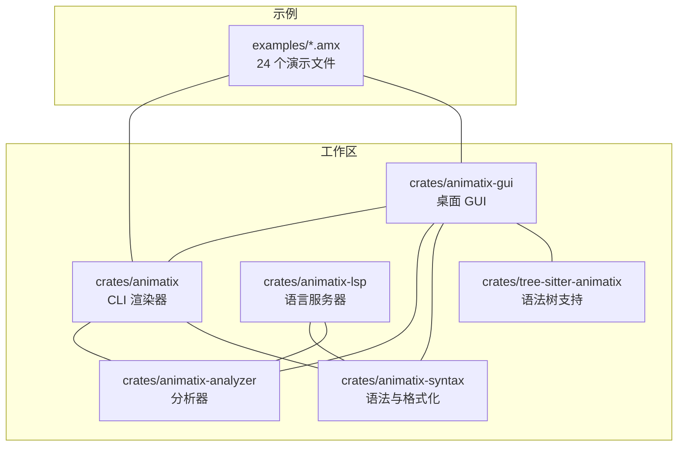
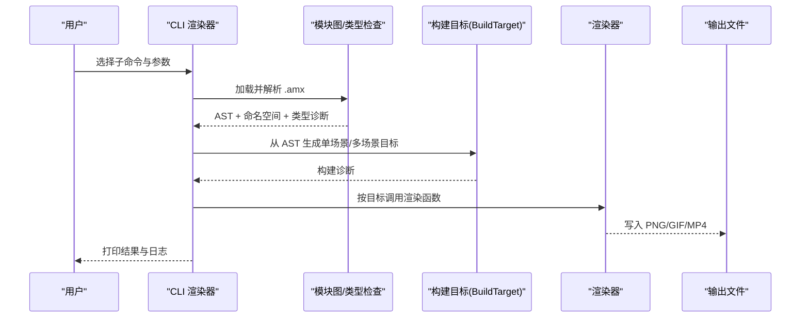
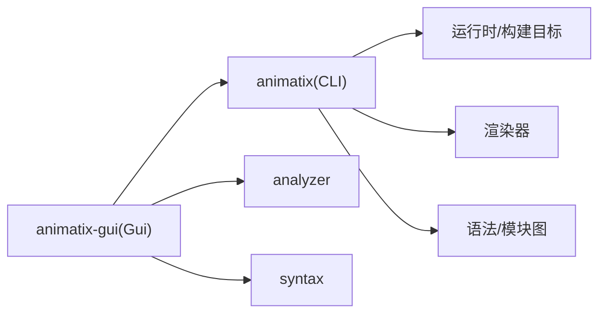

# 快速开始

<cite>
**本文引用的文件**
- [Readme.md](file://Readme.md)
- [Cargo.toml](file://Cargo.toml)
- [crates/animatix/Cargo.toml](file://crates/animatix/Cargo.toml)
- [crates/animatix/src/main.rs](file://crates/animatix/src/main.rs)
- [crates/animatix-gui/src/main.rs](file://crates/animatix-gui/src/main.rs)
- [crates/animatix-gui/src/lib.rs](file://crates/animatix-gui/src/lib.rs)
- [examples/00_hello.amx](file://examples/00_hello.amx)
- [examples/README.md](file://examples/README.md)
- [flake.nix](file://flake.nix)
- [CONTRIBUTING.md](file://CONTRIBUTING.md)
</cite>

## 目录
1. [简介](#简介)
2. [项目结构](#项目结构)
3. [核心组件](#核心组件)
4. [架构总览](#架构总览)
5. [详细组件解析](#详细组件解析)
6. [依赖关系分析](#依赖关系分析)
7. [性能与资源建议](#性能与资源建议)
8. [故障排除指南](#故障排除指南)
9. [结论](#结论)
10. [附录：命令速查](#附录命令速查)

## 简介
本指南面向初学者，带你从零开始使用 Animatix 创建第一个动画。你将学会：
- 安装与环境准备（系统要求、依赖项、可选 Nix 开发环境）
- 运行第一个动画示例（从“Hello World”起步）
- 使用命令行工具渲染图片、视频与动图
- 启动 GUI 应用进行可视化编辑与预览
- 常见问题排查与优化建议

## 项目结构
仓库采用多 crate 工作区组织，核心模块包括：
- animatix：CLI 渲染器与语言运行时
- animatix-gui：基于 egui 的桌面 GUI 编辑器
- animatix-analyzer、animatix-syntax、animatix-lsp：语法分析、语言服务与编辑器集成
- examples：24 个循序渐进的示例，覆盖从基础形状到多场景组合的完整能力

图表来源
- [Cargo.toml:1-11](file://Cargo.toml#L1-L11)
- [crates/animatix/Cargo.toml:1-105](file://crates/animatix/Cargo.toml#L1-L105)
- [crates/animatix-gui/Cargo.toml:1-49](file://crates/animatix-gui/Cargo.toml#L1-L49)

章节来源
- [Cargo.toml:1-11](file://Cargo.toml#L1-L11)
- [Readme.md:1-178](file://Readme.md#L1-L178)

## 核心组件
- CLI 渲染器（animatix）：提供渲染单帧图像、导出视频与动图、检查与格式化等子命令；支持单场景与多场景组合导出。
- GUI 应用（animatix-gui）：桌面编辑器，支持源码编辑、实时预览、诊断提示、时间轴与属性面板等。
- 语法与分析（animatix-syntax、animatix-analyzer、animatix-lsp、tree-sitter-animatix）：为编辑器提供高亮、补全、诊断与语言服务。

章节来源
- [crates/animatix/src/main.rs:36-204](file://crates/animatix/src/main.rs#L36-L204)
- [crates/animatix-gui/src/lib.rs:1-18](file://crates/animatix-gui/src/lib.rs#L1-L18)

## 架构总览
下图展示了从示例文件到最终输出的关键流程：解析与构建 → 选择导出目标（单场景/多场景）→ 渲染管线 → 输出媒体。

图表来源
- [crates/animatix/src/main.rs:210-230](file://crates/animatix/src/main.rs#L210-L230)
- [crates/animatix/src/main.rs:335-714](file://crates/animatix/src/main.rs#L335-L714)

## 详细组件解析

### 安装与环境准备
- 系统要求与 Rust 版本
  - 工作区 Rust 版本要求：1.85 及以上
  - 推荐使用稳定版工具链
- 关键依赖
  - 图形后端：WGPU + VULKAN/WGSL
  - 文本与 SVG：Typst、usvg、ttf-parser、fontdb
  - 视频导出：FFmpeg（通过 rsmpeg 链接系统库）
  - 可选：Tree-sitter、X11/Wayland、Vulkan、音频（rodio）
- 可选：Nix 开发环境
  - 提供 FFmpeg、pkg-config、clang、Vulkan、Wayland、Rust 等开发依赖，便于在类 Unix 系统上快速搭建

章节来源
- [crates/animatix/Cargo.toml:5-37](file://crates/animatix/Cargo.toml#L5-L37)
- [flake.nix:19-56](file://flake.nix#L19-L56)

### 运行第一个动画：Hello World
- 示例文件
  - 文件路径：examples/00_hello.amx
  - 功能：标题卡片布局，分层淡入效果，使用内置配色方案与分辨率配置
- 运行步骤
  - 在仓库根目录执行：
    - 渲染预览窗口：cargo run --bin animatix -- render examples/00_hello.amx
    - 导出单帧 PNG：cargo run --bin animatix -- image examples/00_hello.amx --output hello.png
    - 导出动图 GIF：cargo run --bin animatix -- gif examples/00_hello.amx --fps 15 --duration 3 --output hello.gif
    - 导出视频 MP4：cargo run --bin animatix -- video examples/00_hello.amx --fps 30 --duration 3 --output hello.mp4
- GUI 启动
  - cargo run --bin animatix-gui examples/00_hello.amx
  - 或直接 cargo run --bin animatix-gui 打开默认文档

章节来源
- [examples/00_hello.amx:1-22](file://examples/00_hello.amx#L1-L22)
- [Readme.md:59-96](file://Readme.md#L59-L96)
- [examples/README.md:34-48](file://examples/README.md#L34-L48)

### 命令行工具使用方法
- 子命令概览
  - ast：打印解析后的 AST（支持紧凑模式）
  - image：导出指定时间点的 PNG 单帧
  - video：导出 MP4 视频（可设置分辨率、帧率、时长、编码器与预设）
  - gif：导出 GIF（可设置分辨率、帧率、时长）
  - check：静态检查与可选“烟雾测试”渲染
  - fmt：格式化 .amx 文件（支持检查模式）
  - lint：对 .amx 文件进行静态检查（支持文本/JSON 输出）
- 常用参数
  - --width/--height：输出尺寸
  - --fps：帧率
  - --duration：导出时长（省略时自动根据时间线长度与收尾停留时间计算）
  - --hold：未指定时长时，最后一帧停留秒数
  - --threads：最大渲染线程（auto 或具体数值）
  - --codec/--preset：视频编码器与预设（如 h264_nvenc、vp9 等）
  - --time：image 子命令用于指定截图时间
  - --output：输出文件名（省略则自动生成带时间戳的文件名）

章节来源
- [crates/animatix/src/main.rs:36-204](file://crates/animatix/src/main.rs#L36-L204)
- [crates/animatix/src/main.rs:335-714](file://crates/animatix/src/main.rs#L335-L714)

### GUI 应用程序：启动与基本操作
- 启动方式
  - cargo run --bin animatix-gui examples/00_hello.amx
  - 默认打开最近一次编辑的文档或空文档
- 基本操作
  - 播放/暂停：空格键
  - 时间轴快退/快进：左右方向键
  - 侧边栏包含“动作注册表”面板，来源于运行时内置的动作签名
  - 支持源码编辑、语法高亮、诊断提示、时间轴与属性面板、预览网格与性能面板等

章节来源
- [Readme.md:7-8](file://Readme.md#L7-L8)
- [crates/animatix-gui/src/main.rs:1-12](file://crates/animatix-gui/src/main.rs#L1-L12)
- [crates/animatix-gui/src/lib.rs:1-18](file://crates/animatix-gui/src/lib.rs#L1-L18)

### 从简单到复杂的示例路线
- 00_hello.amx：最小场景与分层淡入
- 01_shapes.amx：基础图形与媒体原语
- 02_layout.amx：容器布局与动画
- 03_timing.amx：序列、交错与缓动曲线
- 更多示例请参考 examples/README.md 的进度表与运行说明

章节来源
- [examples/README.md:1-77](file://examples/README.md#L1-L77)
- [examples/01_shapes.amx:1-46](file://examples/01_shapes.amx#L1-L46)
- [examples/02_layout.amx:1-55](file://examples/02_layout.amx#L1-L55)
- [examples/03_timing.amx:1-35](file://examples/03_timing.amx#L1-L35)

## 依赖关系分析
- 工作区成员
  - crates/animatix、animatix-analyzer、animatix-gui、animatix-lsp、animatix-syntax、tree-sitter-animatix
- CLI 与 GUI 的依赖关系
  - GUI 依赖 animatix、语法与分析模块，提供编辑与预览能力
  - CLI 作为独立渲染入口，直接调用渲染器与构建目标
- 可选特性与后端
  - 渲染、视频、文本、SVG 等特性通过 Cargo features 控制，按需启用

图表来源
- [Cargo.toml:2-9](file://Cargo.toml#L2-L9)
- [crates/animatix/Cargo.toml:14-37](file://crates/animatix/Cargo.toml#L14-L37)
- [crates/animatix-gui/Cargo.toml:13-38](file://crates/animatix-gui/Cargo.toml#L13-L38)

章节来源
- [Cargo.toml:1-11](file://Cargo.toml#L1-L11)
- [crates/animatix/Cargo.toml:7-13](file://crates/animatix/Cargo.toml#L7-L13)

## 性能与资源建议
- 渲染线程
  - 使用 --threads 参数控制最大渲染线程，默认为 auto，可根据 CPU 核心数调整
- 编码器与预设
  - 视频导出支持多种编码器与预设，优先选择硬件加速（如 h264_nvenc）以提升速度
- 分辨率与时长
  - 较高的分辨率与较长时长会显著增加导出时间，建议先用较低分辨率验证效果
- 日志与调试
  - 使用 -v/-vv/-vvv 调整日志级别，结合 --debug-bounds 查看边界框辅助定位问题

章节来源
- [crates/animatix/src/main.rs:110-121](file://crates/animatix/src/main.rs#L110-L121)
- [crates/animatix/src/main.rs:115-120](file://crates/animatix/src/main.rs#L115-L120)

## 故障排除指南
- 构建失败（缺少系统依赖）
  - 症状：编译 WGPU/FFmpeg/usvg 等依赖报错
  - 处理：安装系统级依赖（FFmpeg、pkg-config、Vulkan、X11/Wayland 等），或使用 nix develop 快速搭建
- 渲染异常或黑屏
  - 症状：预览窗口无画面或导出为空帧
  - 处理：尝试 --render-smoke 检查渲染器初始化；降低分辨率与帧率；确认显卡驱动与 Vulkan 层可用
- 语法/类型错误
  - 症状：check/lint 报告诊断信息
  - 处理：使用 ast 子命令查看 AST 结构；fmt 自动格式化；按诊断逐项修正
- GUI 无法打开或崩溃
  - 症状：启动即退出或界面空白
  - 处理：升级 egui/eframe 与 wgpu 版本；检查 Wayland/X11 环境；尝试禁用某些特效或切换后端

章节来源
- [CONTRIBUTING.md:118-160](file://CONTRIBUTING.md#L118-L160)
- [Readme.md:98-98](file://Readme.md#L98-L98)
- [crates/animatix/src/main.rs:511-597](file://crates/animatix/src/main.rs#L511-L597)

## 结论
通过本指南，你已掌握：
- 环境准备与依赖安装
- 第一个动画示例的运行与导出
- CLI 与 GUI 的基本使用方法
- 常见问题的排查思路
建议继续探索 examples/README.md 中的示例顺序，逐步学习布局、动作、反应式表达、组件与多场景组合等高级主题。

## 附录：命令速查
- 渲染预览：cargo run --bin animatix -- render examples/00_hello.amx
- 导出单帧：cargo run --bin animatix -- image examples/00_hello.amx --output hello.png
- 导出 GIF：cargo run --bin animatix -- gif examples/00_hello.amx --fps 15 --duration 3 --output hello.gif
- 导出 MP4：cargo run --bin animatix -- video examples/00_hello.amx --fps 30 --duration 3 --output hello.mp4
- 打开 GUI：cargo run --bin animatix-gui examples/00_hello.amx
- 查看 AST：cargo run --bin animatix -- ast examples/00_hello.amx --compact
- 静态检查：cargo run --bin animatix -- check examples/00_hello.amx
- 格式化：cargo run --bin animatix -- fmt examples/00_hello.amx
- 语法检查：cargo run --bin animatix -- lint examples/00_hello.amx

章节来源
- [Readme.md:59-96](file://Readme.md#L59-L96)
- [examples/README.md:34-48](file://examples/README.md#L34-L48)