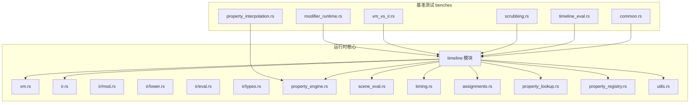
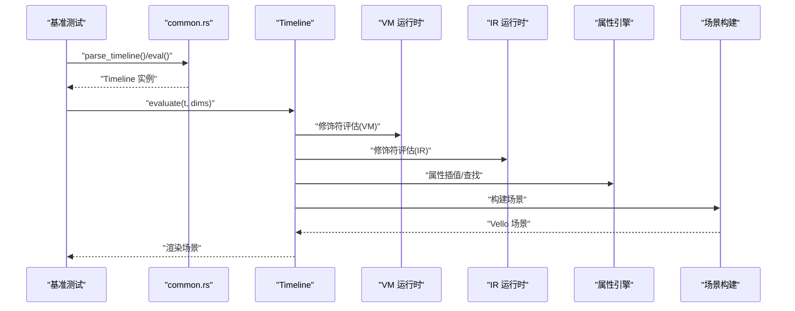
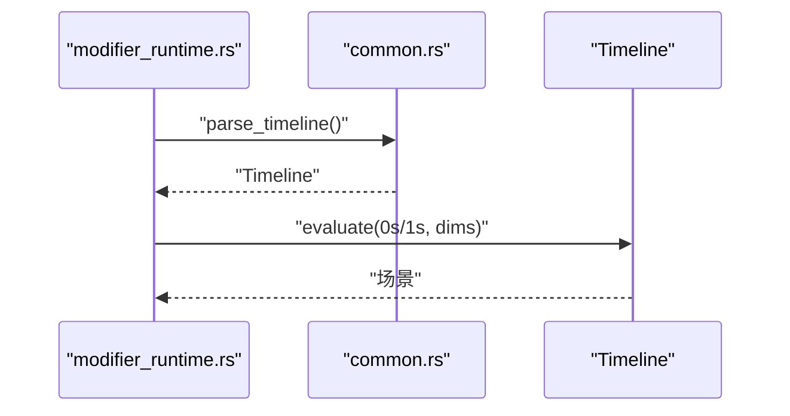
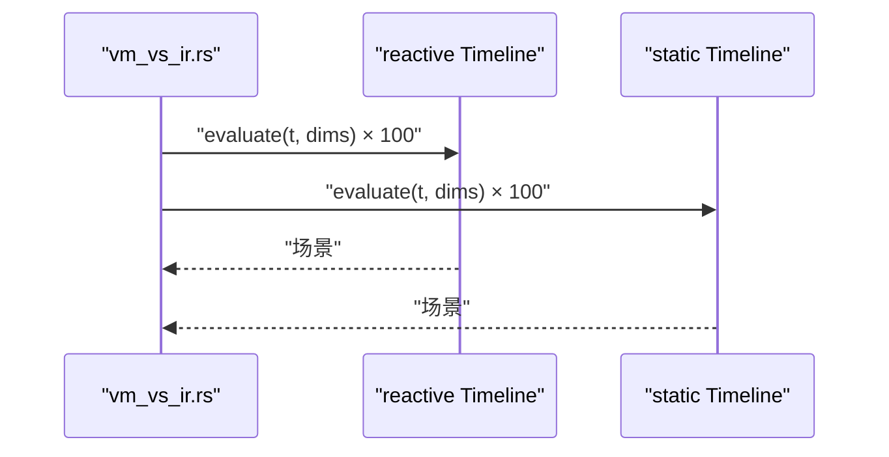
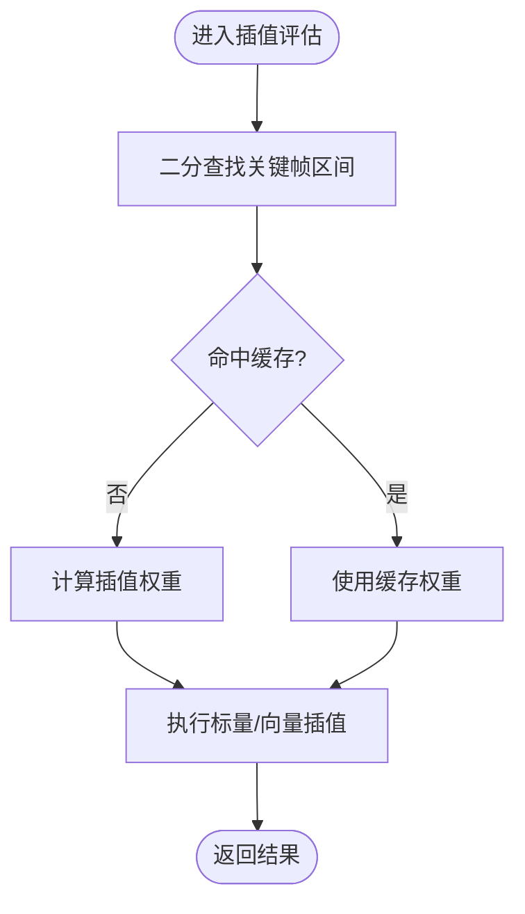
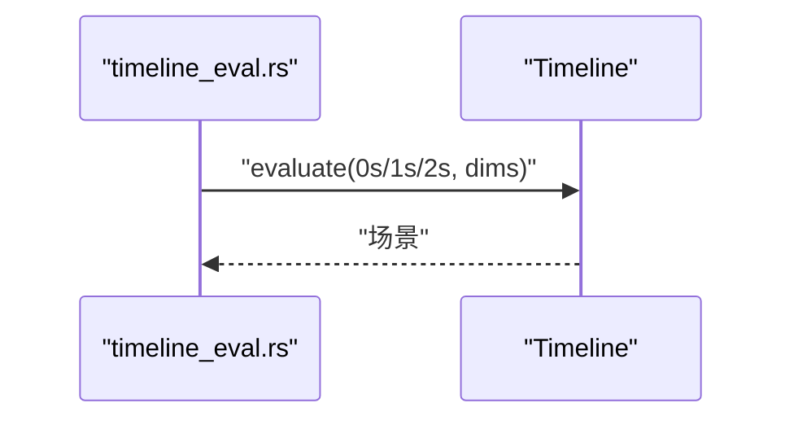
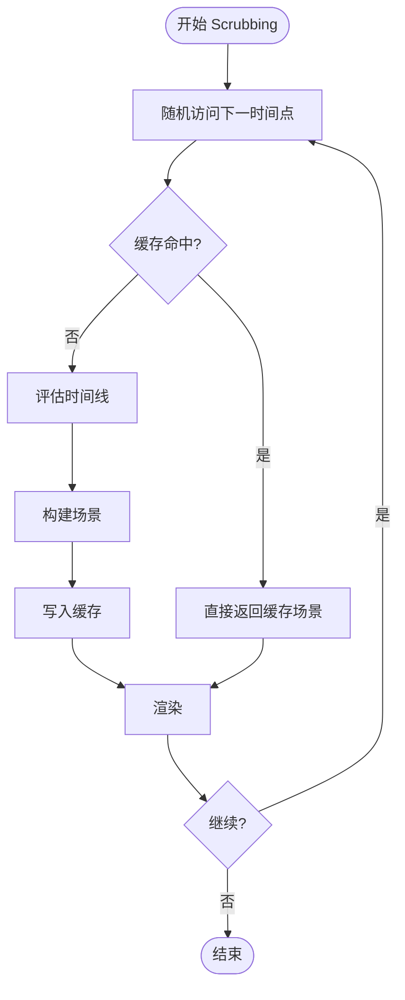
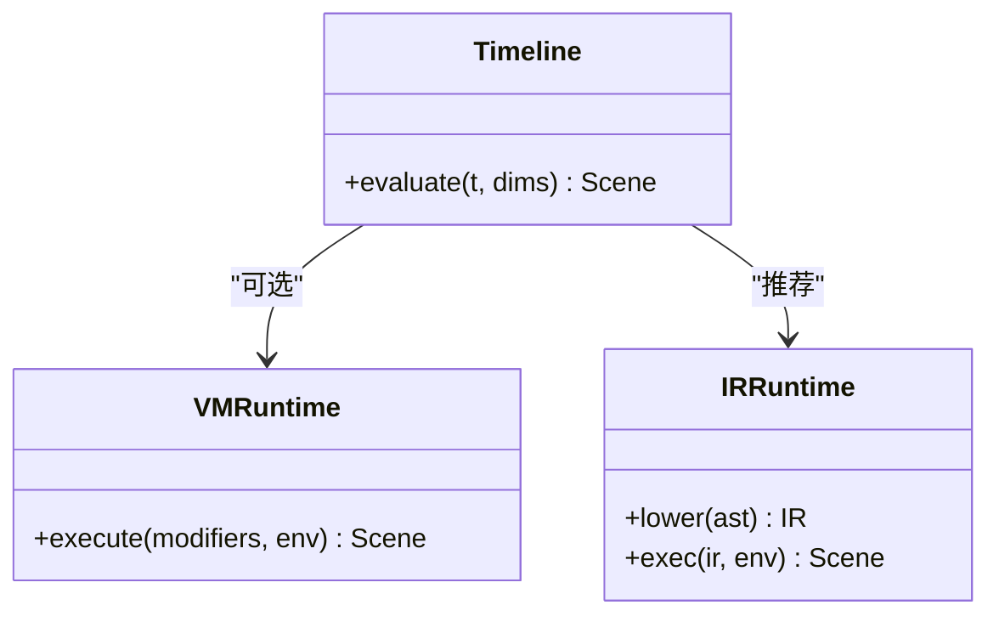
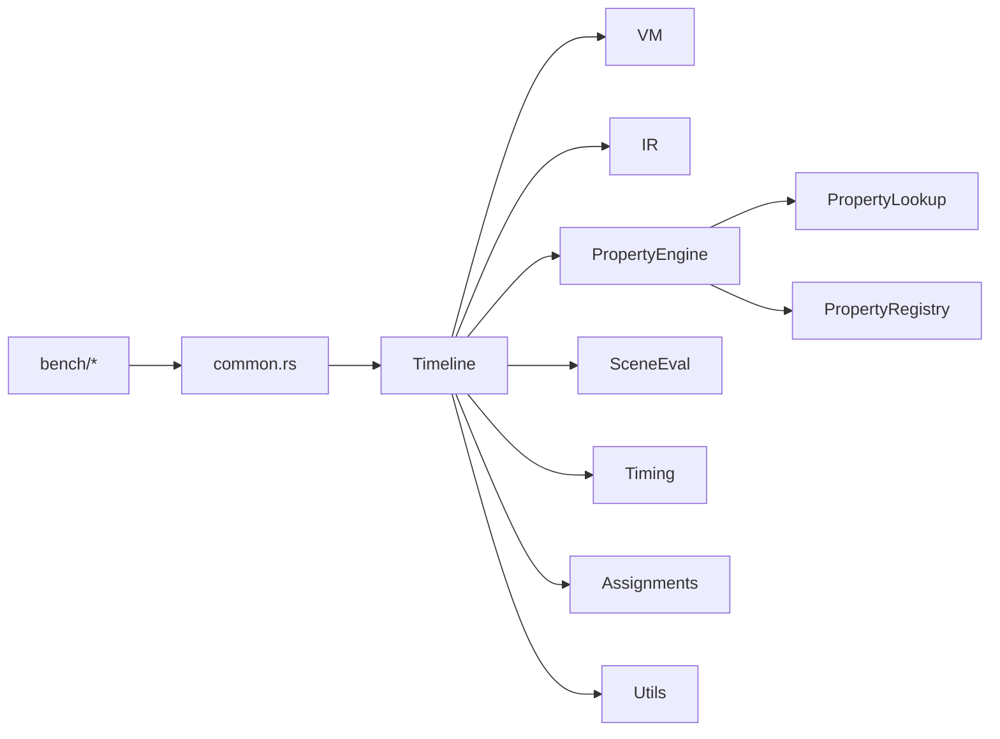

# CPU 性能优化

<cite>
**本文引用的文件**
- [crates/animatix/benches/modifier_runtime.rs](file://crates/animatix/benches/modifier_runtime.rs)
- [crates/animatix/benches/vm_vs_ir.rs](file://crates/animatix/benches/vm_vs_ir.rs)
- [crates/animatix/benches/property_interpolation.rs](file://crates/animatix/benches/property_interpolation.rs)
- [crates/animatix/benches/scrubbing.rs](file://crates/animatix/benches/scrubbing.rs)
- [crates/animatix/benches/timeline_eval.rs](file://crates/animatix/benches/timeline_eval.rs)
- [crates/animatix/benches/common.rs](file://crates/animatix/benches/common.rs)
- [crates/animatix/src/timeline/modifier_runtime/vm.rs](file://crates/animatix/src/timeline/modifier_runtime/vm.rs)
- [crates/animatix/src/vm.rs](file://crates/animatix/src/vm.rs)
- [crates/animatix/src/ir.rs](file://crates/animatix/src/ir.rs)
- [crates/animatix/src/timeline/modifier_runtime/ir/mod.rs](file://crates/animatix/src/timeline/modifier_runtime/ir/mod.rs)
- [crates/animatix/src/timeline/modifier_runtime/ir/lower.rs](file://crates/animatix/src/timeline/modifier_runtime/ir/lower.rs)
- [crates/animatix/src/timeline/modifier_runtime/ir/eval.rs](file://crates/animatix/src/timeline/modifier_runtime/ir/eval.rs)
- [crates/animatix/src/timeline/modifier_runtime/ir/types.rs](file://crates/animatix/src/timeline/modifier_runtime/ir/types.rs)
- [crates/animatix/src/timeline/property_engine.rs](file://crates/animatix/src/timeline/property_engine.rs)
- [crates/animatix/src/timeline/scene_eval.rs](file://crates/animatix/src/timeline/scene_eval.rs)
- [crates/animatix/src/timeline/timing.rs](file://crates/animatix/src/timeline/timing.rs)
- [crates/animatix/src/timeline/assignments.rs](file://crates/animatix/src/timeline/assignments.rs)
- [crates/animatix/src/timeline/property_lookup.rs](file://crates/animatix/src/timeline/property_lookup.rs)
- [crates/animatix/src/timeline/property_registry.rs](file://crates/animatix/src/timeline/property_registry.rs)
- [crates/animatix/src/timeline/utils.rs](file://crates/animatix/src/timeline/utils.rs)
- [crates/animatix/src/renderer/performance.rs](file://crates/animatix/src/renderer/performance.rs)
</cite>

## 目录
1. [简介](#简介)
2. [项目结构](#项目结构)
3. [核心组件](#核心组件)
4. [架构总览](#架构总览)
5. [详细组件分析](#详细组件分析)
6. [依赖关系分析](#依赖关系分析)
7. [性能考量](#性能考量)
8. [故障排查指南](#故障排查指南)
9. [结论](#结论)
10. [附录](#附录)

## 简介
本指南聚焦于 Animatix 的 CPU 性能优化实践，围绕以下主题展开：修饰符运行时性能基准测试、VM（虚拟机）与 IR（中间表示）执行效率对比、属性插值算法优化（含缓存与数值计算）、时间线评估过程中的 CPU 使用模式与批处理/并行化建议、Scrubbing（拖拽预览）帧率提升策略，以及 CPU 分析工具与热点定位方法。文档基于仓库内的基准测试与运行时实现，提供可操作的优化建议与可视化图示。

## 项目结构
Animatix 将性能基准测试集中在 benches 目录，运行时核心位于 crates/animatix/src 下，其中包含时间线求值、修饰符运行时（VM/IR）、属性系统、场景构建等模块。基准测试通过 Criterion 驱动，统一使用 common.rs 中的解析与评估封装。

**图表来源**
- [crates/animatix/benches/modifier_runtime.rs:1-44](file://crates/animatix/benches/modifier_runtime.rs#L1-L44)
- [crates/animatix/benches/vm_vs_ir.rs:1-66](file://crates/animatix/benches/vm_vs_ir.rs#L1-L66)
- [crates/animatix/benches/property_interpolation.rs:1-34](file://crates/animatix/benches/property_interpolation.rs#L1-L34)
- [crates/animatix/benches/scrubbing.rs:1-85](file://crates/animatix/benches/scrubbing.rs#L1-L85)
- [crates/animatix/benches/timeline_eval.rs:1-56](file://crates/animatix/benches/timeline_eval.rs#L1-L56)
- [crates/animatix/benches/common.rs:1-34](file://crates/animatix/benches/common.rs#L1-L34)
- [crates/animatix/src/timeline/modifier_runtime/vm.rs](file://crates/animatix/src/timeline/modifier_runtime/vm.rs)
- [crates/animatix/src/ir.rs](file://crates/animatix/src/ir.rs)
- [crates/animatix/src/timeline/modifier_runtime/ir/mod.rs](file://crates/animatix/src/timeline/modifier_runtime/ir/mod.rs)
- [crates/animatix/src/timeline/modifier_runtime/ir/lower.rs](file://crates/animatix/src/timeline/modifier_runtime/ir/lower.rs)
- [crates/animatix/src/timeline/modifier_runtime/ir/eval.rs](file://crates/animatix/src/timeline/modifier_runtime/ir/eval.rs)
- [crates/animatix/src/timeline/modifier_runtime/ir/types.rs](file://crates/animatix/src/timeline/modifier_runtime/ir/types.rs)
- [crates/animatix/src/timeline/property_engine.rs](file://crates/animatix/src/timeline/property_engine.rs)
- [crates/animatix/src/timeline/scene_eval.rs](file://crates/animatix/src/timeline/scene_eval.rs)
- [crates/animatix/src/timeline/timing.rs](file://crates/animatix/src/timeline/timing.rs)
- [crates/animatix/src/timeline/assignments.rs](file://crates/animatix/src/timeline/assignments.rs)
- [crates/animatix/src/timeline/property_lookup.rs](file://crates/animatix/src/timeline/property_lookup.rs)
- [crates/animatix/src/timeline/property_registry.rs](file://crates/animatix/src/timeline/property_registry.rs)
- [crates/animatix/src/timeline/utils.rs](file://crates/animatix/src/timeline/utils.rs)

**章节来源**
- [crates/animatix/benches/common.rs:1-34](file://crates/animatix/benches/common.rs#L1-L34)

## 核心组件
- 时间线求值与场景维度：Timeline.evaluate 接口负责在给定时间与场景尺寸下生成渲染场景；common.rs 提供默认 1080p 场景尺寸与便捷评估函数。
- 修饰符运行时：支持 VM 与 IR 两种执行路径，分别对应动态解释与静态 lowered IR 执行。
- 属性插值：PropertyTrack 支持关键帧与缓动，提供标量与向量插值接口；property_engine 负责属性查找与注册。
- 场景构建与布局：scene_eval 负责将时间线对象转换为最终场景；timing 提供时间轴与节拍管理；utils 提供通用辅助。
- 基准测试：各 bench 文件覆盖修饰符评估、VM/IR 对比、属性插值、随机访问 Scrubbing、时间线评估等场景。

**章节来源**
- [crates/animatix/benches/common.rs:9-34](file://crates/animatix/benches/common.rs#L9-L34)
- [crates/animatix/src/timeline/scene_eval.rs](file://crates/animatix/src/timeline/scene_eval.rs)
- [crates/animatix/src/timeline/property_engine.rs](file://crates/animatix/src/timeline/property_engine.rs)
- [crates/animatix/src/timeline/timing.rs](file://crates/animatix/src/timeline/timing.rs)
- [crates/animatix/src/timeline/utils.rs](file://crates/animatix/src/timeline/utils.rs)

## 架构总览
下图展示了从基准测试到运行时核心的关键调用链与模块交互。

**图表来源**
- [crates/animatix/benches/modifier_runtime.rs:25-40](file://crates/animatix/benches/modifier_runtime.rs#L25-L40)
- [crates/animatix/benches/vm_vs_ir.rs:40-62](file://crates/animatix/benches/vm_vs_ir.rs#L40-L62)
- [crates/animatix/benches/property_interpolation.rs:5-30](file://crates/animatix/benches/property_interpolation.rs#L5-L30)
- [crates/animatix/benches/common.rs:16-33](file://crates/animatix/benches/common.rs#L16-L33)
- [crates/animatix/src/timeline/modifier_runtime/vm.rs](file://crates/animatix/src/timeline/modifier_runtime/vm.rs)
- [crates/animatix/src/ir.rs](file://crates/animatix/src/ir.rs)
- [crates/animatix/src/timeline/property_engine.rs](file://crates/animatix/src/timeline/property_engine.rs)
- [crates/animatix/src/timeline/scene_eval.rs](file://crates/animatix/src/timeline/scene_eval.rs)

## 详细组件分析

### 修饰符运行时性能基准
- 测试目标：比较不同时间点（如 0s、1s）对同一时间线进行修饰符评估的耗时，验证评估路径的稳定性与可重复性。
- 关键流程：common.rs 解析源码为语句序列，Timeline::build 构建时间线，随后以固定场景尺寸调用 evaluate。
- 优化要点：避免在热路径中重复解析与构建；确保 evaluate 输入参数被正确黑箱化以防止外部优化干扰。

**图表来源**
- [crates/animatix/benches/modifier_runtime.rs:6-40](file://crates/animatix/benches/modifier_runtime.rs#L6-L40)
- [crates/animatix/benches/common.rs:16-26](file://crates/animatix/benches/common.rs#L16-L26)

**章节来源**
- [crates/animatix/benches/modifier_runtime.rs:1-44](file://crates/animatix/benches/modifier_runtime.rs#L1-L44)
- [crates/animatix/benches/common.rs:1-34](file://crates/animatix/benches/common.rs#L1-L34)

### VM 与 IR 执行效率对比
- 测试目标：在相同场景上对比“带反应式修饰符”与“静态场景”的 100 帧评估耗时，量化修饰符开销；同时展示 VM 与 IR 在相同逻辑下的相对性能差异。
- 关键流程：构建两个时间线（一个含 always 块，另一个不含），循环 100 次按 60fps 采样时间点进行评估。
- 优化要点：IR 通常具备更低的解释开销与更好的内联/常量传播机会；VM 更灵活但解释成本更高。建议在高频、稳定表达式上优先考虑 IR。

**图表来源**
- [crates/animatix/benches/vm_vs_ir.rs:40-62](file://crates/animatix/benches/vm_vs_ir.rs#L40-L62)

**章节来源**
- [crates/animatix/benches/vm_vs_ir.rs:1-66](file://crates/animatix/benches/vm_vs_ir.rs#L1-L66)

### 属性插值算法优化
- 测试目标：测量 PropertyTrack.evaluate、标量插值与向量插值的性能，识别插值热点。
- 优化策略：
  - 缓存机制：对最近使用的区间与权重进行缓存，避免重复二分查找与插值计算。
  - 数值优化：尽量使用 SIMD 友好的数据布局与内联小规模插值函数；减少临时对象分配。
  - 缓动函数：预计算或复用常用缓动曲线采样表，降低三角函数与幂运算开销。
- 数据结构与复杂度：关键帧列表按时间有序存储，查找采用二分法 O(log n)，插值为 O(1)。

**图表来源**
- [crates/animatix/benches/property_interpolation.rs:5-30](file://crates/animatix/benches/property_interpolation.rs#L5-L30)
- [crates/animatix/src/timeline/property_engine.rs](file://crates/animatix/src/timeline/property_engine.rs)

**章节来源**
- [crates/animatix/benches/property_interpolation.rs:1-34](file://crates/animatix/benches/property_interpolation.rs#L1-L34)
- [crates/animatix/src/timeline/property_engine.rs](file://crates/animatix/src/timeline/property_engine.rs)

### 时间线评估过程中的 CPU 使用模式
- 测试目标：评估在不同时间点（0s、1s、2s）的单次评估耗时，观察时间线状态变化对 CPU 的影响。
- 优化建议：
  - 批处理：将多个相邻时间点合并为批次，利用局部性减少重复计算（例如共享的修饰符状态与属性查找）。
  - 并行化：对独立 Actor 的评估进行并行，注意共享资源的并发安全与无锁化设计。
  - 预热：在首帧前完成必要的解析与构建，避免首帧抖动。

**图表来源**
- [crates/animatix/benches/timeline_eval.rs:30-52](file://crates/animatix/benches/timeline_eval.rs#L30-L52)

**章节来源**
- [crates/animatix/benches/timeline_eval.rs:1-56](file://crates/animatix/benches/timeline_eval.rs#L1-L56)

### Scrubbing 性能优化与实时预览帧率提升
- 测试目标：模拟随机访问 Scrubbing（不同时间点交替），评估文本场景、大量 Actor 场景与动态布局场景的性能差异。
- 优化策略：
  - 缓存最近帧：对最近 N 帧的结果进行缓存，利用时间局部性减少重复评估。
  - 自适应分辨率：在拖拽预览阶段降低渲染分辨率，结束后再恢复高质量输出。
  - 降采样与跳帧：在高负载时采用跳帧策略，保持交互流畅。
  - 事件驱动更新：仅在时间指针变化超过阈值时触发重算，减少无效工作。

**图表来源**
- [crates/animatix/benches/scrubbing.rs:48-81](file://crates/animatix/benches/scrubbing.rs#L48-L81)

**章节来源**
- [crates/animatix/benches/scrubbing.rs:1-85](file://crates/animatix/benches/scrubbing.rs#L1-L85)

### VM 与 IR 执行效率对比（代码级）
- VM 路径：动态解释修饰符指令，适合灵活表达式与调试，但解释成本较高。
- IR 路径：先将修饰符 lowering 为静态 IR，再执行，具备更佳的常量折叠与内联机会。
- 选择建议：对于高频、稳定且可预测的修饰符，优先 IR；对于实验性或动态分支较多的表达式，可保留 VM 作为备选。

**图表来源**
- [crates/animatix/src/timeline/modifier_runtime/vm.rs](file://crates/animatix/src/timeline/modifier_runtime/vm.rs)
- [crates/animatix/src/ir.rs](file://crates/animatix/src/ir.rs)
- [crates/animatix/src/timeline/modifier_runtime/ir/mod.rs](file://crates/animatix/src/timeline/modifier_runtime/ir/mod.rs)
- [crates/animatix/src/timeline/modifier_runtime/ir/lower.rs](file://crates/animatix/src/timeline/modifier_runtime/ir/lower.rs)
- [crates/animatix/src/timeline/modifier_runtime/ir/eval.rs](file://crates/animatix/src/timeline/modifier_runtime/ir/eval.rs)
- [crates/animatix/src/timeline/modifier_runtime/ir/types.rs](file://crates/animatix/src/timeline/modifier_runtime/ir/types.rs)

## 依赖关系分析
- 基准测试依赖 common.rs 统一解析与评估入口，减少样板代码变更带来的维护成本。
- Timeline 作为门面，协调 VM/IR、属性引擎与场景构建模块。
- 属性系统通过 property_lookup 与 property_registry 提供稳定的属性解析与注册服务。
- utils 提供通用工具，timing 提供时间管理，assignments 负责赋值语义，scene_eval 负责最终场景生成。

**图表来源**
- [crates/animatix/benches/common.rs:16-33](file://crates/animatix/benches/common.rs#L16-L33)
- [crates/animatix/src/timeline/modifier_runtime/vm.rs](file://crates/animatix/src/timeline/modifier_runtime/vm.rs)
- [crates/animatix/src/ir.rs](file://crates/animatix/src/ir.rs)
- [crates/animatix/src/timeline/property_engine.rs](file://crates/animatix/src/timeline/property_engine.rs)
- [crates/animatix/src/timeline/scene_eval.rs](file://crates/animatix/src/timeline/scene_eval.rs)
- [crates/animatix/src/timeline/property_lookup.rs](file://crates/animatix/src/timeline/property_lookup.rs)
- [crates/animatix/src/timeline/property_registry.rs](file://crates/animatix/src/timeline/property_registry.rs)
- [crates/animatix/src/timeline/timing.rs](file://crates/animatix/src/timeline/timing.rs)
- [crates/animatix/src/timeline/assignments.rs](file://crates/animatix/src/timeline/assignments.rs)
- [crates/animatix/src/timeline/utils.rs](file://crates/animatix/src/timeline/utils.rs)

**章节来源**
- [crates/animatix/benches/common.rs:1-34](file://crates/animatix/benches/common.rs#L1-L34)

## 性能考量
- 修饰符评估：优先使用 IR 路径，减少解释开销；对频繁修改的表达式进行缓存与去重。
- 属性插值：缓存最近区间与权重，避免重复二分查找；对向量插值采用批量处理与内联优化。
- Scrubbing：启用帧缓存与自适应分辨率；在拖拽期间跳过非必要渲染步骤。
- 批处理与并行：对独立 Actor 评估进行并行化，注意共享状态的并发控制；将相邻时间点批处理以提升缓存命中。
- 工具与方法：使用 Criterion 进行微基准测试，结合火焰图与 CPU 分析器定位热点；关注内存分配与锁竞争。

## 故障排查指南
- 评估抖动：检查是否在热路径中进行重复解析或构建；确认 evaluate 输入参数已正确黑箱化。
- 插值卡顿：核查属性缓存命中率，确认关键帧排序与二分查找逻辑；避免在插值路径中产生临时对象。
- Scrubbing 不流畅：确认缓存大小与替换策略；在高负载场景启用降采样与跳帧。
- 渲染性能：参考渲染器性能面板，识别 GPU/CPU 占用比例，针对性优化 CPU 热点。

**章节来源**
- [crates/animatix/src/renderer/performance.rs](file://crates/animatix/src/renderer/performance.rs)

## 结论
通过基准测试与运行时实现的协同分析，Animatix 在 CPU 性能方面具备明确的优化方向：优先 IR 执行、强化属性插值缓存、实施 Scrubbing 缓存与自适应策略，并结合批处理与并行化提升整体吞吐。配合合适的工具与方法，可有效定位与消除热点，获得稳定且高效的运行时表现。

## 附录
- 基准测试入口与参数说明可参考各 bench 文件与 common.rs 的封装。
- 运行时核心模块职责清晰，便于按需扩展与优化。