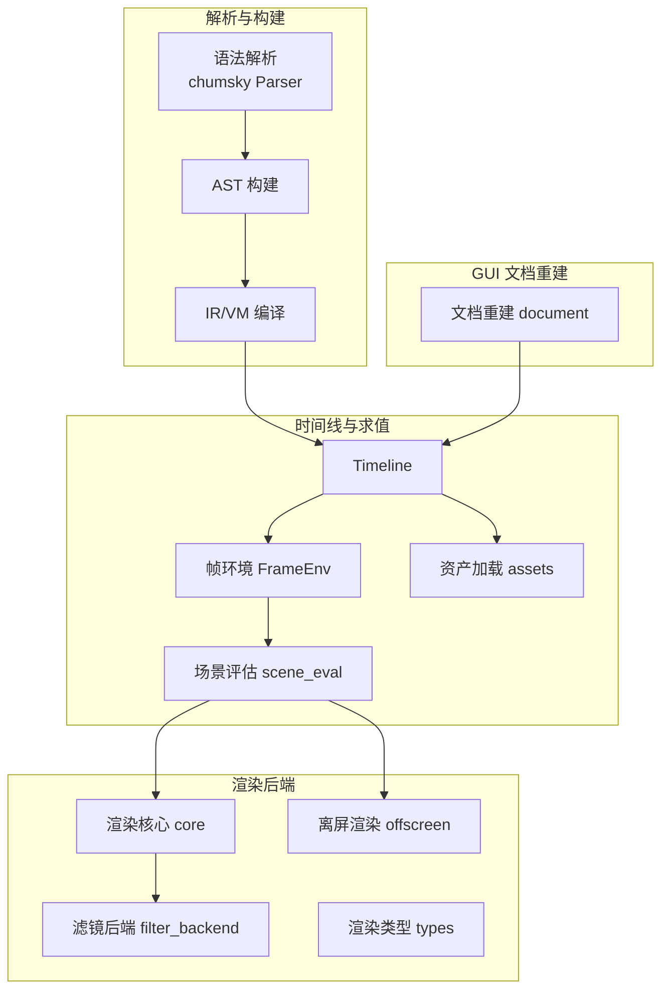
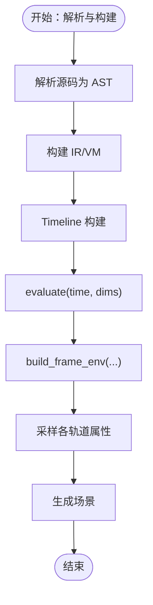
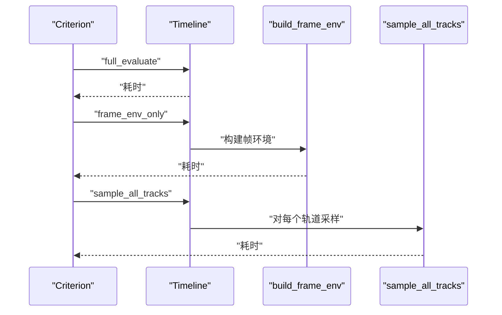
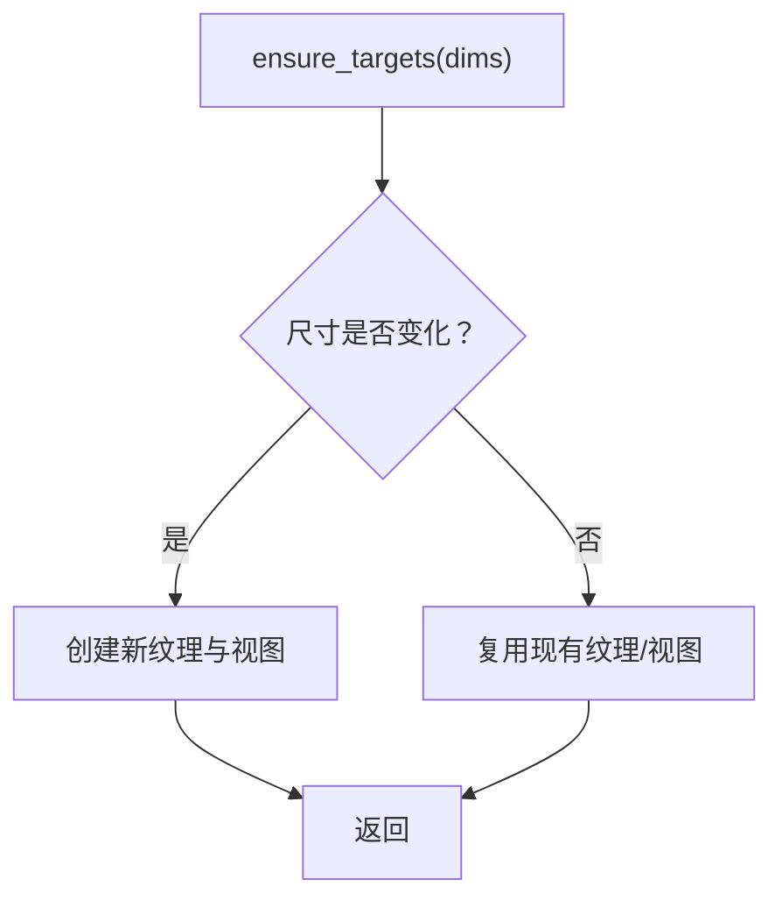
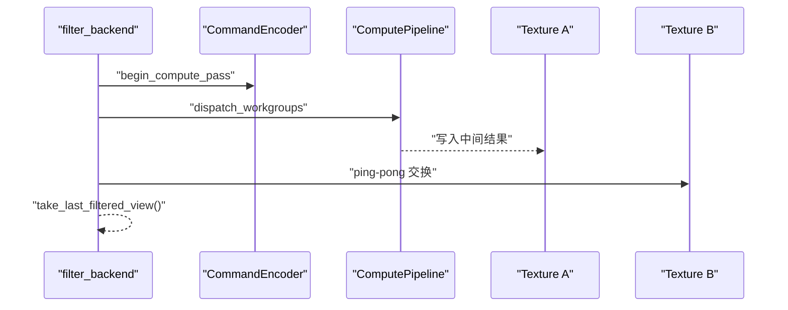
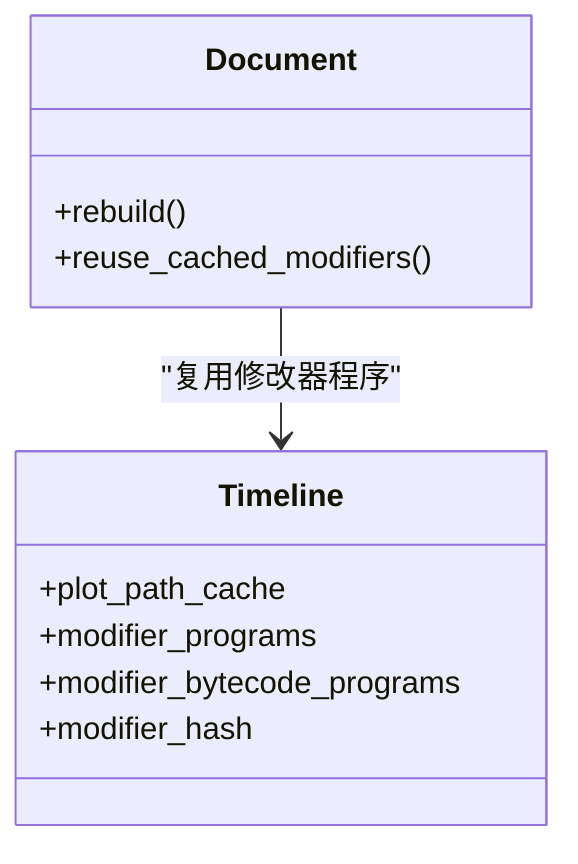
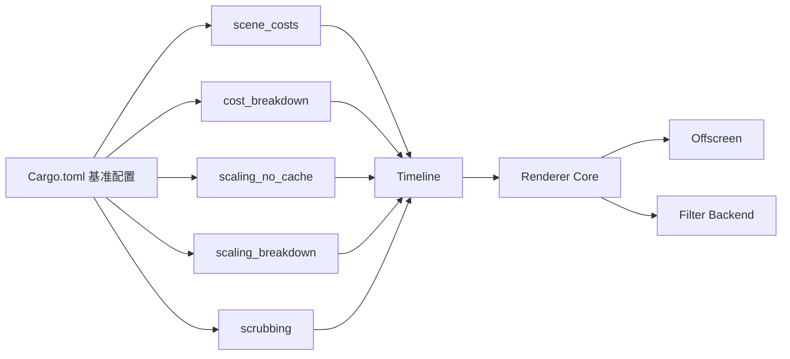

# 内存管理

<cite>
**本文引用的文件**
- [crates/animatix/src/lib.rs](file://crates/animatix/src/lib.rs)
- [crates/animatix/src/timeline/mod.rs](file://crates/animatix/src/timeline/mod.rs)
- [crates/animatix/src/timeline/scene_eval.rs](file://crates/animatix/src/timeline/scene_eval.rs)
- [crates/animatix/src/timeline/frame_env.rs](file://crates/animatix/src/timeline/frame_env.rs)
- [crates/animatix/src/timeline/assets.rs](file://crates/animatix/src/timeline/assets.rs)
- [crates/animatix/src/renderer/core.rs](file://crates/animatix/src/renderer/core.rs)
- [crates/animatix/src/renderer/offscreen.rs](file://crates/animatix/src/renderer/offscreen.rs)
- [crates/animatix/src/renderer/filter_backend.rs](file://crates/animatix/src/renderer/filter_backend.rs)
- [crates/animatix/src/renderer/types.rs](file://crates/animatix/src/renderer/types.rs)
- [crates/animatix/src/composition.rs](file://crates/animatix/src/composition.rs)
- [crates/animatix/benches/scene_costs.rs](file://crates/animatix/benches/scene_costs.rs)
- [crates/animatix/benches/cost_breakdown.rs](file://crates/animatix/benches/cost_breakdown.rs)
- [crates/animatix/benches/scaling_no_cache.rs](file://crates/animatix/benches/scaling_no_cache.rs)
- [crates/animatix/benches/scaling_breakdown.rs](file://crates/animatix/benches/scaling_breakdown.rs)
- [crates/animatix/benches/scrubbing.rs](file://crates/animatix/benches/scrubbing.rs)
- [crates/animatix/benches/common.rs](file://crates/animatix/benches/common.rs)
- [crates/animatix/Cargo.toml](file://crates/animatix/Cargo.toml)
- [tree-sitter-animatix/src/tree_sitter/alloc.h](file://tree-sitter-animatix/src/tree_sitter/alloc.h)
- [crates/animatix-gui/src/document.rs](file://crates/animatix-gui/src/document.rs)
</cite>

## 目录
1. [简介](#简介)
2. [项目结构](#项目结构)
3. [核心组件](#核心组件)
4. [架构总览](#架构总览)
5. [详细组件分析](#详细组件分析)
6. [依赖关系分析](#依赖关系分析)
7. [性能考量](#性能考量)
8. [故障排查指南](#故障排查指南)
9. [结论](#结论)
10. [附录](#附录)

## 简介
本指南聚焦于 Animatix 的内存使用模式与优化策略，围绕时间线构建与渲染路径中的内存分配与释放进行系统性剖析。文档基于仓库内的基准测试与渲染实现，总结场景成本基准测试结果，识别内存热点与优化机会；阐述资源池化与对象复用在几何、纹理与着色器方面的应用；给出内存泄漏检测与预防的最佳实践（生命周期与引用计数）；解释垃圾回收对性能的影响及通过数据结构设计降低 GC 压力的方法；并提供内存监控工具使用与性能调优建议。

## 项目结构
Animatix 的内存管理涉及多个层面：解析与构建阶段（语法树、AST、IR/VM）、时间线求值与帧环境准备、GPU 资源与离屏渲染、以及 GUI 文档重建时的缓存复用。下图展示与内存相关的关键模块及其交互：



图表来源
- [crates/animatix/src/lib.rs](file://crates/animatix/src/lib.rs)
- [crates/animatix/src/timeline/mod.rs](file://crates/animatix/src/timeline/mod.rs)
- [crates/animatix/src/timeline/scene_eval.rs](file://crates/animatix/src/timeline/scene_eval.rs)
- [crates/animatix/src/timeline/frame_env.rs](file://crates/animatix/src/timeline/frame_env.rs)
- [crates/animatix/src/timeline/assets.rs](file://crates/animatix/src/timeline/assets.rs)
- [crates/animatix/src/renderer/core.rs](file://crates/animatix/src/renderer/core.rs)
- [crates/animatix/src/renderer/offscreen.rs](file://crates/animatix/src/renderer/offscreen.rs)
- [crates/animatix/src/renderer/filter_backend.rs](file://crates/animatix/src/renderer/filter_backend.rs)
- [crates/animatix/src/renderer/types.rs](file://crates/animatix/src/renderer/types.rs)
- [crates/animatix-gui/src/document.rs](file://crates/animatix-gui/src/document.rs)

章节来源
- [crates/animatix/src/lib.rs](file://crates/animatix/src/lib.rs)
- [crates/animatix/src/timeline/mod.rs](file://crates/animatix/src/timeline/mod.rs)
- [crates/animatix/src/timeline/scene_eval.rs](file://crates/animatix/src/timeline/scene_eval.rs)
- [crates/animatix/src/timeline/frame_env.rs](file://crates/animatix/src/timeline/frame_env.rs)
- [crates/animatix/src/timeline/assets.rs](file://crates/animatix/src/timeline/assets.rs)
- [crates/animatix/src/renderer/core.rs](file://crates/animatix/src/renderer/core.rs)
- [crates/animatix/src/renderer/offscreen.rs](file://crates/animatix/src/renderer/offscreen.rs)
- [crates/animatix/src/renderer/filter_backend.rs](file://crates/animatix/src/renderer/filter_backend.rs)
- [crates/animatix/src/renderer/types.rs](file://crates/animatix/src/renderer/types.rs)
- [crates/animatix-gui/src/document.rs](file://crates/animatix-gui/src/document.rs)

## 核心组件
- 时间线与帧环境：负责在给定时间点采样属性、构建帧环境，是内存分配的主要入口之一。
- 场景评估：将帧环境转换为可渲染场景，涉及中间缓冲与拷贝。
- 渲染核心与离屏渲染：管理 GPU 纹理、视图与命令编码，承担大内存块的分配与释放。
- 滤镜后端：执行计算着色器与 ping-pong 纹理交换，产生临时中间资源。
- 资产加载：统一管理几何、纹理与着色器资源，支持缓存与复用。
- GUI 文档重建：在不改变修改器 AST 的情况下复用编译产物，避免重复分配。

章节来源
- [crates/animatix/src/timeline/mod.rs](file://crates/animatix/src/timeline/mod.rs)
- [crates/animatix/src/timeline/scene_eval.rs](file://crates/animatix/src/timeline/scene_eval.rs)
- [crates/animatix/src/timeline/frame_env.rs](file://crates/animatix/src/timeline/frame_env.rs)
- [crates/animatix/src/timeline/assets.rs](file://crates/animatix/src/timeline/assets.rs)
- [crates/animatix/src/renderer/core.rs](file://crates/animatix/src/renderer/core.rs)
- [crates/animatix/src/renderer/offscreen.rs](file://crates/animatix/src/renderer/offscreen.rs)
- [crates/animatix/src/renderer/filter_backend.rs](file://crates/animatix/src/renderer/filter_backend.rs)
- [crates/animatix-gui/src/document.rs](file://crates/animatix-gui/src/document.rs)

## 架构总览
下图展示从时间线到渲染的内存流经路径，标注了潜在的高内存占用环节与优化点：

```mermaid
sequenceDiagram
participant Bench as "基准测试"
participant TL as "Timeline"
participant FE as "帧环境 FrameEnv"
participant SE as "场景评估 scene_eval"
participant RC as "渲染核心 core"
participant OFF as "离屏渲染 offscreen"
participant FB as "滤镜后端 filter_backend"
Bench->>TL : "evaluate(time, dims)"
TL->>FE : "build_frame_env(...)"
FE-->>TL : "FrameEnv"
TL->>SE : "生成场景"
SE->>RC : "提交绘制"
RC->>OFF : "ensure_targets(...)<br/>分配中间纹理"
OFF-->>RC : "输出帧 RGBA 缓冲"
RC->>FB : "滤镜管线计算+ping-pong"
FB-->>RC : "最终纹理视图"
RC-->>Bench : "完成帧"
```

图表来源
- [crates/animatix/benches/scene_costs.rs](file://crates/animatix/benches/scene_costs.rs)
- [crates/animatix/benches/cost_breakdown.rs](file://crates/animatix/benches/cost_breakdown.rs)
- [crates/animatix/src/timeline/frame_env.rs](file://crates/animatix/src/timeline/frame_env.rs)
- [crates/animatix/src/timeline/scene_eval.rs](file://crates/animatix/src/timeline/scene_eval.rs)
- [crates/animatix/src/renderer/offscreen.rs](file://crates/animatix/src/renderer/offscreen.rs)
- [crates/animatix/src/renderer/filter_backend.rs](file://crates/animatix/src/renderer/filter_backend.rs)

## 详细组件分析

### 时间线构建与内存分配
- 解析与构建：基准测试中，解析与构建阶段的开销主要体现在字符串拼接与 AST 构造，属于 CPU 端短期分配。
- 帧环境准备：按帧采样属性（尺寸、位置、颜色、透明度、旋转等），在无缓存场景下会重复分配中间结构。
- 评估路径：将帧环境转换为场景，期间可能触发几何与路径缓存的分配。



图表来源
- [crates/animatix/benches/common.rs](file://crates/animatix/benches/common.rs)
- [crates/animatix/benches/cost_breakdown.rs](file://crates/animatix/benches/cost_breakdown.rs)
- [crates/animatix/src/timeline/frame_env.rs](file://crates/animatix/src/timeline/frame_env.rs)
- [crates/animatix/src/timeline/scene_eval.rs](file://crates/animatix/src/timeline/scene_eval.rs)

章节来源
- [crates/animatix/benches/common.rs](file://crates/animatix/benches/common.rs)
- [crates/animatix/benches/cost_breakdown.rs](file://crates/animatix/benches/cost_breakdown.rs)
- [crates/animatix/src/timeline/frame_env.rs](file://crates/animatix/src/timeline/frame_env.rs)
- [crates/animatix/src/timeline/scene_eval.rs](file://crates/animatix/src/timeline/scene_eval.rs)

### 场景成本基准测试与内存热点
- 多演员场景：通过增加演员数量，观察完整评估、仅帧环境、采样所有轨道三段的耗时与内存压力差异。
- 无缓存评估：通过调试选项禁用帧缓存，确保每次评估都进行完整路径，便于测量真实内存分配。
- 抖动（随机访问）：模拟播放器随机访问不同时间点，验证缓存命中对内存与性能的影响。



图表来源
- [crates/animatix/benches/scene_costs.rs](file://crates/animatix/benches/scene_costs.rs)
- [crates/animatix/benches/cost_breakdown.rs](file://crates/animatix/benches/cost_breakdown.rs)

章节来源
- [crates/animatix/benches/scene_costs.rs](file://crates/animatix/benches/scene_costs.rs)
- [crates/animatix/benches/cost_breakdown.rs](file://crates/animatix/benches/cost_breakdown.rs)
- [crates/animatix/benches/scrubbing.rs](file://crates/animatix/benches/scrubbing.rs)

### 离屏渲染与纹理资源管理
- 目标纹理与视图：根据场景尺寸动态创建 Rgba8Unorm 纹理作为中间目标，避免不必要的格式切换。
- 映射与拷贝：将 GPU 输出映射到 CPU 可读缓冲，逐行复制到 RGBA 结果，注意在拷贝后及时解除映射与取消映射。
- 资源复用：当尺寸未变时跳过重建，减少频繁分配与释放。



图表来源
- [crates/animatix/src/renderer/offscreen.rs](file://crates/animatix/src/renderer/offscreen.rs)

章节来源
- [crates/animatix/src/renderer/offscreen.rs](file://crates/animatix/src/renderer/offscreen.rs)

### 滤镜后端与 ping-pong 纹理
- 计算管线：通过计算着色器对纹理进行滤镜处理，采用双缓冲 ping-pong 以避免写读冲突。
- 读回与持有：将最终结果纹理视图保存以便后续合成；提供 take 接口取出并清空内部槽位，防止悬挂引用。
- 中间缓冲：使用一次性输出缓冲进行像素读回，完成后立即提交并清理。



图表来源
- [crates/animatix/src/renderer/filter_backend.rs](file://crates/animatix/src/renderer/filter_backend.rs)

章节来源
- [crates/animatix/src/renderer/filter_backend.rs](file://crates/animatix/src/renderer/filter_backend.rs)

### 资源池化与对象复用
- 几何与路径：通过路径缓存与 IR/VM 程序缓存减少重复构建。
- 着色器与绑定组：在渲染核心中复用管线与绑定组布局，避免频繁创建销毁。
- 修改器程序复用：GUI 文档重建时，若修改器 AST 哈希未变，则复用已编译的 IR 与字节码程序。



图表来源
- [crates/animatix/src/timeline/assets.rs](file://crates/animatix/src/timeline/assets.rs)
- [crates/animatix-gui/src/document.rs](file://crates/animatix-gui/src/document.rs)

章节来源
- [crates/animatix/src/timeline/assets.rs](file://crates/animatix/src/timeline/assets.rs)
- [crates/animatix-gui/src/document.rs](file://crates/animatix-gui/src/document.rs)

### 语法解析层的内存接口
- Tree-sitter 分配器钩子：允许客户端覆盖分配函数，便于集成自定义分配器或统计内存使用。
- 默认实现：在未启用覆盖宏时，直接使用标准库分配器。

章节来源
- [tree-sitter-animatix/src/tree_sitter/alloc.h](file://tree-sitter-animatix/src/tree_sitter/alloc.h)

## 依赖关系分析
- 基准测试配置：通过 Cargo bench 配置启用多个基准，涵盖构建时间、属性插值、修改器运行时、缩放与可见性剔除等。
- 关键依赖：时间线评估依赖渲染后端；渲染后端依赖 GPU 设备与队列；GUI 文档重建依赖时间线缓存。



图表来源
- [crates/animatix/Cargo.toml](file://crates/animatix/Cargo.toml)
- [crates/animatix/benches/scene_costs.rs](file://crates/animatix/benches/scene_costs.rs)
- [crates/animatix/benches/cost_breakdown.rs](file://crates/animatix/benches/cost_breakdown.rs)
- [crates/animatix/benches/scaling_no_cache.rs](file://crates/animatix/benches/scaling_no_cache.rs)
- [crates/animatix/benches/scaling_breakdown.rs](file://crates/animatix/benches/scaling_breakdown.rs)
- [crates/animatix/benches/scrubbing.rs](file://crates/animatix/benches/scrubbing.rs)

章节来源
- [crates/animatix/Cargo.toml](file://crates/animatix/Cargo.toml)
- [crates/animatix/benches/scene_costs.rs](file://crates/animatix/benches/scene_costs.rs)
- [crates/animatix/benches/cost_breakdown.rs](file://crates/animatix/benches/cost_breakdown.rs)
- [crates/animatix/benches/scaling_no_cache.rs](file://crates/animatix/benches/scaling_no_cache.rs)
- [crates/animatix/benches/scaling_breakdown.rs](file://crates/animatix/benches/scaling_breakdown.rs)
- [crates/animatix/benches/scrubbing.rs](file://crates/animatix/benches/scrubbing.rs)

## 性能考量
- 降低帧间分配
  - 使用帧缓存：基准测试显示“无缓存”场景显著增加分配与拷贝成本；优先启用默认缓存。
  - 复用帧环境：在连续帧之间复用帧环境，避免重复采样与构造。
- 控制 GPU 内存峰值
  - 目标纹理尺寸稳定时复用；尺寸变化再重建。
  - ping-pong 纹理只保留必要数量，避免同时持有过多中间视图。
- 减少 CPU/GPU 数据传输
  - 尽量在 GPU 内部完成处理；读回仅在必要时进行。
  - 批量拷贝时注意行对齐与一次性映射/取消映射。
- 降低 GC 压力
  - 避免在热路径上频繁创建短生命周期集合；优先复用容器。
  - 在解析与构建阶段尽量使用就地更新而非深拷贝。
- 修改器程序缓存
  - 保持修改器 AST 哈希稳定，最大化 IR/字节码复用率。

## 故障排查指南
- 内存泄漏检测
  - 使用工具：如 Valgrind、Dr. Memory 或 Rust 的 LeakSanitizer（需要相应配置）。
  - 关注点：确保每次映射的缓冲都被正确取消映射；确保纹理视图在 take 后不再被引用。
- 生命周期管理
  - 离屏渲染：在完成拷贝后立即 drop 映射范围与取消映射。
  - 滤镜后端：take 最终视图后清空内部槽位，避免悬挂引用。
- 引用计数策略
  - 对共享资源（几何、纹理、着色器）采用强/弱引用分离，避免循环引用。
  - 在 GUI 文档重建时，仅在 AST 未变更时复用编译产物，否则释放旧资源。
- 垃圾回收影响
  - 热路径避免临时集合增长；优先使用固定容量的 Vec 或重用缓冲。
  - 将昂贵的字符串拼接移出循环或合并为一次性分配。

章节来源
- [crates/animatix/src/renderer/offscreen.rs](file://crates/animatix/src/renderer/offscreen.rs)
- [crates/animatix/src/renderer/filter_backend.rs](file://crates/animatix/src/renderer/filter_backend.rs)
- [crates/animatix-gui/src/document.rs](file://crates/animatix-gui/src/document.rs)

## 结论
Animatix 的内存管理重点在于：在时间线求值与渲染路径中控制分配与拷贝，通过帧缓存与资源复用降低峰值内存；在 GPU 管线中合理管理中间纹理与视图；在解析与构建阶段减少不必要的深拷贝与字符串操作。结合基准测试结果与实际实现，可以有针对性地优化多演员场景、滤镜管线与随机访问播放等典型工作负载。

## 附录
- 基准测试运行
  - 使用 cargo bench 运行各基准，生成 HTML 报告以对比不同场景下的性能与内存行为。
- 监控工具
  - GPU 内存：使用 GPU 驱动自带工具或 RenderDoc/Vulkan Tools 观察纹理与缓冲分配。
  - CPU 内存：结合系统监控与工具定位分配热点。