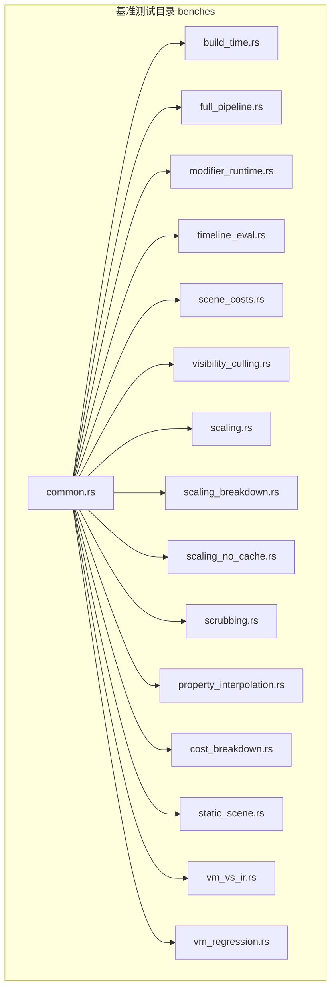
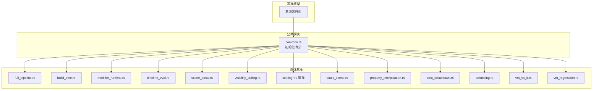
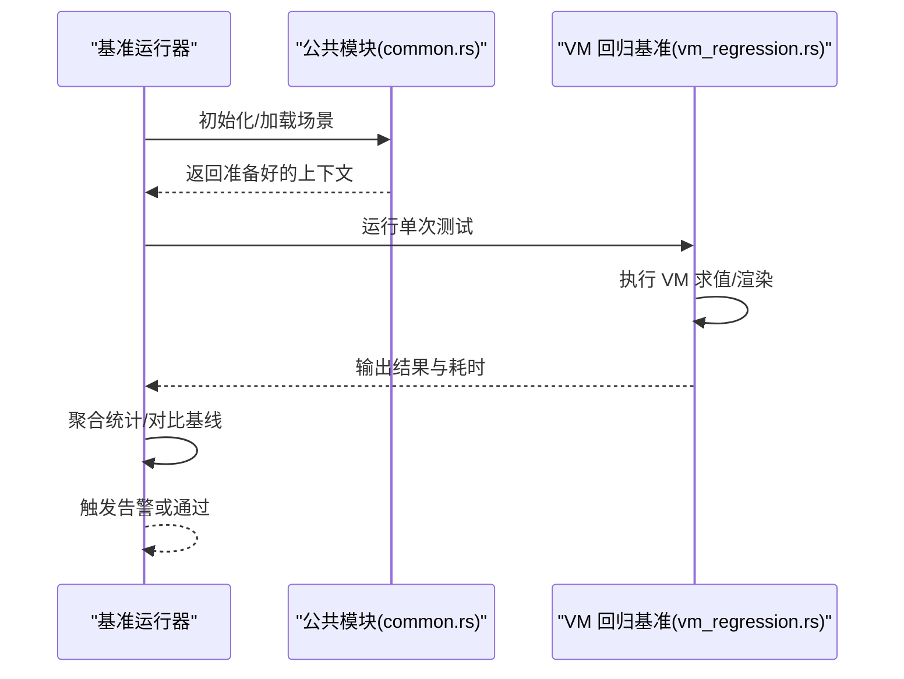
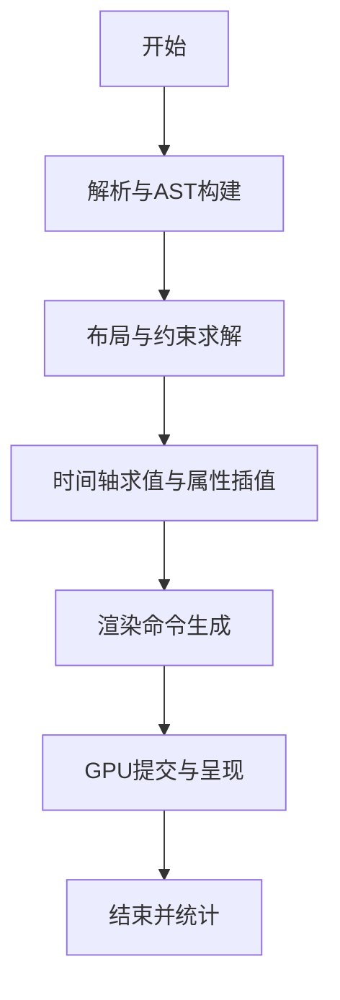
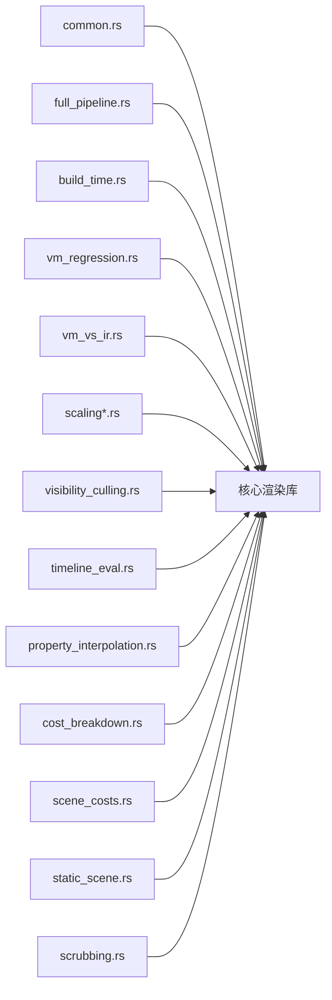

# 基准测试分析

<cite>
**本文引用的文件**
- [vm_regression.rs](file://crates/animatix/benches/vm_regression.rs)
- [full_pipeline.rs](file://crates/animatix/benches/full_pipeline.rs)
- [common.rs](file://crates/animatix/benches/common.rs)
- [build_time.rs](file://crates/animatix/benches/build_time.rs)
- [modifier_runtime.rs](file://crates/animatix/benches/modifier_runtime.rs)
- [timeline_eval.rs](file://crates/animatix/benches/timeline_eval.rs)
- [scene_costs.rs](file://crates/animatix/benches/scene_costs.rs)
- [visibility_culling.rs](file://crates/animatix/benches/visibility_culling.rs)
- [scaling.rs](file://crates/animatix/benches/scaling.rs)
- [scaling_breakdown.rs](file://crates/animatix/benches/scaling_breakdown.rs)
- [scaling_no_cache.rs](file://crates/animatix/benches/scaling_no_cache.rs)
- [scrubbing.rs](file://crates/animatix/benches/scrubbing.rs)
- [property_interpolation.rs](file://crates/animatix/benches/property_interpolation.rs)
- [cost_breakdown.rs](file://crates/animatix/benches/cost_breakdown.rs)
- [static_scene.rs](file://crates/animatix/benches/static_scene.rs)
- [vm_vs_ir.rs](file://crates/animatix/benches/vm_vs_ir.rs)
- [Cargo.toml](file://crates/animatix/Cargo.toml)
- [Readme.md](file://Readme.md)
</cite>

## 目录
1. [引言](#引言)
2. [项目结构](#项目结构)
3. [核心组件](#核心组件)
4. [架构总览](#架构总览)
5. [详细组件分析](#详细组件分析)
6. [依赖分析](#依赖分析)
7. [性能考量](#性能考量)
8. [故障排查指南](#故障排查指南)
9. [结论](#结论)
10. [附录](#附录)

## 引言
本指南聚焦于 Animatix 的性能基准测试体系，系统阐述其设计原理、测试方法与实施流程，并给出结果解读、回归检测与预警机制建议。Animatix 的基准测试覆盖从构建时延、运行时管线到虚拟机（VM）与中间表示（IR）对比、缩放与可见性等关键场景，旨在为性能优化与质量保障提供可重复、可量化的依据。

## 项目结构
Animatix 将基准测试集中放置在主 crate 的 benches 目录中，采用按功能域划分的文件组织方式：构建时延、全流水线、修改器运行时、时间轴求值、场景成本、可见性剔除、缩放与缓存影响、擦进度播放、属性插值、成本拆解、静态场景、VM 与 IR 对比以及 VM 回归测试等。公共辅助逻辑集中在 common.rs 中，便于各基准共享初始化、数据准备与统计收集。

图表来源
- [common.rs](file://crates/animatix/benches/common.rs)
- [build_time.rs](file://crates/animatix/benches/build_time.rs)
- [full_pipeline.rs](file://crates/animatix/benches/full_pipeline.rs)
- [vm_regression.rs](file://crates/animatix/benches/vm_regression.rs)
- [vm_vs_ir.rs](file://crates/animatix/benches/vm_vs_ir.rs)

章节来源
- [Cargo.toml](file://crates/animatix/Cargo.toml)
- [Readme.md](file://Readme.md)

## 核心组件
- 公共基础设施（common.rs）
  - 提供基准测试通用的初始化、场景构造、计时与统计聚合能力，确保各基准的一致性与可复用性。
- 构建时延（build_time.rs）
  - 针对编译与构建阶段的耗时测量，评估源码到可执行或中间产物的转换效率。
- 全流水线（full_pipeline.rs）
  - 端到端渲染管线的完整路径测试，涵盖解析、构建、布局、求值、渲染等环节，用于衡量整体性能。
- 修改器运行时（modifier_runtime.rs）
  - 聚焦修改器执行阶段的性能，评估复杂修饰链路的开销与稳定性。
- 时间轴求值（timeline_eval.rs）
  - 测试时间轴表达式与关键帧插值的计算成本，关注高帧率下的抖动与延迟。
- 场景成本（scene_costs.rs）
  - 统计场景元素数量、图元复杂度与资源占用，识别高成本场景的瓶颈来源。
- 可见性剔除（visibility_culling.rs）
  - 验证视锥剔除与遮挡剔除策略的有效性，评估剔除覆盖率与剔除收益。
- 缩放与缓存（scaling.rs、scaling_breakdown.rs、scaling_no_cache.rs）
  - 分析渲染分辨率与缩放策略对性能的影响；拆解缓存命中与未命中场景的成本差异。
- 擦进度播放（scrubbing.rs）
  - 模拟用户拖拽预览过程中的帧间切换，评估随机访问与重算的代价。
- 属性插值（property_interpolation.rs）
  - 测试属性在关键帧之间的插值计算，关注插值算法与采样频率对性能的影响。
- 成本拆解（cost_breakdown.rs）
  - 将全流水线成本细分为解析、布局、求值、绘制等子阶段，定位性能热点。
- 静态场景（static_scene.rs）
  - 在无动态变化的场景下评估基线性能，作为回归对比的参照。
- VM 与 IR 对比（vm_vs_ir.rs）
  - 对比 VM 执行与 IR 直译/求值的性能差异，评估虚拟化层的开销与收益。
- VM 回归测试（vm_regression.rs）
  - 以固定输入与期望输出为基准，持续监控 VM 行为与性能的回归风险。

章节来源
- [common.rs](file://crates/animatix/benches/common.rs)
- [build_time.rs](file://crates/animatix/benches/build_time.rs)
- [full_pipeline.rs](file://crates/animatix/benches/full_pipeline.rs)
- [vm_regression.rs](file://crates/animatix/benches/vm_regression.rs)
- [vm_vs_ir.rs](file://crates/animatix/benches/vm_vs_ir.rs)

## 架构总览
下图展示了基准测试的整体架构：各具体基准通过公共模块进行初始化与统计，最终由基准框架统一收集与报告；全流水线基准贯穿解析、布局、求值与渲染阶段，是性能评估的核心通路。

图表来源
- [common.rs](file://crates/animatix/benches/common.rs)
- [full_pipeline.rs](file://crates/animatix/benches/full_pipeline.rs)
- [build_time.rs](file://crates/animatix/benches/build_time.rs)
- [vm_regression.rs](file://crates/animatix/benches/vm_regression.rs)
- [vm_vs_ir.rs](file://crates/animatix/benches/vm_vs_ir.rs)

## 详细组件分析

### VM 回归测试（vm_regression.rs）
- 设计目标
  - 使用确定性输入与已知输出，持续监控 VM 执行的稳定性与性能回归，防止行为漂移与性能退化。
- 关键实现要点
  - 输入场景与关键帧序列固定，避免随机性引入噪声。
  - 输出验证采用严格匹配（如像素级或数值阈值），同时记录执行耗时。
  - 多轮运行统计均值与方差，过滤异常波动。
- 结果解读
  - 若耗时显著上升或输出不一致，则触发回归告警。
  - 结合历史基线，设定阈值与趋势检测规则。

图表来源
- [vm_regression.rs](file://crates/animatix/benches/vm_regression.rs)
- [common.rs](file://crates/animatix/benches/common.rs)

章节来源
- [vm_regression.rs](file://crates/animatix/benches/vm_regression.rs)
- [common.rs](file://crates/animatix/benches/common.rs)

### 全流水线测试（full_pipeline.rs）
- 设计目标
  - 端到端评估从解析到渲染的完整路径，识别跨阶段的性能瓶颈。
- 关键实现要点
  - 场景构造遵循典型工作负载（含复杂布局、大量图元、多修改器）。
  - 计时粒度覆盖解析、布局、求值、绘制等阶段，必要时启用多次迭代以平滑抖动。
- 指标定义
  - 平均帧时（ms/frame）、P95/P99 帧时、丢帧率、内存峰值、GPU 利用率（若可用）。
- 结果解读
  - 帧时分布偏斜或尾部延迟过高提示渲染压力或 CPU/GPU 同步阻塞。
  - 内存峰值异常升高可能源于缓存膨胀或资源泄漏。

图表来源
- [full_pipeline.rs](file://crates/animatix/benches/full_pipeline.rs)

章节来源
- [full_pipeline.rs](file://crates/animatix/benches/full_pipeline.rs)

### VM 与 IR 对比（vm_vs_ir.rs）
- 设计目标
  - 对比 VM 执行与 IR 直译/求值的性能差异，评估虚拟化层的开销与收益。
- 关键实现要点
  - 相同输入场景分别走 VM 路径与 IR 路径，保持其他条件一致。
  - 输出一致性校验，仅比较执行耗时。
- 结果解读
  - 若 VM 显著慢于 IR，需审视字节码/指令调度与解释开销；若接近 IR，则说明虚拟化层高效。

章节来源
- [vm_vs_ir.rs](file://crates/animatix/benches/vm_vs_ir.rs)

### 缩放与缓存影响（scaling.rs、scaling_breakdown.rs、scaling_no_cache.rs）
- 设计目标
  - 评估不同分辨率与缩放策略对性能的影响；拆分缓存命中与未命中的成本差异。
- 关键实现要点
  - 改变渲染分辨率与缩放因子，固定场景复杂度，观察帧时与内存变化。
  - 通过禁用缓存与启用缓存对比，量化缓存收益。
- 结果解读
  - 高分辨率导致帧时显著上升，需结合目标设备能力权衡画质与流畅度。
  - 缓存命中率低时应优化脏区域管理与缓存策略。

章节来源
- [scaling.rs](file://crates/animatix/benches/scaling.rs)
- [scaling_breakdown.rs](file://crates/animatix/benches/scaling_breakdown.rs)
- [scaling_no_cache.rs](file://crates/animatix/benches/scaling_no_cache.rs)

### 可见性剔除（visibility_culling.rs）
- 设计目标
  - 验证剔除策略有效性，评估剔除覆盖率与收益。
- 关键实现要点
  - 构造包含大量不可见对象的场景，统计剔除比例与剔除后帧时变化。
- 结果解读
  - 剔除比例高且帧时下降表明剔除策略有效；若无明显收益，需检查剔除算法或剔除边界设置。

章节来源
- [visibility_culling.rs](file://crates/animatix/benches/visibility_culling.rs)

### 时间轴求值与属性插值（timeline_eval.rs、property_interpolation.rs）
- 设计目标
  - 评估时间轴表达式与属性插值在高帧率下的成本。
- 关键实现要点
  - 高频随机访问（擦进度）与连续插值场景并重，关注抖动与尾延迟。
- 结果解读
  - 插值算法复杂度与采样频率成正比，需在视觉质量与性能间折衷。

章节来源
- [timeline_eval.rs](file://crates/animatix/benches/timeline_eval.rs)
- [property_interpolation.rs](file://crates/animatix/benches/property_interpolation.rs)

### 场景成本与成本拆解（scene_costs.rs、cost_breakdown.rs）
- 设计目标
  - 量化场景元素数量、图元复杂度与资源占用，定位性能热点。
- 关键实现要点
  - 将全流水线成本拆分为解析、布局、求值、绘制等子阶段，形成成本画像。
- 结果解读
  - 解析/布局阶段占比高可能提示 AST 或布局算法优化空间；绘制阶段占比高则关注 GPU 侧瓶颈。

章节来源
- [scene_costs.rs](file://crates/animatix/benches/scene_costs.rs)
- [cost_breakdown.rs](file://crates/animatix/benches/cost_breakdown.rs)

### 构建时延（build_time.rs）
- 设计目标
  - 评估从源码到可执行或中间产物的构建效率，识别编译瓶颈。
- 关键实现要点
  - 多次构建取稳定值，区分增量构建与全量构建。
- 结果解读
  - 构建时间显著增长可能源于依赖变更、编译器优化调整或新增特性。

章节来源
- [build_time.rs](file://crates/animatix/benches/build_time.rs)

### 擦进度播放（scrubbing.rs）与静态场景（static_scene.rs）
- 设计目标
  - 擦进度模拟随机访问，静态场景提供基线参考。
- 关键实现要点
  - 控制擦进度频率与步长，记录随机访问的抖动与平均延迟。
- 结果解读
  - 静态场景作为对照组，擦进度场景的帧时差异反映重算与缓存命中情况。

章节来源
- [scrubbing.rs](file://crates/animatix/benches/scrubbing.rs)
- [static_scene.rs](file://crates/animatix/benches/static_scene.rs)

## 依赖分析
- 基准测试与核心库的耦合关系
  - 各基准通过公共模块与核心渲染管线交互，避免直接依赖内部实现细节，降低维护成本。
- 外部依赖与集成点
  - 基准框架（如 criterion）负责计时与统计；若涉及 GPU/内存监控，需与平台工具链配合。
- 潜在循环依赖
  - 基准模块仅消费核心库接口，不存在循环依赖风险。

图表来源
- [common.rs](file://crates/animatix/benches/common.rs)
- [full_pipeline.rs](file://crates/animatix/benches/full_pipeline.rs)
- [vm_regression.rs](file://crates/animatix/benches/vm_regression.rs)
- [vm_vs_ir.rs](file://crates/animatix/benches/vm_vs_ir.rs)

章节来源
- [Cargo.toml](file://crates/animatix/Cargo.toml)

## 性能考量
- 计时与统计
  - 使用高精度计时器，多次运行取稳健统计（均值、标准差、分位数）。
  - 控制外部干扰（CPU 频率调节、后台进程、显卡电源策略）。
- 场景构造
  - 场景复杂度与代表性需平衡，既要覆盖真实工作负载，也要保证可重复性。
- 缓存与状态
  - 明确缓存策略与失效条件，必要时提供“冷启动”场景以评估首次渲染成本。
- 环境一致性
  - 固定硬件、驱动与系统版本，避免环境漂移导致的结果偏差。

## 故障排查指南
- 常见问题
  - 结果不稳定：增加样本数、延长单次运行时长、减少系统干扰。
  - 帧时尾部延迟高：检查是否存在同步阻塞或突发性大工作负载。
  - 回归告警频繁：确认阈值设置是否合理，区分短期波动与长期趋势。
- 排查步骤
  - 逐项关闭/启用功能（如缓存、剔除、缩放），定位具体模块。
  - 使用成本拆解与子阶段计时，缩小问题范围。
  - 对照静态场景与擦进度场景，判断是否由重算或缓存命中引起。

## 结论
Animatix 的基准测试体系围绕“全流水线”“VM/IR 对比”“场景成本”“缓存与缩放”“可见性剔除”等关键维度展开，既覆盖端到端性能，也深入到执行层与资源层。通过标准化流程与持续监控，可有效支撑性能优化与回归防护，提升交付质量与用户体验。

## 附录
- 测试环境配置建议
  - 硬件：固定型号的 CPU/GPU/内存，避免跨代差异。
  - 系统：关闭节能模式、禁用自动超频、锁定电源计划。
  - 工具：使用稳定的基准框架版本，确保统计方法一致。
- 回归检测与预警机制
  - 基线建立：以历史稳定版本为基线，记录均值与标准差。
  - 阈值设定：基于业务 SLA 与可接受波动范围设定上限。
  - 趋势分析：滚动窗口统计与线性回归，识别缓慢退化。
  - 告警策略：多级阈值（警告/严重）、自动报告与阻断 CI。
- 不同场景适用性与局限性
  - 全流水线：适合总体评估，但难以定位具体模块；建议与子阶段拆解结合。
  - VM 回归：适合行为与性能双保险，但需要稳定的输入/输出规范。
  - 缩放与缓存：适合设备适配与策略优化，需考虑不同分辨率与设备能力。
  - 可见性剔除：适合大规模场景，需确保剔除边界与精度满足需求。
- 应用实践与优化决策
  - 优先解决高占比阶段与高成本场景，再优化细小热点。
  - 以成本拆解为依据制定优化路线，定期回测验证收益。
  - 将基准测试纳入 CI，形成持续反馈闭环。