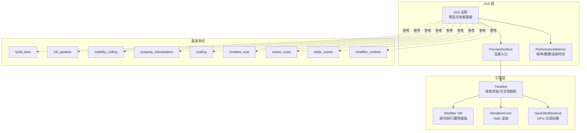
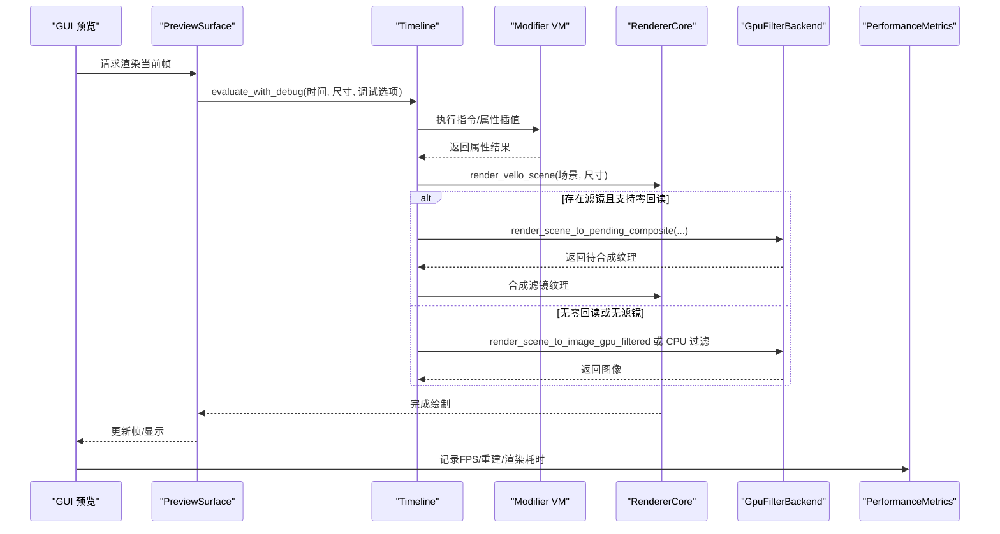
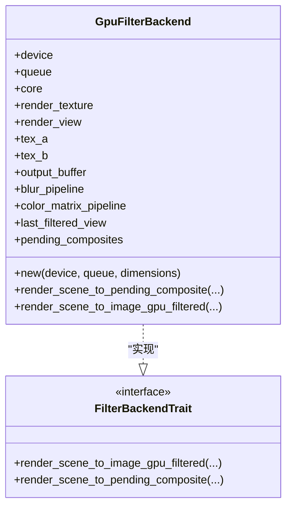
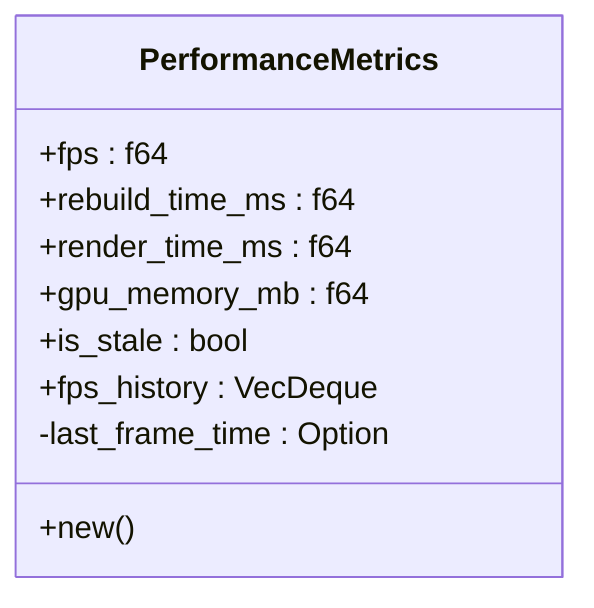
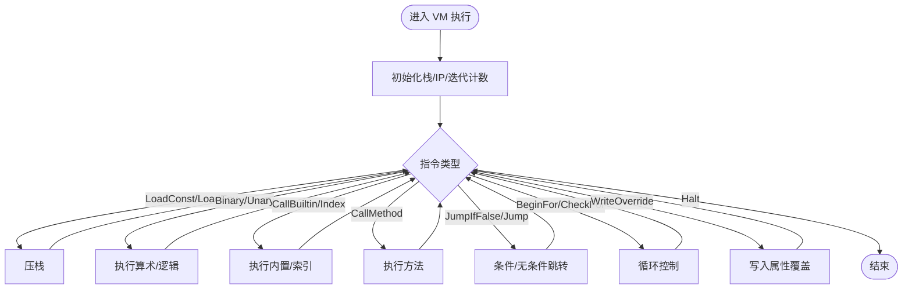
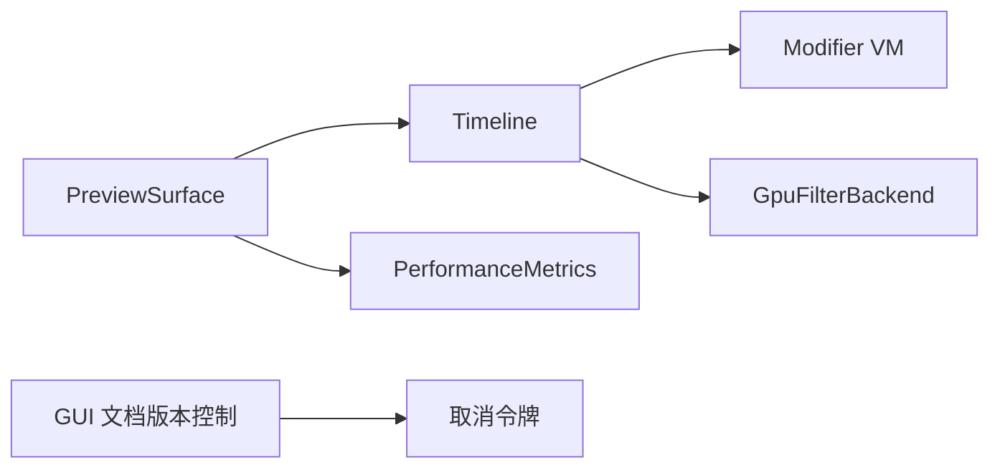

# 性能与优化

<cite>
**本文引用的文件**
- [crates/animatix/src/timeline/filter.rs](file://crates/animatix/src/timeline/filter.rs)
- [crates/animatix/src/renderer/filter_backend.rs](file://crates/animatix/src/renderer/filter_backend.rs)
- [crates/animatix-gui/src/app/preview/performance.rs](file://crates/animatix-gui/src/app/preview/performance.rs)
- [crates/animatix-gui/src/preview_surface.rs](file://crates/animatix-gui/src/preview_surface.rs)
- [crates/animatix/src/timeline/modifier_runtime/vm.rs](file://crates/animatix/src/timeline/modifier_runtime/vm.rs)
- [crates/animatix/benches/build_time.rs](file://crates/animatix/benches/build_time.rs)
- [crates/animatix/benches/full_pipeline.rs](file://crates/animatix/benches/full_pipeline.rs)
- [crates/animatix/benches/visibility_culling.rs](file://crates/animatix/benches/visibility_culling.rs)
- [crates/animatix/benches/property_interpolation.rs](file://crates/animatix/benches/property_interpolation.rs)
- [crates/animatix/benches/scaling.rs](file://crates/animatix/benches/scaling.rs)
- [crates/animatix/benches/timeline_eval.rs](file://crates/animatix/benches/timeline_eval.rs)
- [crates/animatix/benches/scene_costs.rs](file://crates/animatix/benches/scene_costs.rs)
- [crates/animatix/benches/static_scene.rs](file://crates/animatix/benches/static_scene.rs)
- [crates/animatix/benches/modifier_runtime.rs](file://crates/animatix/benches/modifier_runtime.rs)
- [Cargo.lock](file://Cargo.lock)
- [crates/animatix-gui/src/app/document/version.rs](file://crates/animatix-gui/src/app/document/version.rs)
</cite>

## 目录
1. [简介](#简介)
2. [项目结构](#项目结构)
3. [核心组件](#核心组件)
4. [架构总览](#架构总览)
5. [详细组件分析](#详细组件分析)
6. [依赖关系分析](#依赖关系分析)
7. [性能考量](#性能考量)
8. [故障排查指南](#故障排查指南)
9. [结论](#结论)
10. [附录](#附录)

## 简介
本指南聚焦于 Animatix 在渲染性能、内存使用与 CPU 利用率方面的优化策略与实操建议。内容基于仓库中的渲染管线、GPU 过滤后端、预览性能指标采集、基准测试套件以及并发/取消令牌等实现进行系统化梳理，并提供面向不同使用场景的调优建议。

## 项目结构
Animatix 采用多 crate 组织：引擎核心（animatix）、GUI（animatix-gui）、语法与分析器（animatix-syntax、animatix-analyzer）等。与性能密切相关的模块主要分布在：
- 引擎渲染与过滤：renderer、timeline/filter
- 预览与性能指标：gui/preview、gui/preview_surface
- 基准测试：benches 下的多个场景
- 并发与取消：gui 文档版本控制中使用的取消令牌

图示来源
- [crates/animatix-gui/src/preview_surface.rs:334-346](file://crates/animatix-gui/src/preview_surface.rs#L334-L346)
- [crates/animatix/src/timeline/filter.rs:30-67](file://crates/animatix/src/timeline/filter.rs#L30-L67)
- [crates/animatix/src/renderer/filter_backend.rs:134-171](file://crates/animatix/src/renderer/filter_backend.rs#L134-L171)
- [crates/animatix-gui/src/app/preview/performance.rs:1-36](file://crates/animatix-gui/src/app/preview/performance.rs#L1-L36)

章节来源
- [crates/animatix-gui/src/preview_surface.rs:334-346](file://crates/animatix-gui/src/preview_surface.rs#L334-L346)
- [crates/animatix/src/timeline/filter.rs:30-67](file://crates/animatix/src/timeline/filter.rs#L30-L67)
- [crates/animatix/src/renderer/filter_backend.rs:134-171](file://crates/animatix/src/renderer/filter_backend.rs#L134-L171)
- [crates/animatix-gui/src/app/preview/performance.rs:1-36](file://crates/animatix-gui/src/app/preview/performance.rs#L1-L36)

## 核心组件
- GPU 过滤后端：独立的设备/队列与渲染目标，支持零回读合成路径；在存在滤镜时按需创建，避免与主渲染争用资源。
- 预览性能指标：滚动统计 FPS、重建耗时、渲染耗时、GPU 显存估算、过期帧标记与帧时序历史。
- 时间线与修饰器 VM：通过指令流驱动属性计算与插值，具备循环保护与环境变量栈式执行模型。
- 基准测试：覆盖构建时延、全链路、可见性剔除、属性插值、缩放、时间线求值、场景成本、静态场景、修饰器运行时等维度。

章节来源
- [crates/animatix/src/renderer/filter_backend.rs:134-171](file://crates/animatix/src/renderer/filter_backend.rs#L134-L171)
- [crates/animatix-gui/src/app/preview/performance.rs:1-36](file://crates/animatix-gui/src/app/preview/performance.rs#L1-L36)
- [crates/animatix/src/timeline/modifier_runtime/vm.rs:11-256](file://crates/animatix/src/timeline/modifier_runtime/vm.rs#L11-L256)
- [crates/animatix/benches/build_time.rs](file://crates/animatix/benches/build_time.rs)
- [crates/animatix/benches/full_pipeline.rs](file://crates/animatix/benches/full_pipeline.rs)
- [crates/animatix/benches/visibility_culling.rs](file://crates/animatix/benches/visibility_culling.rs)
- [crates/animatix/benches/property_interpolation.rs](file://crates/animatix/benches/property_interpolation.rs)
- [crates/animatix/benches/scaling.rs](file://crates/animatix/benches/scaling.rs)
- [crates/animatix/benches/timeline_eval.rs](file://crates/animatix/benches/timeline_eval.rs)
- [crates/animatix/benches/scene_costs.rs](file://crates/animatix/benches/scene_costs.rs)
- [crates/animatix/benches/static_scene.rs](file://crates/animatix/benches/static_scene.rs)
- [crates/animatix/benches/modifier_runtime.rs](file://crates/animatix/benches/modifier_runtime.rs)

## 架构总览
下图展示从 GUI 预览到引擎渲染与过滤的关键交互，以及性能指标采集位置。

图示来源
- [crates/animatix-gui/src/preview_surface.rs:334-346](file://crates/animatix-gui/src/preview_surface.rs#L334-L346)
- [crates/animatix/src/timeline/filter.rs:30-67](file://crates/animatix/src/timeline/filter.rs#L30-L67)
- [crates/animatix/src/renderer/filter_backend.rs:134-171](file://crates/animatix/src/renderer/filter_backend.rs#L134-L171)
- [crates/animatix-gui/src/app/preview/performance.rs:1-36](file://crates/animatix-gui/src/app/preview/performance.rs#L1-L36)

## 详细组件分析

### GPU 过滤后端与零回读合成
- 设计要点
  - 独立设备/队列与渲染目标，避免与主渲染争用资源。
  - 支持“零回读”路径：先渲染场景为中间纹理，再以纹理视图合成滤镜，最后一次性 blit 至最终目标。
  - 当不支持零回读时，退化为 CPU 侧滤镜或一次回读后再处理。
- 性能收益
  - 减少 CPU-GPU 数据往返，降低带宽压力。
  - 在存在滤镜时显著降低主线程阻塞。
- 使用建议
  - 滤镜参数变化频繁时优先启用零回读路径；否则可考虑 CPU 过滤以减少额外纹理分配。
  - 注意尺寸变化触发后端重建，应尽量保持渲染尺寸稳定。

图示来源
- [crates/animatix/src/renderer/filter_backend.rs:134-171](file://crates/animatix/src/renderer/filter_backend.rs#L134-L171)
- [crates/animatix/src/timeline/filter.rs:30-67](file://crates/animatix/src/timeline/filter.rs#L30-L67)

章节来源
- [crates/animatix/src/renderer/filter_backend.rs:134-171](file://crates/animatix/src/renderer/filter_backend.rs#L134-L171)
- [crates/animatix/src/timeline/filter.rs:30-67](file://crates/animatix/src/timeline/filter.rs#L30-L67)

### 预览性能指标采集
- 指标定义
  - FPS（滚动均值）、最近一次重建耗时（ms）、最近一次渲染耗时（ms）、GPU 纹理内存估算（MB）、是否过期帧、帧时序历史。
- 采集方式
  - 通过时间戳差值计算帧间隔，维护固定容量的历史队列用于可视化。
- 实践建议
  - 将指标集成到预览 HUD，实时观察在不同场景下的波动。
  - 结合基准测试定位异常峰值，如大规模滤镜或复杂布局导致的抖动。

图示来源
- [crates/animatix-gui/src/app/preview/performance.rs:1-36](file://crates/animatix-gui/src/app/preview/performance.rs#L1-L36)

章节来源
- [crates/animatix-gui/src/app/preview/performance.rs:1-36](file://crates/animatix-gui/src/app/preview/performance.rs#L1-L36)

### 时间线与修饰器 VM
- 指令集与执行模型
  - 包含常量加载、环境变量存取、向量构造、一元/二元运算、内置函数调用、索引访问、方法调用、条件跳转、循环控制、属性写入覆盖等。
  - 执行器维护栈、指令指针与循环迭代上限，防止无限循环。
- 性能影响点
  - 复杂表达式与深层嵌套会增加指令数量与栈操作开销。
  - 大量 for 循环与动态索引可能成为瓶颈。
- 优化建议
  - 合理拆分表达式，减少不必要的中间值。
  - 对热点循环设置上限并提前短路。
  - 使用属性覆盖替代昂贵的重复计算。

图示来源
- [crates/animatix/src/timeline/modifier_runtime/vm.rs:11-256](file://crates/animatix/src/timeline/modifier_runtime/vm.rs#L11-L256)

章节来源
- [crates/animatix/src/timeline/modifier_runtime/vm.rs:11-256](file://crates/animatix/src/timeline/modifier_runtime/vm.rs#L11-L256)

### 基准测试与性能剖析
- 场景覆盖
  - 构建时延、全链路、可见性剔除、属性插值、缩放、时间线求值、场景成本、静态场景、修饰器运行时回归等。
- 分析方法
  - 通过基准测试定位热点阶段（如时间线求值、滤镜应用、纹理上传等），结合预览指标验证优化效果。
  - 使用“有缓存 vs 无缓存”的对比（例如缩放/可见性剔除）评估缓存收益。
- 实战建议
  - 先在静态场景上验证基础渲染吞吐，再逐步引入滤镜与复杂布局。
  - 对高频修改的属性（如动画关键帧）优先使用缓存与增量更新。

章节来源
- [crates/animatix/benches/build_time.rs](file://crates/animatix/benches/build_time.rs)
- [crates/animatix/benches/full_pipeline.rs](file://crates/animatix/benches/full_pipeline.rs)
- [crates/animatix/benches/visibility_culling.rs](file://crates/animatix/benches/visibility_culling.rs)
- [crates/animatix/benches/property_interpolation.rs](file://crates/animatix/benches/property_interpolation.rs)
- [crates/animatix/benches/scaling.rs](file://crates/animatix/benches/scaling.rs)
- [crates/animatix/benches/timeline_eval.rs](file://crates/animatix/benches/timeline_eval.rs)
- [crates/animatix/benches/scene_costs.rs](file://crates/animatix/benches/scene_costs.rs)
- [crates/animatix/benches/static_scene.rs](file://crates/animatix/benches/static_scene.rs)
- [crates/animatix/benches/modifier_runtime.rs](file://crates/animatix/benches/modifier_runtime.rs)

## 依赖关系分析
- 渲染与过滤
  - PreviewSurface 在需要时创建 GpuFilterBackend，并在渲染前调用时间线求值与渲染。
  - FilterBackendTrait 提供统一接口，具体由 GpuFilterBackend 实现。
- 性能监控
  - GUI 层收集并展示性能指标，便于快速定位问题。
- 并发与取消
  - 文档版本控制中使用取消令牌，避免过时计算继续占用资源。

图示来源
- [crates/animatix-gui/src/preview_surface.rs:334-346](file://crates/animatix-gui/src/preview_surface.rs#L334-L346)
- [crates/animatix/src/timeline/filter.rs:30-67](file://crates/animatix/src/timeline/filter.rs#L30-L67)
- [crates/animatix/src/renderer/filter_backend.rs:134-171](file://crates/animatix/src/renderer/filter_backend.rs#L134-L171)
- [crates/animatix-gui/src/app/preview/performance.rs:1-36](file://crates/animatix-gui/src/app/preview/performance.rs#L1-L36)
- [crates/animatix-gui/src/app/document/version.rs:91-123](file://crates/animatix-gui/src/app/document/version.rs#L91-L123)

章节来源
- [crates/animatix-gui/src/preview_surface.rs:334-346](file://crates/animatix-gui/src/preview_surface.rs#L334-L346)
- [crates/animatix/src/timeline/filter.rs:30-67](file://crates/animatix/src/timeline/filter.rs#L30-L67)
- [crates/animatix/src/renderer/filter_backend.rs:134-171](file://crates/animatix/src/renderer/filter_backend.rs#L134-L171)
- [crates/animatix-gui/src/app/preview/performance.rs:1-36](file://crates/animatix-gui/src/app/preview/performance.rs#L1-L36)
- [crates/animatix-gui/src/app/document/version.rs:91-123](file://crates/animatix-gui/src/app/document/version.rs#L91-L123)

## 性能考量
- 渲染性能
  - GPU 加速：优先启用零回读合成路径；在滤镜参数稳定时复用中间纹理。
  - 可见性剔除：在大规模元素场景中显著降低绘制调用；配合空间分割与层级裁剪进一步优化。
  - 缓存机制：对静态或低频变化的内容建立缓存，避免重复计算与上传。
- 内存使用
  - 资源池化：纹理/缓冲区按生命周期复用，减少频繁分配与释放。
  - 对象重用：场景图与属性表使用可复用容器，降低 GC 压力。
  - 垃圾回收优化：缩短长生命周期对象持有时间，延迟大对象分配。
- CPU 利用率
  - 指令执行：简化表达式树，减少方法调用与索引访问次数。
  - 增量更新：仅对变更区域重新求值，避免全量重算。
- 并发处理
  - 多线程渲染：将滤镜后端与主渲染分离，避免争用 GPU 资源。
  - 异步任务调度：使用取消令牌中断过时任务，保证 UI 流畅。

## 故障排查指南
- 预览卡顿/掉帧
  - 检查 PerformanceMetrics 中的 FPS、重建耗时与渲染耗时，确认是否存在异常尖峰。
  - 使用全链路与时间线求值基准测试定位瓶颈阶段。
- 滤镜导致的高带宽
  - 若零回读不可用，尝试减少滤镜参数变化频率或切换到 CPU 过滤路径。
  - 关注 GPU 纹理内存估算，避免频繁尺寸变化触发后端重建。
- 动画卡顿
  - 检查修饰器 VM 的循环上限与热点表达式，必要时拆分计算或引入缓存。
- 过时预览
  - 确认取消令牌机制是否正确中断旧任务，避免新帧覆盖旧结果。

章节来源
- [crates/animatix-gui/src/app/preview/performance.rs:1-36](file://crates/animatix-gui/src/app/preview/performance.rs#L1-L36)
- [crates/animatix/benches/full_pipeline.rs](file://crates/animatix/benches/full_pipeline.rs)
- [crates/animatix/benches/timeline_eval.rs](file://crates/animatix/benches/timeline_eval.rs)
- [crates/animatix/src/renderer/filter_backend.rs:134-171](file://crates/animatix/src/renderer/filter_backend.rs#L134-L171)
- [crates/animatix/src/timeline/modifier_runtime/vm.rs:11-256](file://crates/animatix/src/timeline/modifier_runtime/vm.rs#L11-L256)
- [crates/animatix-gui/src/app/document/version.rs:91-123](file://crates/animatix-gui/src/app/document/version.rs#L91-L123)

## 结论
通过将 GPU 过滤后端与零回读合成、可见性剔除、缓存与增量更新、修饰器 VM 的指令优化相结合，并辅以完善的性能指标采集与基准测试体系，Animatix 能够在复杂场景下维持流畅的预览与导出体验。建议在实际项目中以基准测试为依据，逐步引入上述优化策略，并根据使用场景进行针对性调优。

## 附录
- 针对不同场景的优化建议
  - 大规模静态场景：启用可见性剔除与缓存，减少滤镜使用。
  - 高频动画：简化修饰器表达式，使用属性覆盖与缓存，避免每帧重复计算。
  - 复杂滤镜：优先零回读路径；若不可用，降低滤镜强度或采样频率。
- 配置调优清单
  - 渲染尺寸：尽量保持稳定，避免频繁重建后端。
  - 滤镜参数：批量更新，减少逐帧微小变化。
  - 修饰器：拆分复杂表达式，限制循环深度与方法调用次数。
  - 并发：确保滤镜后端与主渲染分离，合理使用取消令牌中断过时任务。