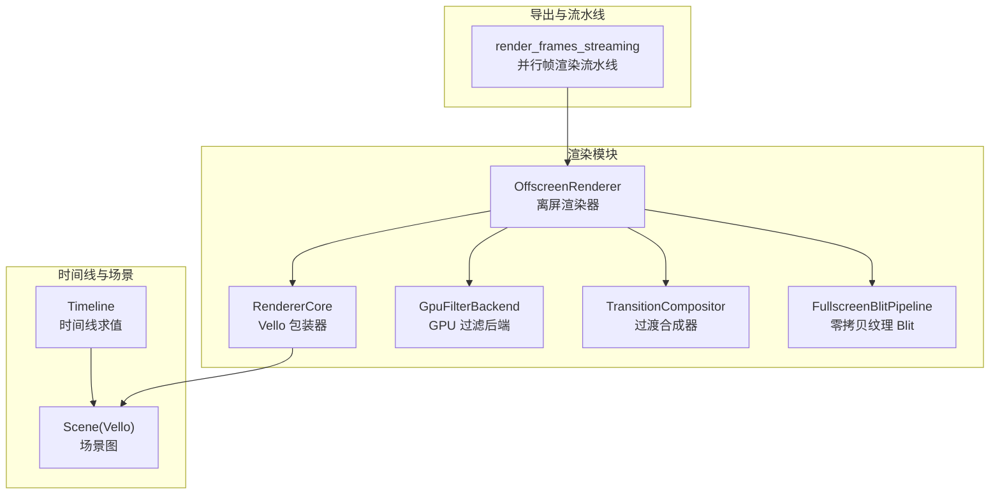
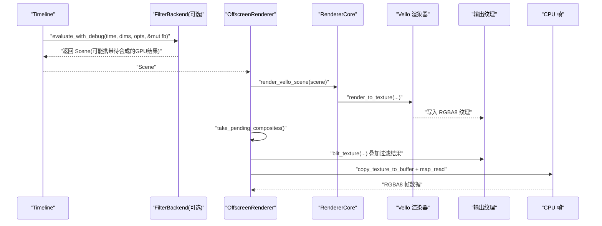
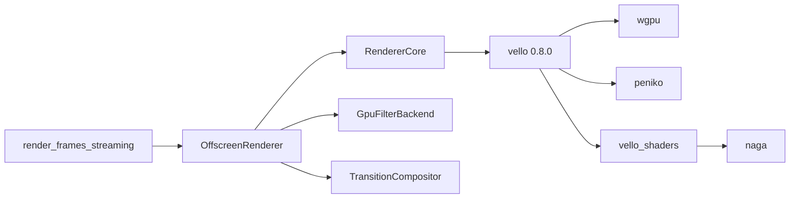

# 渲染优化

<cite>
**本文引用的文件**
- [crates/animatix/src/renderer/core.rs](file://crates/animatix/src/renderer/core.rs)
- [crates/animatix/src/renderer/error.rs](file://crates/animatix/src/renderer/error.rs)
- [crates/animatix/src/renderer/offscreen.rs](file://crates/animatix/src/renderer/offscreen.rs)
- [crates/animatix/src/renderer/render_pipeline.rs](file://crates/animatix/src/renderer/render_pipeline.rs)
- [crates/animatix/src/renderer/filter_backend.rs](file://crates/animatix/src/renderer/filter_backend.rs)
- [crates/animatix/src/renderer/transition.rs](file://crates/animatix/src/renderer/transition.rs)
- [crates/animatix/benches/scaling.rs](file://crates/animatix/benches/scaling.rs)
- [crates/animatix/benches/scaling_breakdown.rs](file://crates/animatix/benches/scaling_breakdown.rs)
- [crates/animatix/benches/scaling_no_cache.rs](file://crates/animatix/benches/scaling_no_cache.rs)
- [crates/animatix/benches/visibility_culling.rs](file://crates/animatix/benches/visibility_culling.rs)
- [Cargo.lock](file://Cargo.lock)
</cite>

## 目录
1. [简介](#简介)
2. [项目结构](#项目结构)
3. [核心组件](#核心组件)
4. [架构总览](#架构总览)
5. [详细组件分析](#详细组件分析)
6. [依赖关系分析](#依赖关系分析)
7. [性能考量与优化策略](#性能考量与优化策略)
8. [故障排查指南](#故障排查指南)
9. [结论](#结论)
10. [附录：调优参数与配置建议](#附录调优参数与配置建议)

## 简介
本指南聚焦于基于 Vello 的 GPU 加速渲染系统在 Animatix 中的实现与优化。内容涵盖：
- Vello 渲染器的性能特性与 WGPU 后端配置要点
- 可见性剔除（视锥剔除与遮挡剔除）的实现与性能影响
- 缩放性能基准测试方法与缓存机制对渲染性能的影响
- 渲染管线优化最佳实践（批处理、状态排序、资源绑定）
- 面向不同硬件环境的参数与配置建议

## 项目结构
渲染子系统主要位于 crates/animatix/src/renderer 下，围绕 OffscreenRenderer、RendererCore、GPU 过滤后端与过渡合成器组织；同时通过 benches 提供可复现的性能基准。

图表来源
- [crates/animatix/src/renderer/offscreen.rs:18-92](file://crates/animatix/src/renderer/offscreen.rs#L18-L92)
- [crates/animatix/src/renderer/core.rs:6-31](file://crates/animatix/src/renderer/core.rs#L6-L31)
- [crates/animatix/src/renderer/filter_backend.rs:294-307](file://crates/animatix/src/renderer/filter_backend.rs#L294-L307)
- [crates/animatix/src/renderer/transition.rs:142-156](file://crates/animatix/src/renderer/transition.rs#L142-L156)
- [crates/animatix/src/renderer/render_pipeline.rs:42-137](file://crates/animatix/src/renderer/render_pipeline.rs#L42-L137)

章节来源
- [crates/animatix/src/renderer/mod.rs:1-57](file://crates/animatix/src/renderer/mod.rs#L1-L57)

## 核心组件
- RendererCore：封装 Vello 渲染器，负责将 Vello Scene 渲染到指定纹理视图，并支持零读回的全屏 Blit。
- OffscreenRenderer：管理 GPU 资源（输出纹理、中间纹理、CPU 可映射缓冲），执行离屏渲染、过渡合成与 CPU 回读。
- GpuFilterBackend：GPU 计算/过滤管线，支持延迟合成与零读回复合。
- TransitionCompositor：两场景间过渡合成，使用双缓冲纹理与着色器完成混合。
- render_frames_streaming：多线程并行渲染帧，按顺序串流输出，限制内存占用。

章节来源
- [crates/animatix/src/renderer/core.rs:6-90](file://crates/animatix/src/renderer/core.rs#L6-L90)
- [crates/animatix/src/renderer/offscreen.rs:18-447](file://crates/animatix/src/renderer/offscreen.rs#L18-L447)
- [crates/animatix/src/renderer/filter_backend.rs:294-766](file://crates/animatix/src/renderer/filter_backend.rs#L294-L766)
- [crates/animatix/src/renderer/transition.rs:142-156](file://crates/animatix/src/renderer/transition.rs#L142-L156)
- [crates/animatix/src/renderer/render_pipeline.rs:42-137](file://crates/animatix/src/renderer/render_pipeline.rs#L42-L137)

## 架构总览
下图展示从时间线到最终帧输出的关键路径：时间线求值生成 Vello Scene，OffscreenRenderer 使用 RendererCore 将 Scene 渲染至输出纹理，必要时叠加 GPU 过滤结果，最后回读为 CPU 帧数据。

图表来源
- [crates/animatix/src/renderer/offscreen.rs:119-167](file://crates/animatix/src/renderer/offscreen.rs#L119-L167)
- [crates/animatix/src/renderer/core.rs:53-90](file://crates/animatix/src/renderer/core.rs#L53-L90)
- [crates/animatix/src/renderer/filter_backend.rs:748-766](file://crates/animatix/src/renderer/filter_backend.rs#L748-L766)

## 详细组件分析

### Vello 渲染器与 WGPU 后端配置
- 初始化选项
  - use_cpu: 关闭 CPU 渲染路径，强制 GPU 加速
  - pipeline_cache: 当前未启用，建议在长会话中考虑持久化以减少编译开销
  - antialiasing_support: 启用 Area 抗锯齿
  - num_init_threads: 默认由后端选择，可根据设备能力调整
- 渲染参数
  - base_color：背景色
  - width/height：目标尺寸
  - antialiasing_method：Area 抗锯齿
- 性能要点
  - 使用 Area 抗锯齿通常带来更佳视觉质量，但会增加像素填充成本
  - 禁用 CPU 路径确保 GPU 全速运行
  - 合理设置尺寸与抗锯齿策略以平衡质量与带宽

章节来源
- [crates/animatix/src/renderer/core.rs:14-31](file://crates/animatix/src/renderer/core.rs#L14-L31)
- [crates/animatix/src/renderer/core.rs:79-89](file://crates/animatix/src/renderer/core.rs#L79-L89)

### 离屏渲染与零读回合成
- 资源管理
  - 输出纹理：用于单场景渲染或合成输出
  - 中间纹理 A/B：过渡合成与延迟过滤的双缓冲
  - CPU 映射缓冲：回读 RGBA8 帧数据
- 流程
  - 渲染 Scene 至输出纹理
  - 拉取待合成的 GPU 结果并进行零读回 Blit
  - 提交命令队列后回读 CPU 帧
- 内存与吞吐
  - 通过 bytes_per_row 对齐与固定通道容量控制内存峰值
  - 双缓冲避免同时持有两个大型 Scene 对象

章节来源
- [crates/animatix/src/renderer/offscreen.rs:364-447](file://crates/animatix/src/renderer/offscreen.rs#L364-L447)
- [crates/animatix/src/renderer/offscreen.rs:295-362](file://crates/animatix/src/renderer/offscreen.rs#L295-L362)

### GPU 过滤后端与延迟合成
- 绑定布局关键点
  - 纹理采样器、输入/输出纹理视图、统一缓冲等绑定项
- Ping-pong 双缓冲
  - 在 A/B 纹理间交换，避免读写冲突
  - 最终视图记录在 last_filtered_view，供后续合成
- 零读回复合
  - take_last_filtered_view 清空内部槽位，防止重复消费
  - copy_last_filtered_to_pending 将最近结果复制到专用纹理，便于后续合成叠加

章节来源
- [crates/animatix/src/renderer/filter_backend.rs:294-307](file://crates/animatix/src/renderer/filter_backend.rs#L294-L307)
- [crates/animatix/src/renderer/filter_backend.rs:733-766](file://crates/animatix/src/renderer/filter_backend.rs#L733-L766)

### 过渡合成器
- 输入：场景 A（view_a）、场景 B（view_b）
- 输出：混合后的输出纹理（output_view）
- 参数：进度、过渡类型、缓动函数
- 注意：先渲染 A 再释放 A 的 Scene，再渲染 B，降低内存峰值

章节来源
- [crates/animatix/src/renderer/offscreen.rs:223-293](file://crates/animatix/src/renderer/offscreen.rs#L223-L293)

### 并行渲染流水线
- 多块（chunk）并行：每个块独立创建 OffscreenRenderer 实例，避免驱动并发适配器枚举问题
- 有界通道：每块仅保留少量帧，控制内存为 O(threads × frame_size)
- 严格顺序输出：保证编码器接收连续帧序列
- 支持取消与进度回调

章节来源
- [crates/animatix/src/renderer/render_pipeline.rs:42-137](file://crates/animatix/src/renderer/render_pipeline.rs#L42-L137)
- [crates/animatix/src/renderer/render_pipeline.rs:149-301](file://crates/animatix/src/renderer/render_pipeline.rs#L149-L301)

## 依赖关系分析
- Vello 版本与依赖
  - vello 0.8.0，依赖 wgpu、peniko、skrifa、vello_shaders 等
  - vello_shaders 引入 Naga 编译器，影响首次启动与管线编译时间
- 渲染栈耦合
  - OffscreenRenderer 依赖 RendererCore 与 GpuFilterBackend
  - 过渡合成器与双缓冲纹理耦合
  - 并行流水线依赖 OffscreenRenderer 的线程安全与资源隔离

图表来源
- [Cargo.lock:6325-6391](file://Cargo.lock#L6325-L6391)

章节来源
- [Cargo.lock:6325-6391](file://Cargo.lock#L6325-L6391)

## 性能考量与优化策略

### GPU 加速与 Vello/WGPU 配置
- 强制 GPU 渲染：关闭 CPU 路径，确保使用 GPU
- 抗锯齿策略：Area 抗锯齿提升质量但增加带宽；在高分辨率或低端设备上可考虑降级或关闭
- 管线缓存：当前未启用；在长时间运行或重复场景中可考虑引入缓存以减少编译开销
- 线程初始化：根据设备能力与工作负载调整初始化线程数

章节来源
- [crates/animatix/src/renderer/core.rs:17-25](file://crates/animatix/src/renderer/core.rs#L17-L25)

### 可见性剔除（视锥剔除与遮挡剔除）
- 视锥剔除
  - 场景构建阶段可基于边界盒与相机视锥进行早期裁剪，减少无效绘制
  - 在 Timeline 评估阶段加入边界盒计算与剔除逻辑，可显著降低 Scene 复杂度
- 遮挡剔除
  - 利用深度/遮挡查询在 GPU 上进行快速遮挡判断，跳过不可见几何
  - 与延迟渲染/前向+深度路径结合，减少不必要的片段着色
- 基准验证
  - visibility_culling 基准覆盖“全部可见”、“部分可见/离屏”、“全部离屏”三类场景，可用于评估剔除收益

章节来源
- [crates/animatix/benches/visibility_culling.rs:45-92](file://crates/animatix/benches/visibility_culling.rs#L45-L92)

### 缩放性能与缓存机制
- 缓存命中 vs 无缓存
  - scaling_no_cache 基准通过调试选项禁用帧缓存，模拟真实重算场景
  - scaling_breakdown 将“完整求值”拆分为“帧环境构建”与“求值”，定位瓶颈
  - scaling 基准评估纯求值缩放行为
- 优化建议
  - 优先利用帧缓存与增量更新，避免重复求值
  - 对静态场景与静态属性进行去计算或预计算
  - 合理划分场景与演员，降低单帧 Scene 规模

章节来源
- [crates/animatix/benches/scaling.rs:21-32](file://crates/animatix/benches/scaling.rs#L21-L32)
- [crates/animatix/benches/scaling_breakdown.rs:21-48](file://crates/animatix/benches/scaling_breakdown.rs#L21-L48)
- [crates/animatix/benches/scaling_no_cache.rs:21-39](file://crates/animatix/benches/scaling_no_cache.rs#L21-L39)

### 渲染管线优化最佳实践
- 批处理
  - 合并相邻且状态相同的绘制调用，减少状态切换与提交次数
  - 对相同材质/着色器的几何体进行分组
- 状态排序
  - 按纹理/采样器/着色器/混合状态排序，最大化 GPU 管线连续性
- 资源绑定
  - 统一缓冲区按帧更新，避免频繁重新绑定
  - 使用绑定数组与动态偏移（如可用）降低绑定数量
- 双缓冲与零读回
  - 过渡与过滤采用 Ping-pong 双缓冲，避免读写冲突
  - 优先使用零读回 Blit 合成，减少 CPU-GPU 数据往返

章节来源
- [crates/animatix/src/renderer/filter_backend.rs:294-307](file://crates/animatix/src/renderer/filter_backend.rs#L294-L307)
- [crates/animatix/src/renderer/offscreen.rs:147-164](file://crates/animatix/src/renderer/offscreen.rs#L147-L164)

### 并行与内存控制
- 并行帧渲染
  - 使用多线程与分块策略，限制每块通道容量，控制内存峰值
  - 在主线程串行输出，确保编码器顺序一致性
- 取消与进度
  - 支持取消标志与进度原子计数，便于长任务中断与监控

章节来源
- [crates/animatix/src/renderer/render_pipeline.rs:42-137](file://crates/animatix/src/renderer/render_pipeline.rs#L42-L137)
- [crates/animatix/src/renderer/render_pipeline.rs:149-301](file://crates/animatix/src/renderer/render_pipeline.rs#L149-L301)

## 故障排查指南
- 设备与适配器
  - 若找不到兼容适配器或创建设备失败，检查驱动版本与功能集要求
- 渲染错误
  - Vello 初始化失败或帧渲染失败，确认设备能力与纹理格式支持
- 窗口与事件循环
  - 窗口/事件循环创建失败通常与平台相关，需检查平台后端初始化
- 文本/数学编译
  - Typst 文本/公式编译失败时，检查字体与文本内容合法性

章节来源
- [crates/animatix/src/renderer/error.rs:1-28](file://crates/animatix/src/renderer/error.rs#L1-L28)

## 结论
通过强制 GPU 渲染、合理配置抗锯齿、利用帧缓存与可见性剔除、采用双缓冲与零读回合成以及并行流水线，Animatix 的渲染系统可在不同硬件环境下取得稳定且高效的性能表现。建议在实际部署中结合基准测试持续校准参数，并针对目标设备进行专项优化。

## 附录：调优参数与配置建议
- Vello 渲染器选项
  - use_cpu：false（强制 GPU）
  - pipeline_cache：按需启用（长会话/重复场景）
  - antialiasing_support：启用 Area 抗锯齿
  - num_init_threads：根据 CPU 核心数与 GPU 负载调整
- 渲染参数
  - base_color：根据合成需求设置背景色
  - width/height：匹配目标分辨率，避免过度放大
  - antialiasing_method：Area（高质量）或关闭（低带宽）
- 并行与内存
  - num_threads：依据 CPU/GPU 能力与 I/O 选择 4–12
  - chunk_size：按帧数与线程数自适应，避免过大导致内存峰值过高
  - 通道容量：固定为 2，平衡吞吐与内存
- 可见性剔除
  - 视锥剔除：在 Timeline 评估阶段加入边界盒与相机视锥裁剪
  - 遮挡剔除：在 GPU 上进行遮挡查询，跳过不可见几何
- 过滤与合成
  - 优先使用零读回 Blit 合成
  - Ping-pong 双缓冲避免读写冲突，及时清理中间结果