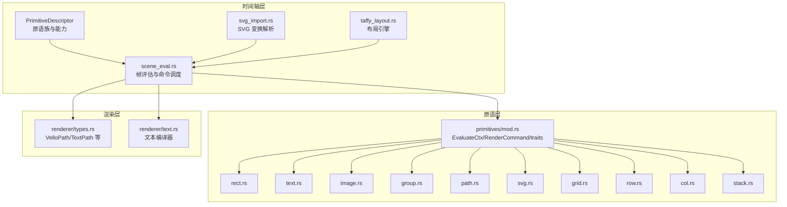
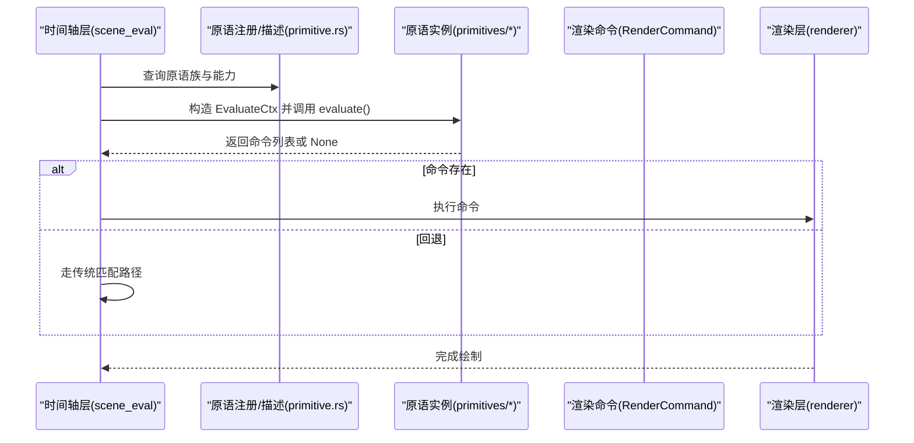
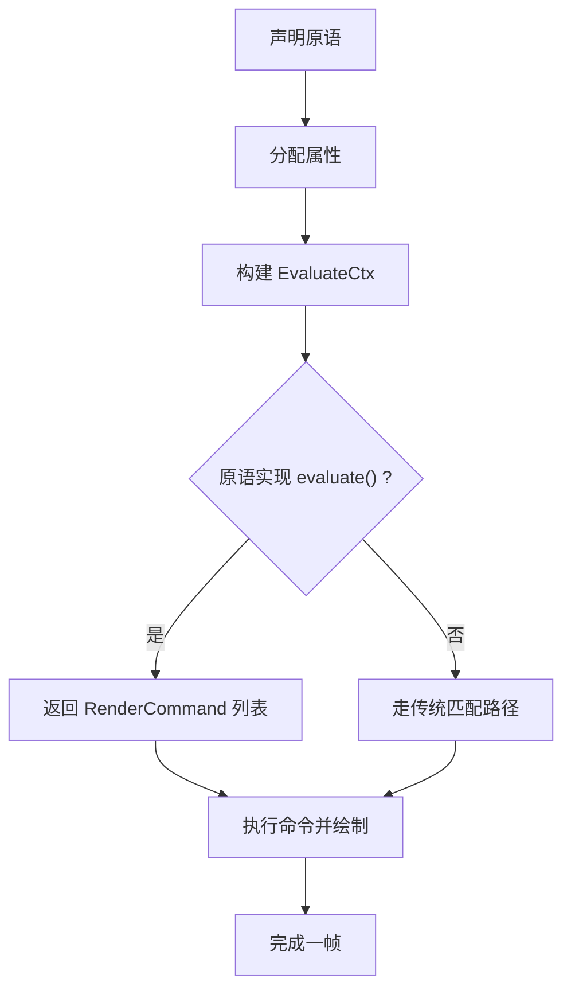
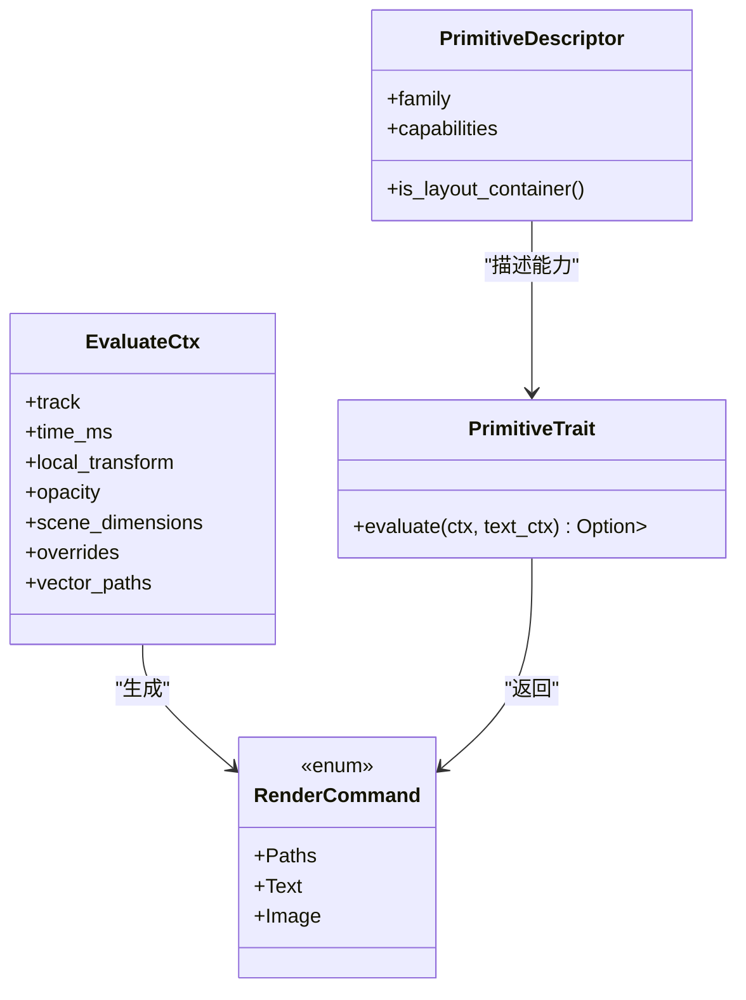
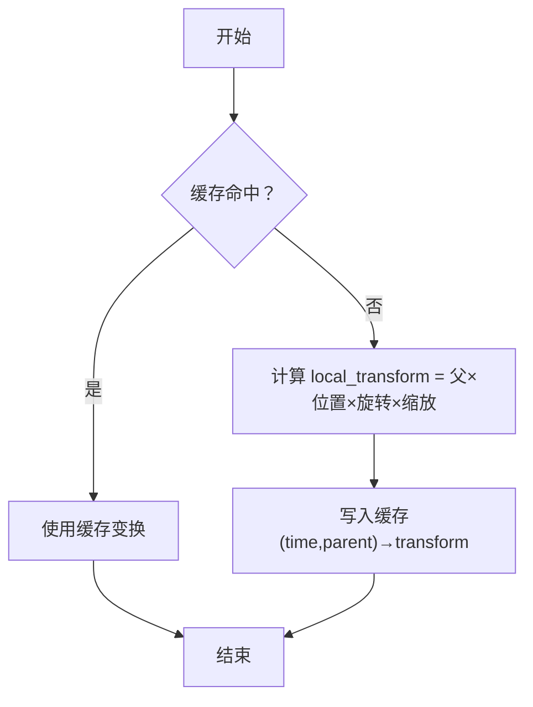

# 原语系统

<cite>
**本文引用的文件**
- [crates/animatix/src/primitives/mod.rs](file://crates/animatix/src/primitives/mod.rs)
- [crates/animatix/src/timeline/primitive.rs](file://crates/animatix/src/timeline/primitive.rs)
- [crates/animatix/src/timeline/scene_eval.rs](file://crates/animatix/src/timeline/scene_eval.rs)
- [crates/animatix/src/timeline/svg_import.rs](file://crates/animatix/src/timeline/svg_import.rs)
- [docs/spec.md](file://docs/spec.md)
- [docs/properties.md](file://docs/properties.md)
- [crates/animatix/src/primitives/rect.rs](file://crates/animatix/src/primitives/rect.rs)
- [crates/animatix/src/primitives/text.rs](file://crates/animatix/src/primitives/text.rs)
- [crates/animatix/src/primitives/image.rs](file://crates/animatix/src/primitives/image.rs)
- [crates/animatix/src/primitives/group.rs](file://crates/animatix/src/primitives/group.rs)
- [crates/animatix/src/primitives/path.rs](file://crates/animatix/src/primitives/path.rs)
- [crates/animatix/src/primitives/svg.rs](file://crates/animatix/src/primitives/svg.rs)
- [crates/animatix/src/primitives/grid.rs](file://crates/animatix/src/primitives/grid.rs)
- [crates/animatix/src/primitives/row.rs](file://crates/animatix/src/primitives/row.rs)
- [crates/animatix/src/primitives/col.rs](file://crates/animatix/src/primitives/col.rs)
- [crates/animatix/src/primitives/stack.rs](file://crates/animatix/src/primitives/stack.rs)
- [crates/animatix/src/renderer/types.rs](file://crates/animatix/src/renderer/types.rs)
- [crates/animatix/src/renderer/text.rs](file://crates/animatix/src/renderer/text.rs)
- [crates/animatix/src/timeline/taffy_layout.rs](file://crates/animatix/src/timeline/taffy_layout.rs)
</cite>

## 目录
1. [引言](#引言)
2. [项目结构](#项目结构)
3. [核心组件](#核心组件)
4. [架构总览](#架构总览)
5. [详细组件分析](#详细组件分析)
6. [依赖关系分析](#依赖关系分析)
7. [性能考量](#性能考量)
8. [故障排查指南](#故障排查指南)
9. [结论](#结论)
10. [附录](#附录)

## 引言
本文件系统性阐述 Animatix 的原语抽象与统一接口设计，覆盖形状原语、文本原语、图像原语与容器原语，并解释其生命周期（从声明到渲染）、属性体系（通用与特定属性）、变换矩阵系统（仿射变换的数学与实现），以及典型使用范式。目标是帮助读者在不深入源码的前提下理解原语如何协同工作，同时为开发者提供可追溯的参考路径。

## 项目结构
Animatix 将“原语”定义为可被时间轴采样并生成渲染命令的最小可执行单元。原语的分类、能力与注册由时间轴层管理；原语的评估与渲染命令生成由原语层负责；渲染管线则消费这些命令并输出最终画面。

图示来源
- [crates/animatix/src/timeline/primitive.rs:1-168](file://crates/animatix/src/timeline/primitive.rs#L1-L168)
- [crates/animatix/src/timeline/scene_eval.rs:410-434](file://crates/animatix/src/timeline/scene_eval.rs#L410-L434)
- [crates/animatix/src/timeline/svg_import.rs:261-297](file://crates/animatix/src/timeline/svg_import.rs#L261-L297)
- [crates/animatix/src/timeline/taffy_layout.rs](file://crates/animatix/src/timeline/taffy_layout.rs)
- [crates/animatix/src/primitives/mod.rs:237-568](file://crates/animatix/src/primitives/mod.rs#L237-L568)
- [crates/animatix/src/renderer/types.rs](file://crates/animatix/src/renderer/types.rs)
- [crates/animatix/src/renderer/text.rs](file://crates/animatix/src/renderer/text.rs)

章节来源
- [crates/animatix/src/timeline/primitive.rs:1-168](file://crates/animatix/src/timeline/primitive.rs#L1-L168)
- [crates/animatix/src/timeline/scene_eval.rs:410-434](file://crates/animatix/src/timeline/scene_eval.rs#L410-L434)
- [crates/animatix/src/timeline/svg_import.rs:261-297](file://crates/animatix/src/timeline/svg_import.rs#L261-L297)
- [crates/animatix/src/timeline/taffy_layout.rs](file://crates/animatix/src/timeline/taffy_layout.rs)
- [crates/animatix/src/primitives/mod.rs:237-568](file://crates/animatix/src/primitives/mod.rs#L237-L568)
- [crates/animatix/src/renderer/types.rs](file://crates/animatix/src/renderer/types.rs)
- [crates/animatix/src/renderer/text.rs](file://crates/animatix/src/renderer/text.rs)

## 核心组件
- 原语族与能力：通过 PrimitiveDescriptor 对原语进行家族划分（文本类、矢量形状、媒体、图表、容器、组）并标注能力位（如是否支持文本路径、矢量路径、图像载荷、布局容器等）。
- 评估上下文 EvaluateCtx：包含当前时间、局部变换（父×位置×旋转×缩放）、继承不透明度、场景尺寸、属性覆盖与预采样的矢量路径等，驱动原语在帧时刻生成渲染命令。
- 渲染命令 RenderCommand：统一的原语输出格式，支持绘制矢量路径集合、文本字形路径、图像。
- 原语 trait：所有原语实现统一的 evaluate 接口，返回命令列表；若返回 None，则回退到传统匹配路径。

章节来源
- [crates/animatix/src/timeline/primitive.rs:1-168](file://crates/animatix/src/timeline/primitive.rs#L1-L168)
- [crates/animatix/src/primitives/mod.rs:237-568](file://crates/animatix/src/primitives/mod.rs#L237-L568)

## 架构总览
原语系统采用“分层解耦 + 统一接口”的设计：原语层只负责生成渲染命令；时间轴层负责采样与调度；渲染层负责执行命令。原语族与能力在时间轴层注册，原语在帧评估阶段被动态发现并调用。

图示来源
- [crates/animatix/src/timeline/scene_eval.rs:410-434](file://crates/animatix/src/timeline/scene_eval.rs#L410-L434)
- [crates/animatix/src/timeline/primitive.rs:1-168](file://crates/animatix/src/timeline/primitive.rs#L1-L168)
- [crates/animatix/src/primitives/mod.rs:551-568](file://crates/animatix/src/primitives/mod.rs#L551-L568)

## 详细组件分析

### 形状原语（矢量路径）
- 典型类型：矩形、椭圆、线段、多边形、路径等。
- 生命周期：在帧评估时，根据 EvaluateCtx 中的本地变换与预采样矢量路径生成 RenderCommand::Paths。
- 属性系统：通用属性（位置、旋转、缩放、不透明度）叠加在局部变换上；特定属性（如填充、描边、轮廓样式）由矢量路径携带。
- 使用示例：声明一个矩形并设置尺寸、填充与描边，随后在动画中对位置、旋转、缩放进行关键帧插值。

章节来源
- [crates/animatix/src/primitives/rect.rs](file://crates/animatix/src/primitives/rect.rs)
- [crates/animatix/src/primitives/path.rs](file://crates/animatix/src/primitives/path.rs)
- [crates/animatix/src/primitives/mod.rs:273-290](file://crates/animatix/src/primitives/mod.rs#L273-L290)

### 文本原语
- 生命周期：在帧评估时，先对文本内容、字体族、字号、颜色等进行采样，再通过 TextCompileCtx 进行文本路径重编译，最终生成 RenderCommand::Text。
- 属性系统：通用属性参与变换；文本特有属性包括内容、字体族、字号、颜色、对齐方式等。
- 使用示例：声明一个文本原语，设置内容与字体参数，随后对文本路径进行“显现/描边”等效果处理。

章节来源
- [crates/animatix/src/primitives/text.rs](file://crates/animatix/src/primitives/text.rs)
- [crates/animatix/src/primitives/mod.rs:50-66](file://crates/animatix/src/primitives/mod.rs#L50-L66)
- [crates/animatix/src/renderer/text.rs](file://crates/animatix/src/renderer/text.rs)

### 图像原语
- 生命周期：在帧评估时，根据 SceneImage 与自然尺寸生成 RenderCommand::Image。
- 属性系统：通用属性参与变换；图像特有属性包括资源来源、裁剪、滤镜等。
- 使用示例：声明一个图像原语，绑定图片资源并在动画中对其应用变换与不透明度。

章节来源
- [crates/animatix/src/primitives/image.rs](file://crates/animatix/src/primitives/image.rs)
- [crates/animatix/src/primitives/mod.rs:284-290](file://crates/animatix/src/primitives/mod.rs#L284-L290)

### 容器原语（布局与组合）
- 类型：Row、Col、Grid、Stack、Group、Mask 等。
- 能力：标记为布局容器（layout_container），可容纳子节点并进行布局计算；部分容器还支持遮罩与组合。
- 生命周期：在帧评估时，先计算子节点的局部变换与可见性，再按容器策略生成渲染命令或进一步布局。
- 使用示例：在 Row 中放置多个矩形，利用间距与内边距控制排列；在 Group/Mask 中对一组元素进行统一变换与遮罩。

章节来源
- [crates/animatix/src/primitives/group.rs](file://crates/animatix/src/primitives/group.rs)
- [crates/animatix/src/primitives/grid.rs](file://crates/animatix/src/primitives/grid.rs)
- [crates/animatix/src/primitives/row.rs](file://crates/animatix/src/primitives/row.rs)
- [crates/animatix/src/primitives/col.rs](file://crates/animatix/src/primitives/col.rs)
- [crates/animatix/src/primitives/stack.rs](file://crates/animatix/src/primitives/stack.rs)
- [crates/animatix/src/timeline/primitive.rs:146-148](file://crates/animatix/src/timeline/primitive.rs#L146-L148)
- [crates/animatix/src/timeline/taffy_layout.rs](file://crates/animatix/src/timeline/taffy_layout.rs)

### SVG 原语
- 生命周期：在帧评估时，解析 SVG 路径与样式，结合变换矩阵生成矢量路径与渲染命令。
- 属性系统：支持从 SVG 属性映射到原语属性（如 transform、fill、stroke 等）。
- 使用示例：导入外部 SVG 文件并将其作为原语使用，配合 transform 实现复杂动画。

章节来源
- [crates/animatix/src/primitives/svg.rs](file://crates/animatix/src/primitives/svg.rs)
- [crates/animatix/src/timeline/svg_import.rs:261-297](file://crates/animatix/src/timeline/svg_import.rs#L261-L297)
- [crates/animatix/src/timeline/svg_import.rs:1605-1634](file://crates/animatix/src/timeline/svg_import.rs#L1605-L1634)

### 原语生命周期与渲染流程
- 声明阶段：在 AST 中定义原语类型与属性。
- 分配阶段：对属性进行解析与分配，特殊属性（如 size、at、offset）可能触发复合行为。
- 帧评估阶段：时间轴层构造 EvaluateCtx，调用原语 evaluate，返回 RenderCommand 列表。
- 命令执行：渲染层遍历命令并绘制到场景。

图示来源
- [crates/animatix/src/timeline/scene_eval.rs:410-434](file://crates/animatix/src/timeline/scene_eval.rs#L410-L434)
- [crates/animatix/src/primitives/mod.rs:551-568](file://crates/animatix/src/primitives/mod.rs#L551-L568)

### 属性系统
- 通用属性
  - 位置/锚点：position/at、position_binding（场景百分比/锚点绑定）。
  - 旋转：rotation（度）。
  - 缩放：scale（均匀）。
  - 不透明度：opacity（继承乘法）。
  - 变换矩阵：transform（6 元素仿射矩阵 [a,b,c,d,tx,ty]），与 rotation/scale 共存但独立。
- 特定属性
  - 形状：填充颜色、描边宽度、线帽/接合等。
  - 文本：内容、字体族、字号、颜色、对齐等。
  - 图像：资源来源、裁剪、滤镜等。
  - 容器：gap、padding、对齐等。
- 属性读写策略：某些属性在写入时会映射到其他存储字段（如 width/height 映射到 Size 字段），并在帧时间以特定策略读取。

章节来源
- [docs/spec.md:480-516](file://docs/spec.md#L480-L516)
- [docs/properties.md:176-190](file://docs/properties.md#L176-L190)
- [crates/animatix/src/timeline/scene_eval.rs:320-351](file://crates/animatix/src/timeline/scene_eval.rs#L320-L351)

### 变换矩阵系统（仿射变换）
- 数学原理：二维仿射变换由 6 元素矩阵表示，可分解为平移、旋转、缩放与剪切的组合。
- 应用顺序（从右到左作用于点）：父变换 × 位置（平移）× 自身变换（矩阵）× 旋转 × 缩放。
- 在原语中的体现：EvaluateCtx 提供局部变换（父×位置×旋转×缩放），原语可在自身变换之上叠加 transform 矩阵；SVG 导入时亦可从 transform 属性提取位置、旋转、缩放并转换为属性。
- 性能与缓存：同一时间与父变换组合下会缓存节点变换，避免重复采样。

章节来源
- [docs/spec.md:480-516](file://docs/spec.md#L480-L516)
- [crates/animatix/src/timeline/scene_eval.rs:320-351](file://crates/animatix/src/timeline/scene_eval.rs#L320-L351)
- [crates/animatix/src/timeline/svg_import.rs:261-297](file://crates/animatix/src/timeline/svg_import.rs#L261-L297)
- [crates/animatix/src/timeline/svg_import.rs:1605-1634](file://crates/animatix/src/timeline/svg_import.rs#L1605-L1634)

### 使用示例（方法与路径）
- 基本形状：声明矩形并设置尺寸、填充与描边，随后对位置、旋转、缩放添加关键帧。
  - 参考：[crates/animatix/src/primitives/rect.rs](file://crates/animatix/src/primitives/rect.rs)
- 文本显示：设置文本内容、字体族与字号，必要时启用文本路径能力。
  - 参考：[crates/animatix/src/primitives/text.rs](file://crates/animatix/src/primitives/text.rs)
- 图像嵌入：绑定图像资源并应用变换与不透明度。
  - 参考：[crates/animatix/src/primitives/image.rs](file://crates/animatix/src/primitives/image.rs)
- 复杂容器：在 Row/Col/Grid/Stack/Group/Mask 中组织子元素，利用布局与遮罩实现复杂排版。
  - 参考：[crates/animatix/src/primitives/row.rs](file://crates/animatix/src/primitives/row.rs), [crates/animatix/src/primitives/col.rs](file://crates/animatix/src/primitives/col.rs), [crates/animatix/src/primitives/grid.rs](file://crates/animatix/src/primitives/grid.rs), [crates/animatix/src/primitives/stack.rs](file://crates/animatix/src/primitives/stack.rs), [crates/animatix/src/primitives/group.rs](file://crates/animatix/src/primitives/group.rs)

## 依赖关系分析
- 原语族与能力：PrimitiveDescriptor 依据 ActorCategory 与类型名推导家族与能力位，决定是否启用文本路径、矢量路径、布局容器等特性。
- 原语与渲染：EvaluateCtx 携带矢量路径与文本编译上下文，原语通过 RenderCommand 与渲染层解耦。
- SVG 导入：SVG 变换解析与属性映射，将外部变换转换为内部属性或矩阵。
- 布局：容器原语依赖 Taffy 布局引擎，确保子节点正确排布。

图示来源
- [crates/animatix/src/timeline/primitive.rs:1-168](file://crates/animatix/src/timeline/primitive.rs#L1-L168)
- [crates/animatix/src/primitives/mod.rs:237-290](file://crates/animatix/src/primitives/mod.rs#L237-L290)
- [crates/animatix/src/primitives/mod.rs:551-568](file://crates/animatix/src/primitives/mod.rs#L551-L568)

章节来源
- [crates/animatix/src/timeline/primitive.rs:1-168](file://crates/animatix/src/timeline/primitive.rs#L1-L168)
- [crates/animatix/src/primitives/mod.rs:237-290](file://crates/animatix/src/primitives/mod.rs#L237-L290)
- [crates/animatix/src/primitives/mod.rs:551-568](file://crates/animatix/src/primitives/mod.rs#L551-L568)

## 性能考量
- 变换缓存：同一时间与父变换组合下复用节点变换，减少重复采样。
- 可见性短路：仅对屏幕内可见对象采样与渲染，不可见对象仍需传递变换给子树。
- 命令化分离：原语仅生成命令，避免在评估循环中直接耦合渲染逻辑，便于优化与扩展。

章节来源
- [crates/animatix/src/timeline/scene_eval.rs:320-351](file://crates/animatix/src/timeline/scene_eval.rs#L320-L351)
- [crates/animatix/src/timeline/scene_eval.rs:410-434](file://crates/animatix/src/timeline/scene_eval.rs#L410-L434)

## 故障排查指南
- 文本路径异常：检查文本内容、字体族与字号的帧时间采样是否一致；确认 TextCompileCtx 是否正确传入。
  - 参考：[crates/animatix/src/primitives/mod.rs:50-66](file://crates/animatix/src/primitives/mod.rs#L50-L66)
- 变换叠加错误：核对应用顺序（父×平移×矩阵×旋转×缩放）与 transform 的输入形式；必要时拆分为 position/rotation/scale 与 transform 的组合。
  - 参考：[docs/spec.md:480-516](file://docs/spec.md#L480-L516)
- SVG 变换解析问题：检查 SVG transform 属性是否被正确解析为 position/rotation/scale 或矩阵。
  - 参考：[crates/animatix/src/timeline/svg_import.rs:261-297](file://crates/animatix/src/timeline/svg_import.rs#L261-L297)
- 容器布局错乱：确认容器的 gap/padding 与子节点尺寸是否合理；必要时调整布局策略。
  - 参考：[crates/animatix/src/timeline/taffy_layout.rs](file://crates/animatix/src/timeline/taffy_layout.rs)

## 结论
Animatix 的原语系统通过统一的 EvaluateCtx 与 RenderCommand 抽象，将形状、文本、图像与容器等不同类型原语整合为一致的生命周期与渲染通道。借助 PrimitiveDescriptor 的能力位与家族分类，系统既能灵活扩展新原语，又能保持与渲染管线的低耦合。属性系统与仿射变换矩阵的设计使得通用与特定需求并存，既满足易用性也保留了强大的表现力。

## 附录
- 数据模型（简述）
  - VelloPath/TextPath：矢量路径与文本字形路径的数据载体。
  - SceneImage：场景级图像资源句柄。
- 关键流程图（算法实现）
  - 变换缓存流程：在相同时间与父变换组合下命中缓存，否则重新计算并写入缓存。
  - SVG 变换解析流程：识别 translate/rotate/scale/matrix 并累加到位置、旋转、缩放与矩阵。

图示来源
- [crates/animatix/src/timeline/scene_eval.rs:320-351](file://crates/animatix/src/timeline/scene_eval.rs#L320-L351)