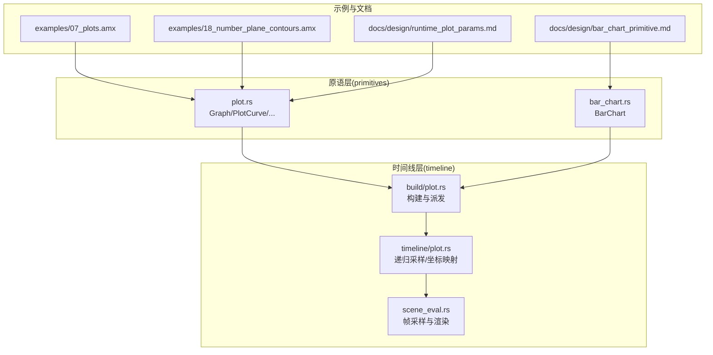
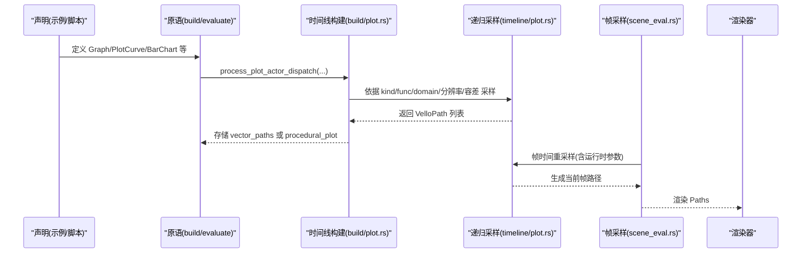
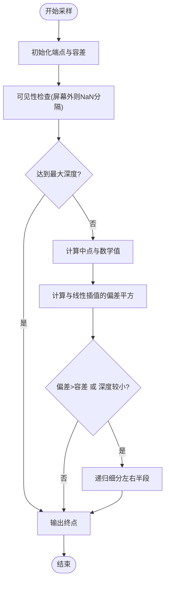
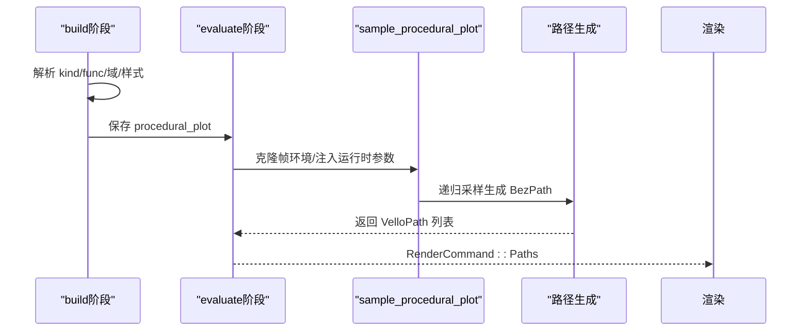
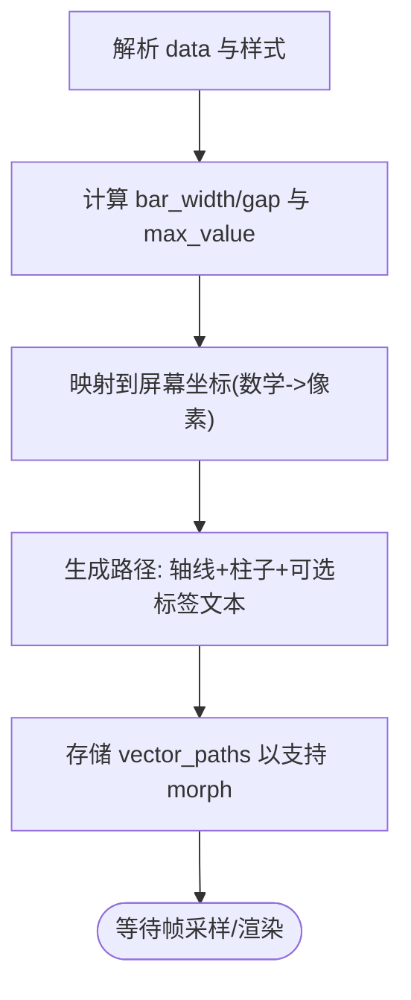
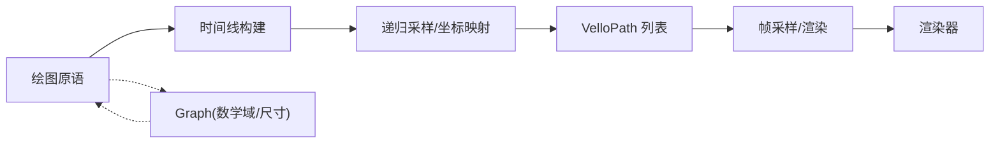

# 图表与绘图原语

<cite>
**本文引用的文件**
- [plot.rs](file://crates/animatix/src/primitives/plot.rs)
- [bar_chart.rs](file://crates/animatix/src/primitives/bar_chart.rs)
- [plot.rs（时间线）](file://crates/animatix/src/timeline/plot.rs)
- [07_plots.amx 示例](file://examples/07_plots.amx)
- [18_number_plane_contours.amx 示例](file://examples/18_number_plane_contours.amx)
- [bar_chart_primitive.md 设计文档](file://docs/design/bar_chart_primitive.md)
- [runtime_plot_params.md 设计文档](file://docs/design/runtime_plot_params.md)
- [primitives.md 文档](file://docs/primitives.md)
</cite>

## 目录
1. [简介](#简介)
2. [项目结构](#项目结构)
3. [核心组件](#核心组件)
4. [架构总览](#架构总览)
5. [详细组件分析](#详细组件分析)
6. [依赖关系分析](#依赖关系分析)
7. [性能考量](#性能考量)
8. [故障排查指南](#故障排查指南)
9. [结论](#结论)
10. [附录：示例与用法](#附录示例与用法)

## 简介
本章节面向 Animatix 的数据可视化原语，聚焦两类核心能力：
- 绘图原语：Graph、PlotCurve、VectorField、Heatmap、ContourSet、NumberPlane 等，用于生成数学函数曲线、向量场、热力图、等高线与数格背景等。
- 柱状图原语：BarChart，用于声明式地构建带标签、配色与基线的统计柱状图，并通过路径形态变化实现“生长”动画。

我们将从坐标系统与数据绑定、采样与渲染管线、属性与样式、以及与 Graph 的组合使用等方面进行系统化说明，并给出可直接参考的示例与最佳实践。

## 项目结构
与图表相关的核心代码分布在以下模块：
- primitives 层：定义原语元信息、默认属性与构建/评估入口
- timeline 层：解析属性、构建矢量路径、执行递归自适应采样、帧时间重采样
- examples 与 docs：提供示例场景与设计文档，便于理解坐标空间、参数与组合方式

**图示来源**
- [plot.rs:1-396](file://crates/animatix/src/primitives/plot.rs#L1-L396)
- [bar_chart.rs:1-82](file://crates/animatix/src/primitives/bar_chart.rs#L1-L82)
- [plot.rs（时间线）:1-812](file://crates/animatix/src/timeline/plot.rs#L1-L812)

**章节来源**
- [plot.rs:1-396](file://crates/animatix/src/primitives/plot.rs#L1-L396)
- [bar_chart.rs:1-82](file://crates/animatix/src/primitives/bar_chart.rs#L1-L82)

## 核心组件
- 绘图原语族
  - Graph：容器型数学坐标系，子元素共享同一数学域与尺寸
  - PlotCurve：数学函数曲线，支持笛卡尔/极坐标/参数式/隐式四种采样策略
  - VectorField：向量场
  - Heatmap：二维标量场热力图
  - ContourSet：等值线集合
  - NumberPlane：网格背景与刻度
- 柱状图原语
  - BarChart：声明式柱状图，内置数据、配色、间距、方向、轴线与标签等属性

这些原语均通过统一的构建/评估流程接入：原语在 build 阶段将自身属性与子项派发到时间线；在 evaluate 阶段根据当前帧环境与属性生成矢量路径，最终由渲染器绘制。

**章节来源**
- [plot.rs:20-396](file://crates/animatix/src/primitives/plot.rs#L20-L396)
- [bar_chart.rs:15-82](file://crates/animatix/src/primitives/bar_chart.rs#L15-L82)
- [primitives.md 文档:335-380](file://docs/primitives.md#L335-L380)

## 架构总览
下图展示了从原语到渲染的关键调用链路，涵盖构建派发、递归采样、帧时间重采样与路径生成。

**图示来源**
- [plot.rs:40-132](file://crates/animatix/src/primitives/plot.rs#L40-L132)
- [plot.rs（时间线）:613-800](file://crates/animatix/src/timeline/plot.rs#L613-L800)

## 详细组件分析

### 绘图原语：坐标系统与数据绑定
- 坐标空间
  - 数学域：x_domain/y_domain 决定数学范围；Graph 子元素继承父域
  - 视口尺寸：size 决定屏幕像素范围；原点通常位于局部中心
  - 映射公式：将数学坐标线性映射到屏幕像素，考虑上下/左右边距与可见性裁剪
- 数据绑定
  - PlotCurve 支持多种函数形式：y=f(x)、r=f(t)、(x(t),y(t))、f(x,y)=0
  - 函数体通过闭包表达，采样时按域区间递归细分，误差超过容差则继续细分
  - 运行时参数：PlotCurve 可读取帧环境中的变量（如 t、scene_*），并支持同演员参数注入
- 采样算法
  - 自适应细分：基于端点中点与直线插值的偏差平方阈值控制细分深度
  - 最大深度限制：防止无限递归
  - 可见性剔除：对完全不可见区域注入 NaN 分隔符，跳过无效区域
  - 断点处理：对陡峭跳跃（如渐近线）注入 NaN，避免跨区间连线

**图示来源**
- [plot.rs（时间线）:65-177](file://crates/animatix/src/timeline/plot.rs#L65-L177)

**章节来源**
- [plot.rs（时间线）:1-812](file://crates/animatix/src/timeline/plot.rs#L1-L812)
- [runtime_plot_params.md 设计文档:1-522](file://docs/design/runtime_plot_params.md#L1-L522)

### 绘图原语：PlotCurve 的曲线绘制
- 关键属性
  - kind：cartesian/polar/parametric/implicit
  - func：函数闭包
  - x_domain/y_domain/t_domain：采样域
  - tolerance/max_depth/resolution：采样质量与性能权衡
  - stroke_width/color：描边样式
- 动画与进度
  - 支持 stroke_progress 路径描边进度，实现“描边展开”效果
- 评估流程
  - build 阶段：收集属性，构建 ProceduralPlot
  - evaluate 阶段：按帧重采样，返回 Paths 渲染命令

**图示来源**
- [plot.rs:71-148](file://crates/animatix/src/primitives/plot.rs#L71-L148)
- [plot.rs（时间线）:613-800](file://crates/animatix/src/timeline/plot.rs#L613-L800)

**章节来源**
- [plot.rs:71-148](file://crates/animatix/src/primitives/plot.rs#L71-L148)

### 绘图原语：VectorField、Heatmap、ContourSet、NumberPlane
- VectorField：按密度采样网格点，计算向量并绘制箭头或流线
- Heatmap：在网格上评估标量函数，映射颜色强度
- ContourSet：对函数进行网格采样，利用等值线算法提取等高线
- NumberPlane：绘制网格与刻度，作为背景或坐标系参考

这些原语与 PlotCurve 共享相同的构建/评估框架，最终都返回矢量路径供渲染。

**章节来源**
- [plot.rs:150-396](file://crates/animatix/src/primitives/plot.rs#L150-L396)

### 柱状图原语：BarChart
- 数据模型
  - data：条目列表，每个条目包含分类键/数值或显式标签与数值
  - bar_width/gap：柱宽与间距（支持自动与像素/数学单位）
  - bar_colors/show_axis/show_labels：配色、是否显示基线与标签
  - direction：垂直/水平
  - max_value/x_domain/y_domain/size/at：缩放与定位
- 构建与渲染
  - build 阶段：解析 data 与样式，生成稳定的路径序列（轴线、每根柱子、可选标签文本）
  - evaluate 阶段：返回 RenderCommand::Paths，配合现有路径 morph 实现“生长”动画
- 与 Graph 的集成
  - 在 Graph 内部使用时，继承父图的数学域与尺寸，数值键映射到数学坐标
  - 可选择隐藏轴线，让父图 Tick 标签承担数值标注

**图示来源**
- [bar_chart_primitive.md 设计文档:275-345](file://docs/design/bar_chart_primitive.md#L275-L345)

**章节来源**
- [bar_chart.rs:15-82](file://crates/animatix/src/primitives/bar_chart.rs#L15-L82)
- [bar_chart_primitive.md 设计文档:156-345](file://docs/design/bar_chart_primitive.md#L156-L345)

## 依赖关系分析
- 原语与时间线
  - 所有绘图原语通过 process_plot_actor_dispatch 将构建任务委派给时间线
  - 时间线根据 kind 选择对应的采样器，生成 VelloPath 并写入 vector_paths
- 运行时参数
  - PlotCurve 支持在帧时间读取环境变量与同演员参数，实现频率、相位等参数的动画
- 与 Graph 的关系
  - BarChart/PlotCurve 在 Graph 子树内共享数学域与尺寸，标签与刻度由父图负责

**图示来源**
- [plot.rs:40-132](file://crates/animatix/src/primitives/plot.rs#L40-L132)
- [plot.rs（时间线）:613-800](file://crates/animatix/src/timeline/plot.rs#L613-L800)

**章节来源**
- [plot.rs:40-132](file://crates/animatix/src/primitives/plot.rs#L40-L132)
- [runtime_plot_params.md 设计文档:1-522](file://docs/design/runtime_plot_params.md#L1-L522)

## 性能考量
- 采样质量与成本
  - tolerance 控制几何保真度与采样点数量；越小越准确但更耗时
  - max_depth 限制递归深度，避免极端情况下的无限细分
  - resolution 控制隐式/热力图网格分辨率
- 可见性剔除
  - 对完全不可见区域注入 NaN 分隔符，减少无效计算
- 路径 morph
  - BarChart 使用 vector_paths morph，要求路径拓扑稳定，适合“生长”类动画
- 建议
  - 复杂隐式/热力图优先降低分辨率或增大容差
  - 频繁动画参数变化时，确保路径拓扑一致，避免抖动

[本节为通用指导，无需特定文件引用]

## 故障排查指南
- PlotCurve 曲线不完整或断开
  - 检查 x_domain/y_domain 是否覆盖关键区间
  - 提升 tolerance 或 max_depth；确认函数在边界附近无奇点
- VectorField 密度过低或过高
  - 调整 density；注意密度与分辨率的平衡
- Heatmap 颜色异常
  - 检查函数取值范围与颜色映射；必要时固定 max_value
- ContourSet 等值线缺失
  - 增加 resolution；确认 levels 覆盖函数取值范围
- BarChart 标签/轴线未显示
  - 确认 show_labels/show_axis 设置；在 Graph 内部可隐藏轴线以避免重复
- 运行时参数未生效
  - 确认参数名未与采样变量冲突；PlotCurve 支持同演员参数与环境变量注入

**章节来源**
- [runtime_plot_params.md 设计文档:119-144](file://docs/design/runtime_plot_params.md#L119-L144)
- [bar_chart_primitive.md 设计文档:445-462](file://docs/design/bar_chart_primitive.md#L445-L462)

## 结论
Animatix 的绘图与柱状图原语通过统一的构建/评估框架与递归自适应采样，实现了从数学函数到矢量路径的高效生成。PlotCurve 提供灵活的函数表达与运行时参数注入，BarChart 则以声明式语法快速构建统计图形，并借助 vector_paths morph 实现自然的“生长”动画。结合 Graph 的数学域与尺寸，用户可以轻松组合多种可视化元素，构建复杂的动态数据图。

[本节为总结，无需特定文件引用]

## 附录：示例与用法
- PlotCurve 与多类型函数
  - 示例：笛卡尔正弦、阻尼振荡、极坐标玫瑰线、参数式利萨茹曲线、隐式圆
  - 关键点：合理设置 x_domain/t_domain、tolerance、max_depth、resolution
- VectorField 与 Heatmap
  - 示例：向量场叠加热力图，展示场强与方向
- NumberPlane 与 ContourSet
  - 示例：网格背景 + 等值线 + 向量场，形成清晰的数学背景
- BarChart 单独使用与嵌入 Graph
  - 单独使用：data、bar_width、gap、bar_colors、show_axis、show_labels、direction、max_value、x_domain/y_domain、size、color/stroke/stroke_width
  - 嵌入 Graph：继承父图数学域，隐藏轴线，避免重复标注

**章节来源**
- [07_plots.amx 示例:1-37](file://examples/07_plots.amx#L1-L37)
- [18_number_plane_contours.amx 示例:1-48](file://examples/18_number_plane_contours.amx#L1-L48)
- [primitives.md 文档:335-380](file://docs/primitives.md#L335-L380)
- [bar_chart_primitive.md 设计文档:17-177](file://docs/design/bar_chart_primitive.md#L17-L177)