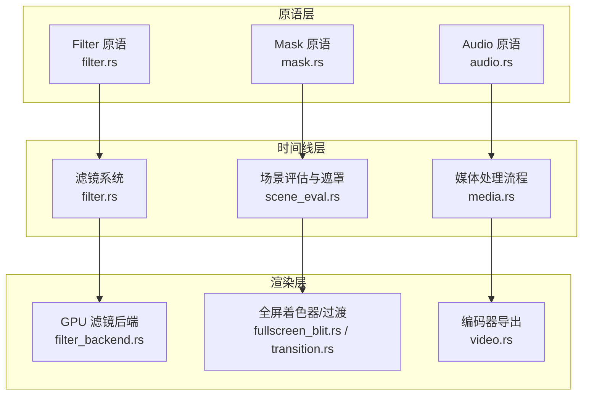
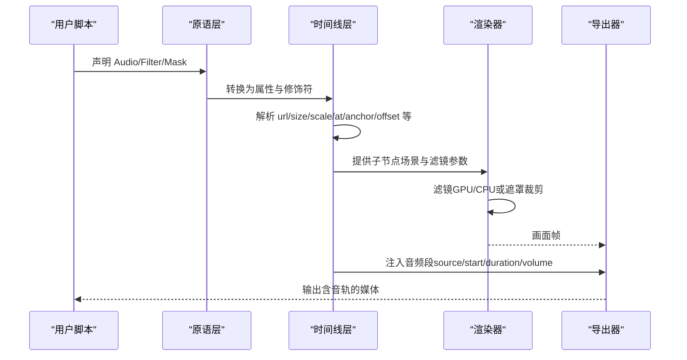
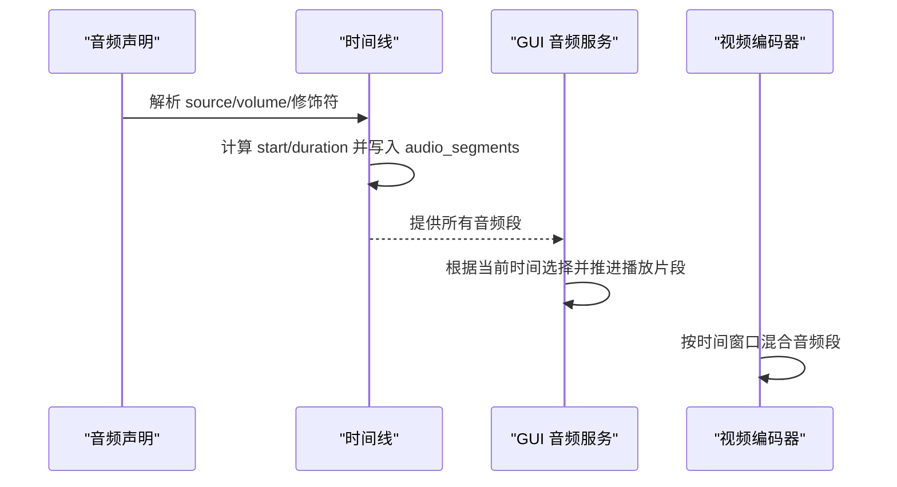
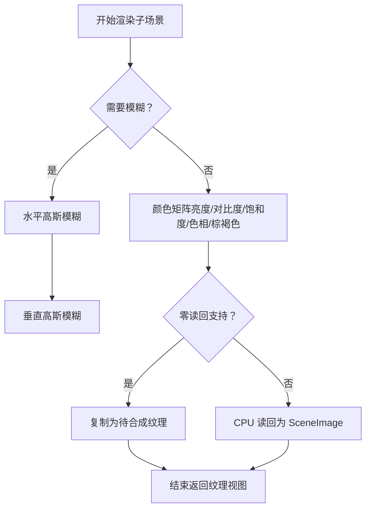
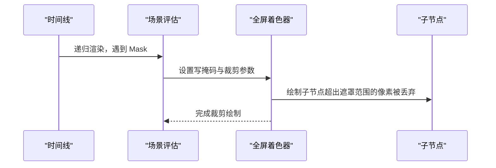
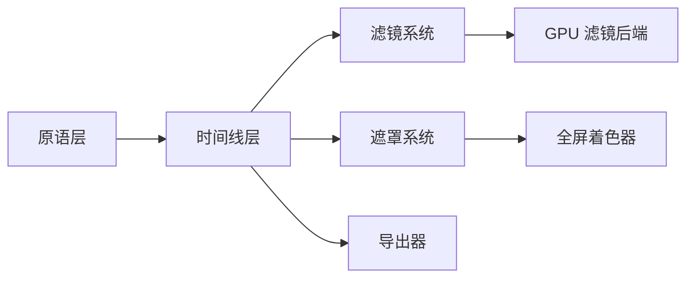

# 媒体原语

<cite>
**本文引用的文件**
- [crates/animatix/src/primitives/audio.rs](file://crates/animatix/src/primitives/audio.rs)
- [crates/animatix/src/primitives/filter.rs](file://crates/animatix/src/primitives/filter.rs)
- [crates/animatix/src/primitives/mask.rs](file://crates/animatix/src/primitives/mask.rs)
- [crates/animatix/src/timeline/media.rs](file://crates/animatix/src/timeline/media.rs)
- [crates/animatix/src/timeline/filter.rs](file://crates/animatix/src/timeline/filter.rs)
- [crates/animatix/src/renderer/filter_backend.rs](file://crates/animatix/src/renderer/filter_backend.rs)
- [crates/animatix/src/timeline/scene_eval.rs](file://crates/animatix/src/timeline/scene_eval.rs)
- [crates/animatix/src/renderer/fullscreen_blit.rs](file://crates/animatix/src/renderer/fullscreen_blit.rs)
- [crates/animatix/src/renderer/transition.rs](file://crates/animatix/src/renderer/transition.rs)
- [crates/animatix/src/timeline/mod.rs](file://crates/animatix/src/timeline/mod.rs)
- [crates/animatix/src/renderer/encode/video.rs](file://crates/animatix/src/renderer/encode/video.rs)
- [crates/animatix-gui/src/app/audio.rs](file://crates/animatix-gui/src/app/audio.rs)
- [examples/08_effects.amx](file://examples/08_effects.amx)
- [examples/17_audio_reactive.amx](file://examples/17_audio_reactive.amx)
</cite>

## 目录
1. [简介](#简介)
2. [项目结构](#项目结构)
3. [核心组件](#核心组件)
4. [架构总览](#架构总览)
5. [详细组件分析](#详细组件分析)
6. [依赖关系分析](#依赖关系分析)
7. [性能考量](#性能考量)
8. [故障排查指南](#故障排查指南)
9. [结论](#结论)
10. [附录](#附录)

## 简介
本文件聚焦 Animatix 的媒体原语，系统性阐述三类原语的多媒体处理能力与使用方法：
- 音频原语（Audio）：非可视音频轨道，负责在导出阶段进行音视频混合；支持音量、起始与时长等声明式配置。
- 滤镜原语（Filter）：容器型原语，对子节点渲染结果进行离屏合成与后处理（如高斯模糊、亮度/对比度/饱和度/色相旋转/棕褐色等），支持 CPU/GPU 双路径。
- 遮罩原语（Mask）：容器型原语，通过裁剪实现形状遮罩、渐变遮罩与复合遮罩，限定子节点可见区域。

同时，文档结合示例场景，给出多媒体动画的综合实践思路，帮助读者理解如何将音频与视觉效果协同创作。

## 项目结构
媒体原语位于“原语层”（primitives）与“时间线层”（timeline）之间，构建期由原语描述驱动时间线构建，运行期由渲染器执行实际绘制与后处理。滤镜原语涉及独立的 GPU 后端以实现高效滤镜管线，遮罩原语通过场景评估与全屏着色器实现裁剪。

图表来源
- [crates/animatix/src/primitives/audio.rs:10-51](file://crates/animatix/src/primitives/audio.rs#L10-L51)
- [crates/animatix/src/primitives/filter.rs:17-52](file://crates/animatix/src/primitives/filter.rs#L17-L52)
- [crates/animatix/src/primitives/mask.rs:14-50](file://crates/animatix/src/primitives/mask.rs#L14-L50)
- [crates/animatix/src/timeline/media.rs:117-345](file://crates/animatix/src/timeline/media.rs#L117-L345)
- [crates/animatix/src/timeline/filter.rs:22-73](file://crates/animatix/src/timeline/filter.rs#L22-L73)
- [crates/animatix/src/renderer/filter_backend.rs:184-755](file://crates/animatix/src/renderer/filter_backend.rs#L184-L755)
- [crates/animatix/src/timeline/scene_eval.rs:486-486](file://crates/animatix/src/timeline/scene_eval.rs#L486-L486)
- [crates/animatix/src/renderer/fullscreen_blit.rs:120-203](file://crates/animatix/src/renderer/fullscreen_blit.rs#L120-L203)
- [crates/animatix/src/renderer/transition.rs:178-282](file://crates/animatix/src/renderer/transition.rs#L178-L282)
- [crates/animatix/src/renderer/encode/video.rs:263-551](file://crates/animatix/src/renderer/encode/video.rs#L263-L551)

章节来源
- [crates/animatix/src/primitives/audio.rs:10-51](file://crates/animatix/src/primitives/audio.rs#L10-L51)
- [crates/animatix/src/primitives/filter.rs:17-52](file://crates/animatix/src/primitives/filter.rs#L17-L52)
- [crates/animatix/src/primitives/mask.rs:14-50](file://crates/animatix/src/primitives/mask.rs#L14-L50)
- [crates/animatix/src/timeline/media.rs:117-345](file://crates/animatix/src/timeline/media.rs#L117-L345)

## 核心组件
- 音频原语（Audio）
  - 类别：媒体类
  - 构建行为：将声明属性解析并注册到时间线的音频段列表，用于导出阶段的音视频混合
  - 默认属性：source（音频路径）、volume（音量）
- 滤镜原语（Filter）
  - 类别：容器类
  - 构建行为：交由时间线处理子节点渲染与后处理
  - 渲染行为：对子节点离屏合成，应用模糊与颜色矩阵（亮度/对比度/饱和度/色相旋转/棕褐色）
- 遮罩原语（Mask）
  - 类别：容器类
  - 构建行为：记录遮罩尺寸等信息
  - 渲染行为：通过全屏着色器与写掩码实现子节点裁剪

章节来源
- [crates/animatix/src/primitives/audio.rs:10-51](file://crates/animatix/src/primitives/audio.rs#L10-L51)
- [crates/animatix/src/primitives/filter.rs:17-52](file://crates/animatix/src/primitives/filter.rs#L17-L52)
- [crates/animatix/src/primitives/mask.rs:14-50](file://crates/animatix/src/primitives/mask.rs#L14-L50)

## 架构总览
媒体原语的处理链路如下：
- 原语层负责将声明转换为时间线数据结构
- 时间线层解析属性、位置绑定与关键帧
- 渲染层根据原语类型执行不同策略：滤镜走 GPU/CPU 后端，遮罩走全屏裁剪通道
- 导出阶段将音频段与画面合成

图表来源
- [crates/animatix/src/primitives/audio.rs:18-35](file://crates/animatix/src/primitives/audio.rs#L18-L35)
- [crates/animatix/src/timeline/media.rs:256-343](file://crates/animatix/src/timeline/media.rs#L256-L343)
- [crates/animatix/src/timeline/filter.rs:30-48](file://crates/animatix/src/timeline/filter.rs#L30-L48)
- [crates/animatix/src/renderer/filter_backend.rs:619-746](file://crates/animatix/src/renderer/filter_backend.rs#L619-L746)
- [crates/animatix/src/renderer/encode/video.rs:263-551](file://crates/animatix/src/renderer/encode/video.rs#L263-L551)

## 详细组件分析

### 音频原语（Audio）
- 处理流程
  - 构建阶段：解析 source、volume 等属性，结合修饰符（延迟、持续时间）计算起始与结束时间，写入时间线的音频段列表
  - 运行阶段：GUI 预览中可基于时间与播放状态选择性启动/推进对应音频段
  - 导出阶段：按音频段顺序与时间窗口进行混音输出
- 关键点
  - 当前不支持在声明中对 source/volume 进行动画化（未来计划支持属性轨迹）
  - 缺少音频同步与频谱分析功能；频谱可视化需通过外部波形条等手段配合时间变量实现

图表来源
- [crates/animatix/src/timeline/media.rs:256-343](file://crates/animatix/src/timeline/media.rs#L256-L343)
- [crates/animatix-gui/src/app/audio.rs:100-216](file://crates/animatix-gui/src/app/audio.rs#L100-L216)
- [crates/animatix/src/renderer/encode/video.rs:263-551](file://crates/animatix/src/renderer/encode/video.rs#L263-L551)

章节来源
- [crates/animatix/src/primitives/audio.rs:10-51](file://crates/animatix/src/primitives/audio.rs#L10-L51)
- [crates/animatix/src/timeline/media.rs:256-343](file://crates/animatix/src/timeline/media.rs#L256-L343)
- [crates/animatix-gui/src/app/audio.rs:100-216](file://crates/animatix-gui/src/app/audio.rs#L100-L216)

### 滤镜原语（Filter）
- 功能概述
  - 对子节点渲染结果进行离屏合成，再应用后处理（模糊、颜色矩阵）
  - 支持 CPU 与 GPU 两种路径：GPU 路径通过 WGSL 计算着色器实现，CPU 路径使用图像库进行像素级变换
- 实现要点
  - GPU 路径包含两步：水平/垂直两次高斯模糊与一次颜色矩阵（亮度/对比度/饱和度/色相旋转/棕褐色）组合
  - 颜色矩阵按固定顺序组合（棕褐色 → 色相 → 饱和度 → 对比度 → 亮度）
  - 提供零读回合成路径（仅在支持的后端可用），避免 CPU 读回，直接在 GPU 上合成

图表来源
- [crates/animatix/src/timeline/filter.rs:81-130](file://crates/animatix/src/timeline/filter.rs#L81-L130)
- [crates/animatix/src/timeline/filter.rs:132-162](file://crates/animatix/src/timeline/filter.rs#L132-L162)
- [crates/animatix/src/renderer/filter_backend.rs:619-746](file://crates/animatix/src/renderer/filter_backend.rs#L619-L746)

章节来源
- [crates/animatix/src/primitives/filter.rs:17-52](file://crates/animatix/src/primitives/filter.rs#L17-L52)
- [crates/animatix/src/timeline/filter.rs:22-73](file://crates/animatix/src/timeline/filter.rs#L22-L73)
- [crates/animatix/src/renderer/filter_backend.rs:184-755](file://crates/animatix/src/renderer/filter_backend.rs#L184-L755)

### 遮罩原语（Mask）
- 功能概述
  - 容器型原语，通过全屏着色器与写掩码机制对子节点进行裁剪
  - 支持基于自身尺寸的矩形裁剪，亦可通过更复杂的遮罩定义扩展（例如 SVG 遮罩）
- 实现要点
  - 场景评估阶段会识别遮罩节点并将其子节点限制在遮罩边界内
  - 全屏着色器与写掩码确保只有遮罩范围内的像素被写入目标

图表来源
- [crates/animatix/src/timeline/scene_eval.rs:486-486](file://crates/animatix/src/timeline/scene_eval.rs#L486-L486)
- [crates/animatix/src/renderer/fullscreen_blit.rs:120-203](file://crates/animatix/src/renderer/fullscreen_blit.rs#L120-L203)
- [crates/animatix/src/renderer/transition.rs:178-282](file://crates/animatix/src/renderer/transition.rs#L178-L282)

章节来源
- [crates/animatix/src/primitives/mask.rs:14-50](file://crates/animatix/src/primitives/mask.rs#L14-L50)
- [crates/animatix/src/timeline/scene_eval.rs:486-486](file://crates/animatix/src/timeline/scene_eval.rs#L486-L486)
- [crates/animatix/src/renderer/fullscreen_blit.rs:120-203](file://crates/animatix/src/renderer/fullscreen_blit.rs#L120-L203)
- [crates/animatix/src/renderer/transition.rs:178-282](file://crates/animatix/src/renderer/transition.rs#L178-L282)

## 依赖关系分析
- 原语层与时间线层
  - Audio/Filter/Mask 的 build/evaluate 逻辑委托给时间线的媒体处理与滤镜系统
- 时间线层与渲染层
  - 滤镜系统依赖 GPU 后端执行计算着色器；遮罩系统依赖全屏着色器与写掩码
- 导出层
  - 视频编码器从时间线读取音频段，按时间窗口进行混音

图表来源
- [crates/animatix/src/timeline/media.rs:117-345](file://crates/animatix/src/timeline/media.rs#L117-L345)
- [crates/animatix/src/timeline/filter.rs:22-73](file://crates/animatix/src/timeline/filter.rs#L22-L73)
- [crates/animatix/src/renderer/filter_backend.rs:184-755](file://crates/animatix/src/renderer/filter_backend.rs#L184-L755)
- [crates/animatix/src/renderer/fullscreen_blit.rs:120-203](file://crates/animatix/src/renderer/fullscreen_blit.rs#L120-L203)
- [crates/animatix/src/renderer/encode/video.rs:263-551](file://crates/animatix/src/renderer/encode/video.rs#L263-L551)

章节来源
- [crates/animatix/src/timeline/media.rs:117-345](file://crates/animatix/src/timeline/media.rs#L117-L345)
- [crates/animatix/src/timeline/filter.rs:22-73](file://crates/animatix/src/timeline/filter.rs#L22-L73)
- [crates/animatix/src/renderer/filter_backend.rs:184-755](file://crates/animatix/src/renderer/filter_backend.rs#L184-L755)
- [crates/animatix/src/renderer/fullscreen_blit.rs:120-203](file://crates/animatix/src/renderer/fullscreen_blit.rs#L120-L203)
- [crates/animatix/src/renderer/encode/video.rs:263-551](file://crates/animatix/src/renderer/encode/video.rs#L263-L551)

## 性能考量
- 滤镜性能
  - GPU 路径：利用 WGSL 计算着色器，适合大规模像素操作；零读回路径进一步减少 CPU 读回开销
  - CPU 路径：适用于小尺寸或低频更新场景；注意像素遍历与颜色矩阵的复杂度
- 遮罩性能
  - 全屏着色器与写掩码是高效的裁剪手段；尽量避免过度嵌套遮罩层级
- 音频性能
  - 导出阶段按时间窗口混合音频段，建议合理设置起止时间与音量包络，避免冗余片段

## 故障排查指南
- 音频无输出
  - 检查 source 是否为空；若为空会在构建阶段产生警告
  - 确认修饰符（延迟/持续时间）是否导致音频段落在当前时间窗口之外
- 滤镜无效
  - 若未启用任何滤镜参数，可能走零滤镜快速路径；请确认参数阈值与组合顺序
  - 在不支持零读回的后端上，CPU 读回路径会触发；检查设备/队列初始化是否成功
- 遮罩不生效
  - 确认遮罩尺寸与子节点位置关系；遮罩裁剪基于遮罩自身的边界
  - 检查全屏着色器写掩码是否正确启用

章节来源
- [crates/animatix/src/timeline/media.rs:312-322](file://crates/animatix/src/timeline/media.rs#L312-L322)
- [crates/animatix/src/timeline/filter.rs:30-48](file://crates/animatix/src/timeline/filter.rs#L30-L48)
- [crates/animatix/src/renderer/filter_backend.rs:184-196](file://crates/animatix/src/renderer/filter_backend.rs#L184-L196)

## 结论
- Audio 原语专注于非可视音频轨道的声明与导出混音，当前不支持属性动画与频谱分析
- Filter 原语提供强大的后处理能力，支持 GPU/CPU 双路径与零读回优化
- Mask 原语通过全屏裁剪实现灵活的可见区域控制
- 将三者结合，可在同一场景中实现“声音驱动的视觉节奏”和“风格化的视觉呈现”

## 附录
- 示例参考
  - 滤镜与效果组合：[examples/08_effects.amx](file://examples/08_effects.amx)
  - 音频反应式动画：[examples/17_audio_reactive.amx](file://examples/17_audio_reactive.amx)