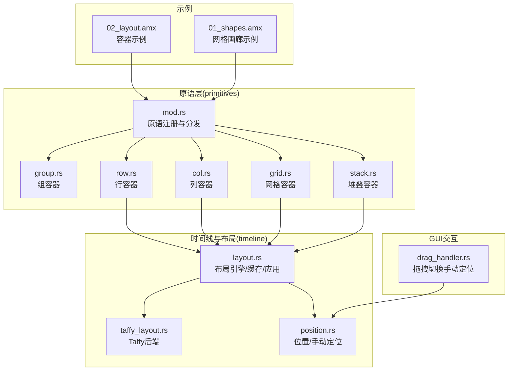
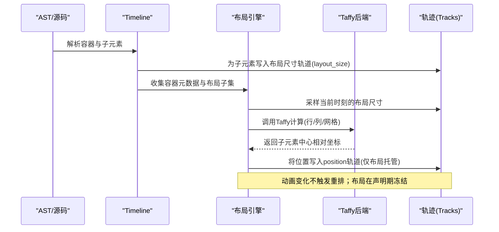
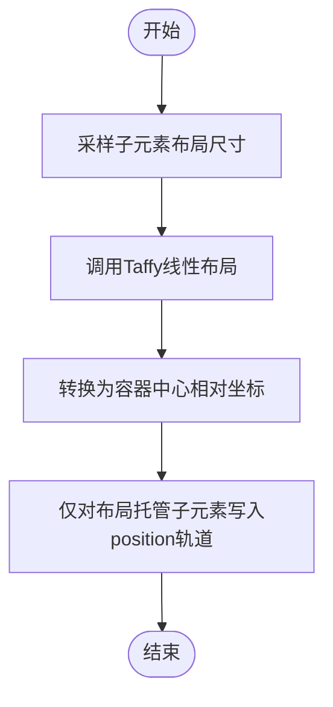
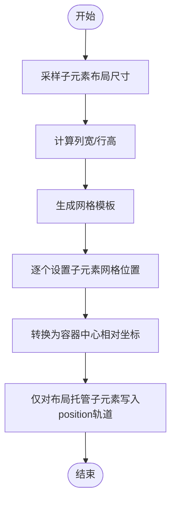
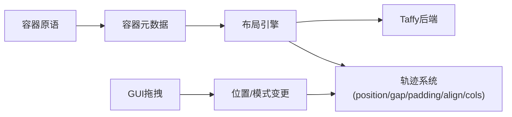

# 容器原语

<cite>
**本文引用的文件**
- [group.rs](file://crates/animatix/src/primitives/group.rs)
- [row.rs](file://crates/animatix/src/primitives/row.rs)
- [col.rs](file://crates/animatix/src/primitives/col.rs)
- [grid.rs](file://crates/animatix/src/primitives/grid.rs)
- [stack.rs](file://crates/animatix/src/primitives/stack.rs)
- [mod.rs](file://crates/animatix/src/primitives/mod.rs)
- [layout.rs](file://crates/animatix/src/timeline/layout.rs)
- [taffy_layout.rs](file://crates/animatix/src/timeline/taffy_layout.rs)
- [position.rs](file://crates/animatix/src/timeline/position.rs)
- [drag_handler.rs](file://crates/animatix-gui/src/app/preview/drag_handler.rs)
- [02_layout.amx](file://examples/02_layout.amx)
- [01_shapes.amx](file://examples/01_shapes.amx)
</cite>

## 目录
1. [简介](#简介)
2. [项目结构](#项目结构)
3. [核心组件](#核心组件)
4. [架构总览](#架构总览)
5. [详细组件分析](#详细组件分析)
6. [依赖关系分析](#依赖关系分析)
7. [性能考量](#性能考量)
8. [故障排查指南](#故障排查指南)
9. [结论](#结论)
10. [附录](#附录)

## 简介
本文件系统性阐述 Animatix 中“容器原语”的布局架构与实现原理，覆盖组(group)、行(row)、列(col)、网格(grid)与堆叠(stack)五类容器。文档重点解释：
- 布局算法：弹性布局（行/列）、网格布局与层叠布局的实现机制
- 子元素管理与空间分配：主轴/交叉轴计算、间隙与内边距的作用
- 响应式设计支持：尺寸约束、对齐方式与间距控制
- 实战示例：如何通过组合容器构建复杂界面布局

## 项目结构
Animatix 的容器原语位于 primitives 模块中，每种容器以独立模块实现，并在统一注册表中集中管理；布局计算由 timeline 模块的布局引擎与 Taffy 引擎协作完成。

**图示来源**
- [mod.rs:575-586](file://crates/animatix/src/primitives/mod.rs#L575-L586)
- [layout.rs:107-132](file://crates/animatix/src/timeline/layout.rs#L107-L132)
- [taffy_layout.rs:59-120](file://crates/animatix/src/timeline/taffy_layout.rs#L59-L120)
- [position.rs:167-201](file://crates/animatix/src/timeline/position.rs#L167-L201)
- [drag_handler.rs:290-305](file://crates/animatix-gui/src/app/preview/drag_handler.rs#L290-L305)

**章节来源**
- [mod.rs:30-40](file://crates/animatix/src/primitives/mod.rs#L30-L40)
- [mod.rs:169-194](file://crates/animatix/src/primitives/mod.rs#L169-L194)

## 核心组件
- 组(group)：作为容器存在但采用传统分派路径构建，不直接参与新的布局管线。
- 行(row)/列(col)/网格(grid)/堆叠(stack)：均为容器原语，具备默认属性（gap、padding、align），并由布局引擎统一调度。
- 原语注册：所有原语通过静态数组集中注册，便于元数据生成与查找。

**章节来源**
- [group.rs:14-45](file://crates/animatix/src/primitives/group.rs#L14-L45)
- [row.rs:14-49](file://crates/animatix/src/primitives/row.rs#L14-L49)
- [col.rs:14-49](file://crates/animatix/src/primitives/col.rs#L14-L49)
- [grid.rs:14-50](file://crates/animatix/src/primitives/grid.rs#L14-L50)
- [stack.rs:14-49](file://crates/animatix/src/primitives/stack.rs#L14-L49)
- [mod.rs:575-586](file://crates/animatix/src/primitives/mod.rs#L575-L586)

## 架构总览
容器布局遵循“声明期测量、冻结放置”的契约：容器在构建时从专用布局尺寸轨道采样子元素半尺寸，结合 gap/padding/align(cols) 计算相对容器中心的子元素位置，且动画改变布局尺寸轨道时不会重新采样布局。

**图示来源**
- [layout.rs:4-28](file://crates/animatix/src/timeline/layout.rs#L4-L28)
- [layout.rs:140-200](file://crates/animatix/src/timeline/layout.rs#L140-L200)
- [taffy_layout.rs:59-120](file://crates/animatix/src/timeline/taffy_layout.rs#L59-L120)

## 详细组件分析

### 行(row)容器
- 角色：水平线性布局容器，子元素沿 X 轴排列。
- 默认属性：gap、padding、align（默认居中）。
- 布局算法：委托给 Taffy 的线性布局，gap 映射为行间间距，align 影响交叉轴对齐。
- 主轴/交叉轴：X 为主轴，Y 为交叉轴；align 控制垂直对齐。

**图示来源**
- [row.rs:42-48](file://crates/animatix/src/primitives/row.rs#L42-L48)
- [layout.rs:53-68](file://crates/animatix/src/timeline/layout.rs#L53-L68)
- [taffy_layout.rs:59-120](file://crates/animatix/src/timeline/taffy_layout.rs#L59-L120)

**章节来源**
- [row.rs:14-49](file://crates/animatix/src/primitives/row.rs#L14-L49)
- [layout.rs:53-68](file://crates/animatix/src/timeline/layout.rs#L53-L68)

### 列(col)容器
- 角色：垂直线性布局容器，子元素沿 Y 轴排列。
- 默认属性：gap、padding、align（默认居中）。
- 布局算法：与行容器一致，区别在于主轴为 Y，交叉轴为 X。

**章节来源**
- [col.rs:14-49](file://crates/animatix/src/primitives/col.rs#L14-L49)
- [layout.rs:53-68](file://crates/animatix/src/timeline/layout.rs#L53-L68)

### 网格(grid)容器
- 角色：二维网格布局容器，按行列自动铺排。
- 默认属性：gap、padding、align、cols（列数）。
- 布局算法：基于 Taffy 的网格布局，先计算列宽/行高（考虑所有子元素尺寸），再按 cols 自动换行布置。

**图示来源**
- [grid.rs:42-49](file://crates/animatix/src/primitives/grid.rs#L42-L49)
- [layout.rs:72-80](file://crates/animatix/src/timeline/layout.rs#L72-L80)
- [taffy_layout.rs:123-215](file://crates/animatix/src/timeline/taffy_layout.rs#L123-L215)

**章节来源**
- [grid.rs:14-50](file://crates/animatix/src/primitives/grid.rs#L14-L50)
- [layout.rs:72-80](file://crates/animatix/src/timeline/layout.rs#L72-L80)

### 堆叠(stack)容器
- 角色：所有子元素统一放置于容器原点(0,0)，适合叠加效果或遮罩。
- 默认属性：gap、padding、align。
- 布局算法：直接返回全零偏移，不参与 Taffy 计算。

**章节来源**
- [stack.rs:14-49](file://crates/animatix/src/primitives/stack.rs#L14-L49)
- [layout.rs:47-49](file://crates/animatix/src/timeline/layout.rs#L47-L49)

### 组(group)容器
- 角色：容器类型，但构建逻辑走传统分派路径，不直接参与新布局管线。
- 用途：作为逻辑分组或承载修饰符，不改变子元素布局。

**章节来源**
- [group.rs:14-45](file://crates/animatix/src/primitives/group.rs#L14-L45)

### 原语注册与分发
- 所有原语在静态数组中注册，自动生成元数据注册表，支持按类型名查找与分发。
- 容器原语均标记为容器类别，具备统一的构建/评估接口。

**章节来源**
- [mod.rs:575-586](file://crates/animatix/src/primitives/mod.rs#L575-L586)
- [mod.rs:592-641](file://crates/animatix/src/primitives/mod.rs#L592-L641)

## 依赖关系分析
- 容器原语依赖 timeline 的布局元数据与轨迹系统，用于读取 gap/padding/align/cols 等属性。
- 布局引擎通过 Taffy 后端执行具体布局计算，并将结果写回 position 轨道。
- 手动定位模式通过 position 轨道与 placement_mode 轨道协同，允许作者对特定子元素进行手工定位。

**图示来源**
- [layout.rs:107-132](file://crates/animatix/src/timeline/layout.rs#L107-L132)
- [taffy_layout.rs:59-120](file://crates/animatix/src/timeline/taffy_layout.rs#L59-L120)
- [position.rs:167-201](file://crates/animatix/src/timeline/position.rs#L167-L201)
- [drag_handler.rs:290-305](file://crates/animatix-gui/src/app/preview/drag_handler.rs#L290-L305)

**章节来源**
- [layout.rs:107-132](file://crates/animatix/src/timeline/layout.rs#L107-L132)
- [position.rs:167-201](file://crates/animatix/src/timeline/position.rs#L167-L201)

## 性能考量
- 声明期布局：布局在构建时计算并冻结，避免动画过程中重复采样与重排，提升可预测性与性能。
- 缓存策略：布局引擎按子元素半尺寸与排列模式指纹缓存结果，减少重复计算。
- 手动子元素：参与容器尺寸计算但不被分配位置，降低布局复杂度。

**章节来源**
- [layout.rs:4-28](file://crates/animatix/src/timeline/layout.rs#L4-L28)
- [layout.rs:134-200](file://crates/animatix/src/timeline/layout.rs#L134-L200)

## 故障排查指南
- 子元素未被纳入布局：若子元素未预置布局尺寸，则会被排除在布局集合之外，并产生告警诊断。
- 手动定位冲突：当子元素处于手动定位模式时，布局引擎不会为其分配位置，但其尺寸仍会参与容器尺寸计算。
- 位置写入范围：仅对“布局托管”子元素写入 position 轨道，确保布局一致性。

**章节来源**
- [layout.rs:203-219](file://crates/animatix/src/timeline/layout.rs#L203-L219)
- [layout.rs:266-308](file://crates/animatix/src/timeline/layout.rs#L266-L308)
- [position.rs:167-201](file://crates/animatix/src/timeline/position.rs#L167-L201)

## 结论
Animatix 的容器原语通过“声明期布局 + Taffy 后端”的架构，在保证布局确定性的同时提供了强大的弹性与网格布局能力。行/列容器负责一维线性排列，网格容器负责二维铺排，堆叠容器用于原点叠加，组容器则承担逻辑分组职责。配合 gap/padding/align/cols 等属性与手动定位模式，开发者可以灵活构建复杂界面布局。

## 附录

### 使用示例与最佳实践
- 行/列/网格/堆叠基础示例：参见示例脚本，演示容器的基本属性与子元素排列。
- 网格画廊示例：通过网格容器与列数控制实现画廊布局。
- 手动定位切换：在 GUI 中按住 Shift 并拖拽，可将布局托管子元素切换为手动定位并写入当前位置。

**章节来源**
- [02_layout.amx:5-26](file://examples/02_layout.amx#L5-L26)
- [01_shapes.amx:5-34](file://examples/01_shapes.amx#L5-L34)
- [drag_handler.rs:290-305](file://crates/animatix-gui/src/app/preview/drag_handler.rs#L290-L305)