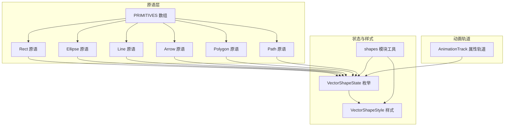
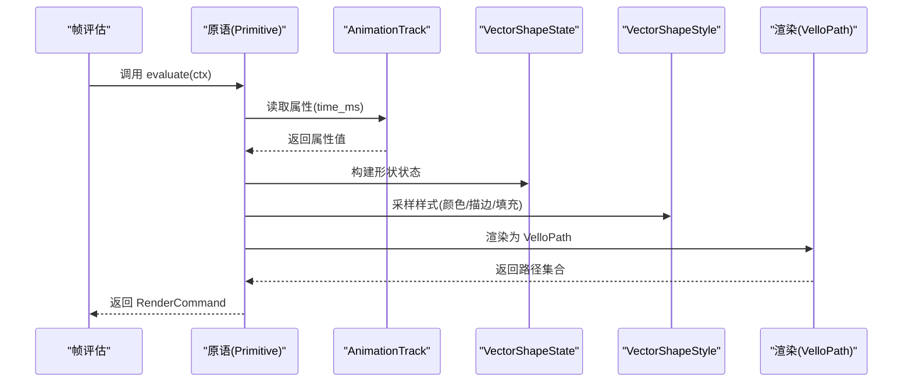
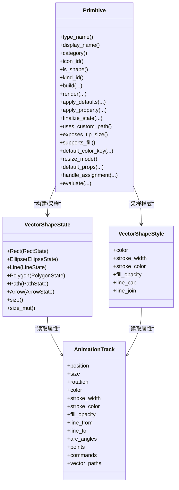

# 形状原语

<cite>
**本文引用的文件**
- [crates/animatix/src/primitives/mod.rs](file://crates/animatix/src/primitives/mod.rs)
- [crates/animatix/src/primitives/rect.rs](file://crates/animatix/src/primitives/rect.rs)
- [crates/animatix/src/primitives/ellipse.rs](file://crates/animatix/src/primitives/ellipse.rs)
- [crates/animatix/src/primitives/path.rs](file://crates/animatix/src/primitives/path.rs)
- [crates/animatix/src/primitives/polygon.rs](file://crates/animatix/src/primitives/polygon.rs)
- [crates/animatix/src/primitives/line.rs](file://crates/animatix/src/primitives/line.rs)
- [crates/animatix/src/primitives/arrow.rs](file://crates/animatix/src/primitives/arrow.rs)
- [crates/animatix/src/timeline/shapes/mod.rs](file://crates/animatix/src/timeline/shapes/mod.rs)
- [crates/animatix/src/timeline/track.rs](file://crates/animatix/src/timeline/track.rs)
- [crates/animatix/src/timeline/actor_kind.rs](file://crates/animatix/src/timeline/actor_kind.rs)
- [examples/01_shapes.amx](file://examples/01_shapes.amx)
- [examples/13_paths.amx](file://examples/13_paths.amx)
</cite>

## 目录
1. [简介](#简介)
2. [项目结构](#项目结构)
3. [核心组件](#核心组件)
4. [架构总览](#架构总览)
5. [详细组件分析](#详细组件分析)
6. [依赖关系分析](#依赖关系分析)
7. [性能考量](#性能考量)
8. [故障排查指南](#故障排查指南)
9. [结论](#结论)
10. [附录](#附录)

## 简介
本篇文档聚焦于 Animatix 的形状原语体系，系统性解析矩形(Rect)、椭圆(Ellipse)、路径(Path)、多边形(Polygon)、直线(Line)与箭头(Arrow)六类几何形状的设计与实现。我们将从属性系统、渲染管线、样式系统（填充与描边）到动画应用实践进行深入剖析，并通过示例脚本展示不同形状在动画中的典型用法。

## 项目结构
Animatix 将“演员类型”统一抽象为“原语”，形状原语位于 primitives 模块，每个形状原语均实现统一的 Primitive trait，并注册到全局 PRIMITIVES 数组中，由运行时按需分发。矢量形状的状态与样式定义集中在 timeline::shapes 模块，动画属性则由 AnimationTrack 提供时间维度的数据流。

图示来源
- [crates/animatix/src/primitives/mod.rs:575-586](file://crates/animatix/src/primitives/mod.rs#L575-L586)
- [crates/animatix/src/timeline/shapes/mod.rs:221-234](file://crates/animatix/src/timeline/shapes/mod.rs#L221-L234)
- [crates/animatix/src/timeline/track.rs:545-651](file://crates/animatix/src/timeline/track.rs#L545-L651)

章节来源
- [crates/animatix/src/primitives/mod.rs:1-727](file://crates/animatix/src/primitives/mod.rs#L1-L727)
- [crates/animatix/src/timeline/shapes/mod.rs:1-783](file://crates/animatix/src/timeline/shapes/mod.rs#L1-L783)
- [crates/animatix/src/timeline/track.rs:1-800](file://crates/animatix/src/timeline/track.rs#L1-L800)

## 核心组件
- 统一原语接口：所有形状原语实现 Primitive trait，提供类型元信息、构建逻辑、渲染逻辑、默认属性、样式采样与帧评估等能力。
- 状态与样式：VectorShapeState 以枚举形式承载各形状所需字段；VectorShapeStyle 统一管理颜色、描边宽度、描边颜色、填充不透明度与线帽/连接样式。
- 动画轨道：AnimationTrack 为每个形状提供位置、尺寸、旋转、颜色、描边、填充等属性的时间序列，支持插值与缓存优化。
- 渲染命令：RenderCommand 抽象出绘制指令，最终由场景执行器转换为具体绘制调用。

章节来源
- [crates/animatix/src/primitives/mod.rs:419-568](file://crates/animatix/src/primitives/mod.rs#L419-L568)
- [crates/animatix/src/timeline/shapes/mod.rs:301-316](file://crates/animatix/src/timeline/shapes/mod.rs#L301-L316)
- [crates/animatix/src/timeline/track.rs:545-651](file://crates/animatix/src/timeline/track.rs#L545-L651)

## 架构总览
下图展示了从原语到渲染的端到端流程：原语根据当前时间从 AnimationTrack 采样属性，生成 VectorShapeState 与 VectorShapeStyle，再由原语渲染为 VelloPath，最终封装为 RenderCommand 执行。

图示来源
- [crates/animatix/src/primitives/mod.rs:104-167](file://crates/animatix/src/primitives/mod.rs#L104-L167)
- [crates/animatix/src/primitives/rect.rs:86-106](file://crates/animatix/src/primitives/rect.rs#L86-L106)
- [crates/animatix/src/primitives/ellipse.rs:66-95](file://crates/animatix/src/primitives/ellipse.rs#L66-L95)
- [crates/animatix/src/primitives/path.rs:58-82](file://crates/animatix/src/primitives/path.rs#L58-L82)
- [crates/animatix/src/primitives/polygon.rs:66-98](file://crates/animatix/src/primitives/polygon.rs#L66-L98)
- [crates/animatix/src/primitives/line.rs:78-105](file://crates/animatix/src/primitives/line.rs#L78-L105)
- [crates/animatix/src/primitives/arrow.rs:143-171](file://crates/animatix/src/primitives/arrow.rs#L143-L171)

## 详细组件分析

### 矩形(Rect)
- 属性系统
  - 尺寸 size: [width, height]，作为 VectorShapeState::Rect 的核心字段。
  - 默认属性：位置 at、尺寸 size、颜色 color。
- 渲染逻辑
  - 使用中心对称的矩形构造，生成 BezPath 后交由统一的 build_vello_path 工具函数生成 VelloPath。
- 样式特性
  - 支持填充与描边；默认填充不透明度可覆盖。
- 典型用法
  - 在网格布局中快速铺排背景或容器元素；配合动画改变尺寸与颜色实现缩放与色彩过渡。

章节来源
- [crates/animatix/src/primitives/rect.rs:1-108](file://crates/animatix/src/primitives/rect.rs#L1-L108)
- [crates/animatix/src/timeline/shapes/mod.rs:91-102](file://crates/animatix/src/timeline/shapes/mod.rs#L91-L102)
- [crates/animatix/src/timeline/shapes/mod.rs:654-693](file://crates/animatix/src/timeline/shapes/mod.rs#L654-L693)

### 椭圆(Ellipse)
- 属性系统
  - 尺寸 size: [rx, ry]，旋转 rotation（弧度），弧角 arc_angles: [start, sweep]（零值表示完整椭圆）。
  - 支持 radius_x / radius_y 单独设置。
- 渲染逻辑
  - 当 arc_angles 非零时生成椭圆弧，否则生成完整椭圆；旋转通过参数传递。
- 样式特性
  - 支持填充与描边；弧段与椭圆在样式上一致。
- 典型用法
  - 表达运动轨迹、进度环、光晕等视觉效果；结合旋转与弧角实现扇形或部分圆环。

章节来源
- [crates/animatix/src/primitives/ellipse.rs:1-126](file://crates/animatix/src/primitives/ellipse.rs#L1-L126)
- [crates/animatix/src/timeline/shapes/mod.rs:104-123](file://crates/animatix/src/timeline/shapes/mod.rs#L104-L123)
- [crates/animatix/src/timeline/shapes/mod.rs:571-612](file://crates/animatix/src/timeline/shapes/mod.rs#L571-L612)

### 路径(Path)
- 属性系统
  - commands: 一组路径命令列表，支持 move_to、line_to、quad_to、curve_to、close。
  - 默认属性：commands 列表与颜色 color。
- 渲染逻辑
  - 解析命令表达式为 BezPath，若无自定义路径则回退为空路径。
- 样式特性
  - 支持填充与描边；常用于复杂曲线与艺术化图形。
- 典型用法
  - 示例脚本中展示贝塞尔曲线与星形路径，适合绘制波浪、装饰线条与复杂图标。

章节来源
- [crates/animatix/src/primitives/path.rs:1-102](file://crates/animatix/src/primitives/path.rs#L1-L102)
- [crates/animatix/src/timeline/shapes/mod.rs:506-569](file://crates/animatix/src/timeline/shapes/mod.rs#L506-L569)
- [examples/13_paths.amx:8-18](file://examples/13_paths.amx#L8-L18)

### 多边形(Polygon)
- 属性系统
  - points: 显式顶点坐标列表；也可通过 regular_polygon_sides 与 regular_polygon_radius 生成正多边形。
  - 支持 rotation 与自定义路径 custom_path。
- 渲染逻辑
  - 若提供显式 points，则优先使用；否则根据正多边形参数生成；也可接受外部自定义 BezPath。
- 样式特性
  - 支持填充与描边；适合构成几何风格的徽标、图标与图表元素。
- 典型用法
  - 示例脚本中展示五角星与波形路径，多边形形态可随时间改变顶点集实现 morph 效果。

章节来源
- [crates/animatix/src/primitives/polygon.rs:1-126](file://crates/animatix/src/primitives/polygon.rs#L1-L126)
- [crates/animatix/src/timeline/shapes/mod.rs:146-174](file://crates/animatix/src/timeline/shapes/mod.rs#L146-L174)
- [crates/animatix/src/timeline/shapes/mod.rs:491-504](file://crates/animatix/src/timeline/shapes/mod.rs#L491-L504)
- [examples/13_paths.amx:20-22](file://examples/13_paths.amx#L20-L22)

### 直线(Line)
- 属性系统
  - from / to：起点与终点坐标；默认无箭头（size 为 [0,0]）。
- 渲染逻辑
  - 仅描边，强制填充不透明度为 0，确保线段只显示轮廓。
- 样式特性
  - 不支持填充；默认使用“stroke.default”色键。
- 典型用法
  - 作为标注线、分割线或骨架线；可与箭头组合形成带方向的引导线。

章节来源
- [crates/animatix/src/primitives/line.rs:1-136](file://crates/animatix/src/primitives/line.rs#L1-L136)
- [crates/animatix/src/timeline/shapes/mod.rs:125-144](file://crates/animatix/src/timeline/shapes/mod.rs#L125-L144)

### 箭头(Arrow)
- 属性系统
  - from / to：起点与终点；head_size：箭头三角形的尺寸（长度与半宽基于此推导）。
- 渲染逻辑
  - 箭身采用描边，箭头三角形采用填充；当长度为 0 时退化为一个点。
- 样式特性
  - 不支持填充；默认使用“stroke.default”色键。
- 典型用法
  - 导航指示、力的方向、流程指向等；可与动画结合实现动态指向与展开效果。

章节来源
- [crates/animatix/src/primitives/arrow.rs:1-208](file://crates/animatix/src/primitives/arrow.rs#L1-L208)
- [crates/animatix/src/timeline/shapes/mod.rs:194-213](file://crates/animatix/src/timeline/shapes/mod.rs#L194-L213)

### 样式系统与填充/描边
- 样式采样
  - 通过 sample_shape_style 从 AnimationTrack 在指定时间采样颜色、描边宽度、描边颜色、填充不透明度与线帽/连接样式。
- 填充与描边
  - 线条与箭头默认不填充；其他形状在 fill_opacity > 0 时启用填充。
  - 描边宽度为 0 时不绘制；统一通过 shape_stroke 计算可见描边。
- 颜色键
  - 形状默认色键为 "surface.primary" 或 "stroke.default"，便于与配色方案联动。

章节来源
- [crates/animatix/src/primitives/mod.rs:104-151](file://crates/animatix/src/primitives/mod.rs#L104-L151)
- [crates/animatix/src/timeline/shapes/mod.rs:614-652](file://crates/animatix/src/timeline/shapes/mod.rs#L614-L652)
- [crates/animatix/src/primitives/mod.rs:497-513](file://crates/animatix/src/primitives/mod.rs#L497-L513)

### 创建示例与使用场景
- 示例脚本 01_shapes.amx
  - 演示了 Rect、Ellipse、Polygon、Path、Line、Arrow 的基础创建与颜色配置，适合入门与对比观察。
- 示例脚本 13_paths.amx
  - 展示 Path 的贝塞尔曲线绘制、Polygon 的多边形形态变化与仿射变换矩阵的应用，体现复杂路径与 morph 动画的组合。

章节来源
- [examples/01_shapes.amx:6-18](file://examples/01_shapes.amx#L6-L18)
- [examples/13_paths.amx:8-24](file://examples/13_paths.amx#L8-L24)

## 依赖关系分析
- 原语到状态/样式的依赖
  - 每个原语通过 evaluate/apply_property/finalize_state 与 VectorShapeState/VectorShapeStyle 对接，保证属性一致性与渲染正确性。
- 原语到轨道的依赖
  - AnimationTrack 提供属性时间序列，原语在帧评估阶段按时间采样，避免重复计算。
- 原语到渲染后端
  - 统一通过 RenderCommand 与 VelloPath 输出，便于后续混合文本、图像与滤镜处理。

图示来源
- [crates/animatix/src/primitives/mod.rs:419-568](file://crates/animatix/src/primitives/mod.rs#L419-L568)
- [crates/animatix/src/timeline/shapes/mod.rs:221-299](file://crates/animatix/src/timeline/shapes/mod.rs#L221-L299)
- [crates/animatix/src/timeline/track.rs:545-651](file://crates/animatix/src/timeline/track.rs#L545-L651)

章节来源
- [crates/animatix/src/primitives/mod.rs:1-727](file://crates/animatix/src/primitives/mod.rs#L1-L727)
- [crates/animatix/src/timeline/shapes/mod.rs:1-783](file://crates/animatix/src/timeline/shapes/mod.rs#L1-L783)
- [crates/animatix/src/timeline/track.rs:1-800](file://crates/animatix/src/timeline/track.rs#L1-L800)

## 性能考量
- 时间查询缓存
  - PropertyTrack 内置 last_evaluated 缓存，避免重复时间点的插值计算。
- 插值策略
  - Interpolate 实现多种标量与向量类型的插值，减少不必要的分配与拷贝。
- 渲染路径复用
  - 通过统一的 build_vello_path 与 RenderCommand，降低重复样板代码带来的开销。
- 建议
  - 对高频属性（如 stroke_width、fill_opacity）尽量使用关键帧少的曲线，避免过度插值。
  - 复杂 Path/Polygon 的顶点数量应控制在合理范围，必要时使用矢量化简化。

章节来源
- [crates/animatix/src/timeline/track.rs:449-537](file://crates/animatix/src/timeline/track.rs#L449-L537)
- [crates/animatix/src/timeline/shapes/mod.rs:654-693](file://crates/animatix/src/timeline/shapes/mod.rs#L654-L693)

## 故障排查指南
- 样式未生效
  - 检查 fill_opacity 是否为 0（线条/箭头默认不填充）；确认 color/stroke_color 的色键是否正确解析。
- 路径为空
  - Path 的 commands 表达式解析失败或命令列表为空；Polygon 的 points 为空且未提供自定义路径。
- 动画卡顿
  - 关注 PropertyTrack 的 keyframes 数量与分布，避免过多短间隔关键帧；利用缓存策略减少重复计算。
- 箭头尺寸异常
  - head_size 应大于等于 1；过小可能导致渲染不可见。

章节来源
- [crates/animatix/src/primitives/line.rs:39-43](file://crates/animatix/src/primitives/line.rs#L39-L43)
- [crates/animatix/src/primitives/arrow.rs:199-204](file://crates/animatix/src/primitives/arrow.rs#L199-L204)
- [crates/animatix/src/timeline/shapes/mod.rs:506-569](file://crates/animatix/src/timeline/shapes/mod.rs#L506-L569)

## 结论
Animatix 的形状原语体系以统一的 Primitive 接口为核心，结合 VectorShapeState/Style 与 AnimationTrack 的时间序列数据，实现了高内聚、低耦合的矢量形状渲染链路。通过标准化的属性系统与样式采样机制，开发者可以便捷地在动画中组合使用矩形、椭圆、路径、多边形、直线与箭头，实现从基础几何到复杂艺术化图形的丰富表现。

## 附录
- 快速参考
  - Rect：size=[w,h]，支持填充与描边。
  - Ellipse：size=[rx,ry]，支持 rotation 与 arc_angles，支持填充与描边。
  - Path：commands=[move_to,line_to,quad_to,curve_to,close]，支持填充与描边。
  - Polygon：points 或正多边形参数，支持填充与描边。
  - Line：from/to，仅描边，不填充。
  - Arrow：from/to/head_size，箭头三角形填充，箭身描边。

章节来源
- [crates/animatix/src/primitives/rect.rs:68-74](file://crates/animatix/src/primitives/rect.rs#L68-L74)
- [crates/animatix/src/primitives/ellipse.rs:46-52](file://crates/animatix/src/primitives/ellipse.rs#L46-L52)
- [crates/animatix/src/primitives/path.rs:39-50](file://crates/animatix/src/primitives/path.rs#L39-L50)
- [crates/animatix/src/primitives/polygon.rs:49-58](file://crates/animatix/src/primitives/polygon.rs#L49-L58)
- [crates/animatix/src/primitives/line.rs:45-52](file://crates/animatix/src/primitives/line.rs#L45-L52)
- [crates/animatix/src/primitives/arrow.rs:109-116](file://crates/animatix/src/primitives/arrow.rs#L109-L116)