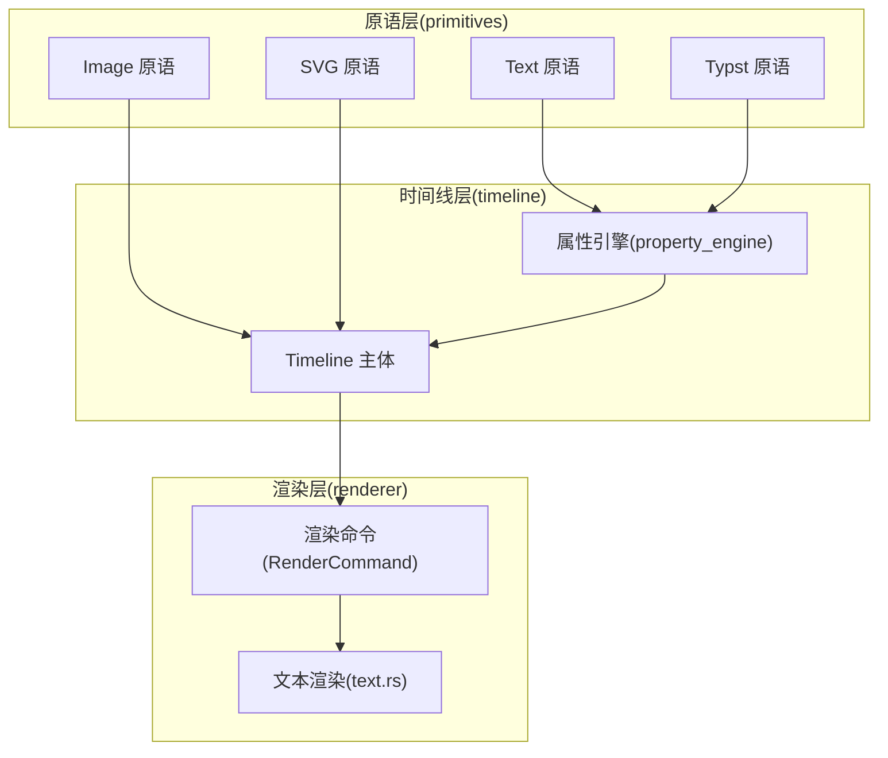
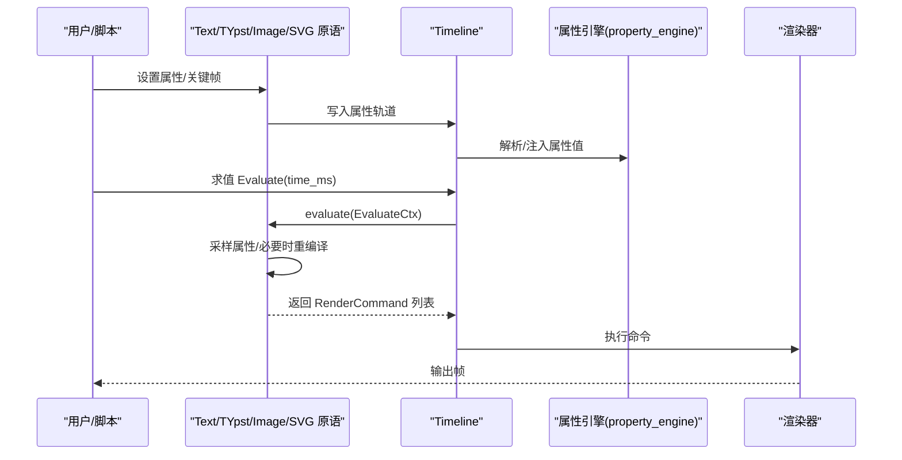
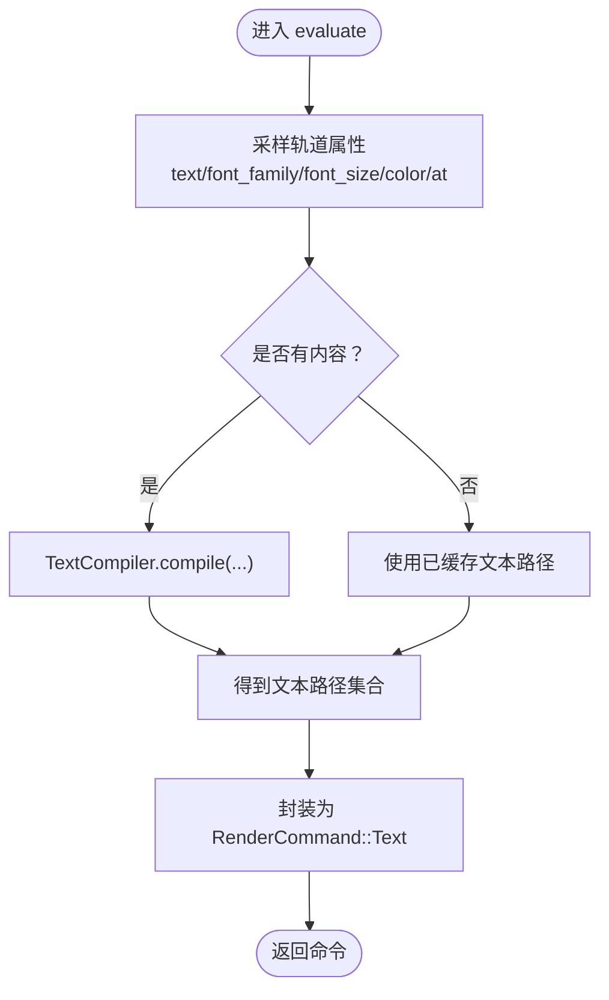
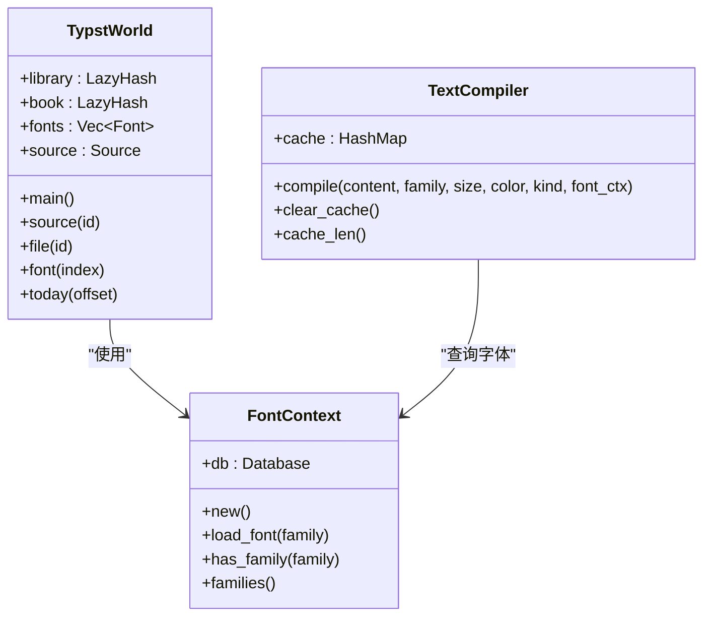
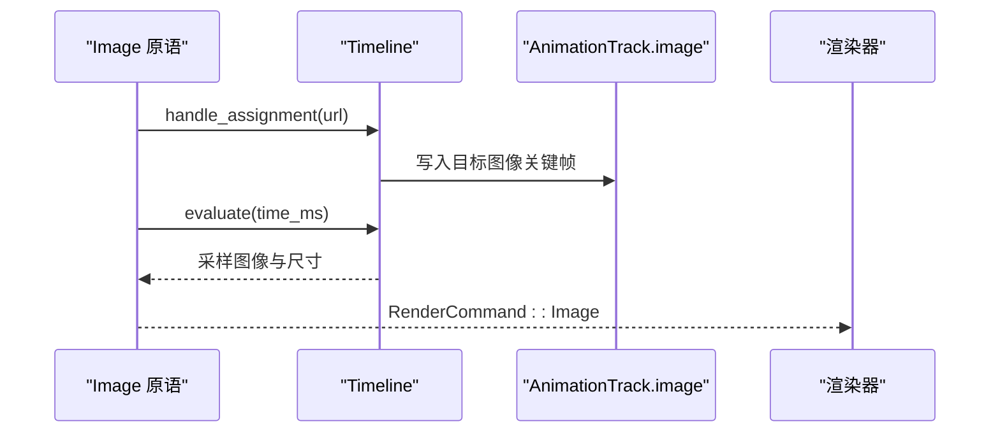
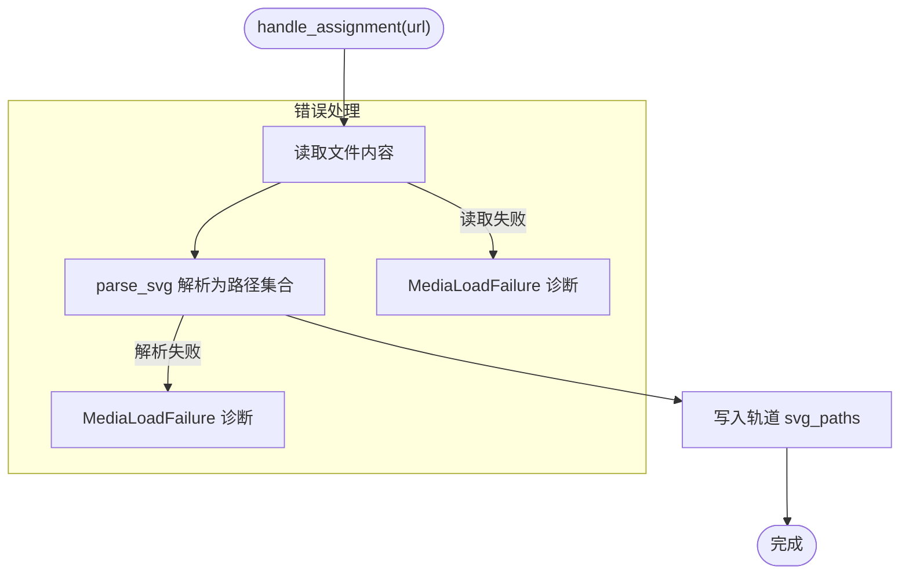
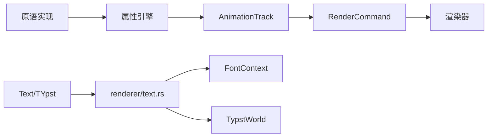

# 文本与图像原语

<cite>
**本文档引用的文件**
- [text.rs](file://crates/animatix/src/primitives/text.rs)
- [typst.rs](file://crates/animatix/src/primitives/typst.rs)
- [image.rs](file://crates/animatix/src/primitives/image.rs)
- [svg.rs](file://crates/animatix/src/primitives/svg.rs)
- [mod.rs](file://crates/animatix/src/primitives/mod.rs)
- [text.rs](file://crates/animatix/src/renderer/text.rs)
- [mod.rs](file://crates/animatix/src/timeline/mod.rs)
- [property_engine.rs](file://crates/animatix/src/timeline/property_engine.rs)
</cite>

## 目录
1. [简介](#简介)
2. [项目结构](#项目结构)
3. [核心组件](#核心组件)
4. [架构总览](#架构总览)
5. [详细组件分析](#详细组件分析)
6. [依赖关系分析](#依赖关系分析)
7. [性能考虑](#性能考虑)
8. [故障排除指南](#故障排除指南)
9. [结论](#结论)
10. [附录：示例与用法](#附录示例与用法)

## 简介
本文件聚焦 Animatix 的文本与图像原语设计与实现，系统性阐述以下主题：
- 文本原语（Text、Typst）的属性系统与运行时重编译机制
- Typst 引擎的集成与高质量排版能力
- 图像原语（Image、SVG）的加载、渲染与矢量图形支持
- 文本排版与图像处理的实践示例与最佳实践

## 项目结构
文本与图像原语位于 primitives 子模块中，分别由独立的原语类型实现；渲染层通过统一的命令模型与渲染器对接；时间线层负责属性管理、关键帧与运行时重编译。

图表来源
- [mod.rs:575-586](file://crates/animatix/src/primitives/mod.rs#L575-L586)
- [text.rs:15-50](file://crates/animatix/src/primitives/text.rs#L15-L50)
- [typst.rs:15-50](file://crates/animatix/src/primitives/typst.rs#L15-L50)
- [image.rs:19-45](file://crates/animatix/src/primitives/image.rs#L19-L45)
- [svg.rs:16-43](file://crates/animatix/src/primitives/svg.rs#L16-L43)
- [text.rs:548-621](file://crates/animatix/src/renderer/text.rs#L548-L621)

章节来源
- [mod.rs:1-727](file://crates/animatix/src/primitives/mod.rs#L1-L727)

## 核心组件
- 文本原语（Text）
  - 负责普通文本、LaTeX、数学公式与代码块的渲染
  - 支持运行时属性变更触发的文本路径重编译
- Typst 原语（Typst）
  - 集成 Typst 排版引擎，支持 Typst 标记语言与数学公式
  - 提供高质量排版与字体解析能力
- 图像原语（Image）
  - 加载外部图片资源，按关键帧插值与尺寸覆盖
- SVG 原语（SVG）
  - 解析本地 SVG 文件为路径集合，用于矢量图形渲染

章节来源
- [text.rs:9-121](file://crates/animatix/src/primitives/text.rs#L9-L121)
- [typst.rs:9-121](file://crates/animatix/src/primitives/typst.rs#L9-L121)
- [image.rs:13-125](file://crates/animatix/src/primitives/image.rs#L13-L125)
- [svg.rs:10-123](file://crates/animatix/src/primitives/svg.rs#L10-L123)

## 架构总览
文本与图像原语的共同特征是：构建期（Build）将属性写入时间线的关键帧轨道；运行期（Evaluate）从轨道采样并生成渲染命令；文本原语额外具备“运行时重编译”能力以响应属性变化。

图表来源
- [mod.rs:561-567](file://crates/animatix/src/primitives/mod.rs#L561-L567)
- [property_engine.rs:113-262](file://crates/animatix/src/timeline/property_engine.rs#L113-L262)
- [mod.rs:431-502](file://crates/animatix/src/timeline/mod.rs#L431-L502)

## 详细组件分析

### 文本原语（Text）
- 设计要点
  - 类型名与显示名为“Text”，分类为文本类
  - 默认属性包含位置与字体大小
  - 处理 text/latex/math/code 属性赋值，触发运行时重编译
  - 运行时根据当前时间从轨道采样文本内容与样式，生成文本路径命令
- 属性系统
  - 文本内容：text、latex、math、code
  - 字体族：font_family
  - 字号：font_size
  - 颜色：color
  - 其他：默认位置 at、默认字体大小
- 运行时重编译
  - 当属性发生变化时，通过 TextCompiler 缓存键（内容、字体族、字号、颜色、种类）避免重复编译
  - Typst 文本、数学与代码分别对应不同种类，确保缓存隔离
- 渲染流程
  - evaluate_text_paths 统一采样属性与覆盖值
  - 若有内容则调用 TextCompiler.compile 获取文本路径，否则回退到已缓存的文本路径

图表来源
- [text.rs:94-112](file://crates/animatix/src/primitives/text.rs#L94-L112)
- [mod.rs:55-100](file://crates/animatix/src/primitives/mod.rs#L55-L100)
- [text.rs:548-621](file://crates/animatix/src/renderer/text.rs#L548-L621)

章节来源
- [text.rs:15-121](file://crates/animatix/src/primitives/text.rs#L15-L121)
- [mod.rs:55-100](file://crates/animatix/src/primitives/mod.rs#L55-L100)
- [text.rs:548-621](file://crates/animatix/src/renderer/text.rs#L548-L621)

### Typst 原语（Typst）
- 设计要点
  - 分类为文本类，图标为文章样式，标记为高级原语
  - 默认属性包含位置与字体大小
  - 支持 content 属性赋值，触发运行时重编译
  - 使用 TypstWorld 与 FontContext 驱动排版，提取 Frame 并生成文本路径
- Typst 集成
  - FontContext 持久化字体数据库，避免重复扫描系统字体
  - 支持内置字体与系统字体混合加载
  - 提供 resolve_font_family 与 available_font_families 查询可用字体
- 数学与代码渲染
  - compile_math/compile_code/compile_typst 分别针对数学、代码与普通文本
  - extract_glyphs 将 Frame 中的字形路径转换为本地 TextPath，并进行居中处理
- 文本缓存
  - TextCompiler 使用 LRU 风格缓存，键包含内容、字体族、字号、颜色与种类
  - 超限时清理一半条目，避免内存无限增长

图表来源
- [text.rs:213-272](file://crates/animatix/src/renderer/text.rs#L213-L272)
- [text.rs:20-85](file://crates/animatix/src/renderer/text.rs#L20-L85)
- [text.rs:548-621](file://crates/animatix/src/renderer/text.rs#L548-L621)

章节来源
- [typst.rs:15-121](file://crates/animatix/src/primitives/typst.rs#L15-L121)
- [text.rs:14-174](file://crates/animatix/src/renderer/text.rs#L14-L174)
- [text.rs:213-272](file://crates/animatix/src/renderer/text.rs#L213-L272)
- [text.rs:274-356](file://crates/animatix/src/renderer/text.rs#L274-L356)
- [text.rs:358-479](file://crates/animatix/src/renderer/text.rs#L358-L479)
- [text.rs:548-621](file://crates/animatix/src/renderer/text.rs#L548-L621)

### 图像原语（Image）
- 设计要点
  - 分类为媒体类，图标为图片
  - 默认属性包含位置、URL 与尺寸
  - handle_assignment 仅处理 url 属性，读取目标图片并写入图像轨道
  - evaluate 从轨道采样图像与尺寸，生成 RenderCommand::Image
- 图片加载与关键帧
  - load_image 从 URL 加载图片，duration>0 时写入起始关键帧，否则按延迟策略保留
  - 支持空 URL 快速返回
- 尺寸覆盖
  - evaluate 可从覆盖映射中读取 size，优先于轨道尺寸

图表来源
- [image.rs:47-93](file://crates/animatix/src/primitives/image.rs#L47-L93)
- [image.rs:95-116](file://crates/animatix/src/primitives/image.rs#L95-L116)

章节来源
- [image.rs:19-125](file://crates/animatix/src/primitives/image.rs#L19-L125)

### SVG 原语（SVG）
- 设计要点
  - 分类为媒体类，图标为矢量样式，标记为高级原语
  - 默认属性包含位置、URL 与尺寸
  - handle_assignment 仅处理 url 属性，读取本地 SVG 文件并解析为路径集合
  - evaluate 将路径集合封装为 RenderCommand::Paths
- SVG 解析
  - parse_svg 将 SVG 内容解析为路径集合，写入轨道
  - 错误处理包含读取失败与解析失败两类诊断

图表来源
- [svg.rs:45-98](file://crates/animatix/src/primitives/svg.rs#L45-L98)

章节来源
- [svg.rs:16-123](file://crates/animatix/src/primitives/svg.rs#L16-L123)

## 依赖关系分析
- 原语到时间线
  - 原语在 build 阶段通过 process_text_actor_decl/process_media_actor_decl 将属性写入轨道
  - 属性写入由属性引擎统一调度，保证类型安全与默认值注入
- 原语到渲染器
  - evaluate 返回 RenderCommand，渲染器执行命令并绘制
  - 文本原语通过 evaluate_text_paths 与 TextCompiler 协作
- 文本渲染子系统
  - FontContext 提供字体查询与缓存
  - TypstWorld 实现 World trait，驱动 Typst 编译
  - extract_glyphs/extract_shapes 将排版结果转为本地几何

图表来源
- [mod.rs:561-567](file://crates/animatix/src/primitives/mod.rs#L561-L567)
- [property_engine.rs:113-262](file://crates/animatix/src/timeline/property_engine.rs#L113-L262)
- [text.rs:213-272](file://crates/animatix/src/renderer/text.rs#L213-L272)

章节来源
- [mod.rs:431-502](file://crates/animatix/src/timeline/mod.rs#L431-L502)
- [property_engine.rs:113-262](file://crates/animatix/src/timeline/property_engine.rs#L113-L262)

## 性能考虑
- 文本缓存
  - TextCompiler 使用 HashMap 缓存编译结果，键包含内容、字体族、字号、颜色与种类
  - 当缓存超过阈值时，删除一半条目，避免内存膨胀
- 字体加载
  - FontContext 持久化字体数据库，避免重复扫描系统字体带来的开销
- 图像与 SVG
  - 图像与 SVG 在构建期解析一次，运行期直接采样轨道，避免重复 IO
- 命令执行
  - RenderCommand::execute 将路径填充与描边操作委托给渲染器，减少原语内部复杂度

## 故障排除指南
- 文本无法渲染或为空
  - 检查 text/latex/math/code/content 是否为空字符串
  - 确认 font_family 是否可解析，必要时使用 available_font_families 查询
- 图片加载失败
  - 检查 url 是否有效，确认文件存在且可读
  - 查看 MediaLoadFailure 诊断信息定位具体原因
- SVG 解析失败
  - 检查 SVG 文件格式是否正确，查看解析错误诊断
- 字体缺失
  - 使用 resolve_font_family 或 available_font_families 确认字体可用性
  - 如需自定义字体，可在 FontContext 中添加

章节来源
- [text.rs:147-174](file://crates/animatix/src/renderer/text.rs#L147-L174)
- [image.rs:80-91](file://crates/animatix/src/primitives/image.rs#L80-L91)
- [svg.rs:73-96](file://crates/animatix/src/primitives/svg.rs#L73-L96)

## 结论
Animatix 的文本与图像原语通过统一的原语接口与时间线属性系统，实现了从构建到渲染的完整链路。文本原语利用 Typst 引擎与 TextCompiler 缓存，兼顾了高质量排版与运行时性能；图像与 SVG 原语则提供了稳定的媒体加载与矢量渲染能力。整体架构清晰、扩展性强，适合进一步丰富文本样式与图像处理功能。

## 附录：示例与用法
- 文本原语
  - 设置文本内容与字体大小：设置 text 与 font_size，默认位置 at
  - 使用 LaTeX/数学/代码：设置 latex/math/code 属性，触发运行时重编译
- Typst 原语
  - 设置 content 属性，使用 Typst 标记语言进行高质量排版
  - 自定义字体族：通过 font_family 指定字体，系统会自动解析可用字体
- 图像原语
  - 设置 url 属性加载图片，支持关键帧动画与尺寸覆盖
- SVG 原语
  - 设置 url 属性加载本地 SVG 文件，解析为路径集合进行渲染

章节来源
- [text.rs:114-121](file://crates/animatix/src/primitives/text.rs#L114-L121)
- [typst.rs:114-121](file://crates/animatix/src/primitives/typst.rs#L114-L121)
- [image.rs:118-125](file://crates/animatix/src/primitives/image.rs#L118-L125)
- [svg.rs:116-122](file://crates/animatix/src/primitives/svg.rs#L116-L122)